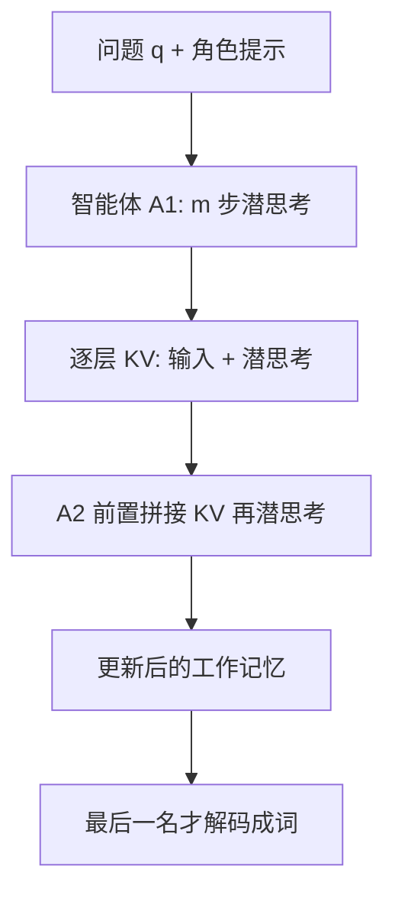

# LatentMAS：多智能体别再把想法写成词，把 KV 当工作记忆传过去

<!-- release-date: 2025-11-25 -->

**本文依据**：`Latent Collaboration in Multi-Agent Systems`，arXiv:2511.20639v4（[cs.CL] 3 Aug 2026），35 页。第一作者 Jiaru Zou（Project Lead），封面脚注 **1 = Princeton University**、**2 = Stanford University**、**3 = UIUC**；共同核心贡献者 Ruizhong Qiu、Gaotang Li、Xiyuan Yang、Katherine Tieu、Pan Lu。通讯 Jingrui He、James Zou、Mengdi Wang、Ling Yang。代码 `github.com/Gen-Verse/LatentMAS`。首发日取 arXiv v1 提交日 **2025-11-25**。封面页脚另印 `Proceedings of the 43rd International Conference on Machine Learning, Seoul, South Korea. PMLR 306, 2026`（后作录用行，不回写首发日）。文中数字都标 PDF 页码；标「外部补充」的段落不来自本文。

## 一句话

现有 LLM 多智能体系统（MAS）把自然语言当唯一媒介：每个智能体先把内部想法解码成词，下一个智能体再把这些词重新编码。本文提出 **LatentMAS**：智能体在最后一层隐状态上自回归「潜思考」，再用逐层 KV cache 当共享工作记忆传给下家，全程免训练。摘要写：相对单模型和文本 MAS，最高准确率 **+14.6%**，输出 token 少 **70.8%–83.7%**，端到端推理快 **4×–4.3×**（PDF p. 1）。图 1 是分层 MAS、9 个基准、3 个模型尺度的封面结果：准确率平均 **+13.3%**、token 平均少 **83.7%**、速度平均 **×4.3**（PDF p. 1）。

## 一、矛盾：协作为什么必须「说出来」

多智能体把单模型推理扩成系统级协作：规划、批评、求解、汇总。主流做法里，**文本是共同语**——内部思路靠词承载，智能体之间也靠词通信（PDF p. 2）。

潜空间这边已经有两条线，但还没合到一起（PDF p. 2）：

- 单模型内部的潜 CoT：用隐状态当连续思考，不解码（如 Hao 等 Coconut）。
- 跨模型传 KV 或层嵌入：少重编码，但仍不是「想 + 传」同一套。

作者问的是一句更硬的话：**MAS 能不能纯潜协作？** 三个原则（PDF p. 2）：

1. **推理表达力**：连续隐状态一步能装的语义，比离散 token 多。
2. **通信保真**：工作记忆保住输入和潜思考，下家不必再读一遍文本。
3. **协作复杂度**：同样表达力下，潜协作比文本 MAS 便宜。

上图根据 PDF 图 3 / 第 3 节重画，是机制示意，不是实测曲线。

评测只固定两种常见拓扑，不把方法绑死在某一种架构上（PDF p. 3，图 2）：

- **顺序 MAS**：Planner → Critic → Refiner → Solver，链上交接。
- **分层 MAS**：Code / Math / Science 专家各自想，Summarizer 聚合。

## 二、每个智能体怎么在隐空间里「往下想」

记 Transformer $f_\theta$，输入嵌入 $W_\mathrm{in}$、输出头 $W_\mathrm{out}$，隐维 $d_h$，层数 $L$。前 $t$ 步嵌入 $E\in\mathbb{R}^{t\times d_h}$，过完 $L$ 层得到末层 $H$（PDF p. 2）。普通生成是：

$$
f_\theta(x_{t+1}\mid x_{\le t})=\mathrm{softmax}(h_t W_\mathrm{out})
$$

潜思考把 **$h_t$ 直接当下一步输入嵌入**，不再走词表。重复 $m$ 步，得到 $H=[h_{t+1},\ldots,h_{t+m}]$，这就是该智能体的潜思考（PDF p. 3）。

直接把末层塞回浅层会 OOD。免训练的修补是一次线性对齐（公式 3，PDF p. 3–4）：

$$
e=h W_a,\qquad W_a\approx W_\mathrm{out}^\dagger W_\mathrm{in}
$$

$W_a\in\mathbb{R}^{d_h\times d_h}$ 每个 run 算一次、全程复用。正文例子：$d_h=1024$（Qwen3-0.6B）。附录把目标写成最小化 Wasserstein 上界 $\|\beta W_\mathrm{out} W_a-W_\mathrm{in}\|_F$，闭式再加岭回归 $\lambda I$（公式 32–35，PDF p. 15–17）。

**定理 3.1**（线性表征假设，附录 B.1）：若长度 $m$ 的潜思考能被文本无损表达，文本长度至少 $\Omega(d_h m/\log|V|)$（PDF p. 4）。Remark 3.2 据此写 Qwen3-4B / 8B / 14B 的「表达效率」倍数 **235.7 / 377.1 / 471.4**——这是信息论下界换算，不是墙上时钟（PDF p. 4）。

## 三、工作记忆：把整层 KV 交给下一家

文本 MAS 把自然语言拼进下一家的 prompt。这里没有词可拼。$A_1$ 做完 $m$ 步后，抽出全部 $L$ 层 cache（公式 4，PDF p. 5）：

$$
M_{A_1}=\bigl\{(K^{(l)}_{A_1,\mathrm{cache}},V^{(l)}_{A_1,\mathrm{cache}})\bigr\}_{l=1}^{L}
$$

每层 cache 长度是 $t+m$：既有题目，也有刚生成的潜思考。$A_2$ 生成前把 $M_{A_1}$ **按层前置拼接**到自己的 KV（HuggingFace `past_key_values`）。$A_2$ 的新潜思考因此同时条件于 $A_1$ 的记忆和自己的内部状态（PDF p. 5）。

**定理 3.3**：收到前驱工作记忆，与把前驱输出当真输入再算一遍，各层隐状态等价——所以传 KV 而不是传 $h$ 再重算（PDF p. 5，证明 PDF p. 18）。

链上只 **最后一名解码成文本**。其余智能体只传记忆（PDF p. 5）。

**定理 3.4**：单智能体时间 $\mathcal{O}((d_h^2 m+d_h m^2+d_h tm)L)$。若文本 MAS 要达到定理 3.1 的同等表达力，复杂度多出 $d_h^3$、$1/\log|V|$ 和词表项（PDF p. 5，证明 PDF p. 19）。方法对顺序、分层或其他拓扑无绑定（PDF p. 5）。

## 四、实验怎么摆：9 基准、5 骨干、两种拓扑

9 个基准（PDF p. 5，附录 C.1）：GSM8K、AIME24/25（各 30 题）、GPQA-Diamond（198 题）、MedQA、ARC-E/C、MBPP-Plus、HumanEval-Plus。骨干：Qwen3 **4B / 8B / 14B**，Llama-3.2-3B-Instruct 与 Llama-3.1-8B-Instruct（PDF p. 5）。对照：单模型；顺序 TextMAS（chain-of-agents）；分层 TextMAS（专家 + summarizer）。

实现（PDF p. 5–6）：$m\in\{0,10,20,40,80\}$；温度 **0.6**、top-p **0.95**；三次独立运行取均值。最大输出：ARC/GSM8K **2048**，MedQA/代码 **4096**，GPQA **8192**，AIME **20000**（正文拼写 ARC-Eacy、Humaneval+）。硬件 **8×A100-80G**。另接 vLLM 前缀缓存与张量并行。

正文 4.1 节汇总（PDF p. 6）：相对单模型，顺序 / 分层平均准确率 **+14.6% / +13.3%**；相对同拓扑 TextMAS 再 **+2.8% / +4.6%**。同架构下端到端平均 **4× / 4.3×**；token 少 **70.8% / 83.7%**。Llama 放到附录 D.2。

注意：**14.6% 是相对 Single 的顺序设定平均值**，不是每一格都对 TextMAS 涨那么多。表 1 里若干格 LatentMAS 略低于 TextMAS，以表格为准。

### 表 1 顺序 MAS、6 个通用任务（PDF p. 6）

Qwen3-4B：

| 任务 | 指标 | Single | TextMAS | LatentMAS | 相对 TextMAS |
|---|---|---:|---:|---:|---|
| ARC-E | Acc. | 95.4 | 96.4 | 98.6 | ↑ 2.2 |
| ARC-E | Token | 724 | 2420 | 581 | ↓ 76.0% |
| ARC-E | Speed | 369 | 2874 | 512 | ×5.6 |
| ARC-C | Acc. | 89.2 | 90.0 | 92.3 | ↑ 2.3 |
| GSM8K | Acc. | 82.4 | 89.8 | 88.2 | ↓ 1.6 |
| MedQA | Acc. | 47.7 | 65.3 | 66.3 | ↑ 1.0 |
| MBPP+ | Acc. | 63.5 | 69.8 | 73.5 | ↑ 3.7 |
| HumanEval+ | Acc. | 75.0 | 79.7 | 79.9 | ↑ 0.2 |

Qwen3-8B 顺序：ARC-E Acc. TextMAS **99.1** vs LatentMAS **98.8**（↓ 0.3）；GSM8K **92.3 → 93.8**；MBPP+ **69.5 → 74.6**；HumanEval+ 两者都 **80.5**（PDF p. 6）。

Qwen3-14B 顺序：HumanEval+ **81.1 → 86.5**（↑ 5.4）；ARC-C **95.9 → 95.6**（↓ 0.3）；ARC-E Token **1670 → 224**（↓ 86.6%）（PDF p. 6）。

图 4：顺序设定平均 **×4.0**、token 少 **70.8%**（PDF p. 6）。正文 4.2 相对 vLLM 加速后的 TextMAS 仍 **2.6×–7×**；潜步常少于 50，而 AIME 文本 CoT 常超过 20K token（PDF p. 7）。token 相对 TextMAS 少 **59.4%–87.9%**，相对单模型少 **15.0%–60.3%**——最后一名主要聚合潜思考，不必把整条文本 CoT 再写一遍（PDF p. 7）。

### 表 2 难推理：AIME 与 GPQA（PDF p. 7）

顺序、Qwen3-8B：AIME24 Acc. **50.0 / 53.3 / 56.7**（Single / Text / Latent），Token **12891 / 38596 / 8953**（↓ 76.8%），Speed ×4.1。AIME25 Acc. Text 与 Latent 都是 **53.3**。GPQA **39.9 / 43.4 / 45.5**，Speed ×6.8。

顺序、Qwen3-14B：AIME24 **63.3 / 63.3 / 66.7**；AIME25 **56.7 / 60.0 / 63.3**；GPQA **48.5 / 51.5 / 52.0**。

分层、Qwen3-8B：AIME24 Acc. Text 与 Latent 都是 **53.3**；GPQA **43.0 → 46.9**（↑ 3.9），Token ↓ 84.9%，Speed ×7.7。分层 14B：AIME24 **70.0 → 73.3**；AIME25 两者 **66.7**；GPQA **52.0 → 53.0**。

### 表 3 分层 MAS、6 个通用任务（附录 D.1，PDF p. 22）

Qwen3-4B 分层并非格格都赢：ARC-E **97.1 → 96.8**、ARC-C **92.5 → 91.7**、GSM8K **89.4 → 88.4**；MedQA **65.0 → 67.3**、HumanEval+ **76.2 → 79.3**。token 降幅普遍在 **80%** 以上。Qwen3-14B 分层 HumanEval+ **84.1 → 86.6**，MedQA Token **5473 → 899**（↓ 83.6%），Speed ×6.1。

图 10 分层效率：平均 ×4.3、token ↓ 83.7%（PDF p. 23），与封面图 1 同一口径。

### 表 4 Llama（附录 D.2，PDF p. 23）

Llama-3.1-8B 顺序：ARC-E **89.6 → 91.2**；分层 MedQA **64.3 → 67.7**（↑ 3.4）。Llama-3.2-3B 分层 MedQA **50.3 → 50.0**（↓ 0.3）——跨家族趋势在，不是每格单调。

表 5 只量最后一名的解码长度：相对 TextMAS 平均再少 **29.1%**（PDF p. 24）。例如分层口径下 8B ARC-C **685 → 344**，14B MedQA **1303 → 899**。

## 五、潜思考是不是「真在想」

MedQA **300** 题：LatentMAS **40** 潜步，TextMAS 最大 **4096** token（PDF p. 7）。图 5：末层嵌入与文本 token 嵌入落在同一片区域，但覆盖更宽（PDF p. 8）。表 6 平均两两余弦（越低越散）：TextMAS 4B/8B/14B 为 **0.126 / 0.142 / 0.155**，LatentMAS **0.104 / 0.093 / 0.108**（PDF p. 25）。

图 6–7、图 11：$h_t$ 偏离 $e_t$，对齐后 $e_{t+1}$ 拉回去。三个任务上 $W_a$ 带来 **2.3%–5.3%** 准确率（PDF p. 8）。

图 8：Qwen3-14B 上加深潜步，准确率在约 **40–80** 步见顶，再深会平台或掉——正文因此用中等预算，不做任务特训（PDF p. 9）。

表 7 混合消融，Qwen3-8B（PDF p. 25–26）：

| 方法 | GSM8K | MBPP+ | MedQA |
|---|---:|---:|---:|
| 潜推理 + 文本通信（只传最后 128 个解码 token） | 85.5 | 66.4 | 65.9 |
| 文本推理 + 潜通信 | 90.1 | 68.0 | 71.2 |
| 完整 LatentMAS | 93.8 | 74.6 | 75.3 |

两条缺一不可。

**Debug mode**（附录 F）：同一上下文并行出潜思考和可读文本，潜思考仍传给下家，文本只当探针。Qwen3-14B、GSM8K、100 对标注（80 对 / 20 错）：终答对时中间文本 **96.2%（77/80）** 也对；终答错时中间文本 **90.0%（18/20）** 也错（表 8，PDF p. 26）。附录 I 的失败例：Refiner 把娃娃价格写成「3 个手办 **加** 1 辆车」，Solver 跟着错（PDF p. 28）。探针可靠不等于潜状态对人完全可解释。

## 六、没写开的边界

附录 G（PDF p. 27）：为免训练，默认 **所有智能体 Transformer 层形状相同**。异构要用层映射 / 模型汤一类可训适配器，本文没做。后训练去优化潜协作协议也只是展望。

定理 3.1 吃线性表征假设；「无损」是相对「把同一份 KV 再喂一遍」，不是相对人类可读证明。表 1/3 里常识题上 TextMAS 有时略高，主收益在 token 与延迟。AIME 只有 30 题，↑ 3.4 对应约一题，方差大。

## 七、可迁移的几条

1. **协作瓶颈常常是编解码，不是角色数。** 先问：这条信息是否必须变成词。
2. **KV 已经是工作记忆。** 跨智能体拼接 cache，比把 CoT 写进 prompt 更接近「接着算」。
3. **末层当下一步输入时要对齐。** 一次 $W_a$ 比再训一个 latent head 便宜；图 7 说明不对齐会掉点。
4. **潜步有饱和区。** 40–80 比「无限加深」更像可用配方。
5. **潜协作要留一条可读旁路。** Debug mode 把审计和主路径拆开，值得在系统里做成开关。

## 关键词回看

- **潜思考（latent thoughts）**：末层隐状态自回归序列，不进词表。
- **输入–输出对齐 $W_a$**：把 $h$ 映回 $W_\mathrm{in}$ 空间的一次线性（岭）映射。
- **潜工作记忆**：逐层 KV，长度 $t+m$，前置拼到下一家。
- **顺序 / 分层 MAS**：链上四角色 vs 领域专家 + 汇总。
- **TextMAS**：同拓扑、同骨干，但想和传都走文本。

## 参考资料

- 原件：`readings/_src/注意力与长上下文/LatentMAS.pdf`（arXiv:2511.20639v4）
- 项目：https://github.com/Gen-Verse/LatentMAS
