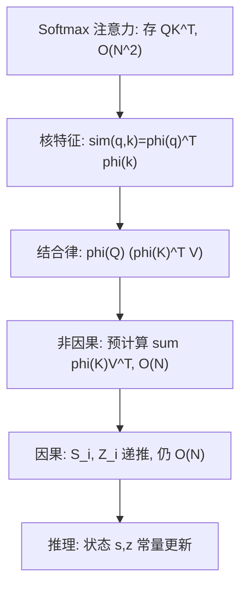

# Linear Attention：把注意力改成核特征点积之后，Transformer 就是 RNN

<!-- release-date: 2020-06-29 -->

**本文依据**：`Transformers are RNNs: Fast Autoregressive Transformers with Linear Attention`，arXiv 2006.16236v3（[cs.LG] 31 Aug 2020），17 页。作者 Angelos Katharopoulos、Apoorv Vyas、Nikolaos Pappas、François Fleuret。封面第一单位 **Idiap Research Institute**；另有 EPFL、University of Washington、University of Geneva。封面印了 Proceedings of the 37th International Conference on Machine Learning, Online, PMLR 119, 2020。代码站点 `https://linear-transformers.com/`。首发日取 arXiv v1 提交日 2020-06-29。文中数字都标 PDF 页码；标「外部补充」的段落不来自本文。

## 一句话

Softmax 注意力要存整张 $N\times N$ 矩阵，训练和自回归推理都是 $O(N^2)$。本文把相似度换成核特征映射的点积，再用矩阵乘法结合律，把注意力改成「先把所有 $\phi(K)^\top V$ 加起来，再和每个 $\phi(Q)$ 点一下」——复杂度变成 $O(N)$。因果掩码下，累加和就是 RNN 的隐状态，**每步解码常数量计算、常量内存**。CIFAR-10 像素级生成上，表 2 相对 Softmax 吞吐是 **4462 倍**（PDF p. 7）；摘要写的「up to 4000x」和正文「三个数量级」都是对这张表的取整，以表为准。

## 一、矛盾：全局感受野买到了，二次复杂度付不起

Transformer 的好处来自自注意力的全局感受野，坏处也来自它（PDF p. 1）：处理长度为 $N$ 的输入，时间和内存都是 $O(N^2)$。结果是训练慢、上下文短，时间连贯性被切断，长期依赖也难抓。

当时已经有两条路，但都没把**自回归推理**变快（PDF p. 1–2）：

- Sparse Transformer 把注意力矩阵稀疏分解，复杂度降到 $O(N\sqrt{N})$。
- Reformer 用局部敏感哈希（LSH），降到 $O(N\log N)$，但要求 **Key 必须等于 Query**，解码任务用不了。
- Transformer-XL 把上一窗的记忆拿来续上下文，渐进复杂度仍是二次。
- 剪枝、量化、蒸馏能加速，但渐进复杂度还是 $O(N^2)$。

本文要同时做到三件事（PDF p. 1）：

1. 注意力时间和内存对 $N$ 线性；
2. 因果掩码也线性、训练时还能并行；
3. 自回归推理改成 RNN 步进，比逐位置重算注意力快几个数量级。

上图根据 PDF p. 3–5 的公式 4–20 重画，是机制示意，不是实测曲线。

## 二、先把 Softmax 注意力写成「任意非负相似度」

记号跟论文 3.1 节（PDF p. 3）。输入 $x\in\mathbb{R}^{N\times F}$，一层是残差加逐位置前馈：

$$
T_l(x)=f_l(A_l(x)+x)
$$

$A_l$ 是唯一跨位置的部分。三个投影得到 $Q,K,V$，标准 Softmax 注意力是

$$
A_l(x)=\mathrm{softmax}\Bigl(\frac{QK^\top}{\sqrt{D}}\Bigr)V
$$

把「指数点积」换成任意非负相似度 $\mathrm{sim}(\cdot,\cdot)$，第 $i$ 个位置的输出是（公式 3，PDF p. 3）

$$
V'_i=\frac{\sum_{j=1}^{N}\mathrm{sim}(Q_i,K_j)V_j}{\sum_{j=1}^{N}\mathrm{sim}(Q_i,K_j)}
$$

只要 $\mathrm{sim}$ 非负，这就是合法的注意力。核 $k(x,y):\mathbb{R}^{2\times F}\to\mathbb{R}_+$ 都满足这条。

## 三、线性化：特征映射 + 结合律

若核有有限维特征 $\phi$，则 $\mathrm{sim}(Q_i,K_j)=\phi(Q_i)^\top\phi(K_j)$，公式 3 变成（公式 4–5，PDF p. 3）

$$
V'_i=\frac{\phi(Q_i)^\top\sum_{j=1}^{N}\phi(K_j)V_j^\top}{\phi(Q_i)^\top\sum_{j=1}^{N}\phi(K_j)}
$$

关键一步是**先算与 $i$ 无关的两个和** $\sum_j\phi(K_j)V_j^\top$ 和 $\sum_j\phi(K_j)$，再对每个 query 做一次点积。向量写法是（公式 6）

$$
\bigl(\phi(Q)\phi(K)^\top\bigr)V=\phi(Q)\bigl(\phi(K)^\top V\bigr)
$$

Softmax 必须物化 $N\times N$ 注意力矩阵才能反传，时间和内存都是 $O(N^2)$。线性注意力把那两个和算一次、每个 query 复用，时间和内存都是 $O(N)$（PDF p. 3）。

### 计算量怎么数

论文把乘加次数写清楚了（PDF p. 3–4）：

| 形式 | 乘加阶 | 备注 |
|---|---|---|
| Softmax | $O\bigl(N^2\max(D,M)\bigr)$ | $D$ 是 Q/K 维，$M$ 是 V 维 |
| 线性注意力（特征维 $C$） | $O(NCM)$ | 先映射再累加 |
| 二次多项式核的精确特征 | $O(ND^2 M)$ | 当 $N>D^2$ 才划算 |
| 本文实验用的 $\phi$ | $O(NDM)$ | 见下一小节 |

精确 Softmax 对应的指数核特征是无穷维，**没法原样线性化**。多项式核有有限维特征，Tsai 等人（2019）显示它和指数 / RBF 核效果接近——这是论文引用，不是本文实验。

### 实验里实际用的 $\phi$

序列还没长到「$N>D^2$」那种尺度，作者用（公式 7，PDF p. 4）

$$
\phi(x)=\mathrm{elu}(x)+1
$$

选 ELU 而不是 ReLU，是为了 $x$ 为负时梯度不为零。它保证相似度非负，乘加是 $O(NDM)$。后文所有图像和语音实验都用这个映射，没有换别的核。

## 四、因果掩码：递推两个累加和

自回归训练要把位置 $i$ 能看见的范围裁到 $j\le i$（公式 8–9，PDF p. 4）：

$$
V'_i=\frac{\phi(Q_i)^\top\sum_{j=1}^{i}\phi(K_j)V_j^\top}{\phi(Q_i)^\top\sum_{j=1}^{i}\phi(K_j)}
$$

定义两个前缀和（公式 10–12）

$$
S_i=\sum_{j=1}^{i}\phi(K_j)V_j^\top,\qquad Z_i=\sum_{j=1}^{i}\phi(K_j),\qquad V'_i=\frac{\phi(Q_i)^\top S_i}{\phi(Q_i)^\top Z_i}
$$

$S_i$、$Z_i$ 都可以从 $i-1$ 用常量时间更新，所以**带因果掩码仍然对 $N$ 线性**。

朴素实现会把所有中间 $S_i$ 存下来反传，内存再乘 $\max(D,M)$，长序列和深层模型就撑不住。附录把分子的梯度写成累加和（公式 13–15，PDF p. 4；推导在 PDF p. 11–12）：对 $Q$ 的梯度沿时间向前累加，对 $K$、$V$ 的梯度沿时间向后累加，和 RNN 的 BPTT 同一方向。给定 $C$ 维特征，前向加反向是 $O(NCM)$ 时间、$O\bigl(N\max(C,M)\bigr)$ 内存。伪代码是论文 Algorithm 1（PDF p. 5）。常量内存梯度大约 200 行 CUDA（PDF p. 5）。

### 训练并行、推理常量化

训练时整条真值序列都在，层内和注意力都可以并行，这点 Transformer 比 RNN 强。推理时第 $i$ 步的输出是第 $i+1$ 步的输入，没法并行；普通 Transformer 每步还要对已生成前缀做一次注意力，**单步代价随当前长度二次增长**（PDF p. 4）。

线性注意力两边都要：训练仍可并行；推理只存 $\phi(K_j)V_j^\top$ 当内部状态、每步常量更新，论文原话是推理可以快「thousands of times」（PDF p. 4）。具体倍数看第七节的表，不以这句口号为准。

## 五、标题那句话：带因果掩码的 Transformer 就是 RNN

文献里常把 Transformer 和 RNN 当成两条路。因果形式说明：任意带因果掩码的 Transformer 层，都可以写成「读入、改内部状态、再输出」——也就是 RNN（PDF p. 5）。这里的循环是**对时间**，不是 Universal Transformer 那种对深度。

两个隐状态：注意力记忆 $s$ 和归一化记忆 $z$（公式 16–20，PDF p. 5）

$$
s_0=0,\quad z_0=0
$$

$$
s_i=s_{i-1}+\phi(x_i W_K)\,(x_i W_V)^\top
$$

$$
z_i=z_{i-1}+\phi(x_i W_K)
$$

$$
y_i=f_l\Bigl(\frac{\phi(x_i W_Q)^\top s_i}{\phi(x_i W_Q)^\top z_i}+x_i\Bigr)
$$

这个写法**不限制 $\phi$**。理论上连 Softmax 注意力也能看成 RNN，只是 Softmax 对应无穷维特征，状态没法有限存。论文把这一定式当成理解 Transformer 如何存取信息的第一步，没有再往 LSTM 门控上套。

## 六、合成任务：收敛、显存、耗时

对照两条基线（PDF p. 5）：完整 Softmax Transformer，以及 Reformer（文中记 `lsh-X`，$X$ 是哈希轮数）。Reformer 用公开代码的 PyTorch 重写，**不用 reversible 层**——只测注意力层显存，不影响结论。线性模型一律用 $\phi(x)=\mathrm{elu}(x)+1$。

### 复制任务

因果复制：最长 128、10 种符号加分隔符，4 层 8 头，batch 64，RAdam，学习率 $10^{-3}$，3000 步后降到 $10^{-4}$（PDF p. 5–6）。图 2 显示线性注意力收敛平滑，终损与 Softmax 持平，低于 LSH——论文归因于哈希引入的噪声。

### 前向 + 反向的时间和显存

序列长度 $N\in\{2^9,\ldots,2^{16}\}$，batch 与 $N$ 成反比，报每个样本的时间和峰值显存（PDF p. 6 图 1）。卡是 GTX 1080 Ti、11 GB。每种方法跑到显存装不下为止：Softmax 最长 4096，lsh-4 / lsh-8 最长 16384。Softmax 二次；线性与 Reformer 都近似线性（Reformer 理论 $O(N\log N)$，实验里 $\log N$ 还不够大）。图上线性注意力在所有配置里都更快、更省显存。图是曲线，文中没有再给逐点毫秒数。

## 七、图像生成：质量几乎打平，吞吐差在表上

像素级自回归，bits/dim 与 Softmax 同量级，但生成「超过 1000 倍」且从第一像素到最后一像素每图内存恒定（PDF p. 6）。恒定的原因是层间只需存公式 18–19 的 $s_i$、$z_i$。附录另加一条 **stateful-softmax**：把已算的 K、V 存起来下一步复用，状态大小仍随序列涨，和本文固定维状态不是一类（PDF p. 12）。

### MNIST（表 1，PDF p. 7）

8 层 8 头，嵌入 256（每头 32），FFN 是嵌入的 4 倍，输出 10 个 logistic 混合（PixelCNN++ 那套）。RAdam 学习率 $10^{-4}$，250 epoch。序列 784 像素，各方法 batch 都是 10。Reformer：1 或 4 轮哈希，64 bucket，783 长序列切成 27 块、每块 29。

| 方法 | Bits/dim | Images/sec |
|---|---|---|
| Softmax | 0.621 | 0.45（1×） |
| LSH-1 | 0.745 | 0.68（1.5×） |
| LSH-4 | 0.676 | 0.27（0.6×） |
| Linear | 0.644 | 142.8（317×） |

线性 bits/dim 比 Softmax 差 0.023，吞吐高 317 倍。论文说单卡能同时生成 10000 张 MNIST，因为内存不随已生成长度涨。图 3 的无条件样本边界清楚、无噪声；补全能跟上原图笔触（PDF p. 7–8）。各模型困惑度接近，定性差异不大。

### CIFAR-10（表 2，PDF p. 7）

16 层，每层配置同 MNIST。序列大约是 MNIST 的 4 倍。Softmax 在作者最大的卡（NVIDIA P40，24 GB）上只能 batch 1；线性和 Reformer 用 batch 4。全部训练 **7 天**。Reformer：64 bucket、83 块 × 37 元素（约 32，按 Reformer 原文建议）。

| 方法 | Bits/dim | Images/sec |
|---|---|---|
| Softmax | 3.47 | 0.004（1×） |
| LSH-1 | 3.39 | 0.015（3.75×） |
| LSH-4 | 3.51 | 0.005（1.25×） |
| Linear | 3.40 | 17.85（4462×） |

表注写「4000×」，正文写「每生成一张 Softmax 图，本方法能生成 4460 张」（PDF p. 7）。**以单元格 17.85 / 0.004 = 4462 为准**；摘要 4000x 和「三个数量级」是同一数字的约写。7 天预算下线性跑完的 epoch 大约是 Softmax 的 3 倍，bits/dim 反而略好（3.40 对 3.47）。图 4 补全能补上狗鼻子、卡车挡风玻璃这类局部（PDF p. 8）。

### 附录里多出来的两条对照

表 4 把 stateful-softmax 插进来（PDF p. 13）：MNIST 吞吐 7.56（16.8×），CIFAR-10 0.32（80×）；线性仍是 142.8 和 17.85。CIFAR-10 上线性比 stateful-softmax 还快 **50 倍以上**（附录原文）。Reformer 不好做成同类 stateful：每次新输入都要重新排序和分块。

表 5 测 batch=1 的单张延迟（PDF p. 13），越低越好：

| 方法 | MNIST CPU / GPU（秒） | CIFAR-10 CPU / GPU（秒） |
|---|---|---|
| Softmax | 72.6 / 10.2 | 8651.4 / 300.1 |
| Stateful-softmax | 7.4 / 10.4 | 71.9 / 70.4 |
| LSH-1 | 46.0 / 19.2 | 2318.9 / 221.6 |
| LSH-4 | 112.0 / 55.8 | 5263.7 / 683.9 |
| Linear | 5.5 / 7.3 | 45.1 / 61.3 |

batch=1 时 GPU 都吃不满，吞吐远低于表 4。CIFAR-10 上线性 GPU 延迟相对 Softmax 约 6.6 倍（300.1 / 61.3）。线性是表里**唯一 CPU 全面快于 GPU** 的方法：RNN 式注意力本身太便宜，瓶颈变成必须串行的外层循环（PDF p. 13）。

附录 D 看样本：无条件生成各模型差不多；Reformer 无条件样本多样性明显更少；补全比无条件容易（PDF p. 13）。

## 八、非自回归：WSJ 语音识别

为证明线性注意力不绑在自回归上，用 CTC 做端到端音素识别（PDF p. 7–8）。80 小时 WSJ，40 维 mel filterbank、不加时差。平均 800 帧，最长 2400 帧。对照：3 层隐层 320 的双向 LSTM（Adam，$10^{-3}$）；Transformer 9 层 6 头，嵌入维与图像实验相同（RAdam，初始 $10^{-4}$，验证误差不降则学习率除以 2）。

表 3（PDF p. 8）：

| 方法 | Validation PER | Time/epoch（秒） |
|---|---|---|
| Bi-LSTM | 10.94 | 1047 |
| Softmax | 5.12 | 2711 |
| LSH-4 | 9.33 | 2250 |
| Linear | 8.08 | 824 |

线性 PER 好于 LSTM 和 Reformer，差于 Softmax（5.12）。每个 epoch 比 Softmax 快 **3 倍以上**（2711 / 824）。附录图 5c：同样墙钟时间里线性大约多跑 4 倍 epoch，但 Softmax 收敛仍明显更好；线性相对 Reformer 的收敛和最终 PER 都更好（PDF p. 12）。

## 九、限制、没写的，以及可迁移的

论文自己划的边界：

- **特征映射是启发式。** 实验固定 $\mathrm{elu}(x)+1$，没有系统扫核。结论里建议用随机傅里叶特征逼近 RBF，好接 Softmax 预训练权重——只是展望，本文没做（PDF p. 8）。
- **语音上没打过 Softmax。** 表 3 里质量赢家仍是完整注意力；线性赢的是 epoch 时间。
- **Reformer 对照关掉了 reversible。** 只影响「注意力层显存」那张合成图的解读，不影响图像 / 语音的 bits 与 PER。
- **没有语言建模主实验。** 任务是复制、MNIST / CIFAR 像素、WSJ CTC。标题里的 RNN 视角是因果注意力的代数改写，不是「用线性注意力训 GPT」。
- 并发工作 Shen et al. 把线性注意力用在检测；本文额外做了因果线性复杂度、常量内存训练与推理，以及「每个 Transformer 都可以看成 RNN」这一观察（PDF p. 2）。

可迁移的几条，不依赖 2020 年的具体数据集：

1. **二次开销来自物化 $QK^\top$，不来自「有注意力」本身。** 能写成 $\phi(Q)^\top\phi(K)$ 就可以把 $N$ 从平方里提出来。
2. **自回归推理的正确状态不是「整段 KV」，而是固定大小的 $s$、$z$。** 后面 StreamingLLM、线性 RNN、状态空间模型走的是同一条「常量状态」路，来源不同。
3. **训练并行和推理常量化可以同时成立**，前提是前缀和能在序列维上向量化，梯度也写成前向 / 反向 cumsum，而不是存下所有 $S_i$。
4. **口号倍数以表为准。** 摘要 4000x 对的是 CIFAR 表 2 的 4462×，不是 MNIST 的 317×，更不是语音的 3× epoch。

## 关键词回看

- **线性注意力（linear attention）**：用核特征点积代替 Softmax，结合律把 $N\times N$ 变成对 $N$ 的一次扫描。
- **特征映射 $\phi$**：本文实验是 $\mathrm{elu}(x)+1$，保证非负相似度，维数与 $D$ 同阶。
- **因果前缀和 $S_i,Z_i$**：掩码注意力的充分统计量，步进更新即 RNN。
- **注意力记忆 / 归一化记忆**：公式 16–20 里的 $s$ 和 $z$；推理时层间只带这两块。
- **stateful-softmax（附录）**：缓存 K、V 的 Softmax 步进，状态仍随 $N$ 涨，用来说明「光缓存不够，还要有限维特征」。

## 参考资料

- 原论文 PDF：`readings/_src/注意力与长上下文/Linear-Attention.pdf`（arXiv 2006.16236v3，ICML 2020）
- 作者项目页：`https://linear-transformers.com/`（论文 PDF p. 5 给出）
