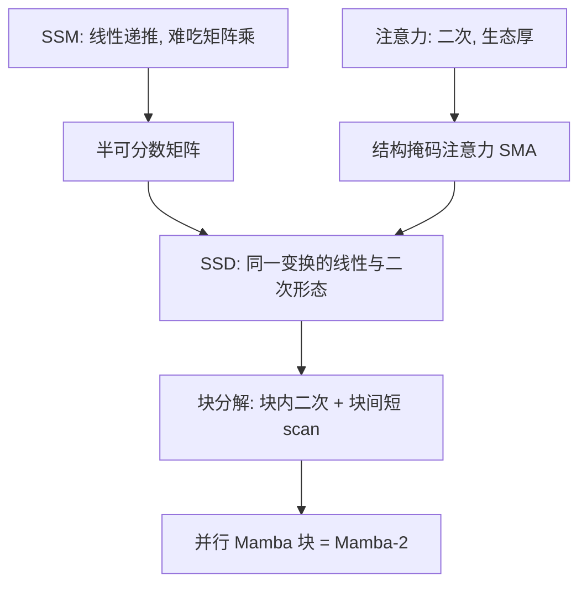

# Mamba-2：把 SSM 写成半可分数矩阵，才能又当递推又当注意力

<!-- release-date: 2024-05-31 -->

**本文依据**：`Transformers are SSMs: Generalized Models and Efficient Algorithms Through Structured State Space Duality`，arXiv 2405.21060v1（[cs.LG] 31 May 2024），52 页。作者 Tri Dao、Albert Gu（封面注明按姓氏字母序）。封面第一单位 **Princeton University**（Department of Computer Science）；第二单位 Carnegie Mellon University（Machine Learning Department）。封面**没有会议名**。代码与权重 `https://github.com/state-spaces/mamba`（PDF p. 3）。首发日取 arXiv v1 提交日 2024-05-31。文中数字都标 PDF 页码；标「外部补充」的段落不来自本文。Mamba-1 与线性注意力只作对照，细节以各篇自己的解读为准。

## 一句话

Mamba 一类选择 SSM 训练近线性、推理常量化，但递推吃不到 GPU 矩阵乘单元，状态维一加大就慢。本文把 SSM 写成半可分数矩阵，与带结构掩码的注意力对偶，块分解后对角块走二次注意力、块间走短递推，得到 **SSD** 算法与 **Mamba-2** 块。摘要写核心层相对 Mamba 选择 scan **2–8×** 更快（PDF p. 1）；引言写状态可到 Mamba 的 **8×** 或更高、相对 FlashAttention-2 在长度 **2K** 交叉、**16K** 时 **6×**（PDF p. 2）。下游表是 **Mamba-2-2.7B** 常识平均 **60.2**，高于 Mamba-2.8B 的 **59.9**、Pythia-2.8B 的 **55.7**，也高于 Pythia-6.9B 的 **58.3**（表 10，PDF p. 52）。以表为准。

## 一、矛盾：SSM 和注意力各算各的，硬件与生态都接不上

解码器 Transformer 训练长度二次、自回归还要线性涨的 KV cache（PDF p. 1）。结构化 SSM（S4、Mamba）训练近线性、生成常量化，小到中等规模上已经能打语言建模，但社区对注意力的理论、算子与并行栈几乎搬不过来。结果是：SSM 更难懂、更难试，也更难训到和 Transformer 一样快（PDF p. 1）。

线性注意力已经给过一次对偶：二次核注意力等于一种线性递推，所以既能并行训练又能常量化推理（Katharopoulos 等 2020；PDF p. 1）。本文标题是向那篇「Transformers are RNNs」致敬；作者自己写明，对偶只连到**某些口味**的注意力，不是全部 softmax 注意力（脚注 1，PDF p. 1）。

选择 SSM（Mamba 的 S6）比 LTI 更能按内容写入或丢掉，但只能走递推，即便硬件感知 scan 也用不上矩阵乘单元（PDF p. 4）。本文要同时做三件事（PDF p. 1–3）：

1. 用结构化矩阵把 SSM 和注意力变体连成一张图；
2. 给出吃 tensor core 的 SSD 算法，状态还能再做大；
3. 把注意力生态里的头结构、张量并行搬进一块可堆的 Mamba-2。

上图根据图 1 与 PDF p. 2–3 重画，是机制示意，不是实测曲线。

## 二、先把 SSM 写成「沿时间的一张矩阵」

文中 **SSM 专指结构化 SSM**。离散选择形式（公式 2，PDF p. 3）：

$$
h_t=A_t h_{t-1}+B_t x_t,\qquad y_t=C_t^\top h_t
$$

LTI 时 $A,B,C$ 不随 $t$ 变，等价全局卷积；选择时只能递推。连续参数与离散化沿用 Mamba，后文为简化**直接写离散参数**（注记 1，PDF p. 3–4）。

序列变换把 $X\in\mathbb{R}^{(T,P)}$ 映到同形状 $Y$；$P=1$ 是单通道， $P>1$ 则按通道广播，后文把 $P$ 当头维（定义 2.1–2.2，PDF p. 4）。展开递推得到矩阵形态（公式 3，PDF p. 7）：

$$
y=M x,\qquad M_{ji}=C_j^\top A_j\cdots A_{i+1} B_i
$$

这张 $M$ 不是普通密矩阵。

**半可分数（semiseparable）**：下三角里任意子块秩至多 $N$（定义 3.1，PDF p. 7）。**顺序半可分数（SSS）** 正好就是上面那条 $M_{ji}$ 公式（定义 3.2）。定理 3.5：状态维 $N$ 的 SSM 就是 $N$-SS 矩阵乘（PDF p. 9）。作者调侃：structured state space 与 sequentially semiseparable 缩写撞车，所以 SSM / SSS / SS 在文中可以互换指这件事（PDF p. 9）。

$N=1$ 时，$M_{ji}$ 是标量乘积链，乘向量就是

$$
y_t=a_t y_{t-1}+x_t
$$

文中叫标量 SSM 递推或 **cumprodsum**（公式 6–7，PDF p. 8–9）。附录 B 把许多 scan 算法都收成对这张 1-SS 矩阵的不同分解（PDF p. 9、37 起）。

计算上两条路（PDF p. 10–11）：

- **线性（递推）**：对角结构化时，把输入用 $B$ 扩到状态、对 $N$ 路做 1-SS、再用 $C$ 收（公式 8）。$N$-SS 矩阵 $O(NT)$ 参数、矩阵–向量 $O(NT)$（命题 3.6）。
- **二次（朴素）**：把 $M$ 物化成 $(T,T)$ 再乘。$T$ 短时常数更好，还能走矩阵乘；标量结构的 $A$ 时，这条路看起来就像二次注意力（PDF p. 11）。

中心句：算 SSM 的不同方法，就是半可分数矩阵的不同乘法算法（PDF p. 2）。

## 三、从另一头：结构掩码注意力

单头注意力是 $(Q,K,V)\mapsto Y$（公式 9，PDF p. 12）。核注意力把 softmax 的指数看成特征映射 $\varphi$，归一化可先丢掉（后文 7.3 再加回来）。带掩码时（公式 10–12，PDF p. 13）：

$$
Y=(L\circ(QK^\top))V
$$

这是四路张量收缩。二次算法按「先 $QK^\top$、再乘 $L$、再乘 $V$」缩（公式 13）；线性注意力换顺序：先 $V$ 与 $K$ 扩特征，再让 $L$ 作用在扩开的轴上，最后用 $Q$ 收（公式 15，PDF p. 14）。因果掩码时，$L$ 乘向量就是 cumsum，于是每步常量（命题 4.1）。

**结构掩码注意力（SMA）**：只要 $L$ 是结构化矩阵（亚二次乘法），同一套四路收缩就有二次与线性两种算法（定义 4.2，PDF p. 14）。例子（图 3，PDF p. 15）：因果掩码是线性注意力；衰减掩码 $L_{ij}=\gamma^{i-j}$ 是 RetNet；还可以是 Toeplitz 或傅里叶矩阵。SSD 对应的是 **1-半可分数掩码**。

## 四、对偶：标量–单位 SSM = 1-SS 掩码注意力

令 $A_j=a_j I$（标量乘单位阵），则（PDF p. 16）

$$
M=L\circ(CB^\top),\qquad L=\mathrm{1SS}(a)
$$

二次物化 $M$ 就是带掩码的核注意力，只是 $C\leftrightarrow Q$、$B\leftrightarrow K$、$X\leftrightarrow V$。

反过来，1-SS SMA 的线性形态，是对角 SSM 里对角线全相同的特例（推论 5.1，PDF p. 17）。定理 5.2：有界阶的高效自回归 SMA，掩码必须是半可分数（证明附录 C.2，PDF p. 17、49）。

作者把这一大块交叫 **结构化状态空间对偶（SSD）**（第 5.3 节，PDF p. 17）。图 4 左侧把 $C/B/X/A$ 与 $Q/K/V/L$ 对齐；右侧画谱系：S4、S4D、S5、S6、RetNet、TransNormer、GateLoop、线性注意力都落在附近，交点才是 SSD（PDF p. 17 图 4）。

二次形态相对 softmax 注意力只改两处（PDF p. 6、35）：去掉 softmax；注意力矩阵再点乘输入相关的 1-SS 掩码 $L$。$a_t\in[0,1]$ 的连乘控制位置 $i$ 与 $j$ 之间传多少信息，作者把它看成**数据相关的相对位置掩码**，用来替换启发式位置编码。文中点名注意力汇（attention sink）一类 softmax 病，但**没有**在 Mamba 上测汇是否存在（PDF p. 6、35）。

SSD **不**包含一般 softmax 注意力，也不包含没有有限特征映射 $\psi$ 的核（PDF p. 35）。相对二次注意力的好处是状态维 $N$ 可控、压缩历史，而不是缓存整段 $T\gg N$。

相对 Mamba 的选择 SSM，SSD 把 $A_t$ 收得更死：标量–单位而不是一般对角。一般对角理论上同样线性，但对偶二次不再像注意力、更难吃硬件。作者明确这是**表达力换硬件友好与实现简单**（PDF p. 34）。

## 五、SSD 算法：对角块走注意力，块间走短 scan

定理 6.1（PDF p. 17）：状态扩张 $N$、头维 $P=N$ 时，存在算法训练 FLOP $O(TN^2)$、推理 FLOP $O(TN)$、推理内存 $O(N^2)$，工作量主要由矩阵乘构成。这些界是紧的：总状态 $N^2$，输入已有 $TN$ 个元素。

做法：把 $M$ 切成 $Q\times Q$ 块（PDF p. 18）。对角块是更短的自相似 SSM，短 $Q$ 时用二次 SMA，且各块并行。严格下三角块因半可分数而低秩，拆成三因子（图 5，PDF p. 20）：

1. **右因子（$B$）**：块内假设初态为 0，算出块末状态，形状每块 $(N,P)$；
2. **中因子（$A$）**：在块间对这批状态做长度 $T/Q$ 的 1-SS，得到真正的块边界状态；
3. **左因子（$C$）**：假设块内输入为 0，只靠正确初态写出块内输出。

对角块输出加上块间输出即整段 $Y$。Listing 1 是完整 PyTorch（PDF p. 21）：`segsum` 用 cumsum 差做出 1-SS 的对数域下三角，再 `exp`；默认 `block_len=64`。作者强调相对 Mamba 的通用选择 scan，这段原生 PyTorch 已经相对好写、相对快，不必一上来就写底层核（PDF p. 18）。

令 $N=P=Q$，各批矩阵乘都变成 $\mathrm{BMM}(T/N,N,N,N)$：总 FLOP $O(TN^2)$、内存 $O(TN)$，主体是 $(N,N)$ 乘（PDF p. 22）。块间 scan 长度缩 $Q$ 倍，相对纯 Mamba scan 便宜一个 $Q$；实现里相对其它步可忽略。

文中对照表（PDF p. 22）：注意力状态随 $T$、训练 $T^2 N$；朴素 SSM 与 SSD 都是状态 $N$、训练 $TN^2$、推理 $N^2$；差别是朴素 SSM 要物化 $TN^2$ 且不吃矩阵乘，SSD 内存 $TN$ 且吃矩阵乘。

## 六、Mamba-2 块：并行投影、多值头、额外 Norm

SSD 框架让注意力里的头、并行套路能直接翻译到 SSM（第 7 节，PDF p. 22–25）。

**块外形**（图 6，PDF p. 23）。Mamba-1 把选择 SSM 看成 $X\mapsto Y$，$A,B,C$ 是 $X$ 的函数，投影在扩维之后、串行。Mamba-2 把层看成 $(A,X,B,C)\mapsto Y$，四个量在块开头一次投影出来，对上注意力里并行的 $Q,K,V$。参数略少，更重要的是能按 Megatron 切张量并行（PDF p. 23）。块末、门乘之后、输出投影之前加一层 Norm（LayerNorm / GroupNorm / RMSNorm），对标 NormFormer；位置与 RetNet / TransNormerLLM 那种「线性注意力之后立刻 Norm」不同，本文在门之后（PDF p. 23）。

**头结构**（定义 7.1，PDF p. 24）。总宽 $D$，头数 $H$，状态维 $N$ 与头维 $P$ 常钉在约 64 或 128，模型变大只加头。四种对齐：

| SSM 头 | 注意力类比 | 谁按头复制 |
|---|---|---|
| 多头 MHS | MHA | $A,B,C,X$ 都按头 |
| 多收缩 MCS | MQA | $C$ 按头；$X,B$ 共享 |
| 多扩张 MES | MKA | $B$ 按头；$C,X$ 共享 |
| 多输入 MIS | 多值注意力 MVA | $X$（和 $A$）按头；$B,C$ 共享 |

命题 7.2：Mamba 的 S6 是头维 $P=1$（每通道独立 $A$）加上 MIS / MVA（$B,C$ 在通道间共享）（PDF p. 24–25）。Mamba-2 默认仍是 MVA：$B,C$ 单头共享给各 $X$ 头（图 6）。分组版本 GIS / GVA 对应 GQA，方便张量并行切分（PDF p. 25）。

**核映射**。默认 $\psi$ 是逐点 Swish / SiLU，打在 $B,C$（也可对称打在 $X$）。softmax 分母可把 $X$ 多一列全 1 再跑同一 SSD（PDF p. 25）。消融里这些近似大多没有赢过简单逐点激活，故默认跟着 Mamba-1 用 Swish；作者甚至建议**去掉激活**可能更简单，但没有充分试（PDF p. 33）。

## 七、系统：张量并行、序列并行、变长

第 8 节（PDF p. 25–28）。

**张量并行**。Mamba-1 里 $\Delta,B,C$ 依赖卷积后的 $x_c$，切两卡要先 all-reduce 拼回 $x_c$，一块里通信点是 Transformer 的两倍（PDF p. 26）。Mamba-2 从输入 $u$ 直接投影 $\Delta,B,C$，每卡自己一组；块内 GroupNorm 的组数能被 TP 度数整除，于是一块只在输出投影后一次 all-reduce，和注意力 / MLP 块一样（图 7 左，PDF p. 27）。引言概括：每块同步点减半（PDF p. 3）。

**序列 / 上下文并行**。残差与 Norm 的 SP 与 Transformer 相同（Korthikanti 等）。token 混合侧：注意力的 query 块要和所有 key 块交互，通信相对 worker 数二次；SSM 把序列切开，每卡带着初态算完交出末态给下一卡，通信对 worker **线性**，就是 SSD 块分解本身（图 7 右，PDF p. 27–28）。

**变长**。不必右填充。把一个 batch 当成一条长序列，在样本边界把 $A_t=0$，状态不串到下一条（PDF p. 28）。

## 八、合成：多查询联想回忆

MQAR 要在上下文里记多组键值再按键取回，有限状态的 SSM 一直吃亏（PDF p. 28）。本文用更难变体：非查询/键/值位置换成随机 token，键值对数更多、序列更长、模型更小（附录 D.1，PDF p. 50）。长度 $T\in\{256,512,1024\}$，各 $T/4$ 对，词表 8192；课程式从 $T/32$ 加到 $T/4$ 对。2 层；扫宽 $\{32,64,128,256\}$ 与学习率。图 8（PDF p. 28）：Mamba（$N=16$）明显弱于注意力；Mamba-2 把 $N$ 拉到 64、256 后显著好于 Mamba-1，图注写甚至好于原版注意力。这是「对偶换来更大状态」的直接证据，不是语言建模表。

## 九、语言建模：缩放、零样本、混合层

设置镜像 Mamba / GPT-3 宽深，Pile，Chinchilla；细节附录 D（PDF p. 50–51）。对照 Mamba 与 Transformer++（RoPE、SwiGLU、RMSNorm、无 linear bias、更高学习率）。H3、Hyena、RWKV-4、RetNet 因 Mamba-1 已比过，图里省略（PDF p. 30）。

表 9（PDF p. 51）：125M / 12 层 / $d=768$ / 4800 步 / 2.5B token；350M / 24 / 1024 / 13500 / 7B；760M / 24 / 1536 / 29000 / 15B；1.3B / 24 / 2048 / 50000 / 26B。batch 一律 0.5M token。AdamW，clip 1.0，wd 0.1，无 dropout。改进 recipe：峰值 lr 为 GPT-3 的 5 倍、余弦收到 $1\times 10^{-5}$、无 linear bias、RMSNorm、$\beta=(0.9,0.95)$。

图 9（PDF p. 29）：约 125M–1.3B，Mamba-2 匹配或超过 Mamba 与 Transformer++；图注写在困惑度、理论 FLOP 与墙钟时间上对 Transformer 基线帕累托占优。曲线本身是图，正文没有逐点数字。

下游另训 **300B token**，GPT-NeoX 词表，与 Pythia 对齐（PDF p. 51）。2.7B 跟 GPT-3：32 层、维 2560；1.3B 与 2.7B 的 batch 改为 1M。任务比 Mamba-1 多 ARC-easy。表 1 是节选，**完整数字在表 10**（PDF p. 29、52）。引言「Mamba-2 2.7B 超过 Mamba-2.8B、Pythia-2.8B 甚至 Pythia-6.9B」对的是这张同数据同词表设定（PDF p. 3）。常识平均（acc↑）：

| 模型 | Pile ppl↓ | 平均 acc↑ |
|---|---|---|
| Mamba-2-130M | 10.48 | 42.6 |
| Mamba-130M | 10.56 | 42.4 |
| Pythia-160M | 29.64 | 39.0 |
| Mamba-2-370M | 8.21 | 49.0 |
| Mamba-370M | 8.28 | 48.7 |
| Pythia-410M | 9.95 | 45.6 |
| Mamba-2-780M | 7.26 | 53.5 |
| Mamba-790M | 7.33 | 53.0 |
| Pythia-1B | 7.82 | 49.0 |
| Mamba-2-1.3B | 6.66 | 56.4 |
| Mamba-1.4B | 6.80 | 56.4 |
| Pythia-1.4B | 7.51 | 51.7 |
| Mamba-2-2.7B | 6.09 | 60.2 |
| Mamba-2.8B | 6.22 | 59.9 |
| Pythia-2.8B | 6.73 | 55.7 |
| Pythia-6.9B | 6.51 | 58.3 |
| GPT-J-6B | — | 59.4 |
| RWKV4-7.4B | 6.31 | 59.3 |

（表 10，PDF p. 52。）同档 Mamba-2 平均略高于 Mamba；2.7B 的 60.2 高于 Pythia-6.9B 的 58.3。单任务并非处处第一：例如 780M 的 LAMBADA acc，Mamba-790M 是 **62.7**、Mamba-2-780M 是 **61.7**（表 10）。Pile ppl 只和同数据同词表比。

**混合层**。经验上大约 **10%** 层用注意力最好（PDF p. 30）。表 2（350M、48 层、7B token、GPT-2 词表，PDF p. 31）：纯 Mamba-2 困惑度 **8.60**；1–7 个注意力块落到 **8.38–8.26**；6 个最低 **8.26**；24 个回升到 **8.50**；Transformer++ **8.68**。作者猜想 SSM 做通序列映射，注意力做检索，免得把上下文全压进状态。

表 3（2.7B、64 层、300B，PDF p. 31）：

| 模型 | 结构 | Pile ppl↓ | 平均 acc↑ |
|---|---|---|---|
| Transformer++ | 32 注意力 + 32 门控 MLP | 6.13 | 60.2 |
| Mamba-2 | 64 SSD | 6.09 | 60.2 |
| Mamba-2-MLP | 32 SSD + 32 MLP | 6.13 | 59.6 |
| Mamba-2-Attention | 58 SSD + 6 注意力（下标 9, 18, 27, 36, 45, 56） | 5.95 | 61.0 |
| Mamba-2-MLP-Attention | 28 SSD + 4 注意力 + 32 MLP | 6.00 | 60.7 |

纯 Transformer++ 与纯 Mamba-2 平均同为 60.2；加 6 层注意力平均到 **61.0**、Pile **5.95**。加 MLP 质量略降，但训练推理更简单，也方便以后把 MLP 换成 MoE（PDF p. 31）。小规模实验：注意力层只要隔开、不在最前最后，精确位置影响不大（脚注 6，PDF p. 31）。

## 十、速度：2–8× 是算子，不是整模

图 10（PDF p. 29），A100 80GB PCIe。左：相对 Mamba 融合 scan（$N=64$）**2–8×**；相对 FlashAttention-2 从长度 **2K** 起更快。引言另写 16K 时相对 FA2 **6×**（PDF p. 2）——图注没有重复这个 6×，以引言与图注各自口径并存。右：长度 4K，加大状态扩张让 Mamba scan **线性变慢**，SSD 加大状态几乎不减速。

整模警告（PDF p. 31）：短序列（如 2K）上 Mamba-2 未必比 Transformer 更好训——同参数下 Transformer 约一半层是极硬件友好的 MLP，Mamba-2 则是 $L$ 层 SSD。可用一半 SSD + 一半 MLP 换短序列速度。

摘要「2–8×」对的是**核心层相对 Mamba 选择 scan**，不是端到端吞吐，也不是相对 FA2（PDF p. 1）。不要和 Mamba-1 文里 scan 相对朴素 PyTorch scan 的 20–40×、推理 4–5× 混成一个倍数。

## 十一、消融：并行投影、MVA、核近似

内层统一用 SSD，不是 Mamba-1 的 S6（表 4 注，PDF p. 32）。

表 4（PDF p. 32）：Mamba-1 式串行投影、无额外 Norm，129.3M，ppl **11.76**；串行+Norm **11.54**；并行无 Norm 126.5M **11.66**；Mamba-2 并行+Norm **11.49**。并行省参数且略好；额外 Norm 略好，作者还写更大尺度上有助于稳定（PDF p. 32）。

表 5（$N=64$，$P=64$，Chinchilla token，PDF p. 33）。总状态 $\mathrm{H}PN$ 相同。125M：MIS/MVA **11.66**；MCS/MQA **12.62**；MES/MKA **12.59**；MHS **12.06**；MSS **12.00**。360M：MVA **8.73**，MQA **9.33**，MKA **9.36**，另两种约 9.0。MVA 明显好于「看起来对称」的 MQA/MKA，不是参数或总状态能解释的。文中写 Mamba-2 从 SSM 视角保留 MVA，RetNet 等从注意力视角保留 MHA，消融认为 MVA 更好（PDF p. 36）。

表 6–7（PDF p. 33）：无激活 11.58，Swish 11.66，Exp 11.62，ReLU 11.73，ReLU+归一化 11.64，cosFormer 11.97，RFA 11.57，Performer 12.21。Based / ReBased 扩特征后并不更好（130M：Swish 11.67 vs Based 12.19；380M 且 $N=256$：Swish 8.58 vs Based 8.71）。负结果的解释：文献里的线性注意力在近似**没有** 1-SS 掩码的 softmax，加了 $L$ 之后再套那些核不一定该赢（PDF p. 33）。

## 十二、作者认的边界，以及论文没写的

第 10 节把 SSD 定位成：选择、SISO、标量–单位 $A$（PDF p. 33–34）。SISO 让有效状态 $\approx ND$，这是相对传统 RNN / MIMO 的容量来源；SSD 的卖点是状态还能再扩而不明显变慢。

相关工作里点名、但**不是本文实验对象**的：GateLoop 的输入相关衰减与二次「代理注意力」；GLA 的分块与硬件实现；Griffin / Jamba 的局部或少量注意力；HGRN2、xLSTM、RWKV-5/6 的选择与状态扩张（PDF p. 35–36）。这些只作谱系，数字以各篇为准。

明确没做或没写成结论的：

- 不是一般 softmax 注意力的推广（PDF p. 35）；
- 一般对角 $A_t$ 的同样硬件算法只是猜想（PDF p. 34）；
- 注意力汇是否出现在 Mamba 上，文中只提出问题（PDF p. 35）；
- 语言实验停在约 1.3B 缩放与 2.7B / 300B token，没有 7B 对照；
- 没有视频、音频、DNA 主实验（那些在 Mamba-1）；
- 没有公开多机数据并行配方之外的完整集群数字；TP / SP / 变长是设计与算法描述，不是大规模实测表。

## 十三、可迁移的几条

可以直接用的设计原则：

- 先问序列变换是不是「沿时间的结构化矩阵」。半可分数给出递推；换收缩顺序给出注意力；块分解给出能吃 tensor core 的第三条路。
- 选择 SSM 的二次对偶 = 去掉 softmax、再点乘输入相关 1-SS 掩码。位置信息可以进 $L$，不必另加启发式 PE。
- 短块用二次、块间用低秩状态传递：通信和 FLOP 都按状态 $N$ 而不是按 $T$。上下文并行是同一分解。
- 头结构不是对称的。KV 共享（MQA）服务的是注意力的 cache；SSM 的主输入是 $X$，对应 **MVA**。总状态相同仍可能差一整点困惑度。
- 要把 Transformer 的 TP 搬过来，数据相关投影必须能和 $X$ 一起从残差上并行切，块内 Norm 不能跨卡。
- 变长：边界 $A_t=0$ 比填充或改掩码更贴 SSM。
- 纯 SSD 与 Transformer++ 质量可以持平；少量隔开的注意力层换 ICL / 检索，大约 10% 是本文的经验点，不是定理。

依赖本文设定、不要直接当真理的：

- 2–8× 是 $N=64$ 的 SSD 算子对 Mamba 融合 scan；16K 的 6× 是对 FA2 的引言口径。
- 2.7B 平均 60.2「超过两倍 Pythia」只在表 10 的平均分与 Pile 同设定上成立。
- $A_t=a_t I$ 换来实现，丢掉了每维不同衰减。
- 核近似与 Based 类扩特征在带 $L$ 的 SSD 上是负结果，不能反过来说线性注意力文献无效。

## 关键词回看

**半可分数 / SSS**：$N$-SS 下三角子块秩 $\le N$；SSM 的 $M_{ji}=C_j^\top A_{j:i}B_i$。  
**SMA**：掩码 $L$ 为结构化矩阵的四路收缩注意力。  
**SSD**：标量–单位 $A$ 的 SSM = 1-SS 掩码注意力；线性与二次是对偶算法。  
**SSD 算法**：$Q$ 块分解；对角二次、块间低秩 scan。  
**MIS / MVA**：$B,C$ 共享，$X$ 按头；Mamba 系默认头。  
**Mamba-2 块**：并行投影 $A,X,B,C$ + 块末 Norm + 内层 SSD。  
**有效状态 $ND$ 或每头 $NP$**：SISO 扩张；SSD 让 $N$ 从 16 升到 64–256 而不按线性变慢。

## 参考资料

- 原件：`readings/_src/注意力与长上下文/Mamba-2.pdf`（arXiv 2405.21060v1）
- 代码与权重：`https://github.com/state-spaces/mamba`（PDF p. 3）
