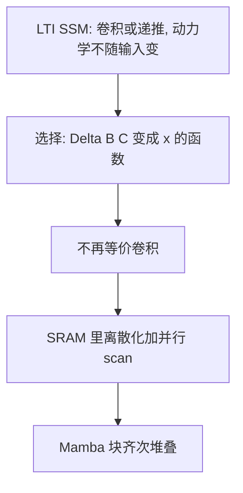

# Mamba：让状态空间按内容选信息，序列模型才能又快又长

<!-- release-date: 2023-12-01 -->

**本文依据**：`Mamba: Linear-Time Sequence Modeling with Selective State Spaces`，arXiv 2312.00752v2（[cs.LG] 31 May 2024），36 页。作者 Albert Gu、Tri Dao（封面注明按名字母序）。封面第一单位 **Carnegie Mellon University**（Machine Learning Department）；第二单位 Princeton University。封面**没有会议名**。代码与权重 `https://github.com/state-spaces/mamba`。首发日取 arXiv v1 提交日 2023-12-01。文中数字都标 PDF 页码；标「外部补充」的段落不来自本文。

## 一句话

结构化状态空间（S4 一类）训练近线性、推理常量化，但参数沿时间不变，对文本这种离散、信息密的模态选不出该记什么。本文把 $\Delta$、$B$、$C$ 改成输入的函数，状态沿序列可选择地写入或遗忘；卷积路因此断了，改用 SRAM 里的并行 scan，不把膨胀状态写回 HBM。合成进端到端块叫 **Mamba**，无注意力、也无独立 MLP。摘要写推理吞吐 **5×**、Mamba-3B 对同尺寸与两倍 Transformer；正文 4.5 节写 **4–5×**（PDF p. 15），下游表是 **Mamba-2.8B** 常识平均 **63.3**，高于 Pythia-2.8B 的 **59.1**、也高于 Pythia-6.9B 的 **61.7**（表 3，PDF p. 12）。以表与 4.5 节为准。

## 一、矛盾：有限状态要压上下文，LTI 压的是时间不是内容

基础模型几乎都是 Transformer。自注意力在窗口里密连每个位置，所以能做复杂路由；代价是窗外什么都看不见，窗口长度二次涨（PDF p. 1）。线性注意力、门控卷积、循环模型、结构化状态空间（structured SSM）都想把二次削掉，连续信号（音频、视觉）上已经能打，**文本这种离散、信息密的数据上一直不如注意力**（PDF p. 2）。

作者把问题收成一句话（PDF p. 5）：序列建模的根本是**把上下文压进更小的状态**。

- 注意力几乎不压缩：自回归推理要把整段上下文存成 KV cache，所以训练二次、单步推理随长度线性涨。
- 循环模型状态有限：训练线性、单步常量，但效果取决于状态里到底装了什么。

先前所有结构化 SSM 都是 **线性时不变（LTI）**：$\Delta, A, B, C$ 对每个时间步相同，因此等价于线性递推或全局卷积（PDF p. 3–4）。卷积核只「看时间间隔」，不看 token 内容。标准 Copying 任务间隔固定，LTI 能解；把间隔随机化（Selective Copying），或要按前文联想拷贝（Induction Heads），静态核就短路了（图 2，PDF p. 6）。

所以本文要同时做三件事（PDF p. 2）：

1. 让 SSM 参数随输入变，能按内容写入或丢掉；
2. 丢掉卷积之后，仍在 GPU 上线性、可并行地算；
3. 收成一个没有注意力、甚至没有独立 MLP 的齐次块，当通用序列骨干。

上图根据 PDF p. 2–7 重画，是机制示意，不是实测曲线。

## 二、先把 S4 写成「连续系统 → 离散递推 / 卷积」

结构化状态空间把一维序列 $x(t)\mapsto y(t)$ 经隐状态 $h(t)\in\mathbb{R}^{N}$ 传过去。四个参数 $(\Delta, A, B, C)$，两阶段（公式 1–3，PDF p. 3）：

连续：

$$
h'(t)=A h(t)+B x(t),\qquad y(t)=C h(t)
$$

离散（零阶保持 ZOH，公式 4）：

$$
\overline{A}=\exp(\Delta A),\qquad \overline{B}=(\Delta A)^{-1}(\exp(\Delta A)-I)\cdot\Delta B
$$

然后要么递推 $h_t=\overline{A}h_{t-1}+\overline{B}x_t$，要么把核 $K=(C\overline{B}, C\overline{A}\overline{B},\ldots)$ 做成全局卷积 $y=x*K$。训练用卷积并行，推理切回递推（PDF p. 3）。

结构上本文用对角 $A$（PDF p. 4）。输入形状 $(B,L,D)$，SSM **按通道独立**，有效隐状态维是 $DN$，朴素物化要 $O(BLDN)$ 时间与内存——这是后面硬件算法要躲的瓶颈。

文中 **SSM 专指 S4 及其结构化后裔**，不泛指卡尔曼、HMM 或任意带隐状态的循环（PDF p. 4）。对照用的架构（PDF p. 4）：

- 线性注意力：可看成退化的线性 SSM。
- H3：线性注意力的门夹住 S4，前面再加局部卷积（shift-SSM）。
- Hyena：H3 骨架，S4 换成 MLP 参数化的全局卷积。
- RetNet：再加一门，内部 SSM 更简单，可用一种多头注意力变体并行。
- RWKV：来自无注意力 Transformer，WKV 机制是 LTI 递推，可看成两个 SSM 的比。

这些对照只用来定位 Mamba，细节以各篇自己的解读为准。

## 三、选择机制：让 $\Delta,B,C$ 随 $x$ 变

算法 1 是普通 S4：$A,B,C,\Delta$ 没有长度维。算法 2（S6）把 $B,C$ 改成 $(B,L,N)$，$\Delta$ 改成 $(B,L,D)$，离散化后 $\overline{A},\overline{B}$ 带时间维，**只能 scan，不能卷积**（PDF p. 6）。

具体映射（PDF p. 5）：

$$
s_B(x)=\mathrm{Linear}_N(x),\quad s_C(x)=\mathrm{Linear}_N(x)
$$

$$
s_\Delta(x)=\mathrm{Broadcast}_D(\mathrm{Linear}_1(x)),\quad \tau_\Delta=\mathrm{softplus}
$$

$\Delta$ 先投到 1 维再广播到 $D$ 通道：若某个 token 该整段忽略（合成任务里的噪声位），所有通道应一起忽略（PDF p. 8）。$\tau_\Delta$ 用 softplus，是为了和 RNN 门对上。

定理 1（PDF p. 8）：当 $N=1$、$A=-1$、$B=1$、$s_\Delta=\mathrm{Linear}(x)$、$\tau_\Delta=\mathrm{softplus}$ 时，选择 SSM 的递推就是

$$
g_t=\sigma(\mathrm{Linear}(x_t)),\qquad h_t=(1-g_t)h_{t-1}+g_t x_t
$$

也就是经典 RNN 门。作者的立场是：**SSM 离散化才是启发式门控的原理基础**，不是反过来（PDF p. 8）。证明在附录 C（PDF p. 27）。

三个可操作的效应（PDF p. 8–9）：

- **变间隔**：噪声 token（口语里的 「um」）可以把 $g_t\to 0$ 滤掉。
- **滤上下文**：LTI 全局卷积会把很长一段噪声一起卷进来；选择模型可以随时重置状态，原则上越长越好（DNA 实验用来验证）。
- **边界重置**：文档打包、RL 的 episode 边界上，$\Delta_t\to\infty$ 或 $g_t\to 1$ 可以清状态；Transformer 靠注意力掩码，LTI 会串台。

各参数的人话（PDF p. 9）：大 $\Delta$ 重置状态、盯住当前输入；小 $\Delta$ 保持状态、忽略当前输入。$A$ 的选择性最终只通过 $\overline{A}=\exp(\Delta A)$ 起作用，所以**只让 $\Delta$ 选择就够带动 $(\overline{A},\overline{B})$**。$B$ 控制内容是否进状态，$C$ 控制状态是否进输出。

实现细节默认（PDF p. 9）：实数状态（音频那一组实验例外，改复数）；实数初始化 S4D-Real，$A$ 的第 $n$ 个元素 $-(n+1)$；复数则 S4D-Lin，$-1/2+ni$。$\Delta$ 的偏置按 $\tau_\Delta^{-1}(\mathrm{Uniform}[0.001,0.1])$ 初始化。$\Delta$ 的投影维可以升到 $D$ 的一小部分，等价低秩 $s_\Delta(x)=\mathrm{Linear}_D(\mathrm{Linear}_R(x))$。文中把「带选择、用 scan 算的 S4」简写成 **S6**。

附录 A 强调：选择不是「任何乘法门 / 超网络 / 数据依赖」——GLU 也满足这三词，却不沿序列交互（PDF p. 24）。选择专指**沿序列长度决定写入或忽略**。H3 / Hyena 那种架构门在通道上乘，不改 token 间距，作者认为解不了 Selective Copying（PDF p. 10；附录 A）。

## 四、硬件感知：状态只在 SRAM 里膨胀

选择毁掉卷积等价之后，朴素递推要物化 $h$ 的形状 $(B,L,D,N)$，比输入大 $N$ 倍（约 10–100）。先前 LTI 靠卷积核 $(B,L,D)$ 躲开这笔账（PDF p. 6）。

三条古典技巧叠在一起（PDF p. 7；细节附录 D，PDF p. 28）：

1. **算子融合**：不把离散化后的 $(\overline{A},\overline{B})$（大小 $(B,L,D,N)$）写回 HBM；把 $(\Delta,A,B,C)$ 从慢 HBM 读进快 SRAM，在 SRAM 里离散化、scan、乘 $C$，只把 $(B,L,D)$ 的输出写回。IO 降约 $N$ 倍。
2. **并行 scan**：递推虽非线性时不变，仍可用 work-efficient 并行前缀（Blelloch 1990 等）。
3. **重计算**：反向需要的中间状态不存，反传时再从 HBM 把输入载入 SRAM 重算。融合后的选择 scan **激活内存与带 FlashAttention 的优化 Transformer 同一量级**（PDF p. 7）。附录数字：FlashAttention 一层约 12 字节/token，MLP 约 20，合计 32；一层选择 SSM 约 16，**两层选择 SSM ≈ 一层注意力 + 一层 MLP**（PDF p. 28–29）。

FLOP 账：朴素循环 $O(BLDN)$，卷积 $O(BLD\log L)$，长序列且 $N$ 不太大时循环常数更小（PDF p. 7）。序列太长塞不进 SRAM 就切块，块间带着中间 scan 状态续算（PDF p. 28）。

图 1（PDF p. 3）画的就是这条：通道独立、$h$ 维高于 $x$，选择让动力学随输入变，膨胀状态只出现在 GPU SRAM。

## 五、Mamba 块：H3 和 MLP 合成一块齐次堆

H3 系架构一般是「类线性注意力块」与 MLP 交错。本文把两块合成 **Mamba 块** 再齐次重复（图 3，PDF p. 8），灵感来自 GAU 对注意力做过的同类合并（PDF p. 7）。

相对 H3：第一个乘法门换成激活。相对 MLP：主分支加上 SSM。激活用 **SiLU / Swish**，好让门控 MLP 对上流行的 SwiGLU。可选 LayerNorm，位置对标 RetNet（PDF p. 7）。

宽度把模型维 $D$ 扩 $E$ 倍。一块里绝大多数参数在线性层：$2ED^{2}$ 入、$ED^{2}$ 出，共 $3ED^{2}$；内部 SSM（$\Delta,B,C,A$）少得多。实验固定 $E=2$，**两块叠起来对上 Transformer 交错 MHA+MLP 的 $12D^{2}$**（PDF p. 7）。块之间是标准 Norm 与残差。

## 六、合成任务：选择拷贝与诱导头

完整协议在附录 E.1（PDF p. 29）。Selective Copying：长度 4096，词表 16（含噪声 token），要记住 16 个数据 token；2 层、$D=64$；400K 步，lr $10^{-4}$，batch 64。

表 1（PDF p. 11）：无门 S4 准确率 **18.3**；无门但 S6 **97.0**。H3+S4 **57.0**，Hyena **30.1**，H3+S6 **99.7**。Mamba 块配 S4 **56.4**、配 Hyena **28.4**、配 S6 **99.8**。结论：架构门只帮一点，**层内改成 S6 才真正解**。

Induction Heads：2 层，训练长度 256，词表 16；Mamba 的 $D=64$，其余模型 128。测试从 $2^{6}=64$ 拉到 $2^{20}=1048576$。表 2 / 表 11（PDF p. 11、29）：Mamba（74K 参数）在所有测试长度上完美外推，**比训练长度长 4000 倍**；注意力变体因显存在 $2^{14}=16384$ 之后 OOM，且刚过训练长度就垮；H3、Hyena 过 $2\times$ 后也掉到随机附近。位置编码里 xPos 略好，仍远不如选择 SSM。

## 七、语言建模：缩放律与零样本

设置镜像 GPT-3 宽深，Pile 上按 Brown 等 recipe；细节附录 E.2（PDF p. 29–31）。缩放律用 Chinchilla 协议，约 **125M–1.3B**（图 4，PDF p. 11）。对照：普通 GPT-3 式 Transformer；**Transformer++**（RoPE、SwiGLU、RMSNorm、无 linear bias、更高学习率，来自 PaLM / LLaMa 实践）；以及 Hyena、H3++、RWKV、RetNet。图注：Mamba 是第一个无注意力模型对上很强的 Transformer++，序列变长时更明显。上下文 8k 上 RWKV、RetNet 因实现效率 OOM 或算不动，图不完整（PDF p. 11）。

表 12 规格（PDF p. 30）：125M / 12 层 / $d=768$ / 4800 步 / 2.5B token；350M / 24 / 1024 / 13500 / 7B；760M / 24 / 1536 / 29000 / 15B；1.3B / 24 / 2048 / 50000 / 26B。batch 一律 0.5M token（1.3B 相对 GPT-3 原 1M 改小）。优化 AdamW，clip 1.0，wd 0.1，无 dropout。Mamba 用「改进 recipe」：峰值 lr 为 GPT-3 的 5 倍、余弦收到 $10^{-5}$、无 linear bias、RMSNorm、$\beta=(0.9,0.95)$。

下游表 3（PDF p. 12）是另一套：扩到 **300B token**，tokenizer 换成 GPT-NeoX，与 Pythia、RWKV 对齐（Mamba / Pythia 上下文 2048，RWKV 1024）。Pile ppl 只和同数据同词表比。Mamba-2.8B 常识平均 **63.3**，Pythia-2.8B **59.1**（差约 4 点，对应引言「4 points」，PDF p. 2），Pythia-6.9B **61.7**、GPT-J-6B **63.0**、OPT-6.7B **62.9**、RWKV-7.4B **62.5**。摘要写的「Mamba-3B」在这张表里是 **2.8B**；「匹配两倍尺寸」在平均分上甚至略超 Pythia-6.9B，以表为准。

各档同尺寸对照（表 3，只列平均 acc）：Mamba-130M **44.7** vs Pythia-160M **40.6**；Mamba-370M **50.0** vs Pythia-410M **48.2**；Mamba-790M **57.1** vs Pythia-1B **51.9**；Mamba-1.4B **59.7** vs Pythia-1.4B **55.2**、RWKV-1.5B **54.3**。

附录图 9（PDF p. 31）：Mamba 与 MLP 交错略差、仍强于除 Transformer++ 外的模型；与 MHA 交错只略好——作者觉得意外，因为先前 LTI SSM+注意力常有大增益。Hyena→Hyena+ 的训练 recipe 改进很大；内部 LTI 核（Hyena vs S4）几乎无差；线性注意力 head dim=8 有帮助，呼应「扩大状态维」这条主线。

## 八、DNA：长度真的在帮，而不是多算了几次

跟 HyenaDNA 同一套：HG38，训练约 **45 亿**碱基（PDF p. 12）。预训练是因果 next-token。

模型规模（图 5 左，PDF p. 13）：上下文钉死 $2^{10}=1024$，参数约 **200K–40M**，全局 batch 1024（每步约 $2^{20}\approx 1$M token），10K 步共 **10B** token。约 40M 时，曲线显示 Mamba 用大约 **3×–4× 更少参数**对上 Transformer++ 与 HyenaDNA。

上下文规模（图 5 右）：模型钉在 6 层 × 宽 128（约 1.3M–1.4M），长度 $2^{10}$ 到 $2^{20}=1048576$，20K 步约 **330B** token，长序列有 warmup。Mamba 的预训练困惑度随上下文变长而降，直到 1M；HyenaDNA 变差。作者解释：LTI 不能忽略噪声，超长卷积核把整段噪声聚在一起（PDF p. 13）。他们特别写：HyenaDNA 自称越长越好，但原实验**没有控制计算量**（PDF p. 13；附录 B.5）。

下游改成五类大猿（人、黑猩猩、大猩猩、猩猩、倭黑猩猩）分类，基因组约 **99%** 相同，比 HyenaDNA 原 {人、狐猴、鼠、猪、河马} 难（PDF p. 13）。表 13（PDF p. 34），随机 20%：

| 模型 | 参数 | $2^{10}$ | $2^{12}$ | $2^{14}$ | $2^{16}$ | $2^{18}$ | $2^{20}$ |
|---|---|---|---|---|---|---|---|
| HyenaDNA | 1.4M | 28.04 | 28.43 | 41.17 | 42.22 | 31.10 | 54.87 |
| Mamba | 1.4M | 31.47 | 27.50 | 27.66 | 40.72 | 42.41 | 71.67 |
| Mamba | 7M | 30.00 | 29.01 | 31.48 | 43.73 | 56.60 | 81.31 |

短上下文并不稳赢；到 1M，1.4M 的 Mamba 到 **71.67**，7M 到 **81.31**。只取序列最后一个位置做分类头；微调时 batch 不随长度缩小，所以越长越贵（PDF p. 33）。

DNA 预训练数据切法与 HyenaDNA 不同：HyenaDNA 每个 epoch 固定 34021 条、不一定扫完整基因组；本文 $L\le 2^{17}$ 时按 $L$ 切满约 4.5B token/epoch，$L>2^{17}$ 时每段变两条、token 数随 $L$ 涨（PDF p. 32）。学习率：Transformer / HyenaDNA 全尺寸 2e-3，Mamba 最优 8e-3，匹配 2e-3 时已经更好，更高仍稳（PDF p. 33）。

## 九、音频：连续信号上选择不是免费午餐

骨干跟 SaShiMi：U-Net 两级 pooling（每级 $p$ 倍、宽 $D$ 翻倍），级内原是 S4+MLP，换成 Mamba 块（PDF p. 14）。

YouTubeMix：约 4 小时钢琴，16 kHz。长度从 $2^{13}=8192$ 到 $2^{20}\approx 10^{6}$，**计算量固定**。最长实际受 60 秒 × 16000 Hz = 960000 限制（PDF p. 14）。Mamba 与 SaShiMi 都随上下文变好，Mamba 全程更好、越长差距越大。指标 bits per byte（BPB），是 NLL 的 $\log 2$ 倍。**全文唯一改用复数参数化的实验**（PDF p. 14）。

附录图 10（PDF p. 35）：在长音频波形上，S4→S6 **会明显变差**——均匀采样、很平滑的信号吃 LTI 的归纳偏置。消掉选择后块内是 S4，文中叫 **Mamba-S4** 以别于默认 Mamba-S6。只改 U-Net 最内层、外层保持 Mamba-S4 时差距缩小：靠近原始波形的层该 LTI，压成「token」之后内层不必。即便如此，实数 SSM 仍不如复数。

SC09：1 秒、16 kHz、数字 0–9，说话人差异大。表 4（PDF p. 15）：

| 模型 | 参数 | NLL↓ | FID↓ | IS↑ | mIS↑ | AM↓ |
|---|---|---|---|---|---|---|
| SampleRNN | 35.0M | 2.042 | 8.96 | 1.71 | 3.02 | 1.76 |
| WaveNet | 4.2M | 1.925 | 5.08 | 2.27 | 5.80 | 1.47 |
| SaShiMi | 5.8M | 1.873 | 1.99 | 5.13 | 42.57 | 0.74 |
| WaveGAN | 19.1M | — | 2.03 | 4.90 | 36.10 | 0.80 |
| DiffWave | 24.1M | — | 1.92 | 5.26 | 51.21 | 0.68 |
| DiffWave+SaShiMi | 23.0M | — | 1.42 | 5.94 | 69.17 | 0.59 |
| Mamba | 6.1M | 1.852 | 0.94 | 6.26 | 88.54 | 0.52 |
| Mamba | 24.3M | 1.860 | 0.67 | 7.33 | 144.9 | 0.36 |
| Train / Test 数据 | — | — | 0.00 / 0.02 | 8.56 / 8.33 | 292.5 / 257.6 | 0.16 / 0.19 |

6.1M 的 Mamba 已好过更大的 GAN / 扩散；24.3M 保真度再跳一截。NLL 上 24.3M（1.860）略差于 6.1M（1.852），附录写大数据集上该大模型 BPB/NLL 明显过拟合，但生成的自动指标仍随训练变好（PDF p. 35）。引言「FID 减半还多」对的是相对当时 SOTA 的保真度，不是对 Train 的 0.00。

表 5（约 6M，PDF p. 15）：SaShiMi U-Net 共 40 块——中心 8 块长度 1000，两侧各 8 块长度 4000，再外各 8 块长度 16000。外层 Mamba、中心 Mamba 最好（FID 0.94，IS 6.26）。外层没测 Transformer，因为效率（PDF p. 15）。

## 十、速度与显存：scan 和端到端推理不是同一张图

图 8（PDF p. 15），A100 80GB。左：训练时核心 scan（$N=16$）相对 PyTorch 标准 scan 快到 **40×**（正文也写 20–40×，PDF p. 15）；超过长度 2K 后快于当时所知最快注意力 FlashAttention-2。附录 D 另写长度 32K 时 scan 可比注意力快到 **7×**（PDF p. 28）——和 4.5 节的 20–40× 比的是不同基线（融合 vs 朴素 PyTorch scan，vs 注意力），不要混成一个倍数。

右：推理。作为循环模型、没有 KV cache，能开更大 batch。正文写同类尺寸 Transformer 的 **4–5×** 推理吞吐（PDF p. 15）；图注写 **5×**；摘要写 **5×**。例子：未训练的 Mamba-6.9B 推理吞吐可高于 **5× 更小** 的 Transformer-1.3B（PDF p. 15）。测法（附录 E.5，PDF p. 36）：prompt 2048、生成 128，batch 1–128，A100 80GB，HuggingFace 标准 GPT-3 式 Transformer 对照。

表 15（125M，序列 2048，1×A100，PDF p. 36）训练显存：batch 1 时 Transformer+FA2 **4.6GB** vs Mamba **4.8GB**；batch 32 时 **34.5GB** vs **38.2GB**。作者说与极致优化的 Transformer 同量级。

核心算子微基准（PDF p. 35–36）：batch 1，$D=1024$，$N=16$，BF16，长度 $2^{9}$ 到约 $2^{19}$；注意力用因果 FlashAttention-2（因果约比非因果快 1.7×，因为大约只算一半项）。卷积是 PyTorch FFT 乘逆 FFT，$O(L\log L)$。这些**不含** QKV 投影或全局卷积核的生成。

## 十一、消融：选择谁、状态扩多大

语言建模，约 350M、Chinchilla token，与图 4 同一设置（PDF p. 15）。

表 6（PDF p. 16）架构 × 内层。LTI 之间差不多（Hyena / S4 复数 / S4 实数困惑度约 10.2–10.7）。换成 S6：H3 块 **8.95**，Mamba 块 **8.69**。实数 S4 相对复数几乎不掉点，语言模型上实数更硬件友好。Mamba 块与 H3 接近，配 S6 时略好。

表 7（PDF p. 16）选择性组合：全关 **10.93**；只 $B$ **10.15**；只 $C$ **9.98**；只 $\Delta$ **9.81**；三个一起 **8.71**。$\Delta$ 最重要，但要协同。

表 8（PDF p. 16）$A$ 初始化：S4D-Lin 复数 **9.16**；实数 $-1/2$ **8.85**；S4D-Real $-(n+1)$ **8.71**；随机 $\exp(\mathcal{N}(0,1))$ 实数也是 **8.71**。选择 SSM 上，更「标准」的复初始化反而不如简单实对角或随机。

表 9（PDF p. 16）：$\Delta$ 投影维从无选择的 358.9M / ppl **9.12**，到维 1 的 **8.97**，再到维 64 的 371.5M / **8.71**（$N=16$ 固定）。维 1 已经是一大截。

表 10（PDF p. 16）：$B,C$ 常数时，$N$ 从 1 到 16，ppl 只从 **9.88** 到 **9.81**；**$B,C$ 也选择**时从 **9.73** 到 **8.71**。正文强调：状态维 $N$ 加大，约 **1%** 参数换 **超过 1.0** 的困惑度下降，但前提是 $B,C$ 选择（PDF p. 16）。这是第 3.1、3.3 节「把有效状态做大、又不把膨胀写回 HBM」的直接证据。

## 十二、相关工作里作者认的边界

附录 B（PDF p. 24–26）把前作收成几条，正文只用结论：

- 已知结构化 SSM（S4、DSS、S4D、S5、Mega、Liquid S4、SGConv、Hyena、LongConv 等）**都非选择、通常严格 LTI**。S5 已用并行 scan，但改成 MIMO 降有效状态；S6 保持 SISO、靠硬件算法撑大状态，再加选择。
- GSS 的门控块外形接近，但把维**收缩**以减小 SSM 状态；Mamba 把维**扩张**。
- Selective S4（视频理解，Wang 等 2023）用 S4 生成二值掩码乘输入——名字像，作者判成架构门，认为解不了 Selective Copying，因为掩掉噪声并不改变相关 token 的间距（PDF p. 25–26）。
- RetNet 把内部 S4 收到 $N=1$，大 head dim 是另一种输入相关的状态扩张。
- QRNN / SRU 等无时间非线性的门控 RNN 可看成选择 SSM 的特例，但 $N=1$、没有选择的 $B,C$，门是启发式；正交/幺正 RNN 仍是 LTI，Copying 完美、Selective Copying 不行。

限制（第 5 节，PDF p. 16–17）：

- **没有免费午餐**：选择补了离散模态，可能伤连续模态；音频消融已经看见。
- **下游生态**：微调、提示、ICL、指令微调、RLHF、量化等，Transformer 很厚，SSM 是否同类，本文没做。
- **尺度**：评测停在约 1B 预训练缩放和 2.8B 下游，低于 Llama / RWKV / RetNet 已做到的 7B+。更大是否仍好、要不要改结构，文中明确没写。

结论（PDF p. 17）：选择让 SSM 做上下文相关推理且对长度线性；装进无注意力的简单架构后，语言、音频、基因组上达到或超过强 Transformer。作者把 Mamba 定位为通用序列骨干候选人，尤其点名基因组、音频、视频这类要长上下文的新兴模态。

## 十三、可迁移的几条，以及论文没写的

可以直接用的设计原则：

- 先问「状态里该压什么」。不压缩（注意力）有效但贵；有限状态要**按内容**决定写或忘，而不是只按时间。
- 架构上的通道门 ≠ 沿时间的选择。解变间隔记忆，要改递推动力学。
- 离散化把 $\Delta$ 变成广义 RNN 门：大 $\Delta$ 重置，小 $\Delta$ 跳过。需要「整段忽略」时，把 $\Delta$ 先投到很低维再广播。
- 放弃卷积之后，瓶颈是 IO 不是 FLOP。融合 + SRAM 物化 + 反传重计算，才能把 $N$ 提到 16 而不炸内存。
- 扩 $N$ 几乎不加参数，但 $B,C$ 必须也选择，否则状态再大也没用。
- 块可以极简：扩维 → 短卷积 → 激活 → 选择 SSM → 门乘 → 投影，齐次堆，用两块对 $12D^{2}$。
- 模态要分开调：文本 / DNA 默认实数 S6；贴近原始波形的层考虑复数 LTI（Mamba-S4）。

依赖本文设定、不要直接当真理的：

- 语言缩放停在 1.3B Chinchilla 与 2.8B / 300B token；没有 7B 对照。
- 5× 吞吐是特定 A100、无 KV cache、更大 batch 的推理设定；训练 scan 的 20–40× 是对朴素 PyTorch scan。
- DNA 1M 与音频 1M 都控制了每步 token，但数据切分、warmup、学习率与 HyenaDNA / SaShiMi 并不逐项相同。
- 论文没有公开：多机并行切分、混合精度之外的量化、指令微调 / RLHF、视频主实验（只在展望里点名）。

## 关键词回看

**LTI（线性时不变）**：$\Delta,A,B,C$ 不随时间变，SSM 等于线性递推或全局卷积。  
**选择 / S6**：$\Delta,B,C$ 是 $x$ 的函数，S4 + selection + scan。  
**$\Delta$**：离散步长，广义门；大则重置并采当前输入。  
**硬件感知 scan**：SRAM 里离散化与并行前缀，不把 $(B,L,D,N)$ 写回 HBM。  
**Mamba 块**：$E=2$ 的扩维块，H3 与 MLP 合成，无独立注意力。  
**有效状态 $DN$**：通道数 × SSM 状态维；选择 + 融合才能把它做大。

## 参考资料

- 原件：`readings/_src/注意力与长上下文/Mamba.pdf`（arXiv 2312.00752v2）
- 代码与权重：`https://github.com/state-spaces/mamba`（论文封面与 PDF p. 2）
