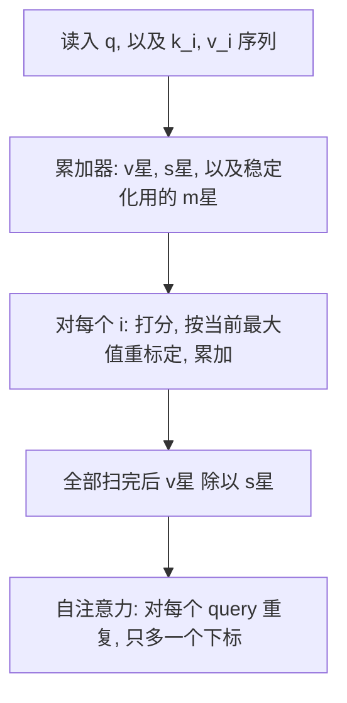

# 自注意力并不需要 $O(n^2)$ 显存

<!-- release-date: 2021-12-10 -->

**本文依据**：`Self-Attention Does Not Need O(n²) Memory`，arXiv 2112.05682v3（[cs.LG] 10 Oct 2022），8 页。作者 Markus N. Rabe、Charles Staats，Google Research。封面印 **A PREPRINT**，未印会议名。首发日取 arXiv v1 提交日 2021-12-10；v3 日期不回写。文中数字标 PDF 页码；标「外部补充」的段落不来自本文。

## 一句话

自注意力的时间仍是 $O(n^2)$，但**不必先把整张注意力矩阵摊在设备内存里**。把 Softmax 的除法挪到最后、边扫边累加，单 query 只要常数内存，整段自注意力只要对数内存；面向 TPU 的分块实现是 $O(\sqrt{n})$。序列长度 $n=2^{14}=16384$ 时，相对 Flax 标准实现，推理峰值开销约降到原来的 $1/59$，反向约 $1/32$（摘要 p1；表 2–3 在 p4–5）。

## 一、矛盾：二次时间被当成了二次显存

注意力（Bahdanau et al., 2015）是 Transformer 的核心（Vaswani et al., 2017）。给定一个 query $q\in\mathbb{R}^d$，以及长度 $n$ 的 key、value 列表 $k_1,\ldots,k_n$ 与 $v_1,\ldots,v_n$，标准写法是（p1）：

先算打分 $s_i=\mathrm{dot}(q,k_i)$，再 Softmax 得到权重 $s'_i$，最后对 value 加权求和。

朴素实现必须先把所有 $s_i$ 算完并记住，**每个 query 就是 $O(n)$ 时间和内存**。自注意力对序列每个位置各发一个 query，于是时间和空间都变成 $O(n^2)$（p1）。

这条二次复杂度被大量后续工作当成改注意力形态的动机：稀疏、低秩、核近似、分块、路由等等（p1 所列 Reformer、Routing、BigBird、Performer、Linformer 等）。论文的观察更窄：**现代加速器上往往先撞设备内存，而不是先撞算力**（p1）。于是「二次」里真正卡死长序列的，经常是那张 $n\times n$ 的注意力矩阵，而不是乘法次数本身。

本文要做的不是近似注意力，而是**算同一个函数**，只改求值顺序，让它能当 drop-in 替换（p2）。时间复杂度不变：自注意力仍 $O(n^2)$，单 query 仍 $O(n)$。高效长上下文机制仍然是另一条路（p2）。

## 二、算法：除法可以放到最后

### 单 query：常数内存

分配律允许把 Softmax 分母 $\sum_j e^{s_j}$ 挪到整段加权求和之后（p2 式 1）：先对每个位置累加 $v_i e^{s_i}$ 和 $e^{s_i}$，最后再除一次。

实现只要两个累加器（p2）：

- 向量 $v^*\in\mathbb{R}^d$，初值 $0$；
- 标量 $s^*\in\mathbb{R}$，初值 $0$。

按顺序读一对 $(k_i,v_i)$：算 $s_i=\mathrm{dot}(q,k_i)$，然后 $v^*\leftarrow v^*+v_i e^{s_i}$，$s^*\leftarrow s^*+e^{s_i}$。扫完做 $v^*/s^*$。

空间分析假设输入顺序是：先 query，再 key–value 对。若顺序不同，还要存一个下标，变成 $O(\log n)$（p2）。

论文初稿发出后才得知：式 1 其实是 Jang et al. (2019) 的 **lazy softmax**（其论文式 4）的再发现。那篇工作走向不同，没有讨论内存复杂度，也没有后文的数值稳定与反向（p2、p6）。

### 自注意力：再加一个 query 下标

对每个 query 依次跑上面的过程，只需再存一个 query 列表下标，故为 $O(\log n)$（p2）。输出本身是 $O(n)$，**不算进这篇的空间复杂度**（p2）。

（机制示意，根据 PDF p2–3 算法叙述重画，不是实测曲线。）

## 三、数值稳定：边走边记住当前最大值

引言里的标准公式和第二节的累加，在浮点下都不稳：分数 $\ge 89$ 时，bfloat16 / float32 的 $\exp$ 会变成 inf，并一路传到结果（p2）。常规 Softmax 的修法是先减掉**全局最大分数**，结果不变。

增量算法的麻烦是：最大值可能出现在序列末尾，但 $\exp$ 又不能等——必须先指数化才能加进累加器（p2–3）。

于是再引入标量 $m^*$，记下目前见过的最大分数（p3）：

- $v^*$、$s^*$ 仍从 $0$ 起，$m^*$ 从 $-\infty$ 起；
- 对每个 $i$：算 $s_i$，令 $m_i=\max(m^*,s_i)$；
- $v^*\leftarrow v^* e^{m^*-m_i}+v_i e^{s_i-m_i}$；
- $s^*\leftarrow s^* e^{m^*-m_i}+e^{s_i-m_i}$；
- $m^*\leftarrow m_i$；
- 全部结束后仍做 $v^*/s^*$。

每见到更大的分数，就把已有累加器按指数差重新标定。这就是后面分块实现里「先各块自己 max，再对全局 max 再标定」的原型。

## 四、面向 TPU 的实现：$O(\sqrt{n})$ 换可并行

纯增量求和在所有 key/value 上串行依赖，编译器不好拆到 GPU/TPU 的大规模并行上（p3）。第四节给出 JAX 实现（p3 图 1），目标不是把内存压到理论最低，而是在**简单、算得快、省内存**之间折中，并带多头和可微。

结构（p4）：

1. **外层**按固定大小切 query（图 1 第 54–55 行），迭代次数对 $n$ 线性。每轮结果直接写进输出张量 `res`，轮与轮之间不另堆中间结果。
2. **内层** `_query_chunk_attention` 再按块切 key/value（第 30–31 行），每块独立汇总（第 12–19 行）：块内 `einsum` 出权重、块内 max、`exp`、加权 value。
3. 各块汇总后再按第三节的思路，用全局 max 重标定，最后 value 除以权重（第 33–40 行）。

若 key/value 块大小取 $\sqrt{n}$，就得到 $\sqrt{n}$ 份汇总，内存 $O(\sqrt{n})$（p4）。多级汇总理论上可回到 $O(\log n)$，但实现更绕，文中没做（p4）。

内存最优是 query 块长常数、key 块长 $\sqrt{n}$；实际速度强烈依赖硬件，所以把 `query_chunk_size` 和 `key_chunk_size` 暴露给调用方。图 1 的默认值是为 **TPU 上尽量少拖慢、同时明显省内存** 选的（p4）：`key_chunk_size=4096`，`query_chunk_size=1024`（p3 图 1）。

块汇总函数上套了 `jax.checkpoint`（图 1 第 11 行），为第五节的反向服务。

## 五、实验：对照的是 Flax 标准注意力

对照实现是 Flax 的 `flax/linen/attention.py`（Heek et al., 2020）。代码与大部分评测开源为 colab：`google-research/google-research` 下的 `memory_efficient_attention`（p4）。全部在**单颗 TPUv3** 上测；本节实验**只用一个注意力头**（p4）。

内存口径：TPU 峰值减去输入输出。输入输出包含 bfloat16 的 Q/K/V 和 float32 的输出（p4）。「相对计算速度」是 100 次的中位数，多次评测仍会晃，作者只用来说明**大致相当**，并声明这是**孤立算子**，嵌进更大网络不必相同（p4）。他们观察到：训一个小 Transformer 时 steps/sec **大约高 4%**（p4）。

标准注意力尚未 OOM（设备内存 $>16$GB）的设置下，两边结果最大绝对差在 $1.8\times 10^{-7}$ 以内（标准正态输入，自注意力 $n=2^{14}$）（p4）。

### 推理（表 2，p4）

| 序列长度 $n$ | $2^{8}$ | $2^{10}$ | $2^{12}$ | $2^{14}$ | $2^{16}$ | $2^{18}$ | $2^{20}$ |
|---|---|---|---|---|---|---|---|
| 输入输出体积 | 160KB | 640KB | 2.5MB | 10MB | 40MB | 160MB | 640MB |
| 标准注意力额外内存 | 270KB | 4.0MB | 64MB | 1GB | OOM | OOM | OOM |
| 省内存注意力额外内存 | 270KB | 4.0MB | 16MB | 17MB | 21MB | 64MB | 256MB |
| TPUv3 计算时间 | 0.06ms | 0.11ms | 0.7ms | 11.3ms | 177ms | 2.82s | 45.2s |
| 相对计算速度 | $\pm 5\%$ | $\pm 5\%$ | $-8\pm 2\%$ | $-13\pm 2\%$ | — | — | — |

读表：

- 短序列两边额外内存一样（$2^{8}$、$2^{10}$ 都是 270KB / 4.0MB），优势从 $2^{12}$ 起拉开。
- $n=2^{14}=16384$：标准 1GB vs 省内存 17MB。$1024/17\approx 60.2$，摘要写 **59X**（p1）；以表为准。
- 标准实现从 $2^{16}$ 起 OOM；省内存一路到 $2^{20}$（约 1M token），此时是在对「超过 1 万亿」组 query–key 做乘法，时间仍二次（p4）。
- 相对速度在能对比的最长两点略慢（约 8%、13%），不是加速论文。

### 反向（表 3，p5）

前向靠顺序汇总「忘掉已经汇总过的注意力块」。若朴素反向把中间全存下来，内存优势会消失（p5）。所以对**每块汇总函数**做 checkpoint（Chen et al., 2016；图 1 第 11 行）：前向可丢，反传再算。

对标准注意力做同样的 checkpoint **得不到同样结果**：标准算法是先形成整张注意力矩阵再忘掉；本文**从不形成整张矩阵**（p5）。

设置同前向，对「结果求和」这个任意选的损失做 `jax.grad`（p5）。

| 序列长度 $n$ | $2^{8}$ | $2^{10}$ | $2^{12}$ | $2^{14}$ | $2^{16}$ | $2^{18}$ | $2^{20}$ |
|---|---|---|---|---|---|---|---|
| 输入输出体积 | 192KB | 768KB | 2.9MB | 12MB | 47MB | 188MB | 750MB |
| 标准注意力额外内存 | 532KB | 8.0MB | 128MB | 2.0GB | OOM | OOM | OOM |
| 省内存注意力额外内存 | 532KB | 8.0MB | 41MB | 64MB | 257MB | 1.0GB | 4.0GB |
| TPUv3 计算时间 | 0.1ms | 0.18ms | 1.4ms | 21ms | 336ms | 5.3s | 85s |
| 相对计算速度 | $\pm 5\%$ | $\pm 5\%$ | $-30\pm 5\%$ | $-35\pm 5\%$ | — | — | — |

$n=2^{14}$：标准 2.0GB vs 省内存 64MB，$2048/64=32$，与摘要 **32X** 一致（p1、表 3 p5）。变慢是预期：checkpoint 要在反传重算（表 3 注，p5）。$2^{20}$ 反向额外内存到 4.0GB，仍未 OOM。

### 训练（p5）

接到 Flax 自带的简单 Transformer，跑 WMT en–de。全程行为几乎一样。100K step 后评测准确率：省内存 **62.69**，标准 **62.59**（p5）。图 4 的 BLEU 曲线也几乎重合（p5）。默认配置，但为简化 mask 关掉了 example packing，学习率降到 **0.005**（p5）。

### 只切 query 不够（p6 图 5）

只切 query 已在 Reformer（Kitaev et al., 2020）里出现，坊间认为会明显变慢（p6）。图 5 左：序列长度 $2^{15}$，相对稠密自注意力；**query 块 $\le 64$ 时确实很慢**，块变大后损失变小。所以单靠切 query 也能省内存，但把块切得很小不实用（p6）。

本文同时切 key。图 5 右把「只切 query」限制在与本文默认块大小相同的内存预算内（按表 2 的额外内存，query 块大小向只切 query 一侧取整）（p6）。序列变长后，只切 query 必须把块压到 $\le 64$，速度塌掉；本文没有这种大减速（对照表 2 的相对速度）。结论：**内存受限时，双切可以优于只切 query**（p6）。图 5 是相对运行时间曲线，正文没有再给离散读数。

## 六、和谁不是同一件事

- **Jang et al., 2019（MNNFast）**：lazy softmax，式子同类。文中完全不谈内存复杂度，也不做数值稳定与反向；据作者所知当时没有公开实现。他们用它在多芯片之间切分 KV，降低**推理带宽**（p6）。
- **Dao et al., 2022**：CUDA 上的省内存精确注意力，并显示 GPU 上内存下降可以变成明显加速。本文 TPU 上没看到同档加速，作者给的原因是：TPU 上标准自注意力已经比较平衡 FLOPs 与带宽（p6）。这是相关工作引用，不是本文的实现对象。

致谢提到 Andrew Jaegle 在 Perceiver 语境下试过；Rezaei (2021) 与 Wang (2022) 有 JAX / PyTorch 再实现，带 mask 等额外功能（p7）。这些是致谢，不是本文实验。

## 七、论文自己画的边界

- 时间仍二次；不是长上下文近似注意力的替代品（p2）。
- TPU 实现是 $O(\sqrt{n})$，不是理论 $O(\log n)$（p4）。
- 相对速度在推理最长可比点慢约 8%–13%，反向慢约 30%–35%（表 2–3）。
- 训练实验是小 Transformer + WMT，且改了 packing 与学习率（p5）；没有大规模预训练数字。
- 孤立算子的相对性能不能直接当成整网数字（p4）。
- 没有报告多头、多芯片、因果 mask 在主实验表里的系统扫描（图 1 代码支持多头；mask 出现在他人再实现的致谢里）。

## 八、可迁移的几条

1. **二次时间 $\neq$ 二次工作集。** 先问「是不是把 $n\times n$ 物化了」，再决定要不要改注意力形态。
2. **Softmax 可延迟归一化。** 累加 $e^{s}v$ 与 $e^{s}$，最后再除；这是整篇的代数起点。
3. **在线 max 重标定**让增量 Softmax 在 bfloat16/float32 上可跑。
4. **分块 + 块级 checkpoint**：前向丢掉注意力块，反向重算；不要对「已经物化整张矩阵」的实现只做 checkpoint 然后指望同等内存。
5. **只切 query 会把块切到硬件不喜欢的尺寸。** 内存预算紧时，同时切 KV 才能把 query 块留在快速区。
6. **加速器不同，故事不同。** 本文在 TPU 上主要买序列长度（到 1M 推理），不是买 wall-clock；GPU 上另一篇工作把省内存转成了速度。迁移时先看瓶颈是 HBM 还是 FLOPs。

## 关键词回看

- **懒 Softmax / lazy softmax**：先累加未归一化的加权 value，最后再除。
- **在线最大值重标定**：用当前 max 把旧累加器缩放到同一指数原点。
- **query/key chunking**：切 query 控外层并行与写出；切 key 把工作集从 $O(n^2)$ 降到块汇总规模。
- **激活 checkpoint**：对块汇总重算，换反向内存。
- **drop-in 精确注意力**：函数值对齐标准注意力，不改模型定义。

## 参考资料

- 原件：Rabe & Staats，`Self-Attention Does Not Need O(n²) Memory`，arXiv 2112.05682v3，2022-10-10 印本；v1 为 2021-12-10。
- 开源评测：https://github.com/google-research/google-research/tree/master/memory_efficient_attention（论文 p4）。
- 对照实现：Flax `linen/attention.py`（Heek et al., 2020）。
- Jang et al., 2019，ISCA，MNNFast / lazy softmax。
- Chen et al., 2016，sublinear memory training / checkpoint。
- Dao et al., 2022，FlashAttention（仅作相关工作对照）。
