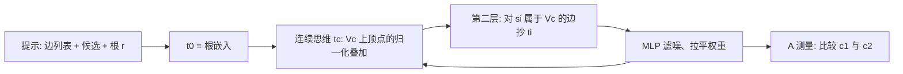

# 连续思维链：把搜索前沿叠成一个向量，两层就能走完直径

<!-- release-date: 2025-05-18 -->

**本文依据**：`Reasoning by Superposition: A Theoretical Perspective on Chain of Continuous Thought`，arXiv 2505.12514v3（[cs.LG] 1 Nov 2025），26 页。第一作者 Hanlin Zhu（共同一作 Shibo Hao），封面机构 **UC Berkeley**；其余为 UCSD 与 Meta AI。封面页脚印 **39th Conference on Neural Information Processing Systems (NeurIPS 2025)**。代码 `github.com/Ber666/reasoning-by-superposition`。首发日取 arXiv v1 提交日 2025-05-18。文中数字都标 PDF 页码；标「外部补充」的段落不来自本文。

## 一句话

离散 CoT 每一步必须**塌缩成一个词**，图可达性上常数深度 Transformer 已知最好结果要 $O(n^2)$ 步解码（$n$ 是顶点数）；本文证明：**两层** Transformer 配 **$D$ 步连续思维**就能解直径为 $D$ 的有向图可达性（$D<n$）。连续向量是多个搜索前沿的**叠加态**，等价于隐式并行 BFS；训练里这种叠加会自己长出来，不必把每条合法路径都当监督（PDF p. 1）。

## 一、矛盾：离散思维每步只能走一条边

LLM 用 CoT 先吐「思考 token」再答题，理论已经说明离散 CoT 能抬表达力。但图可达、规划一类任务规模一涨，离散 CoT 仍会卡住（PDF p. 1–2）。

Hao 等人 2024 的 **COCONUT**（chain-of-continuous-thought）不采样词，直接把 Transformer 输出向量接到下一步输入。经验上它在合成图任务和 GSM8K 上更好，个案还暗示潜向量可能同时存多条搜索前沿——相对离散 CoT 必须先采样再自回归，这是质的差别。缺的是：**为什么连续思维更强，机制是什么**（PDF p. 1–2）。

本文把问题钉死在**有向图可达性**：给定边列表、根 $r$、两个候选终点 $c_1,c_2$，保证恰好一个可达，问是哪一个。它覆盖知识图谱、计算图、乃至停机问题一类抽象（PDF p. 2）。对照：

- 常数深度 + 离散 CoT：Merrill & Sabharwal 2023a 要 **$O(n^2)$** 步。
- 对数深度 Transformer（无本文这种连续思维）也能解可达性，但常数深度不行（Merrill & Sabharwal 2025，PDF p. 2）。
- 本文：**两层 + $D$ 步连续思维**，$D$ 是直径。

直觉：连续向量是量子力学里的叠加态，一次编码多个前沿，等于并行 BFS；离散 token 是塌缩态，只能贪心或带回溯的 DFS，步数多、还可能困在局部（PDF p. 2）。位置编码用实践里的正弦 / RoPE，不为题目或长度特制（PDF p. 2）。

上图根据 PDF 第 3–4 节与图 2–3 重画，是机制示意，不是实测曲线。

## 二、问题怎么写成序列

图 $G=(V,E)$，$|V|=n\le n_{\max}<|Voc|$。边 $e_i=(s_i,t_i)$。提示格式（图 1，PDF p. 4）：

`<s>`，然后每条边三个 token $s_i,t_i,\langle e\rangle$，再 $\langle Q\rangle\,c_1\,c_2$，$\langle R\rangle\,r$。提示长 $t_0=3m+6$。之后连续思维 $h_{t_0+c}=\mathrm{TF}_\theta(h_{[t_0+c-1]})$，记 $[t_c]$；要答案时再接 $\langle A\rangle$，贪心读 $\arg\max W_O\mathrm{TF}_\theta(h_{[T]})$（PDF p. 4–5）。

Transformer 按 Algorithm 1：位置编码、因果注意力、MLP、LayerNorm。**离散解码**采样 $v_{t+1}$ 再贴 $u_{v}$；**连续思维**跳过采样，$h_{t+1}=\mathrm{TF}_\theta(h)$（PDF p. 3–4）。嵌入切成 content / buffer1 / buffer2 / 有效位置编码，维数 $d=3d_{\mathrm{TE}}+d_{\mathrm{PE}}$；词嵌入在 content 上正交（PDF p. 3）。

$V_c$：从 $r$ 至多 $c$ 步能到的顶点集。$[t_0]=u_r$。

## 三、积木：注意力选择器

Lemma 1（非正式，完整版 Lemma 3）：正弦位置编码下，对任意 token $\langle x\rangle$ 和相对位移 $\ell\ge 0$，存在 $K,Q$，使得当前位置若是 $\langle x\rangle$，几乎全部注意力打到 $i-\ell$；否则打到位置 1（BOS / attention sink）（PDF p. 5）。

做法：$\tilde u_{\overline{\langle x\rangle}}$ 是词表里除 $\langle x\rangle$ 外全部嵌入的叠加。正弦编码有旋转 $R(\ell)$ 使 $\bar p_{i+\ell}=R(\ell)\bar p_i$。Query 里一项是位置、一项是「当前是不是 $\langle x\rangle$」与 $\bar p_1$ 的外积。于是：当前是 $\langle x\rangle$ 时内积由 $\langle\bar p_i,\bar p_{j+\ell}\rangle$ 决定，最大在 $j=i-\ell$；否则由 $\langle\bar p_1,\bar p_j\rangle$ 决定，最大在 $j=1$（PDF p. 5–6）。同一套参数覆盖不同长度，不必为每道题造位置编码。

附录 B.6 把同一选择器搬到 RoPE（相对位置），第一层仍够用（PDF p. 24–25）。

## 四、Lemma 2：第 $c$ 步思维 = $V_c$ 的均匀叠加

存在参数，使得

$$
[t_c]=\frac{1}{\sqrt{|V_c|}}\sum_{v\in V_c}u_v
$$

即第 $c$ 个连续思维是「$c$ 步内可达顶点」的归一化叠加（PDF p. 6）。

归纳构造（两层）：

**第一层五头**，全是选择器（图 2，PDF p. 6）：$h_0=(\langle e\rangle,2)$、$h_1=(\langle e\rangle,1)$、$h_2=(\langle R\rangle,2)$、$h_3=(\langle R\rangle,1)$、$h_4=(\langle A\rangle,1)$。Value 读 content，Output 抄到指定子空间。于是第 $i$ 个 $\langle e\rangle$ 上 $\mathrm{buffer}_1=\tilde u_{s_i}$、$\mathrm{buffer}_2=\tilde u_{t_i}$。

**第二层一头**（图 3，PDF p. 6）：当前 $[t_c]$ 当 query，对 $s_i\in V_c$ 的边 token 给大正分，把 buffer2 里的 $t_i$ 加回来——一步扩张 $V_c\to V_{c+1}$。

**MLP 当滤波器**：注意力权重不匀、还有噪声。对 $h=\sum\lambda_v u_v$，要丢掉 $\lambda_v<\varepsilon$ 的噪声、把其余权重拉平。$W_1=[u_1,\ldots,u_V]^\top$ 把 $\{u_v\}$ 旋到标准基，$\sigma(x)=\mathbf{1}\{x\ge\varepsilon\}$ 逐坐标滤，$W_2=W_1^\top$ 旋回去。再 LayerNorm，归纳成立（PDF p. 6–7）。

Theorem 1：存在与图无关的两层参数和 $W_O$（$d=O(|Voc|)$），只要总长不超过固定 $T_{\max}$，$C$ 超过直径，贪心输出就是可达的那个 $c_{i^*}$（PDF p. 7）。$\langle A\rangle$「测量」叠加：把 $c_1,c_2$ 抄进最后状态，可达点权重大一倍，argmax 命中（附录 B.4，PDF p. 23）。

讨论（PDF p. 7）：实践里 content/buffer 不必分维，可用近正交子空间叠在一起。训练信号会让权重偏离均匀——偏向「恰好 $i$ 步」的前沿和最优路径上的点；第 5 节实验就是在看这件事。

和 Gozeten 等 2025（算术域、一层连续 CoT）对照：他们要指数级嵌入维，本文只要对图规模**线性**的维；位置编码也更贴近实践（PDF p. 2）。

## 五、实验：两层连续 vs 十二层离散

GPT-2 风格解码器：**两层**，$d_{\mathrm{model}}=768$，$n_{\mathrm{heads}}=8$，从头训。AdamW $\beta_1=0.9$、$\beta_2=0.95$，weight decay $10^{-2}$，恒定学习率 $1\times 10^{-4}$（PDF p. 8）。

数据：ProsQA 子集，解需要 **3–4** hop，每个图节点单独进词表。表 4（PDF p. 26，对实例平均）：

| 划分 | 题数 | $|V|$ | $|E|$ | 解长 |
|---|---:|---:|---:|---:|
| Train | 14785 | 22.8 | 36.5 | 3.5 |
| Val | 257 | 22.7 | 36.3 | 3.5 |
| Test | 419 | 22.7 | 36.0 | 3.5 |

训练跟 Hao 等 2024 的多阶段：第 $i$ 阶段用 $i$ 个连续思维，再预测 CoT 里第 $i$ 个节点；阶段号超过解长 $l$ 时，在 $l$ 步思维加 $\langle A\rangle$ 后出答案。每阶段 **25** epoch，共 **300** epoch。上一阶段数据以 **0.1** 概率混入（PDF p. 8）。每次 COCONUT 约 **24 小时 × 两张 A100 80GB**（PDF p. 26）。

图 4（PDF p. 8）：COCONUT 近满分；CoT 与 No CoT 大约 **75%**（随机 **50%**）。标 $*$ 的 **12 层、$n_{\mathrm{heads}}=12$** 离散 CoT 到 **83%**，仍不解稳。正文写「两层连续优于十二层离散」，数字以这段为准。

### Layer 1：边 token 抄两端

图 5：$\langle e\rangle$ 几乎把注意力全打在自己的源、目标节点上，对齐理论的复制头（PDF p. 8–9）。

### Layer 2：扩张可达边，并偏向前沿 / 最优

生成第 $i$ 个思维时，对每条边三元组 $(s,t,\langle e\rangle)$ 把头上的注意力加总。四类边：Reachable（源在当前可达集）、Not Reachable、Frontier（源恰好 $i$ 步）、Optimal（前沿里通向最优链）（PDF p. 8–9）。

表 1 测试集均值 $\pm$ 标准差（PDF p. 9）：

| 组 | Step 1 | Step 2 | Step 3 | Step 4 |
|---|---|---|---|---|
| Not Reachable | $0.04\pm 0.07$ | $0.03\pm 0.09$ | $0.08\pm 0.17$ | $0.12\pm 0.20$ |
| Reachable | $2.12\pm 1.07$ | $0.71\pm 0.92$ | $0.38\pm 0.72$ | $0.29\pm 0.66$ |
| Frontier | $2.12\pm 1.07$ | $1.00\pm 0.96$ | $0.67\pm 0.87$ | $0.61\pm 0.95$ |
| Optimal | $2.54\pm 1.03$ | $1.72\pm 1.13$ | $1.67\pm 1.20$ | $2.23\pm 1.35$ |

注意力尖在 Reachable 上，符合理论；额外偏向 Frontier 和 Optimal。作者猜测：多阶段监督要预测前沿节点，旧节点衰减；最优边更高是因为监督来自 CoT 解（PDF p. 9）。

### 思维向量与节点嵌入的内积

图 6：$[t_i]$ 与 $u_v$ 的内积。$i$ hop 内的点明显高于远处；Frontier 比其他可达点更近；Optimal 更近。作者判断：叠加在强调扩张前沿，最优路径因训练数据总展示最优解而更近（PDF p. 9）。

表 5 三个随机种子，内积均值一致（PDF p. 26），例如 Step 1 Optimal 约 **6.41 / 6.52 / 6.84**，Not Reachable 为负。

合起来：Layer 1 建边上下文，Layer 2 扩前沿，潜向量是可达集的软并行表示——第 4 节构造在训练解里对得上（PDF p. 9）。

## 六、COCONUT-BFS：不盯最优节点，叠加照样出现

表 1 / 图 6 里 Optimal 权重偏高，可能是课程把每步钉在 CoT 解上。对照 **COCONUT-BFS**：第 $i$ 阶段监督从恰好 $i$ hop 的前沿**均匀随机**抽，其余超参不变（PDF p. 9–10）。

结果：ProsQA 上同样近满分。两种监督的内积分布仍收敛到相近探索策略。BFS 监督没有显式推向最优节点，原版 COCONUT 虽只看最优节点，仍给非最优前沿比非前沿更高的权重——先广度扩张，再收束。作者把训练动力学解释列为未来工作（PDF p. 10）。

要点：叠加态**不是**靠「把所有合法路径写进标签」才出现；只给一条最优（或随机前沿）示范，模型仍会并行探多条。

## 七、没写清的边界

- 理论是**存在性构造**，不是「SGD 一定学到 Lemma 2 的均匀叠加」。实验里权重不匀，且偏向最优。
- 任务保证恰好一个候选可达；一般可达性（多终点、不可达）没有定理。
- 离散 CoT 的 $O(n^2)$ 是已知上界，**不是**本文证明的下界。结论里第一条未来工作就是要严格分离（PDF p. 10）。
- 没有把 COCONUT 接到真实大模型或 GSM8K 新数字；GSM8K 只作为前作经验出现（PDF p. 1–2）。
- 没有公开把构造权重直接写入 GPT-2 的对照实验；对齐靠注意力图与内积。

未来三条（PDF p. 10）：离散步数下界；只有确定轨迹时探索如何涌现；连续空间在更一般设定里的优势。

资助：Open Philanthropy 给 Berkeley CHAI 的 gift，以及 NSF IIS-1901252、CCF-2211209（PDF p. 10）。

## 可迁移启发

- **离散下一步 = 塌缩。** 分支因子高时，先别逼模型把中间状态写成词；连续向量能一次带多个前沿。
- **两层分工可以很干净：** 一层把关系抄到「边标记」上，一层按当前叠加做邻接扩张，MLP 负责去噪。实现潜空间推理时，先检查中间层是否在做这两件事。
- **位置编码不必为题目特制。** 选择器只依赖「当前是什么 token」加相对位移，正弦和 RoPE 都能装。
- **监督不必枚举搜索树。** 一条最优路径或随机前沿就可能诱发出 BFS 式叠加；多阶段课程会额外偏向最优边，不等于没有并行探索。
- **步数应对直径，不是顶点数平方。** 若任务直径短、图却很大，连续思维的理论步数优势最大；直径本身很长时，优势缩小。

## 关键词回看

- **连续思维链（COCONUT）**：不采样 token，把 Transformer 输出向量直接当下一步输入。
- **叠加态**：一个向量同时是多个顶点嵌入的组合，对应并行搜索前沿。
- **注意力选择器**：按当前 token 类型把注意力钉到相对位移 $\ell$ 或 BOS。
- **图直径 $D$**：任意两点最短路的最大值；本文连续步数与它对齐。
- **ProsQA**：前作里的命题式图问答；本文取 3–4 hop 子集。
