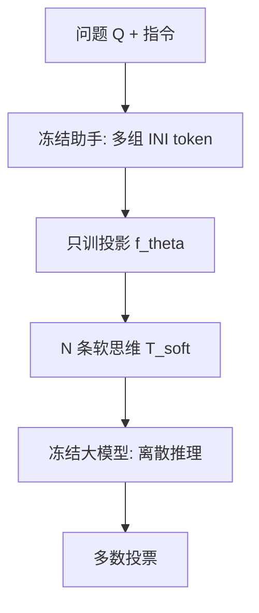

# SoftCoT++：在连续潜空间里做测试时扩算，而不是再多抽几个离散链

<!-- release-date: 2025-05-16 -->

**本文依据**：`SoftCoT++: Test-Time Scaling with Soft Chain-of-Thought Reasoning`，arXiv 2505.11484v2（[cs.CL] 27 May 2025），14 页。第一作者 Yige Xu（共同一作，上标 1,3），封面 **1 = Joint NTU-UBC Research Centre of Excellence in Active Living for the Elderly**；3 = College of Computing and Data Science, Nanyang Technological University。机构条幅取第一作者最低编号实验室的紧凑写法 **NTU**。共同一作兼通讯 Xu Guo（2,4）；Zhiwei Zeng（2）；Chunyan Miao（1,2,3）。2 = Alibaba-NTU Global e-Sustainability CorpLab（ANGEL）；4 = KTH。封面只印 **Preprint**，**没有会议名**。代码 `github.com/xuyige/SoftCoT`。首发日取 arXiv v1 提交日 **2025-05-16**。文中数字都标 PDF 页码；标「外部补充」的段落不来自本文。

## 一句话

测试时扩算（Test-Time Scaling，TTS）通常在**离散词表**里多抽几条 CoT，再多数投票。Coconut / SoftCoT 已经证明：**连续潜空间里的软思维**可以比把中间步骤写成词更省信息损失，但一条输入只对应一份固定潜向量，没法像温度采样那样自然分叉。SoftCoT++ 在冻结的小助手模型上换多组专用起始 token `[INI]`，再用对比损失把多条软思维推开，从而在**思维阶段**做并行扩算。表 1：$N=10$ 时 Qwen3-8B 全任务均分 **85.91**，高于 SoftCoT-SC 的 **84.87**；LLaMA-3.1-8B-Instruct 为 **77.57** 对 **76.88**（PDF p. 8）。表 2 还显示思维扩算与离散自洽可以叠乘（10 条思维 × 每条 10 条推理 = 100 条）（PDF p. 8–9）。

## 一、矛盾：连续思维没有可采样的分布

训练时加参数、测试时加算力，是两条轴。TTS 不改权重，只在推理时多花计算（PDF p. 1）。作者把现有 TTS 分成并行（Best-of-N、自洽 Self-Consistency）、串行（后面的步依赖前面的中间结果）；本文只做并行（PDF p. 1–2）。

并行扩算在离散空间里很自然：每一步有 $P(x_i \mid x_{<i})$，温度一开就能抽 $N$ 条链。连续空间里，Coconut 把中间步写成隐向量再喂回去；SoftCoT 冻结大模型，只用一个小助手吐软思维，再投影进大模型。问题是：给定 $(I,Q)$，软思维 $T_{\mathrm{soft}}$ **是确定的**，所有后续解码都从同一点出发（PDF p. 1–2）。

作者先做试探：在同一份 $T_{\mathrm{soft}}$ 上加小扰动 $\delta_i$，记 SoftCoT-P。图 2 在 GSM8K 上对照 SoftCoT-SC（离散自洽）：Qwen3-8B 与 LLaMA-3.1-8B-Instruct 两条曲线接近，说明「在潜空间加点噪声」**能**当扩算，但没有超过离散自洽——扰动只逛到真分布的一个窄邻域（PDF p. 5）。

附录 A.1 还补了一句边界：多数投票只在单条正确率 $p>0.5$ 时帮得上忙。所以他们把 SoftCoT 当底座——它对近年 LLaMA / Qwen 的零样本 CoT 已经够强，Coconut 甚至会弱于零样本 CoT（PDF p. 2、附录 p. 13）。

上图根据 PDF 图 1 / 第 3 节重画，是机制示意，不是实测曲线。

## 二、宏观：思维、推理、答题，扩算可以拆开

记指令 $I$、问题 $Q$。作者把解题拆成三段自回归（公式 1，PDF p. 3–4）：

- **思维** $T$：内部想。
- **推理** $R$：写成可读步骤。
- **答案** $A$。

经典 CoT 把 $T\cup R$ 全写成词表 $V$ 里的 token。SoftCoT 把思维换成连续向量：助手吃 $I_{\mathrm{assist}}$、$Q$ 和 $L$ 个占位（原文用 `[UNK]`），取出最后 $L$ 个隐状态，经投影 $f_\theta$ 得到 $T_{\mathrm{soft}}\in\mathbb{R}^{L\times d}$，再交给大模型做离散推理（公式 2，PDF p. 4）。助手和大模型都冻住，**只训投影**。

定义 1 把 CoT 扩算写成 $f=a\circ b\circ c$：$a$ 预填，$b$ 开 $N$ 条独立路径，$c$ 把每条走完再聚合。SoftCoT 的 $a$ 吐的是一份确定的 $T_{\mathrm{soft}}$，于是有两条独立的扩算轴（PDF p. 5）：

- **推理阶段**：软思维不动，在 $P_{\mathrm{LLM}}(x\mid I,Q,T_{\mathrm{soft}})$ 上做自洽 → SoftCoT-SC。
- **思维阶段**：要让 $T_{\mathrm{soft}}$ 本身分叉。本文的全部新东西都在这一轴。

## 三、微观：多组起始 token + 对比损失

假设 1：存在光滑密度 $P_G(t\mid I,Q)$，确定的 $T_{\mathrm{soft}}$ 只是其中一个样本。引理 1：$\delta$ 足够小时，$T_{\mathrm{soft}}+\delta$ 仍落在高概率区（泰勒展开，附录 A.2，PDF p. 13）。这解释了 SoftCoT-P 为什么「能用但不够」。

他们要的是比扰动经验分布 $Q_1$ 更接近真分布 $P$ 的 $Q_2$。引理 2：在样本仍来自 $P$、且 $\mathrm{Var}[Q_1]<\mathrm{Var}[Q_2]\le\mathrm{Var}[P]$ 时，$Q_2$ 的 KL 更小（高斯假设下的迹与行列式论证，PDF p. 6、13）。于是两件事：

1. **不要只扰动一份向量，要真的生成多份软思维。**
2. **把这几份推开，提高方差。**

做法一：把助手输入里的 `[UNK]` 换成互不相同的专用起始 token `[INI]^i`（公式 4–5，PDF p. 6）。作者类比多头注意力：计算图一样，只换初始化。每条路径 $i$ 得到自己的 $T_{\mathrm{soft}}^i$。

做法二：对比损失当正则（公式 6，PDF p. 6）：

$$
\mathcal{L}_{\mathrm{cl}}=-\sum_{k=1}^{M}\mathbb{E}\log\frac{\exp(T_{\mathrm{soft}}^k\cdot T_{\mathrm{soft}}^k)}{\sum_j\exp(T_{\mathrm{soft}}^k\cdot T_{\mathrm{soft}}^j)}
$$

训练时用它把不同软思维拉开。没有对比、只有多 `[INI]` 的变体叫 **SoftCoT+**（PDF p. 8）。

## 四、实验怎么训、怎么比

五个基准，三类推理（第 4.1 节、表 3，PDF p. 7、14）：

| 数据集 | 类型 | 答案 | 训练 | 评测 |
|---|---|---|---:|---:|
| GSM8K | 数学 | 数字 | 7,473 | 1,319 |
| ASDiv-Aug | 数学 | 数字 | 4,183 | 1,038 |
| AQuA | 数学 | 选项 | 97,467 | 254 |
| StrategyQA | 常识 | 是/否 | 1,832 | 458 |
| Date Understanding（DU） | 符号 | 选项 | — | 250 |

骨干：LLaMA-3.1-8B-Instruct 与 Qwen3-8B。单卡 NVIDIA A100-80G；**只训投影 10 epoch**；学习率 $2\times 10^{-5}$；软思维长度 $L=4$；batch 8 或 16（PDF p. 7）。

基线一律带自洽（SC）：零样本 CoT；助手吐硬 token 的 Assist-CoT；Coconut-SC；SoftCoT-SC。作者强调约 8B 的现代模型零样本已经很强，用普通 LM 目标在推理集上微调往往会掉点，所以评测必须留在零样本设定（PDF p. 7）。

## 五、表 1：十条思维链对十条推理链

表 1 报 $N=10$、5 个随机种子的均值 ± 标准差。基线扩 **10 条推理链**；SoftCoT++ 扩 **10 条思维链**（PDF p. 8）。

### LLaMA-3.1-8B-Instruct

| 方法 | GSM8K | ASDiv-Aug | AQuA | 数学均分 | StrategyQA | DU | 全任务 |
|---|---:|---:|---:|---:|---:|---:|---:|
| Zero-Shot CoT (SC) | 90.36±0.40 | 89.23±0.17 | 63.23±0.86 | 80.94 | 70.13±0.47 | 65.76±1.54 | 75.74 |
| Assist-CoT (SC) | 90.43±0.69 | 89.48±0.36 | 63.62±0.99 | 81.18 | 70.48±0.68 | 65.84±1.93 | 75.97 |
| Coconut-SC | 87.03±0.00 | 88.44±0.00 | 61.81±0.00 | 79.09 | — | — | — |
| SoftCoT-SC | 90.63±0.39 | 89.75±0.29 | 65.51±0.72 | 81.96 | 71.14±0.10 | 67.36±1.12 | 76.88 |
| SoftCoT++ | 90.99±0.25 | 90.09±0.27 | 66.85±0.58 | 82.64 | 71.18±0.15 | 68.72±0.91 | 77.57 |

### Qwen3-8B

| 方法 | GSM8K | ASDiv-Aug | AQuA | 数学均分 | StrategyQA | DU | 全任务 |
|---|---:|---:|---:|---:|---:|---:|---:|
| Zero-Shot CoT (SC) | 92.22±0.47 | 91.97±0.13 | 76.77±0.62 | 86.99 | 70.96±0.15 | 84.56±0.61 | 83.30 |
| Assist-CoT (SC) | 92.68±0.17 | 91.91±0.28 | 76.77±0.79 | 87.12 | 70.92±0.28 | 84.80±1.17 | 83.42 |
| Coconut-SC | 90.37±0.00 | 90.37±0.00 | 76.38±0.00 | 85.71 | — | — | — |
| SoftCoT-SC | 93.19±0.32 | 92.14±0.15 | 80.63±1.90 | 88.65 | 71.18±0.15 | 87.20±0.75 | 84.87 |
| SoftCoT++ | 93.65±0.24 | 92.41±0.13 | 84.09±0.72 | 90.05 | 71.22±0.18 | 88.16±0.54 | 85.91 |

作者三点读法（PDF p. 8）：

1. SoftCoT++ 在两套骨干、三类任务上都压过 SoftCoT-SC；标准差往往更小，扩算没有把预测搅散。
2. 只动表示层，不改骨干结构，所以跨 LLaMA-3 / Qwen-3、不同分词与位置编码都能用。
3. 数学任务上，灵活推理预算下瓶颈更像是**路径多样性**而不是容量。StrategyQA 把链数加到 100 时收益变钝，作者认为该任务容量已经吃满。

Coconut-SC 在常识与符号两列为空，原文表格如此，不补。

## 六、表 2：消融，以及两轴叠乘

表 2 只报 GSM8K。$N=1$ 时 SoftCoT+ / SoftCoT++ 退回原 SoftCoT，格子写「-」。$N=10$：基线 10 条推理链；SoftCoT+ / ++ 为 10 条思维链。$N=100$：基线 100 条推理链；SoftCoT+ / ++ 为 **10 思维 × 每条 10 推理自洽**（PDF p. 8–9）。

| 方法 | LLaMA $N=1$ | $N=10$ | $N=100$ | Qwen $N=1$ | $N=10$ | $N=100$ |
|---|---:|---:|---:|---:|---:|---:|
| Zero-Shot CoT (SC) | 79.61±0.81 | 90.36±0.40 | 92.42±0.21 | 91.86±0.41 | 92.22±0.47 | 92.98±0.11 |
| Assist-CoT (SC) | 80.76±1.53 | 90.43±0.69 | 92.43±0.25 | 91.90±0.50 | 92.68±0.17 | 93.01±0.32 |
| Coconut-SC | 76.12±0.00 | 87.03±0.00 | 91.66±0.00 | 87.95±0.00 | 90.37±0.00 | 91.13±0.00 |
| SoftCoT-SC | 81.03±0.42 | 90.63±0.39 | 92.52±0.17 | 92.48±0.29 | 93.19±0.32 | 93.40±0.15 |
| SoftCoT+ | — | 90.67±0.24 | 92.63±0.20 | — | 93.28±0.19 | 93.97±0.11 |
| SoftCoT++ | — | 90.99±0.27 | 92.71±0.14 | — | 93.65±0.24 | 94.12±0.20 |

注意表 1 里 LLaMA SoftCoT++ GSM8K 是 **90.99±0.25**，表 2 同格是 **90.99±0.27**，以各表自己的格子为准，不要强行抹平。

附录 C.1：同等 $N=10$ 预算下，扩思维的增益大于只扩离散推理（PDF p. 14）。$N=100$ 那一列说明两轴正交：对比训练过的软思维给下游自洽提供更好的初值；没有对比的 SoftCoT+ 叠自洽时相对 SoftCoT-SC 的增益甚至更显眼，说明「多 `[INI]`」本身已经在思维层注入离散采样覆盖不到的多样性（PDF p. 9、14）。

## 七、限制、没写的东西、可迁移启发

第 5.4 节写得很短：潜思维分布的探索仍初步；全文只在**固定 8B、冻结骨干**上推理。没有更大可训 LLM、没有软思维分布随训练如何演化、也没有和模型尺度/架构的交互实验（PDF p. 9）。没有延迟、FLOPs、KV 对比；没有 $L$ 与 `[INI]` 个数的系统扫描；Coconut 在 StrategyQA / DU 上未报。附录引理把 $P,Q$ 当成高斯，这是论证装置，不是测出来的密度。

可迁移的几条：

- TTS 不必只加在「已经写成词」的那一段。若中间表示是确定的，先问：**怎样合法地得到多样本**，而不是先加温度。
- 多起点（专用 token）与对比正则对应引理 2 的两句话：多样本，再提高方差。缺对比的 SoftCoT+ 已经能涨，但涨幅明显小于 SoftCoT++。
- 思维扩算与离散自洽可以相乘。预算记账时不要把「10 思维 × 10 推理」和「100 条纯离散链」当成同一种多样性。
- 多数投票要求单条 $p>0.5$。底座太弱时，先把单路径做对，再堆 $N$。
- 只训一层投影、冻住 8B，是为了不毁掉已经很强的零样本 CoT。若你的骨干还在靠微调长 CoT 涨分，这篇的设定对不上。

## 关键词回看

- **测试时扩算（TTS）**：推理时多花计算、不改权重。
- **并行 / 串行扩算**：多条独立链再融合，对后面的步依赖前面的中间结果。
- **软思维（soft thought）**：助手隐状态经投影得到的连续向量，代替写成词的内部思维。
- **SoftCoT-P / SoftCoT-SC / SoftCoT+ / SoftCoT++**：扰动同一向量；只在离散推理上自洽；多 `[INI]` 无对比；多 `[INI]` 加对比。
- **自洽（self-consistency）**：多样本后多数投票。

## 参考资料

原件 `readings/_src/注意力与长上下文/SoftCoT-Plus-Plus.pdf`。前作 SoftCoT 与 Coconut 只作为本文引用，不在此展开。
