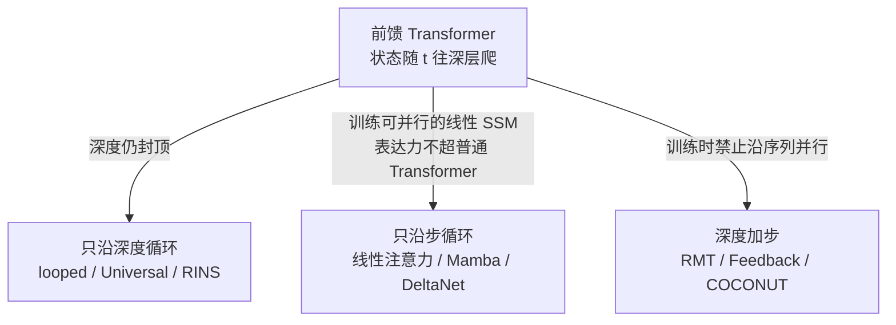

# Transformer 的拓扑麻烦：状态在层里往上爬，终会顶穿深度

<!-- release-date: 2026-04-18 -->

**本文依据**：`The Topological Trouble With Transformers`，arXiv 2604.17121v3（2026-06-03），16 页，封面印 **Preprint.**，未印会议名。作者 Michael C. Mozer、Shoaib Ahmed Siddiqui、Rosanne Liu，三人都署 **Google DeepMind**。首发日取 arXiv v1 提交日 2026-04-18；解读按盘上 v3，不回写修订日。文中数字与分类格子都标了 PDF 页码。

## 一句话

Transformer 把结构塞进不断变长的上下文历史，却用纯前馈拓扑去做**状态跟踪**——每一步新输入都把隐状态再往更深一层推。层数用完，浅层再也读不到已经收敛的信念。CoT 把深表征吐成 token 再喂回去，只是把深度不够外包成显式思考。作者主张：要做时间上延展的认知，得把焦点从显式思路转回**隐式激活动力学**，并给循环 Transformer 画了一张两轴分类表。

## 一、矛盾：查找历史，和更新世界，不是一回事

理想的时间延展认知，作者写成离散状态递推（p1）：

$$
s_t = f(s_{t-1}, x_t)
$$

$s$ 是高维内部状态，$x$ 是外部刺激。RNN 就是在显式做这件事：把重要信号积进瓶颈状态，需要时再取出来。Transformer 走的是另一条路：上下文窗口把历史全留着，常常把「选哪些信息」拖到推理那一刻（p1）。注意力很擅长把过去的 token **找回来**；这和**信念状态**（belief state）——对环境的一份紧凑、充分统计，可以是一组事实，也可以是对可能世界的分布——不是同一件事（p2）。

二十问就是状态跟踪。猜数字时，对方说「比 50 大」，下一猜不该是 25；反过来，模型若自己心里有一个数，每次回答必须和这个数以及已经说过的话一致。论文给了 Gemini 3（Fast）的一段失败轨迹（p2）：先对 60 说 lower，对 41 再说 lower，再对 70 说 higher——区间已经自相矛盾。Gemini 3 Thinking 在思路里选定了 42，却在用户猜到 42 时仍然答 lower（p2）。作者的点不是嘲某一代产品，而是：**一致性要求跟踪合法区间**；光把目标写进思路流，不等于会用这份状态。

另一类失败是多义词的翻盘。Fred 带着钓竿去 bank，模型先按河岸解释该穿靴子；下一问「这里有没有 ATM」，又毫无交代地切到金融机构（p2–3，Gemini 2.5 Flash，2025）。作者把这种 flip-flop 看成：既没跟踪世界局势，也没跟踪自己先前的回答和听者的预期（p3）。

这些例子没有新基准分数。它们要钉死的是：查找上下文 ≠ 迭代更新隐变量。状态跟踪做不好，会表现为多轮对话失连贯、信息收集低效、多智能体协作崩掉——正文点名了这几类文献，本文自己不做那些实验（p2）。

## 二、拓扑：状态只能往上爬

用一张示意图把因果 Transformer 摊开（p3 图 1）：横轴是输入步，纵轴是 block / 层，激活从浅到深。某个 block 能看到的，是正下方以及左下方的全部历史。状态更新 $s_t = f(s_{t-1}, x_t)$ 因为是前馈的，$s_t$ **必须比** $s_{t-1}$ **更深**。序列一长，绿格子一路顶到模型天花板。图 2 从 Li et al.（2025a）和 Lindsey et al.（2025）各摘一张，只用来说明「信息往深层流」在别人的图里也反复出现（p3–4）。

不是每个状态问题都要线性层数。Merrill 与 Sabharwal（2025）证明：识别长度不超过 $n$ 的正则语言串、以及 $n$ 个顶点的图连通，**$\log n$ 层必要且充分**。作者立刻加一句：这只谈**可构造**，不谈**可学习**（p3）。

实践里，有限长度、特定形式上的 $f$，确实能被压成一步函数 $g$（p4）：

$$
s_t = f(\ldots f(f(s_0,x_1),x_2),\ldots,x_t) = g(s_0,x_1,\ldots,x_t)
$$

也有训练损失想把模型往这种解上推。但信念级联一旦越推越深，浅层就拿不到已经消歧的表征。Lepori et al.（2025）用 Patchscopes 看 bank 对话：浅层里 `bank` 仍是河岸 / 银行的混合物，深层才选定河岸；示意图把这次语境化画在大约第六个 block——于是后续 token 在第 1–5 层**根本看不见**这份消歧（p4 图 3）。生成若跑在内部语义收敛前面，ATM 那一问就会在浅层被「银行 → ATM」的表层联想抢走。Lepori 用的是 Gemma2-9B，**推理级联只有两步就已经出错**（p4）。作者由此外推：更长的多智能体对话只会更糟。这是论证，不是本文新测的数字。

动态深度、以及把状态外化成显式 / 隐式 thinking，可以从旁路绕过深度上限，但作者认为它们在算力和显存上都低效（摘要，p1）。CoT 把深层表征写成输出 token 再送回输入，对逐步微认知是「逃避」（cop out）：人选多义词义项那种自动、无意识、还要前后一致的推断，不该需要拉长的显式思考（p4）。即便不同意这条规范性要求，也应同意：若能把认知从显式思路挪到隐式激活动力学，模型会更强（p4）。

## 三、循环：不是贴上 recurrent 四个字就够

任意状态动力学 $s_t = f(s_{t-1}, x_t)$ 需要循环。但循环本身不够：最流行的那种循环**跟不住状态**（p5，引 Merrill et al., 2025）。简单 RNN 只有一种展开法（p5 图 4）。Transformer 却有三个有序维（p6）：

1. 层：浅 → 深；
2. 输入步：左 → 右；
3. 执行时的自回归步。

预训练时，普通前馈 Transformer 只有一个自回归步——所有输入步并行。推理时自回归步常和输入步绑在一起，多 token 预测可以让一步自回归对应多个输入 / 输出。循环把这三者进一步拆开。作者说的 **autoregressive unrolling**，不是「一个一个吐 token」那种顺序，而是：即便 teacher forcing，训练时仍必须按**禁止沿序列并行**的依赖展开（p6 脚注 3）。

图 5 把几种展开画在一起（p6）：

- **(a)** 每步从深层把激活送回浅层（一种可能的循环；浅层也可以对深层做 cross-attend）；
- **(b)** 沿深度展开，即 **looped transformer**；
- **(c)** **blockwise** 循环：一小段输入并行（图里是两步），再做一个自回归迭代；
- **(d)** 每步一个输入，且到 $t$ 时，$1,\ldots,t-1$ 的所有栈都从深层打到浅层——可能有吸引子动力学，各层继续更新，直到先前各步都收敛。

深度循环很流行：有的为推理时扩深度而训，有的在预训练或微调里加循环，还有的纯推理、不改权重（p6 列了一串名字）。它能提高表达力，**仍不能无限跟踪状态**：任取下层或上层栈的某一层当 $s(0)$，任意依赖于 $s(t)$ 的 $s(t+1)$ 必须落在更高层；激活沿 $t$ 并行传播，状态照样往上爬（p6–7）。

要无限跟踪任意 $f$，训练时必须有**禁止沿序列并行**的顺序依赖（p7）。图 6 是隐思路模型：每个输入 token 之前先做多步自回归，把潜在思路当输入喂回去；有的跟得住状态，有的跟不住（p7）。图 7 是层内、沿输入步的横向流，即 SSM 那一类（p7）。

## 四、分类轴：循环维 × 每步吃几个 token

表 1 用两刀切开（p7–8）：

- **循环轴**：只沿深度 / 只沿步 / 深度 + 步；
- **输入 token 数 / 循环步数**：$>1$（一步循环吃多个 token）、$=1$、$<1$（一个 token 做多步循环）。

「循环步」严格定义为训练时禁止沿序列并行的顺序依赖（p7 脚注 3）。只迭代、但既不沿深度也不沿步循环的架构（如 Transformer-XL）被故意排除（p8）。沿深度和 / 或沿步循环是状态跟踪的**必要不充分**条件：训练时能整段并行过上下文的模型，更新状态时仍有上限（p8）。

按表 1 填格子（p8；空格就是原文空的）：

| 循环轴 | 比值 $>1$ | 比值 $=1$ | 比值 $<1$ |
|---|---|---|---|
| 深度 | 图 5b：looped transformer、Universal Transformer、RINS | 图 5d（格子里只有这张图，没有具名工作） | （空） |
| 步 | block-recurrent transformers | 图 7b：线性注意力、DeltaNet、Mamba、canon layers、PaTH attention、RWKV-7、test-time regression | DeltaProduct |
| 深度 + 步 | 图 5c：Recurrent Memory Transformer、RINs、sentence gestalt | Feedback Transformer | 图 6：COCONUT、Hierarchical Reasoning Model、CYB |

作者声明没找到落在空格子里的工作，并点了值得探的两处（p8）：

- **步 × 比值 $<1$**：可以做层内吸引子，激活先迭代到收敛再进下一个 token（该格已有 DeltaProduct，吸引子是他们设想的补法）；
- **深度 × 比值 $=1$ 或 $<1$**：深层打到浅层（一次或多次），和 looped transformer 不同，**允许无限传播状态**。

循环箭头在实现上被故意悬置：可以是拷 KV cache、当 cross / self-attention 的 K/V 源、线性层、MLP、或 LoRA 一类适配器（p8）。步间循环一旦和注意力耦合——神经元能直接看见整段步历史——就可以避开传统 RNN 的信用分配瓶颈（p8）。

上图是机制示意，根据 p6–8 图 5–7 与表 1 重画，不是实验曲线。

## 五、为何 Transformer 仍然能用，以及作者不买的绕法

现代大规模并行架构在**本质顺序**问题上弱：状态跟踪、多跳推理、规划——组合爆炸让并行变得不切实际（p8，引 Liu et al., 2026）。形式分析给出 Transformer 的串行容量上界（Merrill & Sabharwal, 2023）。**线性更新的 SSM 表达力并不高于普通 Transformer**（p8，Merrill et al., 2025）。CoT 会增强表达力：无论自然语言还是潜空间，都是把深层信号送回浅层、把状态往前传。前沿模型越来越靠内部 thinking，并不奇怪。作者的批评是：用中间输出来跟**微状态**，会浪费计算步、无谓消耗上下文窗口。人算微积分可以自言自语；读小说时每翻一页都要提醒自己两个人物是什么关系，就怪了（p8–9）。

那 Transformer 为什么还这么成功？短答案：它能反复审视全部输入历史，常把状态跟踪**改写成工作记忆 / 从窗口检索**（p9）。1990 年代的 latch 问题——早期一个 bit，隔很久再用——是 LSTM 的动机之一，对能回指历史的 Transformer 却几乎是平凡的。它还会学 lookback、associative scan、形式语言上的专用算法、以及反映状态不确定性的信念更新（p9）。一个具体图景是奇偶校验：第一层算两两奇偶，第二层合成四 bit，以此类推，最长 $n$ 的序列用 $\log_2 n$ 层前馈就能从零算完，而不必维护一个奇偶状态。这类捷径在实践中很常见（p9）。

另一条是状态可组合：状态不必是图 1 里那块整石，可以拆到不同 embedding 上异步更新——两个实体的位置可以各更各的（p9）。

这些是作者对「为何还能用」的解释，不是本文新消融。

## 六、五条他们认为值得走的方向

第五节没有新实验，是路线判断（p9–10）。

**1. 增强的 SSM。** 多数线性 SSM 超不过标准 Transformer。DeltaNet 若把特征值范围扩到含负数，仍可并行训练，同时表达力高于标准 Transformer。同一 delta 规则长出 RWKV-7、PaTH attention：状态跟踪超过普通 Transformer，语言模型规模上仍有竞争力。门控线性注意力、门控 DeltaNet 与标准 Transformer block 混用，理论与实践上都强于单独一方（p9）。

**2. 在前馈 Transformer 里逼近状态跟踪。** 不引入循环，用专门训练目标和结构先验去加强原生 lookback。作者希望后续工作把结构化、可组合的状态表征考虑进去（p9）。

**3. 粗粒度循环。** 不要每个 token 都做一次状态更新。过去的 block-recurrent 按固定长度块压缩再往前传。他们点名按语言结构切块：Borazjanizadeh 与 McClelland（2025）在句子级把语言建成一串离散 thoughts（p9–10）。

**4. 利用表征对齐。** 可变深度模型只靠微调、有时完全不训就能把某层或某段层重复若干次，说明残差已经把跨层表征对齐得很好。canon layers 则利用相邻输入步之间的对齐。作者推测还有别的用法，没有展开（p10）。

**5. 把循环训得起。** 能无限、任意传播状态的架构必须自回归处理；自回归预训练并行不了。一个方案是多阶段：先用可并行的前馈 Transformer 预训练，循环机制后加；后续阶段用截断梯度，吸引子动力学用 recurrent backpropagation；另有工作靠提高算术强度，把朴素二次做到接近线性于上下文长度（p10）。

## 七、读完该留下的判断

- **被正文论证、但不是新实验钉死的**：前馈拓扑迫使 $s_t$ 比 $s_{t-1}$ 更深；深度循环加厚栈，不解除「沿 $t$ 并行时状态仍上爬」；无限任意 $f$ 需要训练时不可沿序列并行的依赖；线性 SSM 不比普通 Transformer 更会跟状态；CoT / 显式 thinking 是把深度不够外化。
- **分类表是主张加整理，不是完备普查**：格子里是「流行且有代表性」的例子；空格表示作者没找到落点，不等于领域真空。Transformer-XL 被明确划出表外。
- **对话轨迹是揭示性例子**：Gemini 3 / 2.5 Flash 的失败用来说明机制，作者自己加注——别的模型可能已被训过这一招，更新更强的模型对多义词翻盘也更不敏感（p2 脚注）。不要把这两段对话读成榜分数。
- **没有公开的**：本文没有自己的准确率表、没有实现、没有训练配方。五条方向是判断，不是结果。
- **可迁移的三条**：① 先问任务是「回看窗口」还是「必须 $f(s_{t-1},x_t)$」——能改写成检索的，Transformer 本来就会；改不成的，加窗口、加 CoT，都只是绕拓扑。② 看一篇「循环 Transformer」时，先标循环轴和 token / 循环步比值，再问训练能否沿序列并行——并行得起来的，往往跟不住任意状态。③ 微状态用隐式动力学，重推理再用显式思路；把人物关系、合法数字区间也写成 thinking token，是在用上下文窗口当工作记忆的租金。
