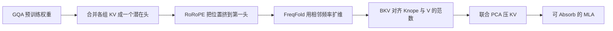

# TransMLA：把现成的 GQA 模型改成 MLA，而不是从零再训

<!-- release-date: 2025-02-11 -->

**本文依据**：`TransMLA: MLA Is All You Need`（封面标题；`pdfinfo` Title 为 `TransMLA: Multi-Head Latent Attention Is All You Need`），arXiv 2502.07864v5（[cs.LG] 12 Jun 2025），27 页。封面印 **Preprint. Under review.**，本文不把它写成已录用。作者 Fanxu Meng、Pingzhi Tang 等，封面第一单位 Institute for Artificial Intelligence, Peking University；另有 BIGAI、Tencent Youtu Lab、Xiaomi。GitHub 印在封面：https://github.com/fxmeng/TransMLA。v1 首发 2025-02-11；解读依据 v5。文中数字都标 PDF 页码；标「外部补充」的段落不来自本文。

## 一句话

DeepSeek 那套 **多头潜在注意力（MLA，Multi-Head Latent Attention）** 在同样 KV 预算下比 **分组查询注意力（GQA，Group-Query Attention）** 更会表达，但业界已经把大量算力砸在 GQA 模型上。TransMLA 做的不是再发明一种注意力，而是把 LLaMA、Qwen、Gemma、Mistral 这类 **已经训好的 GQA 权重** 改成能进 DeepSeek 代码栈的 MLA：先把位置信息挤进少量 RoPE 维，再对剩下的 Key 与 Value 做平衡后的联合低秩压缩。LLaMA-2-7B 压掉约 93% KV 后，8K 上下文上相对原 GQA 有最高 **10.6 倍** 加速（图 5）；再花 **6B token** 微调，六项常识基准大致能回来（p1、p9 表 1）。

## 一、矛盾：MLA 更好，但没人愿意从零再训

自回归解码要把每个历史 token 的 Key、Value 放进缓存。序列一长，瓶颈常常不是算力，而是 **通信与显存**（p1）。GQA 让一组 query 头共享一对 KV 头，组数等于 1 时退化成 **多查询注意力（MQA，Multi-Query Attention）**，组数等于头数时回到标准多头注意力（MHA）。省缓存的代价是质量（p2）。

MLA 用低秩矩阵压 KV，再用 **Absorb** 让推理时不必把潜在向量再胀回原尺寸（p1、p5）。DeepSeek V2/V3/R1 走通了这条路。论文要回答的却是另一件事：**已经投在 GQA 上的预训练，能不能继承下来，而不是推倒重训 MLA**（p2）。

卡点很具体。GQA 的 **每个** query–key 头都带着 **旋转位置编码（RoPE，Rotary Positional Embedding）**。RoPE 一绑在所有头上，Absorb 就做不成——因为位置旋转不能被「吸进」query 投影里（p2）。Palu 一类低秩压 KV 的工作正因为没单独处理 RoPE，推理时还要把压缩表示投回原尺寸，加速被吃掉（p3）。

所以 TransMLA 的主线是：

**先把位置信号集中到很少的维（$K_{\text{rope}}$）→ 其余维去掉 RoPE（$K_{\text{nope}}$）再和 $V$ 一起压 → 变成 DeepSeek 能 Absorb 的 MLA。**

上图按第 4 节流水线重画，机制示意，不是实测时间线（p5–p8）。

## 二、同一份 KV 预算，MLA 为什么比 GQA 更能表达

第 4 节开头给了两条观察（p5）：

1. **固定 KV 预算时，MLA 严格比 GQA 更能表达。** 附录 A 证明：任意 GQA 层都可以靠多引入一个投影矩阵改写成 MLA；反过来不总成立。有 RoPE 时，这个等价要写在 Absorb 形式上。
2. **真加速只发生在缓存真变小的时候。** 只做「GQA 的 MLA 写法」而不压维，缓存还是 $2gd$，头维还涨了 $g$ 倍，算力更贵（p6 式 11–15）。

封面图 1a 的措辞是：同样 KV 大小下，表达力按 **GQA → MLA → MQA** 单向变强（p1）。正文证明写的是 MLA 覆盖 GQA。读者不要把这句话理解成「MQA 一定比 MLA 准」——那是 **同样缓存开销下的包含关系**，不是基准分数排序。

合并 KV 头的初始化很机械：给每个 query 头一块 $W_i^{UK}\in\mathbb{R}^{d\times gd}$，只在对应组上放单位阵，其余为零；$W_i^{UV}$ 同样处理。RoPE 也合成一个大的、每 $d$ 维重复一次的旋转。输出与原 GQA 等价，缓存尺寸不变（p5–p6）。压缩发生在后面。

## 三、RoRoPE：在不改注意力分数的前提下，把位置挤进第一头

Absorb 要求：**真正参与低秩瓶颈的那路 Key 不能再带着每头一份 RoPE。** DeepSeek 的解法是解耦 RoPE：另开一小段 $q^R$、$k^R$ 专门转位置（p5 式 7–8）。TransMLA 要从现成 GQA 权重里 **造出** 类似的解耦。

RoRoPE 的想法（图 2，p6）：

- 多头 Key 拼成一条后，**同一旋转频率** 的实部、虚部可以跨头对齐。
- 对每个频率 $l$，在这 $g$ 个头的二维子空间上做 PCA，得到正交阵 $U_l$。
- 只要 **同一频率、实部虚部用同一个 $U_l$**，RoPE 之后的内积不变（p7 式 19）。

论文把它写成两条硬条件（p2）：旋转只发生在 **各头同一维**；RoPE 的实部与虚部 **同一套转法**。

转完之后，大范数几乎都落到前几个头（LLaMA 3 8B 第一层大约是维 0–128，图 3a，p10）。作者 **并不丢掉** 非主成分，只是 **拿掉它们的 RoPE**，位置主要留在第一头（p7）。这样后面才能对 $K_{\text{nope}}$ 做 Absorb。

只用一维装全部位置不够。**FreqFold** 把相邻 RoPE 频率近似成同一个频率，于是第一头里可以用多维来装位置（p7、附录 C）。图 3b 在 WikiText-2 上逐步拆 RoPE：高拆除比下 RoRoPE 明显好过 MHA2MLA 按 query/key 范数选维的策略；**90% 拆除** 时 RoRoPE + 4D-FreqFold 的 log-困惑度大约还在 **2**，MHA2MLA 接近 **6**，后者已经不像在说人话（p9）。8D-FreqFold 过猛会变差——近似误差压过了「更会集中」的好处。对 LLaMA 3 8B，作者认为甜点是 **RoRoPE + 4D-FreqFold**（p9）。

这些曲线是 **拆 RoPE 的困惑度**，还不是最终压 KV 的分数。

## 四、BKV：范数不齐，联合 PCA 会把 Value 吃掉

位置拆开后，对 $K_{\text{nope}}$ 与 $V$ 用一小份校准激活做联合 PCA，把投影压到低秩潜在空间（p8）。校准数据在附录里写的是 WikiText-2（p24）。

问题：即便去掉范数最大的第一头，$K_{\text{nope}}$ 的 $\ell_2$ 仍远大于 $V$。直接对拼接矩阵做 PCA，主成分被 Key 霸占，Value 子空间丢得很惨（p2、p8、图 4a）。

**平衡 KV（BKV，Balanced Key–Value）** 先算一个标量（p8 式 20）：

$$
\alpha = \frac{\mathbb{E}_t[\|W_{\text{NoPE}}^{DK}x_t\|_2]}{\mathbb{E}_t[\|W^{DV}x_t\|_2]}
$$

$W^{DK}$ 除以 $\alpha$，$W^{UK}$ 乘以 $\alpha$。输出数学上等价，只是让后续 PCA 两边量级对齐。图 4b：无论对权重做 PCA 还是对激活做 PCA，加 BKV 都降低联合低秩的损失；**激活 PCA 明显好于权重 PCA**（p10）。

作者自己在结论里说 BKV「相对平凡」，并问有没有更强的数学工具能做到真正 **免训练转换**（p11）。这是论文自己划的边界，不是外人苛责。

压完之后，$W^{UK}$（已无 RoPE 的那路）可以像 DeepSeek 一样吸进 query 投影，推理走式 10 那种共享大 KV 头（p5）。论文把 **无缝支持 Absorb** 写成自己的主要贡献之一（p5）。

## 五、实验：免训练掉多少、补多少 token 能回来

设置对齐并发工作 MHA2MLA：转 **SmolLM 1.7B** 与 **LLaMA-2-7B**，六项常识基准（MMLU、ARC、PIQA、HellaSwag、OBQA、Winogrande），看转换前、转换后不训、再训（p8）。训练数据复刻 MHA2MLA 的 SmolLM 预训练混合（附录表 2：fineweb-edu-dedup 0.70 等，p25）。机器：8 卡，每卡 40GB、312 TFLOPS FP16（p8）。MHA2MLA 微调数字直接引自原文（p8）。

引入里还有一句：LLaMA-2 KV **压 68.75%**，六项平均 **免训练只掉 1.65%**；MHA2MLA 同设定掉 **21.85%**（p3）。表 1 对应 LLaMA-2-7B 原平均 **59.85**、TransMLA 免训练 **-68.75%** 为 **58.20**，差 1.65；MHA2MLA 同列 **37.90**（p9）。正文 21.85% 与 $59.85-37.90=21.95$ 差 0.1，解读以 **表 1 单元格** 为准。

从 p9 表 1 抽出对照（「KV Mem.」是相对原缓存的压缩比例，负号表示压掉的比例）：

| 模型 | token | KV | Avg. | MMLU | ARC | PIQA | HS | OBQA | WG |
|---|---|---|---|---|---|---|---|---|---|
| SmolLM-1.7B 原 | 1T | — | 55.90 | 39.27 | 59.87 | 75.73 | 62.93 | 42.80 | 54.85 |
| MHA2MLA | 0 | -68.75% | 40.97 | 27.73 | 41.96 | 63.00 | 29.19 | 34.40 | 49.53 |
| TransMLA | 0 | -68.75% | 51.95 | 35.70 | 55.68 | 73.94 | 53.04 | 39.80 | 53.51 |
| TransMLA | 300M | -68.75% | 55.24 | 38.60 | 58.95 | 74.97 | 61.52 | 43.00 | 54.38 |
| TransMLA | 1B | -87.50% | 54.01 | 37.24 | 56.32 | 74.81 | 60.08 | 42.40 | 53.20 |
| LLaMA-2-7B 原 | 2T | — | 59.85 | 41.43 | 59.24 | 78.40 | 73.29 | 41.80 | 64.96 |
| MHA2MLA | 0 | -68.75% | 37.90 | 25.74 | 32.87 | 59.41 | 28.68 | 28.60 | 52.09 |
| TransMLA | 0 | -68.75% | 58.20 | 39.90 | 57.66 | 77.48 | 70.22 | 41.00 | 62.90 |
| TransMLA | 0 | -92.97% | 43.26 | 28.93 | 36.32 | 63.38 | 45.87 | 31.60 | 53.43 |
| TransMLA | 500M | -68.75% | 59.82 | 40.87 | 59.18 | 77.91 | 71.82 | 45.20 | 63.93 |
| TransMLA | 6B | -92.97% | 58.68 | 40.82 | 59.72 | 76.55 | 69.97 | 43.60 | 61.40 |

读表时有几条作者自己强调的（p8）：

- 免训练掉点明显小于 MHA2MLA。LLaMA-2 压到原缓存的 **7.03%**（即 -92.97%），免训练平均 **43.26**，仍高于 MHA2MLA 只压到 **31.25%** 时的 **37.90**。
- SmolLM 压到 31.25% 原尺寸（即 -68.75%）时，TransMLA 用 **300M** token、约 **2 小时**，平均 **55.24**，超过 MHA2MLA 用 **6B** 的 **54.76**；作者写「只需 MHA2MLA 训练数据的 4.9%」（p8）。
- 摘要里的 **6B token 恢复可比表现**，对应表 1 最后一行：LLaMA-2 **-92.97%**、6B、Avg. **58.68** vs 原 **59.85**（p1、p9）。

附录表 3 补超参：例如 LLaMA-2 **-92.97%** 是两段训练，batch 256/64，lr $1\times10^{-4}$ / $2\times10^{-5}$，token 5B/1B，序列 4096（p25）。「6B」是两段相加。

附录 G 用 vLLM 文档里的句子做定性：-92.97% **完全不训** 仍能吐出连贯英文，只是事实会飘（法国首都那段后面扯到 Iberian Plain）；6B 继续预训练或 SmolTalk 上 SFT 一轮后更像正常人答题（p26–p27 表 5）。这是例子，不是分数。

## 六、vLLM 上的加速：图 5 写 10.6×，表 4 是吞吐单元格

第 5.4 节把 **-92.97% KV** 的 MLA 接到 DeepSeek 代码与 vLLM，在三块消费级加速器上对比原 LLaMA-2-7B（p11 图 5）：

- 165.2 TFLOPS / 24GB
- 312 TFLOPS / 40GB
- 320 TFLOPS / 64GB

曲线分 Low-rank Q（query 也压，图注写 Low Rank Q = 512）与 Full-rank Q。上下文是 **输入加生成的总长**。加速随长度涨，因为收益来自 KV。作者写 **第一块硬件、8K 总长上 10.6 倍**；并称 MHA2MLA **没有报过推理加速**（p11）。

附录表 4 给的是吞吐（output tokens/s），设定输入长度 = 输出长度，多数长度 100 条请求，1K 用 1000 条压抖动；原 LLaMA-2-7B 官方窗口 4096，评测把上限拉到 32K（p25）：

| 总长 | 请求数 | 模型 | 165.2 TF / 24GB | 312 TF / 40GB | 320 TF / 64GB |
|---|---|---|---|---|---|
| 1K | 1000 | LLaMA-2-7B | 653.81 | 1579.26 | 1249.13 |
| 1K | 1000 | TransMLA | 3043.65 | 4062.43 | 1798.17 |
| 8K | 100 | LLaMA-2-7B | 85.80 | 218.51 | 216.66 |
| 8K | 100 | TransMLA | 832.69 | 1118.18 | 870.15 |
| 16K | 100 | LLaMA-2-7B | OOM | 110.58 | 112.13 |
| 16K | 100 | TransMLA | 414.41 | 601.36 | 483.22 |
| 32K | 100 | LLaMA-2-7B | OOM | 38.32 | 55.69 |
| 32K | 100 | TransMLA | OOM | 243.81 | 278.09 |

8K、24GB 那一档 $832.69/85.80\approx 9.7$，与图 5 / 摘要的 **10.6×** 对不齐。可能图用了 Low-rank Q、表是另一配置，论文没写换算。**对外引用 10.6× 时应对着图 5**；要对硬件复现应对着表 4。320 TF / 64GB 用的是开发版 vLLM，作者预期后续优化还会再涨（p25）。摘要里「93%」对应表中的 **92.97%**。

## 七、和谁划清、论文承认没做完什么

**不是又一种注意力。** 相关工作把 GLA、TPA 放在「新结构 / 要从零训」一侧；TransMLA 是 **转换器**，轻微调后吃 MLA 的显存与速度（p3）。

**不是 Palu。** Palu 低秩压 KV，但不解 RoPE，不能 Absorb，推理还要胀回去（p3）。

**不是 MHA2MLA 的 GQA 插件。** 两边都声称支持 MHA 与 GQA。差别是：MHA2MLA 只按 Q/K 范数决定拆哪段 RoPE，同等拆除信息丢得更多；重要维分布不均，要稀疏索引，不好加速；只报压缩比、不报真实加速；KV 直接联合 SVD，损失大于 BKV-PCA（p3）。

**没写进实验的。** 摘要点名 LLaMA、Qwen、Gemma、Mistral/Mixtral 都能转（p1），主表只有 SmolLM 1.7B 与 LLaMA-2-7B；范数分析用 LLaMA 3 8B（p8–p10）。结论要求在更多模型上验证，并与剪枝、量化、token 选择合用（p11）。FP8 与 Multi-Token Prediction 只在摘要里当作 **可以接着吃的 DeepSeek 优化**，本文没有单独数字（p1）。

KV 平衡「平凡」、免训练转换仍不完美，是作者原文（p11）。

## 八、可迁移的三条

**① 挡 Absorb 的往往是「每头一份 RoPE」，不是低秩本身。** 想把现成 Transformer 接到 MLA 推理栈，先问位置旋转能不能从共享潜在 KV 上剥下来。等价旋转（同一频率、实虚同 $U$）比按范数砍维更不容易把分数砍崩。

**② 联合压缩前先看两条通路的范数。** $K$ 与 $V$ 量级差一个数量级时，PCA/SVD 会变成「只保 Key」。先标定再分解，比换一个更花哨的分解器便宜。论文自己也说这步还不够强。

**③ 结构转换的验收要看两张表：质量表和吞吐表。** 只报压缩比、不报 Absorb 之后的 tokens/s，说明还停在「长得像 MLA」。TransMLA 把兼容 DeepSeek / vLLM / SGLang 写成产品目标（p1 写作 SGlang）。

## 读完该留下的判断

- **被实验支持的**：LLaMA-2 压 68.75% KV 免训练六项平均从 59.85 到 58.20；压到 7.03% 再用 6B token 到 58.68；RoRoPE 相对 MHA2MLA 的拆 RoPE 曲线；BKV 降低联合低秩损失；vLLM 三硬件上的吞吐与图 5 的 10.6× 声明。
- **是包含关系而不是分数排名的**：同样 KV 预算下 MLA 覆盖 GQA（附录 A）；图 1a 把 MQA 画在表达力更强的一端，主文没有用 MQA 打六项基准。
- **论文没兑现或对不齐的**：摘要「任意 GQA」与主实验只有两个模型；10.6× 与表 4 的 8K/24GB 比值不一致；Qwen/Gemma/Mistral 转换没有表。

## 参考资料

- 原件：`readings/_src/注意力与长上下文/TransMLA.pdf`（arXiv 2502.07864v5）
- 代码（封面）：https://github.com/fxmeng/TransMLA
- 并发对照（本文只引用其被引用的数字，不展开该方法本身）：MHA2MLA，arXiv 2502.14837
