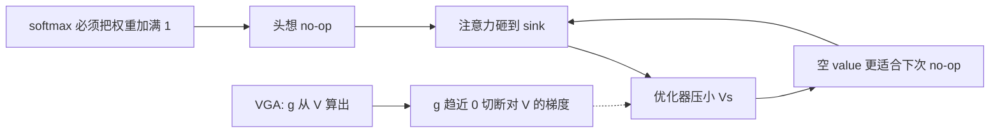

# VGA：在 Value 上关门，打断注意力沉没与数值抽干的正反馈

<!-- release-date: 2025-10-10 -->

**本文依据**：`VALUE-STATE GATED ATTENTION FOR MITIGATING EXTREME-TOKEN PHENOMENA IN TRANSFORMERS`，arXiv 2510.09017v3（[cs.LG] 26 Jan 2026），14 页。第一作者 Rui Bu，封面脚注 **1 = Ant Group**；2 = WICT, Peking University。共同一作 Haofeng Zhong；通讯 Wenzheng Chen、Yangyan Li。封面没有会议名。首发日按任务给定取 2025-10-10。文中数字都标 PDF 页码；标「外部补充」的段落不来自本文。

## 一句话

Softmax 注意力每次都必须把权重加总为 1。头想「什么都不看」时，只好把预算砸到某个方便的 sink token 上；优化器为了让这次加权不污染输出，就把该 token 的 value 范数往零压——value 越空，下次越适合当 sink。这就是 Guo 等人（2024）说的**相互强化环**（mutual reinforcement cycle）。本文提出 **Value-State Gated Attention（VGA，价值状态门控注意力）**：门 $g_j=\sigma(V_j W_g)$ 直接从 **value 向量**算出来，再去调制注意力输出。门关死时，流向 $V_s$ 的梯度也被切断，不必把 value 抽干就能做 no-op。Bigram-Backcopy 上 VGA 不再把注意力塌到 `<s>`；BERT / OPT-125m 上困惑度不差于或优于对照，激活尖峰更小；INT8 训练后量化（PTQ）上 BERT 相对 FP32 只涨 **+0.12** 困惑度，OPT 涨 **+0.93**（表 2，PDF p. 9）。封面没有会议名。作者明确没做大模型预训练；结论第 5 节把「更大模型上更明显」写成希望，不是本文实验。

## 读前三个词

- **注意力沉没（attention sink）**：某些位置（常见是开头 `<s>`）拿到与语义无关的超高注意力。
- **价值抽干（value-state drain）**：这些 sink 的 value 向量范数被压到接近 0。
- **残差尖峰（residual-state peak）**：更深模型里 sink 的残差范数异常变大。引言把它和前两者并列为「极端 token 现象」三件套（PDF p. 1），正文实验没有单独量化残差尖峰。

输入门控注意力（Input-State Gated Attention，**IGA**，Bondarenko 等 2023、Qiu 等 2025）也加门，但门来自 **输入嵌入 $X_j$**，对 $V$ 是常数。本文主张：病理出在 $V$ 的优化动力学上，门必须挂在 $V$ 自己身上才是反应式负反馈，而不是预测式旁路（PDF p. 5）。

上图根据 PDF 图 2、图 3 与第 3 节重画，是机制示意，不是实测曲线。

## 一、矛盾：想什么都不看，softmax 却不许空仓

标准单头注意力（PDF p. 4 公式 1–2）：$Q=XW_Q$、$K=XW_K$、$V=XW_V$，

$$
\alpha=\mathrm{softmax}\bigl(QK^\top/\sqrt{d}\bigr),\qquad z_i=\sum_{j=1}^{n}\alpha_{ij}V_j.
$$

$\alpha$ 每行非负且和为 1，所以 $z_i$ 永远是 value 的凸组合。头若需要 no-op（对输出贡献尽量小），不能「谁都不看」，只能把预算倒给结构上方便的一个位置，于是出现 sink（PDF p. 4）。

对任意 $V_j$，损失梯度是注意力权重对上游梯度的缩放（公式 3，PDF p. 4）：

$$
\frac{\partial L}{\partial V_j}=\sum_{i=1}^{n}\alpha_{ij}\frac{\partial L}{\partial z_i}.
$$

极限 $\alpha_{is}\to 1$ 时，$V_s$ 吃到几乎全部上游梯度，别的 $V_j$ 梯度消失。为了在超高 $\alpha_{is}$ 下仍把输出压小，优化器只能把 $\|V_s\|$ 往零推——价值抽干。抽干之后这个位置对输出几乎无害，下次 no-op 更愿意再砸过来。图 2 把这画成不稳定正反馈（PDF p. 5）。作者借用控制论语言，称它是正反馈环（Ogata 2010，PDF p. 2）。

后果写在引言（PDF p. 1）：残差范数疯长会让训练数值不稳；激活动态范围变宽，量化掉点；注意力权重不再等于语义重要性，可解释性坏掉。

相关工作把对策分成三类（PDF p. 2–3）：

1. **后处理**：改权重的轻量微调，或推理时改中间状态；StreamingLLM 一类还要**故意把预训练里的 sink 带进下游**才能保住分。
2. **预训练改注意力**：register token 当垃圾桶；换掉 softmax、给分数加 clip、或学一个 sink 槽。
3. **门控**：LSTM / GRU 以及近年 Transformer 门控很多，但用来治这条优化病理的，先前主要是从 **输入嵌入** 预测门（IGA）。

本文自称是第一个完全反应式、对着 **涌现出来的 value 状态** 做自调节的门（PDF p. 3）。动机之一是训练后量化（PTQ）：极端 token 制造激活离群点，动态范围变宽，低比特映射掉精度。实验沿用 Bondarenko 等（2023）的 PTQ 设定（PDF p. 3）。

## 二、IGA 为什么还不够：门不看见 $V$ 的病

IGA（公式 4–5，PDF p. 4–5）：$g_j=\sigma(X_j W_g)$，

$$
z_i=\sum_{j=1}^{n} g_j\alpha_{ij}V_j,\qquad
\frac{\partial L}{\partial V_j}=\sum_{i=1}^{n} g_j\alpha_{ij}\frac{\partial L}{\partial z_i}.
$$

多了一条「收多少信息」的权重，$g$ 与 $\alpha$ 分工：$\alpha$ 决定看哪，$g$ 决定放多少。sink 时模型可以学 $g_s\to 0$。但 $g$ 是 $X$ 的函数，对 $V$ 是常数。优化器仍看见一条「把 $V$ 缩小就能清零输出」的直路。作者称之为预测式、间接的控制（PDF p. 5）。

## 三、VGA：门挂在 $V$ 上，关闸等于切断梯度

公式 6（PDF p. 5）：$g_j=\sigma(V_j W_g)$，再按与公式 4 相同的方式乘到输出上。作者强调 IGA 与 VGA **唯一**差别是门的自变量：输入状态对价值状态。参数量和计算开销与 IGA 同级：一次投到低维再逐元素运算，相对整网可忽略（PDF p. 5）。

因为 $g_j$ 依赖 $V_j$，对 $g_j V_j$ 要用乘法法则（公式 7–8，PDF p. 6）。拆成两条通路：

$$
\frac{\partial L}{\partial V_j}=\sum_{i=1}^{n}\alpha_{ij}\Bigl[g_j I + g_j(1-g_j)W_g V_j\Bigr]\frac{\partial L}{\partial z_i}.
$$

- **内容通路** $g_j I$：value 当语义内容，被门缩放。
- **自调节通路** $g_j(1-g_j)W_g V_j$：$V_j$ 改自己的门。

sink 且 $g_s\to 0$ 时两条都灭：内容通路随 $g_s$ 消失；自调节通路还含 sigmoid 导数 $g_s(1-g_s)\to 0$。于是 $\partial L/\partial V_s\to 0$。高注意力不再等于「必须把 $V$ 打死」。图 3 画的就是关闸切断流向 $V_s$ 的梯度（PDF p. 5）。

$g(1-g)$ 在 $g=0.5$ 最大，门已经确定开或关时变弱。作者把它读成「过渡期反馈最强、稳态不强行振荡」的控制器性质（PDF p. 6）。这是对公式形状的解读，不是单独的稳定性定理。

附录 A 把 Jacobian 写完整（PDF p. 12–13）：$\partial(g_j V_j)/\partial V_j=g_j I+g_j(1-g_j)W_g V_j$。附录 B 给出多头实现（PDF p. 13–14）：全头共享 $V\in\mathbb{R}^{N\times d}$，一次 $g=\sigma(V W_g)$，$g\in\mathbb{R}^{N\times h}$，$W_g\in\mathbb{R}^{d\times h}$。第 $j$ 头输出

$$
O_{\mathrm{VGA},j}=g_j\odot O_j,\quad O_j=\mathrm{Attention}(Q_j,K_j,V_j),
$$

$g_j$ 在特征维上广播。再拼接、再过输出投影。这里门乘的是 **已经混合后的头输出**，而第 3.2 节正文写的是与公式 4 相同、乘在 $\alpha_{ij}V_j$ 上。两处都来自同一份 PDF；实现时以附录 B 的多头公式为准更接近可写代码的描述。VGA **正交于注意力分数**：softmax 照旧算，$\alpha$ 的长程建模能力被刻意留下（PDF p. 2、p. 14）。

相对 Guo 等（2024）用 ReLU 换 softmax：作者认为 softmax 仍是分配有限注意力预算的核心，拿掉可能伤表达力；VGA 是轻量加法组件，只修一种失败模式（PDF p. 8）。

引言还写 VGA 能在微调场景里纠正已有病理（PDF p. 2）。第 4 节三个实验都不叫微调纠正；这句话没有对应表格。

## 四、实验 1：Bigram-Backcopy 上把环拆开

任务来自 Guo 等（2024）（PDF p. 6–7）：

1. **Bigram**：多数非触发 token，下一个词来自固定 bigram，注意力帮不上忙。
2. **Backcopy**：碰到触发 token（如 $t$），丢掉 bigram，去抄触发词前面那个 token，注意力必须对准要抄的位置。

三种模型：vanilla Transformer、IGA、VGA。图 4、图 5（PDF p. 7）。

**注意力（图 4a）**：vanilla 在非触发 query 上把注意力塌到无语义的 `<s>`。IGA 比 vanilla 散一些，仍不如 VGA 干净。VGA 没有单一万能 sink。

**Value 范数（图 4b）**：vanilla 的 `<s>` value 被压向 0。IGA 缓解「压到零」，但范数达不到 VGA 那种与其它 token 相当的非病理水平。VGA 上这条病基本看不见。

**训练曲线（图 5）** 跟踪：Backcopy risk / Bigram risk（越低越好）；$\mathrm{Attn}_{\langle s\rangle}$（非触发 query 打到 `<s>` 的平均注意力）；$\|Val_{\langle s\rangle}\|$；$ \Delta\mathrm{logit}.\langle s\rangle$（sink 的注意力 logit 减其它 key 的均值）。Vanilla：$\mathrm{Attn}$ 与 $\Delta\mathrm{logit}$ 稳步升，$\|Val\|$ 塌向 0，正是环的签名。IGA 减慢、减小注意力侧的恶化。VGA 任务学得同样好，病理指标全程停在非极端水平。图是定性对照，正文没有给这些曲线的最终标量。

可解释性（PDF p. 8）：$g_j$ 把「注意力有多大」和「信息贡献有多大」拆开。高 $\alpha$ 配近零门，就是显式 no-op。Vanilla 里高注意力既可能是重要，也可能是病理。

## 五、实验 2–3：BERT / OPT-125m 与 INT8 PTQ

设定跟 Bondarenko 等（2023）：BERT、OPT-125m，数据 BookCorpus + 英文 Wikipedia（PDF p. 8）。正文写「三个代表模型」但只点名这两个（PDF p. 8）。指标：困惑度；Max I+O Norm（最极端输入+输出范数）；Avg. kurtosis（激活重尾）。基线：Vanilla softmax、Register Tokens、Learnable Sink、IGA（PDF p. 8–9）。

### 表 1 全精度（PDF p. 8）

| 模型 | 方法 | 困惑度 ↓ | Max I+O Norm ↓ | Avg. kurtosis ↓ |
|---|---|---:|---:|---:|
| BERT | Vanilla | $4.52\pm 0.03$ | $812.39\pm 141.62$ | $2987.23\pm 313.21$ |
| BERT | Register Tokens | $4.53\pm 0.01$ | $1205.91\pm 223.14$ | $7812.73\pm 1281.12$ |
| BERT | Learnable Sink | $4.53\pm 0.02$ | $41.65\pm 7.83$ | $225.88\pm 41.81$ |
| BERT | IGA | $4.53\pm 0.01$ | $38.71\pm 10.19$ | $90.65\pm 5.78$ |
| BERT | VGA | $4.52\pm 0.00$ | $33.19\pm 6.75$ | $84.55\pm 2.84$ |
| OPT | Vanilla | $15.95\pm 0.03$ | $1.01\pm 0.04$ | $2177\pm 274$ |
| OPT | Register Tokens | $15.85\pm 0.04$ | $0.75\pm 0.03$ | $8322.68\pm 1197.74$ |
| OPT | Learnable Sink | $15.92\pm 0.01$ | $0.77\pm 0.03$ | $22.23\pm 6.77$ |
| OPT | IGA | $15.65\pm 0.01$ | $0.50\pm 0.02$ | $102\pm 1.32$ |
| OPT | VGA | $15.49\pm 0.00$ | $0.45\pm 0.03$ | $34.77\pm 4.65$ |

读表时不要写成「每一格 VGA 都最小」：OPT 上 Learnable Sink 的 kurtosis **22.23** 低于 VGA 的 **34.77**；VGA 赢在困惑度（15.49 对 15.92）和 Max I+O Norm（0.45 对 0.77）。Register Tokens 在 BERT / OPT 上都把 kurtosis 推得比 Vanilla 更糟，作者认为它只是换了个 sink，甚至加重离群（PDF p. 9）。Learnable Sink 的槽是训练时学死的嵌入，不能随输入变；IGA 的预测门解耦不如直接挂在涌现 $V$ 上的反应门（PDF p. 9）。BERT 上 VGA 与 Vanilla 困惑度同为 **4.52** 量级，收益主要在稳定性，不是语言建模暴涨。

### 表 2 INT8 PTQ（PDF p. 9）

$\Delta$ 困惑度相对表 1 的 FP32。

| 模型 | 方法 | INT8 困惑度 ↓ | $\Delta$ vs FP32 ↓ | Max I+O Norm ↓ | Avg. kurtosis ↓ |
|---|---|---:|---:|---:|---:|
| BERT | Vanilla | $617.32\pm 191.20$ | $+612.80$ | $486.19\pm 227.62$ | $2508.21\pm 1394.71$ |
| BERT | Register Tokens | $913.67\pm 839.10$ | $+909.14$ | $415.27\pm 218.05$ | $7284.18\pm 3365.82$ |
| BERT | Learnable Sink | $4.79\pm 0.03$ | $+0.26$ | $42.82\pm 2.69$ | $153.47\pm 38.97$ |
| BERT | IGA | $4.67\pm 0.01$ | $+0.15$ | $45.06\pm 1.50$ | $91.27\pm 2.88$ |
| BERT | VGA | $4.64\pm 0.01$ | $+0.12$ | $37.1\pm 2.37$ | $78.32\pm 1.82$ |
| OPT | Vanilla | $43.78\pm 6.81$ | $+27.83$ | $657.77\pm 240.89$ | $6548.18\pm 1567.07$ |
| OPT | Register Tokens | $123.81\pm 91.77$ | $+107.96$ | $835.33\pm 274.83$ | $6646.24\pm 3735.05$ |
| OPT | Learnable Sink | $17.31\pm 0.01$ | $+1.39$ | $114.45\pm 4.05$ | $26.35\pm 4.26$ |
| OPT | IGA | $16.77\pm 0.01$ | $+1.12$ | $102.15\pm 3.81$ | $95.48\pm 6.12$ |
| OPT | VGA | $16.42\pm 0.01$ | $+0.93$ | $100.01\pm 3.44$ | $18.34\pm 1.65$ |

Vanilla BERT 量化后困惑度崩到 **617**；Register 更崩。VGA 在两模型上都是最小 $\Delta$ 困惑度，同时 Max I+O 最低；INT8 上 OPT 的 kurtosis VGA **18.34** 也低于 Learnable Sink 的 **26.35**（与表 1 全精度顺序不同，以各表自己的列为准）。作者计划把 VGA 做到低比特预训练，本文没做（PDF p. 9）。

## 六、没写什么，以及能搬走什么

没写：大模型从零预训练；视觉 / 多模态实验；残差尖峰的定量曲线；训练步数、学习率、层数、头数、序列长（除任务设定外）；代码仓库。第 5 节承认更大模型上的实验超出本组算力，希望别人「改几行代码」去试（PDF p. 9）。附录 C：写稿时用 LLM 做语言润色，科学内容作者负责（PDF p. 14）。致谢 Jinming Cao 校对（PDF p. 10）。

可迁移的不是「再发明一种注意力」，而是：

1. **No-op 需要单独通道。** Softmax 加满 1 时，别逼优化器用「抽干 $V$」冒充空操作。
2. **病在 $V$ 的梯度耦合，门就应看见 $V$。** 只对 $X$ 预测，优化器仍能走缩小 $V$ 的捷径。
3. **修病理尽量正交于分数。** 留下 softmax 的预算分配，把抑制放到输出门上，比换核函数更像可插拔补丁。
4. **量化友好是稳定性的下游。** 表 2 的 $\Delta$ 困惑度，是表 1 激活尖峰被按住之后的结果，不是另训一个量化模型。

一句话收回全景：VGA 用 $V$ 自己的门给注意力加了一条可关掉的输出通路，让「高注意力」不必等于「必须毁掉这个 value」。证据在合成任务的定性环拆解，以及 BERT / OPT-125m 的稳定性和 INT8 掉点；证据不在百亿参数预训练。
