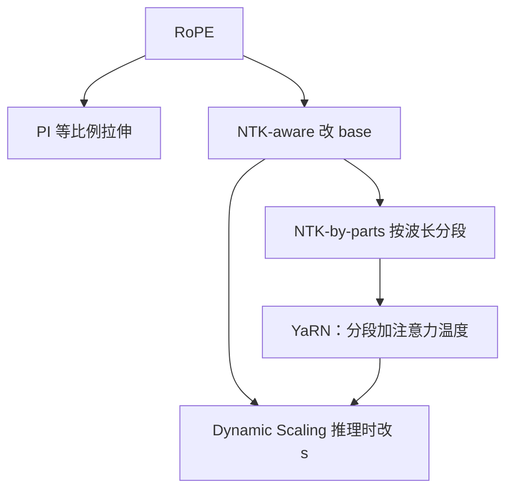

# YaRN：少微调、按频率分段，把 RoPE 窗口拉长

<!-- release-date: 2023-08-31 -->

**本文依据**：`YaRN: Efficient Context Window Extension of Large Language Models`，arXiv 2309.00071v3（[cs.CL] 6 Feb 2026），20 页。作者 Bowen Peng、Jeffrey Quesnelle（共同一作）、Honglu Fan、Enrico Shippole，封面第一单位 **Nous Research**；Honglu Fan 另标 EleutherAI 与 University of Geneva。通讯 `{bloc,emozilla}@nousresearch.com`（PDF p. 1）。封面没有会议名。文中数字标 PDF 页码；标「外部补充」的段落不来自本文。代码仓印在摘要：https://github.com/jquesnelle/yarn。

## 一句话

RoPE 模型训到多长，推理往往就卡在多长。YaRN 不改注意力实现，只改旋转频率的插值方式，再给 softmax 前加一个温度；微调量很小，并能在微调数据更短时测更长。摘要写「比先前方法少 10 倍 token、少 2.5 倍训练步」。**表赢**：表 6 对照的是 PI 1000 步对 YaRN 400 步（2.5 倍步数与数据）；表 4 给的是 A100 小时，不是 token 倍数（PDF p. 1、p. 9、p. 17）。

## 一、矛盾：相对位置写进了旋转，窗口却仍卡在预训练长度

Transformer 的上下文窗口由训练长度钉死。想用少量微调（甚至不微调）把窗口拉长，讨论几乎都落在位置编码上（PDF p. 1）。当时常见的相对方案有 T5 Relative Bias、RoPE、XPos、ALiBi。ALiBi 能做有限外推，但论文引用 Kazemnejad et al.：没有哪一种能稳定泛化到远超预训练长度的序列（PDF p. 1）。

RoPE 把位置写进 query / key 的旋转，内积只看见相对距离。这并不自动等于「没见过的长度也能用」。后续工作走的是**改 RoPE 公式再微调**：Chen et al. 与 kaiokendev 的 **位置插值（Position Interpolation，PI）**；bloc97 的 **NTK-aware**；再分出给无微调推理用的 **Dynamic NTK**，以及微调时更好的 **NTK-by-parts**（PDF p. 1）。Code Llama 用了 NTK-aware（把 base 调到 1M，文中称 ABF）；Qwen 7B 用了 Dynamic NTK（PDF p. 2）。

YaRN 的全称是 Yet another RoPE extensioN。它把上述未正式发表的插值写法收进一篇，再叠一层注意力温度，目标模型族包括 LLaMA、GPT-NeoX、PaLM（PDF p. 2）。论文声明：微调数据不到原预训练的约 0.1%；再叠推理时的 Dynamic Scaling，Dynamic-YaRN 可在无微调时把窗口扩到两倍以上（PDF p. 2）。ReRoPE 与同期 LM-Infinite 因改注意力、与 Flash Attention 2 不直接兼容，本文不做对照（PDF p. 3）。

方法谱系如下（根据 PDF p. 2 图 1 重画，机制示意，非实测）：

## 二、记号：改 $g(m)$ 和 $h(\theta)$ 就算一种插值

隐藏层神经元集合记 $D$。query / key 为 $q_m=f_q(x_m,m)$、$k_n=f_k(x_n,n)$，注意力是 $q_m^\top k_n/\sqrt{|D|}$ 过 softmax（PDF p. 2 式 1–2）。RoPE 把偶数维空间看成复空间，交错实部虚部（PDF p. 2 式 3–4）。对任意线性算子 $W$，

$$
f_W(x_m,m,\theta)=e^{im\theta}W x_m
$$

（PDF p. 3 式 5），$f_q=f_{W_q}$、$f_k=f_{W_k}$，$\theta_d=b^{-2d/|D|}$，$b=10000$（PDF p. 3 式 6）。每个复维各有频率 $\theta_d$，内积只依赖 $m-n$。

后文的插值都写成对式 5 的改写（PDF p. 3 式 7）：

$$
f'_W(x_m,m,\theta)=f_W(x_m,g(m),h(\theta))
$$

只指定 $g(m)$ 与 $h(\theta_d)$ 即可。预训练最大长度 $L$，目标 $L'>L$，缩放因子 $s=L'/L$（PDF p. 3）。第 $d$ 维波长

$$
\lambda_d=\frac{2\pi}{\theta_d}=2\pi b^{2d/|D|}
$$

是该维转满 $2\pi$ 所需的 token 数（PDF p. 3 式 8）。

**PI** 在 2.3 节写成 $g(m)=s\cdot m$、$h(\theta)=\theta$（PDF p. 3 式 9）。附录 A.1 则写成把位置换成 $mL/L'$，即 $g(m)=m/s$（PDF p. 13 式 16）。两处方向相反。正文不替它们对齐；后文实验沿用「把位置压回预训练区间再微调」这条叙事。

## 三、PI 的两个病：高频被抹掉，近邻相对距离也被拉稀

### 高频丢失：NTK-aware

Tancik et al. 的 NTK 论述：输入维低、嵌入缺高频时，网络难学高频。位置本身是一维，RoPE 把它扩成 $n$ 维复嵌入，形态接近 Fourier Feature（PDF p. 4）。PI 把所有维按同一 $s$ 拉伸，等于抽走高频；$s$ 再大，网络补不回来。先前 PI 微调大约到 $s=8$ 输出就开始坏（PDF p. 4）。

NTK-aware 不按同一 $s$ 拉所有维，而是高频少插、低频多插。最简单是改 base。附录定义 $g(m)=m$，

$$
h(\theta_d)=b'^{-2d/|D|},\quad b'=b\cdot s^{|D|/(|D|-2)}
$$

（PDF p. 13 式 17–22）。约束是：最低频按线性插值那么拉，最高频不动。因为 RoPE 跳过奇数维去拼 $\cos/\sin$，最后一维取 $|D|-2$（PDF p. 13）。

问题：目标扩 $s$ 倍时，最优 $b'$ 往往只能试出来。而且这不是纯插值，部分维会略微外推到训练没见过的值，微调反而可能不如 PI；名义 $s$ 也不等于真实窗口倍数，实践里要把 $s$ 设得比目标更大（PDF p. 4、p. 13）。Code Llama 把 $b$ 手动调到 1M（PDF p. 4 脚注）。NTK 观察本身被保留，执行方式换成下一节的按维分段。

### 近邻相对距离丢失：NTK-by-parts

RoPE 理论上是相对编码，实践上并不只编码相对位置。若某维 $\lambda>L$，预训练里它转不满一圈；以第一个 token 为锚，其余 token 到它的距离在该维上可以是独一无二的，网络能读到**绝对位置**。波长短的维则主要提供相对信息（PDF p. 4–5）。

于是：短波长维不要插（近邻顺序靠它们）；长波长维只插、不要外推；中间维两边掺一点。定义比值 $r=L/\lambda$，即预训练长度 $L$ 内该维转了几圈（PDF p. 5 式 10）：

$$
r(d)=\frac{L}{\lambda_d}=\frac{L}{2\pi b^{2d/|D|}}
$$

再引入边界 $\alpha,\beta$ 和斜坡 $\gamma$（PDF p. 5 式 11）：$r<\alpha$ 时 $\gamma=0$（按 $s$ 线性插，等同 PI）；$r>\beta$ 时 $\gamma=1$（不插）；中间线性过渡。

**定义 1**（NTK-by-parts，PDF p. 5 式 12–13）：$g(m)=m$，

$$
h(\theta_d)=\bigl(1-\gamma(r(d))\bigr)\frac{\theta_d}{s}+\gamma(r(d))\,\theta_d
$$

脚注说也可用波长上的调和平均，这里选线性是为了实现简单（PDF p. 5）。Llama 族实验取 $\alpha=1$、$\beta=32$（PDF p. 5）。无微调与微调都优于 PI 和 NTK-aware，见表 5 与 4.2 节。

## 四、YaRN：分段插值加上 softmax 前的温度

作者还观察到：在注意力 softmax 前给 logits 乘温度 $t$，对困惑度的影响在扩展窗口上比较均匀，不太随样本和位置乱跳（附录 A.3）。把式 2 改成（PDF p. 6 式 14）

$$
\mathrm{softmax}\Bigl(\frac{q_m^\top k_n}{t\sqrt{|D|}}\Bigr)
$$

实现上不必改注意力内核：把 $q_m$、$k_n$ 都乘 $\sqrt{1/t}$，等价于把复旋转嵌入乘同一个常数。旋转表可以预先生成、所有前向共用，训练和推理零额外开销，也直接兼容 Flash Attention 2（PDF p. 6）。

**定义 2**：YaRN = 式 14 的注意力缩放 + 3.2 节的 NTK-by-parts（PDF p. 6）。

LLaMA / Llama 2 推荐（PDF p. 6 式 15）

$$
\sqrt{\frac{1}{t}}=0.1\ln(s)+1
$$

这条是在 LLaMA 7B/13B/33B/65B 上、不微调、用 NTK-by-parts，对多个 $s$ 拟合最低困惑度对应的 $\sqrt{1/t}$。同一组 $t$ 对 Llama 2 的 7B/13B/70B 也大致能用。作者说熵升高与温度 $t$ 可能有一定「普适性」，但只是观察（PDF p. 6）。

附录 A.3 固定 $s=8$，在 RedPajama 的 896 篇 16k 文档上扫 $\sqrt{1/t}$。推荐值 $0.1\ln 8+1\approx 1.208$（PDF p. 14 式 23）。图 4 画整体困惑度；图 5 把 16k 切成 2048 的块，画相对 $t=1$ 的百分变化（PDF p. 14 式 24）；图 6 统计各段上最优 $\sqrt{1/t}$ 的样本数。结论：合适的 $t$ 能让扩展窗口上的困惑度变好，且最优 $t$ 跨样本、跨位置大体一致，并贴近式 15（PDF p. 15）。RedPajama 的选择理由写在脚注：作者认为它是当时最接近 LLaMA 训练数据的开源集（PDF p. 14）。

## 五、Dynamic Scaling：推理时让 $s$ 跟着当前长度走

凡是带固定 $s$ 的方法（PI、NTK-aware、NTK-by-parts、YaRN），推理有两种用法（PDF p. 6）：

1. 全程固定 $s=L'/L$。
2. 每一步 $s=\max(1,l'/L)$，$l'$ 是当前序列长度。

固定 $s$ 的问题：短于 $L$ 可能打折，超过 $L'$ 会突然崩。做法 2 叫 **Dynamic Scaling**，超 $L'$ 时平滑变差而不是立刻断。叠在 NTK-aware 上就是 Dynamic NTK，最早是 Reddit 帖（emozilla, 2023）（PDF p. 6）。它对**未微调**、仍停在预训练 $L$ 的模型特别有效（附录 B.7）。

KV cache 时要注意：若旋转嵌入被缓存，$s$ 一变每个 token 的 RoPE 都变。正确做法是缓存**旋转之前**的 KV（PDF p. 6）。

## 六、训练配方

大体跟 Chen et al. 2023 的训练与评测流程（PDF p. 7）。

128k 目标：扩 Llama 2 的 7B 与 13B。架构只改 3.3 节的频率计算，$s=16$ 与 $s=32$。学习率 $2\times 10^{-5}$，无 weight decay，线性 warmup 20 步，AdamW $\beta_1=0.9$、$\beta_2=0.95$。$s=16$：400 步，全局 batch 64，PyTorch FSDP + Flash Attention 2，PG19 切成 64k 段，段首段尾加 BOS/EOS。$s=32$：算力不够，从 $s=16$ 的 checkpoint 再训 200 步；训练数据仍是 64k，4.2 节再测 128k 外推（PDF p. 7）。

消融用 LLaMA 7B（预训练窗口 2k；Llama 2 是 4k，PDF p. 7 脚注）。PG19 切 32k，$s=16$ 训 400 步。图 2：横轴 400 步，四条损失为 PI、NTK-aware、NTK-by-parts、YaRN。左图从约 5.5–6 降到 2 附近；右图放大后 YaRN 最低，NTK-aware 明显高于其余（读自 PDF p. 7 图 2，曲线数字以图为准）。论文只写 YaRN 收敛更快、损失更低。

## 七、长序列语言建模

GovReport 与 Proof-pile，只用测试集。困惑度用 Press et al. 的滑动窗口，$S=256$，短窗口也计入全文贡献（PDF p. 7）。Proof-pile 抽 10 篇至少 128k 的样本，从 2k 起每 2k 截断评到 128k。

表 1（Llama 2，滑动窗口 PPL，$S=256$，PDF p. 8）：

| 规模 | 步数 | $s$ | 8192 | 16384 | 32768 | 65536 | 131072 |
|---|---|---|---|---|---|---|---|
| 7B | 400 | $4\mathrm{k}\times 16$ | 3.51 | 2.99 | 2.65 | 2.42 | $>10^{1}$ |
| 7B | 400+200 | $4\mathrm{k}\times 32$ | 3.56 | 3.04 | 2.70 | 2.45 | 2.37 |
| 13B | 400 | $4\mathrm{k}\times 16$ | 3.25 | 2.79 | 2.50 | 2.29 | $>10^{1}$ |
| 13B | 400+200 | $4\mathrm{k}\times 32$ | 3.29 | 2.83 | 2.53 | 2.31 | 2.24 |

$s=16$ 在 131072 上炸到 $>10^{1}$；$s=32$ 用 64k 数据再训 200 步，能测到 128k。这是「训短测长」的主表。

消融表 5（LLaMA 7B，Proof-pile 同样 10 篇，PDF p. 16）。无微调时：PI 在 $2\mathrm{k}\times 8$ 已全面 $>10^{1}$；NTK-aware 在 $2\mathrm{k}\times 4$ 的 8192 已 $>10^{1}$；YaRN 在 $2\mathrm{k}\times 16$ 无微调下 2048–32768 为 4.61 / 4.24 / 4.18 / 3.66 / 3.45。Dynamic 行把各方法的 $s$ 随长度切换，YaRN 在 2048–32768 为 4.05 / 3.67 / 3.65 / 3.33 / 3.45。微调 400 步、$2\mathrm{k}\times 16$：PI 5.70→3.57；NTK-aware 在 32768 升到 8.49；NTK-by-parts 2.81；YaRN 2.77。微调后 YaRN 与 NTK-by-parts 接近，短窗上 by-parts 有时略低（2048：4.14 vs 4.19）。

图 3 左：微调 32k、400 步后，YaRN / NTK-by-parts 的 PPL 随长度下降，PI 全程更高，NTK-aware 在长窗上翘（读自 PDF p. 8 图 3）。

表 6 把 Llama 2 7B 从 4096 扩到 8192，对照 LLongMA-2 7B 的 PI（1000 步，RedPajama）与 YaRN 400 步（PDF p. 17）。微调后 2048–8192：PI 3.92 / 3.51 / 3.51 / 3.34，YaRN 3.91 / 3.50 / 3.51 / 3.35。正文写「2.5 倍更少的训练步和数据」仍得到相近 PPL。这是摘要「2.5x steps」能对上的表。摘要另写的 10x token，表 6 给不出。

表 7 对照 Together 32k PI、Code Llama NTK、YaRN（PDF p. 17）。7B、131072：Together $>10^{4}$，Code Llama 2.71，YaRN $s=16$ $>10^{1}$，YaRN $s=32$ 2.37。13B、131072：Code Llama 2.54，YaRN $s=32$ 2.24。作者称 YaRN 是第一个把 Llama 2 有效上下文扩到 128k 的方法（PDF p. 17）。图 7 是一篇 1.28M token 的 Proof-pile 按窗口截断的曲线（PDF p. 18）。

表 8：50 篇至少 16k 的 GovReport，固定 32k 窗口、无 Dynamic Scaling（PDF p. 18）。7B：Together 3.67，Code Llama 4.44，YaRN $s=16$ 3.59，$s=32$ 3.64。13B：Code Llama 4.22，YaRN $s=16$ 3.35，$s=32$ 3.39。

## 八、Passkey：能抄到五位数，不等于 PPL 最低

任务来自 Mohtashami and Jaggi：在大段无意义文本里找回一个五位数。LLaMA 7B 32k 微调模型：每个长度 50 次，钥匙位置在窗口内均匀随机，长度 2k–32k（PDF p. 8）。图 3 右：YaRN 在整段保持高准确率；NTK-aware 在接近 32k 时掉到接近 0；PI 全程明显更低；NTK-by-parts 中段高、末端下降（读自 PDF p. 8 图 3）。正文没有把准确率写成表格数字。

Llama 2 的 64k/128k：每个长度 10 次，8k–128k。128k 的 7B 与 13B 在「整窗」上准确率 $>99\%$（PDF p. 18）。表 9 的「Passkey Context」是准确率 $\ge 80\%$ 的最大测过窗口，「Accuracy」是不超过该窗口的平均（PDF p. 19）：

| 模型 | $s$ | 训练上下文 | 测窗 | 准确率 |
|---|---|---|---|---|
| Together 7B PI | 4 | 32k | 32k | 100% |
| Code Llama 7B | 88.6 | 16k | 112k | 94.3% |
| YaRN 7B | 16 | 64k | 64k | 96.3% |
| YaRN 7B | 32 | 64k | 128k | 99.4% |
| Code Llama 13B | 88.6 | 16k | 128k | 99.4% |
| YaRN 13B | 16 | 64k | 64k | 97.5% |
| YaRN 13B | 32 | 64k | 128k | 99.4% |

Code Llama 13B 在 100k 以上 PPL 上升，仍能在 128k 取回钥匙。作者据此说：最低 PPL 点不能单独代表有效上下文；$s=32$ 只比 $s=16$ 多 200 步、PPL 相近但 passkey 更高，故 $s=16$ 可能在检索任务上相对欠训（PDF p. 19）。

## 九、短上下文基准：扩展之后掉多少

Hugging Face Open LLM Leaderboard：25-shot ARC-Challenge、10-shot HellaSwag、5-shot MMLU、0-shot TruthfulQA（PDF p. 8）。用来看短窗能力在扩窗后的退化。

表 2：LLaMA 7B，微调 400 步，$2\mathrm{k}\times 16$（PDF p. 9）。基线 51.0 / 77.8 / 35.7 / 34.3。PI 44.8 / 70.2 / 25.9 / 34.1。NTK-aware 47.4 / 73.9 / 27.7 / 32.6。NTK-by-parts 48.5 / 76.6 / 32.7 / 33.4。YaRN 48.1 / 77.2 / 30.0 / 35.1。MMLU 上 by-parts（32.7）高于 YaRN（30.0）；TruthfulQA 上 YaRN 高于基线。正文写「表 10 和表 3」，表 2 才是这张 LLaMA 7B 消融。

表 3：Llama 2（PDF p. 9）。7B 基线 53.1 / 77.8 / 43.8 / 39.0；$s=16$ 52.3 / 78.8 / 42.5 / 38.2；$s=32$ 52.1 / 78.4 / 41.7 / 37.3。13B 基线 59.4 / 82.1 / 55.8 / 37.4；$s=16$ 58.1 / 82.3 / 52.8 / 37.8；$s=32$ 58.0 / 82.2 / 51.9 / 37.3。作者说相对 Llama 2 基线退化很小；PG19 与原预训练数据不同，方差预期之内；$s=16$ 到 $s=32$ 平均掉 0.49%，迭代从 64k 到 128k 的短窗损失可忽略（PDF p. 9）。

表 10 补上 Together 与 Code Llama（PDF p. 19）。7B Together 47.6 / 76.1 / 43.3 / 39.2；Code Llama 39.9 / 60.8 / 31.1 / 37.8。13B Code Llama 40.9 / 63.4 / 32.8 / 43.8。Code Llama 短窗掉得更狠，TruthfulQA 13B 反而到 43.8。

## 十、算力：改的是缓存里的旋转表

上下文长度固定时 RoPE 本就会缓存，改插值不增加相对先前扩窗方法的计算或显存。四种插值都如此。YaRN 训练收敛最快，表 4 用 A100 小时比（PDF p. 9）：

| 名称 | 方法 | $s$ | 有效上下文 | A100 小时 |
|---|---|---|---|---|
| LLaMA YaRN 7B | YaRN | $2\mathrm{k}\times 16$ | 32k | 128 |
| Llama 2 YaRN 7B | YaRN | $4\mathrm{k}\times 16$ | 64k | 256 |
| Llama 2 YaRN 7B | YaRN | $4\mathrm{k}\times 32$ | 128k | 256+128 |
| Chen et al. 2023 | PI | $2\mathrm{k}\times 8$ | 16k | 640 |
| Together.ai 2023 | PI | $4\mathrm{k}\times 8$ | 32k | ? |
| Xiong et al. 2023 | NTK-aware | $4\mathrm{k}\times 44.2$ | $\approx 50\mathrm{k}$ | 64000 |
| Code Llama | NTK-aware | $4\mathrm{k}\times 88.6$ | $\approx 100\mathrm{k}$ | 6400 |

摘要的 10x token 不能从表 4 直接读出来：表里是 GPU 小时，Chen 的 640 对 YaRN 32k 的 128 是 5 倍小时，且有效上下文不同。Together 一格为空，论文没填。

## 十一、无微调的 Dynamic-YaRN

附录 B.7：未微调的 Llama 2，GovReport 一篇，滑动窗 256，对照原 RoPE、Dynamic-PI、Dynamic-YaRN（PDF p. 20）。图 8：三条在约 4k 前几乎重合并下降；原 RoPE 过 4096 后 PPL 陡升越过 5.5；Dynamic-PI 缓升到约 4.25；Dynamic-YaRN 维持在约 4.0，末端略翘仍低于 PI（读自 PDF p. 20 图 8）。Llama 2 原窗口 4096，图横轴到约 8000，对应正文「无微调扩到两倍以上」（PDF p. 2、p. 20）。

## 十二、作者结论与可复现声明

YaRN 相对已有 RoPE 插值是即插即用替换 PI：短窗基准大体保住，能看很长的上下文；可在更短数据上外推，也能用 $s=16\to 32$ 的迁移加速。最后一句是 train short, test long（PDF p. 10）。

可复现：补充材料给出表 7 模型的训练代码，以及图 7、表 6/7/10/8/9 的评测代码，并实现文中多种扩窗方法。训练用公开 PG19，切成连续 64k token 块（PDF p. 10）。正文写「Table 7」的训练代码，与 4.1 节描述的 7B/13B 实验是同一套仓。

## 十三、可迁移的三条

**① 不要对所有频率做同一件事。** 短波长维承担近邻相对顺序，拉稀它们等于伤局部语法；长波长维在预训练里可能从没转满一圈，不插就会在大距离上出分布。$\alpha,\beta$ 把「不插 / 只插 / 过渡」写成可调边界，Llama 上 $\alpha=1$、$\beta=32$ 是实验值，换模型要重找。

**② 温度可以只乘在旋转表上。** 扩窗后注意力分布变尖或变钝，用 $t$ 调熵，不必改 Flash Attention。$\sqrt{1/t}=0.1\ln s+1$ 是 LLaMA 族无微调拟合，不是定理。

**③ 推理时的 $s$ 可以随当前长度变。** 固定 $s=L'/L$ 会在短于 $L$ 和刚过 $L'$ 两头吃亏。KV 必须缓存在旋转前。无微调的 2 倍外推只在图 8 的这一篇 GovReport 上展示，不是通用保证。

## 读完该留下的判断

- **被实验支持的**：Llama 2 7B/13B 用 64k 数据、$s=32$ 再 200 步，Proof-pile 10 篇在 131072 上 PPL 2.37 / 2.24（表 1）；同训练步下微调后 YaRN 的 32k PPL 低于 PI 与 NTK-aware（表 5）；400 步 YaRN 与 1000 步 PI 在 8k 扩窗上 PPL 接近（表 6）；128k passkey 7B/13B 平均 99.4%（表 9）；Llama 2 短窗四项相对基线小降（表 3）。
- **摘要与表不完全同向的**：「10x less tokens」没有对应的 token 计数表；能对上的是表 6 的 2.5 倍步数，以及表 4 的 GPU 小时（且分母模型的窗口并不相同）。
- **图与文字的粒度**：passkey 主文只说 YaRN 更高，精确百分比在表 9；图 3 右是 LLaMA 7B 32k 消融，不要和表 9 的 Llama 2 128k 混成一张表。
- **论文内部没对齐的**：2.3 节 PI 的 $g(m)=s\cdot m$ 与附录 $mL/L'$ 方向相反；4.4 节说「Table 10 and Table 3」，LLaMA 7B 那张印的是 Table 2。
- **没写的**：会议录用；Together 的 GPU 小时；$\alpha,\beta$ 在非 Llama 上的取值；温度公式在 GPT-NeoX / PaLM 上的拟合；ReRoPE / LM-Infinite 的数字对照。
