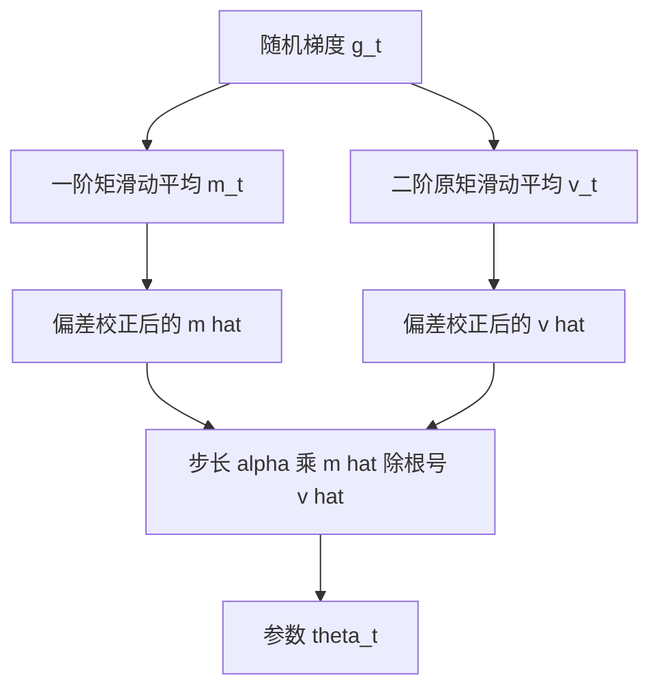

# Adam：用一阶与二阶矩估自适应步长，把稀疏梯度和非平稳目标放进同一个更新

<!-- release-date: 2014-12-22 -->

**本文依据**：`ADAM: A METHOD FOR STOCHASTIC OPTIMIZATION`，ICLR 2015 会议论文，arXiv:1412.6980，A4，15 页。作者 Diederik P. Kingma（University of Amsterdam、OpenAI）、Jimmy Lei Ba（University of Toronto），共同一作；Kingma 一行先写阿姆斯特丹。页眉印 `arXiv:1412.6980v9 [cs.LG] 30 Jan 2017`。封面印 **Published as a conference paper at ICLR 2015**。文中数字均标 PDF 页码；标「外部补充」的段落不来自本文。

## 一句话

随机目标在高维参数上难用二阶方法，只能走一阶。AdaGrad 擅长稀疏梯度，RMSProp 擅长在线和非平稳，但当时还没有把两者的好处合成一条、又带初始化偏差校正的更新。Adam（adaptive moment estimation，自适应矩估计）对每个参数用梯度的一阶矩与二阶原矩估各自的学习率。默认超参 $\alpha=0.001$、$\beta_1=0.9$、$\beta_2=0.999$、$\epsilon=10^{-8}$。作者给出在线凸优化下与当时最好结果相当的 regret 界，并给出无穷范数变体 AdaMax。经验上它在逻辑回归、多层全连接网、卷积网上与当时其他随机方法相比表现更好（PDF p. 1）。

它解决的不是「再发明一种动量」，而是 **2014 年底那条卡死的路：稀疏梯度要累积历史、非平稳目标又不能把历史钉死，而初始化为零的指数滑动平均会在开头把步子拉得过大。**

## 一、矛盾：高维随机目标只能用一阶，但步长不能所有参数共用一个

许多科学与工程问题都能写成对标量目标关于参数求最大或最小。目标对参数可微时，一阶偏导的计算量和一次前向同阶，梯度下降相对高效。目标常常是随机的：损失是许多子函数之和，每个子函数只看一份数据子样本，于是可以按子函数走随机梯度下降（Stochastic Gradient Descent，SGD）。深度学习当时的一批成功都靠这条路。噪声还可以来自 Dropout 一类正则，不只来自抽 batch。本文关注高维参数空间上的随机目标。这时高阶方法不合适，全文只谈一阶（PDF p. 1）。

Adam 只需要一阶梯度，内存也少。它从梯度的一阶矩与二阶矩估里，给不同参数算出各自的自适应学习率。名字就来自 adaptive moment estimation。设计意图是把当时两套流行方法的长处合在一起：AdaGrad 对稀疏梯度好，RMSProp 对在线和非平稳好。作者列出几条性质：参数更新的幅度对梯度的对角重缩放不变；有效步长大致被步长超参 $\alpha$ 上界住；不要求目标平稳；能处理稀疏梯度；并且自然带一种步长退火（PDF p. 1）。

把更新先摊开（机制示意，根据 PDF p. 2 算法 1 重画，不是实测时间轴）：

## 二、算法 1：两条滑动平均，再除初始化偏差

令 $f(\theta)$ 是带噪声的标量目标，关于 $\theta$ 可微。要最小化的是 $\mathbb{E}[f(\theta)]$。$f_1(\theta),\ldots,f_T(\theta)$ 是后续时刻上该随机函数的实现。随机性可以来自 mini-batch，也可以来自函数本身的噪声。$g_t=\nabla_\theta f_t(\theta)$ 是时刻 $t$ 的梯度（PDF p. 2）。

算法维护梯度的指数滑动平均 $m_t$ 与平方梯度的指数滑动平均 $v_t$。$\beta_1,\beta_2\in[0,1)$ 控制衰减。这两条平均分别估一阶矩（均值）和二阶原矩（未中心化的方差）。问题是：它们都从零向量起步，估计会偏向零，尤其在开头几步、尤其当衰减很慢（$\beta$ 接近 1）时。好消息是这个初始化偏差可以抵消，得到校正后的 $\hat{m}_t$ 与 $\hat{v}_t$（PDF p. 2）。

算法 1 的印刷如下。向量运算一律按元素。$\beta_1^t$、$\beta_2^t$ 表示 $\beta_1$、$\beta_2$ 的 $t$ 次幂。$g_t^2$ 表示按元素平方。在测试过的机器学习问题上，作者给的默认是 $\alpha=0.001$、$\beta_1=0.9$、$\beta_2=0.999$、$\epsilon=10^{-8}$（PDF p. 2）。

输入：步长 $\alpha$；矩估计的指数衰减 $\beta_1,\beta_2$；随机目标 $f(\theta)$；初值 $\theta_0$。

$$
\begin{aligned}
m_0 &\leftarrow 0,\quad v_0\leftarrow 0,\quad t\leftarrow 0\\
\text{while }\theta_t\text{ 未收敛：}\\
t &\leftarrow t+1\\
g_t &\leftarrow \nabla_\theta f_t(\theta_{t-1})\\
m_t &\leftarrow \beta_1 m_{t-1}+(1-\beta_1)g_t\\
v_t &\leftarrow \beta_2 v_{t-1}+(1-\beta_2)g_t^2\\
\hat{m}_t &\leftarrow m_t/(1-\beta_1^t)\\
\hat{v}_t &\leftarrow v_t/(1-\beta_2^t)\\
\theta_t &\leftarrow \theta_{t-1}-\alpha\cdot\hat{m}_t/(\sqrt{\hat{v}_t}+\epsilon)
\end{aligned}
$$

循环里最后三行可以换成更省、但更不直观的写法：先算 $\alpha_t=\alpha\cdot\sqrt{1-\beta_2^t}/(1-\beta_1^t)$，再 $\theta_t\leftarrow\theta_{t-1}-\alpha_t\cdot m_t/(\sqrt{v_t}+\hat{\epsilon})$（PDF p. 2）。数值上等价，只是把偏差校正折进有效步长。

**旧问题 → 新设计 → 机制 → 收益 → 代价。** 共用一个学习率时，稀疏坐标走得太慢、稠密坐标又容易抖。分别估均值和未中心化方差，再用比值当有效步长，等于给每个参数一条自己的信任区间。代价是多存两个与参数同形状的向量，以及必须处理「从零起步」的偏差。

可迁移：今天框架里的 Adam 几乎就是这条伪代码。默认四个数来自这篇测试过的设定，不是后验调出来的神秘常数。

## 三、有效步长有上界，并且对梯度尺度不变

令 $\epsilon=0$，时刻 $t$ 在参数空间里走的有效步是 $\Delta_t=\alpha\cdot\hat{m}_t/\sqrt{\hat{v}_t}$。有效步长有两个上界：当 $(1-\beta_1)>\sqrt{1-\beta_2}$ 时 $|\Delta_t|\le\alpha\cdot(1-\beta_1)/\sqrt{1-\beta_2}$；否则 $|\Delta_t|\le\alpha$。第一种只出现在最极端的稀疏：某个梯度在此前所有时刻都是零，只在当前时刻非零。不那么稀疏时，有效步会更小。当 $(1-\beta_1)=\sqrt{1-\beta_2}$ 时 $|\hat{m}_t/\sqrt{\hat{v}_t}|<1$，因而 $|\Delta_t|<\alpha$。更常见的情况是 $\hat{m}_t/\sqrt{\hat{v}_t}\approx\pm 1$，因为 $|\mathbb{E}[g]/\sqrt{\mathbb{E}[g^2]}|\le 1$。于是每步在参数空间里的有效幅度大致被 $\alpha$ 钉住，即 $|\Delta_t|\lesssim\alpha$。这可以理解成在当前参数周围划了一块信任域：当前梯度估计超出这块就不提供足够信息。因此事先知道 $\alpha$ 该落在哪个数量级，通常并不难。许多机器学习模型事先就知道好的最优点大概率落在参数空间的某块区域里，例如参数上有先验。$\alpha$ 设定了步长幅度的上界，往往可以从「从 $\theta_0$ 走多少步该能到达」反推数量级（PDF p. 2–3）。

作者把比值 $\hat{m}_t/\sqrt{\hat{v}_t}$ 略滥用地叫做信噪比（signal-to-noise ratio，SNR）。SNR 越小，有效步 $\Delta_t$ 越靠近零。这是想要的：SNR 小意味着更不确定 $\hat{m}_t$ 是否指向真梯度。靠近最优点时 SNR 通常更接近 0，有效步变小，相当于自动退火。有效步还对梯度尺度不变：把 $g$ 乘常数 $c$，$\hat{m}_t$ 乘 $c$、$\hat{v}_t$ 乘 $c^2$，比值抵消（PDF p. 3）。

## 四、初始化偏差校正：零起步会把开头几步放大

第二节已经说了要校正。这里只推二阶矩，一阶矩完全同构。令 $g$ 是随机目标的梯度，要用平方梯度的指数滑动平均估二阶原矩，衰减率 $\beta_2$。$g_1,\ldots,g_T$ 是后续梯度，各自抽自 $g_t\sim p(g_t)$。$v_0=0$。更新 $v_t=\beta_2 v_{t-1}+(1-\beta_2)g_t^2$ 可以写成全部历史平方梯度的加权和（PDF p. 3 式 1）：

$$
v_t=(1-\beta_2)\sum_{i=1}^{t}\beta_2^{t-i}g_i^2
$$

想知道 $\mathbb{E}[v_t]$ 和真二阶矩 $\mathbb{E}[g_t^2]$ 差在哪。取期望后得到（PDF p. 3 式 2–4）

$$
\mathbb{E}[v_t]=\mathbb{E}[g_t^2]\cdot(1-\beta_2^t)+\zeta
$$

若真二阶矩平稳则 $\zeta=0$；否则可以把 $\zeta$ 压小，因为衰减率应选成「太远的过去权重很小」。剩下的因子 $(1-\beta_2^t)$ 就是从零初始化造成的。算法 1 因此除以这项来校正。

稀疏梯度时，要可靠估二阶矩必须对很多梯度取平均，于是要选小的 $(1-\beta_2)$，也就是 $\beta_2$ 很接近 1。恰恰是这种慢衰减，若不做初始化校正，开头几步会大得多（PDF p. 3）。第 6.4 节会用变分自编码器把这句话钉到实验上。

## 五、在线凸优化下的 regret：$O(\sqrt{T})$

作者用 Zinkevich 2003 的在线学习框架分析。给定任意未知的凸代价序列 $f_1(\theta),\ldots,f_T(\theta)$。每步先预测 $\theta_t$，再在此前未知的 $f_t$ 上评估。序列事先不知道，于是用 regret：在线预测 $f_t(\theta_t)$ 与可行集 $\mathcal{X}$ 上最好固定点 $\theta^*$ 的差，对过去所有步求和（PDF p. 4 式 5）：

$$
R(T)=\sum_{t=1}^{T}\bigl[f_t(\theta_t)-f_t(\theta^*)\bigr],\qquad \theta^*=\arg\min_{\theta\in\mathcal{X}}\sum_{t=1}^{T}f_t(\theta)
$$

Adam 有 $O(\sqrt{T})$ 的 regret 界，证明在附录。这与该一般凸在线问题当时最好的已知界相当。记号：$g_t=\nabla f_t(\theta_t)$，$g_{t,i}$ 是第 $i$ 维；$g_{1:t,i}\in\mathbb{R}^t$ 收集到时刻 $t$ 为止第 $i$ 维的全部梯度。再令 $\gamma=\beta_1^2/\sqrt{\beta_2}$（原文印刷为 $\gamma\triangleq\beta_1^2/\sqrt{\beta_2}$）。定理在学习率按 $t^{-1/2}$ 衰减、且一阶矩系数 $\beta_{1,t}$ 按接近 1 的 $\lambda$ 指数衰减时成立，例如 $\lambda=1-10^{-8}$（PDF p. 4）。

定理 4.1。假设 $f_t$ 梯度有界，$\|\nabla f_t(\theta)\|_2\le G$、$\|\nabla f_t(\theta)\|_\infty\le G_\infty$；Adam 产生的任意 $\theta_n,\theta_m$ 距离有界，$\|\theta_n-\theta_m\|_2\le D$、$\|\theta_m-\theta_n\|_\infty\le D_\infty$；$\beta_1,\beta_2\in[0,1)$ 满足 $\beta_1^2/\sqrt{\beta_2}<1$。令 $\alpha_t=\alpha/\sqrt{t}$，$\beta_{1,t}=\beta_1\lambda^{t-1}$，$\lambda\in(0,1)$。则对所有 $T\ge 1$ 有（PDF p. 4，印刷分三行）

$$
R(T)\le\frac{D^2}{2\alpha(1-\beta_1)}\sum_{i=1}^{d}\sqrt{T\hat{v}_{T,i}}+\frac{\alpha(1+\beta_1)G_\infty}{(1-\beta_1)\sqrt{1-\beta_2}(1-\gamma)^2}\sum_{i=1}^{d}\|g_{1:T,i}\|_2+\sum_{i=1}^{d}\frac{D_\infty^2 G_\infty\sqrt{1-\beta_2}}{2\alpha(1-\beta_1)(1-\lambda)^2}
$$

当特征稀疏、梯度有界时，求和项可以远小于其上界：$\sum_i\|g_{1:T,i}\|_2\ll d G_\infty\sqrt{T}$，$\sum_i\sqrt{T\hat{v}_{T,i}}\ll d G_\infty\sqrt{T}$，特别是 Duchi 等人 2011 第 1.2 节那种函数与特征。他们关于 $\mathbb{E}[\sum_i\|g_{1:T,i}\|_2]$ 的结果对 Adam 同样适用。于是 Adam 与 AdaGrad 这类自适应方法可以达到 $O(\log d\cdot\sqrt{T})$，相对非自适应的 $O(\sqrt{dT})$ 是改进。把 $\beta_{1,t}$ 往零衰减在理论分析里重要，也和此前经验一致：Sutskever 等人 2013 建议训练末尾减小动量系数以改善收敛（PDF p. 4）。

推论 4.2：在同样有界假设下，$R(T)/T=O(1/\sqrt{T})$，因而 $\lim_{T\to\infty}R(T)/T=0$（PDF p. 4）。

附录第 10.1 节用凸函数的切平面下界把 regret 换成 Adam 更新，再配两条引理。正文不复述证明细节；读者要核印刷式时看 PDF p. 12 起。本文不把附录引理的中间不等式当实验数字用。

## 六、相关工作：和 RMSProp、AdaGrad 差在哪

与 Adam 直接相关的是 RMSProp 与 AdaGrad。其他用一阶信息估曲率来设步长的还有 vSGD、AdaDelta，以及 Roux 与 Fitzgibbon 2010 的 natural Newton。SFO（Sum-of-Functions Optimizer）是基于 mini-batch 的拟牛顿，但内存随数据集的 mini-batch 划分数线性增长，在 GPU 这类内存紧的系统上常常不可行。Adam 像自然梯度（Natural Gradient Descent，NGD）那样用适应数据几何的预条件：$\hat{v}_t$ 近似 Fisher 信息矩阵的对角；但预条件更保守，用的是对角 Fisher 近似之逆的平方根，而不是原版 NGD（PDF p. 4–5）。

**RMSProp。** 有时会带动量（Graves 2013）。带动量的 RMSProp 用「已重缩放梯度上的动量」产生更新；Adam 的更新直接来自一阶与二阶矩的滑动平均。RMSProp 也没有偏差校正。这在 $\beta_2$ 接近 1（稀疏梯度所需要的）时最要紧：不校正会导致非常大的步长，常常发散。第 6.4 节会实证这一点（PDF p. 5）。

**AdaGrad。** 基础形式是 $\theta_{t+1}=\theta_t-\alpha\cdot g_t/\sqrt{\sum_{i=1}^{t}g_i^2}$。若令 $\beta_2$ 从下方无限接近 1，则 $\lim_{\beta_2\to 1}\hat{v}_t=t^{-1}\sum_{i=1}^{t}g_i^2$。AdaGrad 对应 $\beta_1=0$、无穷小的 $(1-\beta_2)$、并把 $\alpha$ 换成退火的 $\alpha_t=\alpha t^{-1/2}$ 的 Adam。去掉偏差校正后，这条对应不再成立：$\beta_2$ 无限接近 1 会带来无穷大的偏差和无穷大的参数更新，就像 RMSProp 那样（PDF p. 5）。

## 七、实验：先比凸的逻辑回归，再比非凸的网

评测覆盖逻辑回归、多层全连接神经网络、深度卷积神经网络。用大模型和大数据集说明 Adam 能有效解实际深度学习问题。比较不同优化器时用同一套参数初始化。学习率、动量等超参在密网格上搜索，报告最好设定（PDF p. 5）。

### 7.1 Experiment: Logistic Regression

先在 MNIST 上评 $L_2$ 正则的多类逻辑回归。逻辑回归的目标凸、研究充分，适合比优化器而不必担心局部极小。逻辑回归实验里步长按 $1/\sqrt{t}$ 衰减，即 $\alpha_t=\alpha/\sqrt{t}$，与第 4 节理论预测对齐。分类直接做在 784 维图像向量上。对比对象是带 Nesterov 动量的加速 SGD，以及 Adagrad；mini-batch 大小 128。图 1 显示 Adam 与带动量的 SGD 收敛相近，两者都快于 Adagrad（PDF p. 5–6 图 1）。

AdaGrad 的一条主要理论结果是能有效处理稀疏特征与稀疏梯度，而 SGD 学罕见特征慢。Adam 若对步长做 $1/\sqrt{t}$ 衰减，理论上应能追上 AdaGrad。稀疏特征用 Maas 等人 2011 的 IMDB 影评：预处理成词袋（bag-of-words，BoW），取最频繁的 10000 词。每条评论的 10000 维 BoW 高度稀疏。按 Wang 与 Manning 2013 的建议，训练时可对 BoW 加 50% Dropout 以防过拟合。图 1 上，无论有没有 Dropout，Adagrad 都大幅超过带 Nesterov 动量的 SGD；Adam 收敛得和 Adagrad 一样快。经验表现与第 2、4 节理论一致：Adam 能像 AdaGrad 那样吃稀疏特征，比普通带动量 SGD 更快（PDF p. 5–6）。

图 1 的印刷标题是：MNIST 图像与带 10000 维 BoW 的 IMDB 影评上，逻辑回归训练负对数似然（PDF p. 6）。左图横轴约 0–45 个完整数据集迭代，训练代价从约 0.7 降到约 0.2；右图横轴约 0–160，训练代价从约 0.50 降到约 0.20。曲线是图，精确纵坐标以印刷图为准，正文只转写作者的比较结论。

### 7.2 Experiment: Multi-layer Neural Networks

多层网的目标非凸，第 4 节的收敛分析用不上，但经验上 Adam 在这类问题上常常超过其他方法。模型选择跟此前文献：两层全连接隐层，每层 1000 隐单元，ReLU，mini-batch 128（PDF p. 6）。

先看带 $L_2$ 权衰减的确定性交叉熵。SFO 是当时新提出的、能吃 mini-batch 的拟牛顿，在多层网上表现不错。作者用对方实现与 Adam 对照。图 2 显示 Adam 在迭代次数和墙钟时间上都走得更快。更新曲率信息的代价让 SFO 每步比 Adam 慢 5–10 倍，内存还随 mini-batch 数线性增长（PDF p. 6）。

Dropout 一类随机正则在实践里常用。SFO 假定确定性子函数，在带随机正则的代价上确实未能收敛。于是在带 Dropout 噪声的多层网上，把 Adam 和其他随机一阶方法比。图 2 显示 Adam 收敛更好（PDF p. 6–7）。

图 2：(a) 带 Dropout 随机正则的神经网络；(b) 确定性代价，对照 SFO。数据是 MNIST 图像。图 2(a) 印刷的训练代价纵轴从 $10^{-1}$ 到 $10^{-2}$，横轴约 0–200 个完整数据集迭代（PDF p. 7）。

### 7.3 Experiment: Convolutional Neural Networks

卷积网多层卷积、池化与非线性，在视觉任务上已经很成功。与多数全连接网不同，权值共享让不同层的梯度尺度差很多。实务上对卷积层用 SGD 时常手调更小的学习率。作者要看 Adam 在深 CNN 上是否还有效。结构：三组交替的 $5\times 5$ 卷积与步长 2 的 $3\times 3$ 最大池化，再接 1000 个 ReLU 全连接隐单元。输入图像先白化；Dropout 加在输入层和全连接层。mini-batch 仍是 128（PDF p. 6–7）。

有意思的是：训练初期 Adam 与 Adagrad 都很快把代价压下去（图 3 左，前三个 epoch）；但到 45 个 epoch，Adam 与 SGD 最终明显快于 Adagrad（图 3 右）。作者观察到，几个 epoch 之后二阶矩估计 $\hat{v}_t$ 会消到接近零，被算法 1 里的 $\epsilon$ 主导。因此在 CNN 上，$\hat{v}_t$ 对代价几何的近似比第 6.2 节全连接网更差。通过一阶矩减小 mini-batch 方差反而更重要，也贡献了加速。结果是这次实验里 Adagrad 比其他方法慢得多。Adam 相对带动量的 SGD 只有边际改进，但它按层自适应学习率尺度，不必像 SGD 那样手挑（PDF p. 7）。

图 3 印刷：CIFAR-10，结构 c64-c64-c128-1000。左图前三个 epoch 的训练代价；右图 45 个 epoch。左图纵轴约 3.0 降到约 0.5；右图纵轴对数，从 $10^{2}$ 到 $10^{-4}$（PDF p. 7）。

### 7.4 Experiment: Bias-correction term

去掉偏差校正，就得到带动量的 RMSProp。作者在与 Kingma 与 Welling 2013 相同结构的变分自编码器（Variational Auto-Encoder，VAE）上扫 $\beta_1$、$\beta_2$：单隐层 500 单元、softplus，50 维球形高斯隐变量。超参网格：$\beta_1\in\{0,0.9\}$，$\beta_2\in\{0.99,0.999,0.9999\}$，$\log_{10}(\alpha)\in[-5,\ldots,-1]$。$\beta_2$ 接近 1 时初始化偏差更大（稀疏梯度要这种慢衰减），因此预期校正项在这种情况下重要，否则会伤害优化（PDF p. 8）。

图 4：红线有偏差校正，绿线没有；左 10 个 epoch，右 100 个 epoch。纵轴是损失，横轴是 $\log_{10}(\alpha)$，按 $\beta_1$、$\beta_2$ 分面。$\beta_2$ 接近 1 且无校正时，训练确实不稳定，尤其前几个 epoch。最好结果出现在小的 $(1-\beta_2)$ 并带校正；优化后期梯度往往更稀疏（隐单元专化到特定模式）时，这一点更明显。总结：不论超参设定，Adam 都等于或好于 RMSProp（PDF p. 8）。

## 八、AdaMax：把 $L_2$ 换成无穷范数

Adam 对单个权重的更新，是按该权重当前与过去梯度的（缩放）$L_2$ 范数反比缩放梯度。可以推广到 $L_p$。$p$ 大时数值不稳定。但令 $p\to\infty$，会出现一个出人意料地简单且稳定的算法，即算法 2。$L_p$ 时步长与 $v_t^{1/p}$ 反比，其中（PDF p. 8 式 6–7）

$$
v_t=\beta_2^p v_{t-1}+(1-\beta_2^p)|g_t|^p=(1-\beta_2^p)\sum_{i=1}^{t}\beta_2^{p(t-i)}|g_i|^p
$$

这里衰减项等价地参数化成 $\beta_2^p$ 而不是 $\beta_2$。令 $u_t=\lim_{p\to\infty}(v_t)^{1/p}$，极限化成历史绝对梯度的指数加权最大值（PDF p. 9 式 8–12）：

$$
u_t=\max(\beta_2\cdot u_{t-1},|g_t|)
$$

初值 $u_0=0$。这时不必做初始化偏差校正。参数更新幅度的上界也更简单：$|\Delta_t|\le\alpha$（PDF p. 9）。

算法 2 的默认：在测试过的机器学习问题上 $\alpha=0.002$、$\beta_1=0.9$、$\beta_2=0.999$。$(\alpha/(1-\beta_1^t))$ 是带一阶矩偏差校正的学习率。循环里 $u_t\leftarrow\max(\beta_2\cdot u_{t-1},|g_t|)$，然后 $\theta_t\leftarrow\theta_{t-1}-(\alpha/(1-\beta_1^t))\cdot m_t/u_t$（PDF p. 9）。

致谢里写：Duke 的 Kai Fan 指出了最初 AdaMax 推导里的一处错误（PDF p. 10）。正文以本版印刷为准。

## 九、时间平均：最后一次迭代太吵，可以对参数再做滑动平均

最后一次迭代因为随机近似而吵，平均往往泛化更好。Moulines 与 Bach 2011 已说明 Polyak–Ruppert 平均能改善标准 SGD：$\bar{\theta}_t=t^{-1}\sum_{k=1}^{t}\theta_k$。也可以对参数做指数滑动平均，更近的值权重更大。在算法 1 与 2 的内层循环加一行即可：$\bar{\theta}_t\leftarrow\beta_2\bar{\theta}_{t-1}+(1-\beta_2)\theta_t$，$\bar{\theta}_0=0$。初始化偏差再用 $\hat{\theta}_t=\bar{\theta}_t/(1-\beta_2^t)$ 校正（PDF p. 9）。这是可选扩展，主实验没有把它当成默认。

## 十、结论、限制与未写清的地方

结论把贡献收成几句：方法简单、计算高效，面向大数据集和/或高维参数；结合 AdaGrad 处理稀疏梯度的能力与 RMSProp 处理非平稳目标的能力；实现直接、内存少；凸问题上的实验确认了收敛速率分析；整体上 Adam 稳健，适合机器学习里一大类非凸问题（PDF p. 9–10）。

论文明确没写、或只写到观察层的：

- 非凸没有定理，只有经验（第 6.2 节自己承认分析不适用）。
- CNN 上 $\hat{v}_t$ 会被 $\epsilon$ 主导，二阶矩几何近似变差——这是作者观察，不是一条新定理（PDF p. 7）。
- 图 1–4 是曲线，正文几乎不给最终测试误差的单个标量；比较结论以「谁更快 / 谁更稳」为主。
- 没有公开训练代码路径；SFO 对照用的是对方实现（PDF p. 6）。
- 致谢感谢 Google Deepmind 的支持、Ivo Danihelka 与 Tom Schaul 起名 Adam、SURF 荷兰国家 e-基础设施、以及 Google European Doctorate Fellowship（PDF p. 10）。这些不是算法主张。

可迁移：

1. **默认四个数有出处。** $\alpha=0.001$、$\beta_1=0.9$、$\beta_2=0.999$、$\epsilon=10^{-8}$ 印在算法 1；AdaMax 的 $\alpha=0.002$ 印在算法 2。换任务仍该网格搜，但不要把这些数当成框架作者后来拍的。
2. **$\beta_2$ 接近 1 时，偏差校正不是装饰。** 稀疏梯度需要慢衰减；不校正等于开头几步用被零初始化放大的 $v_t$。
3. **有效步被 $\alpha$ 钉住，是选学习率的理由。** 先估参数空间里最优点大概有多远，再选 $\alpha$ 的数量级。
4. **卷积层梯度尺度差时，一阶矩可能比二阶矩更有用。** 这篇 CNN 实验里 Adagrad 变慢，作者把原因写给了消失的 $\hat{v}_t$。
5. **无穷范数变体少一次除零风险。** $u_t=\max(\beta_2 u_{t-1},|g_t|)$ 不必校正初始化；上界直接是 $\alpha$。

## 关键词回看

- **随机目标**：损失随 batch 或 Dropout 一起抖，不能假装每步都看到真梯度。
- **一阶矩 $m_t$ / 二阶原矩 $v_t$**：梯度的指数滑动均值，以及平方梯度的指数滑动平均（未减均值的二阶矩）。
- **初始化偏差校正**：从零起步的滑动平均系统性地偏小，除以 $(1-\beta^t)$ 把它拉回来。
- **有效步 $\Delta_t$**：$\alpha\cdot\hat{m}_t/\sqrt{\hat{v}_t}$，幅度大致不超过 $\alpha$，并对梯度重缩放不变。
- **regret $R(T)$**：在线凸序列上，相对最好固定参数的累积多余损失；Adam 给出 $O(\sqrt{T})$。
- **AdaMax**：$p\to\infty$ 时二阶矩变成指数加权无穷范数 $u_t$。

## 参考资料

- 原件：Kingma, D. P. and Ba, J. L. `Adam: A Method for Stochastic Optimization`。ICLR 2015。arXiv:1412.6980。本仓库 `readings/_src/深度学习基石/Adam.pdf`，15 页。
- 文内引用的前作均以 PDF 参考文献列表为准，不另开外部补充。
