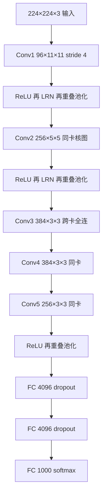

# AlexNet：深度卷积终于能在百万级高分辨率图上端到端训起来

<!-- release-date: 2012-12-03 -->

**本文依据**：`ImageNet Classification with Deep Convolutional Neural Networks`，9 页 letter。作者 Alex Krizhevsky、Ilya Sutskever、Geoffrey E. Hinton，University of Toronto。封面与第 1 页未印会议名、未印 arXiv 编号，本文不补。文中所有数字都标了 PDF 页码；标「外部补充」的段落不来自本文。

## 一句话

作者在 ImageNet LSVRC-2010 的 120 万张高分辨率图、1000 类上，训出一座 8 层卷积网络：5 个卷积层加 3 个全连接层，末尾 1000 路 softmax。测试集 top-1 / top-5 错误率 37.5% / 17.0%，明显好于当时已发表结果。网络约 6000 万参数、65 万个神经元。为了训得动，他们用非饱和神经元（ReLU）和高度优化的 GPU 卷积实现；为了压住全连接层过拟合，用了当时刚提出的 dropout。同一架构的变体参加 ILSVRC-2012，赢得 top-5 测试错误率 15.3%，第二名是 26.2%（PDF p. 1）。

它解决的不是「再发明一种卷积」，而是 2012 年前后那条卡死的路：**CNN 的局部结构和容量控制本来适合图像，但高分辨率、百万样本时算不起、也容易过拟合。** 这篇把 ReLU、双 GPU 拆核、局部响应归一化、重叠池化、数据增广和 dropout 接到同一条监督训练链上，第一次把深度卷积推到 ImageNet 这个尺度。

## 一、矛盾：容量要大，算力和过拟合却先崩

物体识别当时已经离不开机器学习。要更好，无非三件事：更大的标注集、更强的模型、更好的防过拟合（PDF p. 1）。在此之前，带标签的图像集通常只有几万张量级：NORB、Caltech-101/256、CIFAR-10/100。简单任务在这个规模上已经很好做，MNIST 最好错误率已经低于 0.3%，接近人（PDF p. 1）。真实场景里物体变化大，必须用大得多的训练集。百万级标注集这时才刚够用：LabelMe 有几十万张全分割图，ImageNet 则超过 1500 万张高分辨率图、超过 22000 类（PDF p. 1）。

要从百万图里学几千种物体，模型容量必须大。但物体识别的复杂度高到连 ImageNet 也写不全规格，所以模型还得带大量先验，用来补「数据里没有的那部分」（PDF p. 1）。卷积网络正是这类模型：深度和宽度可调容量，并对图像做了大体正确的假设——统计平稳、像素依赖局部。同样宽度的全连接前馈网，CNN 连接和参数少得多，更好训，理论上限只差一点（PDF p. 1）。

卡点在工程。即便局部结构相对省，把 CNN 铺到高分辨率大图上仍然贵得做不起。作者的判断是：当时的 GPU 配上高度优化的二维卷积实现，已经能训「有意思地大」的 CNN；ImageNet 这类标注量，也刚好能让这种模型不过分过拟合（PDF p. 1–2）。

于是贡献钉成四条（PDF p. 2）：

1. 在 ILSVRC-2010 与 ILSVRC-2012 用到的 ImageNet 子集上，训出当时最大的卷积网之一，结果远好于已报道数字。
2. 写了一套高度优化的 GPU 二维卷积及训练所需全部算子，公开在 `http://code.google.com/p/cuda-convnet/`。
3. 网络里有若干当时显得新或不寻常的结构，用来提精度、减训练时间，细节在第 3 节。
4. 即便有 120 万标注样本，规模仍让过拟合成为主问题，第 4 节给出几条有效手段。最终网络是 5 个卷积加 3 个全连接；深度看起来关键：拿掉任意一个卷积层（每个卷积层参数不超过全模型的 1%）都会变差。

规模上限主要是当时 GPU 显存，以及他们愿意等的训练时间。整网在两块 GTX 580 3GB 上要训五到六天。作者写：实验都指向同一方向——更快的 GPU 和更大的数据集会直接把结果再抬一截（PDF p. 2）。

把系统先摊开（机制示意，根据 PDF p. 4–5 图 2 与第 3.5 节重画，不是实测时间轴）：

两块 GPU 各跑图的上半或下半层片，只在指定层通信。输入 150528 维；其余层神经元数是 253440–186624–64896–64896–43264–4096–4096–1000（PDF p. 4 图 2）。

## 二、数据：固定 256，再减均值，其余几乎不预处理

ImageNet 本身超过 1500 万张、约 22000 类，从网上抓图，用 Mechanical Turk 人工标。2010 年起作为 Pascal VOC 的一部分，每年办 ImageNet Large-Scale Visual Recognition Challenge（ILSVRC）。ILSVRC 用约 1000 类、每类约 1000 张的子集：训练约 120 万、验证 5 万、测试 15 万（PDF p. 2）。

ILSVRC-2010 是唯一公开测试标签的一届，所以大部分实验做在这一届。他们也报名 ILSVRC-2012，测试标签当时不公开，结果放在第 6 节。习惯上报两个错误率：top-1 是最高分类不对；top-5 是正确标签不在模型认为最可能的五个里（PDF p. 2）。

图像分辨率不齐，网络要固定输入。做法是先把短边缩到 256，再从中心裁 256×256。除了减训练集每个像素的均值活动，没有别的预处理。网络直接吃居中后的原始 RGB（PDF p. 2）。图 2 里看到的 224×224×3，是因为训练时再从 256 里随机裁 224 块（PDF p. 5 脚注）。

## 三、架构：八层可学，重要性按作者排序

网络有八个带权层：前五卷积，后三全连接，见图 2。第 3.1–3.4 节按作者估计的重要性从高到低排（PDF p. 2）。

### 3.1 ReLU：饱和非线性训太慢

神经元输出的老写法是 $f(x)=\tanh(x)$ 或 sigmoid $f(x)=(1+e^{-x})^{-1}$。对梯度下降来说，这类饱和非线性比非饱和的 $f(x)=\max(0,x)$ 慢得多。沿用 Nair 与 Hinton，这种神经元叫 Rectified Linear Units（ReLU，修正线性单元）（PDF p. 3）。

带 ReLU 的深度卷积网，比等价 tanh 网快好几倍。图 1 在 CIFAR-10 上用一个特定四层卷积网：ReLU 实线到达 25% 训练错误的迭代次数，大约是 tanh 虚线的六分之一。学习率各自调到尽可能快，没用任何正则。效应大小随架构变，但 ReLU 网相对饱和神经元总是快好几倍（PDF p. 3）。作者的判断很硬：若仍用传统饱和神经元，这篇工作根本实验不起这么大的网。

他们不是第一个在 CNN 里换非线性的。Jarrett 等人认为 $f(x)=|\tanh(x)|$ 配对比度归一化和局部平均池化，在 Caltech-101 上很好。但那个数据集的主矛盾是防过拟合，观察到的效应不同于这里报告的「更快拟合训练集」。对大模型、大数据，学得快会直接变成最终精度（PDF p. 3）。

**旧问题 → 新设计 → 机制 → 收益 → 代价。** 饱和激活让大网在可接受时间内拟合不动；换成 ReLU 后，只要有正输入就能学。代价是后面仍要靠归一化、增广和 dropout 管泛化，ReLU 本身不解决过拟合。

可迁移：今天几乎默认 ReLU 族，值得记住的是当年动机——**先把拟合速度抬到能做大实验，再谈别的正则。**

### 3.2 双 GPU：一张卡装不下，就半核半卡，并且只在部分层通信

一块 GTX 580 只有 3GB，限制能训的最大网络。120 万样本已经够训出单卡装不下的网，所以把网络铺到两块 GPU 上。当时 GPU 能直接读写对方显存，不必绕主机内存（PDF p. 3）。

并行方案本质是：每块卡放一半卷积核（或神经元），再加一条约束——GPU 只在某些层通信。例如第 3 层的核吃第 2 层全部核图；第 4 层的核只吃第 3 层里住在同一块 GPU 上的核图。连通模式要交叉验证，但可以精确把通信量调到相对计算可接受的比例（PDF p. 3）。

结果有点像 Cireşan 等人的「柱状」CNN，但这里的柱并不独立（见图 2）。相对「每层核数减半、单卡训」的网，双 GPU 把 top-1 / top-5 错误率分别再降 1.7 和 1.2 个百分点；训练时间还略短于单卡网（PDF p. 3）。

脚注把比较口径说清楚：单卡网在最后一个卷积层的核数与双卡网相同。因为参数大部分在第一个全连接层，它吃的是最后一层卷积。为了让两边参数量大致相当，最后一层卷积以及后面的全连接都没有减半。因此这个对比偏向单卡网——它比「双卡网的一半」更大（PDF p. 3）。

**可迁移：** 模型并行不必每层全互联。把跨设备通信收成少数「汇合层」，其余层只看本设备特征图，是显存不够时的显式设计，不是实现凑合。

### 3.3 局部响应归一化：ReLU 不强制归一化，但亮度竞争仍有用

ReLU 的好处是不必靠输入归一化来防饱和：只要某些训练样本给该神经元正输入，它就会学。作者仍发现下面的局部归一化有助于泛化。记 $a^i_{x,y}$ 为位置 $(x,y)$ 上第 $i$ 个核经 ReLU 后的活动，归一化后（PDF p. 3）：

$$
b^i_{x,y} = a^i_{x,y} \Big/ \Bigl(k + \alpha \sum_{j=\max(0,i-n/2)}^{\min(N-1,i+n/2)} (a^j_{x,y})^2 \Bigr)^{\beta}
$$

求和扫同一空间位置上 $n$ 张「相邻」核图，$N$ 是该层核总数。核图顺序训练前任意排定。这是一种侧抑制：不同核算出的大响应互相抢。超参用验证集定：$k=2$，$n=5$，$\alpha=10^{-4}$，$\beta=0.75$。归一化加在某些层的 ReLU 之后，见 3.5 节（PDF p. 3）。

它有点像 Jarrett 的局部对比度归一化，但这里不减均值活动，更准确应叫「亮度归一化」。该方案把 top-1 / top-5 再降 1.4 和 1.2 个百分点。CIFAR-10 上四层 CNN：无归一化测试错误 13%，有则 11%（PDF p. 3）。

### 3.4 重叠池化：窗比步长大

池化层概括同一核图上邻近神经元。传统做法是相邻池化单元的邻域不重叠。更精确地说：池化单元在网格上每隔 $s$ 像素一个，每个概括 $z\times z$ 邻域。$s=z$ 就是传统局部池化；$s<z$ 就是重叠池化。全文都用 $s=2$、$z=3$。相对产生同等输出尺寸的非重叠 $s=2,z=2$，top-1 / top-5 再降 0.4 和 0.3 个百分点。训练中还观察到：重叠池化的模型稍难过拟合（PDF p. 4）。

### 3.5 整网怎么接

八层带权：前五卷积，后三全连接。最后一层全连接送进 1000 路 softmax，得到 1000 类上的分布。目标是多项逻辑回归，等价于最大化训练样本上正确标签在预测分布下的对数概率的平均（PDF p. 4）。

连通（PDF p. 4）：

- 第 2、4、5 卷积层的核，只连前一层里同一 GPU 上的核图。
- 第 3 卷积层连第 2 层全部核图。
- 全连接层连前一层全部神经元。
- 响应归一化跟在第 1、2 卷积层后面。
- 3.4 节那种最大池化跟在两个归一化层之后，也跟在第 5 卷积层之后。
- 每个卷积层和每个全连接层的输出都过 ReLU。

层规格（PDF p. 4–5）：

| 层 | 输入 | 核 / 单元 | 备注 |
|---|---|---|---|
| Conv1 | $224\times 224\times 3$ | 96 个 $11\times 11\times 3$，步长 4 | 随后 LRN + 重叠池化 |
| Conv2 | Conv1 归一化并池化后 | 256 个 $5\times 5\times 48$ | 随后 LRN + 重叠池化 |
| Conv3 | Conv2 归一化并池化后 | 384 个 $3\times 3\times 256$ | 无中间池化或归一化 |
| Conv4 | Conv3 | 384 个 $3\times 3\times 192$ | 同 GPU 连通 |
| Conv5 | Conv4 | 256 个 $3\times 3\times 192$ | 随后重叠池化 |
| FC6 / FC7 | 上一层全部 | 各 4096 | dropout 在前两个全连接 |
| FC8 | FC7 | 1000 | softmax |

第 3、4、5 卷积层之间没有池化或归一化。作者写：因篇幅不能把网络写到可复现的每一个细节，精确规格在 cuda-convnet 的代码和参数文件里（PDF p. 4）。

## 四、过拟合：6000 万参数，1000 类给的约束不够

架构有 6000 万参数。ILSVRC 的 1000 类让每张训练图对「图→标签」映射大约提供 10 bit 约束，仍不够在无明显过拟合的情况下学完这些参数。下面两条是主要对策（PDF p. 5）。

### 4.1 数据增广：变换几乎免费，因为 CPU 与 GPU 流水

最容易、也最常见的办法，是用保标签变换人为放大数据集。他们用两种，都几乎不占磁盘：变换图从原图现场算出来。实现上，CPU 用 Python 生成下一翻变换，同时 GPU 在训上一批，所以这两种增广实际上计算免费（PDF p. 5）。

第一种：平移和水平翻转。从 256×256 里抽随机 224×224 块及其水平翻转来训。训练集因此放大约 2048 倍，但样本高度相关。没有这一步，网络会严重过拟合，只能改用小得多的网。测试时抽五块（四角加中心）及其水平翻转，共十块，对 softmax 预测取平均（PDF p. 5）。脚注：不做这十块平均时，错误率是 39.0% 和 18.3%（PDF p. 8）。

第二种：改 RGB 通道强度。在整个 ImageNet 训练集的 RGB 像素上做 PCA。每张训练图加上主成分的倍数，幅度等于对应特征值乘一个均值 0、标准差 0.1 的高斯随机变量。对像素 $I_{xy}=[I_{xy}^R,I_{xy}^G,I_{xy}^B]^\top$ 加上（PDF p. 6）：

$$
[p_1,p_2,p_3][\alpha_1\lambda_1,\alpha_2\lambda_2,\alpha_3\lambda_3]^\top
$$

其中 $p_i$、$\lambda_i$ 是 RGB 协方差矩阵的第 $i$ 个特征向量和特征值，$\alpha_i$ 即上述随机变量。每个 $\alpha_i$ 对一张图的所有像素只抽一次，该图再次用于训练时再抽。这近似抓住自然图像的一个性质：物体身份对光照强度和颜色变化不变。该方案把 top-1 错误率再降超过 1 个百分点（PDF p. 6）。

### 4.2 Dropout：用随机子网络代替真集成

集成很多模型能降测试错误，但对已经要训好几天的大网太贵。有一种几乎只要训练代价约两倍的模型组合：dropout——每个隐神经元输出以概率 0.5 置零。被丢掉的神经元不参与前向，也不参与反传。每次输入看到的是不同架构，但权值共享。神经元不能依赖某个特定同伴一定在，于是被迫学对许多随机子集都有用的更稳特征。测试时用全部神经元，但把输出乘 0.5，近似指数多条 dropout 网预测分布的几何平均（PDF p. 6）。

Dropout 用在图 2 的前两个全连接层。没有它，网络严重过拟合。有它，收敛所需迭代大约翻倍（PDF p. 6）。

**可迁移：** 增广走「几乎免费的标签不变变换」；dropout 走「训练时采样子网络、测试时权重平均」。两者都是容量已经大到数据约束不够时的正则，不是架构装饰。

## 五、学习细节：带动量的 SGD，衰减既正则也降训练误差

训练用随机梯度下降：batch 128，动量 0.9，权值衰减 0.0005。这点很小的衰减对学习很重要：它在这里不只是正则器，还会降低训练误差。权值 $w$ 的更新（PDF p. 6）：

$$
v_{i+1} = 0.9\, v_i - 0.0005\,\varepsilon\, w_i - \varepsilon \Bigl\langle \frac{\partial L}{\partial w}\Big|_{w_i}\Bigr\rangle_{D_i}
$$

$$
w_{i+1} = w_i + v_{i+1}
$$

$i$ 是迭代下标，$v$ 是动量变量，$\varepsilon$ 是学习率，尖括号是第 $i$ 个 batch $D_i$ 上目标对 $w$ 的平均导数，在 $w_i$ 处求（PDF p. 6）。

每层权值从均值 0、标准差 0.01 的高斯初始化。第 2、4、5 卷积层以及全连接隐层的偏置初始化为常数 1，好让 ReLU 早期就有正输入、加速开头阶段；其余层偏置为 0（PDF p. 6）。

各层学习率相同，训练中手工调：验证错误率在当前学习率下不再改善，就把学习率除以 10。初始 0.01，终止前降了三次。大约扫 90 遍 120 万训练图，两块 NVIDIA GTX 580 3GB 上五到六天（PDF p. 7）。

图 3 是第一卷积层学到的 96 个 $11\times 11\times 3$ 核：上 48 个在 GPU 1，下 48 个在 GPU 2（PDF p. 6–7）。

论文没写分布式数据并行、没写混合精度、没写自动学习率日程以外的调度器。优化器就是带动量与 L2 的 SGD。

## 六、结果：2010 单模型已经大幅领先，2012 靠平均和预训练再压一截

### ILSVRC-2010（测试标签公开）

表 1（PDF p. 7）：

| 模型 | Top-1 | Top-5 |
|---|---|---|
| Sparse coding | 47.1% | 28.2% |
| SIFT + FVs | 45.7% | 25.7% |
| CNN（本文） | 37.5% | 17.0% |

斜体是他人最好结果。竞赛当时最好是六个稀疏编码模型在不同特征上平均：47.1% / 28.2%。此后已发表最好是两种稠密采样特征上的 Fisher Vector 再平均两个分类器：45.7% / 25.7%。本文网络是 37.5% / 17.0%（PDF p. 7）。

### ILSVRC-2012

测试标签不公开，不能给试过的所有模型报测试错误。作者经验：验证与测试相差不超过 0.1%，后文常混用（见表 2）。单篇描述的 CNN：top-5 18.2%。五个相似 CNN 平均：16.4%。再训一个在最后池化层上多第六卷积层的 CNN，先在整个 ImageNet Fall 2011（1500 万图、22000 类）上分类，再在 ILSVRC-2012 上微调：16.6%。两个在 Fall 2011 上预训练的 CNN，再与前述五个平均：15.3%。第二名用多种稠密特征上的 FV 分类器平均，26.2%（PDF p. 7–8）。

表 2（PDF p. 8）：

| 模型 | Top-1（val） | Top-5（val） | Top-5（test） |
|---|---|---|---|
| SIFT + FVs | — | — | 26.2% |
| 1 CNN | 40.7% | 18.2% | — |
| 5 CNNs | 38.1% | 16.4% | 16.4% |
| 1 CNN（预训练） | 39.0% | 16.6% | — |
| 7 CNNs（含预训练） | 36.7% | 15.4% | 15.3% |

带星号的模型在整个 ImageNet 2011 Fall 上预训练。空单元格原文就是空的，不补。

### Fall 2009 全 ImageNet

10184 类、890 万图。按文献惯例一半训一半测；没有既定测试集，划分必然与前人不同，作者认为对结果影响不大。上述网络再在最后池化上加第六卷积层：top-1 / top-5 为 67.4% / 40.9%。已发表最好是 78.1% / 60.9%（PDF p. 8）。

### 定性：核会按 GPU 分工，最后隐层已经不像像素近邻

图 3：两块数据相连层学到的卷积核有频率选择、方向选择，也有彩色斑。受 3.5 节受限连通影响，两块 GPU 会分工——GPU 1 上的核大体不看颜色，GPU 2 上的核大体看颜色。每次运行都出现，与特定随机初始化无关（最多把 GPU 编号对调）（PDF p. 8）。

图 4 左：八张 ILSVRC-2010 测试图的 top-5。偏中心的物体（左上螨虫）也能认。多数 top-5 合理，例如豹子只会跟其他猫科一起出现。有时照片焦点本身含糊（格栅、樱桃）（PDF p. 8）。

图 4 右：用最后 4096 维隐层特征的欧氏距离，找与测试图最近的六张训练图。像素 L2 上它们通常并不近，狗和象以多种姿态出现。补充材料里还有更多例子。用 4096 维实向量欧氏距离做检索并不高效，但可以再训自编码器压成短二进制码；作者认为这会比把自编码器直接打在原始像素上好得多（PDF p. 8–9）。

## 七、讨论：深度不是装饰，无监督预训练这篇故意没用

结果说明：一座大而深的卷积网，纯监督学习就能在很难的数据集上破纪录。值得注意的是，去掉任意一个卷积层，性能都会掉。例如去掉中间任一层，top-1 大约掉 2%。所以深度对拿到这些数字是真的重要（PDF p. 9）。

为简化实验，他们没有用任何无监督预训练，尽管预期它会有帮助——尤其是算力够把网络再显著加大、而标注没有同比增加的时候。到目前为止，网络更大、训得更久，结果就更好；相对人类视觉腹侧通路的下颞通路，他们写自己还差许多个数量级。最终希望把很大很深的卷积网用到视频序列上：时间结构能提供静态图里缺失或不那么明显的信息（PDF p. 9）。

论文没报：现代意义的残差、批归一化、深度可分离卷积、自动混合精度、多机数据并行。局部响应归一化后来大多被别的归一化替换，那是后作，不是这篇的主张。

## 八、可迁移启发

1. **先把非线性换成能让大网在几天内拟合的那种，再堆容量。** ReLU 的实验证据是 CIFAR-10 上到同一训练错误快约六倍；没有这一步，双 GPU 大网做不成。
2. **显存墙用模型并行时，连通模式是超参。** 不是每层都跨卡全连；第 3 层全连、第 4/5 层同卡，是在通信量与容量之间显式折中。
3. **正则要配容量来源。** 卷积层参数占比小，过拟合主要打在全连接；dropout 只加在前两个 FC，数据增广则对整网免费供样本。
4. **测试协议是模型的一部分。** 十块裁剪平均把 39.0% / 18.3% 打到表 1 的 37.5% / 17.0%；2012 的 15.3% 还叠加了多模型平均和 Fall 2011 预训练。单模型数字和竞赛提交数字不要混。
5. **深度的消融是「拿掉一层就掉约 2 个点」，不是层数神话。** 每个被拿掉的卷积层参数不超过 1%，掉点说明表示深度，而不是参数堆在卷积里。

## 九、关键词回看

- **ReLU（Rectified Linear Units，修正线性单元）**： $f(x)=\max(0,x)$，非饱和，用来把大 CNN 的拟合速度拉到可实验。
- **局部响应归一化（local response normalization）**：同一位置相邻核图上的亮度侧抑制，不减均值。
- **重叠池化（overlapping pooling）**： $z=3,s=2$，邻域重叠的最大池化。
- **Dropout**：训练时以 0.5 概率丢掉隐单元，测试时输出乘 0.5，近似子网络集成。
- **双 GPU 核拆分**：一半核一张卡，只在指定层跨卡读特征图。
- **Top-5 错误率**：正确类不在模型最可能的五个标签里的比例。

## 参考资料

原件：`readings/_src/深度学习基石/AlexNet.pdf`。实现仓库写在 PDF 第 1 页脚注：`http://code.google.com/p/cuda-convnet/`。
