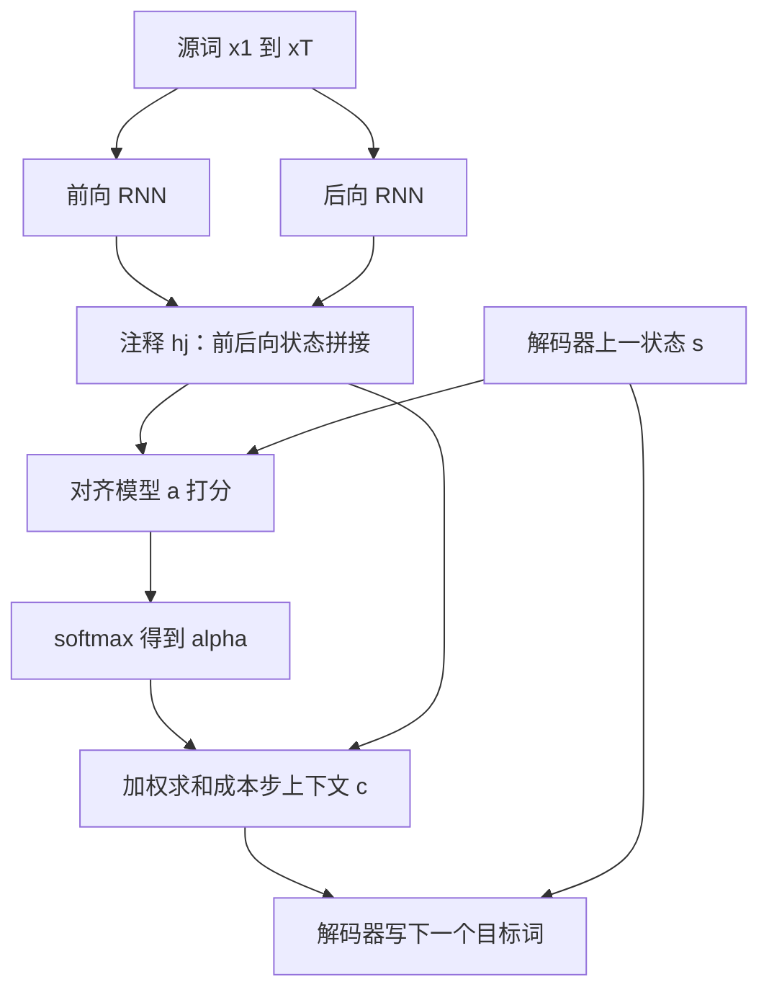

# 软搜索源句位置：对齐与翻译一起学，固定向量不再卡长句

<!-- release-date: 2014-09-01 -->

**本文依据**：`NEURAL MACHINE TRANSLATION BY JOINTLY LEARNING TO ALIGN AND TRANSLATE`，ICLR 2015 会议论文，arXiv:1409.0473，letter，15 页。作者 Dzmitry Bahdanau，Jacobs University Bremen, Germany；KyungHyun Cho、Yoshua Bengio，Université de Montréal。Bengio 脚注为 CIFAR Senior Fellow。页眉印 `arXiv:1409.0473v7 [cs.CL] 19 May 2016`。封面印 **Published as a conference paper at ICLR 2015**。文中数字均标 PDF 页码；标「外部补充」的段落不来自本文。

## 一句话

当时的神经机器翻译多半是编码器–解码器：编码器把整句源文压成**一个固定长度向量**，解码器再从这个向量吐出译文。作者判断这个固定向量就是瓶颈，尤其长句会迅速崩。他们改成：编码器输出一串「注释」向量；解码每写一个目标词，都用一个可微的对齐模型对源位置做**软搜索**，再按权重加权求和得到该步自己的上下文。英→法上，单模型 RNNsearch 与当时短语统计系统 Moses 相当；可视化对齐也符合语感（PDF p. 1）。

它解决的不是「循环网能不能翻译」，而是 **2014 年那条卡死的路：整句必须挤进一个向量，长度一超训练集就掉分。**

## 一、矛盾：整句压成一个向量，长句先死

神经机器翻译要把源句 $x$ 映到目标句 $y$，即找 $\arg\max_y p(y\mid x)$。和短语统计系统不同，它希望用**一座**大网络端到端调到翻译指标，而不是一堆分开调的小组件（PDF p. 1）。

Kalchbrenner 与 Blunsom（2013）、Sutskever 等人（2014）、Cho 等人（2014b）刚把这条路摆上台面。多数模型属于编码器–解码器：编码器读源句得到固定向量，解码器从该向量生成译文，整座系统联合最大化正确译文的概率（PDF p. 1）。

问题很具体。网络必须把源句全部必要信息压进固定长度。句子一长，尤其比训练集更长，就难扛。Cho 等人（2014b）已经看到：基本编码器–解码器的表现会随输入长度迅速恶化（PDF p. 1）。

对策不是再加大那个向量，而是**对齐和翻译一起学**。每生成一个译文词，模型对源句里信息最集中的位置做软搜索，再用这些位置上的上下文向量，加上已经写出的目标词，预测下一个词（PDF p. 1）。

和基本编码器–解码器的关键差别：不再试图把整句编码成单个固定向量，而是编成一串向量，解码时自适应挑子集。编码器不必按长度把整句挤扁。作者后文会证明，长句因此好扛得多（PDF p. 2）。

把机制先摊开（机制示意，根据 PDF p. 3 图 1 重画，不是实测时间轴）：

图 1 的故事是：生成第 $t$ 个目标词 $y_t$ 时，解码器状态 $s_t$ 并不只看一个全局向量，而是看一组 $\alpha_{t,j}$ 加权后的源注释（PDF p. 3）。

引言里的主结果已经钉住：联合对齐与翻译，相对基本编码器–解码器显著更好；长句上更明显，短句也有。英→法上，**单模型**已与常规短语系统相当或接近。定性上看，软对齐在语言学上说得通（PDF p. 2）。

## 二、背景：RNN 编码器–解码器把条件概率拆开

从概率看，翻译就是给定 $x$ 找使 $p(y\mid x)$ 最大的 $y$。神经翻译用平行语料拟合这个条件分布，再搜索使条件概率最大的译文（PDF p. 2）。

典型做法是两座循环神经网络（Recurrent Neural Network，RNN）：一座把变长源句编成固定向量，一座把该向量解码成变长目标句。Sutskever 等人用长短期记忆（Long Short-Term Memory，LSTM）已经在英→法上接近当时**不含任何神经组件**的短语系统。把神经网塞进现成系统——给短语表打分，或重排候选——还能超过原先的最好水平（PDF p. 2）。

Cho 等人与 Sutskever 等人的框架是后文要改的底座。编码器读 $x=(x_1,\ldots,x_{T_x})$，迭代（PDF p. 2 式 1）

$$
h_t=f(x_t,h_{t-1}),\qquad c=q(\{h_1,\ldots,h_{T_x}\})
$$

Sutskever 等人取 $f$ 为 LSTM，并令 $c=h_T$（PDF p. 2）。

解码器按已经写出的词和同一个 $c$ 预测下一个词，联合概率拆成有序条件（PDF p. 3 式 2–3）

$$
p(y)=\prod_{t=1}^{T_y}p(y_t\mid\{y_1,\ldots,y_{t-1}\},c)=g(y_{t-1},s_t,c)
$$

$s_t$ 是解码器隐状态。注意：每一步共用同一个 $c$。后文整篇的改动，就是把这个共享的 $c$ 换成**每个目标词自己的** $c_i$。

脚注已经预告：先前工作几乎都把变长句编成固定向量，但这不是必须的；变长表示甚至可能更好（PDF p. 2）。

## 三、解码器：每一步自己搜一份上下文

新架构由双向 RNN 编码器（第 3.2 节）和「解码时在源句里搜索」的解码器（第 3.1 节）组成（PDF p. 3）。

每个条件概率改写成（PDF p. 3 式 4）

$$
p(y_i\mid y_1,\ldots,y_{i-1},x)=g(y_{i-1},s_i,c_i),\qquad s_i=f(s_{i-1},y_{i-1},c_i)
$$

和式 2 不同，这里每个目标词 $y_i$ 对应一份不同的上下文 $c_i$。

$c_i$ 依赖编码器把源句映成的注释序列 $(h_1,\ldots,h_{T_x})$。每个 $h_i$ 含整句信息，但焦点落在第 $i$ 个源词附近（PDF p. 3）。

上下文是注释的加权和（PDF p. 3 式 5）

$$
c_i=\sum_{j=1}^{T_x}\alpha_{ij}h_j
$$

权重由对齐能量经 softmax 得到（PDF p. 3 式 6）

$$
\alpha_{ij}=\frac{\exp(e_{ij})}{\sum_{k=1}^{T_x}\exp(e_{ik})},\qquad e_{ij}=a(s_{i-1},h_j)
$$

对齐模型 $a$ 给「源位置 $j$ 附近」和「即将写出的第 $i$ 个目标词」打分。打分用的是发出 $y_i$ **之前**的解码状态 $s_{i-1}$ 和源注释 $h_j$。$a$ 实现成前馈网，和整座翻译系统一起训（PDF p. 3）。

和传统机器翻译不同：对齐**不是**隐变量。软对齐让代价的梯度直接穿过对齐模型，对齐和翻译可以联合训练（PDF p. 4）。

加权和可以读成对齐上的期望注释：$\alpha_{ij}$ 是「$y_i$ 对齐到、或译自 $x_j$」的概率，$c_i$ 就是在这些概率下的期望注释（PDF p. 4）。

直观上，这就是解码器里的注意力：解码器自己决定看源句哪一段。编码器不必再把整句塞进固定向量；信息可以摊在注释序列上，解码器按需取回（PDF p. 4）。

**旧问题 → 新设计 → 机制 → 收益 → 代价。** 固定 $c$ 逼编码器一次记完全句；改成每步 $c_i$，编码器只负责局部注释，对齐模型负责检索。代价是每对 $(i,j)$ 都要算一次 $a$，源长 $\times$ 目标长。翻译句多半 15–40 词，作者认为这点开销可接受；别的任务未必（PDF p. 8）。

可迁移：今天点积注意力已经换了打分函数，但「不要强迫一个向量扛完全句，让解码步自己检索」这条因果链还在。

## 四、编码器：双向 RNN 给每个词做前后文注释

普通 RNN 按式 1 从 $x_1$ 读到 $x_{T_x}$。作者希望每个词的注释既总结前面，也总结后面，于是用 Schuster 与 Paliwal（1997）的双向 RNN（Bidirectional RNN，BiRNN）；语音识别里 Graves 等人已经用过（PDF p. 4）。

前向 RNN 按原序读，得到 $(\overrightarrow{h}_1,\ldots,\overrightarrow{h}_{T_x})$；后向 RNN 从句末读回句首，得到 $(\overleftarrow{h}_1,\ldots,\overleftarrow{h}_{T_x})$。词 $x_j$ 的注释是拼接（PDF p. 4）

$$
h_j=\bigl[\overrightarrow{h}_j^\top;\overleftarrow{h}_j^\top\bigr]^\top
$$

RNN 更擅长表示近期输入，所以 $h_j$ 会聚焦在 $x_j$ 附近。这串注释交给解码器和对齐模型去算 $c_i$（PDF p. 4）。

## 五、实验设置：ACL WMT ’14 英→法

作者在英→法上评这套方法，对照是 Cho 等人（2014a）的 RNN 编码器–解码器。两套模型用同一套训练流程和同一份数据（PDF p. 4）。实现挂在 `https://github.com/lisa-groundhog/GroundHog`（PDF p. 4 脚注 4）。

### 5.1 数据集

WMT ’14 英–法平行语料：Europarl（6100 万词）、news commentary（550 万）、UN（4.21 亿），外加两份爬取语料 9000 万与 2.725 亿，合计 8.5 亿词。按 Cho 等人（2014a）的做法，用 Axelrod 等人（2011）的数据选择把合并语料收到 3.48 亿词。除这些平行语料外**不用**任何单语数据；作者提到或许可以用更大单语语料预训练编码器，但本文没做（PDF p. 4）。

开发集由 news-test-2012 与 news-test-2013 拼接；测试集是 WMT ’14 的 news-test-2014，3003 句，不在训练集里（PDF p. 5）。

常规分词后，每种语言取最常见 3 万词短名单；不在名单里的词一律映成 `[UNK]`。不做小写化或词干化（PDF p. 5）。分词脚本来自 Moses（PDF p. 5 脚注 6）。

### 5.2 模型

两类模型：RNNencdec（Cho 等人 2014a）和本文的 RNNsearch。每类训两次：源/目标长度上限 30 词（RNNencdec-30、RNNsearch-30）和上限 50 词（RNNencdec-50、RNNsearch-50）（PDF p. 5）。正文写「50 word」，漏了复数 s，指 50 词。

RNNencdec 的编码器和解码器各 1000 个隐单元。RNNsearch 编码器是前向、后向各 1000 个隐单元的 RNN，解码器 1000 个隐单元。两边都用带一层 maxout 隐层的多层网算每个目标词的条件概率。本文里「隐单元」一律指门控隐单元（PDF p. 5 及脚注 7）。

训练是小批量随机梯度下降，配 Adadelta。每步用 80 句。每座模型大约训 5 天（PDF p. 5）。

训完用束搜索近似最大化条件概率，做法与 Graves（2012）、Boulanger-Lewandowski 等人（2013）以及 Sutskever 等人（2014）生成译文的路子一致。架构与训练细节在附录 A、B（PDF p. 5）。

## 六、定量结果：表 1 的 BLEU，以及图 2 的长度曲线

第 5 节标题是 **Results**；第一块定量结果对应表 1 与图 2。表 1 印在 PDF 第 7 页，图 2 在第 5 页。

表 1 用 BLEU。所有设定下 RNNsearch 都高于 RNNencdec。更要紧的是：只评「句中和参考译文里都没有未登录词」的句子时，RNNsearch 已经和短语系统 Moses 一样高。Moses 额外用了 4.18 亿词的单语语料，RNNsearch 与 RNNencdec 没有（PDF p. 5、p. 7）。

表 1 数字如下（PDF p. 7）。「All」是整份测试集；「No UNK」是自身与参考都无未登录词。评无未登录句子时，禁止模型生成 `[UNK]`。RNNsearch-50 带星号的那一行训得更久，直到开发集不再提升。

| 模型 | All | No UNK |
|---|---:|---:|
| RNNencdec-30 | 13.93 | 24.19 |
| RNNsearch-30 | 21.50 | 31.44 |
| RNNencdec-50 | 17.82 | 26.71 |
| RNNsearch-50 | 26.75 | 34.16 |
| RNNsearch-50（更久） | 28.45 | 36.15 |
| Moses | 33.30 | 35.63 |

No UNK 列上，训更久的 RNNsearch-50 是 36.15，Moses 是 35.63，神经单模型略高；All 列上 Moses 仍是 33.30，对 28.45，短语系统仍领先——因为测试集含未登录词，而神经模型词表只有 3 万。

图 2 按句长切 BLEU，用的是**含未登录词**的完整测试集。RNNencdec 随长度急剧下跌；RNNsearch-30 与 RNNsearch-50 对长度更稳。RNNsearch-50 在 50 词及以上几乎不掉。RNNsearch-30 甚至超过 RNNencdec-50，与表 1 一致（PDF p. 5–6）。

这正是引言的猜想：固定长度上下文让基本编码器–解码器在长句上吃亏；软搜索把这条限制拆掉。

## 七、定性：图 3 的软对齐，以及长句样例

### 7.1 对齐

把式 6 的 $\alpha_{ij}$ 画成矩阵，就能看生成译文里每个词盯过源句哪些位置。图 3 四张图：$x$ 轴英语源词，$y$ 轴法语译文；像素灰度是权重（0 黑、1 白）。(a) 任意一句；(b–d) 从测试集里无未登录、长度 10–20 的句子中随机抽三句（PDF p. 6）。

英→法大体单调，对角权重大。也有非平凡的非单调对齐。法语形容词和名词顺序常与英语相反。图 3(a) 里模型把 `European Economic Area` 译成 `zone économique européen`：先把 `zone` 对上 `Area`，跳过中间两个词，再一次回看一个词，补完整个短语（PDF p. 7）。

软对齐相对硬对齐的好处，图 3(d) 最清楚。源短语 `the man` 译成 `l' homme`。硬对齐会把 `the` 钉到 `l'`、`man` 钉到 `homme`。这帮不上忙：必须看 `the` 后面的词，才能决定译成 `le`、`la`、`les` 还是 `l'`。软对齐让模型同时看 `the` 和 `man`，这个例子里正确译成 `l'`。图 3 其余例子也类似。额外好处是源、目标短语长度可以不等，不必把某些词硬对到 `NULL`（PDF p. 7）。

这些是作者读图的观察，不是自动对齐评测分数。论文没有给对齐错误率一类数字。

### 7.2 长句

图 2 已经显示 RNNsearch 更擅长长句。原因很可能是：它不必把长句完美压进固定向量，只要把某个词周围的部分编码准（PDF p. 7）。

测试集一例：`An admitting privilege is the right of a doctor to admit a patient to a hospital or a medical centre to carry out a diagnosis or a procedure, based on his status as a health care worker at a hospital.`

RNNencdec-50 译到 `a medical center` 附近还对，之后偏离：把 `based on his status as a health care worker at a hospital` 译成 `en fonction de son état de santé`（按健康状况），意思错了（PDF p. 7–8）。

RNNsearch-50 给出正确译文，细节在：`Un privilège d'admission est le droit d'un médecin d'admettre un patient à un hôpital ou un centre médical pour effectuer un diagnostic ou une procédure, selon son statut de travailleur des soins de santé à l'hôpital.`（PDF p. 8）

另一例 Disney 长句：RNNencdec-50 大约写到 30 词后开始跑偏，连结束引号都丢了；RNNsearch-50 整句正确，包括引号和 `a-t-il ajouté`（PDF p. 8）。

作者认为这些样例加上表 1、图 2，支持「RNNsearch 译长句远比标准 RNNencdec 可靠」。附录 C 还有 RNNencdec-50、RNNsearch-50、Google Translate 与参考译文的对照；Google Translate 取自 2014 年 8 月 27 日（PDF p. 8、p. 15）。

## 八、相关工作：单调高斯对齐，以及「神经只当一个特征」

### 8.1 学对齐

Graves（2013）在手写合成里也把输出符号对齐到输入符号，用高斯核混合给注释加权，核的位置、宽度、混合系数由对齐模型预测，并且位置必须单调递增。与本文的差别：Graves 的权重众数只能朝一个方向走。机器翻译经常要长距离调序（例如英→德），这条限制很重（PDF p. 8）。

本文每个目标词都要对每个源词算一次注释权重。翻译句多半 15–40 词，这点开销不严重；别的任务可能受不了（PDF p. 8）。

### 8.2 机器翻译里的神经网络

Bengio 等人（2003）的神经概率语言模型之后，神经网络在翻译里用得很广，但角色多半是给现成统计系统提供一个特征，或重排候选。Schwenk（2012）用前馈网给源–目标短语打分，当短语系统的额外特征；Kalchbrenner 与 Blunsom（2013）、Devlin 等人（2014）也把神经网当现成系统的子组件；目标端神经语言模型用来重打分（PDF p. 9）。

这些都能抬分。作者要的更激进：完全基于神经网络的新翻译系统，自己从源句直接生成译文，而不是给现成系统当零件（PDF p. 9）。

## 九、结论与作者自己留下的缺口

常规编码器–解码器把整句编成固定向量再解码。作者根据 Cho 等人（2014b）与 Pouget-Abadie 等人（2014）的经验，判断固定上下文对长句有问题（PDF p. 9）。

RNNsearch 让模型在写每个目标词时软搜索输入词或其注释。模型不必把整句塞进固定向量，也可以只盯和下一个词相关的信息。这对长句有明显正面影响。和传统系统不同，包括对齐在内的所有部件，都朝着「正确译文的对数概率」联合训练（PDF p. 9）。

英→法实验：RNNsearch 显著超过 RNNencdec，且对源句长度更稳；读软对齐后，作者认为模型能在写出正确译文的同时，把每个目标词对到源句里相关的词或注释。单模型已经与现成短语统计翻译相当。作者强调：整族神经机器翻译这一年才提出，这个结果已经够刺眼（PDF p. 9）。

留下的挑战：更好地处理未登录词或稀有词。要做到更广泛可用、并在所有情境下追上当时最强机器翻译，这一步还缺（PDF p. 9）。

致谢：Theano；NSERC、Calcul Québec、Compute Canada、Canada Research Chairs、CIFAR；Bahdanau 感谢 Planet Intelligent Systems GmbH（PDF p. 10）。

论文没写：束宽数字、参数总量、墙钟以外的吞吐、对齐的自动评测。没写的不补。

## 十、附录 A：实验里真正用的门控单元与加性对齐

第 3 节是通用框架，$f$ 和 $a$ 可以自选。附录写下实验里的选择（PDF p. 12）。

### 10.1 门控隐单元

$f$ 用 Cho 等人（2014a）刚提出的门控隐单元，作为逐元素 tanh 的替代。它和 LSTM 类似，能更好地建长依赖：展开后的 RNN 里存在导数乘积接近 1 的路径，梯度不那么容易消失。也可以换成 LSTM，Sutskever 等人在相近设定里就是这么做的（PDF p. 12）。

解码器新状态（PDF p. 12）

$$
s_i=(1-z_i)\circ s_{i-1}+z_i\circ\tilde{s}_i
$$

候选状态

$$
\tilde{s}_i=\tanh\bigl(W e(y_{i-1})+U[r_i\circ s_{i-1}]+C c_i\bigr)
$$

$e(y_{i-1})$ 是 $m$ 维词嵌入。更新门 $z_i$ 让单元保持旧激活；重置门 $r_i$ 控制从上一状态丢掉多少。两者都是 logistic sigmoid，并都吃 $c_i$（PDF p. 12）。编码器公式相同，只是丢掉与 $c_i$ 有关的项（PDF p. 12 脚注 8）。

每步输出概率是多层函数：一层 maxout，再 softmax（PDF p. 12）。

### 10.2 对齐模型

一对句长 $T_x$、$T_y$ 要对齐模型评 $T_x\times T_y$ 次。为了省算，用单层多层感知机（PDF p. 12）

$$
a(s_{i-1},h_j)=v_a^\top\tanh(W_a s_{i-1}+U_a h_j)
$$

$W_a\in\mathbb{R}^{n\times n}$，$U_a\in\mathbb{R}^{n\times 2n}$，$v_a\in\mathbb{R}^n$。$U_a h_j$ 不依赖 $i$，可以预先算好（PDF p. 12）。这就是后来常说的加性注意力：先把两边投影进同一空间再 tanh，而不是点积。

### 10.3 编码器、解码器与模型尺寸

输入输出都是 1-of-K 词向量。前向状态用门控公式，嵌入矩阵 $E\in\mathbb{R}^{m\times K_x}$；后向同样，**共享** $E$，不共享循环权重。注释按式 7 拼接前后向（PDF p. 13）。

解码器初始状态 $s_0=\tanh(W_s\overleftarrow{h}_1)$，即后向 RNN 读完源句（停在句首）的状态（PDF p. 13）。若把 $c_i$ 固定成 $\overrightarrow{h}_{T_x}$，模型退回 Cho 等人的 RNN 编码器–解码器（PDF p. 14）。

目标词概率用深层输出加一层 maxout（PDF p. 14）。

所有模型：$n=1000$，$m=620$，maxout 隐层 $l=500$，对齐模型隐单元 $n'=1000$（PDF p. 14）。

## 十一、附录 B：初始化、Adadelta 与表 2

循环权重矩阵初始化为随机正交。$W_a$、$U_a$ 的元素从均值 0、方差 $0.001^2$ 的高斯抽样。$v_a$ 与所有偏置置零。其余权重从均值 0、方差 $0.01^2$ 的高斯抽样（PDF p. 14）。

优化是 SGD + Adadelta（$\epsilon=10^{-6}$，$\rho=0.95$）。代价梯度的 $L_2$ 范数超过 1 就裁到 1。每步 80 句（PDF p. 14–15）。

实现耗时与 minibatch 里最长句成正比。每 20 次更新前取 1600 对句，按长度排序再切成 20 个 minibatch。训练数据开训前洗一次，然后按这个方式顺序扫（PDF p. 15）。

表 2（PDF p. 14）：一次更新 = 一个 minibatch 更新一次参数；一个 epoch = 扫完训练集一遍。NLL 是训练集或开发集上句子的平均条件对数概率，**句长不同，不能直接横比**。

| 模型 | 更新（$\times 10^5$） | Epochs | 小时 | GPU | Train NLL | Dev. NLL |
|---|---:|---:|---:|---|---:|---:|
| RNNenc-30 | 8.46 | 6.4 | 109 | TITAN BLACK | 28.1 | 53.0 |
| RNNenc-50 | 6.00 | 4.5 | 108 | Quadro K-6000 | 44.0 | 43.6 |
| RNNsearch-30 | 4.71 | 3.6 | 113 | TITAN BLACK | 26.7 | 47.2 |
| RNNsearch-50 | 2.88 | 2.2 | 111 | Quadro K-6000 | 40.7 | 38.1 |
| RNNsearch-50（更久） | 6.67 | 5.0 | 252 | Quadro K-6000 | 36.7 | 35.2 |

约 5 天与表 2 的 108–113 小时一致；带星号的那行 252 小时，对应表 1 里训到开发集不再提升的 RNNsearch-50。

## 十二、可迁移启发

1. **瓶颈要说清楚是哪一个。** 这篇的瓶颈不是「RNN 太弱」，而是「一个向量必须扛完全句」。先定位瓶颈，再决定是加大容量还是改接口。
2. **检索比压缩更便宜地换长度。** 把表示摊成序列，让解码步加权求和，长句不必先被压扁。
3. **对齐可以是可微模块，不必是隐变量。** 软权重让对齐和翻译共用同一条对数似然。
4. **双向注释给对齐提供可对齐的局部焦点。** 前向加后向拼接，不是为了赶时髦，是因为对齐模型需要「词附近」的摘要。
5. **评测要切开长度和未登录词。** 表 1 的 All / No UNK 和图 2 的句长曲线，比单独一个 BLEU 更能说明「瓶颈到底有没有被拆掉」。

## 十三、关键词回看

- **编码器–解码器**：先把源句编成表示，再生成目标句；基本版里表示是一个固定向量。
- **固定长度向量瓶颈**：句长一变，信息仍必须挤进同一尺寸的 $c$。
- **注释 $h_j$**：双向 RNN 在每个源位置上的拼接状态，焦点在该词附近。
- **对齐模型 $a$**：前馈网，给 $(s_{i-1},h_j)$ 打分；softmax 后得到 $\alpha_{ij}$。
- **软搜索 / 注意力**：用 $\alpha_{ij}$ 对注释做期望，而不是切硬片段。
- **RNNsearch / RNNencdec**：本文提案与 Cho 等人的基线在文中的名字。
- **BLEU**：表 1 的自动翻译分数；All 含未登录词，No UNK 不含。

## 参考资料

- 原论文 PDF：仓库内 `readings/_src/深度学习基石/Bahdanau-Attention.pdf`
- arXiv：https://arxiv.org/abs/1409.0473
- 实现（论文脚注）：https://github.com/lisa-groundhog/GroundHog
