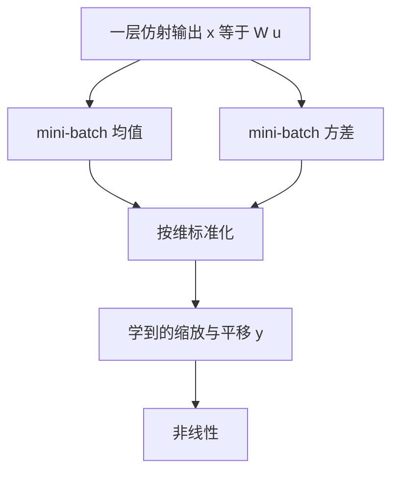

# Batch Normalization：把层输入钉住，深度网才能用大学习率训起来

<!-- release-date: 2015-02-11 -->

**本文依据**：`Batch Normalization: Accelerating Deep Network Training by Reducing Internal Covariate Shift`，arXiv:1502.03167v3 [cs.LG] 2 Mar 2015，letter，11 页。作者 Sergey Ioffe、Christian Szegedy，均为 Google Inc.。封面未印会议名。文中数字均标 PDF 页码；标「外部补充」的段落不来自本文。摘要写集成 4.8% 测试错误，图 4 脚注写 ILSVRC 服务器上的 4.82%，以表格为准。

## 一句话

深度网难训，不只是因为损失非凸。每一层的输入分布会跟着前面层的参数一起漂，作者把这种漂叫做内部协变量偏移（Internal Covariate Shift）。他们把归一化写进网络本身：对每个 mini-batch 按维度减均值、除标准差，再学一对缩放 $\gamma$ 与平移 $\beta$。这样梯度能穿过归一化，统计量也参与反传。加到当时最强的 ImageNet 分类网上，同样精度只需约十四分之一的训练步；再改学习率与正则，单网超过原 Inception。六个 BN 网集成后，ImageNet 验证集 top-5 错误 4.9%，测试集 4.82%（PDF p. 1、p. 7 图 4）。

它解决的不是「再发明一种白化」，而是 2015 年初那条卡死的路：**层输入一边学一边改分布，只能用小学率、小心初始化，饱和非线性几乎训不动。** 把归一化变成可微的一层，分布才钉得住。

## 一、矛盾：前面一层一动，后面一层就要重新适应

随机梯度下降（Stochastic Gradient Descent，SGD）按步更新参数 $\Theta$，每步用大小为 $m$ 的 mini-batch 估梯度。批量相对单样本有两处好处：梯度更接近全训练集；现代硬件上批量计算更并行（PDF p. 1）。

难处在超参。学习率和初始值都要小心调。每一层的输入都受前面所有层参数影响，小改动会沿深度放大（PDF p. 1）。输入分布一变，系统就在经历协变量偏移（covariate shift，Shimodaira 2000）。通常这是整网的域适应问题。作者把它推到子网和单层（PDF p. 1）。

把网络写成 $\ell=F_2(F_1(u,\Theta_1),\Theta_2)$。学 $\Theta_2$ 时，可以把 $x=F_1(u,\Theta_1)$ 看成子网 $\ell=F_2(x,\Theta_2)$ 的输入。对 $F_2$ 做一步梯度下降，和单独训 $F_2$ 完全一样。因此「训练与测试同分布」这类对整网有利的性质，对子网同样有利。$x$ 的分布若能固定，$\Theta_2$ 就不必反复补偿上游的漂移（PDF p. 1–2）。

饱和非线性把这件事放大。sigmoid 层 $z=g(Wu+b)$，$|x|$ 一大，导数就趋零，梯度消失。$x=Wu+b$ 又被 $W$、$b$ 和更下层一起推着走，很多维会滑进饱和区。深度越大越糟。实务上靠 ReLU、小心初始化和小学率硬扛。若非线性输入的分布能稳住，优化器就不那么容易卡死（PDF p. 2）。

作者把训练过程中内部节点分布的变化叫做内部协变量偏移。Batch Normalization（批归一化，BN）朝减少它迈一步：用归一化钉住层输入的均值和方差。副作用还包括：梯度对参数尺度和初值不那么敏感，可以用更大的学习率；有正则效果，有时能去掉 Dropout；饱和非线性也不那么容易卡死（PDF p. 2）。第 4.2 节还预告：对当时最强 ImageNet 网，用 7% 的训练步就能打平，再往上还能超过（PDF p. 2）。7% 与摘要「十四分之一步」是同一件事的两种说法。

先把训练时的数据流摊开（机制示意，根据 PDF p. 3 算法 1 与第 3.2 节重画，不是实测时间轴）：

## 二、为什么「训练后再白化」不够，必须让梯度看见归一化

内部协变量偏移定义为：训练时网络参数变了，激活分布跟着变。作者希望层输入 $x$ 的分布固定下来，以加快训练。LeCun 等人 1998、Wiesler 与 Ney 2011 早已指出：输入白化（零均值、单位方差、再去相关）能加快收敛。每一层看到的是下层输出，对每层输入做同样的白化，就是朝「固定分布」走一步（PDF p. 2）。

可以每隔若干步用全数据重算白化，或把优化器改成依赖激活统计。问题是：这些修改若插在梯度步之间，下降步可能朝「必须立刻再归一化」的方向更新，把刚走的那一步抵消掉。极端例子：层先加偏置 $b$，再减全训练集均值。若梯度假装均值不依赖 $b$，更新 $b$ 之后再减新均值，输出完全不变，损失也不变，$b$ 却会无限涨。再带上缩放，模型会炸。作者在早期实验里见过：统计量在梯度步外面算，网络就崩（PDF p. 2）。

因此归一化必须是对任意参数值都成立的变换，损失对 $\Theta$ 的梯度必须把「归一化如何依赖 $\Theta$」算进去。写成 $\hat{x}=\mathrm{Norm}(x,X)$，$X$ 是全训练集上该层输入的集合。反传既要 $\partial\mathrm{Norm}/\partial x$，也要 $\partial\mathrm{Norm}/\partial X$。丢掉后一项，就是上面那种爆炸（PDF p. 3）。

完整白化还贵：要算协方差、逆平方根，以及这些变换的导数。需要一种可微、又不必每步扫完全训练集的替代（PDF p. 3）。按单样本或按图像位置算统计会丢掉激活的绝对尺度。作者要的是：相对整个训练数据的统计来归一化，从而保住网络里的信息（PDF p. 3）。

## 三、两条简化：按维标准化，再用 mini-batch 估统计

完整白化又贵又不是处处可微，于是两条简化（PDF p. 3）。

第一，不联合白化，只对每个标量特征独立做零均值、单位方差。$d$ 维输入 $x=(x^{(1)},\ldots,x^{(d)})$ 的每一维：

$$
\hat{x}^{(k)}=\frac{x^{(k)}-\mathbb{E}[x^{(k)}]}{\sqrt{\mathrm{Var}[x^{(k)}]}}
$$

期望和方差本应在全训练集上算。LeCun 等人已指出：即便不去相关，这种归一化也能加快收敛（PDF p. 3）。

只标准化会改层能表示的函数。sigmoid 的输入若被钉在零附近，就几乎落在线性区。所以插入的变换必须能表示恒等。给每个激活一对可学参数 $\gamma^{(k)}$、$\beta^{(k)}$：

$$
y^{(k)}=\gamma^{(k)}\hat{x}^{(k)}+\beta^{(k)}
$$

令 $\gamma^{(k)}=\sqrt{\mathrm{Var}[x^{(k)}]}$、$\beta^{(k)}=\mathbb{E}[x^{(k)}]$，就能还原原始激活——如果那才是最优的（PDF p. 3）。

第二，随机优化用不了每步全数据统计。mini-batch 本身就能估每维均值和方差，于是这些统计量完整进入反传。按维方差而不是联合协方差，还有一层实际原因：batch 往往小于激活维数，联合协方差容易奇异，必须再正则（PDF p. 3）。

对某个激活，mini-batch $\mathcal{B}=\{x_{1\ldots m}\}$。BN 变换是 $\mathrm{BN}_{\gamma,\beta}:x_{1\ldots m}\mapsto y_{1\ldots m}$。算法 1 按原文印刷如下，$\epsilon$ 加在方差上保证数值稳定（PDF p. 3）。

输入：mini-batch 上的 $x$ 值 $\mathcal{B}=\{x_{1\ldots m}\}$；要学的 $\gamma$、$\beta$。输出：$\{y_i=\mathrm{BN}_{\gamma,\beta}(x_i)\}$。

$$
\begin{aligned}
\mu_{\mathcal{B}} &\leftarrow \frac{1}{m}\sum_{i=1}^{m} x_i \\
\sigma_{\mathcal{B}}^{2} &\leftarrow \frac{1}{m}\sum_{i=1}^{m}(x_i-\mu_{\mathcal{B}})^{2} \\
\hat{x}_{i} &\leftarrow \frac{x_i-\mu_{\mathcal{B}}}{\sqrt{\sigma_{\mathcal{B}}^{2}+\epsilon}} \\
y_i &\leftarrow \gamma\hat{x}_i+\beta \equiv \mathrm{BN}_{\gamma,\beta}(x_i)
\end{aligned}
$$

$y=\mathrm{BN}_{\gamma,\beta}(x)$ 并不按样本独立处理：$x$ 依赖当前样本，也依赖 batch 里别的样本。交给后续层的是缩放平移后的 $y$；$\hat{x}$ 是变换内部量，但很关键。忽略 $\epsilon$、且 batch 内样本同分布时，$\sum_i\hat{x}_i=0$、$\frac{1}{m}\sum_i\hat{x}_i^{2}=1$，故 $\hat{x}$ 期望为 0、方差为 1。每个 $\hat{x}^{(k)}$ 可看成子网 $y^{(k)}=\gamma^{(k)}\hat{x}^{(k)}+\beta^{(k)}$ 的输入。联合分布仍可能变，但固定一二阶矩应能加快子网、从而加快整网（PDF p. 3–4）。

训练时要用链式法则把损失 $\ell$ 反传到 $x_i$、$\mu_{\mathcal{B}}$、$\sigma_{\mathcal{B}}^{2}$、$\gamma$、$\beta$。印刷公式在 PDF 第 4 页，化简前为：

$$
\frac{\partial\ell}{\partial\hat{x}_i}=\frac{\partial\ell}{\partial y_i}\cdot\gamma
$$

$$
\frac{\partial\ell}{\partial\sigma_{\mathcal{B}}^{2}}=\sum_{i=1}^{m}\frac{\partial\ell}{\partial\hat{x}_i}\cdot(x_i-\mu_{\mathcal{B}})\cdot\frac{-1}{2}(\sigma_{\mathcal{B}}^{2}+\epsilon)^{-3/2}
$$

$$
\frac{\partial\ell}{\partial\mu_{\mathcal{B}}}=\sum_{i=1}^{m}\frac{\partial\ell}{\partial\hat{x}_i}\cdot\frac{-1}{\sqrt{\sigma_{\mathcal{B}}^{2}+\epsilon}}+\frac{\partial\ell}{\partial\sigma_{\mathcal{B}}^{2}}\cdot\frac{\sum_{i=1}^{m}-2(x_i-\mu_{\mathcal{B}})}{m}
$$

$$
\frac{\partial\ell}{\partial x_i}=\frac{\partial\ell}{\partial\hat{x}_i}\cdot\frac{1}{\sqrt{\sigma_{\mathcal{B}}^{2}+\epsilon}}+\frac{\partial\ell}{\partial\sigma_{\mathcal{B}}^{2}}\cdot\frac{2(x_i-\mu_{\mathcal{B}})}{m}+\frac{\partial\ell}{\partial\mu_{\mathcal{B}}}\cdot\frac{1}{m}
$$

$$
\frac{\partial\ell}{\partial\gamma}=\sum_{i=1}^{m}\frac{\partial\ell}{\partial y_i}\cdot\hat{x}_i,\qquad
\frac{\partial\ell}{\partial\beta}=\sum_{i=1}^{m}\frac{\partial\ell}{\partial y_i}
$$

BN 因此是可微变换。学到的仿射还能表示恒等，容量保住（PDF p. 4）。

**旧问题 → 新设计 → 机制 → 收益 → 代价。** 全数据白化每步太贵，梯度还看不见；按维、按 batch 估统计，归一化进入计算图。代价是训练输出变成 batch 相关的；推理必须改用总体统计，见下一节。

可迁移：凡是「先统计再变换」的层，都要问一句——统计量有没有进反传。没进，就可能出现偏置空涨那种抵消。

## 四、训练用 batch 统计，推理用总体统计

要对网络做 BN，选定一批激活，按算法 1 插入变换；原先吃 $x$ 的层改吃 $\mathrm{BN}(x)$。可用 batch 梯度、或 $m>1$ 的 SGD，以及 Adagrad 这类变体（PDF p. 4）。

训练时依赖 mini-batch 是为了效率；推理既不必要、也不可取——输出应只由输入决定。训完后改用总体统计：

$$
\hat{x}=\frac{x-\mathbb{E}[x]}{\sqrt{\mathrm{Var}[x]+\epsilon}}
$$

忽略 $\epsilon$ 时，与训练时同样是均值 0、方差 1。无偏方差估计为 $\mathrm{Var}[x]=\frac{m}{m-1}\mathbb{E}_{\mathcal{B}}[\sigma_{\mathcal{B}}^{2}]$，期望对大小为 $m$ 的训练 batch 取。也可用滑动平均跟踪训练中的精度。推理时均值方差冻结，归一化就是对每个激活的线性变换，再与 $\gamma$、$\beta$ 合成一个线性层，替换 $\mathrm{BN}(x)$（PDF p. 4）。

算法 2 按原文步骤（PDF p. 4）：

1. 复制原网为训练 BN 网。
2. 对每个选定激活插入 $y^{(k)}=\mathrm{BN}_{\gamma^{(k)},\beta^{(k)}}(x^{(k)})$，下游改吃 $y^{(k)}$。
3. 联合优化原参数 $\Theta$ 与全部 $\gamma$、$\beta$。
4. 推理网冻结参数；对多次训练 batch 平均 $\mathbb{E}[x]\leftarrow\mathbb{E}_{\mathcal{B}}[\mu_{\mathcal{B}}]$，$\mathrm{Var}[x]\leftarrow\frac{m}{m-1}\mathbb{E}_{\mathcal{B}}[\sigma_{\mathcal{B}}^{2}]$。
5. 把 $y=\mathrm{BN}_{\gamma,\beta}(x)$ 换成

$$
y=\frac{\gamma}{\sqrt{\mathrm{Var}[x]+\epsilon}}\,x+\left(\beta-\frac{\gamma\mathbb{E}[x]}{\sqrt{\mathrm{Var}[x]+\epsilon}}\right)
$$

## 五、卷积：在非线性之前，并且整张特征图共用一对 $\gamma$、$\beta$

BN 可插在任意激活上。作者聚焦「仿射再逐元非线性」：$z=g(Wu+b)$，覆盖全连接和卷积。BN 紧挨非线性之前，归一化的是 $x=Wu+b$。也可以归一化 $u$，但 $u$ 往往已是非线性输出，分布形状会变，只钉一二阶矩消不掉协变量偏移。$Wu+b$ 更对称、更不稀疏、更「像高斯」，归一化后分布更稳（PDF p. 4–5）。

既然归一化的是 $Wu+b$，偏置 $b$ 会被减均值消掉，角色由 $\beta$ 接管。于是写成 $z=g(\mathrm{BN}(Wu))$，对 $x=Wu$ 的每一维一对 $\gamma^{(k)}$、$\beta^{(k)}$（PDF p. 5）。

卷积还要遵守卷积性质：同一特征图不同位置用同一套归一化。于是把 mini-batch 里该特征图所有位置的激活合在一起当成 $\mathcal{B}$。batch 大小 $m$、特征图 $p\times q$ 时，有效大小 $m'=m\cdot pq$。每张特征图只学一对 $\gamma^{(k)}$、$\beta^{(k)}$，不是每个空间位置一对。算法 2 同样改：推理时对给定特征图的每个激活用同一线性变换（PDF p. 5）。

## 六、为什么学习率可以加大，Dropout 可以减弱

传统深度网学习率太大，梯度会爆或消失，也会卡在差的局部极小。BN 钉住各层激活，避免参数的小改动被放大成激活和梯度上的大改动，也不那么容易进饱和区（PDF p. 5）。

对参数尺度也更稳。大学率会把层参数撑大，反传时梯度跟着放大，模型可能炸。BN 下 $\mathrm{BN}(Wu)=\mathrm{BN}((aW)u)$，且

$$
\frac{\partial\mathrm{BN}((aW)u)}{\partial u}=\frac{\partial\mathrm{BN}(Wu)}{\partial u},\qquad
\frac{\partial\mathrm{BN}((aW)u)}{\partial(aW)}=\frac{1}{a}\cdot\frac{\partial\mathrm{BN}(Wu)}{\partial W}
$$

尺度不影响层的雅可比，因而不影响梯度传播；权重越大，对权重的梯度越小，参数增长被稳住（PDF p. 5）。

作者进一步猜想：BN 可能让层雅可比的奇异值靠近 1，这对训练有利（Saxe 等人 2013）。若相邻两层输入都已归一化，变换近似线性，且归一化向量近似高斯、不相关，则 $JJ^{T}=I$，奇异值全为 1，反传时梯度模长保住。真实变换非线性，归一化值也不保证高斯或独立，但作者仍预期梯度更好行为。精确影响留待后续（PDF p. 5）。

正则方面：训练时一个样本总是和 batch 里别人一起出现，网络对单样本不再给出确定性值。实验里这对泛化有利。Dropout 通常用来减过拟合；BN 网里可以去掉或减弱（PDF p. 5）。

## 七、MNIST：分布漂没漂，一眼能看见

为验证内部协变量偏移以及 BN 能否压住它，作者在 MNIST 上做数字分类。网络很简单：28×28 二值图，三个全连接隐层各 100 个激活，sigmoid，$W$ 用小高斯初始化，最后 10 维加交叉熵。训 50000 步，每 batch 60 个样本。BN 加在每个隐层。目标不是刷 MNIST 纪录，只比有无 BN（PDF p. 5–6）。

图 1(a)：BN 网测试正确率更高、升得更快。图 1(b)(c) 取最后隐层一个典型 sigmoid 输入，画训练过程中第 15、50、85 百分位。无 BN 时均值和方差显著漂移，后续层难学；有 BN 时分布稳得多（PDF p. 5–6）。

这份实验没有报最终百分比数字，只给曲线。本文不从曲线上读假精度。

## 八、ImageNet：先加 BN，再把训练配方改到匹配它

BN 加到 Inception（Szegedy 等人 2014）的一个新变体上，任务是 ImageNet 1000 类分类。大量卷积与池化，ReLU，末尾 softmax。相对原 Inception，5×5 卷积换成两层连续 3×3，滤波器最多 128。参数 $13.6\cdot 10^{6}$，除顶上 softmax 外没有全连接层。细节在附录（PDF p. 6）。

训练用带动量的 SGD，mini-batch 32，大规模分布式架构（类似 Dean 等人 2012）。训练过程中用单裁剪、验证集 top-1（1000 类里最高类是否正确）跟踪（PDF p. 6）。所有变体都把 BN 按 3.2 节的卷积方式加在每个非线性之前，其余结构不动（PDF p. 6）。

只加 BN 吃不透方法。Modified BN-Inception 还改了这些（PDF p. 6）：

1. **提高学习率。** 第 3.3 节允许，没有不良副作用。
2. **去掉 Dropout。** 加快训练，过拟合没有加重。
3. **L2 权重正则减弱 5 倍。** 验证精度反而更好。
4. **学习率衰减加快 6 倍。** 因为网训得更快，指数衰减要跟得上。
5. **去掉局部响应归一化（Local Response Normalization）。** 原 Inception 和别的网从中受益；有 BN 后不必。
6. **更彻底地打乱训练样本。** 打开 shard 内 shuffle，避免同一批样本总挤在一个 mini-batch。验证精度大约再升 1%，与「BN 是正则、每次见到的同伴不该固定」一致。
7. **减弱光度扭曲。** BN 网更快、每个样本被看见的次数更少，让训练更盯「更真实」的图。

对照网如下，都在 LSVRC2012 训练集上训、验证集上测（PDF p. 7）：

- **Inception**：4.2 节开头那座，初始学习率 0.0015。
- **BN-Baseline**：同样结构，每个非线性前加 BN。
- **BN-x5**：BN 加 4.2.1 的修改，初始学习率乘 5，到 0.0075。原 Inception 用同样大学率，参数会到机器无穷。
- **BN-x30**：同 BN-x5，初始学习率 0.045，是 Inception 的 30 倍。
- **BN-x5-Sigmoid**：同 BN-x5，非线性换成 sigmoid。原 Inception 换 sigmoid 一直停在随机水平。

图 2 是单裁剪验证精度对训练步。图 3 给出到达 Inception 最高精度 72.2% 所需步数，以及各网自己的最高精度（PDF p. 7）：

| 模型 | 到达 72.2% 的步数 | 最高精度 |
|---|---:|---:|
| Inception | $31.0\cdot 10^{6}$ | 72.2% |
| BN-Baseline | $13.3\cdot 10^{6}$ | 72.7% |
| BN-x5 | $2.1\cdot 10^{6}$ | 73.0% |
| BN-x30 | $2.7\cdot 10^{6}$ | 74.8% |
| BN-x5-Sigmoid | （未填） | 69.8% |

只加 BN（BN-Baseline），不到一半步数就打平 Inception。再改配方，BN-x5 用 Inception 的十四分之一步到达 72.2%。BN-x30 初期略慢，最终更高：约 $6\cdot 10^{6}$ 步到 74.8%，步数是 Inception 到 72.2% 所需的五分之一（PDF p. 7）。图 3 里 BN-x30 到达 72.2% 是 $2.7\cdot 10^{6}$ 步，与正文「$6\cdot 10^{6}$ 步到 74.8%」不冲突，一个是打平旧精度，一个是自己的峰值。

BN-x5-Sigmoid 达到 69.8%。没有 BN 的 sigmoid Inception 从未好过 1/1000，也就是随机猜（PDF p. 7）。这是「内部协变量偏移减少后，饱和非线性也能训」的直接证据。

**摘要与表。** 摘要「十四倍更少的步」对应图 3 的 BN-x5：$31.0/2.1\approx 14.8$，作者写成 14。引言「7% 的训练步」是同一比值。以图 3 为准。

## 九、集成：验证 4.9%，测试 4.82%

当时 ImageNet 竞赛最好结果来自 Deep Image 传统模型集成（Wu 等人 2015）和 He 等人 2015 的集成。后者经 ILSVRC 服务器测得 top-5 错误 4.94%。本文报告验证集 top-5 错误 4.9%、测试错误 4.82%（ILSVRC 服务器）。超过此前最好，也超过 Russakovsky 等人 2014 估计的人类标注精度（PDF p. 7）。

集成用 6 个网，都基于 BN-x30，再各自改一部分：卷积层初始权重加大；Dropout 概率 5% 或 10%（原 Inception 是 40%）；模型最后隐层用非卷积、按激活的 BN。每个网大约 $6\cdot 10^{6}$ 步到达自己的最高精度。集成预测是各类概率的算术平均。多裁剪与集成细节类似 Szegedy 等人 2014（PDF p. 7）。

图 4 在 50000 张验证集上与此前结果对照。脚注：BN-Inception 集成在 100000 张测试集上由测试服务器报 4.82% top-5（PDF p. 7）。摘要写成 4.8%，以图 4 脚注为准。

| 模型 | 分辨率 | 裁剪数 | 模型数 | Top-1 错误 | Top-5 错误 |
|---|---:|---:|---:|---:|---:|
| GoogLeNet ensemble | 224 | 144 | 7 | — | 6.67% |
| Deep Image low-res | 256 | — | 1 | — | 7.96% |
| Deep Image high-res | 512 | — | 1 | 24.88 | 7.42% |
| Deep Image ensemble | 可变 | — | — | — | 5.98% |
| BN-Inception 单裁剪 | 224 | 1 | 1 | 25.2% | 7.82% |
| BN-Inception 多裁剪 | 224 | 144 | 1 | 21.99% | 5.82% |
| BN-Inception 集成 | 224 | 144 | 6 | 20.1% | 4.9% |

Deep Image high-res 的 top-1 原文印 24.88，未加百分号，上表照抄。空单元格保持为空，不从别处填。

## 十、结论、与标准化层的差别、没做的事

BN 的前提是：已知会妨碍机器学习系统的协变量偏移，也会发生在子网和层上；从内部激活里去掉它，有助于训练。力量来自两处：归一化激活，以及把归一化写进架构，让任何优化器都正确处理它。为迁就深度网常用的随机优化，对每个 mini-batch 做归一化，并把梯度反传到归一化参数。每个激活只多两个参数，表示能力保住。得到的网可以用饱和非线性，更能容忍大学习率，常常不必靠 Dropout 正则（PDF p. 7–8）。

只把 BN 加进当时最强图像分类模型，训练就明显加快。再提高学习率、去掉 Dropout、加上 4.2.1 的其他改动，用很小一部分步数达到此前水平，再在单网上超过。多个 BN 模型组合后，显著好于当时已知最好的 ImageNet 系统（PDF p. 8）。

方法与 Gülçehre 与 Bengio 2013 的标准化层有相似处，但目标与做法不同。BN 要的是训练全程激活分布稳定，实验里加在非线性之前，因为那里匹配一二阶矩更可能得到稳定分布。对方加在非线性之后，激活更稀疏。作者在大规模图像分类里，无论有无 BN，都没看到非线性输入稀疏。其他差别：BN 有可学的缩放平移以表示恒等（标准化层后面已有可学线性，概念上能吸收尺度和平移）；处理卷积；推理确定、不依赖 mini-batch；对每个卷积层都做 BN（PDF p. 8）。

本文没有穷尽 BN 可能打开的空间。计划用于循环网（Pascanu 等人 2013），那里内部协变量偏移和梯度消失/爆炸更严重，也更能检验「归一化改善梯度传播」的假说。还计划看传统意义上的域适应：是否只需重算总体均值方差（算法 2）就能更容易泛化到新分布。作者认为进一步理论分析还能带来改进和应用（PDF p. 8）。

原件没有 CIFAR 实验，也没有开源仓库或硬件耗时。训练用了类似 Dean 等人 2012 的分布式架构，但并行切分、机器数、墙钟时间本文都没写。

## 十一、附录：这座 Inception 相对 GoogLeNet 改了什么

图 5 记录相对 GoogLeNet 的改动，读表方式见 Szegedy 等人 2014。作者列出的要点（PDF p. 9–10）：

- 5×5 卷积换成连续两层 3×3。最大深度增加 9 个权重层；参数约增 25%，计算代价约增 30%。
- 28×28 的 Inception 模块从 2 个增到 3 个。
- 模块内有时平均池、有时最大池，由表中池化栏标明。
- Inception 模块之间没有贯穿式池化；在模块 3c、4e 的滤波器拼接前使用 stride-2 的卷积/池化。
- 第一层卷积用深度乘数 8 的可分离卷积，降低计算、增加训练时显存。

图 5 给出各层 patch、输出尺寸、depth、1×1 / 3×3 reduce / 3×3 / 双 3×3 reduce / 双 3×3、以及 Pool+proj。例如 inception (3a) 输出 $28\times 28\times 256$，depth 3，1×1 为 64，3×3 reduce 与 3×3 均为 64，双 3×3 reduce 64、双 3×3 为 96，池化为 avg+32（PDF p. 11）。这些是架构规格，不是准确率数字。

## 十二、可迁移启发

1. **统计量必须进计算图。** 在梯度外面减均值，会出现「更新被归一化抵消、参数空涨」。BN 的核心不是减均值本身，而是让 $\mu$、$\sigma^{2}$ 参与反传。
2. **标准化之后一定要留 $\gamma$、$\beta$。** 否则非线性可能被钉在线性区，容量被悄悄砍掉。
3. **训练统计和推理统计要分开。** 训练用 batch 是为了可微和正则；推理必须确定，合成一个线性变换即可。
4. **BN 改变的是可训练域，配方要跟着改。** 大学率、弱 Dropout、弱 L2、更快衰减、更强 shuffle，都是同一机制的配套，不是把 BN 当插件塞进去就结束。
5. **卷积按特征图共享。** 位置之间共用均值方差和一对 $\gamma$、$\beta$，既省参数，也保住平移性质。
6. **饱和非线性不是永远不能用。** MNIST 的百分位图和 BN-x5-Sigmoid 的 69.8% 说明：先稳住输入分布，sigmoid 也能往前走。这不意味着今天该退回 sigmoid，只说明卡点曾经在分布而不是激活形状本身。

## 关键词回看

- **内部协变量偏移**：训练时前面层参数一变，后面层输入分布跟着漂，子网不得不持续适应。
- **Batch Normalization**：对 mini-batch 按维标准化，再学缩放平移；训练可微，推理改用总体统计。
- **$\gamma$、$\beta$**：让 BN 能表示恒等，避免标准化毁掉层的表达。
- **卷积 BN**：整张特征图、整个 batch 合在一起估统计，每通道一对参数。
- **BN-x5 / BN-x30**：在 BN 上把学习率提到原 Inception 的 5 倍或 30 倍，并配套改正则与衰减。

## 参考资料

- Ioffe, S. and Szegedy, C. Batch Normalization: Accelerating Deep Network Training by Reducing Internal Covariate Shift. arXiv:1502.03167v3, 2015。即本文原件。
- Szegedy et al. Going deeper with convolutions. CoRR abs/1409.4842, 2014。本文 ImageNet 基线与附录对照的 Inception / GoogLeNet。
- Srivastava et al. Dropout. JMLR 2014。本文讨论可减弱或去掉的正则。
- Gülçehre and Bengio. Knowledge matters. CoRR abs/1301.4083, 2013。结论里对比的标准化层。
