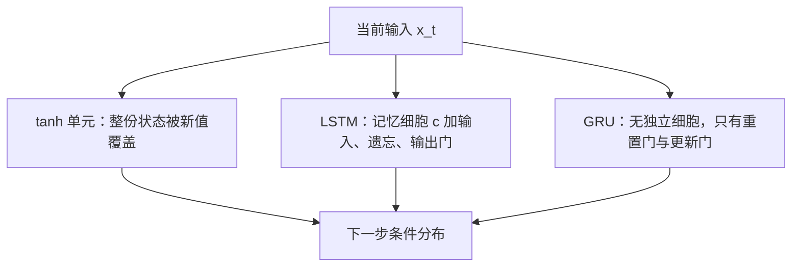

# 门控循环单元的经验对照：tanh、LSTM 与 GRU 谁更适合序列建模

<!-- release-date: 2014-12-11 -->

**本文依据**：`Empirical Evaluation of Gated Recurrent Neural Networks on Sequence Modeling`，arXiv:1412.3555v1 [cs.NE] 11 Dec 2014，letter，9 页。作者 Junyoung Chung、Caglar Gulcehre、KyungHyun Cho、Yoshua Bengio，Université de Montréal；Bengio 同时署 CIFAR Senior Fellow。封面未印会议名。文中数字均标 PDF 页码；标「外部补充」的段落不来自本文。GRU 由 Cho 等人 2014 提出，本文是对照实验，不是提出该单元的原文。

## 一句话

当时几乎所有序列上的成功，都不是用普通 tanh 循环单元拿到的，而是用带门的长短期记忆（Long Short-Term Memory，LSTM）一类结构。Cho 等人刚提出的门控循环单元（Gated Recurrent Unit，GRU）在机器翻译里看起来能和 LSTM 打平，但还没人在别的序列建模任务上把两者和 tanh 放在同一套参数预算下比过。这篇短文做的就是这件事：在多声部音乐与原始语音波形上，用大约相同的参数量训三种循环网络。结论很硬：门控单元整体优于 tanh；LSTM 与 GRU 谁更好，看数据集，给不出统一赢家（PDF p. 1、p. 6–7）。

它解决的不是「再发明一种门」，而是 **2014 年底那条经验空档：门控到底比传统循环单元强多少，以及两种门控彼此差在哪**。

## 一、矛盾：成功都靠门控，对照却几乎没有

循环网络能吃变长输入，因为隐状态每一步都依赖上一步（PDF p. 1–2）。当时机器翻译上，Sutskever 等人与 Bahdanau 等人已经把循环网络做到和成熟系统相当。作者点出一件观察：这些成功几乎都不是 vanilla 循环网，而是带复杂隐单元、尤其是 LSTM 的网（PDF p. 1）。

GRU 更晚，由 Cho 等人 2014 提出，当时主要用在机器翻译。LSTM 在长依赖任务上已经被认为可靠；GRU 是否在翻译以外也站得住，还没有系统对照（PDF p. 1）。

本文因此只评三类单元：LSTM、GRU，以及传统 tanh 单元。任务是序列建模，即学序列上的概率分布。数据是三套公开多声部音乐，外加育碧提供的两套内部原始语音（PDF p. 1）。引言里作者已经先写了一句实验后的判断：在固定参数量时，部分数据上 GRU 可以在 CPU 时间、参数更新次数和泛化上同时超过 LSTM（PDF p. 1）。后文表格会把这句话钉到具体数字上。

把三种单元先摊开（机制示意，根据 PDF p. 3 图 1 与第 3 节重画，不是实测时间轴）：

tanh 每一步把内容换成新值。LSTM 与 GRU 都选择性地留下旧内容、再加上新内容。全文的主矛盾就是：这条加法捷径值不值得，以及两种门控的差异会不会变成可复现的胜负。

## 二、生成式循环网在这篇里到底在学什么

给定序列 $x=(x_1,x_2,\ldots,x_T)$，隐状态按（PDF p. 2 式 1）

$$
h_t=
\begin{cases}
0, & t=0\\
\phi(h_{t-1},x_t), & \text{otherwise}
\end{cases}
$$

传统实现是（PDF p. 2 式 2）

$$
h_t=g(W x_t+U h_{t-1})
$$

$g$ 是有界光滑非线性，例如 logistic 或双曲正切。生成式循环网用当前 $h_t$ 给出下一个符号的条件分布，序列概率按链式法则拆开（PDF p. 2 式 3）。本文评的就是这类生成模型。

训练难处来自 Bengio 等人 1994：梯度多数时候消失、偶尔爆炸。长依赖被短依赖指数级盖住。作者区分两条路（PDF p. 2–3）：

1. 换学习算法，例如梯度裁剪、二阶方法。
2. 换激活本身，用门控造更复杂的循环单元。

本文走第二条。LSTM 是 Hochreiter 与 Schmidhuber 1997；GRU 是 Cho 等人 2014。两者都已在语音识别、机器翻译上表现出能抓长依赖（PDF p. 3）。

## 三、LSTM：这篇采用 Graves 2013 的实现

LSTM 最初由 Hochreiter 与 Schmidhuber 提出后改过多次。本文跟 Graves 2013 的写法（PDF p. 3）。每个第 $j$ 个单元在时刻 $t$ 维持记忆 $c^j_t$。激活是输出门调制后的细胞内容（PDF p. 3）：

$$
h^j_t=o^j_t\tanh(c^j_t)
$$

输出门（$\sigma$ 为 logistic，$\circ$ 为按元素乘；原文把 $V_o$ 写成对角阵）（PDF p. 3）：

$$
o^j_t=\sigma(W_o x_t+U_o h_{t-1}+V_o c_t)^j
$$

细胞按遗忘加写入更新（PDF p. 4 式 4）：

$$
c^j_t=f^j_t c^j_{t-1}+i^j_t\tilde{c}^j_t
$$

新内容、遗忘门、输入门（$V_f$、$V_i$ 同样是对角阵）（PDF p. 4）：

$$
\tilde{c}^j_t=\tanh(W_c x_t+U_c h_{t-1})^j
$$

$$
f^j_t=\sigma(W_f x_t+U_f h_{t-1}+V_f c_{t-1})^j
$$

$$
i^j_t=\sigma(W_i x_t+U_i h_{t-1}+V_i c_{t-1})^j
$$

相对式 2 那种每步覆盖，LSTM 可以决定要不要保住已有记忆。作者的直觉：早期若检出重要特征，门可以把「特征存在」带过很长一段（PDF p. 4）。图 1(a) 里 $i$、$f$、$o$ 是输入、遗忘、输出门，$c$ 与 $\tilde{c}$ 是细胞与新内容（PDF p. 3）。

**旧问题 → 新设计 → 机制 → 收益 → 代价。** 传统单元无法选择保留；LSTM 用三条门和一条细胞把读写拆开。代价是参数更多、每步计算更重，后面实验用「单元数更少、总参数对齐」来压住这个差异。

## 四、GRU：没有独立细胞，用更新门做线性插值

GRU 由 Cho 等人提出，目的是让每个单元自适应地抓不同时间尺度的依赖。同样有门，但没有单独记忆细胞（PDF p. 4）。激活是上一步激活与候选激活的线性插值（PDF p. 4 式 5）：

$$
h^j_t=(1-z^j_t)h^j_{t-1}+z^j_t\tilde{h}^j_t
$$

更新门决定改多少内容（PDF p. 4）：

$$
z^j_t=\sigma(W_z x_t+U_z h_{t-1})^j
$$

作者写明：线性混合旧状态与新状态这一点像 LSTM，但 GRU **没有**控制状态暴露程度的机制，每步把整份状态公开（PDF p. 4）。

候选激活按传统单元的样子写，并采用 Bahdanau 等人 2014 的形式（PDF p. 4）：

$$
\tilde{h}^j_t=\tanh\bigl(W x_t+U(r_t\circ h_{t-1})\bigr)^j
$$

$r_t$ 是重置门。$r^j_t$ 接近 0 时，单元表现得像在读序列的第一个符号，相当于忘掉先前状态（PDF p. 4–5）。重置门与更新门同形（PDF p. 5）：

$$
r^j_t=\sigma(W_r x_t+U_r h_{t-1})^j
$$

图 1(b) 里 $r$、$z$ 是重置与更新门，$h$ 与 $\tilde{h}$ 是激活与候选（PDF p. 3）。

脚注 1 很关键：本文对重置门的用法与 Cho 原文略有不同。原文候选是 $\tilde{h}^j_t=\tanh(W x_t+r_t\circ(U h_{t-1}))^j$。作者写：初步实验里两种写法表现相当（PDF p. 5）。式 5 后的候选公式因此是本文采用的变体，不是 Cho 2014 的逐字拷贝。

## 五、两种门到底像在哪、差在哪

从图 1 一眼能看出相似处。最突出的是从 $t$ 到 $t+1$ 的**加法更新**，传统单元没有这一项。传统单元总是用当前输入和上一步隐状态算出的新值覆盖内容；LSTM 与 GRU 则留下旧内容再往上加（式 4 与式 5）（PDF p. 5）。

加法有两层好处（PDF p. 5）：

1. 某个特征一旦被遗忘门（LSTM）或更新门（GRU）判定重要，就不会被覆盖，可以在很长一串步上保持「它还在」。
2. 加法造出绕过多步非线性的捷径。门接近饱和为 1 时，误差不必连乘一串有界非线性，消失梯度的难度下降（Hochreiter 1991；Bengio 等人 1994）。

差异同样具体（PDF p. 5）：

- LSTM 用输出门控制记忆暴露多少；GRU 每次公开全部内容。
- LSTM 算新记忆时，不单独控制从上一时刻流进来的量，而是用输入门**独立于**遗忘门，决定新内容加多少。GRU 在算候选时用重置门管上一时刻的信息流，但候选加进去的量不独立控制——它和更新门绑在一起。

只凭结构推不出谁更好。Bahdanau 等人 2014 在机器翻译的初步实验里认为两者相当，但那是不是别的任务也成立，正是本文要测的（PDF p. 5）。

可迁移：比较门控变体时，先对齐「加法捷径」和「暴露/写入是否解耦」这两条轴，再谈谁赢。不要只数门的个数。

## 六、实验设置：任务、数据与对齐参数量

### 6.1 任务与数据集

序列建模的目标是最大化训练序列的对数似然（PDF p. 5 第 4.1 节）。具体两项：多声部音乐建模、语音信号建模。

音乐用 Boulanger-Lewandowski 等人 2012 的数据。第 4.1 节正文先写「三套」，随即列出四套名字与维数：Nottingham、JSB Chorales、MuseData、Piano-midi，每个符号分别是 93、96、105、108 维二值向量。输出用 logistic sigmoid（PDF p. 5）。后文 Table 2 与分析都按四套报，本文跟表。

语音是育碧提供的两套内部数据。每条序列是一维原始音频。每一步网络看连续 20 个样本，预测随后 10 个样本。Ubisoft A 序列长 500，共 7230 条；Ubisoft B 序列长 8000，共 800 条。输出层是 20 个分量的高斯混合（PDF p. 5–6）。实现公开在 `https://github.com/jych/librnn.git`（PDF p. 6 脚注）。

### 6.2 模型规模：参数量对齐，故意做小

每个任务训三网：LSTM-RNN、GRU-RNN、tanh-RNN。公平比较的主约束是**参数量大致相同**。模型故意做小，以免过拟合把比较搅乱。这种「换隐单元、对齐参数」的做法，作者指向 Gulcehre 等人 2014（PDF p. 6）。规模见 Table 1（PDF p. 6）：

| 任务 | 单元 | 单元数 | 参数量（约） |
|---|---|---|---|
| 多声部音乐 | LSTM | 36 | $19.8\times 10^3$ |
| 多声部音乐 | GRU | 46 | $20.2\times 10^3$ |
| 多声部音乐 | tanh | 100 | $20.1\times 10^3$ |
| 语音信号 | LSTM | 195 | $169.1\times 10^3$ |
| 语音信号 | GRU | 227 | $168.9\times 10^3$ |
| 语音信号 | tanh | 400 | $168.4\times 10^3$ |

同一预算下，tanh 单元数最多，LSTM 最少。后面若 tanh 仍输，就不能用「它容量不够」来开脱。

### 6.3 训练配方

优化器用 RMSProp（Hinton 2012 的 Coursera 课）。权重噪声标准差固定为 0.075（Graves 2011）。每步若梯度范数大于 1，就缩放到 1（Pascanu 等人 2013），防爆炸。学习率（RMSProp 的标量乘数）从 10 个对数均匀候选里选，候选来自 $U(-12,-6)$（Bergstra 与 Bengio 2012），以验证集表现最大化为准。验证集同时做早停（PDF p. 6）。

原件没有写批大小、epoch 上限、初始化分布，也没有公开育碧语音的采样率或预处理。这些就是缺口。

## 七、结果：音乐上彼此接近，语音上大门控、小 tanh

Table 2 给出训练与测试集的平均负对数概率，越小越好。粗体是原文标出的该行测试最优（PDF p. 6）：

| 数据 | 划分 | tanh | GRU | LSTM |
|---|---|---|---|---|
| Nottingham | train | 3.22 | 2.79 | 3.08 |
| Nottingham | test | **3.13** | 3.23 | 3.20 |
| JSB Chorales | train | 8.82 | 6.94 | 8.15 |
| JSB Chorales | test | 9.10 | **8.54** | 8.67 |
| MuseData | train | 5.64 | 5.06 | 5.18 |
| MuseData | test | 6.23 | **5.99** | 6.23 |
| Piano-midi | train | 5.64 | 4.93 | 6.49 |
| Piano-midi | test | 9.03 | **8.82** | 9.03 |
| Ubisoft A | train | 6.29 | 2.31 | 1.44 |
| Ubisoft A | test | 6.44 | 3.59 | **2.70** |
| Ubisoft B | train | 7.61 | 0.38 | 0.80 |
| Ubisoft B | test | 7.62 | **0.88** | 1.26 |

作者自己的读法（PDF p. 6）：

- 音乐上，除 Nottingham 外 GRU-RNN 全面超过另外两个；但三套模型数字彼此接近。
- 语音上，两种门控明显超过 tanh。Ubisoft A 上 LSTM 最好（测试 2.70 对 GRU 的 3.59、tanh 的 6.44）；Ubisoft B 上 GRU 最好（测试 0.88 对 LSTM 的 1.26、tanh 的 7.62）。

Nottingham 是唯一测试上 tanh 最好的音乐集（3.13 对 GRU 3.23、LSTM 3.20）。差距很小，和「音乐上三者接近」一致，不要写成 tanh 全面翻盘。

学习曲线是 Fig. 2–3，取验证最好的那次运行。纵轴是负对数似然，对数坐标（PDF p. 7–8）。

- Fig. 2：Nottingham 与 MuseData。上排按迭代次数，下排按墙钟时间。音乐上 GRU-RNN 在更新次数和实际 CPU 时间上都进展更快（PDF p. 6–7）。
- Fig. 3：Ubisoft A 与 Ubisoft B。上排按 epoch，下排按墙钟。tanh 每步更便宜，但每步几乎不进展，最终停在差得多的水平（PDF p. 7）。

作者的判断：门控相对传统单元的优势清楚——收敛常更快，最终解常更好。LSTM 对 GRU 则**没有**结论性比较；选哪种门控可能高度依赖数据集和任务（PDF p. 7）。结论节把同一句话再说一遍：门控优于 tanh，在更难的原始语音上更明显；两种门控谁更好，做不出硬结论。实验被作者自己标成 preliminary；要拆开每个门的贡献，还需要更彻底的实验（PDF p. 7–8）。

致谢：数据与支持来自 Ubisoft；实现用 Theano 与 Pylearn2；经费与算力来自 NSERC、Calcul Québec、Compute Canada、Canada Research Chairs 与 CIFAR（PDF p. 8）。

## 八、这篇没有写什么

- 没有提出 GRU。提出者是 Cho 等人 2014（文中引用 `arXiv:1409.1259`）。
- 没有机器翻译主实验。翻译只作为动机和 Bahdanau 等人的前序观察。
- 没有层数、双向、注意力、beam search，也没有与 HMM 或 n-gram 的系统对比。
- 没有把 Table 2 的负对数概率换成比特每样本或听感指标。
- 曲线图是定性叙述，原文没有把「快多少倍」写成数字。

## 九、可迁移启发

1. **先对齐参数再比单元。** 门多的单元每个单元更贵。本文用更少 LSTM 单元、更多 tanh 单元把总参数钉在同一量级，比较才站得住。
2. **加法捷径比「几个门」更本质。** LSTM 与 GRU 共享「留下旧内容再加新内容」；这既保特征，又给反传开短路。
3. **任务难度会放大门控差距。** 音乐上三者接近；原始语音上 tanh 几乎学不动。单元选型要用最难的那条序列说话。
4. **两种门控不要预先封神。** 同一篇文章里 A 上 LSTM 赢、B 上 GRU 赢。选型应看成超参，用验证集选。
5. **实现细节要写清。** 重置门乘在 $h$ 上还是乘在 $Uh$ 上，本文脚注说初步实验相当，但仍单独写了。复现时不要混用两套公式还自称同一 GRU。

## 关键词回看

- **序列建模**：学 $p(x_1,\ldots,x_T)$，用隐状态给出下一步条件分布。
- **tanh 单元**：式 2 那种每步覆盖的传统循环单元。
- **LSTM**：带细胞与输入、遗忘、输出门；本文跟 Graves 2013，含对角 peephole。
- **GRU**：无独立细胞；更新门做插值，重置门管候选里的旧状态。
- **参数对齐**：Table 1 的比较纪律。
- **RMSProp + 梯度范数裁剪 + 权重噪声**：本文的训练配方。

## 参考资料

- 原件：`readings/_src/深度学习基石/GRU.pdf`，arXiv:1412.3555v1，2014-12-11。
- Cho 等人提出 GRU：文中引用 `On the properties of neural machine translation: Encoder-decoder approaches`，arXiv:1409.1259，2014。
- LSTM 原文：Hochreiter 与 Schmidhuber，*Neural Computation* 9(8)，1997。
- 本文 LSTM 实现：Graves，`Generating sequences with recurrent neural networks`，arXiv:1308.0850，2013。
- 音乐数据：Boulanger-Lewandowski、Bengio、Vincent，ICML 2012。
- 实现仓库（文中给出）：`https://github.com/jych/librnn.git`。
