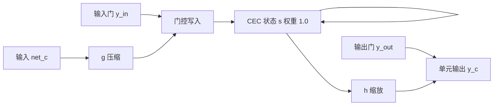

# LSTM：让误差在记忆单元里走常数流，而不是按时间指数死掉

<!-- release-date: 1997-11-15 -->

**本文依据**：`LONG SHORT-TERM MEMORY`，*Neural Computation* 9(8):1735–1780，1997，A4，32 页。作者 Sepp Hochreiter（Fakultät für Informatik，Technische Universität München）、Jürgen Schmidhuber（IDSIA，Lugano）。封面印有期刊卷期，无 arXiv 行，本文不补 arXiv 编号。首发日取该期正式出版日 1997-11-15。文中数字均标 PDF 页码；标「外部补充」的段落不来自本文。

## 一句话

循环网络原则上能用激活当短期记忆，但用随时间反传（Back-Propagation Through Time，BPTT）或实时循环学习（Real-Time Recurrent Learning，RTRL）时，误差要么爆炸、要么按权重规模指数衰减，长时延几乎学不会（PDF p. 1）。这篇论文的做法不是加大学习率或换更花的激活，而是造一种记忆单元：中间一条权重固定为 1 的线性自环，叫常数误差转盘（constant error carrousel，CEC）；再用乘法输入门、输出门决定何时写入、何时读出。截断那些会从单元里漏出去的梯度后，长程误差流保持常数。人工序列上最小时延可超过 1000 步，复杂度按时间步与权重是 $O(1)$，空间与时间都局部（PDF p. 1）。

它解决的不是「循环网能不能表示长依赖」——原则上能——而是 **1990 年代那套梯度算法为什么在长时延上实际失效，以及怎样用结构把误差流钉成常数**。

## 一、矛盾：短期记忆有了，误差却过不去

循环网用反馈连接把近期输入存成激活，相对权重里的长期记忆，这叫短期记忆。语音、非马尔可夫控制、作曲都可能用得上（PDF p. 1）。问题是：相关输入和教师信号之间的**最小时延**一长，当时最常用的 BPTT 与 RTRL 要么太慢，要么根本不工作。作者的判断很直：理论上好看，实践上并不明显强过带有限时间窗的前馈反传（PDF p. 1）。

误差「沿时间往回走」时只有两种病（Hochreiter 1991 的分析，本文第 3 节复述）：

1. **爆炸。** 权重振荡，学习不稳。
2. **消失。** 跨长时延的学习时间不可接受，或干脆学不成（PDF p. 1）。

LSTM（Long Short-Term Memory，长短期记忆）是一套架构加一套梯度算法。它要同时做到：即使输入不可压缩、有噪声，也能跨超过 1000 步；短时延能力不丢掉（PDF p. 1）。手段是：在特殊单元的内部状态上强制常数误差流；梯度在若干架构指定点截断——截断不伤长程流（PDF p. 2）。

读的时候不要带着后来的滤镜。这篇 **1997 年的单元没有遗忘门**。只有输入门与输出门。遗忘门是后作。

全景可以画成（机制示意，根据 PDF p. 7 图 1 重画，不是实测时间轴）：

误差一旦进入 CEC，中间不再按时间 lag 缩放；只有进门、出门各缩放一次。这是全文的主机制。

## 二、前人为什么都不够

第 2 节只谈**输入随时间变**的循环网，不谈平稳输入上的不动点梯度（PDF p. 2）。

- Elman（1988）、Fahlman 的 Recurrent Cascade-Correlation、Williams、Schmidhuber 1992a、Pearlmutter 以及其 1995 综述里的许多变体，都吃 BPTT / RTRL 同一类误差流问题（PDF p. 2）。
- 时延网（TDNN）、Plate 的加权旧激活、NARX，作者认为主要只适合短时延（PDF p. 2）。
- Mozer 的时间常数要外部细调才能撑长时延；Sun 等人把旧激活与当前净输入相加，净输入会扰动已存信息，长期存储不实用（PDF p. 2）。
- Ring（1993）在冲突误差时加高阶单元，跨 100 步可能要加 100 个单元，且不能泛化到未见过的时延长度（PDF p. 2）。
- Bengio 等人（1994）试过模拟退火、多重网格随机搜索、时间加权伪牛顿、离散误差传播；他们的 latch / 2-sequence 很像本文实验 3a、最小时延 100。Bengio 与 Frasconi 的 EM 在给定时刻只能处于 $n$ 个状态网络之一；加法这类连续问题会要不可接受的状态数（PDF p. 2–3）。
- Kalman 训练的循环网带「导数折扣因子」，过去动态导数指数衰减，作者认为没有理由指望它处理**非常长**的最小时延（PDF p. 2）。
- 二阶网里的乘法单元不是新闻。Watrous 与 Kuhn（1992）的差异是：不强制常数误差流、不为长时延设计；全连接二阶 sigma-pi；每步 $O(W^2)$，LSTM 是 $O(W)$（PDF p. 3）。
- **随机猜权重**能比 Bengio、Miller 与 Giles、Lin 等人论文里的算法更快解其中许多题。这不说明猜权重好，只说明那些题太简单。参数多或权重要高精度时，猜完全不可行（PDF p. 3）。
- Schmidhuber 的层次 chunker 能跨任意时延，但要求子序列上有局部可预测性；噪声一高、序列不可压缩，chunker 就垮。LSTM 不吃这一套（PDF p. 3）。

## 三、指数衰减从哪来

### 局部误差流

输出 $k$ 在时刻 $t$ 的目标记 $d_k(t)$。均方误差下，误差信号是（PDF p. 3）

$$
\vartheta_k(t)=f_k'(\mathrm{net}_k(t))\bigl(d_k(t)-y_k(t)\bigr),\qquad y_i(t)=f_i(\mathrm{net}_i(t)),\quad \mathrm{net}_i(t)=\sum_j w_{ij} y_j(t-1).
$$

非输出单元 $j$ 的反传误差是 $\vartheta_j(t)=f_j'(\mathrm{net}_j(t))\sum_i w_{ij}\vartheta_i(t+1)$，对 $w_{jl}$ 的贡献是 $\alpha\,\vartheta_j(t)y_l(t-1)$（PDF p. 3）。

从单元 $u$ 在 $t$ 的误差，往回走 $q$ 步到 $v$，缩放因子是一条路上激活导数与权重的乘积之和（PDF p. 3 式 1–2）。人话：

- 若每步 $|f' w|>1$，最大乘积随 $q$ **指数变大**，误差爆炸，冲突信号会让权重振荡（PDF p. 4）。
- 若每步 $|f' w|<1$，最大乘积随 $q$ **指数变小**，误差消失，可接受时间内学不到东西（PDF p. 4）。

逻辑 sigmoid 的 $f'$ 最大是 $0.25$。权重绝对值小于 $4.0$ 时（尤其训练初期），误差流倾向于消失。把初始权重加大帮不上：绝对值趋于无穷时，导数比权重大得更快；学习率加大也不改「长程流 / 短程流」的比。BPTT 对近期干扰过于敏感。Bengio 等人 1994 有类似、更晚的分析（PDF p. 4）。

局部分析立刻推出**全局**误差流也消失：对所有输出单元把上述偏导加起来（PDF p. 4）。再计入单元数 $n$，用相容矩阵范数，还能写出弱上界 $|\partial\vartheta_v(t-q)/\partial\vartheta_u(t)|\le n(f'_{\max}\|W\|)^q$。逻辑 sigmoid 且 $|w_{ij}|\le w_{\max}<4.0/n$ 时，得到指数衰减 $|\cdot|\le n(\zeta)^q$，$\zeta<1$（PDF p. 4–5）。大范数 $\|W\|$ 通常对应更小的 $F'$，实验也支持这一点（PDF p. 5）。

**旧问题钉死了：不是「循环网没有记忆」，而是误差沿时间的缩放由 $f'w$ 连乘决定，默认几乎总是消失。**

### 朴素常数流为什么也不够

单单元自连接要常数流，需要 $f_j'(\mathrm{net}_j(t))w_{jj}=1$（PDF p. 5）。积分后 $f_j$ 必须线性，激活必须恒定：$y_j(t+1)=y_j(t)$。实验里取 $f_j(x)=x$、$w_{jj}=1.0$。这就是 **CEC**（PDF p. 6）。它会成为 LSTM 的中心零件。

单元还连着别人，于是两场冲突（所有基于梯度的方法都有，长时延上特别刺眼）：

1. **输入权重冲突。** 同一个 $w_{ji}$ 既要在该存时打开 $j$，又要在无关输入到来时保护已存内容。线性单元上更新信号互相打架（PDF p. 6）。
2. **输出权重冲突。** 同一个 $w_{kj}$ 既要在该读时取出 $j$，又要在不该读时别扰动 $k$。短时延错误往往先被压下去；后来 $j$ 突然为了难学的长时延去「帮忙」，把已经稳住的短时延又搅乱（PDF p. 6）。

时延越长，要保护的时间越久，已经正确的输出也越多，两场冲突越重。朴素 CEC 只在局部编解码、输入不重复的简单题上还行（PDF p. 6）。

## 四、记忆单元：CEC 加上两扇乘法门

### 结构

在线性自环 $j$ 外包一层。乘法**输入门**保护已存内容不被无关输入改写；乘法**输出门**保护其他单元不被当前无关的记忆内容扰动。整包叫记忆单元 $c_j$（PDF p. 6，图 1）。

门与净输入：

$$
y_{\mathrm{out}_j}(t)=f_{\mathrm{out}_j}(\mathrm{net}_{\mathrm{out}_j}(t)),\quad
y_{\mathrm{in}_j}(t)=f_{\mathrm{in}_j}(\mathrm{net}_{\mathrm{in}_j}(t)),
$$

各 $\mathrm{net}$ 都是对上一时刻激活的加权和，下标可来自输入、门、记忆单元、普通隐单元。拓扑由使用者定（PDF p. 6–7）。

内部状态与输出（PDF p. 7）：

$$
s_{c_j}(0)=0,\qquad
s_{c_j}(t)=s_{c_j}(t-1)+y_{\mathrm{in}_j}(t)\,g\bigl(\mathrm{net}_{c_j}(t)\bigr)\quad(t>0),
$$

$$
y_{c_j}(t)=y_{\mathrm{out}_j}(t)\,h\bigl(s_{c_j}(t)\bigr).
$$

$g$ 压缩净输入，$h$ 从内部状态缩放到单元输出。自环权重 $1.0$，延迟 1 步，这就是 CEC。门打开或关闭通往 CEC 的通路（PDF p. 7）。

机制上：输入门控制通向 $w_{c_j i}$ 的误差流，输出门控制从输出连接出去的误差流。不同时刻经输出门流入的误差可以叠在 CEC 里；输出门要学会哪些误差该关进转盘，输入门要学会何时放误差出去（PDF p. 7–8）。

分布式输出通常需要输出门。不是两种门都永远必要：实验 2a、2b 可以只要输入门。局部输出编码时，防止扰动已学输出甚至可以把对应权重直接置零。即便如此，输出门仍有用：防止「很难的长时延记忆」去扰动「容易的短时延记忆」。实验 1 就是例子（PDF p. 8）。

### 拓扑、块、学习、复杂度

一层输入、一层隐、一层输出。隐层全自连接，装记忆单元和门；也可以再放普通隐单元给门和单元当输入。除门外，各层单元指向上一层（或所有更高层；实验 2a、2b）（PDF p. 8）。

$S$ 个单元共享同一对输入/输出门，叫大小为 $S$ 的**记忆单元块**。块便于分布式存储；门的个数仍是两个，有时比单单元还稍省。$S=1$ 就是单个记忆单元（PDF p. 8）。

学习是考虑门控乘法动力学的 RTRL 变体。为了内部状态上的误差不衰减，像截断 BPTT 那样：到达记忆单元净输入（$\mathrm{net}_{c_j}$、$\mathrm{net}_{\mathrm{in}_j}$、$\mathrm{net}_{\mathrm{out}_j}$）的误差**不再往更早时刻传**，只用来改进入权重。只有单元内部，误差才沿 $s_{c_j}$ 往回走。可视化：误差到单元输出后，先乘输出门和 $h'$，进入 CEC 后无限回流且不再缩放；经输入门和 $g$ 离开时再乘一次，改权重后截断（PDF p. 8）。

只需存、更新 $\partial s_{c_j}/\partial w_{il}$。每步更新复杂度 $O(W)$，与全连接网上的 BPTT 同阶，RTRL 差得多。与全 BPTT 不同，LSTM **空间局部、时间局部**：不必把整段序列激活压进可能无限的栈（PDF p. 8）。空间局部：每步每权重的更新复杂度不随网络变大；时间局部：存储不随序列变长。RTRL 时间局部但空间不局部；BPTT 相反（PDF p. 8 注 3）。

### 滥用与漂移

学习初期，不跨时间存信息也可能降误差，网络会把记忆单元当偏置用（激活钉死，出边当别人的自适应阈值），或两格存同一冗余内容。释放被滥用的单元可能很慢。两条对策：（1）顺序加单元：误差不再降时再加一个单元和一对门（实验 2）；（2）输出门负初始偏置，把初期单元输出推向 0，更负的偏置更晚「分配」出去（实验 1、3–6）（PDF p. 8–9）。

若 $c_j$ 的输入长期同号，内部状态会漂走，$h'(s_j)$ 变极小，梯度又消失。$h(x)=x$ 能躲漂移，但输出范围无界。作者的简单办法：输入门初期偏向 0。$h'$ 与 $y_{\mathrm{in}}$、$f'_{\mathrm{in}}$ 之间有折中，但输入门偏置的副作用比漂移小。逻辑 sigmoid 下，初始偏置不必细调（实验 4、5）（PDF p. 9）。

图 2 是 8 输入、4 输出、2 个大小为 2 的块的例子，也是实验 6a 的架构（省略非输入偏置）。截断规则下，误差只经到输出的连接、以及块内固定自环回流；一要离开单元或门就截断。所以图上那些可训练边，除指向输出外，都不把误差送回边的起点。这就是截断 LSTM 既省又还能跨很长时延的原因（PDF p. 9）。

## 五、实验：什么叫「真的长时延」

两条门槛（PDF p. 9–10）：

1. **所有训练序列**上，相关输入与教师信号的最小时延都要长。许多旧算法能从很短的训练串泛化到很长的测试串；真长时延题在训练集里没有短时延样本。Elman 流程、BPTT、离线/在线 RTRL 在这种题上「惨败」。
2. 题要复杂到随机猜权重不能很快解。作者发现不少旧长时延基准，猜权重比论文里的算法还快（例如 Bengio 与 Frasconi 的奇偶变体）。

实验 1 除外，都满足长最小时延。解在权重空间里稀疏：参数多或精度高，猜不可行。一律在线学习、逻辑 sigmoid。实验 1–2 初始权重 $[-0.2,0.2]$，其余 $[-0.1,0.1]$。除 1、2a、2b 外，序列在线随机生成，误差只在序列末出现，每条序列后激活清零（PDF p. 10）。

与梯度循环网对比时，结果主要给 RTRL；比较 2a 另加 BPTT。未截断 BPTT 与离线 RTRL 算的是同一梯度。长时延上，离线 RTRL、在线 RTRL、全 BPTT 几乎同样失败，因为都吃指数衰减（PDF p. 10）。

架构选得相当随意。不知道复杂度时，可以从一个记忆单元加起，或用顺序构造（PDF p. 10）。

### 实验 1：嵌入 Reber 文法（不是长时延题）

最小时延可以短到 9 步，所以**不是**长时延题。收它有两个理由：流行基准，至少要有一道 RTRL/BPTT 不完全失败的题；以及输出门确实有用（PDF p. 10–11）。

Reber 图沿边随机走（分叉概率 0.5）生成串。嵌入版是两份 Reber 文法嵌在更大的图里（PDF p. 11 图 3–4）。任务：一次读一个符号，持续预测下一符号；每步都有误差。要正确预测倒数第二个符号，必须记住第二个符号（PDF p. 12）。

对照：Elman 网（Cleeremans 等 1989）、RCC（Fahlman 1991）、RTRL（Smith 与 Zipser 1989，原文只列成功试验，且他们提高了短时延样本概率；LSTM 没这么做）（PDF p. 12）。

局部编解码，7 入 7 出。256 训练串、256 测试串。成功 = 训练与测试里每个位置，可能的下一符号对应的输出总是最活跃。LSTM：3 块×大小 2，或 4 块×大小 1，权重 276 与 264。$h$ 值域 $[-1,1]$，$g$ 值域 $[-2,2]$。输出门偏置初值 $-1,-2,-3$。学习率试过 0.1、0.2、0.5。3 对数据 × 10 组初始，表 1 是 30 次平均（PDF p. 12）。

表 1（PDF p. 13）：RTRL 3 隐、约 170 权重、学习率 0.05，「某一部分」成功，成功约 173000 次呈现；12 隐、约 494 权重、0.1，约 25000。ELM 15 隐、约 435 权重，成功率 0，大于 200000。RCC 7–9 隐、约 119–198 权重，成功率 50%，约 182000。LSTM 4×1、264、0.1：100%，39740；3×2、276、0.1：100%，21730；3×2、0.2：97%，14060；4×1、0.5：97%，9500；3×2、0.5：100%，8440。150 次里只有两次失败。即使忽略别人的失败试验，LSTM 也更快。最底行所需训练例在 3800–24100。没有输出门则学不快：先存第一个 T 或 P，不该扰动更容易学的原版 Reber 转移，这是输出门的工作（PDF p. 12–13）。

### 实验 2：干扰符号

**2a。** $p+1$ 个局部符号。训练集只有两条极像的序列：$(y,a_1,\ldots,a_{p-1},y)$ 与 $(x,a_1,\ldots,a_{p-1},x)$，各 0.5。要预测末元，必须把首元存 $p$ 步。对照 RTRL、BPTT、双网 Neural Sequence Chunker（CH）。权重 $[-0.2,0.2]$。算力上限 500 万次序列呈现。成功：训练后连续 10000 条随机序列上，所有输出最大绝对误差始终低于 0.25。LSTM 用一个记忆单元加输入门、无输出门；$g$ 逻辑 sigmoid，$h$ 恒等；误差不再降时再加单元（PDF p. 12–13）。

表 2，18 次平均（PDF p. 13）：RTRL、$p=4$、学习率 1.0 / 4.0 / 10.0，成功率 78% / 56% / 22%，成功约 1043000 / 892000 / 254000。$p=10$ 或 $100$，RTRL 与 BPTT（$p=100$，10404 权重）成功率 0，大于 500 万。CH、$p=100$、10506 权重、学习率 1.0：33%，32400。LSTM、$p=100$、10504 权重：100%，5040。层次 chunker 也能总是很快解这题（作者另文）；2a 仍有局部可压缩性（PDF p. 13）。

**2b。** 把确定子序列换成随机子序列，去掉可压缩性。只有首尾的 $x,y$ 完全可预测。架构同 2a。成功改为序列末误差低于 0.25。Chunker、BPTT、RTRL 失败。LSTM 总成功；$p=100$ 时 18 次平均 5680 次呈现（PDF p. 13–14）。

**2c。** 作者认为当时没有别的循环算法能解。$p+4$ 个符号，其中 $p$ 个干扰。序列从两类极像的集合抽：以 $b$ 开头，第二元是 $x$ 或 $y$，后面随机干扰，触发符 $e$ 之后再跟与第二元相同的 $x$ 或 $y$。期望长度 $q+14$。误差只在末尾。要预测末元，至少要把第二元存 $q+1$ 步。成功：连续 10000 条上两个输出预测误差始终低于 0.2。两个大小 1 的块，无其他隐单元，无偏置，$h\in[-1,1]$，$g\in[-2,2]$，学习率 0.01。最小时延就是 $q+1$，从不给短序列当拐杖（PDF p. 14）。

表 3，每对 $(p,q)$ 20 次平均（PDF p. 14）：

| $q$（时延 $-1$） | $p$（干扰符号数） | 权重 | 成功所需序列数 |
|---|---|---|---|
| 50 | 50 | 364 | 30000 |
| 100 | 100 | 664 | 31000 |
| 200 | 200 | 1264 | 33000 |
| 500 | 500 | 3064 | 38000 |
| 1000 | 1000 | 6064 | 49000 |
| 1000 | 500 | 3064 | 49000 |
| 1000 | 200 | 1264 | 75000 |
| 1000 | 100 | 664 | 135000 |
| 1000 | 50 | 364 | 203000 |

干扰符号数与时延成比例增加时，学习时间增加非常慢。RTRL/BPTT 看起来指数差，时延刚过 10 步就几乎没用。干扰出现频率升高会因权重振荡而变慢（PDF p. 14–15）。

### 实验 3：噪声与信号同一通道

**3a。** Bengio 等人 1994 的 2-sequence。一类一条通道。前 $N$ 个实值带类别信息，其后为均值 0、方差 0.2 的高斯。$N=1$：首元 $1.0$ 或 $-1.0$；$N=3$：前三元全是 $1.0$ 或 $-1.0$。末目标 $1.0$ 或 $0.0$。正确分类：末绝对误差低于 0.2。给定 $T$，长度在 $T$ 与 $T+T/10$ 间随机（Bengio 原文还允许短到 $T/2$）（PDF p. 15）。Bengio 等试过 7 种方法；随机猜权重轻易全赢，题太简单（PDF p. 15–16）。

LSTM：1 入 1 出，3 个大小 1 的块，102 权重，学习率 1.0。输入门偏置初值 $-1,-3,-5$，输出门 $-2,-4,-6$（符号以正文为准）。ST1：256 条测试无误分类；ST2：再加平均绝对误差低于 0.01，另用 2560 条看误分类率。10 次平均，表 4（PDF p. 16）：$T=100,N=3$，ST1 27380，ST2 39850，误分类 0.000195；$T=100,N=1$，58370 / 64330 / 0.000117；$T=1000,N=3$，446850 / 452460 / 0.000078。LSTM 能解，但远慢于猜权重。它只证明：信号和噪声在同一通道上，LSTM 没有原则性障碍（PDF p. 16）。

**3b。** 信息元上也加同样高斯。ST1 改为 256 条里误分类少于 6；ST2 再要求平均绝对误差低于 0.04。表 5（PDF p. 16）：$T=100,N=3$，41740 / 43250 / 0.00828；$T=100,N=1$，74950 / 78430 / 0.01500；$T=1000,N=1$，481060 / 485080 / 0.01207。

**3c。** 目标改为 0.2 与 0.8，目标上再加均值 0、方差 0.1（标准差 0.32）的高斯。要学条件期望。误分类：与无噪声目标差大于 0.1。可接受：与无噪声目标的平均绝对差低于 0.015。这要高精度权重，**不能**靠猜权重很快解。学习率 0.1。表 6，10 次平均（PDF p. 16）：$T=100,N=3$，269650 次，误分类 0.00558，与期望目标平均差 0.014；$T=100,N=1$，565640，0.00441，0.012。

### 实验 4：加法

作者认为这类题从未被其他循环算法解过。每个输入是一对：第一分量在 $[-1,1]$ 均匀，第二分量是标记 $1.0/0.0/-1.0$。序列末输出所有标记为 $1.0$ 的第一分量之和。长度在 $T$ 与 $T+T/10$ 间。恰好两个标记：先在前十对里标一个（$X_1$），再在前 $T/2-1$ 个未标对里标一个（$X_2$）。目标 $0.5+(X_1+X_2)/4.0$，映到 $[0,1]$。正确：末绝对误差低于 0.04（PDF p. 17）。

2 入 1 出，2 个大小 2 的块，93 权重。所有非输入带偏置，人为制造内部漂移。输入门偏置初值 $-3,-6$。学习率 0.5。停止：平均训练误差低于 0.01，且最近 2000 条都正确。2560 测试上平均误差总低于 0.01，错误从不超过 3 条。表 7，10 次平均（PDF p. 18）：$T=100$（最小时延 50），2560 里 1 条错，74000 次；$T=500$（250），0 错，209000；$T=1000$（500），1 错，853000。$T=1000$ 时所需训练例在 370000–2020000，只有 3 次超过 700000。结论：分布式表示、连续值运算、长时间精确存储，没有显著有害漂移（PDF p. 18）。

### 实验 5：乘法

有人会说加法占了 CEC 自带积分的便宜。把目标改成乘积 $X_1\cdot X_2$，第一分量改在 $[0,1]$。学习率 0.1。在最近 2000 条里误差 $>0.04$ 的条数少于 $n_{\mathrm{seq}}$ 时测两次：$n_{\mathrm{seq}}=140$ 够学会存储，$n_{\mathrm{seq}}=13$ 才微调输出。表 8，$T=100$、最小时延 50、93 权重，10 次平均（PDF p. 18）：$n_{\mathrm{seq}}=140$，2560 里 139 条错，MSE 0.0223，482000 次；$n_{\mathrm{seq}}=13$，14 条错，MSE 0.0139，1273000 次。$n_{\mathrm{seq}}=140$（13）时测试平均误差总低于 0.026（0.013），错误从不超过 170（15）。LSTM 也能做非积分的连续值计算（PDF p. 18–19）。

### 实验 6：时间顺序

**6a。** 局部编码。以 $E$ 始、$B$ 终（触发符），其余从 $\{a,b,c,d\}$ 随机，但位置 $t_1\in[10,20]$、$t_2\in[50,60]$ 是 $X$ 或 $Y$。长度 100–110。四类由 $(X,Y)$ 的顺序决定：$XX\to Q$，$XY\to R$，$YX\to S$，$YY\to U$（PDF p. 19）。

**6b。** 三个相关位置 $t_1,t_2,t_3$，八类。长度仍 100–110。误差只在末尾。正确：所有输出末绝对误差低于 0.3（PDF p. 19）。

6a：8 入、2 块×大小 2、4 出、156 权重，学习率 0.5。6b：3 块、8 出、308 权重，学习率 0.1。输入门偏置 $-2,-4$（6b 再加 $-6$）。停止：平均训练误差低于 0.1，且最近 2000 条分类正确。2560 测试平均误差总低于 0.1，错误从不超过 3。表 9：6a 为 20 次平均，2560 里 1 条错，31390 次；6b 为 10 次平均，2 条错，571100 次。6a 里第一与第二相关输入、第二相关输入与序列末，间隔至少 30 步（PDF p. 19–20）。

典型解：一块存第一个 $X/Y$，第二块存第二个；或只用一块，第二次开门时按已存内容改状态。一类解走「单元输出 → 输入门」；另一类走强正的「单元输出 → 单元输入」，用内部状态正负区分 $(X,Y)$ 与 $(Y,X)$（PDF p. 20）。

第 5.7 节用表 10–11 汇总超参、连接方式、停止与成功判据，实验 2a/2b 因历史原因与其余略有差别（PDF p. 20–22）。正文公式与实验设定以第 4–5 节为准；表 10 末行对 $h,g$ 值域的排版与正文不完全一致。

## 六、限制、好处、附录在证明什么

### 限制（PDF p. 22）

- **截断版**不容易解「强延迟 XOR」：噪声序列里两个隔很远的输入做 XOR。只存其中一个不降期望误差，不能靠先解子目标增量降误差。理论上可用全梯度（也许再加从记忆单元读的普通隐单元），作者**不推荐**：复杂度升；只能对截断 LSTM 证明 CEC 上的常数流；他们试过未截断，与截断无显著差别，因为 CEC 外误差仍很快消失。全 BPTT 也不强过截断 BPTT。
- 每块要两个额外单元。相对标准循环网，权重增加不超过 9 倍：一个常规隐单元最多换成 3 个 LSTM 单元，全连接时权重因子 $3^2$。实验里 LSTM 与对照的权重数量相当。
- 因为 CEC 常数流，LSTM 会碰到「前馈网一次看完整串」同类的问题。例如 500 步奇偶：小初始化的截断 LSTM 解不了、猜权重却很快，就像 500 输入的前馈网做 500 bit 奇偶。这也正是它在大搜索空间的非平凡题上明显强过前人的原因。
- 「新近性」上不比别的梯度法多出额外问题。但梯度法都难以**精确数**离散步。若 99 步与 100 步必须分开，需要额外计数。3 步与 11 步这类较粗的差别，LSTM 没问题：单元输出到输入的负连接可以加重近输入、在需要时学衰减。

### 好处（PDF p. 22–23）

- 很长时延可跨。
- 能处理噪声、分布式表示、连续值；不必像有限状态机或 HMM 预先选有限状态数，原则上状态数不限。
- 相关输入的位置不固定也能泛化；能区分同一元素在序列里两次相隔很远的出现，不依赖短时延训练样本。
- 学习率、门偏置等不必细调。大学习率会把输出门推向 0，自动抵消自己的副作用。
- 每权重每时间步更新本质是 $O(1)$，与 BPTT 相当，远好于 RTRL；又比全 BPTT 更占空间与时间局部。

结论重述：截断掉试图漏出单元的误差后，CEC 保证常数流；两扇乘法门学习开关。输入门挡无关输入，输出门挡无关记忆（PDF p. 23）。未来工作打算用到真实数据：时间序列预测、作曲、语音；也想给 sequence chunker 配上 LSTM（PDF p. 23）。致谢 DFG 基金 SCHM 942/3-1（PDF p. 23）。

### 附录：前向、截断、复杂度、误差流公式

A.1 给出实验用的门 sigmoid（值域 $[0,1]$）、$h$（$[-1,1]$）、$g$（$[-2,2]$）的显式式，以及隐单元、两扇门、块内第 $v$ 个单元、输出单元的前向式（PDF p. 23–24）。截断把 $\partial\mathrm{net}_{\mathrm{in}}/\partial y_u(t-1)$ 等换成 0，避免「从输入门漏出的误差再经输出门钻回来」，从而保住 CEC 常数流（PDF p. 24）。反向只需式 (19)–(23)、(25)–(28)。更新复杂度

$$
O(KH+KCS+HI+CSI)=O(W)
$$

（PDF p. 27 式 29）。每步只需存最近 $2CSI$ 个 $\partial s/\partial w$，存储也是 $O(W)$，不随序列长度变（PDF p. 27–28）。

A.2 把误差在单元内走 $q$ 步的缩放写出来：只在进入（时刻 $t$，输出门与 $h'$）和离开（时刻 $t-q$，输入门与 $g'$）时缩放，中间因子因截断而为 1（PDF p. 28–29）。外部连接不把到达单元输出的误差送回其他单元（PDF p. 29）。输出门压低「早期不用记忆也能降」的误差，以及后期突然启用记忆时对已稳住输出的扰动；大 $|s|$ 会让 $h'$ 变小（漂移），用输入门负偏置对抗；输入门负偏置本身也会缩小 $y_{\mathrm{in}}$ 与 $f'_{\mathrm{in}}$，但相对漂移是次要的。这些因子可能缩小总流，但**不依赖时延长度**，仍远强于无记忆单元时阶为 $q$ 的指数衰减（PDF p. 29–30）。

## 七、这篇没写什么

没有真实语音或金融数据实验，只有人工序列。没有遗忘门、没有 peephole 的系统实验、没有把 LSTM 嵌进当时的语音识别流水线。没有 GPU、没有 batch、没有与后来 GRU 的比较。比较对象是 RTRL、BPTT、Elman 流程、RCC、Neural Sequence Chunker，按 PDF 陈述，不是按后来教科书里的「LSTM vs Transformer」。

封面与页眉只印 *Neural Computation* 1997，不印 NeurIPS / ICML。参考文献里另有一篇 1997 年的 NIPS 短文 `LSTM can solve hard long time lag problems`，那是另一份材料，不是本 PDF 的录用行。

## 可迁移启发

1. **先问误差流，再问表达力。** 循环结构「能存」不等于梯度「能到」。自己的时序模型若跨很多步，先检查 $f'w$ 连乘，不要只加层。
2. **把必须走得远的那条路径做成乘数为 1 的线性通路，再单独学开关。** CEC + 门比「把所有权重都做成可学的长时延」更干净。今日残差、线性注意力里的恒等捷径，是同一类想法，不是同一篇论文的权利要求。
3. **截断可以是功能，不是只为省内存。** 这里截断是为了禁止误差绕出门再钻回来，从而保住常数流。乱截会把任务变成不可分解的 XOR。
4. **基准要检查猜权重。** 长时延题如果猜权重就能赢，说明搜索空间不够，算法对比无意义。
5. **门的偏置是资源分配。** 负的输出门偏置等于「先别用记忆」；负的输入门偏置等于「先别写，防漂」。比把学习率调到神更稳。
6. **不要把积分能力当成唯一技能。** 乘法实验是作者给自己的压力测试：CEC 会加，不保证会乘。

## 关键词回看

- **短期记忆 / 长期记忆**：激活 vs 权重。
- **BPTT / RTRL**：沿时间反传 vs 实时递推梯度；长时延上都指数病。
- **CEC**：权重 1 的线性自环，误差中间不缩放。
- **输入门 / 输出门**：乘法开关，解写入冲突与读出冲突。
- **记忆单元块**：共享门的一组 CEC。
- **截断梯度**：误差一离开单元或门就停，空间时间都局部，$O(W)$。
- **最小时延**：训练集里相关输入到教师的最短间隔；没有短样本当拐杖才算真长时延题。

## 参考资料

- 原件：`readings/_src/深度学习基石/LSTM.pdf`（*Neural Computation* 9(8)，1997）。
- 分析来源：Hochreiter 1991 学位论文（本文第 3 节复述，PDF p. 3）。
- 技术报告前作：Hochreiter and Schmidhuber 1995，FKI-207-95（PDF p. 30）。
