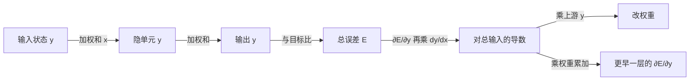

# 误差反传：隐层表征终于能跟输出误差一起学

<!-- release-date: 1986-10-09 -->

**本文依据**：`Learning representations by back-propagating errors`，*Nature* VOL 323，9 October 1986，LETTERS TO NATURE，第 533–536 页（盘上扫描件 4 页）。作者 David E. Rumelhart、Geoffrey E. Hinton、Ronald J. Williams。第一作者与 Williams 署 Institute for Cognitive Science, C-015, University of California, San Diego；Hinton 署 Department of Computer Science, Carnegie-Mellon University, Pittsburgh。通讯作者为 Hinton。Received 1 May；accepted 31 July 1986（PDF p. 4，Nature p. 536）。封面未印会议名，也无 arXiv 编号。文中数字均标 PDF 页码；Nature 页码与 PDF 页一一对应（533–536）。标「外部补充」的段落不来自本文。

## 一句话

感知机只能学输入到输出的直接连线。中间层一旦没有「该怎么开」的教师信号，表征就学不成。这篇 Nature 短讯给出一条局部、可并行的规则：先把输出误差对每个单元总输入求导，再沿连接把误差乘回去。隐单元因此能自己长出对任务有用的内部特征。同一套规则既能训前馈层叠网，也能在加两条约束后训迭代网。

它解决的不是「发明一种新网络」，而是当时最硬的那块：**多层类神经元网络里，隐层表征怎么靠梯度从任务误差里长出来**。

## 一、矛盾：有隐层才有表征，但没有教师

作者把单元想成类神经元：每个单元 $j$ 先对输入做加权和，再经非线性挤到 $0$–$1$ 之间（PDF p. 1，Nature p. 533 式 1、式 2）：

$$
y_j = \frac{1}{1+e^{-x_j}}
$$

$$
x_j = \sum_i y_i w_{ji}
$$

$y_i$ 是上游单元的状态，$w_{ji}$ 是从 $i$ 到 $j$ 的权重。偏置做成永远为 $1$ 的额外输入。因为 logistic 处处可微，误差对权重的导数处处存在，这是后面整条链能走通的前提。

旧办法卡在两处（PDF p. 1）。

第一，感知机一类规则只改输入到输出的直接权重。任务若必须靠输入的非线性组合才能解，单层不够。

第二，多层网中间那些单元没有「该输出多少」的教师。Rosenblatt 的感知机、Minsky 与 Papert 对感知机极限的分析，都把「中间层怎么学」留成空档。作者点名：已有不少自组织网的尝试，但还没有人给出一种有效办法，让任意连接的网络为特定任务发展出合适的内部表征。

所以这篇短讯要同时做三件事：给出一条对任意层叠网都成立的误差反传规则；用镜像对称检测和家族树证明隐单元真的会学出有用特征；再把同一规则映射到迭代网，说明它不绑死在前馈层叠上。

把流水线画成人能跟住的形状（机制示意，根据 PDF p. 1–2 式 1–7 重画，不是实测时间轴）：

前向：状态从输入走到输出。反向：误差从输出走回每一条权重。两条路用的是同一张连接图，只是方向相反。

## 二、总误差怎么变成每条权重的改动量

### 要最小化什么

给定一组输入–输出对。总误差是所有案例、所有输出单元上，实际状态与期望状态之差的平方和的一半（PDF p. 2，Nature p. 534 式 3）：

$$
E = \frac{1}{2}\sum_c\sum_j (y_{j,c}-d_{j,c})^2
$$

$c$ 标案例，$j$ 标输出单元。目标是改权重，让 $E$ 下降。

### 输出层：误差就是「差了多少」再乘斜率

对某一个案例，先看输出单元 $j$。误差对输出状态的偏导就是它跟目标的差（PDF p. 2 式 4）：

$$
\frac{\partial E}{\partial y_j} = y_j - d_j
$$

logistic 的斜率是 $y_j(1-y_j)$。链式法则把「对状态的导数」变成「对总输入的导数」（PDF p. 2 式 5）：

$$
\frac{\partial E}{\partial x_j} = \frac{\partial E}{\partial y_j}\cdot\frac{dy_j}{dx_j}
$$

权重 $w_{ji}$ 只通过 $x_j$ 影响误差，而 $\partial x_j/\partial w_{ji}=y_i$。所以（PDF p. 2 式 6）：

$$
\frac{\partial E}{\partial w_{ji}} = \frac{\partial E}{\partial x_j}\cdot y_i
$$

人话：这条连接该不该加强，等于「下游单元有多需要改总输入」乘「上游现在开得有多亮」。上游是关的，这条权重再怎么拧也不影响当前前向计算。

### 隐层：把下游的需求加总回来

隐单元没有 $d_j$。它的状态通过所有从它出发的连接影响后面。作者利用 $\partial x_j/\partial y_i=w_{ji}$，把所有下游 $j$ 的贡献加起来（PDF p. 2–3，Nature p. 534–535 式 7）：

$$
\frac{\partial E}{\partial y_i} = \sum_j \frac{\partial E}{\partial x_j}\,w_{ji}
$$

有了 $\partial E/\partial y_i$，式 5、式 6 原样再用一遍，就能改更早一层的权重。这就是「反传」：同一套局部运算从最后一层往前扫。作者强调两点好处（PDF p. 3）。

1. **不必为每条权重单独开一块存导数的内存。** 他们实际用的方案是：把所有输入–输出案例上的 $\partial E/\partial w$ 累加完，再改权重。
2. **最简单的下降是每条权重走一步与累计梯度成比例的更新**（PDF p. 3 式 8）：

$$
\Delta w = -\varepsilon\frac{\partial E}{\partial w}
$$

$\varepsilon$ 是步长。它不如用二阶导数的方法收敛得快，但局部、简单，也容易在并行硬件上做。加上动量以后，当前梯度改的是权重变化的**速度**而不是位置本身（PDF p. 3 式 9）：

$$
\Delta w(t) = -\varepsilon\frac{\partial E}{\partial w}(t)+\alpha\Delta w(t-1)
$$

$t$ 每扫完整组输入–输出对加一。$\alpha$ 在 $0$ 与 $1$ 之间，控制当前梯度与更早梯度各占多少。为打破对称性，权重从小随机值起步。作者写明：David Parker（私人通信）与 Yann Le Cun 独立发现过变体。

**旧问题到这里钉死了：隐单元没有教师，但只要非线性可微，输出误差可以沿连接乘回去，隐层就有了自己的 $\partial E/\partial y$。**

## 三、镜像对称：隐单元必须自己发明「左右是否互为镜像」

不能只把输入接到输出。要判断一维输入阵列的二值活动是否关于中点对称，单个输入单元的活动看不出对称，把两边证据直接加总也不够（PDF p. 3，Nature p. 535）。作者引用更形式的证明：中间单元是必需的。

他们用的网就是图 1：隐层再接到输出，学完后连接上标了权重、方框里是隐单元偏置（PDF p. 2 图 1）。图 2 把两个隐单元的决策区画出来，每条线旁标该单元偏置（PDF p. 2 图 2）。

训练数字（PDF p. 2 图 1 图注）：$ε=0.1$、$α=0.9$，扫完整组 **64** 种可能输入向量 **1,425** 遍。学完后权重都在 **-0.3 到 0.3**。

收益：隐单元学到的不是输入的复印件，而是任务真正要的关系——活动模式是否关于中点对称。代价：必须用隐层；没有隐层，这条几何切分根本画不出来。

## 四、家族树：隐层抓住「族、代、国籍」，所以能补没见过的三元组

图 3 是两棵同构的家族树（意大利一支、英国一支），关系包括父亲、母亲、丈夫、妻子、儿子、女儿、叔叔、姑妈等（PDF p. 2 图 3）。任务：给「人 1 + 关系」，说出「人 2」。代表人的输入有 **24** 个单元；第二层 **6** 个隐单元读这些输入。一共 **104** 个可能三元组，网络在 **100** 个上训练（PDF p. 3）。

图 4 画出这些隐单元的感受野：白矩形是兴奋，黑矩形是抑制，面积是幅度。每个单元图里右侧 **12** 个输入代表英国人（PDF p. 3 图 4）。作者读出的内部特征包括：

- 单元 1 主要管英国人还是意大利人；
- 单元 2 管属于哪一代；
- 单元 6 管属于哪一房。

这些特征在输入、输出编码里并不显式出现。网络把两族同构用上了：英国人的内部码跟对应意大利人很像，所以可以从一棵树推到另一棵。对训练时没见过的四个三元组，泛化是对的（PDF p. 3）。

训练数字（PDF p. 3）：一共扫 **1500** 遍。前 **20** 遍 ε=0.005、α=0.5，其余 ε=0.01、α=0.9。为了读权重，每次改权后把每个权重衰减 **0.2%**（weight-decay）。学很久之后，权重最终幅度本身就能说明它还管不管降误差。为避免网络靠「把输出拧到 $1$ 或 $0$」来堆大权重，他们把误差判零的标准放宽：该开的输出活动高于 **0.8**、该关的低于 **0.2** 即视为对。

可迁移的不是「家族树」这个玩具，而是：一旦隐层必须压缩许多输入–输出对里反复出现的结构，它就会长出对任务域稳定的轴。那些轴比原始独热码更适合拿去泛化。

## 五、同一规则也能训迭代网，不只是层叠前馈

到此为止都是分层、前馈、跑一轮就停的网。图 5 把「跑三步的同步迭代网」展开成等价的层叠网：迭代网里的一个时间步，对应层叠网里的一层（PDF p. 3 图 5）。

映射有两个麻烦（PDF p. 3）。

1. 层叠网里，中间层在前向时的输出必须存下来，反传才用得上（见式 5、式 6）。所以迭代网需要一块普通的记忆，记下每个单元的输出历史。
2. 层叠网要等价于迭代网，不同层之间**对应位置的权重必须相同**。做法是：把同一组对应权重上的 $\partial E/\partial w$ 先平均，再让集合里每条权重都按这个平均梯度改。

加上这两条，反传可以直接用在迭代搜索，或用来学序列结构。作者指向他们自己编的 *Parallel Distributed Processing* 卷一里的后续讨论（PDF p. 3）。

**注意边界：这里的「迭代网」是把同一张图按时间展开再权共享，不是后来带门控的长程序列模型。** 正文没有 LSTM，没有 BPTT 这个名字，也没有梯度消失的定量分析。

## 六、作者自己划的边界

最明显的缺点：误差面可以有局部极小，梯度下降不保证找到全局最小（PDF p. 3）。作者的经验判断是：任务很多、路径也很多时，网络极少卡在显著差于全局最小的差局部极小；他们只在「连接刚好够用」的网上见过这种讨厌行为。多加几条连接，等于在权重空间里多几个维度，这些维度提供绕过低维子空间里那圈屏障的路（PDF p. 3）。

这篇短讯**没有**给出：大规模分类数字、与当时其他学习规则的系统对照表、硬件实现、也没有把反当大脑学习的模型。作者写得很直：以目前形式，这套程序**不是**大脑学习的可信模型；它只说明，有趣的内部表征**可以**靠权重空间里的梯度下降做出来，因此值得继续找更生物可信的梯度下降实现（PDF p. 4，Nature p. 536）。

致谢：System Development Foundation 与 Office of Naval Research（PDF p. 4）。参考文献五条：Rosenblatt 1961、Minsky & Papert 1969、Le Cun 1985、以及他们自己 1986 年的 PDP 章节（PDF p. 4）。同一页下半栏起是另一封信（Murphy & Mitchell 关于小猫反转遮盖后的双眼弱视），不属于本文。

## 七、可迁移启发

1. **教师只需要在你真正关心的那一层。** 隐层不必有目标向量；只要前向可微，误差可以乘着权重走回去。今天任何中间表征（注意力头、瓶颈、适配器）都可以先问：输出损失对它的导数是否走得通，而不是先问有没有一层一层的标注。
2. **局部规则才能并行。** 式 6、式 7 每个单元只用自己的斜率、自己的下游权重和上游状态。作者已经把「不必为每条权重单开导数内存」和「可在并行硬件上做」写成设计理由，不是事后附会。
3. **权共享是把时间步当成层。** 图 5 的两条约束（存历史、对应权重平均梯度）就是后来展开循环网的骨架。若你的模块在多个位置或多个时刻复用同一组参数，反传时先把各处梯度加总（或平均）再更新，而不是让副本各改各的。
4. **weight-decay 首先是为了可读，其次才是正则。** 家族树实验里 0.2% 每步衰减，是为了让权重大小本身成为「还管不管误差」的指示剂。若你要解释隐单元在干什么，先让无用权重缩回去，再读图。
5. **多一条连接有时是在给优化开路，不是在加容量炫耀。** 作者把多余连接解释成绕开局部极小的额外维度。过参数化后来有别的理论，但 1986 年这条经验已经写在 Nature 信里：刚好够用的网最容易卡死。

## 关键词回看

- **反传（back-propagation）**：输出误差对每个单元总输入求导后，沿连接乘回上游，从而得到每条权重的 $\partial E/\partial w$。
- **隐单元（hidden unit）**：不直接给出教师信号的中间单元；其「该怎么开」由下游误差反推。
- **Delta 规则的多层推广**：输出层的 $\partial E/\partial y=y-d$ 就是经典 delta；隐层用式 7 把 delta 送回去。
- **动量 $\alpha$**：更新改的是权重变化的速度，把当前梯度与上一次更新做指数衰减混合。
- **迭代网展开**：一个时间步当一层；对应权重必须共享，故梯度先对副本平均。

## 参考资料

- 原信：Rumelhart, D. E., Hinton, G. E. & Williams, R. J. Learning representations by back-propagating errors. *Nature* **323**, 533–536 (9 October 1986)。盘上扫描件 4 页。
- 文内引用但不展开：Rosenblatt *Principles of Neurodynamics*（1961）；Minsky & Papert *Perceptrons*（1969）；Le Cun, *Proc. Cognitiva 85*（1985）；Rumelhart, Hinton & Williams 在 *Parallel Distributed Processing* Vol. 1 第 318–362 页的章节（1986）。
