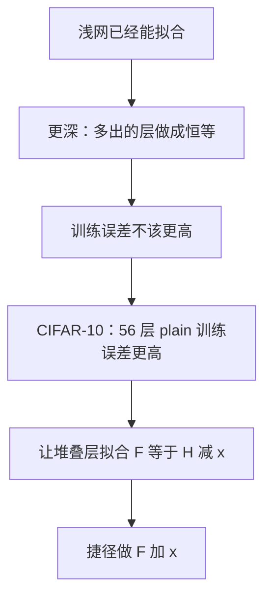

# ResNet：先把更深写成更高训练误差，再用恒等捷径把残差推回去

<!-- release-date: 2015-12-10 -->

**本文依据**：`Deep Residual Learning for Image Recognition`，arXiv:1512.03385v1 [cs.CV] 10 Dec 2015，letter，12 页。作者 Kaiming He、Xiangyu Zhang、Shaoqing Ren、Jian Sun，均署 Microsoft Research。封面页眉印该 arXiv 行，未印会议名。文中数字均标 PDF 页码；标「外部补充」的段落不来自本文。

## 一句话

更深的网络本该更容易拟合训练集：浅网的解可以嵌进深网——多出来的层做成恒等映射即可。可是把「普通」卷积一层层叠上去，训练误差反而升。封面图 1 把这件事钉在 CIFAR-10 上：56 层 plain 网的训练误差和测试误差都高于 20 层 plain 网（PDF p. 1）。这篇把要拟合的映射改写成残差 $F(x):=H(x)-x$，用捷径把 $F(x)+x$ 加回去。ImageNet 上残差网可以堆到 152 层，仍比 VGG 便宜；六模型集成在测试集 top-5 错误率 3.57%，拿下 ILSVRC 2015 分类第一（PDF p. 1、p. 6）。CIFAR-10 上他们还训过 110 层与超过 1000 层的网（PDF p. 1、p. 7–8）。

它解决的不是「再加深一层卷积」，而是 **2015 年那条已经能收敛、却训不准的路：梯度消失大体被初始化与 Batch Normalization 压住之后，更深的 plain 网仍会退化。**

## 一、封面实验：CIFAR-10 上 56 层比 20 层更难拟合

深度当时已经被当成视觉识别的关键。ImageNet 上领先结果都在用「很深」的模型，大约十六层到三十层（PDF p. 1）。作者问的是：学更好的网，是不是只要继续叠层？

梯度消失/爆炸曾经让训练一开始就垮。归一化初始化与中间归一化层已经能让几十层的网用 SGD 加反向传播开始收敛（PDF p. 1）。能收敛之后，另一件事露出来：**退化（degradation）**。深度增加，精度先饱和，然后迅速变差。这不是过拟合：给已经够深的模型再加层，训练误差会更高。图 1 是典型例子（PDF p. 1）。

图 1 左是训练误差、右是测试误差，数据是 CIFAR-10，对比 20 层与 56 层 **plain** 网（没有残差捷径）。更深的那条曲线全程更高。作者写：ImageNet 上类似现象见图 4（PDF p. 1）。

构造解说明这件事不该发生。取一座浅网，再往上加层。加出来的层做成恒等，其余层从已训好的浅网拷过来，更深的模型训练误差不该更高。实验却表明：手头的求解器找不到与这条构造解相当、或更好的解，至少在可接受时间内找不到（PDF p. 1–2）。

于是贡献钉成残差学习：不要指望几层堆叠直接拟合目标映射 $H(x)$，明确让它们拟合残差 $F(x):=H(x)-x$，原映射改写成 $F(x)+x$。极端情况若恒等最优，把残差推到零，应比用一叠非线性层去拟合恒等更容易（PDF p. 2）。

$F(x)+x$ 用前馈网的捷径连接实现，见图 2。捷径跳过一层或多层；这里捷径就是恒等，输出与堆叠层的输出逐元素相加。恒等捷径不加参数、不加计算量。整网仍可用 SGD 与反向传播端到端训，用 Caffe 一类库即可，不必改求解器（PDF p. 2）。

把因果链摊开（机制示意，根据 PDF p. 1 图 1 与 p. 2 图 2 重画，不是实测时间轴）：

相关工作里，VLAD / Fisher Vector、多重网格与层次基预处理都在编码或求解残差；捷径本身也有很长历史。同期 Highway Network 用带参数、依赖数据的门控捷径；门关掉时那些层就不再是残差函数。本文的恒等捷径从不关闭，信息始终穿过，额外只学残差。Highway 也尚未展示超过 100 层时精度仍随深度涨（PDF p. 2）。

## 二、残差块：$y=F(x,\{W_i\})+x$

对若干堆叠层（不必是整网）要拟合的映射记为 $H(x)$，$x$ 是这些层的输入。若承认多层非线性可以渐近逼近复杂函数，也就等于承认它们可以逼近残差 $H(x)-x$（输入输出同维时）。两边理论上都能逼近，难易可能不同（PDF p. 3）。

退化现象暗示：求解器用多层非线性去逼近恒等会吃力。改成残差后，若恒等最优，求解器可以把那些非线性层的权重推向零。真实情况里恒等未必最优，但若最优函数离恒等比离零更近，相对恒等学扰动应比从头学一个新函数更容易。后文图 7 会显示学到的残差响应整体偏小（PDF p. 3）。

本文采用的基本块是（PDF p. 3 式 1）

$$
y=F(x,\{W_i\})+x
$$

图 2 那种两层例子里，$F=W_2\sigma(W_1 x)$，$\sigma$ 是 ReLU，偏置省略。$F+x$ 由捷径与逐元素加法完成。加法之后再做一次非线性，即 $\sigma(y)$（PDF p. 3）。

捷径既不加参数也不加计算。这一点对公平对比很关键：plain 与 residual 可以做到参数量、深度、宽度、计算量相同，只差可忽略的逐元素加（PDF p. 3）。

维数必须对齐。通道对不齐时，捷径上做线性投影（PDF p. 3 式 2）

$$
y=F(x,\{W_i\})+W_s x
$$

也可以在式 1 里用方阵 $W_s$。实验会表明：恒等已够用来对付退化，也更省；$W_s$ 只在对维时用（PDF p. 3）。

$F$ 可以是两层或三层（图 5），更多层也行。若 $F$ 只有一层，式 1 接近线性层 $y=W_1 x+x$，作者没观察到好处。记号虽按全连接写，卷积同样适用：加法在特征图上按通道做（PDF p. 3）。

**旧问题 → 新设计 → 机制 → 收益 → 代价。** 更深的构造解存在，求解器却走不到；改成残差后，恒等变成默认参考。代价是：维数变化仍要投影或补零；单层残差没有观察到优势。

可迁移：先问「恒等是不是合理的默认」，再决定要不要强迫每一层从零学一个完整映射。

## 三、ImageNet 上的 plain 与 residual 骨架

作者在多种 plain / residual 网上看到一致现象。讨论用的 ImageNet 实例见图 3 与表 1（PDF p. 3–5）。

Plain 基线主要跟 VGG 的设计哲学：卷积核多为 $3\times 3$；同一输出特征图尺寸则滤波器数相同；特征图减半则滤波器数加倍，以保住每层时间复杂度。下采样直接由 stride 2 的卷积完成。结尾是全局平均池化加 1000 路全连接与 softmax。图 3 中间那座 34 层基线有 3.6 billion FLOPs（乘加），只有 VGG-19 的 19.6 billion 的 18%（PDF p. 3–4）。

残差版在上述 plain 网上插入捷径。同维用恒等（图 3 实线）；增维有两种选项：（A）仍做恒等，多出来的维补零，不加参数；（B）用式 2 的投影捷径（$1\times 1$ 卷积）。跨两种特征图尺寸时，捷径 stride 为 2（PDF p. 4）。

表 1 给出 18 / 34 / 50 / 101 / 152 层架构。18 与 34 层是两层一块的 $3\times 3$；50 / 101 / 152 换成三层瓶颈：$1\times 1$、$3\times 3$、$1\times 1$。FLOPs 分别是 $1.8\times 10^9$、$3.6\times 10^9$、$3.8\times 10^9$、$7.6\times 10^9$、$11.3\times 10^9$（PDF p. 5 表 1）。下采样发生在 conv3_1、conv4_1、conv5_1，stride 2。

ImageNet 实现跟 AlexNet / VGG 的惯例：短边在 $[256,480]$ 随机采样做尺度增广；再随机裁 $224\times 224$ 或水平翻转，减逐像素均值；用 AlexNet 那套颜色增广。每个卷积后、激活前接 Batch Normalization。权重按 He 等人 2015 的整流器论文初始化，plain 与 residual 都从零训。SGD，mini-batch 256；学习率从 0.1 起，误差平台时除以 10；最多训 $60\times 10^4$ 次迭代。weight decay 0.0001，动量 0.9。不用 dropout（PDF p. 4）。

对照实验用标准 10-crop 测试。冲最好结果时改成全卷积，并在短边 $\{224,256,384,480,640\}$ 上平均分数（PDF p. 4）。

## 四、ImageNet：先复现退化，再看残差能不能反过来

数据是 ImageNet 2012：1000 类，128 万训练图，5 万验证图；最终 10 万测试图由测试服务器报。报 top-1 与 top-5（PDF p. 4）。

### 4.1 18 层与 34 层 plain：更深训练误差更高

表 2 是 10-crop 的验证集 top-1：plain-18 为 27.94%，plain-34 为 28.54%。更深反而更差。图 4 左把训练过程画出来：细线训练误差、粗线中心裁验证误差；34 层 plain 全程更高。18 层 plain 的解空间是 34 层的子空间，退化仍发生（PDF p. 5）。

作者判断这不太像梯度消失。这些 plain 网都带 BN，前向信号方差非零；他们也核对过后向梯度范数健康。34 层 plain 仍能拿到有竞争力的精度（表 3），说明求解器并非完全失效。他们猜想深 plain 网可能有指数级低的收敛速度。脚注：把训练迭代加到 3 倍，退化仍在，不是多训一会儿就能消掉（PDF p. 5）。

### 4.2 残差：34 层开始优于 18 层

残差版在每对 $3\times 3$ 上加捷径。表 2 与图 4 右用选项 A：全部恒等，增维补零，相对 plain 不加参数。ResNet-18 的 top-1 是 27.88%，ResNet-34 是 25.03%。局势反过来：34 层比 18 层好 2.8 个百分点，训练误差也明显更低，并能泛化到验证集（PDF p. 5）。

相对 plain-34，ResNet-34 把 top-1 降了 3.5 个百分点（表 2），来自成功压低的训练误差（图 4 右对左）（PDF p. 5–6）。

18 层 plain 与 residual 精度相当，但 18 层 ResNet 收敛更快。网「还没有过深」时，当前 SGD 仍能为 plain 找到好解；残差在早期提供更快收敛（PDF p. 6）。

### 4.3 恒等捷径对投影捷径

表 3 比较三种选项（10-crop 验证）：

| 模型 | top-1 | top-5 |
|---|---|---|
| VGG-16（作者自测） | 28.07 | 9.33 |
| GoogLeNet | — | 9.15 |
| PReLU-net | 24.27 | 7.38 |
| plain-34 | 28.54 | 10.02 |
| ResNet-34 A | 25.03 | 7.76 |
| ResNet-34 B | 24.52 | 7.46 |
| ResNet-34 C | 24.19 | 7.40 |
| ResNet-50 | 22.85 | 6.71 |
| ResNet-101 | 21.75 | 6.05 |
| ResNet-152 | 21.43 | 5.71 |

（PDF p. 6 表 3）

A 全部无参；B 只在增维处投影，其余恒等；C 全部投影。三者都远好于 plain。B 略好于 A，作者认为 A 里补零的那些维实际上没有残差学习。C 略好于 B，归因于十三条投影捷径带来的额外参数。A/B/C 差距小，说明投影对解决退化不是本质。后文不用 C，以减小显存、时间和模型体积。瓶颈结构里恒等尤其重要，因为不会把复杂度抬上去（PDF p. 6）。

### 4.4 瓶颈：50 / 101 / 152 层

训练时间有限，所以把块改成瓶颈：三层 $1\times 1$、$3\times 3$、$1\times 1$，两端用 $1\times 1$ 降维再升维，$3\times 3$ 走更窄的中间。图 5 左右两种设计时间复杂度相近（PDF p. 6）。

若把图 5 右的恒等捷径换成投影，复杂度与模型体积大约翻倍，因为捷径连在两个高维端上。所以瓶颈更依赖无参恒等（PDF p. 6）。脚注：非瓶颈的更深 ResNet 在 CIFAR-10 上也会随深度涨精度，但没有瓶颈省；用瓶颈主要是工程考虑。瓶颈版 plain 同样会退化（PDF p. 6）。

50 层：把 34 层里每个两层块换成三层瓶颈，选项 B 增维，3.8 billion FLOPs。101 与 152 层继续加块。152 层 11.3 billion FLOPs，仍低于 VGG-16/19 的 15.3 / 19.6 billion（PDF p. 6–7）。

50 / 101 / 152 相对 34 层有明显间隔，且不再看到退化（表 3、表 4）（PDF p. 7）。

表 4 是单模型、验证集（除标注 † 的在测试集）：ResNet-34 B 为 21.84 / 5.71，ResNet-34 C 为 21.53 / 5.60，ResNet-50 为 20.74 / 5.25，ResNet-101 为 19.87 / 4.60，ResNet-152 为 19.38 / 4.49。152 层单模型 top-5 验证 4.49%，已经超过此前所有集成结果（表 5）（PDF p. 6–7）。

表 5 是集成、测试集 top-5：VGG ILSVRC’14 为 7.32，GoogLeNet 为 6.66，VGG v5 为 6.8，PReLU-net 为 4.94，BN-inception 为 4.82，ResNet（ILSVRC’15）为 3.57。六个不同深度的模型集成（提交时只有两座 152 层），测试集 3.57%，该条目拿下 ILSVRC 2015 分类第一（PDF p. 6）。

## 五、CIFAR-10：把封面那张图训完整，并摸到 1000 层以上

CIFAR-10：5 万训练、1 万测试、10 类。焦点是极深网的行为，不是刷当时最好数字，所以架构故意简单（PDF p. 7）。

输入 $32\times 32$，减逐像素均值。第一层 $3\times 3$ 卷积，然后 $6n$ 层 $3\times 3$，特征图尺寸 $\{32,16,8\}$，每种尺寸 $2n$ 层，滤波器数 $\{16,32,64\}$。stride 2 卷积下采样。结尾全局平均池化、10 路全连接、softmax。加权层总数 $6n+2$。捷径接到成对的 $3\times 3$ 上，共 $3n$ 条。这里一律恒等捷径（选项 A），因此 residual 与 plain 深度、宽度、参数量完全相同（PDF p. 7）。

weight decay 0.0001，动量 0.9，He 初始化加 BN，无 dropout。两块 GPU，mini-batch 128。学习率 0.1，在 32k 与 48k 迭代除以 10，64k 终止；该日程由 45k/5k 训练/验证划分决定。训练增广跟 DSN：每边 pad 4 像素，再随机裁 $32\times 32$ 或水平翻转。测试只看原始 $32\times 32$ 单视图（PDF p. 7）。

$n=\{3,5,7,9\}$ 对应 20、32、44、56 层。图 6 左：plain 随深度变差，训练误差更高，与 ImageNet 图 4 左同类；作者还提到 MNIST 上 Highway 论文见过类似现象，认为这是优化上的根本问题。plain-110 误差高于 60%，图上没画（PDF p. 7–8）。图 6 中：ResNet 克服优化困难，深度增加精度上升（PDF p. 7）。

再取 $n=18$，得到 110 层。初始学习率 0.1 略大，不好起步；先用 0.01 热身，直到训练误差低于 80%（大约 400 次迭代），再回到 0.1。脚注：若一上来就用 0.1，几个 epoch 后也能开始收敛（误差低于 90%），最终精度仍接近（PDF p. 7）。110 层参数比 FitNet、Highway 还少，测试错误率 6.43%（5 次运行最好值；均值 $\pm$ 标准差为 $6.61\pm 0.16$）（PDF p. 7 表 6）。

表 6（均带数据增广）：Maxout 9.38，NIN 8.81，DSN 8.22；FitNet 19 层 2.5M 参数 8.39；Highway 19 层 2.3M 为 7.54（$7.72\pm 0.16$），32 层 1.25M 为 8.80。ResNet：20 层 0.27M 为 8.75；32 层 0.46M 为 7.51；44 层 0.66M 为 7.17；56 层 0.85M 为 6.97；110 层 1.7M 为 6.43；1202 层 19.4M 为 7.93（PDF p. 7）。

图 7 看每层 $3\times 3$ 在 BN 之后、非线性之前的响应标准差。ResNet 的响应整体小于对应 plain，支持「残差更靠近零」的动机。更深的 ResNet 幅度更小：ResNet-20、56、110 相比，层数越多，单层越倾向于少改信号（PDF p. 8）。

$n=200$ 得到 1202 层。优化上没有垮，训练误差可低于 0.1%（图 6 右），测试 7.93%。测试却差于 110 层，尽管两边训练误差相近。作者认为是过拟合：1202 层 19.4M 参数对这个小数据集过大。当时最好结果常用 maxout 或 dropout；本文故意不用，只靠又深又瘦的结构做正则，以免分心。他们写：与更强正则结合可能会更好，留待以后（PDF p. 8）。

## 六、检测：换特征，Faster R-CNN 基线就涨一截

表 7、表 8 是用 Faster R-CNN、只把 VGG-16 换成 ResNet-101 的基线。实现相同，增益只能归到网络（PDF p. 8）。

PASCAL VOC：VGG-16 在 07+12 → VOC07 test 上 mAP 73.2，ResNet-101 为 76.4；07++12 → VOC12 test 上 70.4 对 73.8（PDF p. 8 表 7）。

COCO 验证：VGG-16 的 mAP@.5 / mAP@[.5, .95] 为 41.5 / 21.2，ResNet-101 为 48.4 / 27.2。标准指标绝对涨 6.0 个百分点，相对约 28%，与摘要一致。作者强调这完全来自学到的表示（PDF p. 8 表 8）。

附录 A：ResNet 没有隐藏全连接层，所以用「卷积特征图上的网络」（NoC）思路。stride 不超过 16 的层（conv1 到 conv4_x，ResNet-101 共 91 个卷积层）当共享全图特征，总 stride 与 VGG-16 的 13 个卷积层一样是 16。RPN 出 300 个 proposal，RoI pooling 在 conv5_1 之前；conv5_x 及之后扮演 VGG 的 fc。预训练后在 ImageNet 训练集上算死 BN 的均值方差，微调检测时 BN 冻结成带常数偏移与缩放的线性，主要为了省 Faster R-CNN 的显存（PDF p. 10）。

COCO 训练：8 GPU，RPN 每 GPU 1 张图（总 batch 8），Fast R-CNN batch 16。两步都是 240k 迭代学习率 0.001，再 80k 迭代 0.0001（PDF p. 10）。

附录 B 是比赛加料，仍建立在深特征上。表 9（ResNet-101 + Faster R-CNN）：

| 设置 | COCO val mAP@.5 | val @[.5, .95] | test-dev @.5 | test-dev @[.5, .95] |
|---|---|---|---|---|
| Faster R-CNN（VGG-16） | 41.5 | 21.2 | | |
| Faster R-CNN（ResNet-101） | 48.4 | 27.2 | | |
| +box refinement | 49.9 | 29.9 | | |
| +context | 51.1 | 30.0 | 53.3 | 32.2 |
| +multi-scale testing | 53.8 | 32.5 | 55.7 | 34.9 |
| ensemble | | | 59.0 | 37.4 |

（PDF p. 11 表 9）空单元格原文即空，不补。框精炼约涨 2 个点；全局上下文把 mAP@.5 再抬约 1 点；多尺度测试只做 Fast R-CNN、未做 RPN、也未做多尺度训练，再涨超过 2 点。三网集成拿下 COCO 2015 检测第一。用该单模型再微调 PASCAL：VOC07 测试 85.6%，VOC12 测试 83.8%（表 10、11），相对此前 VOC12 最好结果高 10 个点（PDF p. 11）。

ImageNet DET：与表 9 同一套算法，ResNet-101 单模型测试 mAP 58.8%，三模型集成 62.1%，ILSVRC 2015 检测第一，比第二名绝对高 8.5 点（PDF p. 11 表 12）。GoogLeNet ILSVRC’14 测试 43.9。

附录 C 是 ImageNet 定位。按类回归；RPN 改成按类：cls 1000 维二分类 logistic，reg $1000\times 4$。微调 batch 256，每图随机 8 个 anchor，正负 1:1。真值类别、中心裁：VGG-16 定位误差 33.1%，ResNet-101 RPN 13.3%；稠密多尺度到 11.7%。用 ResNet-101 预测类别（表 4 的 4.6% top-5 分类误差）后，top-5 定位误差 14.4%。该数据集通常一张图一个主导物体，proposal 高度重叠，Fast R-CNN 的以图为中心采样变化太小，故改回以 RoI 为中心的 R-CNN。单模型验证 10.6%；分类加定位集成后测试 top-5 定位误差 9.0%（表 13、14），相对 ILSVRC 14 相对降错约 64%，定位第一（PDF p. 12）。OverFeat / GoogLeNet / VGG 测试定位误差为 29.9 / 26.7 / 25.3。

## 七、没写清的，和可以带走的

没写清的：深 plain 网指数级慢收敛只是猜想，原因「留待以后」（PDF p. 5）。1202 层过拟合是否能靠 maxout/dropout 救回来，本文没做（PDF p. 8）。残差「更容易优化」是假说加实验，不是证明；脚注还提醒多层非线性逼近复杂函数本身仍是开放问题（PDF p. 3）。封面与正文都未印会议录用行。检测附录里多尺度训练、RPN 多尺度测试因时间没做（PDF p. 10）。

可迁移的几条不依赖 2015 年的比赛名次：

1. **先画训练误差，再谈泛化。** 图 1 与图 4 左把退化从过拟合里拆出来。自己的深模型如果训练误差随深度涨，先别加正则。
2. **把恒等做成免费默认。** 无参捷径让 plain 与 residual 可以公平对比，也让瓶颈不会因为投影把两端高维翻倍。
3. **深度换精度之前先换计算预算。** 152 层仍比 VGG-19 便宜，是因为每层更瘦、用全局平均池化而不是两层 4096 全连接。
4. **极深在小数据上会先过拟合。** 1202 层 CIFAR-10 训练误差可以压到 0.1% 以下，测试却差于 110 层。能训不等于该训那么深。

## 关键词回看

- **退化（degradation）**：能收敛之后，更深的 plain 网训练误差反而更高，不是过拟合。
- **残差学习（residual learning）**：让堆叠层拟合 $F(x)=H(x)-x$，输出 $F(x)+x$。
- **恒等捷径（identity shortcut）**：跳层相加，不加参数；增维可补零或 $1\times 1$ 投影。
- **瓶颈块（bottleneck）**：$1\times 1$–$3\times 3$–$1\times 1$，把 $3\times 3$ 放在窄通道上。
- **plain 网**：同样深度宽度、只是没有捷径的对照，用来证明问题在优化而不在容量公式。

## 参考资料

- 原件：`readings/_src/深度学习基石/ResNet.pdf`（arXiv:1512.03385v1，12 页）
