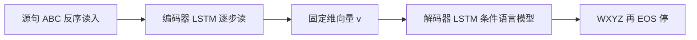

# Seq2Seq：把整句压成固定向量，再让另一座 LSTM 吐出译文

<!-- release-date: 2014-09-10 -->

**本文依据**：`Sequence to Sequence Learning with Neural Networks`，arXiv:1409.3215，letter，9 页。作者 Ilya Sutskever、Oriol Vinyals、Quoc V. Le，均署 Google。页眉印 `arXiv:1409.3215v3 [cs.CL] 14 Dec 2014`。封面未印会议名。文中数字均标 PDF 页码；标「外部补充」的段落不来自本文。

## 一句话

深度网络当时已经能在语音、视觉上端到端学复杂计算，但输入和目标都必须能编成**固定维向量**。机器翻译、问答这类问题的两端长度事先不知道，普通 DNN 接不上。这篇用一座多层长短期记忆（Long Short-Term Memory，LSTM）把源句逐步读成固定维向量，再用另一座深 LSTM 从该向量解码目标句。WMT’14 英→法上，LSTM 在整份测试集上拿到 BLEU 34.8（未登录词会被罚）；短语统计机器翻译（Statistical Machine Translation，SMT）基线是 33.3；用 LSTM 重排该 SMT 的 1000 条候选则到 36.5。把**源句词序反转、目标句不反转**，优化明显变容易（PDF p. 1）。

它解决的不是「循环网能不能对齐」，而是 **2014 年那条卡死的路：DNN 吃不进变长对变长，而当时的神经翻译要么只重打分、要么假设单调对齐。**

## 一、矛盾：DNN 很强，但两端长度必须事先钉死

DNN 能在不多的步数里做任意并行计算。作者举了一个夸张例子：两层二次规模的隐层就能给 $N$ 个 $N$ 比特数排序。只要有足够标注、存在一组能解任务的参数，监督反向传播就能找到它们（PDF p. 1）。

限制同样硬：输入和目标必须能合理编成固定维向量。语音识别、机器翻译、问答都是序列问题，长度事先不知道。需要一种尽量少假设序列结构的、端到端的序列到序列方法（PDF p. 1–2）。

LSTM 适合这件事，因为输入与对应输出之间有可观时滞。做法是：一座 LSTM 逐步读入，得到大固定维表示；另一座 LSTM 从该向量抽出输出序列。第二座本质上是循环神经语言模型，只是条件在输入序列上（PDF p. 2 图 1）。

相关尝试已经有。Kalchbrenner 与 Blunsom 最先把整句映到向量；Cho 等人的架构当时主要用于给短语系统的假设重打分。Graves 提出可微注意力，Bahdanau 等人把它用到机器翻译。连接主义时序分类（Connectionist Temporal Classification，CTC）也能映射序列，但假设输入输出单调对齐（PDF p. 2）。

把机制先摊开（机制示意，根据 PDF p. 2 图 1 重画，不是实测时间轴）：

图 1 的例子是读「ABC」、产出「WXYZ」，吐出句末符后停止。图注写明：LSTM **反序读源句**，因为这样会引入许多短时依赖，优化容易得多（PDF p. 2）。

引言里的主结果已经钉到数字：WMT’14 英→法上，5 座深 LSTM 集成（每座 3.84 亿参数、8000 维状态）用从左到右束搜索直接抽译文，BLEU 34.81。这是当时大规模神经网直接翻译里最好的。SMT 基线同一数据是 33.30。34.81 来自 8 万词词表的 LSTM，参考译文里超出这 8 万的词会被罚。用 LSTM 重打 SMT 基线公开的 1000-best，BLEU 36.5，比基线高 3.2，接近此前该任务已发表最好的 37.0。长句没有崩。关键技巧之一就是训练和测试都反转源词、不反转目标词（PDF p. 2）。

翻译目标还鼓励句子表示抓住意思：意思相近的句子在向量空间里靠近。定性评估支持：模型对词序敏感，对主动/被动相对不敏感（PDF p. 2–3）。

## 二、模型：两座 LSTM，中间只留一个向量

循环神经网络（Recurrent Neural Network，RNN）是前馈网到序列的自然推广。给定 $(x_1,\ldots,x_T)$，标准 RNN 迭代（PDF p. 3）

$$
h_t=\mathrm{sigm}(W_{hx}x_t+W_{hh}h_{t-1}),\qquad y_t=W_{yh}h_t
$$

输入输出对齐事先已知时，RNN 容易做序列到序列。长度不同、关系非单调时，就不清楚怎么接（PDF p. 3）。

最简单的通用策略：一座 RNN 把输入压成固定向量，另一座 RNN 把向量映成目标。Cho 等人也走这条。原理上信息都在，但长程依赖会让训练很难。LSTM 以能学长时滞著称，所以作者押它（PDF p. 3）。

目标是估计条件概率 $p(y_1,\ldots,y_{T'}|x_1,\ldots,x_T)$，其中 $T'$ 可以不等于 $T$。先用编码器最后隐状态得到固定表示 $v$，再按标准 LSTM 语言模型写目标，初始隐状态设为 $v$（PDF p. 3 式 1）：

$$
p(y_1,\ldots,y_{T'}|x_1,\ldots,x_T)=\prod_{t=1}^{T'}p(y_t|v,y_1,\ldots,y_{t-1})
$$

每个因子是词表上的 softmax。LSTM 公式跟 Graves 2013。每句必须以特殊句末符 `<EOS>` 结束，模型才能在所有可能长度上定义分布。图 1 里先算「A B C `<EOS>`」的表示，再算「W X Y Z `<EOS>`」的概率（PDF p. 3）。

实际模型相对上面三条改动（PDF p. 3）：

1. **编码器和解码器用两座不同的 LSTM**。参数几乎不增加计算量，也方便以后同时训多对语言。
2. **深 LSTM 明显好过浅的**，所以选四层。
3. **源词反序极其有用**。不是把 $a,b,c$ 映到 $\alpha,\beta,\gamma$，而是把 $c,b,a$ 映到 $\alpha,\beta,\gamma$。于是 $a$ 靠近 $\alpha$、$b$ 相当靠近 $\beta$，SGD 更容易在输入输出之间「建立通信」。

**旧问题 → 新设计 → 机制 → 收益 → 代价。** 对齐未知、长度不等时，不能直接套标准 RNN；固定向量当瓶颈，把「读完再写」变成条件语言模型。代价是整句信息必须挤进 $v$，长句记忆压力大——后文用反序源句把这条压力压下去。

可迁移：今天注意力已经把瓶颈打开，但「先决定信息怎么编码，再谈容量」仍然成立。这篇的编码选择是反序，不是更大的状态。

## 三、实验：WMT’14 英→法，直接翻译与重打分

作者把方法用在 WMT’14 英→法上，两条路并行：不用参考 SMT、直接翻译；以及重打 SMT 基线的 n-best。同时给样例译文，并可视化句子表示（PDF p. 3）。

### 3.1 数据细节

训练用 WMT’14 英→法的一个干净「精选」子集：1200 万句，3.48 亿法语词、3.04 亿英语词，来自 Schwenk 的公开资源。选它是因为有分词后的训练/测试集，以及基线 SMT 的 1000-best（PDF p. 4）。

神经语言模型每个词要向量，所以两边词表固定：源语言最常见 16 万词，目标最常见 8 万词。未登录一律换成特殊 `UNK`（PDF p. 4）。

### 3.2 解码与重打分

训练最大化正确译文 $T$ 在源句 $S$ 下的对数概率，目标是训练集上 $1/|S|\sum\log p(T|S)$（PDF p. 4）。训完后按

$$
\hat T=\arg\max_T p(T|S)
$$

找最可能译文。搜索是简单从左到右束搜索：保留 $B$ 条部分假设（译文前缀）；每步用词表每个词扩展，再按模型对数概率只留最可能的 $B$ 条。一旦接上 `<EOS>`，该假设离开束、进入完成集。近似，但实现简单。束宽 1 已经不错，束宽 2 吃到束搜索的大部分好处，见表 1（PDF p. 4）。

重打 1000-best 时，用 LSTM 算每条假设的对数概率，再与基线分数做均匀平均（PDF p. 4）。

### 3.3 反转源句

LSTM 能解长依赖，但源句反转（目标不反转）时学得更好。测试困惑度从 5.8 降到 4.7，解码译文的测试 BLEU 从 25.9 升到 30.6（PDF p. 4）。

作者没有完整解释，判断是数据集里多了许多短时依赖。源句与目标句直接拼接时，源词离对应目标词很远，「最小时滞」很大。反转后，对应词的平均距离不变，但源语言前几个词现在紧挨目标语言前几个词，最小时滞大幅下降。反向传播更容易接通两端，整体性能跟着上来（PDF p. 4）。

他们起初以为反转只会让目标句前半更有把握、后半更虚。结果：反转源句训出的 LSTM 在长句上明显好过用原始源句训的（见 3.7），说明反转还改善了记忆利用（PDF p. 4–5）。

### 3.4 训练细节

四层深 LSTM，每层 1000 个细胞，词嵌入 1000 维；输入词表 16 万，输出 8 万。于是用 8000 个实数表示一句。深网显著好过浅网，每加一层困惑度大约降 10%，可能因为隐状态大得多。输出是 8 万词上的朴素 softmax。整座 LSTM 3.84 亿参数，其中 6400 万是纯循环连接（编码器、解码器各 3200 万）（PDF p. 5）。

具体配方（PDF p. 5）：

- 参数均匀初始化在 $-0.08$ 与 $0.08$ 之间。
- 无动量 SGD，固定学习率 0.7；5 个 epoch 之后每半个 epoch 把学习率减半；一共 7.5 个 epoch。
- 批量 128 条，梯度除以 128。
- LSTM 不太消失梯度，但会爆炸。对每批算 $s=\|g\|_2$（$g$ 已除以 128）；若 $s>5$，令 $g=5g/s$。
- 句子长短差很大：多数 20–30，也有超过 100。随机 128 条会浪费大量计算。让同一 minibatch 里句子大致等长，得到约 2 倍加速。

### 3.5 并行

单 GPU 上该配置的 C++ 深 LSTM 大约每秒 1700 词，太慢。改用 8 GPU 机器：LSTM 每层一块 GPU，激活算完立刻传给下一层/下一卡。4 层 LSTM 占 4 卡；剩下 4 卡并行 softmax，每卡乘一块 $1000\times 20000$ 矩阵。批量 128 时速度到每秒 6300 词（英、法合计）。训练大约十天（PDF p. 5）。

论文没写更细的通信拓扑或混合精度。没写的不补。

## 四、表 1 与表 2：直接翻译先超过短语 SMT

评测用 cased BLEU，脚本 `multi-bleu.pl`，在分词后的预测与真值上算。口径与 Cho 等人、Bahdanau 等人一致，并能复现 Schwenk 基线的 33.3。若用同一口径评当时最好的 WMT’14 系统，得到 37.0，高于 statmt.org/matrix 上报告的 35.8（PDF p. 5）。

最好结果来自随机初始化和 minibatch 随机顺序都不同的 LSTM 集成。集成解码没有超过最好的 WMT’14 系统，但这是第一次纯神经翻译系统在大规模 MT 上以可观差距超过短语 SMT 基线——尽管它处理不了未登录词。若只重打基线 1000-best，LSTM 距最好 WMT’14 结果不到 0.5 BLEU（PDF p. 5–6）。

表 1 是 ntst14 上 LSTM **直接翻译**（PDF p. 6）：

| 方法 | 测试 BLEU（ntst14） |
|---|---|
| Bahdanau 等人 | 28.45 |
| 基线系统 | 33.30 |
| 单座正向 LSTM，束宽 12 | 26.17 |
| 单座反向 LSTM，束宽 12 | 30.59 |
| 5 座反向 LSTM 集成，束宽 1 | 33.00 |
| 2 座反向 LSTM 集成，束宽 12 | 33.27 |
| 5 座反向 LSTM 集成，束宽 2 | 34.50 |
| 5 座反向 LSTM 集成，束宽 12 | 34.81 |

表注：5 座集成加束宽 2，比单座加束宽 12 更便宜（PDF p. 6）。

表 2 是神经网 **配合 SMT**（PDF p. 6）：

| 方法 | 测试 BLEU（ntst14） |
|---|---|
| 基线系统 | 33.30 |
| Cho 等人 | 34.54 |
| 最好 WMT’14 结果 | 37.0 |
| 单座正向 LSTM 重打基线 1000-best | 35.61 |
| 单座反向 LSTM 重打基线 1000-best | 35.85 |
| 5 座反向 LSTM 集成重打基线 1000-best | 36.5 |
| 对基线 1000-best 的 oracle 重打 | 约 45 |

摘要里的 34.8 / 33.3 / 36.5 对应表 1 的 34.81、基线 33.30、表 2 的 36.5。oracle 一格原文用近似记号标在 45 附近，这里写成约 45。

因果链要读表，不要只读摘要：单座正向 26.17 还打不过 Bahdanau 的 28.45；单座反向就到 30.59；集成加束搜索才越过 33.30。反序不是边角技巧，是直接翻译这条路能立住的条件。

## 五、长句与句子向量：记忆没有先崩

作者对长句表现感到意外，定量在图 3，样例在表 3（PDF p. 6）。

图 3 左图：测试句按长度排序。少于 35 词没有退化，最长句只有轻微退化。右图：按「平均词频排名」排序，看稀有词变多时 BLEU 怎么掉。图例把系统标成 LSTM（34.8）、基线（33.3）（PDF p. 7）。

表 3 给了三条长句：模型译文与真值并排，含 `UNK`。作者让读者用 Google 翻译自行核对是否通顺（PDF p. 7）。解读不逐句复述法语。

图 2 是处理短语后 LSTM 隐状态的二维 PCA。短语按意思成簇，这些例子里意思主要是词序的函数，词袋模型很难抓。两个簇内部结构相似。表示对词序敏感，把主动换成被动则相当不敏感（PDF p. 6–7）。

## 六、相关工作：重打分已经熟，端到端才刚开始

把 RNN 语言模型或前馈神经语言模型接到 MT 上，当时最简单有效的办法是给强 MT 基线的 n-best 重打分，稳定提升质量（PDF p. 7–8）。

随后有人把源语言信息塞进 NNLM：Auli 等人配主题模型；Devlin 等人把 NNLM 嵌进解码器，用对齐信息挑源句里最有用的词，相对基线提升很大（PDF p. 8）。

Kalchbrenner 与 Blunsom 最先句→向量→句，但卷积会丢掉词序。Cho 等人用类 LSTM 的 RNN 做同样映射，重点是接到 SMT 里。Bahdanau 等人用注意力做直接翻译，为了克服 Cho 等人在长句上的差表现。Pouget-Abadie 等人把源句切块再译，类似短语方法。作者怀疑：只要在反转源句上训，他们也能拿到类似改进（PDF p. 8）。

Hermann 等人也做端到端，用前馈网把输入输出映到相近点，但不能直接生成：要么在预计算句库里找最近向量，要么重打一条已有句子（PDF p. 8）。

## 七、结论、限制与可迁移启发

结论三条（PDF p. 8）：

1. 词表有限、几乎不假设问题结构的大型深 LSTM，能在大规模 MT 上超过词表不受限的标准 SMT。只要数据够，同样思路应能迁到许多其他序列问题。
2. 反转源词带来的提升幅度出乎意料。重要的是找到短时依赖最多的问题编码。他们没能在未反转的翻译问题上训起标准 RNN（图 1 那种）；相信源句反转后标准 RNN 应该容易训——**实验上没有验证**。
3. LSTM 能正确翻译很长的句子，同样令人意外。他们起初确信有限记忆会在长句上失败，其他人也用类似模型报告过长句差。反转数据上训出的 LSTM 对长句几乎没有困难。

最重要的一句：简单、直接、相对未优化的方法已经能超过 SMT，后续工作很可能再把精度抬上去（PDF p. 8）。

限制要说清，都是原文边界，不是后来注意力论文的后见之明：

- 8 万目标词表，OOV 直接罚 BLEU；纯神经系统处理不了未登录词（PDF p. 2、p. 6）。
- 信息必须过固定向量 $v$，没有注意力。
- 集成解码仍低于最好 WMT’14 的 37.0；oracle 约 45 说明 1000-best 里还有大量空间（PDF p. 6）。
- 反转为何有效，作者承认没有完整解释（PDF p. 4）。
- 「反转后标准 RNN 好训」未做实验（PDF p. 8）。
- 训练大约十天、8 GPU；并行与裁剪细节到第 3.4–3.5 节为止，没有开源配方以外的系统论文。

可迁移：

- **编码先于容量。** 反序几乎不改模型，只改最小时滞，BLEU 从 25.9 到 30.6。做序列任务时先问：两端对应位置是不是被你的遍历顺序拉得太远。
- **两座网、一个瓶颈。** 编码器/解码器分参，几乎免费地加容量，也方便多语言。今天的 encoder–decoder 仍是这个骨架。
- **束宽 2 往往够。** 表 1 里 5 座集成束宽 2 已经 34.50，束宽 12 才 34.81；表注还说前者更便宜。
- **按长度组 batch。** 2 倍加速来自少算填充，不是来自更好的优化器。
- **梯度范数硬裁。** 阈值 5，相对已除以 128 的梯度。LSTM 不消失不等于不爆炸。
- **直接生成和重打分是两条产品线。** 直接译 34.81 已经超过短语 SMT；接到 1000-best 上还能再涨。系统选择不必从第一天就「纯神经」。

## 关键词回看

- **序列到序列（sequence to sequence）**：两端都是变长序列，中间用固定向量接通。
- **编码器 LSTM / 解码器 LSTM**：前者读源句得到 $v$，后者以 $v$ 为初态写目标，直到 `<EOS>`。
- **源句反序**：只反源、不反目标，缩短最小时滞。
- **束搜索**：保留 $B$ 条前缀；这篇里 $B=2$ 已接近 $B=12$。
- **1000-best 重打分**：LSTM 对数概率与 SMT 分数均匀平均。
- **BLEU（cased，`multi-bleu.pl`）**：本篇与基线、Cho、Bahdanau 对齐的口径。

## 参考资料

- 原件：`readings/_src/深度学习基石/Seq2Seq.pdf`（arXiv:1409.3215v3，9 页 letter）
- 文中引用的前作与对照（均见 PDF p. 9 参考文献，不另开解读）：Hochreiter & Schmidhuber, LSTM, 1997；Cho 等人, RNN encoder–decoder, arXiv:1406.1078；Bahdanau 等人, 对齐与翻译, arXiv:1409.0473；Kalchbrenner & Blunsom, EMNLP 2013；Schwenk 的 WMT’14 基线与 1000-best
