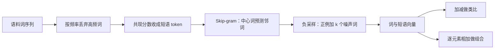

# Word2Vec 负采样：用降频与噪声对比，把短语也学成可加减的向量

<!-- release-date: 2013-10-16 -->

**本文依据**：`Distributed Representations of Words and Phrases and their Compositionality`，arXiv:1310.4546v1 [cs.CL] 16 Oct 2013，letter，9 页。作者 Tomas Mikolov、Ilya Sutskever、Kai Chen、Greg Corrado、Jeffrey Dean，均署 Google Inc., Mountain View。封面未印会议名。文中数字均标 PDF 页码；标「外部补充」的段落不来自本文。

## 一句话

连续 Skip-gram 已经能从无结构文本里学出高质量词向量，还能用向量加减解类比。这篇把它往三个方向推：训练时丢掉一部分高频词（subsampling），速度大约快 2 倍到 10 倍，低频词表示也更规整；用负采样（Negative Sampling，NEG）替代层次 softmax，不必为每个正例扫整棵词表树；再用数据驱动的共现分数把「Air Canada」一类习语短语收成独立 token，而不是指望「Air」加「Canada」拼出航空公司（PDF p. 1）。短语类比集上最好模型准确率 72%（PDF p. 6–7）。

它解决的不是「再发明一种词向量」，而是上一篇 Skip-gram 留下的三块硬伤：**全词表归一化太贵、高频词占满梯度、单词向量对习语短语无感。**

## 一、矛盾：向量已经会加减，训练还卡在词表和词频上

作者把 2013 年的局面写得很短。词的分布式表示能把相近词聚到一起，从 Rumelhart、Hinton、Williams（1986）一路用到统计语言模型、语音识别、机器翻译和一批 NLP 任务（PDF p. 1）。Mikolov 等人刚提出的 Skip-gram 不靠稠密矩阵乘，优化过的单机实现一天能训超过 1000 亿词（PDF p. 1）。更意外的是，许多句法、语义规律表现为线性平移：`vec("Madrid") - vec("Spain") + vec("France")` 离 `vec("Paris")` 比离其他词更近（PDF p. 1）。

旧做法仍卡三处。

第一，完整 softmax 要把目标词的得分对整张词表归一化。词表规模 $W$ 常在 $10^5$–$10^7$，算 $\nabla\log p(w_O|w_I)$ 的代价与 $W$ 成正比，训不动（PDF p. 2 式 2）。上一篇用层次 softmax 把代价压到大约 $\log_2 W$，但树结构和 Huffman 编码仍是一套额外装置（PDF p. 2–3）。

第二，超大语料里 `the`、`in`、`a` 能出现上亿次。Skip-gram 从「France」和「Paris」的共现里学到东西，从「France」和「the」里学得少得多——几乎每个词都会跟 `the` 同句出现。反过来，高频词自己的向量看过几百万次之后几乎不再变（PDF p. 4）。

第三，单词向量对词序和习语不敏感。「Canada」和「Air」加不出「Air Canada」；「Boston Globe」是报纸，不是波士顿加地球（PDF p. 1–2）。若还想用递归自编码器一类方法把词向量合成句子，先有短语向量会更有用（PDF p. 2）。

所以这篇要同时做三件事：负采样简化噪声对比估计（Noise Contrastive Estimation，NCE）；按频率 squareroot 丢弃高频词；先找短语再当独立 token 训。作者还观察到向量逐元素相加常常有意义，例如 `vec("Russia") + vec("river")` 靠近 `vec("Volga River")`（PDF p. 2）。

流水线可以画成（机制示意，根据 PDF p. 1 图 1 与第 2–4 节重画，不是实测时间轴）：

前半段改数据分布，后半段改目标函数。向量质量来自两者一起变，不是单换一个损失。

## 二、Skip-gram 在最大化什么

给定训练词序列 $w_1,\ldots,w_T$，目标是最大化平均对数概率（PDF p. 2 式 1）：

$$
\frac{1}{T}\sum_{t=1}^{T}\sum_{-c\le j\le c,\,j\neq 0}\log p(w_{t+j}|w_t)
$$

$c$ 是上下文窗口，可以随中心词 $w_t$ 变。$c$ 越大，训练例越多、精度可能更高，时间也更长（PDF p. 2）。基本定义用 softmax（PDF p. 2 式 2）：

$$
p(w_O|w_I)=\frac{\exp({v'_{w_O}}^\top v_{w_I})}{\sum_{w=1}^{W}\exp({v'_w}^\top v_{w_I})}
$$

$v_w$ 是输入向量，$v'_w$ 是输出向量。分母扫全词表，这就是「不实用」的那一步。图 1 把目标说成人话：学出的向量要善于预测附近的词（PDF p. 1）。

图 2 把 1000 维 Skip-gram 向量做二维 PCA：国家与首都各自成团，对应关系在平面上近似平移。训练时没有告诉模型「首都」是什么关系（PDF p. 4 图 2）。这是后面所有类比实验的几何直觉，不是新监督信号。

## 三、层次 softmax：把 $W$ 路输出收成一条树路径

层次 softmax 把输出层做成二叉树，词在叶子上，每个内部节点存两个子节点的相对概率。从根走到词 $w$ 的路径长度为 $L(w)$，平均不超过 $\log W$（PDF p. 2–3）。概率是路径上各次二分类的乘积（PDF p. 3 式 3）：

$$
p(w|w_I)=\prod_{j=1}^{L(w)-1}\sigma\Big([[n(w,j+1)=\mathrm{ch}(n(w,j))]]\cdot {v'_{n(w,j)}}^\top v_{w_I}\Big)
$$

$\sigma(x)=1/(1+e^{-x})$。$[[x]]$ 为真取 $1$、否则取 $-1$。可以验证对全部词求和为 1。与标准 softmax「一词两向量」不同：每个词只留输入向量 $v_w$，内部节点才有 $v'_n$（PDF p. 3）。

树结构影响速度和精度。本文用二叉 Huffman 树：高频词码长短，训练快。按频率把词捆在一起，此前已被当作神经网络语言模型的简单加速（PDF p. 3）。

层次 softmax 把「对 $W$ 归一化」换成「沿 $\log W$ 条边做 logistic」。它仍要维护整棵树。负采样连这棵树也不要。

## 四、负采样：只区分真邻词和噪声词

NCE 认为好模型应能用 logistic 回归把数据从噪声里分开（Gutmann 与 Hyvärinen；Mnih 与 Teh 用到语言模型）。这接近 Collobert 与 Weston 用 hinge 把数据排在噪声之上（PDF p. 3）。

NCE 可以近似最大化 softmax 的对数概率。Skip-gram 只关心向量好不好，作者因此把 NCE 再简化，只要向量质量还在。负采样目标替换目标里的每一个 $\log P(w_O|w_I)$（PDF p. 3 式 4）：

$$
\log\sigma({v'_{w_O}}^\top v_{w_I})+\sum_{i=1}^{k}\mathbb{E}_{w_i\sim P_n(w)}\big[\log\sigma(-{v'_{w_i}}^\top v_{w_I})\big]
$$

人话：正例（真正的上下文词 $w_O$）的点积经 sigmoid 要靠近 1；从噪声分布 $P_n$ 抽 $k$ 个词，点积经负号后也要靠近 1，即这些噪声词不该被当成邻居。每个正例配 $k$ 个负例。小数据集上 $k$ 取 5–20 有用，大数据集上 2–5 就够（PDF p. 4）。

和 NCE 的差别：NCE 既要样本，也要噪声分布的数值概率；NEG 只要样本。NCE 近似最大化 softmax 对数概率，对学向量这件事不重要（PDF p. 4）。

噪声分布 $P_n(w)$ 是自由参数。作者试过多种选择，发现把 unigram $U(w)$ 升到 $3/4$ 次方再归一化，即 $U(w)^{3/4}/Z$，显著好于 unigram 和均匀分布；NCE 与 NEG 在他们试过的每项任务上都如此，包括未在文中报告的语言建模（PDF p. 4）。

可迁移的不是「必须 $k=15$」，而是：**若你只需要表示、不需要归一化的生成概率，就可以把多类 softmax 收成「1 个正例 + $k$ 个按偏置频率抽的负例」。** 偏置频率压低频噪声、抬中频，避免负例全是 `the` 或全是生僻词。

## 五、高频词降采样：少看 `the`，多给低频词留梯度

每个词 $w_i$ 被丢掉的概率是（PDF p. 4 式 5）：

$$
P(w_i)=1-\sqrt{\frac{t}{f(w_i)}}
$$

$f(w_i)$ 是相对频率，$t$ 是阈值，通常约 $10^{-5}$（PDF p. 5）。频率高于 $t$ 的词会被狠丢，但频率排序仍在。公式是启发式的，实践里既加速，又明显改善低频词向量（PDF p. 5）。引言里把加速幅度写成大约 2 倍到 10 倍（PDF p. 1）。

这不是随机删语料。它改的是「哪些共现对进入 Skip-gram」。`France`–`the` 大量消失，`France`–`Paris` 相对更常见。高频词向量也不会在几百万次重复上空转。

## 六、词类比：NEG 赢 HS，降采样再换时间

评测沿用上一篇的类比推理：`Germany`:`Berlin`::`France`:? 找余弦距离上最接近 `vec("Berlin")-vec("Germany")+vec("France")` 的词（搜索时丢掉输入词）。句法如 `quick`:`quickly`::`slow`:`slowly`，语义如国家–首都（PDF p. 5）。

训练数据是 Google 内部新闻，约 10 亿词；出现少于 5 次的词丢掉，词表 692K。模型 300 维。表 1（PDF p. 5）：

| 方法 | 时间 [min] | 句法 [%] | 语义 [%] | 总准确率 [%] |
|---|---|---|---|---|
| NEG-5 | 38 | 63 | 54 | 59 |
| NEG-15 | 97 | 63 | 58 | 61 |
| HS-Huffman | 41 | 53 | 40 | 47 |
| NCE-5 | 38 | 60 | 45 | 53 |
| NEG-5（$10^{-5}$ 降采样） | 14 | 61 | 58 | 60 |
| NEG-15（$10^{-5}$ 降采样） | 36 | 61 | 61 | 61 |
| HS-Huffman（$10^{-5}$ 降采样） | 21 | 52 | 59 | 55 |

没有降采样时，NEG-15 总准确率 61%，高于 HS 的 47% 和 NCE-5 的 53%；NEG 略好于 NCE。加上 $10^{-5}$ 降采样后，NEG-5 从 38 分钟降到 14 分钟，总准确率 59% 升到 60%；HS 的语义从 40% 升到 59%，总准确率 47% 升到 55%。作者的判断：NEG 在这类类比上超过 HS，也略好于 NCE；降采样让训练快数倍，表示也更准（PDF p. 5）。

有人会说：Skip-gram 本身是线性的，所以适合线性类比。作者指出，上一篇里高度非线性的 sigmoid 循环网，数据变多后这类任务也会明显变好——非线性模型同样偏好词表示里的线性结构（PDF p. 5）。这是对「只有 Skip-gram 才会加减」的限制，不是新实验。

## 七、短语：先当 token，再学向量

许多短语不是词义的简单组合。做法：找出经常一起出现、在别处很少单独乱配的词串，换成唯一 token。「New York Times」「Toronto Maple Leafs」会被替换；「this is」不动（PDF p. 5）。理论上可以拿全部 n-gram 训 Skip-gram，内存吃不消。短语识别文献很多，本文不做对比（PDF p. 6）。

分数用 unigram / bigram 计数（PDF p. 6 式 6）：

$$
\mathrm{score}(w_i,w_j)=\frac{\mathrm{count}(w_i w_j)-\delta}{\mathrm{count}(w_i)\times\mathrm{count}(w_j)}
$$

$\delta$ 是折扣，挡住由极低频词凑出来的假短语。分数超过阈值的 bigram 收成短语。通常对语料跑 2–4 遍，阈值递减，让由多个词构成的更长短语也能形成（PDF p. 6）。

新的短语类比集公开在 `questions-phrases.txt`。表 2 给出五类例子：报纸、NHL、NBA、航空公司、公司高管，共 3218 题。目标仍是用前三个短语算出第四个。最好模型在该集上 72%（PDF p. 6）。典型题：`Montreal`:`Montreal Canadiens`::`Toronto`:`Toronto Maple Leafs`（PDF p. 2）。

### 十亿词上的消融

同一新闻语料先建成短语语料，再训。向量 300 维、窗口 5。表 3（PDF p. 6）：

| 方法 | 维数 | 无降采样 [%] | $10^{-5}$ 降采样 [%] |
|---|---|---|---|
| NEG-5 | 300 | 24 | 27 |
| NEG-15 | 300 | 27 | 42 |
| HS-Huffman | 300 | 19 | 47 |

NEG-5 已经能看，NEG-15 明显更好。意外的是：不降采样时 HS 最差（19%）；降采样后 HS 变成最好（47%），超过 NEG-15 的 42%。作者的结论：降采样有时既能加速又能提精度；算法选择是任务相关的（PDF p. 6，结论 PDF p. 8）。

为冲短语类比精度，他们把数据加到约 330 亿词，用层次 softmax、1000 维、整句当上下文，准确率 72%。减到 60 亿词则是 66%。大数据量是关键（PDF p. 7）。表 4 人工看低频短语的近邻：带 $10^{-5}$ 降采样的 HS 比同样降采样的 NEG-15 更像「对的实体」（例如 `Vasco de Gama` 靠近 Italian explorer，而不是地名 Lingsugur）（PDF p. 7）。这与表 3 一致，但是定性观察，不是自动指标。

## 八、逐元素相加：两个上下文分布做 AND

类比是一种线性结构。另一种是把两个向量逐元素相加。表 5 用最好 Skip-gram，列出四个最近邻（PDF p. 7）：`Czech + currency` 靠近 koruna；`Vietnam + capital` 靠近 Hanoi；`German + airlines` 靠近 airline Lufthansa；`Russian + river` 最近邻是 Moscow，Volga River 排第二；`French + actress` 靠近 Juliette Binoche。相加「有时有意义」，不是每次第一名都对。

作者给的机制解释（PDF p. 7）：词向量与 softmax 非线性之前的输入成线性关系；训练目标是预测周围词，于是向量刻画该词出现的上下文分布。这些值与输出层概率成对数关系，两向量之和对应两套上下文分布的乘积。乘积起 AND 的作用：两边都给高概率的词仍高，其余变低。若「Volga River」常与「Russian」和「river」同句出现，这两个向量之和就会靠近「Volga River」。

这是对训练目标的解读，不是单独的定理证明。可迁移点：若表示被训成「预测共现」，加法近似「同时满足两套上下文」，对实体名、标题这类短组合够用；对真正有句法结构的句子，作者把本文定位成 Socher 等人递归矩阵–向量方法的补充，而不是替代（PDF p. 8）。

## 九、和已发表向量比近邻，不是再跑一遍类比表

Collobert 与 Weston、Turian 等人、Mnih 与 Hinton 的向量可从网上下载。上一篇已在词类比上比较过，Skip-gram 大幅领先（PDF p. 7）。本文改看低频词的最近邻。表 6（PDF p. 8）：查询 Redmond / Havel / ninjutsu / graffiti / capitulate。Collobert 50 维训约 2 个月，Turian 200 维数周，Mnih 100 维 7 天；Skip-Phrase 1000 维、短语、超过 300 亿词、约 1 天。空单元格表示该词不在对方词表里。Skip-Phrase 的近邻是 Redmond Wash.、Vaclav Havel、ninja、spray paint、capitulation 这类对得上的词，其他模型经常漂到无关专名。

作者把差距部分归到数据：约 300 亿词，比先前典型规模高两到三个数量级；尽管数据大得多，Skip-gram 训练时间只是先前架构的一小部分（PDF p. 8）。这是定性近邻对比，不是与表 1 同一套准确率。

开源代码在 `code.google.com/p/word2vec`（PDF p. 8）。同一套技术也可用于上一篇的连续词袋（CBOW）（PDF p. 8）。

## 十、作者自己划的边界

最影响性能的决定是：模型架构、向量维度、降采样率、训练窗口（PDF p. 8）。训练算法和超参是任务相关的：词类比上 NEG 更强，短语类比加大数据并降采样后 HS 反而最好。文中未报告语言建模数字；短语识别不与已有方法对比；NCE 的数值噪声概率被故意丢掉。封面与正文都不把本文写成某次会议录用稿。

## 可迁移启发

- **目标函数跟你要的东西对齐。** 只要向量、不要归一化概率，就可以用 1+$k$ 的 logistic，不必维持 Huffman 树或全词表分母。
- **负例分布不是均匀的。** $U^{3/4}$ 是一条便宜、可复用的偏置；换任务仍应把它当超参，而不是当定理。
- **高频重复会占满梯度。** 按 $\sqrt{t/f}$ 丢弃，既是加速也是重新加权共现。阈值约 $10^{-5}$ 是本文的工作点，不是普适常数。
- **习语先切成 token，再谈组合。** 加法能近似 AND，切短语能处理非组合成语。两者一起用，比一上来上递归合成器便宜。
- **同一套加速在不同任务上会改排名。** 表 1 与表 3 方向不一致。选 NEG 还是 HS，要看你真正考的类比，而不是「新方法一定全面更好」。

## 关键词回看

- **Skip-gram**：中心词预测窗口内邻词；向量质量来自这件事，而不是来自语言模型困惑度。
- **层次 softmax（HS）**：输出做成 Huffman 树，代价约 $\log W$。
- **噪声对比估计（NCE）** / **负采样（NEG）**：用 logistic 把正邻词和噪声词分开；NEG 不需要噪声概率值。
- **高频词降采样（subsampling）**：频率越高越容易被丢掉，公式见式 5。
- **短语 token**：用式 6 的共现分数把多词单位收进词表。
- **加性组合性**：两向量之和近似两套上下文的 AND。

## 参考资料

- 原件：`readings/_src/深度学习基石/Word2Vec-NegativeSampling.pdf`（arXiv:1310.4546v1）
- 训练代码（文中给出）：`code.google.com/p/word2vec`
- 词类比题：`questions-words.txt`；短语类比题：`questions-phrases.txt`（PDF p. 5–6 脚注）
