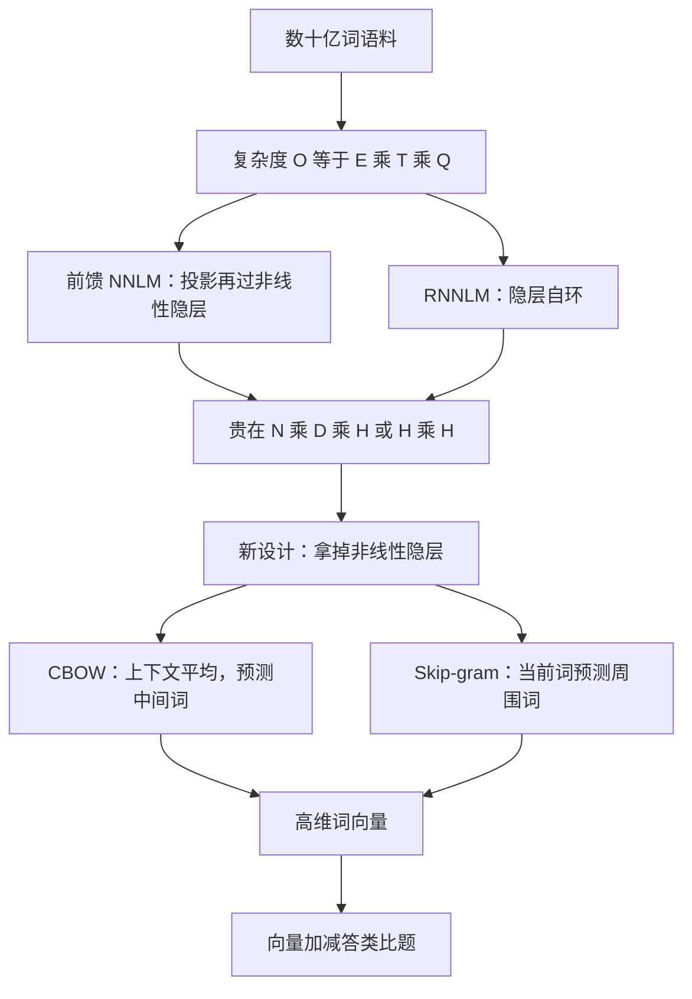

# Word2Vec：去掉非线性隐层，才能在十亿词上把词向量训到能做加减法

<!-- release-date: 2013-01-16 -->

**本文依据**：`Efficient Estimation of Word Representations in Vector Space`，arXiv:1301.3781，letter，12 页。作者 Tomas Mikolov、Kai Chen、Greg Corrado、Jeffrey Dean，均署 Google Inc., Mountain View, CA。封面页眉印 `arXiv:1301.3781v3 [cs.CL] 7 Sep 2013`，未印会议名。文中数字均标 PDF 页码；标「外部补充」的段落不来自本文。

## 一句话

当时主流做法把词当成词表里的编号：没有「相近」这回事。神经网络语言模型能学到连续向量，但非线性隐层太贵，以往架构几乎训不动超过几亿词、维度也卡在 50–100（PDF p. 1–2）。这篇提出两座去掉非线性隐层的对数线性模型：**连续词袋（Continuous Bag-of-Words，CBOW）** 用上下文预测中间词；**连续 Skip-gram** 用当前词预测窗口里的周围词（PDF p. 4 图 1）。在作者的句法–语义类比测试集上，向量加减能答出「Athens 对 Greece 如同 Oslo 对 Norway」这类题。摘要里的工程数字是：从 16 亿词里学出高质量向量用不了一天（PDF p. 1）。

它解决的不是「词能不能变成向量」——Bengio、RNNLM、Collobert–Weston 已经在做——而是 **2013 年那条卡死的路：要线性规律，就得又大又高维；一上非线性隐层，十亿词训不起。**

## 一、矛盾：简单模型吃得下数据，复杂模型才有相似度

许多 NLP 系统把词当原子：词表下标，没有相似度。理由很实在：简单、稳，而且海量数据上的简单模型常常打过少数据上的复杂系统。统计语言模型里的 N-gram 已经能在几乎全部可用数据上训，规模到万亿词（PDF p. 1）。

简单缩放却到头了。语音识别里高质量转写往往只有百万词量级；机器翻译里许多语言的语料只有几十亿词或更少。再堆 N-gram 不会有实质进步，必须上更复杂的模型（PDF p. 1）。近几年机器学习让复杂模型也能吃更大的数据，通常打过简单模型。最成功的概念之一是词的分布式表示。基于神经网络的语言模型已经显著超过 N-gram（PDF p. 1）。

目标钉死：从数十亿词、词表上百万的数据里学高质量词向量。据作者所知，此前没有架构在超过几亿词上训成功，向量维度也只是 50–100（PDF p. 1–2）。质量不只看「近邻是不是同类词」，还要看多种相似度。屈折语里名词有多种词尾，在原空间的子空间里能找到词尾相近的词。更意外的是：相似度超出句法。用向量偏移做代数，`vector("King") - vector("Man") + vector("Woman")` 最接近 `Queen`（PDF p. 2）。本文要最大化这类运算的准确率，并保住词与词之间的线性规律。为此新做了一套同时测句法和语义规律的测试集，并讨论训练时间、准确率如何随维度和数据量变（PDF p. 2）。

前作里，Bengio 的前馈 NNLM 用线性投影层加非线性隐层，同时学词向量和语言模型。Mikolov 更早的工作先用单隐层网络学词向量，再用这些向量训 NNLM——向量甚至不必先造完整 NNLM。本文直接延长这条路，只做第一步：用简单模型学向量（PDF p. 2）。后来这些向量已经能简化许多 NLP 应用，但据作者所知，那些架构的训练代价都明显高于 [13]，例外是某些用对角权重矩阵的对数双线性模型（PDF p. 2）。

LSA、LDA 也能给连续表示。作者把焦点放在神经网络学到的分布式表示：先前已表明它们在保住线性规律上明显好于 LSA；LDA 在大数据上还特别贵（PDF p. 2）。比较架构时，计算复杂度定义为「把模型训满需要访问的参数个数」。目标是：准确率尽量高，复杂度尽量低（PDF p. 2）。

所有后续模型的训练复杂度都正比于（PDF p. 3 式 1）

$$
O = E \times T \times Q
$$

$E$ 是训练轮数，$T$ 是训练集词数，$Q$ 由架构再定义。常见选择是 $E=3$–$50$，$T$ 可到十亿。训练一律用随机梯度下降和反向传播（PDF p. 3）。

把因果链摊开（机制示意，根据 PDF p. 3–5 第 2–3 节与图 1 重画，不是实测时间轴）：

## 二、旧架构贵在哪：非线性隐层，以及 $H \times V$

### 前馈 NNLM

Bengio 的概率前馈网络有输入、投影、隐层、输出。输入用 1-of-$V$ 编码前 $N$ 个词。共享投影矩阵把输入映到维度 $N \times D$ 的投影层 $P$。任一时刻只有 $N$ 个输入活着，拼投影层相对便宜（PDF p. 3）。

贵的是投影到隐层：投影层是稠密的。常见 $N=10$，投影层可能 500–2000，隐层 $H$ 通常 500–1000。隐层还要给出整个词表上的概率，输出层维度是 $V$。每个训练样本的复杂度是（PDF p. 3 式 2）

$$
Q = N \times D + N \times D \times H + H \times V
$$

主导项是 $H \times V$。实践上有两条出路：层次 softmax，或训练时根本不归一化。词表做成二叉树后，要评估的输出单元大约降到 $\log_2(V)$。于是大部分复杂度落到 $N \times D \times H$（PDF p. 3）。

本文的模型用层次 softmax，词表做成 Huffman 二叉树。这沿用一个观察：词频很适合给神经语言模型分簇。Huffman 给高频词短码，要评估的输出单元大约是 $\log_2(\text{Unigram perplexity}(V))$，而不是平衡二叉树的 $\log_2(V)$。词表一百万时，评估大约快一倍。对完整 NNLM 这不是关键加速，因为瓶颈仍在 $N \times D \times H$；后面两座新架构没有隐层，softmax 归一化的效率就变成主矛盾（PDF p. 3）。

### RNNLM

循环语言模型要克服前馈 NNLM 必须指定上下文长度（阶数 $N$）的限制，并且理论上 RNN 能比浅层网络更有效地表示复杂模式。RNN 没有投影层，只有输入、隐层、输出。特殊之处是隐层到自身的时延连接，形成某种短期记忆：过去信息存在隐状态里，由当前输入和上一时刻隐状态一起更新（PDF p. 3）。每个样本的复杂度是（PDF p. 3 式 3）

$$
Q = H \times H + H \times V
$$

词向量维度 $D$ 与隐层 $H$ 相同。$H \times V$ 同样能用层次 softmax 压到 $H \times \log_2(V)$。剩下的主项是 $H \times H$（PDF p. 3）。

### 并行：DistBelief

要在海量数据上训，作者把若干模型（含前馈 NNLM 和本文新模型）接到大规模分布式框架 DistBelief 上。同一模型的多个副本并行跑，梯度经中心服务器同步。并行训练用小批量异步梯度下降，学习率用 Adagrad。常见做法是一百个或更多副本，每个副本在数据中心不同机器上用许多 CPU 核（PDF p. 3）。

**旧问题钉死了：不是「神经网络学不出好向量」，而是非线性隐层让 $Q$ 里出现 $N \times D \times H$ 或 $H \times H$，十亿词、百万词表、高维一起上时算不起。**

## 三、新设计：两座对数线性模型

第 3 节提出两座新架构，目标就是压计算复杂度。上一节的主观察：复杂度大多来自非线性隐层。非线性正是神经网络吸引人的地方，但作者决定试更简单的模型——对数据的刻画可能不如完整神经网络精确，却可能在多得多的数据上有效地训起来（PDF p. 4）。

路线直接跟着 [13, 14]：先用简单模型学连续词向量，再在这些表示上训 N-gram NNLM。后来学词向量的工作很多，作者仍把 [13] 当成最简单的那条。更早也有相关模型（PDF p. 4）。

### CBOW：上下文投影到同一位置，预测中间词

第一座架构像前馈 NNLM，但非线性隐层拿掉了，而且投影层对所有词共享（不只共享投影矩阵）。于是所有词投影到同一位置，向量做平均。叫 bag-of-words，是因为历史里词序不影响投影（PDF p. 4）。他们还用未来的词。下一节那项任务上，最好的设置是：对数线性分类器的输入是四个未来词加四个历史词，训练目标是正确分类当前（中间）词（PDF p. 4）。复杂度变成（PDF p. 4 式 4）

$$
Q = N \times D + D \times \log_2(V)
$$

命名为 CBOW，是因为它不像标准词袋那样用离散计数，而用上下文的连续分布式表示。输入到投影层的权重矩阵对所有词位置共享，这一点和 NNLM 一样（PDF p. 4）。

图 1 左栏画的就是：若干 $w(t-2),\ldots,w(t+2)$ 经投影层求和，输出 $w(t)$。图注原文：CBOW 根据上下文预测当前词（PDF p. 5 图 1）。

### Skip-gram：当前词当输入，预测句子里另一段范围的词

第二座架构类似 CBOW，但方向反过来：不是根据上下文预测当前词，而是最大化「根据同一句里的另一个词来分类某个词」（PDF p. 4）。更精确地说：每个当前词作为对数线性分类器的输入，经连续投影层，去预测当前词前后一定范围内的词。加大范围能提高向量质量，也提高计算复杂度。更远的词通常与当前词关系更弱，所以训练样本里对远词采样更少，相当于给远词更小的权重（PDF p. 4）。复杂度正比于（PDF p. 4 式 5）

$$
Q = C \times (D + D \times \log_2(V))
$$

$C$ 是词的最大距离。若取 $C=5$，对每个训练词随机抽 $R \in \langle 1; C \rangle$，再用历史里 $R$ 个词和未来里 $R$ 个词当正确标签。这需要做 $R \times 2$ 次词分类：当前词当输入，那 $R+R$ 个词当输出。后文实验取 $C=10$（PDF p. 4–5）。

图 1 右栏：输入 $w(t)$，输出周围的 $w(t-2),\ldots,w(t+2)$。图注原文：Skip-gram 在给定当前词时预测周围词（PDF p. 5 图 1）。

**课堂记忆里的「Skip-gram 一定句法更好」对不上这张 PDF。** 表 3 在同一数据、640 维上：CBOW 句法 64%、语义 24%；Skip-gram 句法 59%、语义 55%。作者写的是：Skip-gram 句法略差于 CBOW（仍好于 NNLM），语义远好于其余所有模型（PDF p. 7 表 3）。

本文没有写负采样（negative sampling）。第 7 节只预告后续单机多线程代码和一篇即将发表的 NIPS 2013 论文（PDF p. 11）。负采样属于后作，不写进这篇的机制。

可迁移：要在「模型容量」和「能吃进多少数据」之间做取舍时，先找出 $Q$ 里真正主导的那一项。这里主导项是非线性隐层，拿掉它比再调一层学习率更管用。

## 四、怎么证明向量「好」：不是近邻表，是类比题

以往论文常用「例词及其最相似词」的表，凭直觉看。France 像 Italy 很容易展示；更复杂的相似度任务难得多。作者沿用一个观察：词与词可以有多种相似。big 对 bigger，如同 small 对 smaller；另一类是 big–biggest 与 small–smallest。两个有同一关系的词对叫做一道题：与 small 相似、且相似方式如同 biggest 之于 big 的词是什么（PDF p. 5）。

这些题可以用向量代数答。要找那个词，算 $X=\mathrm{vector}(\text{biggest})-\mathrm{vector}(\text{big})+\mathrm{vector}(\text{small})$，再在向量空间里按余弦距离找离 $X$ 最近的词（搜索时丢掉题目里已出现的词）。向量训得好，正确答案是 smallest（PDF p. 5）。高维、大数据上，向量还能答更细的语义关系，例如城市与所属国家：France 对 Paris 如同 Germany 对 Berlin。作者认为这类向量能改进机器翻译、信息检索、问答，并可能打开尚未发明的应用（PDF p. 5）。

### 测试集

新测试集含五类语义题、九类句法题。表 1 每类给两对例子：首都、全部首都、货币、州内城市、男女；形容词到副词、反义、比较级、最高级、现在分词、国籍形容词、过去时、名词复数、动词第三人称单数（PDF p. 6 表 1）。总计 8869 道语义、10675 道句法。每类先手工列相似词对，再两两连接成大题单。例如 68 座美国大城市及其所属州，随机抽两对，大约形成 2.5K 道题。只收单 token 词，没有 New York 这类多词实体（PDF p. 6）。

总体准确率以及语义、句法分开报。只有「按上述方法算出的最近词与正确答案完全一致」才算对；同义词算错。因此 100% 几乎不可能：当前模型没有任何词形输入。作者相信向量在某些应用上的用处应与这个指标正相关。句法题上的进一步进步，要靠加入词结构信息（PDF p. 6）。

### 先在子集上把维度和数据量一起加

词向量在 Google News 语料上训，约 60 亿 token，词表限制为最频繁的 100 万词。这是有时间约束的优化：更多数据和更高维都会提高准确率。为尽快估计哪座架构好，先在训练数据的子集上评，词表限制为最频繁的 3 万词。表 2 是 CBOW 在不同维度、递增数据量上的准确率（PDF p. 6–7 表 2）：

| 维度 / 训练词数 | 24M | 49M | 98M | 196M | 391M | 783M |
|---|---|---|---|---|---|---|
| 50 | 13.4 | 15.7 | 18.6 | 19.1 | 22.5 | 23.2 |
| 100 | 19.4 | 23.1 | 27.8 | 28.7 | 33.4 | 32.2 |
| 300 | 23.2 | 29.2 | 35.3 | 38.6 | 43.7 | 45.9 |
| 600 | 24.0 | 30.1 | 36.5 | 40.8 | 46.6 | 50.4 |

过了某一点，再加维度或再加数据，改进递减。所以维度和数据量必须一起加。作者点名当时流行的做法：数据已经相对大，维度却不够（如 50–100）。由式 4，训练数据加倍与向量维度加倍，计算复杂度增加大致相当（PDF p. 6–7）。

表 2 和表 4 的实验用三轮 SGD 加反传。起始学习率 0.025，线性降到最后一轮结束时接近零（PDF p. 7）。

## 五、同一数据上比架构，再跟公开向量比

### 表 3：320M 词、640 维

同一训练数据、同一 640 维。此后用新测试集的全套题，不再限制 3 万词表。也报 [20] 那套偏句法的测试集（PDF p. 7）。训练数据是若干 LDC 语料，细节在 [18]：3.2 亿词、8.2 万词表。用这份数据是为了对比先前在单 CPU 上训了约 8 周的 RNN 语言模型。前馈 NNLM 同样 640 个隐单元，用 DistBelief 并行训，历史是前 8 个词，因此投影层大小 $640 \times 8$，参数比 RNNLM 多（PDF p. 7）。

表 3（PDF p. 7）：

| 架构 | 语义准确率 [%] | 句法准确率 [%] | MSR 词相关测试集 [20] |
|---|---|---|---|
| RNNLM | 9 | 36 | 35 |
| NNLM | 23 | 53 | 47 |
| CBOW | 24 | 64 | 61 |
| Skip-gram | 55 | 59 | 56 |

RNN 向量（[20] 里用的那种）主要在句法题上还行。NNLM 明显好于 RNN——不意外，因为 RNNLM 里词向量直接连到非线性隐层。CBOW 句法好于 NNLM，语义大致相当。Skip-gram 句法略差于 CBOW（仍好于 NNLM），语义远好于其余模型（PDF p. 7）。

### 表 4：公开向量 vs 单 CPU 上的新模型

接下来只用一块 CPU 训，对比公开词向量。CBOW 在 Google News 子集上大约一天；Skip-gram 大约三天（PDF p. 7–8）。表 4 用全词表（PDF p. 8）：

| 模型 | 维度 | 训练词数 | 语义 | 句法 | 总计 |
|---|---|---|---|---|---|
| Collobert–Weston NNLM | 50 | 660M | 9.3 | 12.3 | 11.0 |
| Turian NNLM | 50 | 37M | 1.4 | 2.6 | 2.1 |
| Turian NNLM | 200 | 37M | 1.4 | 2.2 | 1.8 |
| Mnih NNLM | 50 | 37M | 1.8 | 9.1 | 5.8 |
| Mnih NNLM | 100 | 37M | 3.3 | 13.2 | 8.8 |
| Mikolov RNNLM | 80 | 320M | 4.9 | 18.4 | 12.7 |
| Mikolov RNNLM | 640 | 320M | 8.6 | 36.5 | 24.6 |
| Huang NNLM | 50 | 990M | 13.3 | 11.6 | 12.3 |
| Our NNLM | 20 | 6B | 12.9 | 26.4 | 20.3 |
| Our NNLM | 50 | 6B | 27.9 | 55.8 | 43.2 |
| Our NNLM | 100 | 6B | 34.2 | 64.5 | 50.8 |
| CBOW | 300 | 783M | 15.5 | 53.1 | 36.1 |
| Skip-gram | 300 | 783M | 50.0 | 55.9 | 53.3 |

作者自己的 100 维 NNLM 在 60 亿词上总计 50.8，已经远好于公开的小模型；同是 300 维、7.83 亿词，Skip-gram 总计 53.3，语义 50.0，而 CBOW 语义只有 15.5、总计 36.1。句法两者接近（53.1 vs 55.9）（PDF p. 8 表 4）。

### 表 5：三轮不如把数据加倍再跑一轮

后续实验只跑一轮，学习率仍线性降到训练结束接近零。同一数据上跑三轮，不如把数据加倍只跑一轮，结果相当或更好，还略快（PDF p. 8 表 5）：

| 设置 | 维度 | 词数 | 语义 | 句法 | 总计 | 训练时间 [天] |
|---|---|---|---|---|---|---|
| 3 epoch CBOW | 300 | 783M | 15.5 | 53.1 | 36.1 | 1 |
| 3 epoch Skip-gram | 300 | 783M | 50.0 | 55.9 | 53.3 | 3 |
| 1 epoch CBOW | 300 | 783M | 13.8 | 49.9 | 33.6 | 0.3 |
| 1 epoch CBOW | 300 | 1.6B | 16.1 | 52.6 | 36.1 | 0.6 |
| 1 epoch CBOW | 600 | 783M | 15.4 | 53.3 | 36.2 | 0.7 |
| 1 epoch Skip-gram | 300 | 783M | 45.6 | 52.2 | 49.2 | 1 |
| 1 epoch Skip-gram | 300 | 1.6B | 52.2 | 55.1 | 53.8 | 2 |
| 1 epoch Skip-gram | 600 | 783M | 56.7 | 54.5 | 55.5 | 2.5 |

摘要里「16 亿词、不到一天」对得上表 5 的 1 epoch CBOW、300 维、1.6B、0.6 天；同设置 Skip-gram 要 2 天。CBOW 把数据从 783M 加到 1.6B（一轮），总计从 33.6 回到与三轮 783M 相同的 36.1；Skip-gram 一轮 1.6B 总计 53.8，略高于三轮 783M 的 53.3（PDF p. 8）。

**可迁移：数据还没用尽时，把同一批数据多刷几轮，往往不如把数据加倍、学习率扫完一轮。** 这是表 5 的直接结论，不是后验口诀。

## 六、DistBelief 上的大模型，以及句子补全

第 4.4 节把模型接到 DistBelief：Google News 60 亿词，小批量异步 SGD 加 Adagrad，训练时 50–100 个副本。CPU 核数是估计值，因为数据中心机器与其他生产任务共享，占用会明显波动。分布式框架有开销，CBOW 与 Skip-gram 的 CPU 用量比单机实现更接近（PDF p. 8–9）。表 6（PDF p. 9）：

| 模型 | 维度 | 词数 | 语义 | 句法 | 总计 | 训练时间 [天 × CPU 核] |
|---|---|---|---|---|---|---|
| NNLM | 100 | 6B | 34.2 | 64.5 | 50.8 | 14 × 180 |
| CBOW | 1000 | 6B | 57.3 | 68.9 | 63.7 | 2 × 140 |
| Skip-gram | 1000 | 6B | 66.1 | 65.1 | 65.6 | 2.5 × 125 |

表注写明：1000 维 NNLM 训完会太久，所以没有那一行（PDF p. 9）。1000 维 CBOW / Skip-gram 总计 63.7 / 65.6，语义 Skip-gram 仍领先（66.1 vs 57.3），句法 CBOW 略高（68.9 vs 65.1）。时间从 NNLM 的 14×180 掉到大约 2 天乘一百多核。

Microsoft Sentence Completion Challenge：1040 句，每句缺一个词，五选一，选与全句最连贯的那个。先前已有 N-gram、基于 LSA、对数双线性、以及当时 SOTA 的 RNNLM 组合 55.4%（PDF p. 9）。Skip-gram：先在 [32] 提供的 5000 万词上训 640 维；测试时把未知词当输入，预测句中所有周围词，句分为这些预测之和，再选最可能的句子（PDF p. 9）。表 7（PDF p. 9）：

| 架构 | 准确率 [%] |
|---|---|
| 4-gram [32] | 39 |
| Average LSA similarity [32] | 49 |
| Log-bilinear model [24] | 54.8 |
| RNNLMs [19] | 55.4 |
| Skip-gram | 48.0 |
| Skip-gram + RNNLMs | 58.9 |

Skip-gram 单独并不好过 LSA 相似度。它的分数与 RNNLM 互补，加权组合达到新的 58.9%（开发 59.2%，测试 58.7%）（PDF p. 9）。作者没有把「词向量单独就是最好的语言模型」写成结论；写的是互补。

## 七、学到的关系长什么样，以及作者承认的上限

表 8 用表 4 里最好的向量：Skip-gram、7.83 亿词、300 维。关系仍是减两个向量再加到第三个上，例如 Paris − France + Italy = Rome（PDF p. 9–10 表 8）。例子包括：Italy: Rome、Japan: Tokyo、Florida: Tallahassee；small: larger、cold: colder；Baltimore: Maryland；Messi: midfielder、Mozart: violinist、Picasso: painter；Berlusconi: Italy、Merkel: Germany；zinc: Zn；Sarkozy: Nicolas、Obama: Barack；Google: Android、Apple: iPhone；Google: Yahoo、Apple: Jobs；Germany: bratwurst、USA: pizza。

作者说准确率已经相当好，但仍有很大改进空间。若用他们「必须完全匹配」的指标，表 8 那些例子大约只值 60%（PDF p. 10）。更大的数据、更高的维度应会明显更好。另一条路是给关系提供不止一个例子：用十个例子（向量取平均）而不是一个来形成关系向量，最好模型在语义–句法测试上绝对准确率大约再高 10 个百分点（PDF p. 10）。

向量运算还能做别的任务。例如从列表里挑出格格不入的词：对列表算平均向量，找最远的词向量。这是某些智力测验里的题型。作者认为这类技术还有许多未发现的用法（PDF p. 10）。

## 八、结论、后续，以及这篇没写的东西

结论：在句法和语义任务上比较了多种模型得到的词向量。相对流行的前馈和循环神经网络，非常简单的架构也能训出高质量向量。计算复杂度低得多，因此能从大得多的数据里算出很准的高维向量。借助 DistBelief，CBOW 和 Skip-gram 应当能在一万亿词、词表基本不限的语料上训——比先前发表的同类结果高几个数量级（PDF p. 10）。

作者点名 SemEval-2012 Task 2：公开的 RNN 向量配合其他技术，Spearman 等级相关比此前最好结果提高超过 50%。神经词向量也已用于情感分析和复述检测。可以预期这些应用能从本文架构受益。进行中的工作包括：自动扩展知识库中的事实、校验已有事实是否正确；机器翻译实验看起来也很有希望。未来还想和 Latent Relational Analysis 等比较。他们相信这套综合测试集会帮助社区改进估向量的技术，高质量词向量会成为未来 NLP 的重要积木（PDF p. 10）。

第 7 节是初稿之后补的。他们发布了单机多线程 C++ 代码，同时实现 CBOW 和 Skip-gram，地址 `https://code.google.com/p/word2vec/`。训练速度显著高于本文前面报告的数字，典型超参下大约每小时数十亿词。还发布了超过 140 万个命名实体向量，训在超过 1000 亿词上。部分后续工作将发在即将到来的 NIPS 2013 论文 [21]（PDF p. 11）。这是作者自己写的后续，不是这篇 12 页正文里的实验。

这篇没写的、后来课堂常混进来的东西，要分开：

- 没有负采样、没有子采样、没有短语向量；那些在 [21] 预告里。
- 没有把 CBOW / Skip-gram 接到下游分类器上做消融，主指标就是类比题加一句补全。
- DistBelief 的核数是共享集群上的估计，作者自己说占用会波动（PDF p. 8–9）。
- 封面未印 ICLR / NIPS / ICML。NIPS 2013 只出现在第 7 节对后作的预告和第 11 页参考文献 [21]。

## 可迁移启发

1. **先定位 $Q$ 的主导项再简化模型。** 完整 NNLM 的吸引力在非线性隐层，贵也在那里。CBOW / Skip-gram 接受「可能刻画得不够精确」，换来能吃十亿词。今天做表征，同样先问：瓶颈是表达力还是吞吐。
2. **图注说的方向不要记反。** 这篇 PDF 写死：CBOW 用上下文预测当前词；Skip-gram 用当前词预测周围词（PDF p. 5 图 1）。表 3 里语义赢家是 Skip-gram，句法赢家是 CBOW。
3. **评测要强迫模型做组合，而不是展示近邻。** 余弦近邻好看但不可比；类比题用同一套加减，错了就是错了，同义词也不给分。
4. **维度和数据量要一起加。** 表 2 里 50 维堆到 7.83 亿词也只有 23.2；600 维在同样数据上到 50.4。只加一边会很快饱和。
5. **多刷几轮同一批数据，不一定优于把数据加倍。** 表 5 是直接证据。
6. **新表征不必单打独斗赢语言模型。** Skip-gram 在句子补全上 48.0，低于 LSA 的 49 和 RNNLM 的 55.4；加权组合才到 58.9。互补比「替代」更符合原文。

## 关键词回看

- **分布式表示**：词不是编号，而是稠密向量，相近的词在空间里靠近，并且能做线性偏移。
- **计算复杂度 $Q$**：每个训练样本要访问的参数规模；全文用它比较架构，而不是用层数口号。
- **层次 softmax / Huffman 树**：把 $H \times V$ 压到大约 $\log_2(\text{Unigram perplexity}(V))$，没有隐层的模型尤其依赖它。
- **CBOW**：四个历史加四个未来，向量平均后预测中间词；$Q=N \times D + D \times \log_2(V)$。
- **Skip-gram**：当前词预测窗口内周围词，实验 $C=10$，远词少采样；$Q=C \times (D + D \times \log_2(V))$。
- **语义–句法词关系测试集**：8869 语义 + 10675 句法，最近邻必须完全匹配才算对。
- **DistBelief**：多副本异步 SGD + Adagrad，用来把 60 亿词、1000 维跑完。

## 参考资料

- 原件：`readings/_src/深度学习基石/Word2Vec.pdf`（盘上 12 页 letter，arXiv:1301.3781v3）
- 作者公布的代码与实体向量见 PDF p. 11 脚注 4：`https://code.google.com/p/word2vec/`
- 测试集见 PDF p. 2 脚注 1（作者 FIT 主页 `word-test.v1.txt`）
