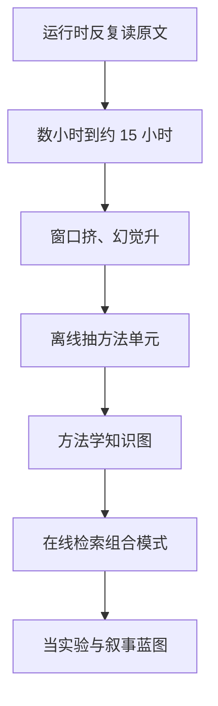

# Idea2Story：把文献理解从运行时推理挪到离线知识图

<!-- release-date: 2026-01-28 -->

**本文依据**：`Idea2Story: An Automated Pipeline for Transforming Research Concepts into Complete Scientific Narratives`，arXiv:2601.20833v1 [cs.CE] 28 Jan 2026，letter，14 页。封面署 **AgentAlpha Team**；共同一作 Tengyue Xu、Zhuoyang Qian、Gaoge Liu、Li Ling、Zhentao Zhang、Biao Wu；通讯 Harry Wang、Kris Chen。封面页眉印该 arXiv 行，未印会议名。封面正文另有 Date: January 29, 2026。文中数字均标 PDF 页码；标「外部补充」的段落不来自本文。仓库链接由封面给出：https://github.com/AgentAlphaAGI/Idea2Paper.git（PDF p. 1）。

## 一句话

现有科研 Agent 多半是 **运行时中心（runtime-centric）**：每次新想法都要在线检索、通读、摘要、再开放生成试错。作者写，整条流水线常常要数小时，有时从构思到实验要到 15 小时（PDF p. 1–2）。Idea2Story 把这件事改成 **预计算驱动**：离线从近三年 NeurIPS / ICLR 录用稿及其审稿意见里抽出可复用的方法单元，编成方法学知识图；在线只把含糊的用户意图对齐到图里的研究范式，检索组合，而不是对着原文再推理一遍（PDF p. 1、p. 2）。

它解决的不是「再加一个写论文的 Agent」，而是 **文献理解该不该每次都在上下文窗口里重做**。

## 一、旧范式：在线读文献，上下文和幻觉一起涨

封面图 1 把系统拆成两段：离线从论文语料抽方法单元、建图；在线从图里检索并组合研究模式，把未充分说明的用户意图落到具体方向（PDF p. 1 图 1）。

作者把近年端到端科研 Agent（文献综述、写代码、跑实验、起草手稿）当成已经「功能上接近完整」的背景（PDF p. 1）。卡住的是执行范式：几乎所有获取、推理、综合都在运行时当场做。每一次新尝试都要动态拉大量文献、实时读异构长文、再用开放生成扫方法与实验设计。于是单次有效发现成本很高；文献综述与实验规划本身就占掉大量推理时间，还要求模型在长上下文上保持连贯（PDF p. 1–2）。更要紧的是：底层知识其实已经写进录用论文里，系统仍反复处理非结构化、部分冗余的原文，计算开销上去，幻觉与推理错误也更容易出现（PDF p. 2）。

相关工作把这条路钉得更具体。The AI Scientist v1 能端到端，但靠手写代码模板和近似线性探索；v2 与 Kosmos 用智能体树搜索、实验管理减轻对模板的依赖（PDF p. 3）。构思侧有悖论：LLM 想法初筛显得很新，落地后却常不如人写的想法（Si 等，文内引用；PDF p. 3）。评阅侧，LLM 审稿人偏重技术正确、低估新颖性，也分不清细粒度录用档、容易被作者回复抬分（PDF p. 3）。执行侧，OpenHands、SWE-Agent 在真实代码仓上受层次依赖与有限窗口限制；Agent Laboratory 的自动评分会高估论文质量；Kosmos 会发明不透明定量指标、把统计显著当成科学价值；长程执行还会行为漂移（PDF p. 3）。

Idea2Story 的对策是把离线知识构造与在线研究生成显式拆开：离线周期收集新近录用、经同行评审的论文及其完整审稿反馈，抽核心方法单元与研究模式，把单元及其观察到的组合关系写进持续更新的结构化知识图；在线用这张图对齐意图、取高质量研究模式当蓝图，再做可行性驱动的实验，并声称能端到端生成可投稿手稿（PDF p. 2）。贡献写成三条：把自主科研形式化成预计算过程；把读论文改成对预建图的检索，以减轻窗口瓶颈与重复推理；用初步实证与对比，展示若干高质量 demo、说明端到端可行（PDF p. 2）。

后文第五节会把「端到端写完论文」收成未来工作。读封面摘要时要把这条张力留着：摘要写的是能产出若干高质量研究演示；实验正文主要是抽单元、建图、对比生成模式，不是大规模投稿验收（PDF p. 1、p. 8–11）。

把因果链摊开（机制示意，根据 PDF p. 1 图 1 与 p. 2 重画，不是实测时间轴）：

可迁移：先问「哪些知识其实已经稳定、不该每次重读」，再决定 Agent 运行时还要不要把原文塞进上下文。

## 二、离线：论文池、方法单元、知识图

第三节把用户交互定成：输入是高层、常不完整的研究直觉，不是写好的技术计划。两段分工如下（PDF p. 4）。

**离线知识构造。** 从同行评审会场策展大规模论文池，抽出可复用方法单元，编成编码语义与组合关系的知识图，作为持久的方法学抽象库，把文献理解从运行时推理里解耦（PDF p. 4）。

**在线研究生成。** 用检索与组合把非正式想法落到图上：对齐已有范式、取相关模式、把兼容单元组成具体方向；再用审稿引导的过程按新颖性、方法可靠性、概念连贯性迭代改；改完的模式当后续规划、可行性实验与端到端写稿的结构化蓝图（PDF p. 4）。

### 2.1 论文池：NeurIPS 约 5000、ICLR 约 8000

会场集合写成 $C=\{\mathrm{NeurIPS},\mathrm{ICLR}\}$，时间窗 $T$ 是最近三年。论文池

$$
\mathcal{P}=\{p\mid p\text{ 是 }T\text{ 内 }c\in C\text{ 的录用稿}\}
$$

约 5000 篇 NeurIPS、约 8000 篇 ICLR。每篇保留全文 $x_p=(\mathrm{title}_p,\mathrm{abstract}_p,\mathrm{body}_p)$，以及审稿工件 $r_p=\{\text{comments},\text{ratings},\text{confidence scores},\text{meta-reviews}\}$（PDF p. 4）。

隐私上用匿名化 $A(\cdot)$ 去掉作者与审稿人身份（姓名、单位、邮箱、显式身份指称）；再用安全过滤 $F(\cdot)$ 去掉有毒、辱骂、人身攻击。入库表示 $\tilde{p}=F(A(p))$，去标识池 $\tilde{\mathcal{P}}=\{\tilde{p}\mid p\in\mathcal{P}\}$（PDF p. 4）。

实验节把同一语料说成过去三年 ICLR 与 NeurIPS 录用稿，约 13K 篇及其审稿，作为后续分析的基础（PDF p. 8）。5000 加 8000 与 13K 是同一量级的两种写法，文中没有给出精确去重后的整数。

### 2.2 方法单元：问题怎么被表述或求解，而不是超参怎么调

抽取写成映射 $\mathcal{E}:\tilde{p}\mapsto U_p=\{u_p^{(1)},\ldots,u_p^{(K_p)}\}$，$U_p$ 是少量抓住该文核心技术想法的方法单元（PDF p. 5）。图 2 说明抽取利用论文的标准结构：引言给动机与问题表述，方法节给建模假设、学习目标、架构、优化，实验节给这些机制如何落地与评测。聚合后要隔离的是主要算法或建模贡献，不是表层实验细节（PDF p. 5）。

方法单元 $u\in U_p$ 定义为：对「问题如何被表述或求解」的自包含描述，抽掉具体实现选择与实验配置。数据集挑选、超参、工程级优化默认排除，除非它们实质改变了问题表述、模型结构或学习目标。多数论文产出一个或少数单元。单元再规范化成结构化属性：不可再分的原子元方法，以及一篇论文里多个单元如何组合的组合级模式（PDF p. 5）。

每篇再用嵌入 $z_p=g(U_p)$。为诱导更高层研究模式，先 $y_p=\mathrm{UMAP}(z_p)$ 保局部语义邻域，再对降维表示做 DBSCAN，得到划分 $\mathcal{C}=\{C_1,\ldots,C_M\}$，每个簇对应一个连贯研究模式（PDF p. 5）。这些簇是跨文献反复出现的方法结构，后面检索与组合都站在这一层，而不是单篇论文。

图 3 的抽取样例来自录用稿 *Learning Dynamics of LLM Finetuning*：Base Problem 是微调时单个训练例如何影响预测；Solution Pattern 是逐步影响累积的分析框架；Story 把学习动力学接到幻觉与对齐；Application 只点下游含义，不枚举基准（PDF p. 8）。作者用它说明：抽取 Agent 滤掉实现级细节，把论文表示成可复用单元，而不是实验零件清单（PDF p. 8–9）。

### 2.3 知识图：节点是规范化单元，边是同篇共现

图定义为有向图 $G=(V,E)$。节点是规范化后的方法单元或元方法：跨语料把语义相近的单元归到共享元方法，压表层变体、留方法意图。边编码组合关系：对论文 $p$ 的单元集 $U_p$，在成对单元之间加有向边，表示它们作为同一方法流水线被共同实例化。边是先验工作里观察到的兼容性证据，不是手写假设关系（PDF p. 5–6）。

全语料聚合后，图同时编码两层：可复用元素（规范化单元与元方法），以及录用稿共现统计诱导的组合约束。于是可以在高于单篇的抽象层上想方法，同时仍钉在观察到的研究实践上（PDF p. 6）。图 2 还写：抽取层包括核心研究想法、领域上下文、高层故事骨架、包装动作；审稿反馈作为额外信号，用来 refinement 关系、校验抽象（PDF p. 5 图 2）。

图 4 看高频领域诱导的子结构：呈 hub-and-spoke，少数高频领域连到大量论文与模式。许多模式同时跨多个领域；论文级节点通常只挂一个领域，模式级节点常在弱连领域之间当桥。作者据此说图编码了实例级工件与可复用抽象两层，检索不必只靠领域或单篇相似（PDF p. 9）。

**旧问题 → 新设计 → 机制 → 收益 → 代价。** 运行时重读原文贵且脆；改成离线单元加共现图，运行时变成检索。代价是：会场只收了 NeurIPS 与 ICLR 三年录用稿；单元边界靠 LLM 抽取，文中没有报告抽取精度；图边是共现，不是因果可组合性证明。

可迁移：知识图的边尽量来自「已经一起成功过」的证据，而不是模型临时编的搭配。

## 三、在线：多视图检索，再用 LLM 审稿圈 refinement

给定目标，方法发现被当成 $G$ 上的图检索与组合：取相关子图，沿连通约束组合兼容单元，得到对应结构化组合的候选研究模式，作为意图与实验设计之间的高层蓝图（PDF p. 6）。

### 3.1 三路打分：idea、domain、paper

用户用自然语言给想法 $q$，模式集合仍是 $\mathcal{C}$。不用单一相似度，而用多视图聚合（PDF p. 6–7）

$$
s(C_m\mid q)=\sum_{v\in\mathcal{V}}\lambda_v\,s_v(C_m\mid q)
$$

其中 $\mathcal{V}=\{\mathrm{idea},\mathrm{domain},\mathrm{paper}\}$，$\lambda_v$ 是固定权重。

**想法层。** 对模式 $C_m$ 关联的已存想法取最大语义相似：$s_{\mathrm{idea}}(C_m\mid q)=\max_{i\in I(C_m)}\mathrm{sim}_{\mathrm{idea}}(q,i)$（PDF p. 7）。

**领域层。** $s_{\mathrm{domain}}(C_m\mid q)=\sum_{d\in D(C_m)}\mathrm{sim}_{\mathrm{domain}}(q,d)\,w(d,C_m)$，$w$ 来自知识图里的经验有效性信号（PDF p. 7）。

**论文层。** $s_{\mathrm{paper}}(C_m\mid q)=\max_{p\in P(C_m)}\mathrm{sim}_{\mathrm{paper}}(q,p)\cdot\alpha(p)$，$\alpha(p)$ 是从同行评审元数据来的质量权重（PDF p. 7）。

最终按聚合分降序得到 $C^*(q)$（PDF p. 7）。文中没有给出 $\lambda_v$ 的数值，也没有报告检索的 nDCG 一类指标。

### 3.2 审稿引导的 generate–review–revise

检索之后，用显式 LLM 审稿环 refinement。每轮让大模型当审稿人，按技术可靠性、相对已有文献的新颖性、问题–方法对齐的清晰度打分，并给具体修改建议（PDF p. 7）。反馈不够新，就在同一模式族里重组兼容单元或换实现；可行性或表述含糊，就改问题定义或方法结构。改完再送回同一审稿过程（PDF p. 7）。

为防失控漂移：只有审稿分数提高的修订才留下，否则回滚。循环直到审稿人认为足够新、连贯、技术上说得通，或再迭代不再提升。输出是经过 LLM 审稿人 vet 过、可供下游校验与写稿的 refinement 模式（PDF p. 8）。

这里的「审稿人」仍是 LLM。相关工作刚写过 LLM 审稿偏重正确性、低估新颖性、会拍马。作者没有在本节用人类审稿对照这个环，实验里的外部评价另用 Gemini 3 Pro（PDF p. 3、p. 9）。

## 四、实验：定性为主，对照的是「直接让 LLM 写故事」

评测焦点是：能否抽出可复用方法结构，以及能否从含糊用户输入生成高质量研究模式。语料即前述约 13K 录用稿及审稿（PDF p. 8）。先分析抽出单元的性质，再展示实例化成结构化研究故事的定性 demo（PDF p. 8）。

实现细节：额外在一小批代表案例上做定性实验。外部合作者策展了 **三个** 用户研究想法。Idea2Story 用 **GLM-4.7** 作语言骨干生成模式。基线是同一模型直接提示写出完整研究故事，不做显式模式建模或检索（PDF p. 8）。GLM-4.7 的文献引用指向 Zeng 等 GLM-4.5 技术报告（PDF p. 8、p. 13），文中没有另给 4.7 的规格表。

表 1 的对照输入是同一句含糊意图：`I want to build an e-commerce agent that can better understand user intent.` Idea2Story 一侧标题是 IntentDiff（结构演化与上下文感知扩散，把意图分类重写成动态结构推理）；直接生成一侧是 EcoIntent（上下文感知、多粒度、层次对比学习的判别式双流）（PDF p. 10 表 1）。作者强调比的不是文笔，而是当作方法蓝图：如何框问题、指缺口、把组件组织成一条路。Idea2Story 倾向更高层的问题改写；直接 LLM 多半停在常规任务表述，靠再叠上下文建模与层次目标来「变强」（PDF p. 9）。

为减评价偏差，两边生成的研究故事交给 **未参与生成** 的 Gemini 3 Pro，按新颖性、方法实质、整体研究质量比较，且看不到生成方法。作者写：所有评价案例都偏向 Idea2Story；直接生成更停在高层抽象、方法落地更虚、更依赖相对标准的技术（PDF p. 9–10）。文中没有给出三人案例的逐条分数表，也没有人类评审。

封面与贡献条仍写「若干高质量研究 demo、端到端可行」（PDF p. 1–2）。第四节没有报告投稿录用、实验可复现率、或相对 AI Scientist 的墙钟时间。15 小时是对 Lu 等流水线的引用，不是本文系统自己的测时（PDF p. 1–2）。

附录第 14 页无正文（PDF p. 14）。

## 五、未来工作把闭环又打开

第五节写：当前焦点是把含糊意图落到结构化高质量模式；重要下一步是接到完全闭环的研究生成流水线——实验驱动 Agent 去实例化、校验、用经验反馈 refinement，包括自动实验设计、数据集选择与初步执行；实验结果再回来改故事。再往后，才系统地把 refinement 过的模式译成完整草稿（方法、结果、讨论）。作者认为，只有钉在经验校验过的模式上，写稿才不会停在表层文本生成（PDF p. 10–11）。

结论重申预计算框架、持续更新知识图、相对直接 LLM 有更清晰的问题改写与更强方法结构；展望是接实验 Agent，从抽象模式走到校验过的经验结果（PDF p. 11）。

因此：封面「feasibility-driven experimentation」和「submission-ready paper」是框架叙事；本 PDF 实证停在抽单元、图结构观察、以及三个想法上的模式对照。不要把第五节还没做的闭环写成已经测过。

## 六、限制（报告写了的，和没写的）

报告写了的边界：

- 会场只有 NeurIPS 与 ICLR，时间窗三年（PDF p. 4）。
- 评测是定性加小样本（三想法）、LLM 当生成器也当（另一家）评价器（PDF p. 8–10）。
- 抽取、检索权重、DBSCAN / UMAP 超参、图规模（节点边数）均未给可复现配方。
- 仓库名是 Idea2Paper，论文名是 Idea2Story（PDF p. 1）。

报告没写、本文也不补：相对 AI Scientist 的小时数对比、人类专家是否同意 Gemini 的偏好、方法单元抽取的一致率、知识图是否真的随新录用稿持续更新的工程周期。

## 可迁移启发

1. **预计算对运行时。** 稳定、高度重叠的文献理解适合离线压成图；运行时只检索。这比「每次多召回几篇再摘要」更接近在治窗口与幻觉的根。
2. **单元不要绑死实现。** 可复用的是问题表述与求解模式，不是数据集名单。图 3 把 Base Problem / Solution Pattern / Story 拆开，是可直接抄的卡片格式。
3. **边来自共现，不是来自想象。** 组合约束从录用稿里一起出现过的单元来，比开放生成「再发明一套搭配」更可审计。
4. **LLM 审稿环要有回滚。** 只留分数提高的修订，否则漂移。但不要把 LLM 审稿分数当成人类录用边界——本文相关工作已经警告过这一点。
5. **对照实验要看框问题的方式，不只看形容词。** 表 1 有用的是「静态分类 vs 结构演化」，不是标题是否更响。

## 关键词回看

- **运行时中心执行**：每次新研究都在线读文献、开放试错。
- **预计算驱动**：文献理解离线完成，运行时检索知识图。
- **方法单元**：抽掉实现细节后的问题表述 / 求解描述。
- **研究模式**：UMAP+DBSCAN 诱导的、跨论文的方法结构簇。
- **多视图检索**：idea / domain / paper 三路加权。
- **审稿引导 refinement**：LLM 审稿 + 只接受提分修订。
