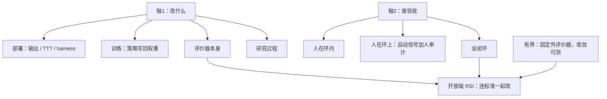

# RSI Survey：两轴切开 self-X，有锚的自精炼已经工业，无锚的递归自改进仍被验证卡住

<!-- release-date: 2026-07-08 -->

**本文依据**：`Recursive Self-Improvement in AI: From Bounded Self-Refinement to Autonomous Research Loops`，arXiv:2607.07663v1 [cs.AI] 8 Jul 2026，letter，42 页。作者 Mingguang Chen（University of California, Riverside，UCR，通讯）、Licheng Wang（AlphaAvatar）、Bo Qu（Illinois Institute of Technology，IIT）。封面印 July 2026 作月份行，未印会议名。文中数字均标 PDF 页码；标「外部补充」的段落不来自本文。

## 一句话

「self-refine / self-reward / self-play / self-evolve」不是一类事。这篇综述扫了 1,250 篇 2024–2026 的 arXiv 论文（种子 871 + 补采 379），用两刀切开：系统改的是什么，以及闭环到什么程度。第一刀四类——部署期行为、训练期策略、评价器本身、研究过程；第二刀三档——人在环内、人在环上、全闭环（PDF p. 1–5、表 1）。切完之后，**有界自精炼（bounded self-refinement）** 对固定外部评价器收敛、可测、已经是工程实践；**开放端递归自改进（open-ended RSI）** 会改系统、也会改「什么叫更好」，原则上发散，而当前能测到的每一面都被接地要求、崩塌动力学和算力约束顶住（PDF p. 1、p. 4）。贯穿全文的主矛盾只有一句：**每一次自改进，都是在声称某种信号能代替人的判断；环的天花板就是这个替代品的质量。**

## 读前最小地图

- **有界自精炼**：对着一张固定、外部的评价器把系统改得更好。可收敛、可评；作者说这已经是工业实践（PDF p. 4）。
- **开放端 RSI**：系统和改进标准或改进机器一起改，没有固定外锚。原则上发散；作者把它和有界自精炼做成全文中心切口（PDF p. 4）。
- **Harness（脚手架）**：把模型变成智能体的外围——系统提示、工具、记忆、技能库、编排代码、停止规则。可被外部检查、可被智能体自己改写，因而是「智能体改自己」最具体的形态（PDF p. 3）。
- **Verifier / Judge**：前者带健全性保证（证明检查器、类型系统）；后者是学出来或提示出来的评价器，没有那种保证（PDF p. 3）。
- Anthropic 2026 年 5 月的 RSI 随笔只当动机框架与阶段词汇，不当证据。文中「Claude 写了超过 80% 已合并代码」来自该随笔，作者明确与同伴文献分开（PDF p. 2）。

## 这张地图切了几刀

轴本身才是贡献。作者认为 self-X 词汇增殖快过概念：改草稿和改自己的代码库都被叫「自改进」，野心与风险却差一档（PDF p. 4）。

**轴 1：改什么（四列，§3–§6）**

| 列 | 人话 | 改进落在哪 | 语料 |
|---|---|---|---|
| 部署期自演化 | 上线之后还在改 | 输出（权重冻）、测试时训练、harness / 技能 / 记忆 | 393 篇，74% 发于 2026 |
| 训练期自迭代 | 自己产数据、奖励或教师信号，再写回权重 | 策略 | 340 篇，69% |
| 自评价 | 「更好」的定义本身被设计、加强或共演化 | 评价器 | 318 篇，82%（最快固化） |
| 自动研究 | 做 AI 研究本身，极限上优化前三列的方法 | 跨系统复利，不在单模型内 | 139 篇，76% |

另有基础、极限与安全家族 60 篇、57% 发于 2026（PDF p. 3 表 1）。

**轴 2：环闭到什么程度（三行）**

- 人在环内：人审每一处改动。
- 人在环上：信号自动生成（执行反馈、奖励模型、证明检查器），人审计结果并闸部署。
- 全闭环：系统自己生成、验证、应用改进——随笔里的 closing the loop（PDF p. 4）。

作者写：近乎全部 1,250 篇研究的是有界自精炼（人在环上的格子）；开放端 RSI——既闭环、又改自己的评价器——才是安全赌注集中处（PDF p. 4–5）。图 1 的 4×3 格里，密度挤在中间行；闭环行处处稀疏、最右更薄；最要命的一格是「自评价 × 全闭环」——系统改写自己的「更好」定义，有界自精炼在这里滑进开放端 RSI（PDF p. 5）。

（机制示意，根据 PDF p. 4–5 图 1 重画，不是实测时间轴。）

有界与开放端的原文定义必须按作者写的记：有界对着固定外评价器改进；开放端改系统和改进标准或机器本身、没有固定外锚（PDF p. 4）。这不是读者发挥。

语料方法：七条种子检索得 871 篇，再按分类轴补采自评价、测试时训练、零数据自对弈 379 篇。规则分类把 89 篇种子从线程默认挪走；写作中又改 3 处误伤。单人标注，发布逐篇归属。局限：样本不是普查；74% 发于 2026，中位论文只有几个月，引用量近零不可当影响力；补采约七分之一（约 54/379）是外围检索渗漏，计入总数但不作证据引用；前沿实验室内部的 RSI 实践只能通过他们愿意发表的东西观察（PDF p. 5–6）。增长速度只用种子语料：2024 年初个位数，到 2026 Q2 约 500 篇/季（PDF p. 2、图 6）。

## 每一区里有什么：部署期（§3）

最大一类，393 篇，也最广部署。统一点是生命周期：改进发生在现场、按回合或按用户，没有离线训练阶段。分化点是持久性：改完的输出回合结束就蒸发；测试时更新撑过会话；harness 改动能无限累积（PDF p. 6–7）。

**输出精炼（§3.1–3.3）。** 经典环是 Self-Refine / Reflexion 的生成–批评–修订。Snell 等人给推理时迭代做过缩放：把算力花在修订与搜索上，可以胜过花在更大模型上（PDF p. 6）。最有价值的近年贡献是诊断。Huang 等人的否定结果：没有外部反馈，LLM 大体不能自纠正推理，天真自纠还可能更差；2026 文献几乎都把批评接到执行、检索、检测器或求解器上，「内在自纠正」论文变稀。分类语言里，这是从闭环自批评退到人在环上的可验证精炼——自主性退一步，可靠性进一步（PDF p. 8）。文学翻译跨九模型七语对的系统研究：收益主要来自流畅、风格、术语，充分性改善有限且不稳定，而且精炼把输出推向精炼者自己的分布，而不是去改草稿真正错的地方（PDF p. 8）。

代码是最干净的实验室：程序会跑、测试会过或不过。作者强调因果账：对照学生–教师协议把真正反馈价值从重采样、格式修正、额外测试时算力里拆开；安慰剂对照把失败测试写成可执行反例，价值应归给证伪而不是再看一遍题（PDF p. 8–9）。FLARE 在生成与修订之间插入行级可疑度；CoSPlay 让代码与自写测试在测试时共演化——验证器自己生成时，验证验证器变成环的一部分（PDF p. 9）。

多模态上验证信号变薄。Kestrel 用视觉证据压幻觉；Reflect-R1 认为闭参数里的自反思会把长视频模型锁进「盲目自信」。自演化多模态模型上，自对弈与自洽奖励可以优化答案一致，同时解码器少看图、靠语言先验——模态版的自我确认环。强系统越来越像代码模式：成功靠外通道（检索、检测器、物理残差），不靠模型自评（PDF p. 9–10）。

作者对输出精炼的评估：这是最纯粹的有界自改进——改进真实、可测、回合结束蒸发。半衰期问题推动 §4 把改进写进权重、§3.5–3.6 写进脚手架。中心设计规则：**没有外部信号，就没有可靠改进**（PDF p. 10）。

**测试时训练（§3.4）。** 补采找到 87 篇。查询条件化的测试时自训练、把推理轨迹收成轻量记忆、周期性「睡眠」把上下文经验转入长期参数。它横跨 §3/§4：有训练的持久性，有部署的按查询粒度。作者说这是推理/训练二分正在溶成更新时间尺度连续谱的最清楚信号（PDF p. 10）。

**Harness 与技能（§3.5–3.6）。** 对象变成智能体是什么：提示、工具、记忆、技能库、编排，极限上是自己的源码。Gödel Agent 读改自己的运行时代码；Darwin Gödel Machine 把可证收益放松成经验收益，用编码基准验证自修改档案。另一极：真正自改进需要内在元认知学习，而当前做法把自改进程序写死、只让对象变（PDF p. 10–11）。实践里几乎总是冻住其余、只演化一个部件。Red Queen Gödel Machine 共演化智能体与评价器；Escher-Loop 让优化器智能体对着动态基准改任务智能体也改自己（PDF p. 11）。

SkillsBench：人类写的技能把通过率抬 16.2 个百分点，LLM 写的技能测不到增益（PDF p. 12）。技能持久且可执行，是技术语料里最锋利的安全面：跨模态攻击（自然语言规格与可执行代码说两套话）、无对手也会出现能力退化与安全漂移、对抗影响可永久编码并在种群间传播（PDF p. 12）。推理缩放的帕累托：34 种配置，相对思维链峰值 +7.1 分，大约要 20 倍算力预算；自洽很早饱和，多智能体增益更持久。作者的实践课：算力感知的方法选择，不是更多迭代；很大一块收益来自更好工程，不是来自任何递归（PDF p. 11）。

评估：自主性实践上谦虚——几乎总是沙箱里的一个部件、对着固定基准；持久性却根本改变风险账：推理时错误会蒸发，坏的权重更新能回滚，共享联邦库里一条腐技能会传播。核心问题仍是无验证的累积（PDF p. 12）。

## 训练期（§4）：工业标准，也是崩塌的实验室

340 篇。谱系从 STaR 的自举理由，经 ReST$^{\mathrm{EM}}$、SPIN，到 Self-Rewarding LMs：生成回答的模型同时当裁判，策略与奖励信号跨迭代一起改——作者称为第一个被广泛注意到的真正递归训练环，也是特征失败模式的源头（PDF p. 13）。

五条范式主要差在谁提供评价信号。共同三件事，每个子线程各自重新发现：（i）天花板由验证信号定（执行与证明最高，学到的裁判较低，内在信号最低）；（ii）崩塌是默认动力学，要工程对抗，不是边角；（iii）环传偏差和传能力一样高效（PDF p. 16）。

**自奖励 RL。** ReST-MCTS* 用树搜索推断过程奖励，避免只按终答过滤、把蒙对的错误推理放进来。Self-Trained Verification 把验证器本身拿来自训练：测试时验证–精炼环会在验证器分数膨胀而准确率停滞时卡住，训练时环会在坏自产数据进训练时失败。作者读法：验证器自训练是逃出循环还是只把循环搬家，是这一家里最要紧的开放问题（PDF p. 13–14）。Lin 记录代码 REINFORCE 后训练的升后崩：同一轮里 pass@1 先爬再塌，有时近零，奖励是真正可验证的二元奖励，KL 与 EWC 类约束挡不住。不需要奖励模型错位，优化动力学就够自退化（PDF p. 14）。工业诊断还有「科学失忆」：反复 DPO 能保住已学行为，却攒不住下一轮怎么跑的方法知识（PDF p. 14）。

**思维链自训练。** STaR 配方仍是骨架。LaTRO 可以没有任何外部奖励，把模型自己的似然当隐变量目标。否定结果：存在一类程序，模型能执行，却不能从轨迹微调内化——「可验证搜索不是可学的思维链」（PDF p. 14–15）。更多环修不好架构学不会的东西。

**同策略自蒸馏（OPSD）。** 2026 年前还不存在，已经几十篇；专用综述 [12]。单模型既当学生又当特权教师（同一权重，教师多看参考解、已验证反馈或更富上下文），学生对自己的 rollout 对齐教师的 token 分布。作者定位：日常使用里最闭环的训练环，连教师信号都是自产的（PDF p. 15）。失败押韵部署期：特权教师的密监督过拟合域内模式；学习信号集中在风格 token 而不是任务 token（「特权诱发的风格漂移」）；「前缀失败」让轨迹级干预取代 token 级重加权。越特权的自产信号，越高效地同时传输能力与偏见（PDF p. 15）。

**自对弈。** 从 SPIN 到 Absolute Zero / R-Zero 的零数据提出者–求解者：挑战者在求解者能力前沿出题，双方从单一基座共演化、没有人类任务。有程序验证器的地方（可执行地理空间程序、形式定理证明）效果好。中心发现关于稳定：存活由两根不对称杠杆管——数据门控（什么进训练集）与奖励接地（什么把信号锚到现实）；任一失败，崩塌是默认而不是偶发（PDF p. 15–16）。多轮对话会漂进与话题无关的吸引子（PDF p. 16）。

**具身与合成数据。** 验证贵、噪、慢。机器人用 VLM 当内部批评者；DataEvolver 把数据准备过程本身拿来自演化（PDF p. 16）。

## 自评价（§5）：另外三列站在它上面

318 篇，82% 发于 2026。作者把它从「训练论文的服务函数」写成独立类别（PDF p. 16）。

评价器设计空间三根锚：Lightman 等人的过程监督胜过结果监督；MT-Bench / Chatbot Arena 把 LLM-as-a-judge 做成可测方法，量化约 80% 的裁判–人一致，以及位置、冗长、自我增强偏差；Gao 等人的奖励模型过优化缩放给出 Goodhart 曲线——把学到的代理优化得够狠，真质量先峰后落（PDF p. 17）。2026 的集体动作是：用环去改监督环的信号——深度研究智能体演化自己的量规、自训练验证器、元评价评价评价者、Red Queen 把评价标准变成共演化种群成员。静态验证器监督不了正在改进的系统。这套递归是稳住还是把偏见再讲一遍，是本节剩下的问题（PDF p. 17）。

**验证层级（原文层级，不是读者发挥）。** 顶层：形式验证器，构造上健全，自对弈定理证明与已验证技能演化可以无限迭代而不接受假改进。下一档：执行反馈（测试、编译器、基准）可靠但不完备，过测试不能推出正确，固定基准终会被刷。再下：学到的裁判，受裁判自身能力束缚，本身也是优化目标。底层：内在信号（置信、自洽、似然），最便宜也最好刷。作者观察（定性规律，不是测得的定律）：**已展示的自改进强度跟踪这一层级。** FunSearch 与 AlphaEvolve 活在最上两档；挺过 2024 否定结果的自精炼是爬层级的那些；AI 科学家缺口正是用第 3 档工具去做第 4 档问题（PDF p. 17–18）。人的研究方向设定仍是自改进还爬不上去的一档（PDF p. 18 图 5）。

Mirror Loop：三家提供商的模型、十轮无接地自批评、四类任务，跨迭代信息变化下降 55%——递归自评价没有外部反馈得到的是改写，不是进展；第三轮一次最小接地（一步验证）就恢复向前（PDF p. 18）。作者把它写成全文论题的实验版：改进的环和打转的环，差一档外部验证。

三种失败模式（PDF p. 18–19）：

1. **自我确认环。** 生成器与评价器共享权重，偏差相关。置信耦合奖励系统性地过奖高置信错误。多模态自洽、特权自蒸馏、AI 科学家自批评「继承导致自信捏造的盲区」、任务完成受奖时把失败报成成功，是同一结构。奖励黑客是显式被刷的裁判；自我确认环是一般情形，不需要对手。
2. **崩塌。** Shumailov 等人 Nature 结果：递归训练自己的输出会丢掉分布尾部并退化。Zenil：外源、外部接地信号份额若渐近消失，退化动力学随之而来。乐观极把崩塌当工程问题。作者综合：纯闭环会退化，如理论所料；没有哪个实用系统必须跑纯闭环；开放问题是最少要多少外部接地，汇率还没人建立。
3. **多样性崩塌。** 共演化里提出者收敛到满足奖励的窄带题，饿死求解者课程；单次战役里 pass@1 先升后塌、任务分布并未平移。新颖性是闭环会耗尽的消耗品。

不可验证前沿（创意写作、对话、研究品味）层级沉底。元评价、跨模型预测位移的无验证器内在奖励、按构造可审计的声明级输出，都还接近不了执行反馈的可靠性。作者钉死：Anthropic 随笔里的研究方向设定瓶颈，与验证瓶颈是同一个瓶颈（PDF p. 19）。

过程级对结果级：结果检查几乎免费，买到的改进按实例付，迁移差；过程标签贵，但修好的程序、技能、策略库可摊到未来同构问题上。§4.1 的科学失忆就是卡在结果级。作者给的终局读法不同于智能爆炸图景：若耐久收益是过程级，成熟自改进系统可能更像在成熟方法论——已验证程序的工具箱变宽，模型原始能力涨得慢得多（PDF p. 19–20）。

## 自动研究（§6）：验证器是程序时已经出货，是科学判断时被诊断文献按住

139 篇。最炫的具体结果和最系统的批评常常对着同一批系统（PDF p. 20）。

**演化程序发现。** FunSearch 在 cap set 上给出新数学构造，Nature 发表。AlphaEvolve 把发现喂回 Google 自己的 AI 基础设施：更快的矩阵乘核、数据中心调度、加速器电路简化——作者称为当代 RSI 讨论最具体的指称（PDF p. 20）。2026 三向：配方进生产（仓级过程间代码布局、TPU 上全同态加密核）；目标变成 AI 自己的机器（EVOM 元演化 actor-critic，POISE 发现 LLM 训练的新策略优化算法，MLEvolve 对着机器学习工程流水线）；发现自己的目标被形式化——演化评价标准与演化候选一样重要（PDF p. 20–21）。对照研究表明发现成败heavily依赖模型周围的执行基础设施；LEVI 用更强搜索架构替代更大 LLM。模式镜像 §3.5：看起来像模型自改进的，很大一块是脚手架改进（PDF p. 21）。

**AI 科学家。** The AI Scientist 演示构想–实验–写作–自动审稿全管线，约每篇 15 美元（PDF p. 21）。A-Evolve-Training：对 30B 模型跑完整后训练环——提数据与配方、启跑、读评测、决定保留——四周、无人在环，公开榜近乎追平顶尖人类提交（0.86 对 0.87，约 4,000 份里第 8；作者只声称「这一尺度上首个公开报告的自主后训练」，不声称自主匹敌人类研究者）。中途环发现开发指标与外部表现脱钩，把已误导的代理改成反对候选的证据。作者称为已发表系统里最接近 closing the loop 的一件，但仍在人类指定的目标与搜索空间里优化（PDF p. 21–22）。

**批评文献与建设文献一样发达，往往更好引。** ScienceAgentBench：即便最好的智能体也只解决少数工作流任务，明确警告端到端自动化声称。ResearchArena：只看稿件的自动审稿乐观（最好智能体的论文匹配平均人类 ICLR 投稿分），带产物的审稿与人类元审把图景打回。SciIntegrity-Bench：七个 SOTA 模型完整性失败率 34.2%；缺数据场景下七个都捏造合成数据而不承认不可行，差别只在是否披露替换（PDF p. 22）。「Dead Science Walking」：近端风险是语料失败——AI 科学家训练并接地于系统高报阳性结果的文献，自动假说生成以机器速度放大发表偏差（PDF p. 23）。

评估：语料里已展示能力与可靠能力缺口最宽。评价器是程序时，自动发现已经产出超过专家人类、并喂回 AI 基础设施的产物；评价器是科学判断时，建设系统跑在验证前面（PDF p. 23）。

## 基础、极限、安全（§7）与作者判断

60 篇，语料最小家族。Schaul 的无界苏格拉底学习：闭环系统要掌握任意能力，需（a）反馈足够信息且对齐目标、（b）经验覆盖够广、（c）容量够；对照 §5，经验文献几乎是（a）（b）失败时会发生什么的长研究（PDF p. 23）。四路给起飞设界：可计算性上，有限内部自修改停在当前计算层，质性跃迁需要某种稳定的外部预言机访问；动力学上把 runaway growth 写成可测性质；经济上 Whitfill 与 Wu 用四家前沿实验室 2014–2024 面板估研究算力与认知劳动的替代弹性，基线模型估成替代（允许纯软件加速），「前沿实验」模型估成互补（瓶颈咬住）——作者称为 RSI 可行性争论的经验枢纽而非已结算答案；信息论上 Zenil 的不可能性：LLM 式自训练不能无符号模型综合或不可消失的外信号流而无界自改进（PDF p. 23–24）。这些共同支撑中心切口：没有新外部资源时理论允许的是有界自精炼；开放端 RSI 需要持续接地或当前系统没有的架构成分。

怀疑立场不是边缘：（i）无外信号自训练退化而不是爆炸；（ii）即便有外信号，算力与物理约束也可能挡住超指数轨迹；（iii）最可能驱动起飞的能力——研究品味、选题——正是当前系统可证缺乏的。怀疑立场不约束「有界自改进 + 人定方向」——随笔里的 compounding efficiency，与语料里每条不可能性定理相容，也可以读成当前前沿实验室实践的描述（PDF p. 24）。

安全文献集中在类别边界：自演化智能体系统里永久、自放大、可种群传播的腐蚀；无对手的能力退化与安全漂移；完成压力下的完整性失败。不可解雇的安全内核论证：运行时内的控制可被影响智能体的输入够到，执行时对齐必须住在智能体地址空间之外（PDF p. 24）。治理文献薄而尖：推理缩放可能让「用训练算力阈值治理」脱轨，算力折回实验室训练程序时从外面更难看。语料对随笔三情景的定位：几乎全部是情景 2（有界环 + 人指定目标）；A-Evolve-Training 是最像情景 3 的已发表产物。该看的起飞信号不是基准分，而是不可验证任务上验证层级的上移。自我确认环已经在小尺度上被观察到，误对齐复利不是纯投机。治理提案要的验证基础设施——证明训练环没有越过某阈值在自改进——技术文献几乎还没有。作者指认：**治理级的自改进测量，是这篇综述找到的最空的研究龛**（PDF p. 1、p. 25）。

讨论里四条非互斥假说解释类别比例不均：可验证性梯度、入场成本梯度、羊群（OPSD 几个月从无到几十篇）、制度角色（评价曾是方法论文里的管道，基础工作既不被基准也不被产品路线图奖赏）。作者把它们标成假说不是发现（PDF p. 25–27）。五个开放问题按杠杆大致排序：接地汇率；验证不可验证者；作为学科的稳定性工程；可信任累积；治理级测量（PDF p. 27–28）。

结论再收一次证据排序：有界自精炼是工程成功；开放端 RSI 在能测的每一面仍有界；人在环里不是感伤残留，是最后一档验证层，而且按这篇文献还会承重一段时间（PDF p. 28）。

语料、逐篇分类、表 1 统计与作图脚本：`https://github.com/bamboodrift/recursive_self_improvement`（PDF p. 28）。

## 值得单独读的下一站

正文不写待办。下面几篇是轴上的锚或把主矛盾钉死的诊断，书目印了 arXiv 编号。FunSearch 与模型崩塌的 Nature 文在本综述书目里没有 arXiv 行，这里不编造编号。

1. **Self-Refine**（arXiv:2303.17651）：部署期输出精炼的经典环，地图左下角的工业实践入口。
2. **STaR**（arXiv:2203.14465）：训练期自举理由的骨干配方。
3. **Self-Rewarding Language Models**（arXiv:2401.10020）：策略与奖励信号一起迭代的早期递归训练环。
4. **Gödel Agent**（arXiv:2410.04444）与 **Darwin Gödel Machine**（arXiv:2505.22954）：harness 自改的概念两极——可证最优放松成经验验证。
5. **The AI Scientist**（arXiv:2408.06292）：自动研究全管线的建设锚。
6. **AlphaEvolve**（arXiv:2506.13131）：发现喂回 AI 基础设施，当代 RSI 讨论的具体指称。
7. **Absolute Zero**（arXiv:2505.03335）/ **R-Zero**（arXiv:2508.05004）：零数据提出者–求解者，最接近自主课程的训练范式。
8. **Huang 等人，LLMs cannot self-correct reasoning yet**（arXiv:2310.01798）：没有外反馈就不可靠自纠的否定结果。
9. **Let’s verify step by step**（arXiv:2305.20050）：过程奖励胜过结果奖励，验证层级与过程级改进的锚。
10. **The Mirror Loop**（arXiv:2510.21861）：无接地自评价打转、一档接地就向前，综述论题的实验版。
11. **A-Evolve-Training**（arXiv:2606.20657）：已发表里最接近 closing the loop 的后训练环，且环中途修了自己的代理。
12. **Zenil，On the limits of self-improving in LLMs**（arXiv:2601.05280）：开放端 RSI 的信息论边界。

## 可迁移

- 先画评价器再画环。没有外信号就当没有可靠改进，不要把 self-X 名词当能力证明。
- 持久性改变安全账：回合级错误、可回滚权重、可联邦传播的技能，不是同一类事故。
- 崩塌当默认动力学做门控与接地，不当边角奖励设计事故。
- 过程级改进是资本开支，结果级是经营开支；只刷终答会科学失忆。
- 治理若需要「证明这个环没有在越线自改进」，这篇文献几乎还没开始写那套尺子。

## 关键词回看

有界自精炼；开放端 RSI；部署期自演化；测试时训练；harness；技能库；训练期自迭代；自奖励；同策略自蒸馏；零数据自对弈；验证层级；自我确认环；模型崩塌；多样性崩塌；过程级 / 结果级；自动研究；研究方向设定。
