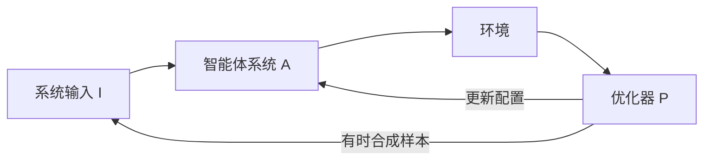

# 自进化智能体：部署后不再手改配置，用环境反馈把系统本身当成可优化对象

<!-- release-date: 2025-08-10 -->

**本文依据**：`A Comprehensive Survey of Self-Evolving AI Agents: A New Paradigm Bridging Foundation Models and Lifelong Agentic Systems`，arXiv:2508.07407v2 [cs.AI] 31 Aug 2025，letter，55 页。共同一作 Jinyuan Fang、Yanwen Peng、Xi Zhang；通讯 Zaiqiao Meng。一作单位 1 为 University of Glasgow；其余单位含 Sheffield、MBZUAI、NUS、Cambridge、UCL、Aberdeen、Leiden。封面页眉印该 arXiv 行，未印会议名。文中数字均标 PDF 页码；标「外部补充」的段落不来自本文。封面与摘要自称 survey。

## 一句话

多数智能体系统仍靠人手配好提示、工具与拓扑，上线后冻结（PDF p. 2）。真实环境却在变：意图、工具、政策都会漂移。这篇综述把「自进化」钉成一条闭环：系统输入、智能体系统、环境、优化器四件套，用环境反馈迭代改内部组件，同时要求先保安全、再保性能、最后才允许自主进化（PDF p. 2–4、p. 9–11）。进化对象按原文是：基础模型、提示、记忆、工具、工作流拓扑，以及智能体之间的通信机制（PDF p. 4）。它解决的不是再多一个 Agent 框架名词，而是 **静态基座模型与终身可适应系统之间缺一张可比较的地图。**

## 这张地图切了几刀

轴本身是这篇综述的主要贡献，比它列了多少篇名字重要。

**第一刀：学习范式，从冻结核到终身环。** 图 1 与表 1 把 LLM 中心学习写成四段（PDF p. 1–4）：

| 范式 | 交互与反馈 | 典型手段（表 1） |
|---|---|---|
| MOP，离线预训练 | 模型 ⇔ 静态数据（损失/反传） | Transformer 预训练、分词、MoE 与流水线并行 |
| MOA，在线适应 | 模型 ⇔ 监督（标签/分数/奖励） | 任务微调、指令微调、LoRA、RLHF |
| MAO，多智能体编排 | 智能体 ⇔ 智能体（消息交换） | MAS、自我反思、辩论、CoT 集成、工具/MCP |
| MASE，多智能体自进化 | 智能体 ⇔ 环境（环境信号） | 行为、提示、记忆、工具、工作流优化 |

前三段仍可人手配完就停。第四段才把提示、记忆、工具策略甚至交互模式，交给环境反馈与元奖励去改（PDF p. 3）。作者明说：真正开放、安全、鲁棒的自进化仍是长期目标；眼前能落地的，是用交互数据做组件级优化（PDF p. 3）。

**第二刀：闭环四组件，而不是按论文年份堆目录。** 第 3 节抽象出几乎所有现有方法都能对上的反馈环（PDF p. 9–11 图 3）：

机制示意，根据 PDF p. 10 图 3 重画，不是实测时间轴。

优化器的目标写成（PDF p. 11 式 1）

$$
A^{*}=\arg\max_{A\in S} O(A;I)
$$

其中 $S$ 是可搜的配置空间，$O(A;I)$ 把系统在输入 $I$ 上的表现映成标量。一对 $(S,H)$ 定义一个优化器：$S$ 决定改哪一块（提示、工具、连续参数、拓扑），$H$ 决定怎么搜（规则、梯度、贝叶斯、MCTS、强化学习、进化、学习策略）（PDF p. 11）。

注意：第 9 节结论把四件套写成「输入、智能体系统、目标、优化器」（PDF p. 33）。第 3 节与摘要写的是 **系统输入、智能体系统、环境、优化器**（PDF p. 4、p. 9–11）。地图以第 3 节为准；结论那句更像收束时的措辞漂移，不是另立第四轴。

**第三刀：进化对象按组件，而不是按「是不是多智能体」一刀切。** 图 2、图 5 把方法树分成单智能体、多智能体、领域专用三条干（PDF p. 5、p. 13）。单智能体四类：LLM 行为、提示、记忆、工具（PDF p. 12）。多智能体再拆：人手工作流 → 提示 → 拓扑 → 统一联合优化 → 骨干模型（PDF p. 21–22）。领域专用钉在生物医学、编程、金融与法律（PDF p. 26）。

**第四刀：安全先于性能，性能先于进化。** 作者借用阿西莫夫三条，写成自进化三定律，且层级不可颠倒（PDF p. 2–3）：

1. Endure：任何修改都要维持安全与稳定。
2. Excel：在第一定律之下，保住或提升已有任务表现。
3. Evolve：在前两条之下，才能按任务、环境、资源自主改内部组件。

定义原文（PDF p. 2）：自进化智能体是通过与环境交互、持续且系统地优化内部组件的自主系统，目标是适应变化的任务、上下文与资源，同时保住安全并提升性能。

与 Gao 等人同期综述（what / when / how 三维）相比，作者自称更偏「统一概念框架」这一整合视角（PDF p. 5）。那是作者判断，不是实验结论。

## 每一区里有什么

### 系统输入：任务级还是实例级

任务级最常见：$I=\{T,D_{\mathrm{train}}\}$，另可加测试集。没有标注时，近期工作用 LLM 动态合成替代训练集（PDF p. 10）。实例级更细：$I=\{x,y,C\}$，只为一个样本抬表现（PDF p. 10–11）。

可迁移：先问优化器到底在对「这个任务」还是「这一条样本」负责。混用会让搜索空间看起来很大、评测却对不上。

### 单智能体：改四块里的哪一块

**LLM 行为。** 训练侧：SFT 模仿带推理轨迹的数据（自身 rollout 或更强教师）；STaR 只留下做对的轨迹并改写做错的（PDF p. 14）。RL 侧：DPO、可验证奖励、GRPO；Absolute Zero 让同一模型轮流当出题人与解题人，R-Zero 用挑战者按解题人当前能力出题（PDF p. 14）。测试时：算力不够或 API 不能微调时，用结果级/步骤级反馈，或并行搜多条推理路径再由验证器挑（PDF p. 14–15）。作者点出结果级反馈稀疏，且可能出现「推理不忠实」：错链仍得到对答案（PDF p. 15）。

**提示。** 编辑式（改词、改短语）、生成式（OPRO 一类让模型写新指令）、文本梯度（ProTeGi、TextGrad 把自然语言批评当「梯度」）、进化式（EvoPrompt、Promptbreeder）（PDF p. 13 图 5）。共识大致是：提示是最便宜的搜索空间。还在打架的是：优化好的提示换骨干就脆（第 8 节把可迁移性列为 Excel 挑战，PDF p. 32）。

**记忆。** 短时（会话压缩、结构化检索）对长时（图谱、跨会话、工作流记忆）。代表名字包括 MemoryBank、ReadAgent、A-MEM、Mem0、GraphReader、AWM（PDF p. 13）。共识：长期记忆不能只当向量库。未收敛：记忆类型该不该按协作场景拆到六种（正文 4.3 提到一类协作记忆系统，PDF 图 5 行）。

**工具。** 训练怎么调用；推理时怎么选、怎么写文档；以及自己造工具（CREATOR、LATM、CRAFT、AgentOptimizer、Alita 把工具做成 MCP 式可复用组件）（PDF p. 13、p. 21）。共识：固定工具集已经不够。未收敛：工具与智能体如何共进化（第 8 节 Evolve 挑战，PDF p. 32–33）。

### 多智能体：拓扑开始被当成一等优化对象

人手范式仍有三类：并行再投票；层级/流水线；辩论（PDF p. 22）。经验观察：小模型并行生成有时能追上单颗大模型；置信度低才开辩论可以省推理成本（PDF p. 22）。但人手工作流工程贵、拓扑死。更刺的一条：有实证研究称，单颗大模型加写得好的提示，在多个推理基准上能打平复杂多智能体讨论框架（PDF p. 22）。这是综述转述的他人结果，不是本篇新实验。

于是自进化 MAS 把工作流当成搜索：结构空间（拓扑）、语义空间（角色与指令）、能力空间（骨干）（PDF p. 21）。

- 代码级工作流：AutoFlow 搜自然语言程序；AFlow 换成可类型化算子图并用 MCTS；ScoreFlow 把代码表示抬到连续空间做梯度式优化；MAS-GPT 一次推理直接吐可执行 MAS 代码（PDF p. 23）。
- 通信图：GPTSwarm 把边概率连续化再 RL；DynaSwarm 为每个实例从一篮子图里选；G-Designer 用变分图自编码器按任务生成图；MermaidFlow 用带静态校验的声明式图，进化算子只走语义合法区（PDF p. 23–24）。
- 统一优化：提示、拓扑、工具、记忆一起动（ADAS、MASS、EvoFlow、MaAS 等，PDF p. 13）。搜索能力变强之后，核心难题从「找最优」变成「在动态多智能体里最优到底指什么」（PDF p. 23）。

优化目标也从单看准确率，扩到效率与安全（PDF p. 22 图 6）。

### 领域专用：约束本身就是搜索空间的一部分

生物医学：诊断要在信息不完整时多轮追问；MedAgentSim、MDAgents、MDTeamGPT 走模拟或协作；分子发现要把化学工具（如 RDKit）焊进推理，否则产物化学上不合法（PDF p. 26–27）。编程：Self-Refine 用自然语言自评再改代码；调试侧把编译器/测试当环境（PDF p. 27–28）。金融与法律：FinCon 等用概念层口头强化；法律侧强调协作框架与规范对齐（PDF p. 13、第 6.3 节）。作者判断：领域里优化器必须吃进规范、工具与评测口径，不能把通用提示搜索原样搬过去（PDF p. 11、p. 26）。

### 评测：快照够不够给终身系统用

第 7 节按场景列基准：工具与 API、网页浏览、多智能体与通才（GAIA、AgentBench、MultiAgentBench）、GUI/多模态（OSWorld 等）、领域（SWE-bench、AgentClinic）（PDF p. 30–31）。趋势是从终局对错，转向过程质量（子目标、决策轨迹）（PDF p. 30）。

LLM-as-a-Judge 可点式打分或成对比较，有时与人际一致性相当，但对提示极敏感（PDF p. 31）。Agent-as-a-Judge 用带工具的智能体评整条轨迹；在 DevAI 代码基准上比传统 LLM 评委更接近人类专家，但复杂、难迁出代码域（PDF p. 31）。

安全评测：AgentHarm 测多智能体恶意请求服从；RedCode、MobileSafetyBench、MACHIAVELLI、SafeLawBench 各打一块（PDF p. 31–32）。作者判断（与事实分开）：现有评测大多是时间点快照；MASE 需要纵向、随进化更新的安全基准，这仍是开放问题（PDF p. 32）。

## 作者认为缺什么

第 8 节按三定律归开放问题（PDF p. 32–33），这是作者判断：

- Endure：优化管道多半先刷任务指标；演化中的系统会掏空「模型静态、逻辑固定」的监管假设（文中点名 EU AI Act、GDPR 这类以静态模型为前提的框架）。奖励模型噪声会导致行为发散。
- Excel：科学与法律常常没有公认真值；大规模 MAS 优化贵、慢、不稳；优化好的提示与拓扑换骨干就失效。
- Evolve：算法仍偏文本；真实智能体要多模态与空间；工具集被当成固定的。

前瞻方向：开放模拟环境做闭环；从调用工具走到创造工具；真实世界纵向评测；MAS 的效果–效率联合目标；领域感知进化（PDF p. 33）。EvoAgentX 被写成「第一个把该自进化过程做成开源框架、自动生成–执行–评测–优化」的系统（PDF p. 10）；这是作者对自己相关工作的定位，不是第三方对照实验。

封面还挂了文献列表仓库：`https://github.com/EvoAgentX/Awesome-Self-Evolving-Agents`（PDF p. 1）。

## 这张地图指向哪些值得单独读

正文不写待办。下面几篇是地图上的下一站，只收本 PDF 参考文献里印了 arXiv 编号的：

- Gao 等人同期综述 `A survey of self-evolving agents: On path to artificial super intelligence`，arXiv:2507.21046。用来对照「what / when / how」切法和本篇四组件闭环（PDF p. 5）。
- TextGrad，arXiv:2406.07496。单智能体「文本梯度」这一区的代表，也是提示优化从启发式编辑走到可组合批评信号的转折（PDF p. 13）。
- Absolute Zero，arXiv:2505.03335。行为优化里「零外部题库、自己出题自己解」的极限案例（PDF p. 14）。
- EvoAgentX，arXiv:2507.03616。作者把 MASE 闭环接到可运行框架上的那一篇（PDF p. 10）。
- Agent-as-a-Judge，arXiv:2410.10934。评测从终局分数改成轨迹级，直接卡住终身系统能不能被持续监督（PDF p. 31）。
- MASS（Zhou 等，`Multi-Agent design: Optimizing agents with better prompts and topologies`），arXiv:2502.02533。统一优化区：提示与拓扑一起搜（PDF p. 13、参考文献）。
- Darwin Gödel Machine，arXiv:2505.22954。开放式自我改进智能体，贴近 MASE 愿景而不是单次工作流搜索（参考文献 Zhang et al., 2025i）。

AFlow 在正文里是拓扑优化主线，但本 PDF 参考文献印的是 ICLR 条目、未印 arXiv 编号，这里不编造编号。STaR 印的是 NeurIPS 会议条目，同样不编。

## 可迁移启发

- 先写清 $S$ 和 $O$，再选算法。多数「自进化」论文其实只动了 $S$ 里的一块。
- 环境必须能吐反馈。没有编译器、测试、临床准则或代理评委，闭环会退化成一次提示工程。
- 三定律当发布门禁：先问这次修改会不会让安全或旧任务变差，再问自主性。
- 人手 MAS 很贵，也不自动更强。先做「单模型加好提示」的对照，再决定要不要搜拓扑。
- 领域约束（合法分子、法律规范、测试通过）应写进 $O$，不要事后当补丁。

## 关键词回看

自进化智能体；MASE；系统输入 / 智能体系统 / 环境 / 优化器；搜索空间 $S$ 与评价 $O$；三定律 Endure–Excel–Evolve；单智能体四块（行为、提示、记忆、工具）；多智能体拓扑与通信图；领域约束；快照评测对纵向评测。

## 参考资料

原件：`readings/_src/自进化系统/Self-Evolving AI Agents Survey.pdf`（55 页）。文中页码均相对该 PDF。
