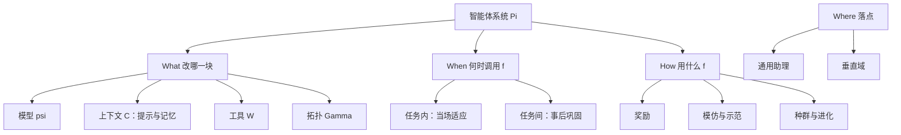

# 自进化智能体：先问改哪一块、何时改、用什么信号改，再谈通往超级智能

<!-- release-date: 2025-07-28 -->

**本文依据**：`A Survey of Self-Evolving Agents: What, When, How, and Where to Evolve on the Path to Artificial Super Intelligence`，Published in Transactions on Machine Learning Research (01/2026)，arXiv:2507.21046v4 [cs.AI] 16 Jan 2026，letter，77 页。共同一作按姓名字母序，封面第一位 Huan-ang Gao，单位 γ 为 Tsinghua University；其余单位含 Princeton、Princeton AI Lab、SJTU、Penn State、HKU、UCSB、UIUC、Edinburgh 等。通讯 Hongru Wang、Mengdi Wang。封面页眉印 TMLR 与该 arXiv 行。文中数字均标 PDF 页码；标「外部补充」的段落不来自本文。封面与摘要自称 survey。

## 一句话

大模型能答很多题，但参数在部署后基本冻住，遇到新任务、新知识和开放交互就会卡住（PDF p. 2）。这篇综述把「自进化」钉成四个正交问题：**改什么（What）**、**何时改（When）**、**怎么改（How）**，以及后来补上的 **在哪改（Where）**——应用落点（PDF p. 3–4、第 6 节）。进化对象不是「再加一个 Agent 框架」，而是系统 $\Pi=(\Gamma,\{\psi_i\},\{C_i\},\{W_i\})$ 里可被轨迹与反馈持久改写的那几块：骨干、上下文（提示与记忆）、工具、拓扑（PDF p. 6、p. 9）。它解决的主矛盾是：**静态基座模型与需要在真实环境里持续改自身的智能体之间，缺一张可比较的切法。**

作者自称这是第一篇把自进化智能体当作一等研究对象的系统综述，但同时承认领域边界还在谈，本文是 guiding synthesis，不是已经封死的范式审查（PDF p. 3）。那是作者定位，不是实验结论。

## 这张地图切了几刀

轴本身是主要贡献。四刀正交：对象、时机、机制、落点。图 1 把轨迹画成 LLM → 会规划与调工具的 foundation agents → 能从反馈学习的 self-evolving agents → 假想的 ASI；本综述钉在第三段（PDF p. 2 图 1）。

**第一刀：What，改 $\Pi$ 的哪一块。** 第 2.1 节先把环境写成部分可观测 MDP $E=(G,S,A,T,R,\Omega,O,\gamma)$，智能体系统写成 $\Pi=(\Gamma,\{\psi_i\},\{C_i\},\{W_i\})$（PDF p. 5–6）。自进化策略是

$$
f(\Pi,\tau,r)=\Pi'=(\Gamma',\{\psi_i'\},\{C_i'\},\{W_i'\})
$$

目标是在任务序列上最大化累计效用 $\sum_j U(\Pi_j,T_j)$（PDF p. 6–7 式 1–3）。操作定义三条：更新必须依赖经验；必须留下持久的策略变化，而不是一次听话；系统要有自主探索或自发学习，哪怕也用预收集数据（PDF p. 7）。作者把光谱从 proto-evolution（迭代自举、反馈改提示）拉到 strong self-evolution（完全自主诊断与重构），早期工作不因不够「纯」而被踢出地图（PDF p. 7）。

表 2 用四根柱子对齐代表方法：Model（策略 / 经验）、Context（提示 / 记忆）、Tool（创造 / 精通 / 选择）、Architecture（单智能体 / 多智能体）（PDF p. 9–10）。

**第二刀：When，测试时内部还是任务之间。** Intra-test-time：做当前这道题时当场学，数据在线冒出来，目标是这一例（PDF p. 16–17）。Inter-test-time：做完再学，面向任务分布上的期望表现（PDF p. 16、p. 18）。两边都用 ICL、SFT、RL，但数据可得性和目标不同（PDF p. 16）。

**第三刀：How，奖励、模仿、种群三条范式。** 作者写成一条轨迹：奖励闭环先闭合，但脆、贵；模仿用高质量示范稳住，但可能少探索；种群把适应抬到集体尺度，强调多样性（PDF p. 19）。奖励再按文本 / 内部置信 / 外部 / 隐式切（PDF p. 21 图 6）。

**第四刀：Where，通用数字助理还是垂直域。** 通用侧靠记忆、模型–智能体共进化、课程；垂直侧钉编码、GUI、金融、医疗、教育及其他（PDF p. 31–34 图 8）。

**和相邻范式的边界（表 1）。** 课程学习改的是静态数据集上的难度排序；终身学习有序任务但记忆主要服务训练时反遗忘；模型编辑做局部改参。自进化七列全勾：运行时上下文、工具集、动态任务、测试时适应、主动探索、结构变化、自我反思与评估（PDF p. 8 表 1）。作者判断：课程与终身学习是问题设定，编辑与自进化是解法；自进化是系统级解法，参数编辑只是其中一条通路（PDF p. 8–9）。

相对 Luo 等人、Liu 等人把进化当总表里的附属块，以及只谈语言模型自进化的工作，作者认为那些只覆盖孤立组件（PDF p. 2–3）。这是作者对前作的判断。

机制示意，根据 PDF 第 3–6 节结构重画，不是实测时间轴。

## 每一区里有什么

### What：四根柱子

**模型。** 策略侧：SCA 让同一模型轮流出题（Code-as-Task）与解题，用成功轨迹微调；Self-Rewarding Self-Improving 自己出题、解题、打分（PDF p. 10）。SELF、SCoRe、PAG 把执行痕迹或自然语言批评当奖励，走在线 SFT+RL；TextGrad 把非结构化文本反馈当可传的「梯度」，同时碰提示与参数（PDF p. 10–11）。经验侧：AgentGen 合成 PDDL/Gym 世界并双向调难度；Reflexion 把自然语言批评写入情景缓冲；AdaPlanner、Self-Refine 闭环改计划或改输出；SICA 直接改自己的代码与工具；RAGEN、DYSTIL 把多步工具使用当 MDP（PDF p. 11）。共识：模型进化已经从「等人标注」转到「自己造监督」。还在打架：文本梯度到底该改权重还是只改提示（表 2 里 TextGrad 标在 Context/Tool/单智能体，正文又写它能影响参数，PDF p. 9–11）。

**上下文：记忆 vs 提示。** 作者把两者都叫「窗口里有什么」，但问法不同：提示问措辞与结构，记忆问存、忘、取（PDF p. 11）。记忆：SAGE 用艾宾浩斯曲线；A-mem 按卡片盒动态链接；Mem0 两阶段抽取事实再 ADD/MERGE/DELETE；Memory-R1 用 RL 训记忆管理器；Expel、ReasoningBank 把轨迹蒸馏成规则或策略；Agent Workflow Memory 存可复用子流程（PDF p. 11–12）。提示：APE 生成–打分–挑选；ORPO 迭代改写；ProTeGi 文本「梯度」编辑；PromptAgent 当 MCTS；Promptbreeder 种群进化；SPO 自己造数据、成对偏好、零外部标签（PDF p. 12）。多节点：DSPy、Trace、TextGrad、MASS、MAS-ZERO、EvoAgent（PDF p. 12–13）。共识：提示是最便宜的可进化对象。未收敛：长优化会不会把上下文压成空话（ACE 用 playbook 对抗 brevity bias，PDF p. 12）。

**工具：发现、精通、管理。** 从用现成工具变成自己造技能。Voyager 在开放环境里堆技能库；Alita、ATLASS、Live-SWE-Agent 能力缺口出现再检索或从头写；CREATOR 把「造抽象工具」和「用具体工具」拆开；SkillWeaver 从成功轨迹炼 API；CRAFT 强调领域专用工具集（PDF p. 13）。精通：LearnAct 等用编译错误、API 返回、环境状态做信用分配，连文档一起改（PDF p. 13–14）。管理：工具一多就「丰富的诅咒」；ToolGen 把工具编进词表当生成；TOOLMEM 记各工具强弱（PDF p. 14）。作者点出：无约束造码有漏洞与有害行为，沙箱与自动验证是后续关键（PDF p. 13）。这是作者判断。

**架构。** 单智能体：固定拓扑上用文本梯度做节点级信用分配（TextGrad）；或把节点特性塞进架构搜索（EvoFlow 为每步选模型）（PDF p. 14–15）。整智能体：AgentSquare 搜规划器/记忆模块组合；Darwin Gödel Machine、AlphaEvolve、Gödel Agent 改自己的源码或算法（PDF p. 15）。多智能体工作流：AutoFlow、GPTSwarm 奠基；ADAS 把设计写成图灵完备代码空间上的搜索；AFlow 用可复用算子加 MCTS 让搜索可跑，并声称自动发现的工作流能超过人手设计（PDF p. 15）。随后分查询定制：MaAS 从超网采样，ScoreFlow、FlowReasoner 直接生成拓扑（PDF p. 15–16）。评一次工作流很贵，Agentic Predictor 用结构与语义特征当代理分数（PDF p. 16）。另一条线是 MARL 共进化内部策略：ReMA、GiGPO、MARTI（PDF p. 16）。

### When：当场还是事后

图 5 上通路：变体生成 → 验证 → 策略更新，嵌在当前任务里；下通路：rollout → 轨迹分析 → 策略更新，在任务之间（PDF p. 16–17）。

Intra：ICL 用 Reflexion/AdaPlanner/TrustAgent，不改参；SFT 用 self-edits 或 TT-SI「对不确定样本造一条合成例、临时轻量更新再复位」；RL 用 LADDER 的 TTRL，碰到难题就造一批相关变体做针对性强化学习（PDF p. 17–18）。

Inter：ICL 把历史工作流或 ICRL 的观测–动作史放进窗口；SFT 用 SELF、STaR/Quiet-STaR、SiriuS 自举；RL 用 RAGEN、WebRL、DigiRL 在部署前做大量试错（PDF p. 18–19）。作者判断：Inter 仍是自主智能体里的主流学习过程，因为事后学不受实时时限绑住（PDF p. 18）。

### How：三条机制

奖励：文本反馈（Reflexion、Self-Refine、TextGrad）比标量细、可执行；内部奖励用自身概率或确定性；外部来自环境、多数票或显式规则；隐式如上下文 RL 的简单标量（PDF p. 21）。表 3 还标了更新组件与时机（全参 / 上下文 / 代码库，测试时 / 测前）（PDF p. 20）。

模仿：示范可来自自己或别的智能体。STaR 对起初做错、后来做对的题补理由再训；还有跨智能体示范与混合（PDF p. 19、第 5.2 节）。

种群：DGM 在测试时进化代码库；EvoMAC 进化团队组成与工作流；GENOME 用进化算法改部分参数（PDF p. 20 表 3）。横切维：在线/离线、on-policy/off-policy、奖励粒度（PDF p. 目录 5.4）。

### Where：通用 vs 垂直

通用：Mobile-Agent-E 把经验收成 Tips 与 Shortcuts；UI-Genie 智能体与奖励模型共微调；WebEvolver 共进化世界模型 LLM；Absolute Zero 共进化推理智能体与内部自奖励；WebRL、Voyager 用失败驱动的自演化课程（PDF p. 32）。

编码：SICA 改自己的代码仓；EvoMAC 优化多智能体协作网。GUI：WebVoyager 连续自微调把未见站点端到端成功率从 30% 提到 59%；ReAP 再在曾经失败的查询上追回 29 个百分点（PDF p. 33）。金融：QuantAgent 双层迭代补领域知识库。医疗：Agent Hospital 在封闭医院模拟里看数千虚拟病例；MedAgentSim、EvoPatient、DoctorAgent-RL、OriGene、STELLA（PDF p. 33–34）。教育：PACE、MathVC、EduPlanner、SEFL（PDF p. 34）。其他：Arxiv Copilot、Voyager、Agents-of-Change、Richelieu（PDF p. 34–35）。这些数字是综述转述各论文的结果，不是本篇新实验。

### 评测：五目标 × 三时间尺度

静态一次打分不够，要纵向、计成本的轨迹观（PDF p. 35）。五目标：Adaptivity、Retention、Generalization、Efficiency、Safety（PDF p. 35 图 9）。

遗忘与后向迁移写成（PDF p. 36）

$$
\mathrm{FGT}_t=\frac{1}{t-1}\sum_{i=1}^{t-1}\bigl(\max_j J_{i,j}-J_{i,t}\bigr),\quad
\mathrm{BWT}_t=\frac{1}{t-1}\sum_{i=1}^{t-1}(J_{i,t}-J_{i,i})
$$

其中 $J_{i,t}$ 是完成 $t$ 个任务后在任务 $i$ 上的表现。

范式按时间拉长：静态（外部解题 + 组件）→ 短时适应（增强或内置动态基准）→ 长时终身学习（LifelongAgentBench 一类）（PDF p. 35–36）。作者判断缺口：多数基准仍是窄、静的任务分布，测的是预定协议下的改进曲线，而不是智能体能否自己发现适应策略；交叉能力、公平对照都弱（PDF p. 36、第 7.3 节）。

## 作者认为缺什么

第 8 节是作者判断，与上文综述到的事实分开。

- **个性化**：冷启动、长期记忆、工具接入、生成对齐；不要强化偏见。治理上要数据最小化、端侧学习、可遗忘；评测提议 PAG、隐私–效用比、端侧更新比例、公平/安全漂移（PDF p. 48–49）。
- **泛化**：可扩展架构、跨域、灾难遗忘、知识在智能体之间传不出去；基础模型可能只是浅层模式匹配而非可迁移世界模型（PDF p. 49）。
- **安全**：misevolution（自训把安全对齐忘光）、记忆侧奖励黑客与 Alignment Tipping Process、自造工具的漏洞与隐私泄漏（PDF p. 50）。处方：沙箱与验证、自修改审计与回滚、长时红队、高风险审批门（PDF p. 50–51）。表 12 是部署核对清单（PDF p. 52）。
- **多智能体生态**：个体推理 vs 集体共识；缺动态管知识的机制；现有多智能体基准偏静态（PDF p. 51–53）。

封面仓库：`https://github.com/CharlesQ9/Self-Evolving-Agents`（PDF p. 1）。

## 这张地图指向哪些值得单独读

正文不写待办。下面几篇是地图上的下一站，只收本 PDF 参考文献里印了 arXiv 编号的：

- Darwin Gödel Machine，arXiv:2505.22954。What 里「智能体改自己源码」的极限案例，也是 How 种群/测试时进化代码库的代表（PDF p. 14–15、参考文献 Zhang et al., 2025h）。
- Alita，arXiv:2505.20286。工具柱「能力缺口出现再造工具」的主线（PDF p. 13、Qiu et al., 2025b）。
- Self-Challenging Agents，arXiv:2506.01716。模型柱「自己出可执行题再微调」的代表（PDF p. 10、Zhou et al., 2025e）。
- ADAS，arXiv:2408.08435。把智能体系统设计写成代码空间搜索的理论转折（PDF p. 15、Hu et al., 2024c）。
- AFlow，arXiv:2410.10762。把 ADAS 的搜索做成可复用算子加 MCTS（PDF p. 15、Zhang et al., 2024c）。
- MASS（Zhou 等，`Multi-agent design: Optimizing agents with better prompts and topologies`），arXiv:2502.02533。提示与拓扑一起搜（PDF p. 12–13、参考文献 2025a）。
- Reflexion，arXiv:2303.11366。When 的 intra-ICL 与 How 的文本奖励共用的锚点（PDF p. 17、p. 21）。
- Absolute Zero，arXiv:2505.03335。Where 里模型–奖励共进化、How 里挑战者–解题者角色分裂（PDF p. 32、Zhao et al., 2025a）。
- LifelongAgentBench，arXiv:2505.11942。评测从快照改成终身学习者（PDF p. 参考文献 Zheng et al., 2025b）。
- Promptbreeder，arXiv:2309.16797。提示作为可进化种群（PDF p. 12）。

STaR 在正文里是 Inter-SFT 主线，但本 PDF 参考文献印的是 NeurIPS 会议条目、未印 arXiv 编号，这里不编造。GPTSwarm 印的是 ICML 条目，同样不编。TextGrad 在正文被高频引用，参考文献署名 Yellamraju et al., 2024，本 PDF 未在可见条目中印出 arXiv 编号，同样不编。

## 可迁移启发

- 先写清 $\Pi$ 里哪一块真的会被 $f$ 改写。多数「自进化」论文只动四柱之一。
- 先问 $f$ 是嵌在当前任务里还是任务之间。当场 SFT 与事后 RL 的数据假设完全不同。
- 没有能吐反馈的环境（编译器、模拟器、奖励模型、评委），闭环会退化成一次提示工程。
- 工具一多，瓶颈从「会不会造」变成「选得慢、选得错」；词表化或记忆化选择比继续堆技能更关键。
- 评测至少同时看适应曲线和 FGT/BWT；只报最后一次成功率会把遗忘藏住。
- 自修改默认当高风险：沙箱、审计、可回滚，再谈自主。

## 关键词回看

自进化智能体；$\Pi=(\Gamma,\psi,C,W)$；What / When / How / Where；intra- vs inter-test-time；奖励 / 模仿 / 种群；misevolution；FGT 与 BWT；从 proto-evolution 到 strong self-evolution。

## 参考资料

原件：`readings/_src/自进化系统/Self-Evolving-Agents-Survey-2.pdf`（77 页）。文中页码均相对该 PDF。
