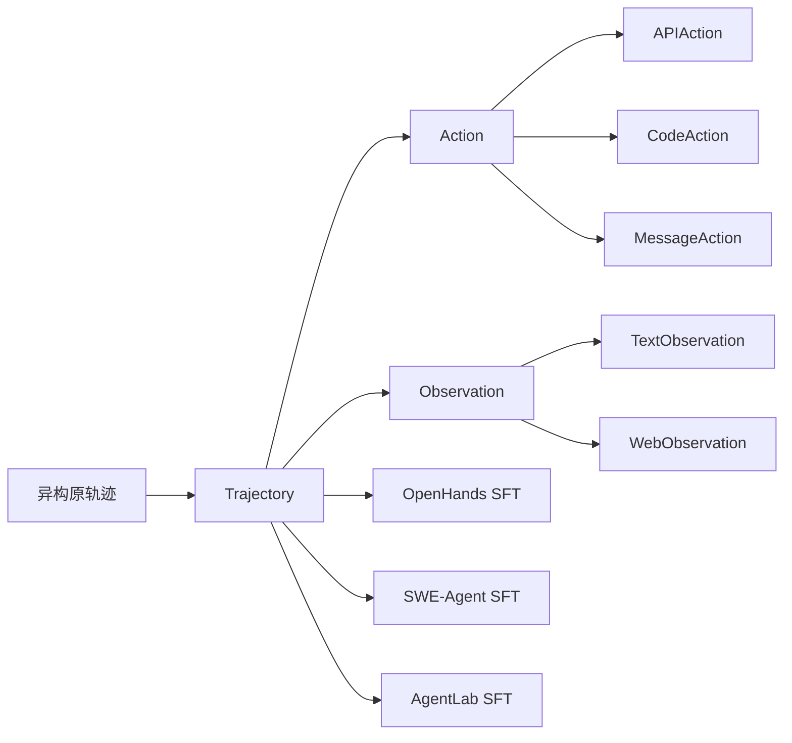

# Agent Data Protocol：缺的不是轨迹，是能一起训的中间语

<!-- release-date: 2025-10-28 -->

**本文依据**：`Agent Data Protocol: Unifying Datasets for Diverse, Effective Fine-tuning of LLM Agents`，arXiv 2510.24702**v2**（[cs.CL] 4 Mar 2026），21 页，ICLR 2026 会议论文。作者 Yueqi Song、Ketan Ramaneti、Zaid Sheikh、Ziru Chen、Boyu Gou、Tianbao Xie、Yiheng Xu、Danyang Zhang、Apurva Gandhi、Fan Yang、Joseph Liu、Tianyue Ou、Zhihao Yuan、Frank Xu、Shuyan Zhou、Xingyao Wang、Xiang Yue、Tao Yu、Huan Sun、Yu Su、Graham Neubig。第一作者 / 通讯 Carnegie Mellon University；合作机构 The Ohio State University、University of Hong Kong、Duke University、Fujitsu Research、All Hands AI。站点 https://agentdataprotocol.com。原件首次公开日取 arXiv **v1** 提交日 **2025-10-28**；解读依据本地已核的 **v2**（21 页）。文中数字都标 PDF 页码；标「外部补充」的段落不来自本文。

## 一句话

公开的 agent 轨迹并不少，但格式、工具名、接口各写各的，学术侧大规模监督微调（SFT）因此一直稀。Agent Data Protocol（ADP）是一套轻量 **Pydantic schema**：把异构轨迹收成「动作 + 观察」交替的 `Trajectory`，再按目标 harness 译成可训练对话。作者把 **13** 份现成训练集统一进 ADP，微调后相对对应基座平均大约 **20%** 的提升，并在编码、浏览、工具使用、研究类基准上做到 SOTA 或接近 SOTA，且**不做按领域单独调参**（PDF p.1）。

## 一、矛盾：数据源已经有了，管线接不上

预训练吃的是互联网上现成的文本。Agent 微调吃的是「模型在环境里走了几步」的轨迹：调 API、写代码、点网页、改仓库。这类数据按来源并不缺——人工演示、合成生成、真实 rollout 都有（PDF p.1–3）。

缺的是另一件事。学术里大规模 agent SFT 仍然少见；AgentTuning、Orca AgentInstruct 这类工作被作者当成例外而不是常态（PDF p.2）。论文的判断很硬：**瓶颈不是底层数据源不够，而是数据碎在异构格式、工具和接口上**（PDF p.1）。合不起来，就没法共享、没法一起训、也没法公平比哪份数据有用（PDF p.2–4）。

现有收集方式大致三类（PDF p.3）：

- **人工**：专家一步步演示。贵，要领域知识。
- **合成**：用已有 LLM 提示或结构化生成轨迹。质量难验。
- **录制 rollout**：从正在跑的 agent 系统里抓轨迹。格式跟那套系统绑死。

表 1 列了他们后面真正用上的 13 份（PDF p.3）。粗分成四类任务：

| 任务类 | 论文里的人话 | 表 1 代表集（条数按原文） |
|---|---|---|
| Coding | 命令行写代码、补全、翻译、修一小段 | Code-Feedback 66.4K；CodeActInstruct 7.1K |
| Software Engineering | 仓库级修 bug、加功能、依赖 | Nebius SWE 13.4K；SWE-Gym 0.5K；SWE-smith 5.0K |
| API / Tool Use | 文件、数据库、自定义 API | Orca Agentinstruct 1046.1K |
| Web Browsing | 导航、购物、社交，要懂 GUI | Mind2Web 1.0K；Go-Browse 9.5K；Synatra 99.9K 等 |

条数加起来已经过百万量级。后面实验写这 13 份合计超过 **1.3M** 条（PDF p.7）。Orca 一份就 1046.1K，不加权直接混，训练会被它吞掉。

论文把用不上的原因收成三条（PDF p.3–4）：

1. **策展贵**：人工贵；合成难验真；rollout 绑死原系统。
2. **格式异构**：合多份仍要按数据集各写一套工程，跨源集成卡死。
3. **难分析、难比较**：结构不齐，没法在同一条件下看覆盖和质量。

ADP 要当的角色，不是再造一份超级数据集，而是数据集与下游训练管线之间的 **interlingua**（中间语）（PDF p.1）。

## 二、设计原则：简单、标准、还能表达复杂轨迹

三原则直接对着上面三条挑战（PDF p.4）：

- **Simplicity**：结构直观，不必为每份数据单独工程。
- **Standardization**：把各种原格式收到同一套表示。
- **Expressiveness**：复杂 agent 轨迹要能写全，关键信息不丢，这样不同域的数据才能放在同一条件下比。

实现上就是 Pydantic schema。一条标准化轨迹是一个 `Trajectory` 对象，三块（PDF p.4）：

1. **id**：轨迹编号。
2. **content**：动作与观察交替的序列，即模型和用户 / 环境的来回。
3. **details**：灵活的元数据字典，例如数据源 URL。

核心洞察一句话：**表面上再多样，大多数 agent 交互都能拆成「模型采取的动作」和「环境给回的观察」**（PDF p.5）。把这两类钉死，原先合不起来的集就可以拼。

## 三、动作三种、观察两种

图 1 把这件事画成枢纽：左边 SWE-Gym、Mind2Web 这类原文，中间 ADP，右边 OpenHands / SWE-Agent / AgentLab 的 SFT（PDF p.2 图 1）。

### 动作

三种（PDF p.4）：

**API Action（工具调用）**

- `function`：工具名
- `kwargs`：参数字典
- `description`：可选，为什么这么调

例如网页 `goto(url=https://www.google.com)` 变成 `APIAction(function=goto, kwargs={url: ...})`。

**Code Action（写代码并执行）**

- `language`：如 python
- `content`：要执行的代码
- `description`：可选理由

一段 `print("Hello World")` 就是 `CodeAction(language=python, content=...)`。

**Message Action（自然语言）**

只有 `content`，用来记解释、澄清、对用户说话。例如 `MessageAction(content=How can I help you?)`。

### 观察

两种（PDF p.5）：

**Text Observation**

- `source`：`user` 或 `environment`
- `content`：文本

执行结果 `Hello World` 变成 `TextObservation(content=Hello World, source=environment)`。原文示例里有一处拼成 `Hellow World`，那是论文自己的笔误，schema 语义仍是「环境返回的文本」（PDF p.5）。

**Web Observation**

- `html`：原始 HTML
- `axtree`：无障碍树
- `url`
- `viewport size`
- `image observation`：可选截图

浏览场景靠这一类撑住。论文**没有**在实验里把截图当主训练信号展开；多模态是结论里的未来方向（PDF p.10）。

上图是机制示意，根据 PDF p.2 图 1 与 p.4–5 的 schema 重画，不是实测时间线。

## 四、转换管线：Raw → ADP → SFT，工程从二次变一次

三阶段（PDF p.5）：

**1. Raw → Standardized**

按数据集把原动作 / 观察映射进 ADP 空间。浏览任务常变成 `APIAction` + `WebObservation`；带执行输出的编码任务常变成 `CodeAction` + `TextObservation`。

附录 B 用 Code-Feedback 走了一遍（PDF p.16–18）：用户题面 → `text_observation`（source=user）；助手代码块抽出为 `code_action`，思考留在 `description`；运行结果 → `text_observation`（source=environment）；收尾自然语言 → `message_action`。再到 OpenHands SFT 时，代码动作译成 `<function=execute_ipython_cell>`，结束译成 `<function=finish>`，并配上该 harness 的 system prompt。

**2. Standardized → SFT**

**不训一个通用动作模型。** 作者明确：有效的 agent 训练要适配各框架自己的脚手架和交互格式（PDF p.5）。例子：

- OpenHands：IPython 执行，也能浏览
- SWE-Agent：结构化 bash 与文件操作
- AgentLab：基于 DOM 的网页交互

每个 harness **一份**脚本：把 ADP 的动作 / 观察译成该框架的动作 / 观察，并处理上下文、system prompt、对话切成 instruction–response。

**3. Quality Assurance**

自动检查：工具调用格式、对话是否正常结束、以及「大多数工具调用要配一句英文 thought」。这个「大多数」他们设成 **80%**，可按需求改（PDF p.5 脚注 2）。

工程账在图 2（PDF p.6）：没有 ADP 时，D 份数据 × A 个 harness 各写 Raw→SFT，代价 $O(D\times A)$；有 ADP 后 Raw→ADP 每份一次、ADP→SFT 每个 harness 一次，代价 $O(D+A)$。新数据集或新 agent 插进枢纽就能用上另一侧已有的全部转换。

表 7：13 份 Raw→ADP 转换代码合计 **4892** 行（不含 prompt 文本）（PDF p.10）。表 8：ADP→SFT 三套 harness 大约 150 / 50 / 30 行，平均约 **77** 行（PDF p.10）。作者用这个当「没有 ADP 时每个 harness 都要付的代理成本」：若 $A=100$，无 ADP 约 $100\times 4892=489{,}200$ 行；有 ADP 约 $4892+77\times 100=12{,}592$ 行（PDF p.10）。这是 **LOC 代理**，不是墙上时钟，也不是社区已经有 100 个 harness。

## 五、统一之后能看见什么：13 份数据并不长得一样

表 2 是 ADP 标准化之后才做得成的统计（PDF p.6）。Overall：平均 **10.1** 轮；动作比例 API / Code / Message = **53 / 24 / 23**；带 function thought 的比例 **83.8%**。

按域看偏好立刻分开：

- 网页集几乎不上 Code：Mind2Web 动作 90/0/10，thought 覆盖 **0.0%**（这份是人演示，没有「函数前思考」字段）。
- 编码集几乎不上 API：CodeActInstruct 0/65/35。
- SWE 最长、最混：SWE-smith 平均 **26.8** 轮，56/40/4；SWE-Gym 19.7 轮；Nebius 16.2 轮。
- Orca 极短：平均 **1.3** 轮，0/15/85。
- Synatra 平均 **1.0** 轮，100/0/0。

SWE 更长，论文归因于仓库级任务更复杂（PDF p.6）。thought 覆盖多数 ≥90%，作者把它读成「写得好的轨迹普遍带解释」，有利于可解释性和带推理的训练；Mind2Web 是明显反例，标准化之后才能一眼看见（PDF p.6）。

## 六、实验：统一 13 份，按 harness 各吃一块，不按域单独调参

### 训练怎么配

基座是 **Qwen2.5-Coder-Instruct** 家族；SFT 同一条 **LLaMA-Factory** 管线（PDF p.7）。三个 harness：OpenHands、AgentLab、SWE-Agent，各自盯自己的擅长域（PDF p.7）。

13 份合计 >1.3M。为避免大集主导，大集子采样、小集整用，权重在附录 C（PDF p.7、p.18）。乘数 $w_d$：对 $n_d$ 条原轨迹每 epoch 抽 $m_d=\lceil w_d n_d\rceil$；$w_d<1$ 不放回下调，$w_d>1$ 有放回上调（PDF p.18）。极端值：Orca Agentinstruct $w_d=0.001$ 下调；SWE-Gym OpenHands 采样轨迹 $w_d=3$ 上调；Code-Feedback 0.1；Nebius 0.2；Synatra 0.01；若干 AgentInstruct 子域 2（PDF p.18 表 9）。

**更关键的限制：并不是 13 份一锅端给所有 harness。** 附录 C.1（PDF p.19）：

- OpenHands CodeActAgent 与 SWE-Agent 评的是编码 / SWE（SWE-Bench、AgentBench OS、GAIA），**只用非 web 部分**，排除 Mind2Web、Go-Browse、NNetNav、Synatra，按表 9 乘数后大约 **30K** 条。
- AgentLab 只评 WebArena，**只用 web 部分**，大约 **20K** 条。

正文仍写「不做 domain-specific tuning」（PDF p.1、p.8），指的是**没有为每个评测基准另调一份配方**；数据侧已经按 harness 的评测焦点做了 web / 非 web 切割。两者不要混成「一份混合物打天下」。

### 评测四个基准

按「有评测代码 + 与 agent 专长匹配」选（PDF p.7）：

- **SWE-Bench Verified**：仓库 + bug 报告 → 补丁过单测
- **WebArena**：自托管真实网站，高层指令 → 具体网页操作
- **AgentBench OS**：多环境里他们报了 OS
- **GAIA**：推理 + 工具 + 多步，常带多模态输入

### 相对基座的涨幅

摘要里的「平均大约 20%」是跨设置的概括（PDF p.1）。正文按表 3–5 拆开（PDF p.7–9）。下面只抄论文写出的数字。

**SWE-Bench Verified，Qwen-2.5-Coder-Instruct**

| 规模 | Harness | 基座 | ADP | 绝对增益 |
|---|---|---:|---:|---:|
| 7B | SWE-Agent | 0.4% | 20.2% | +19.8% |
| 7B | OpenHands | 2.8% | 20.4% | +17.6% |
| 14B | SWE-Agent | 2.0% | 34.4% | +32.4% |
| 14B | OpenHands | 5.8% | 30.6% | +24.8% |
| 32B | SWE-Agent | 2.2% | 40.3% | +38.1% |
| 32B | OpenHands | 10.6% | 36.8% | +26.2% |

对照（同一表，数字来自先前工作，不是作者重跑）：7B SWE-Agent + SWE-smith 15.2%；7B OpenHands + SWE-Gym 10.6%；Claude 3 Opus 15.8%；Claude 3.5 Sonnet + SWE-Agent 33.6%；32B SWE-Agent + SWE-smith 40.2%（与 ADP 的 40.3% 几乎持平）（PDF p.8–9）。作者说 32B SWE-Agent ADP **匹配或超过** Claude 3.5 Sonnet 的 33.6%（PDF p.8）。

**WebArena，AgentLab + Qwen-2.5-Coder-Instruct**

| 规模 | 基座 | ADP | 增益 |
|---|---:|---:|---:|
| 7B | 4.5% | 21.0% | +16.5% |
| 14B | 5.5% | 22.2% | +16.7% |
| 32B | 10.9% | 22.9% | +12.0% |

表 3 里别人的浏览数字：Llama-3.1-8B + NNetNav 16.3%；Qwen-2.5-7B-Instruct + Go-Browse 21.7%（PDF p.8）。ADP 的 7B Coder 21.0% 与 Go-Browse 那条接近，但基座和 harness 不同，不能直接当「打败 Go-Browse」。

**AgentBench OS，OpenHands**

| 规模 | 基座 | ADP | 增益 |
|---|---:|---:|---:|
| 7B | 3.5% | 27.1% | +23.6% |
| 14B | 2.8% | 20.8% | +18.0% |
| 32B | 27.8% | 34.7% | +6.9% |

**GAIA**：只报了 7B Instruct，OpenHands 从 7.3% 到 9.1%（+1.8%）（PDF p.8）。涨幅远小于 SWE / OS。GAIA 含多模态，ADP 主路径仍是文本 schema，这个缺口和结论里的多模态方向是对得上的。

图 3、图 4（附录 D，PDF p.19）作者用来说明：随模型变大单调涨，且每个尺度上 ADP 都高于对应基座。具体曲线数字以正文表为准。

### 多样数据 vs 单任务微调

表 6 固定 harness + 模型，比「只训目标域」和「ADP 混合」（PDF p.9）：

| 基准 | 模型 | 只训某域 | ADP |
|---|---|---:|---:|
| SWE-Bench | Qwen-2.5-7B-Instruct | SWE-smith only 1.0% | 10.4% |
| SWE-Bench | Qwen-3-8B | CodeActInstruct+Code-Feedback 0.2%；SWE-smith only 11.0% | 16.6% |
| WebArena | Qwen-2.5-7B-Instruct | Go-Browse only 16.0% | 20.1% |
| AgentBench OS | Qwen-3-8B | AgentInstruct only 21.5% | 25.7% |
| GAIA | Qwen-2.5-7B-Instruct | AgentInstruct only 0.6% | 9.1% |

作者的读法：混合 ADP 在目标任务上更好，并且躲开单域微调常有的负迁移（PDF p.9）。附录 E 把 Qwen-3-8B 的 SWE-smith **上采样到与 ADP 大约同等的 ≈30K**，OpenHands 上 SWE-Bench：SWE-smith 11.0%，ADP 16.6%（PDF p.20 表 10）。他们据此说好处不只来自条数，还来自多样性和统一结构。

注意表 6 的 7B Instruct SWE 10.4%，与表 3 的 7B **Coder** OpenHands 20.4% 不是同一基座。

## 七、论文写了、但不要读过界的地方

**ADP 不是新算法，也不是 RL。** 全文是 SFT + schema。没有奖励模型、没有 PPO/GRPO、没有在线环境里继续学。

**不是「一份数据训出万能 agent」。** 转换按 harness；训练还按 web / 非 web 切了大约 20K / 30K（PDF p.5、p.19）。「跨域」主要发生在**非 web 内部**的编码 / SWE / 工具，以及 **web 内部**的多份浏览数据。

**表达力有边界。** WebObservation 预留了截图字段，但结论仍把多模态（图像、屏幕录像等）列为未来工作（PDF p.5、p.10）。标准化评测与环境、自动校验甚至自动转数据，同样是未来，不是本文交付（PDF p.10）。

**质量闸门很浅。** 查的是格式、收尾、thought 覆盖率阈值，不是轨迹是否解对了任务。错误 rollout 标准化之后仍是错误 rollout。

**LOC 账是代理。** 4892 与 77 衡量的是转换脚本行数，不是「社区省了多少人月」（PDF p.10）。

**许可要跟原集。** 附录 F 表 11 列出各集许可证（Apache 2.0、MIT、CC BY、CDLA 等），并声明收集时点可能过期，下游自己核；ADP 不承担下游违规（PDF p.20–21）。

**训练超参几乎没写。** 知道 LLaMA-Factory、Qwen2.5-Coder-Instruct、采样乘数和约 20K/30K 规模；学习率、epoch、上下文长度、硬件，正文和附录都没有展开。

**外部补充（非本文）**：站点 https://agentdataprotocol.com 在封面给出；仓库具体组织以站点当时页面为准，本文不把未读的网页内容写成论文事实。

## 八、可迁移的几条

1. **Agent 数据的第一笔工程往往该花在中间表示，而不是再爬一份轨迹。** 有 13 份现成集仍训不起来，是因为 Raw→SFT 是 $O(D\times A)$。自己做 agent 微调，先问：动作 / 观察能不能收成有限几种类型。
2. **「统一数据」不等于「一个动作空间打所有 harness」。** ADP 停在 interlingua；OpenHands 的 IPython 和 AgentLab 的 DOM 仍要各译一次。可复用的是枢纽，不是假装环境接口已经消失。
3. **大集必须加权，否则协议只是把偏差标准化。** Orca 百万级、$w_d=0.001$ 不是细节，是混合物能不能用的前提。
4. **标准化的附带收益是可比较。** 表 2 的轮次、动作比例、thought 覆盖，是 schema 对齐之后才有的数据卡片。接新集时先看这三列，比先看 leaderboard 更早暴露 Mind2Web 无 thought、Synatra 单轮之类的结构差异。
5. **跨任务迁移的证据在「同等规模仍赢单域」，不在「数据更多」。** 表 10 的 11.0% vs 16.6% 是这条主张最硬的一块；缺这块时，混合物赢有可能只是多吃了 token。

## 关键词回看

- **Interlingua（中间语）**：数据集与训练管线之间的枢纽表示；ADP 的自我定位。
- **Trajectory**：`id` + 动作/观察交替的 `content` + `details`。
- **API / Code / Message Action**：工具调用、代码执行、自然语言三类动作。
- **Text / Web Observation**：文本反馈（带来源）与网页状态（HTML、axtree、URL、视口、可选图）。
- **Raw→ADP→SFT**：每份数据转一次、每个 harness 译一次，工程从二次变线性。
- **Function thought**：动作前的自然语言理由；质量检查默认要求约 80% 的工具调用带英文 thought。

## 参考资料

- 论文 PDF（本地 v2）：`readings/_src/训练方法与强化学习/Agent-Data-Protocol.pdf`
- arXiv：https://arxiv.org/abs/2510.24702
- 项目站：https://agentdataprotocol.com
