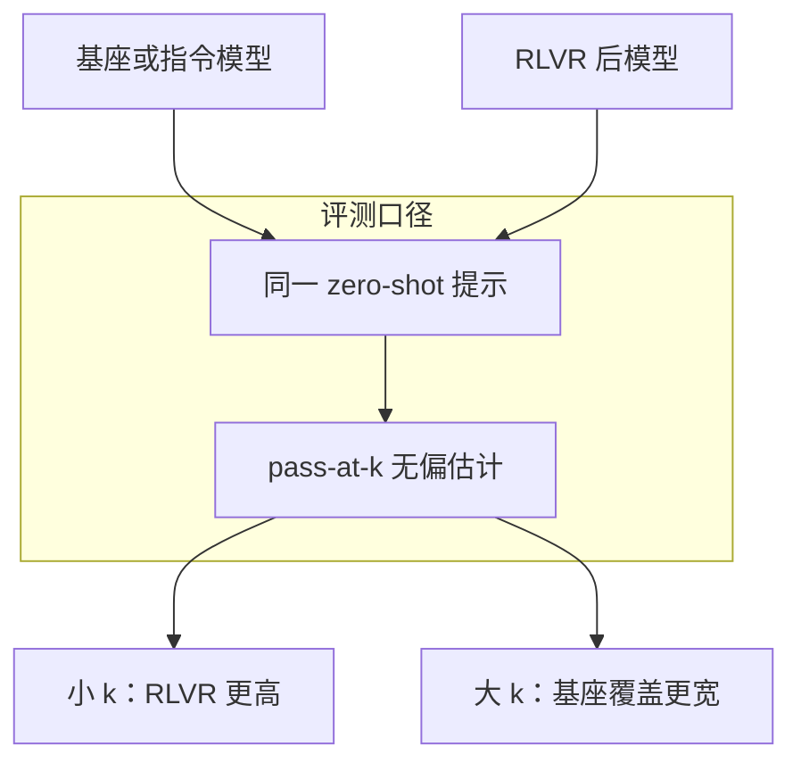

# Criticize-RLVR：小 k 上 RLVR 更准，大 k 上基座覆盖更宽

<!-- release-date: 2025-04-18 -->

**本文依据**：`Does Reinforcement Learning Really Incentivize Reasoning Capacity in LLMs Beyond the Base Model?`，arXiv **2504.13837v5**（[cs.AI] 24 Nov 2025），31 页。作者 Yang Yue*†、Zhiqi Chen*、Rui Lu、Andrew Zhao、Zhaokai Wang、Yang Yue、Shiji Song、Gao Huang✉；单位 1 LeapLab, Tsinghua University，2 Shanghai Jiao Tong University。封面日期 November 25, 2025。项目页 https://limit-of-RLVR.github.io。原件首次公开日取 arXiv **v1** 提交日 **2025-04-18**；解读依据本地已核的 v5（31 页）。封面未印会议名。文中数字都标 PDF 页码；标「外部补充」的段落不来自本文。

第一作者与第六作者英文同为 Yang Yue，中文分别为乐洋、乐阳（PDF p.1 脚注）。

## 一句话

**可验证奖励强化学习（Reinforcement Learning with Verifiable Rewards，RLVR）** 把对的路径采得更勤，所以 **pass@1** 会涨。但把采样次数拉到几十、几百，基座模型的 **pass@k** 往往追上并超过 RLVR 模型：能解的题变少，而不是变多。困惑度分析显示，RLVR 吐出的推理路径本来就在基座的采样分布里。蒸馏可以从更强教师注入新模式，从而把边界真正外推。六种常见 RLVR 算法在「离基座上界还有多远」上彼此接近，且都还差一大截。

## 一、矛盾：大家以为 RL 会发明新策略，这篇要问「新」从哪来

o1、DeepSeek-R1、Kimi-1.5 一类推理模型，关键推手被写成大规模 RLVR：对数学对答案、对代码跑单测，奖励是 0/1，不必人工标长思维链（PDF p.1–2）。传统强化学习在围棋、Atari 里确实能自己摸出人类没教过的招。于是一种流行叙事是：RLVR 也会让语言模型自己长出枚举、反思、迭代修正，能力超过对应基座（PDF p.2）。

作者把问题收成一句（PDF p.2）：

> 当前 RLVR 是真的让模型获得新的推理能力，还是只是在用基座里已经有的路径？

要答这句话，平均分不够。贪心解码或 nucleus 采样只反映平均情况；一道难题采几次失败，不代表模型永远解不出。他们把代码生成里的 **pass@k** 扩到一切可验证任务：一道题采 $k$ 次，有一次过验证就算这道题在边界内；数据集上的平均 pass@k 就是「$k$ 次以内能解的题占比」（PDF p.2、p.5）。若 RL 真扩展了推理，RL 模型应能解基座解不出的题。

**Best-of-N** 和多数投票是实用选答案的办法，但会漏掉「模型其实采到过正确答案、只是没被选中」的情况。本文用 pass@k 量的是能力边界，不是线上该怎么部署（PDF p.5）。

数学题在大 $k$ 下会猜中数字。作者因此对一批最难但仍「可解」的题做人工 CoT 核对，并与代码任务对照——代码几乎不可能靠猜过全部单测（PDF p.5）。另一个提醒：若 $k$ 大到天文数字，连均匀抽词表也能撞上正确路径；但他们观察到基座在 **$k=128$ 或 $1024$** 这种现实预算下已经能吐出正确输出（PDF p.5）。

## 二、pass@k 怎么算，实验怎么摆

无偏估计跟 Chen 等（2021）一样：每题先采 $n\ge k$ 条，对的条数记 $c_i$，再对数据集取期望（PDF p.19 式 2）：

$$
\mathrm{pass@}k := \mathbb{E}_{x_i\sim D}\left[1-\frac{\binom{n-c_i}{k}}{\binom{n}{k}}\right]
$$

主实验里 $n$ 取曲线最右端的 $k$：MATH500、Minerva、GSM8K 常用 $n=128$；AMC23、AIME24 常用 $n=1024$；Olympiad 上 Qwen 用 128、LLaMA-3.1-8B 用 1024（PDF p.19）。

RLVR 目标是最大化期望可验证奖励 $J(\theta)=\mathbb{E}_{x\sim D}\mathbb{E}_{y\sim\pi_\theta(\cdot|x)}[r]$，$r=V(x,y)\in\{0,1\}$，也可加格式奖励（PDF p.3）。PPO 用裁剪代理目标；GRPO 用组内奖励标准化当优势；RLOO 用留一基线（PDF p.3、p.19）。策略梯度只从当前策略的样本学：对的提高似然，错的压低似然（PDF p.4）。

**Zero-RL**：数学主实验直接从预训练基座上 RL，中间不加 SFT。代码与视觉开源实践通常从指令微调模型出发（纯 zero-RL 不稳定），作者沿用这一惯例，对照「微调模型 vs 再上 RLVR」，只隔离 RL 这一段（PDF p.4）。

评测：温度 **0.6**、top-p **0.95**、最长 **16,384** token。基座**不用** few-shot，以免上下文例子掺进推理；两边用同一套 zero-shot 或基准默认提示。没有 few-shot 时基座经常格式乱七八糟，但采样够多时仍能吐出格式正确、能解题的轨迹（PDF p.5–6）。

表 1 的设置（PDF p.5）：

| 任务 | 起点模型 | 框架 | 算法 | 基准 |
|---|---|---|---|---|
| 数学 | LLaMA-3.1-8B；Qwen2.5-7B/14B/32B-Base；Qwen2.5-Math-7B | SimpleRLZoo、Oat-Zero、DAPO | GRPO | GSM8K、MATH500、Minerva、Olympiad、AIME24、AMC23 |
| 代码 | Qwen2.5-7B-Instruct；DeepSeek-R1-Distill-Qwen-14B | Code-R1、DeepCoder | GRPO | LiveCodeBench、HumanEval+、MBPP+ |
| 视觉 | Qwen2.5-VL-7B | EasyR1 | GRPO | MathVista、MathVision |
| 深挖 | Qwen2.5-7B-Base / Instruct；DeepSeek-R1-Distill-Qwen-7B | VeRL | PPO、GRPO、Reinforce++、RLOO、ReMax、DAPO | Omni-Math-Rule、MATH500 |

SimpleRLZoo 在 GSM8K 与 MATH 训练集上做 zero-RL，**只有正确性奖励、没有格式奖励**（PDF p.6）。CodeR1-Zero 在 **12K** 条 LeetCode+TACO 上训 **832** 步，起点是 Qwen2.5-7B-Instruct-1M；LiveCodeBench v5 有 **279** 题（2024.8–2025.1）。DeepCoder-14B 与其蒸馏起点都用 **32k** 回复长度，因成本只评 LiveCodeBench（PDF p.7）。视觉在 Geometry3K 上训 Qwen2.5-VL-7B，评过滤后的 MathVista-TestMini 与 MathVision-TestMini（去掉选择题）（PDF p.7）。

（机制示意，根据 PDF p.2 图 1 与第 3 节。）

## 三、主结果：小 k 赢效率，大 k 输覆盖

图 2 在 Qwen2.5-7B/14B/32B 与 LLaMA-3.1-8B、跨 AIME24 / MATH500 / Minerva / Olympiad 上是同一形状：小 $k$（例如 $k=1$）RL 高于基座；曲线变陡之后，基座追上并超过 RL（PDF p.4）。Minerva、**32B**、**$k=128$** 时，基座大约高 **9%**，即验证集上大约多解 9% 的题（PDF p.6）。GSM8K 与 AMC23 见附录图 10，方向一致（PDF p.20）。

Oat-Zero-7B 与 DAPO-32B 在 AIME24 上起步很猛，相对基座可到将近 **30%** 的优势，但大 $k$ 仍被基座超过（PDF p.6、图 11）。

人工抽查（平均准确率低于 5% 但大于 0% 的「最难可解题」）：

| 设定 | 模型解出的题数 | 其中至少一条正确 CoT |
|---|---:|---|
| GSM8K，基座 | 25 | 24 |
| GSM8K，RL | 25 | 23 |
| AIME24，基座 | 7 | 6 题里 5 条明确正确（1 题步骤跳过，对错含糊） |
| AIME24，RL | 6 | 4 |

（PDF p.6；AIME24 细节在 p.21。）基座从 2048 次采样里也能抽出很长、带反思的正确 CoT（PDF p.6，图 20–21）。对 AIME24 还做了「去掉易猜题」过滤：先让基座**不写 CoT** 直接答，低但非零概率能蒙对的题删掉，30 题剩 **18** 题；过滤后 pass@k 形状仍类似（PDF p.21 图 13）。

代码三条基准（HumanEval+、MBPP+、LiveCodeBench）与视觉两条（MathVista、MathVision）同样是小 $k$ RL 好、大 $k$ 原模型覆盖更宽（PDF p.7 图 3–4、图 12）。视觉最难题：原模型与 RL 都是 **8 题里 7 题**至少一条正确 CoT（PDF p.7）。

## 四、路径本来就在基座里

准确率直方图（图 5，Qwen2.5-7B、Minerva）：RLVR 把接近 1.0 的题变多、0.1–0.2 一带变少，平均分因此涨；但 **准确率恰好为 0** 的题也变多——不可解的题增加了（PDF p.8）。更多直方图见图 14（PDF p.22）。

表 2：一道题算「可解」当且仅当 $k$ 次里至少对一次。AIME24 用 $k=1024$，MATH500 用 $k=128$（PDF p.8）。

| 基座 | SimpleRLZoo | AIME24 | MATH500 |
|---|---|---:|---:|
| ✓ | ✓ | 63.3% | 92.4% |
| ✓ | ✗ | 13.3% | 3.6% |
| ✗ | ✓ | 0.0% | 1.0% |
| ✗ | ✗ | 23.3% | 3.0% |

只有 RL 能解、基座不能解的格子几乎是空的。MATH500 上那约 **1%**（大约 5 题），把基座采样加到 **1024** 次后全部能解（PDF p.24）。表 5：AIME24 题号（从 0 起）里，SimpleRL 解出的集合几乎是基座集合的子集；表 6 在 LiveCodeBench 题号 400–450 上同样是近似子集（PDF p.24）。

困惑度：给定模型 $m$、题 $x$、回复 $Y$，

$$
\mathrm{PPL}_m(Y\mid x)=\exp\left(-\frac{1}{T}\sum_{t=1}^{T}\log P(y_t\mid x,y_{<t})\right)
$$

越低越像「这个模型自己会写这段」。从 AIME24 随机抽两题，Qwen2.5-7B-Base 与 SimpleRL-Qwen2.5-7B-Base 各生成 16 条（$Y_{\mathrm{base}}$、$Y_{\mathrm{RL}}$），再让 o1 生成 8 条（$Y_{\mathrm{GT}}$）。$\mathrm{PPL}_{\mathrm{Base}}(Y_{\mathrm{RL}}\mid x)$ 落在 $\mathrm{PPL}_{\mathrm{Base}}(Y_{\mathrm{Base}}\mid x)$ 分布的偏低一侧，也就是基座本来就爱生成的那些回复（PDF p.8 图 6）。训练过程中 $\mathrm{PPL}_{\mathrm{Base}}(Y_{\mathrm{RL}}\mid x)$ 还在继续下降：RL 是在基座先验里把分布削尖，不是扩到先验外面（PDF p.8、p.23）。

三句话收束（PDF p.8–9）：RL 解过的题基座也能解，平均分涨来自已解题上的采样效率；训完之后覆盖往往更窄；RL 用到的路径已在基座采样分布里。因此当前 RLVR **没有**引入从根本上新的推理能力，能力仍被基座框住。

图 1 左半边就是这棵搜索树：灰=不太会被采，黑=会被采，绿=有正奖励。Problem A 上 RL 把奖励路径抬高；Problem B 上正确路径只活在基座里（PDF p.2）。右半边：训练推进，pass@1 升、pass@256 降。

## 五、蒸馏能外推；六种算法差不多，都离上界远

对照 DeepSeek-R1-Distill-Qwen-7B（把 R1 蒸进 Qwen2.5-Math-7B）、基座 Qwen2.5-Math-7B、Oat-Zero RL 版、以及 Qwen2.5-Math-7B-Instruct。图 7 里蒸馏模型的 pass@k **整条**明显高于基座。作者的读法：RL 被基座边界卡住；蒸馏从更强教师搬来新推理模式，所以能超过基座（PDF p.9）。

把基座当上界，定义 **采样效率缺口 $\Delta_{\mathrm{SE}}$**：RL 模型的 pass@1 减去基座的 pass@$k$（文中用 $k=256$ 当上界代理）。越低越好（PDF p.9）。

公平对照用 VeRL 重实现 PPO、GRPO、Reinforce++、RLOO、ReMax、DAPO；按 DAPO / Oat-Zero 的做法去掉 KL，免得把学习钉死。AdamW、恒定学习率 $10^{-6}$；prompt batch **256**、每题 **8** 条 rollout、最长 **8,192**、温度 **1.0**、PPO mini-batch **256**（PDF p.9）。Omni-MATH-Rule 分成训练 **2,000** 与域内测试 **821**，MATH500 当域外（PDF p.9）。

表 3（PDF p.23）：

| 模型 | Omni-MATH-Train pass@1 / @256 | Omni-MATH-Test pass@1 / @256 | MATH500 pass@1 / @256 |
|---|---:|---:|---:|
| Qwen2.5-7B | 9.9 / 67.2 | 10.2 / 69.1 | 34.5 / 96.2 |
| GRPO | 26.1 / 66.3 | 25.1 / 68.3 | 74.4 / 97.2 |
| PPO | 27.2 / 65.8 | 26.8 / 69.2 | 75.2 / 97.2 |
| ReMax | 24.4 / 65.5 | 23.8 / 67.5 | 73.5 / 96.6 |
| RLOO | 28.6 / 66.4 | 28.1 / 69.2 | 75.0 / 97.4 |
| Reinforce++ | 28.2 / 67.7 | 28.0 / 69.7 | 75.4 / 96.8 |
| DAPO | 31.4 / 66.1 | 26.5 / 67.0 | 75.6 / 96.4 |

算法之间 $\Delta_{\mathrm{SE}}$ 只是小差别：域内测试上从 GRPO 的 **43.9** 到 RLOO 最好的 **42.6**；各算法都持续高于 **40** 分（PDF p.9）。图 8 上排标注的缺口约为训练 **0.359**、域内 **0.410**、MATH500 **0.206**（PDF p.10）。附录观察：DAPO 的 pass@1 略高，但动态采样每 batch 大约要 **3–6 倍**样本，且 $k=256$ 掉得明显；RLOO 与 Reinforce++ 在 1 到 256 全程较稳；ReMax 两端都弱，作者怀疑它用贪心回复的 0/1 奖励当基线，梯度不稳（PDF p.23）。

训练步数（表 4，PDF p.23；对应图 1 右）：

| 模型 | Train @1 / @256 | Test @1 / @256 | MATH500 @1 / @256 |
|---|---:|---:|---:|
| Qwen2.5-7B | 9.9 / 67.2 | 10.2 / 69.1 | 34.5 / 96.2 |
| GRPO-step150 | 26.1 / 66.3 | 25.1 / 68.3 | 74.4 / 97.2 |
| GRPO-step300 | 33.6 / 65.3 | 27.1 / 66.6 | 75.4 / 96.0 |
| GRPO-step450 | 42.5 / 64.3 | 28.3 / 63.9 | 76.3 / 95.4 |

训练集 pass@1 从 **26.1** 升到 **42.5**，同时 pass@256 逐步下降（PDF p.10）。把每题 rollout 数 $n$ 从 8 加到 32，pass@k 略好于 $n=8$，大 $k$ 仍被基座超过；$n=32$ 因算力只训了 220 步、pass@1 尚未收敛，但 pass@128 更高（PDF p.10、p.24 图 16）。KL 系数 **0.001** 时 pass@1 与无 KL 的 GRPO 相近，pass@128 低得多（PDF p.10）。

熵：RL 过程中输出熵通常下降。把 RL 模型温度抬到与基座 $T=0.6$ 的熵对齐后，大 $k$ 略好于它自己的 $T=0.6$，仍低于基座——熵变低有贡献，但解释不了全部变窄（PDF p.10 图 18）。主实验选 $T=0.6$，因为基座温度超过 1.0 会更乱，RL 对温度更稳（PDF p.25 图 17）。

近前沿对照：公开纯 RL 大模型很难拆开。o1 基座不公开；Qwen3-235B 混了 RLVR 与长 CoT SFT；DeepSeek-R1-Zero 自托管吞吐大约 **50 token/s**（最大 32k），做不了 pass@k。改用 Magistral-Medium-2506 API（纯 RL，起点 Mistral-Medium-3-2505），上下文最长 **40k**。$k=1$ 时 RL 在 AIME24 大约多解 **7** 题、AIME25 大约多 **8** 题；大 $k$ 差距收窄。作者认为结论在近前沿模型上仍然成立；预训练级算力砸进 RL 之后会不会翻盘，文中明确留给未来（PDF p.10–11 图 9）。

## 六、作者怎么解释，以及他们列出的限制

和 AlphaGo Zero / DQN 比，LLM 的动作空间指数级更大，算法本来就不是为这种空间设计的；若不靠预训练先验，几乎摸不到奖励。RLVR 因此必须从有用先验起步。先验是双刃剑：token 级探索大多仍困在先验里，偏离先验的样本很容易非法、拿负奖励。策略梯度于是加大先验内正奖励回复的似然、压低先验外负奖励回复，策略被钉在基座边界内。从蒸馏模型再开 RL，作者认为可以暂时注入更好先验（PDF p.11）。

他们点名的后续方向（PDF p.12）：高层抽象上的探索（如 AlphaEvolve 那种程序级自演化）；课程式数据规模，先在子问题上把成功率从近零抬起来；过程奖励与细粒度信用分配；多轮智能体 RL，用环境反馈、检索和实验产生新经验。当前 RLVR 推理被写成单轮回复。

相关工作里，他们把自己与几类观察对齐但划清范围：反思行为来自基座而非 RL（Liu / Zhao / Shah 等）；Dang 等看到过 RL 后 pass@k 变差，但范围窄（Qwen-2.5-0.5B + GSM8K）且没分析基座与 RL 的包含关系；DeepSeek-Math 有过类似趋势，但只有一个指令模型、两个数学基准。本文强调覆盖多模型、多任务、多算法，并加上分布、覆盖、困惑度与蒸馏对照（PDF p.12、p.19）。

**结论与限制（第 7 节）**：当前 RLVR 很少引出根本上新的推理模式；能力仍被基座框住；这不等于强化学习这个范式没有潜力，而是现有做法还没把探索用起来。限制写得很硬：最强模型与流水线仍是闭源；RL for LLM 变得很快，新方法可能缓解这里看到的问题；结论要带着这些约束读（PDF p.12–13）。

## 可迁移启发

- **pass@1 涨了不等于会解题变多。** 评 RL 后处理时把 pass@k 曲线画到几十、几百；若大 $k$ 被基座反超，你优化的是采样效率，不是边界。
- **$\Delta_{\mathrm{SE}}$ 是一张便宜的进度表。** 用基座 pass@256 当粗糙上界，看 RL pass@1 还差多少。本文六种算法都还差 40 分以上，换算法名不一定换本质。
- **覆盖会随训练变窄。** 训练集 pass@1 从 26.1 到 42.5 的同时 pass@256 在掉；只盯 actor reward 会漏掉这件事。
- **蒸馏和 RL 不是同一类手术。** 要把新模式搬进小模型，本文的证据站在蒸馏一边；RL 更像在已有分布里削尖。
- **熵对齐消融说明：把温度拧回去救不回覆盖。** 变窄不只是「采样更确定」。
- **猜答案会污染数学 pass@k。** 代码单测更干净；数学至少抽最难题做 CoT 人工核。
- **文中没写的不要当成结论。** 没有给出「多大算力的 RL 一定能超过基座」；没有声称所有未来 RLVR 都失败；没有把某一篇提出 RLVR 训练配方的论文写成这篇的反面主角。

## 关键词回看

- **RLVR**：用对错可自动判定的奖励做强化学习，典型是数学答案与代码单测。
- **pass@k**：$k$ 次采样里至少一次过验证的题占比，用来量「能不能解」而不是「一次抽中的概率」。
- **Zero-RL**：跳过 SFT，直接从基座做 RL。
- **$\Delta_{\mathrm{SE}}$**：RL 的 pass@1 相对基座大 $k$ pass@k 的缺口。
- **采样效率 vs 推理边界**：前者是对的路径变得好抽；后者是可解集合有没有变大。
- **蒸馏外推**：用教师长 CoT 监督，可以把基座分布里没有的模式写进去。
