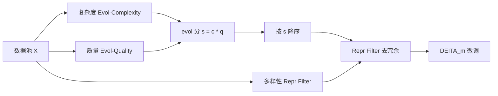

# DEITA：对齐数据不是越多越好，先量三维再挑 6K

<!-- release-date: 2023-12-25 -->

**本文依据**：`What Makes Good Data for Alignment? A Comprehensive Study of Automatic Data Selection in Instruction Tuning`，arXiv **2312.15685v2**（[cs.CL] 16 Apr 2024），21 页，ICLR 2024。作者 Wei Liu\*（ShanghaiTech University）、Weihao Zeng\*（Beijing University of Posts and Telecommunications）、Keqing He（Meituan）、Yong Jiang（Alibaba Group）、Junxian He（The Hong Kong University of Science and Technology）；\* 同等贡献，顺序由掷骰决定，工作完成于两人访问 HKUST 期间（PDF p.1）。代码与选出的数据：https://github.com/hkust-nlp/deita。原件首次公开日取 arXiv **v1** 提交日 **2023-12-25**；解读依据本地已核的 **v2**（21 页）。文中数字都标 PDF 页码；标「外部补充」的段落不来自本文。

## 一句话

指令微调（instruction tuning / SFT）不是「堆样本」。DEITA（Data-Efficient Instruction Tuning for Alignment）先在复杂度、质量、多样性三维上把池子量清楚，再用「分数优先、再管多样性」挑子集。用自动选出的 **6K** SFT 样本微调 LLaMA / Mistral，可以打到或超过当时用十几万条数据对齐的开源对照；再加 **10K** DPO 样本，DEITA-Mistral-7B + DPO 到 **7.55** MT-Bench、**90.06%** AlpacaEval（PDF p.1）。

## 一、矛盾：对齐阶段几乎不学新知识，却还在堆数据

预训练之后，要把模型接到「听人话、给有用回答」上，标准做法是指令微调，再可选地做人类反馈强化学习（RLHF）（PDF p.1）。作者同时引用当时一批工作：指令微调单独做，也能拿到有竞争力的结果（PDF p.1）。

和任务微调不同，这里数据量不再被当成第一变量。作者转述既有论点：LLM 里几乎所有知识都在预训练里学完了，指令微调只是把模型「对准」用户偏好（PDF p.1–2）。LIMA 一类工作已经把「精选几千条」推到台前，ChatGPT 蒸馏也把早期动辄几十万条的启发式自动化压到大约一千条量级（PDF p.2）。

缺的不是口号，是原则：什么叫「好的指令微调数据」，以及怎样**自动**选出它们（PDF p.1–2）。作者把问题收成数据选择：池子 $X=\{x_1,\ldots,x_n\}$，每条是指令–回复对；预算 $m$ 对应微调算力；策略 $\pi$ 选出子集 $S_\pi^{(m)}$，微调后的对齐表现记为 $Q$，要的是（PDF p.3 式 1）

$$
\pi^*=\arg\max_\pi Q(S_\pi^{(m)}).
$$

后文所有打分方法都走同一条路：按某个度量挑 $m$ 条 → 微调 → 看对齐，不先上复杂选择器（PDF p.3）。

## 二、两个池子：一个已经很好，一个更像现场

为了不把结论绑在一种池子上，作者造了两个对照（PDF p.3–4 表 1）。

| 池 | 来源 | 规模 | 在模拟什么 |
|---|---|---:|---|
| $X_{\mathrm{sota}}$ | ShareGPT 58K、UltraChat 105K、WizardLM 143K | **300K** | 已经相对复杂、多样、高质量，还想再压数据量 |
| $X_{\mathrm{base}}$ | Alpaca 52K、Dolly 15K、OAssit 10K、FLAN 2022 23K | **100K** | 整体更低质、更冗余，更接近很多人手里的池子 |

$X_{\mathrm{sota}}$ 按 Lu 等（InsTag）把 WizardLM（Alpaca / ShareGPT）、UltraChat、ShareGPT 拼起来（PDF p.3）。$X_{\mathrm{base}}$ 的「质量更差」划分与 InsTag、Li 等的分析大致对齐（PDF p.3）。

控制实验默认：backbone 是 **LLaMA-1 13B**，预算 $m=6\mathrm{K}$，评测用 MT-Bench（多轮、写作 / 推理 / 数学 / 代码等，GPT-4 当裁判）（PDF p.3–4）。超参见附录 A。

机制示意，根据 PDF p.2 图 1 与 §3.1 重画，不是实测曲线。

## 三、复杂度：直接让 ChatGPT 打分会糊成一片

直觉是：长、难、复杂的样本更有用。WizardLM 就是用 ChatGPT 把样本「演化」得更复杂（PDF p.4）。作者把选择策略钉死成：只看复杂度，取分数最高的 $m$ 条（PDF p.4）。

对照过的度量（PDF p.4）：

- 随机；指令长度；预训练模型零样本算回复困惑度（大困惑度被当成「难」）
- Direct Scoring：直接让 ChatGPT 打难度（Chen 等 Alpagasus）
- Instruction Node：ChatGPT 把指令解析成语义树，数节点（Zhao 等）
- Instag Complexity：先用 ChatGPT 打语义 / 意图标签，再训 LLaMA tagger，用标签个数当复杂度；本文用他们公开的 LLaMA-2 7B tagger
- IFD：基于回复 loss 的复杂度（Li 等）

Direct Scoring 与 Instruction Node 要给整个池子打 ChatGPT 标，贵。作者先从每个池随机抽 **50K** 再跑这两条（PDF p.4）。

### Evol-Complexity 新在哪

灵感来自 Evol-Instruct，但目标从「造更难的数据」换成「给已有数据打可区分的复杂度」。种子集 $D$ 很小。对每条指令 $I_k^{(0)}$，用 Xu 等的 In-Depth Evolving Prompt（加约束、加深、具体化、加推理步数）迭代 **$M=5$** 次，得到同一来源的 6 个复杂度档 $\{I_k^{(0)},\ldots,I_k^{(M)}\}$（PDF p.4）。

关键不是再演化一遍业务数据，而是：**把这 6 条放进同一条 prompt，让 ChatGPT 排序并打分**。同一来源的相邻演化差很小；捆在一起打，ChatGPT 才分得开。直接单条打分会把大多数样本打成差不多的高分（PDF p.4–5，附录 B）。

ChatGPT 只标这批种子。然后用分数去训一个 **LLaMA-1 7B**，输入指令、预测复杂度 $c$。多轮对话按轮打分再求和。全文种子是从 Alpaca **随机抽 2K**（PDF p.5）。

选 6K 之后的 MT-Bench（PDF p.4 表 2）：

| 方法 | $X_{\mathrm{sota}}$ | $X_{\mathrm{base}}$ |
|---|---:|---:|
| Random | 5.84 | 4.93 |
| Instruction Length | 5.89 | 4.00 |
| Perplexity | 4.06 | 1.89 |
| IFD | 5.91 | 2.46 |
| Instag Complexity | 6.18 | 4.98 |
| Direct Scoring（池 50K） | 5.16 | 4.87 |
| Instruction Node（池 50K） | 5.65 | 4.82 |
| Evol-Complexity（池 50K） | 5.73 | 5.29 |
| Evol-Complexity（全池） | **6.27** | **5.57** |

Instag 在已经很好的 $X_{\mathrm{sota}}$ 上不错，在 $X_{\mathrm{base}}$ 上几乎不比随机强。Evol-Complexity 两个池都最好。指令长度不是好代理。困惑度比随机差很多：高困惑度样本的回复往往极短（PDF p.5）。

附录 B 的例子把「糊成一片」写死：Direct Scoring 常给 8 分；Rank & Scoring 能从 1 打到 5（PDF p.14 表 8）。

## 四、质量：低质池子上，这一维会咬人

人对齐喜欢准确、细、有帮助的回复（PDF p.5）。质量策略同样是：按质量分取最高的 $m$ 条。

对照：随机；回复长度；Direct Scoring（让 ChatGPT 直接评回复是否准确）（PDF p.5）。

Evol-Quality 镜像 Evol-Complexity：固定指令 $I_k^{(0)}$，让 ChatGPT 按「更有帮助 / 更相关 / 更深 / 更有创意 / 更细」把回复演化 $M=5$ 轮，得到 $\{R_k^{(0)},\ldots,R_k^{(M)}\}$，再捆在一起排序打分得到 $q$。用同一 2K Alpaca 种子微调 LLaMA-1 7B，输入「指令 + 回复」预测质量（PDF p.5–6）。

选 6K 的 MT-Bench（PDF p.6 表 3）：

| 方法 | $X_{\mathrm{sota}}$ | $X_{\mathrm{base}}$ |
|---|---:|---:|
| Random | 5.84 | 4.93 |
| Response Length | 5.94 | 5.65 |
| Direct Scoring（池 50K） | 5.61 | 4.44 |
| Evol-Quality（池 50K） | 5.85 | 5.29 |
| Evol-Quality（全池） | **6.19** | **5.67** |

$X_{\mathrm{base}}$ 质量方差更大，质量度量的影响也更大：低质样本会明显拖后腿。回复长度与对齐正相关，但在已经高质量的 $X_{\mathrm{sota}}$ 上增益不大（PDF p.5）。

## 五、多样性：随机选会明显吃亏

对齐模型要能接住各种请求，但真实数据冗余（PDF p.6）。作者用迭代法：从池里一条条看 $x_i$，只有它对已选集 $S$ 「贡献多样性」才收，直到预算 $m$ 或池空（PDF p.6）。

对照 Instag Diversity：看标签集合有没有变大，$F_t=|T_S\cup T_{x_i}|>|T_S|$（PDF p.6）。

**Repr Filter**：用 $x_i$ 与 $S$ 中最近邻的距离定义 $F$。句子用 **LLaMA-1 13B** 编码，算余弦量 $d$，阈值 $\tau\in(0,1)$。全文相关实验 $\tau=0.9$（PDF p.6）。控制实验里，为了把复杂度和质量钉住，先把 $c\cdot q$ 的均值限制在全池均值附近、偏差不超过 **2**，再在这个新池上比多样性（PDF p.13 附录 A）。

选 6K 的 MT-Bench（PDF p.6 表 4）：

| 方法 | $X_{\mathrm{sota}}$ | $X_{\mathrm{base}}$ |
|---|---:|---:|
| Random | 5.82 | 4.34 |
| Instag Diversity | 6.10 | 4.46 |
| Repr Filter | **6.17** | **4.68** |

随机明显更差。Repr Filter 两个池都高于 Instag Diversity（PDF p.6）。

这里有一处原文含混，必须按伪代码读，不要按日常「距离越大越多样」脑补。§2.5 把 $d$ 叫 cosine distance，又写 $F:=d<\tau$，还说「与最近邻的 embedding 距离小于阈值才增加多样性」；Algorithm 1 同样是 $d(x,S)<\tau$ 才加入（PDF p.6–7）。$\tau=0.9$ 配「去冗余」更像余弦**相似度**低于 0.9 才收。论文没有另给 $d$ 的精确定义。附录 C.1 还试了 $\tau$ 从 0.8 到 0.9、以及用待训模型表示 vs E5-Large-V2 语义表示；作者报告 Model-based 编码跨阈值更稳（PDF p.13）。

## 六、拼起来：Score-First, Diversity-Aware

三维各自有用。组合方式作者故意保持简单，好落地（PDF p.7）。

定义 evol 分 $s:=c\cdot q$。多轮对话按轮算 $s$ 再对整段对话求和。把池子按 $s$ 降序得到 $X^*$，从最高分开始，按 Repr Filter 一条条收，重复的丢掉，直到 $|S|=m$（PDF p.7 Algorithm 1）。这就是 $\pi_{\mathrm{DEITA}}$。图 1 右侧：按 evol 分排序 → 过多样性过滤器 → 选出的数据（PDF p.2）。

用选出的 $m$ 条微调，模型记为 $\mathrm{DEITA}_m$。本文训了 LLaMA-1-13B、LLaMA-2-13B、Mistral-7B（PDF p.7）。细节在附录 A（PDF p.13）：

- 7B / 13B 用 4 / 8 张 A100；DeepSpeed ZeRO-3 + FlashAttention-2；Vicuna 风格多轮模板；最大长度 **2048**
- LLaMA-1-13B：batch 128，6 epoch，lr $1\times10^{-5}$，warmup 0.03
- LLaMA-2-13B：batch 128，6 epoch，lr $2\times10^{-5}$，warmup 0.1（跟 Lu 等）
- Mistral-7B SFT 跟 Tunstall 等（Zephyr）：batch 512，lr $2\times10^{-5}$，warmup 0.1，余弦；DPO：batch 32，lr $5\times10^{-7}$，warmup 0.1，线性。因为数据少，SFT 提到 **6** epoch，DPO 提到 **9** epoch

## 七、实验：6K 能不能打过全量对照

正式 DEITA 都从 $X_{\mathrm{sota}}$ 选。预算试 **6K** 和 **10K**。自动评测：MT-Bench、AlpacaEval、Open LLM Leaderboard（ARC、HellaSwag、MMLU、TruthfulQA）。人工评在附录 D。DPO 不是本文贡献点，只在最强 SFT 之上作参考：从 Zephyr 用的 UltraFeedback 里**随机抽 10K** 偏好对（PDF p.7）。

### 和其他选择方法比（同一 LLaMA-1-13B）

PDF p.8 表 5：

| 模型 | 数据量 | MT-Bench | AlpacaEval（%） |
|---|---:|---:|---:|
| Random | 6K | 5.84 | 73.91 |
| Alpagasus（池 50K） | 6K | 5.61 | 71.21 |
| LIMA | 1K | 4.29 | 41.98 |
| TAGLM† | 6K | 6.09 | 72.80 |
| DEITA-LLaMA1-13B$_{6\mathrm{K}}$ | 6K | **6.46** | **77.08** |

† 用他们公开的 LLaMA-7B tagger，为了公平。Alpagasus 同样因成本只在 50K 子集上打 ChatGPT 分再选（PDF p.8）。

### 换底座，和当时开源 SFT / RLHF 比

PDF p.8 表 6 摘与本文直接相关的行（专有模型 GPT-4 / Claude-v2 / gpt-3.5-turbo 从略）：

| 模型 | 数据 / 对齐 | MT-Bench | AlpacaEval（%） |
|---|---|---:|---:|
| WizardLM-13B | 70K / SFT | 6.35 | 75.31 |
| Vicuna-13B-v1.3 | 125K / SFT | 6.39 | 82.11 |
| DEITA-LLaMA1-13B$_{6\mathrm{K}}$ | 6K / SFT | 6.46 | 77.08 |
| DEITA-LLaMA1-13B$_{10\mathrm{K}}$ | 10K / SFT | **6.60** | 78.01 |
| LLaMA2-13B-Chat | >100K SFT + >1M RLHF | 6.65 | 81.09 |
| Vicuna-13B-v1.5 | 125K / SFT | 6.57 | 78.80 |
| Tülu 2 13B | 326K / SFT | 6.70 | 78.90 |
| DEITA-LLaMA2-13B$_{6\mathrm{K}}$ | 6K / SFT | 6.65 | 80.75 |
| DEITA-LLaMA2-13B$_{10\mathrm{K}}$ | 10K / SFT | **6.79** | **81.09** |
| zephyr-beta-sft | 200K / SFT | 5.32 | 75.12 |
| zephyr-beta | 200K SFT + 60K DPO | 7.34 | 90.60 |
| DEITA-Mistral-7B$_{6\mathrm{K}}$ | 6K / SFT | 7.22 | 80.78 |
| DEITA-Mistral-7B$_{10\mathrm{K}}$ | 10K / SFT | **7.32** | 81.67 |
| DEITA-Mistral-7B$_{6\mathrm{K}}$ + DPO | 6K SFT + 10K DPO | **7.55** | **90.06** |

作者称：三个底座上，SFT 版 DEITA 几乎都超过同底座其他 SFT；LLaMA-2 上的 DEITA 甚至超过带精心人类标注 RLHF 的 LLaMA2-13B-Chat。DEITA-Mistral-7B$_{10\mathrm{K}}$ 的 **7.32** MT-Bench 被写成当时 7B / 13B 开源 **仅 SFT** 里最强（PDF p.8）。AlpacaEval 的增益和 MT-Bench **并不总一致**；雷达图（PDF p.9 图 3）显示 Mistral 上的高 MT-Bench 主要来自代码、数学、推理，而这些不是 AlpacaEval 的主场。加上 DPO 后，7.55 / 90.06% 和用大约 **30 倍**数据的 zephyr-beta 相当，略低于对齐配方未公开的 Mistral-7B-Instruct-v0.2（PDF p.8）。作者提醒：官方 zephyr-beta-sft checkpoint 低于他们论文里报的最佳 SFT，推测那是拿去继续 DPO 的中间点，不是最佳 SFT（PDF p.8 表注）。

### Open LLM Leaderboard

PDF p.9 表 7 平均分：DEITA-LLaMA1-13B$_{10\mathrm{K}}$ **64.27**（Vicuna-13B-v1.3 为 60.01）；DEITA-LLaMA2-13B$_{10\mathrm{K}}$ **62.71**；DEITA-Mistral-7B$_{6\mathrm{K}}$ **64.94**；再加 DPO 到 **69.86**（zephyr-beta 为 66.36）。作者写：仅 6K 或 10K 的 SFT DEITA 在各底座的 SFT 对照里平均最好；DPO 把 Mistral 版平均再抬大约 **5** 点并超过 Zephyr（PDF p.9）。

### 缩放：3K 对 300K，再加数据还会掉

图 2 在 $X_{\mathrm{sota}}$ 上扫预算。DEITA 在各数据量都是最好的选择器。作者写：**3K** 条就能和用完全部 **300K** 相当，大约 **100 倍**数据压缩。曲线先升后降：即使池子已经相对复杂、多样、高质量，「真正好的对齐数据」比例仍然有限。对齐表现**不必**随数据量和算力单调变好（PDF p.9）。

### 人工：6K 对 Vicuna 的 125K

附录 D：MTurk 即使收紧设定也不稳定，改成 4 位同事；每人 50 条、盲评、来源打乱。与 Zhou 等（LIMA）同样的 tie-discounted 作者–标注者一致率 **77%**（PDF p.16）。表 10，backbone LLaMA1-13B：

| 对照 | Win | Tie | Lose |
|---|---:|---:|---:|
| vs Vicuna-13B-v1.3（125K） | 12% | 77% | 11% |
| vs Random 6K | 34% | 43% | 23% |

人偏好与 GPT-4 的 MT-Bench 方向一致。对 Vicuna 基本打平，但数据大约少 **20 倍**（PDF p.16）。

## 八、论文写了、但不要读成「万能选数器」

正文没有独立 Limitations 节。能从实验设置直接读出的边界如下。

- **裁判是 GPT-4 的 MT-Bench / AlpacaEval**，再加分类式 Open LLM Leaderboard。这测的是指令跟随与部分知识 / 诚实性，不是全面能力证书（PDF p.3、p.7）。
- **复杂度 / 质量打分器本身依赖 ChatGPT 演化 + 排序**，再蒸馏到 LLaMA-1 7B；种子只有 Alpaca 2K。换裁判模型、换种子分布，论文没有做（PDF p.5）。
- **选择算法故意极简**（最高分、最近邻阈值），更先进的选择器留作未来工作（PDF p.3）。
- **DPO 只是参考点**：10K 对随机抽自 Zephyr / UltraFeedback，不是本文的数据选择贡献（PDF p.7）。
- **Repr Filter 的 $d$ 定义含混**（§2.5 与 Algorithm 1），复现要以开源实现为准，不要只抄不等式方向（PDF p.6–7）。
- 图 2 的「先升后降」说明：在 $X_{\mathrm{sota}}$ 这种已经很好的池子里，**再加「高分」样本仍可能有害**。选数不是一次性滤完就永远单调（PDF p.9）。
- 训练超参因底座而异，且因数据少而加长 epoch；这不是「同一套超参、只换数据」的干净消融（PDF p.13）。

论文没写：打分器训练损失、演化失败率、选中样本的领域分布、对非聊天任务的迁移。那些不要补。

## 可迁移启发

1. **对齐 SFT 先问「哪三维」，再问「多少条」。** 长度和困惑度在这篇控制实验里不是好复杂度代理（PDF p.5 表 2）。
2. **LLM-as-judge 要给相对比较，不要给绝对分。** 把同一来源的演化档捆在一条 prompt 里，是为了逼出区分度（PDF p.4–5，附录 B）。
3. **质量维在脏池子上是刚需，在已经很干净的池子上边际小**（PDF p.5 表 3）。先看池子方差，再决定要不要重金打质量。
4. **分数乘起来再滤近邻，足够当第一版。** $s=c\cdot q$ 然后 Repr Filter，没有学一个联合打分网络（PDF p.7）。
5. **预算曲线可能非单调。** 3K ≈ 300K、再加到更大反而掉，是这篇最值得带进自己项目的警告（PDF p.9 图 2）。

对自己项目：已经有一个大指令池、算力只够再 SFT 几千到一万条——这篇的流程可以直接试。若池子是单一任务、或完全没有可用的 ChatGPT 演化预算，Evol 打分这条腿会断，只剩多样性和启发式质量。

## 关键词回看

- **指令微调 / SFT**：预训练后用指令–回复对做监督对齐，常作为 RLHF / DPO 之前的一步。
- **数据预算 $m$**：选出的子集大小，和微调算力成比例。
- **Evol-Complexity / Evol-Quality**：对种子做 $M=5$ 档演化，捆在一起排序打分，再蒸馏成 7B 打分器。
- **evol 分 $s=c\cdot q$**：复杂度与质量的乘积；多轮按轮加总。
- **Repr Filter**：embedding 近邻 + 阈值 $\tau=0.9$ 的多样性过滤。
- **DEITA$_m$**：用该策略从 $X_{\mathrm{sota}}$ 选出 $m$ 条后微调得到的模型系列。

## 参考资料

- Wei Liu, Weihao Zeng, Keqing He, Yong Jiang, Junxian He. *What Makes Good Data for Alignment? A Comprehensive Study of Automatic Data Selection in Instruction Tuning*. arXiv:2312.15685v2, ICLR 2024. https://arxiv.org/abs/2312.15685
- 官方实现与选出的数据：https://github.com/hkust-nlp/deita
- Xu et al. WizardLM / Evol-Instruct. arXiv:2304.12244（演化提示的来源）
- Zhou et al. LIMA: Less is more for alignment. NeurIPS 2023
- Chen et al. Alpagasus. arXiv:2307.08701
- Lu et al. #InsTag. arXiv:2308
- Tunstall et al. Zephyr. 2023（Mistral 超参与 DPO 数据来源）
