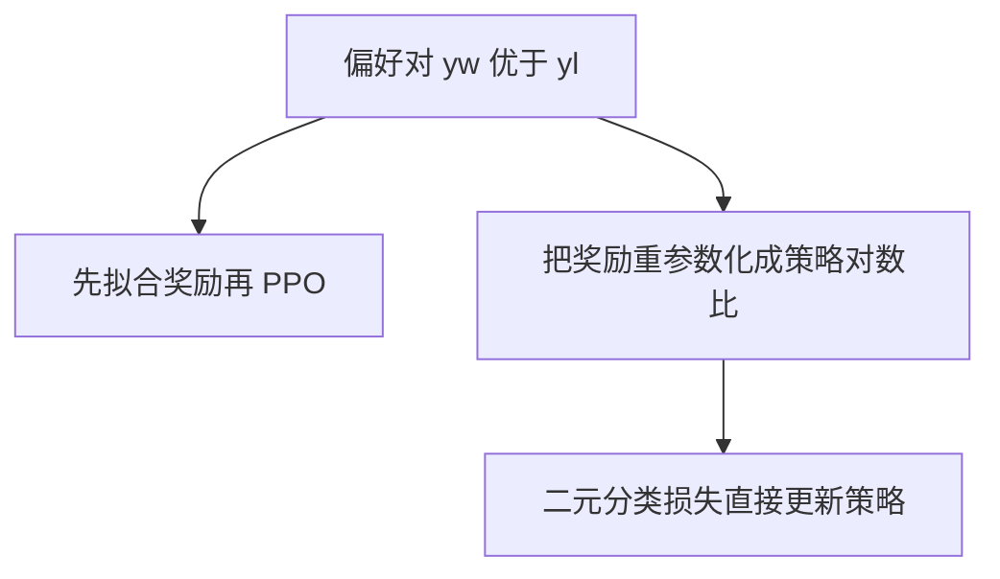

# DPO：偏好对齐不必先训奖励再跑 RL，语言模型本身就是奖励模型

<!-- release-date: 2023-05-29 -->

**本文依据**：`Direct Preference Optimization: Your Language Model is Secretly a Reward Model`，arXiv **2305.18290v3**（[cs.LG] 29 Jul 2024），**27 页**，封面印 **NeurIPS 2023**（37th Conference on Neural Information Processing Systems）。作者 Rafael Rafailov*†、Archit Sharma*†、Eric Mitchell*†、Stefano Ermon†‡、Christopher D. Manning†、Chelsea Finn†；† Stanford University，‡ CZ Biohub。原件首次公开日取 arXiv **v1** 提交日 **2023-05-29**；解读依据本地已核的 **v3**（`pdfinfo` Pages: 27，CreationDate 2024-07-31）。v3 日期不回写 `release-date`。文中数字都标 PDF 页码。标「外部补充」的段落不来自本文。

## 一句话

RLHF 通常先拟合奖励模型，再用强化学习把语言模型推向高奖励、同时用 KL 钉住参考策略。DPO 换了一种奖励参数化：最优策略可以从奖励里**闭式解出来**，于是同一套 Bradley-Terry 偏好目标变成对策略的**分类损失**。微调时不必从语言模型采样，也不必另训一条奖励头。情感控制上它压过基于 PPO 的 RLHF；摘要与单轮对话上匹配或更好，实现更简单（PDF p.1）。

## 一、矛盾：对齐要的是偏好，管道却先变成 RL 工程

无监督大模型学到很宽的知识与能力，但训练目标并不区分「该模仿」和「不该模仿」。论文举了两个例子（PDF p.1）：编码助手必须**理解**常见错误才能改错，生成时却应偏向高质量代码；模型可以知道半数人相信的误解，却不该在一半查询里把误解当事实。要从很宽的能力里选出安全、可用、可控的行为，现有主流是用人类（或 AI）对相对质量的标注，再做 **RLHF / RLAIF**（PDF p.1–2）。

RLHF 的麻烦不在「用偏好」本身，而在管道（PDF p.1–2）：

1. 先拟合一条反映偏好的奖励模型；
2. 再用强化学习微调大模型，最大化估计奖励，同时不要漂得离原模型太远。

这比监督微调复杂：要训多条 LM，还要在训练环里从当前策略采样，算力开销大，过程常不稳定（PDF p.2）。论文的主张是：现有 RL 目标可以**精确地**用一个简单的二元交叉熵优化，不必显式奖励建模，也不必强化学习（PDF p.2）。

机制示意，根据 Figure 1（PDF p.2）。左边是「奖励 → RL」两段式；右边 DPO 直接拟合隐式奖励，对应最优策略可闭式取出。

## 二、当时怎么对齐：指令微调不够，偏好学习又先变成奖励 + RL

相关工作先承认：规模变大之后，自监督 LM 能 zero-shot / few-shot 完成一些任务，但下游表现与用户意图仍常靠指令微调拉开（PDF p.2）。指令微调仍缺一块：相对人类判断往往比专家示范更好收集。后续工作用偏好数据做翻译、摘要、讲故事、指令跟随（PDF p.2）。标准做法是：在 Bradley-Terry 一类偏好模型下，先把神经网络奖励拟合到偏好集，再用 **REINFORCE、PPO 或其变体**最大化该奖励（PDF p.2–3）。

语言之外，上下文对决赌博机、基于偏好的 RL 也从比较而不是标量奖励学习，但多数仍是**先估潜在打分函数，再优化**（PDF p.3）。DPO 要的是单阶段：策略直接满足偏好。

## 三、RLHF 三段，DPO 要对齐的是同一条目标

预备知识按 Ziegler 等以及后续摘要 / InstructGPT 管道，通常三步（PDF p.3）。

### 监督微调（SFT）

在对话、摘要等下游高质量数据上监督微调预训练 LM，得到 $\pi^{\mathrm{SFT}}$（PDF p.3）。

### 偏好采样与奖励学习

用 $\pi^{\mathrm{SFT}}$ 对提示 $x$ 采一对回答 $(y_1,y_2)$，标注者给出 $y_w \succ y_l \mid x$。假设存在潜在奖励 $r^*$，常用 **Bradley-Terry（BT）** 模型（有多条排序时也兼容更一般的 Plackett-Luce）（PDF p.3 式 1）：

$$
p^*(y_1 \succ y_2 \mid x)=\frac{\exp(r^*(x,y_1))}{\exp(r^*(x,y_1))+\exp(r^*(x,y_2))}
$$

静态比较集 $\mathcal{D}$ 上，奖励网络 $r_\phi$ 的负对数似然就是分类损失（PDF p.3 式 2）：

$$
L_R(r_\phi,\mathcal{D})=-\mathbb{E}_{(x,y_w,y_l)\sim\mathcal{D}}\bigl[\log\sigma\bigl(r_\phi(x,y_w)-r_\phi(x,y_l)\bigr)\bigr]
$$

LM 场景里 $r_\phi$ 常从 $\pi^{\mathrm{SFT}}$ 初始化，在最后一层 Transformer 上加线性头出标量；有工作还把奖励归一化到对每个 $x$ 均值为 0（PDF p.3）。

### RL 微调

学到的奖励用来反馈策略。目标是 KL 约束下的奖励最大化（PDF p.3 式 3）：

$$
\max_{\pi_\theta}\ \mathbb{E}_{x\sim\mathcal{D},\,y\sim\pi_\theta(\cdot\mid x)}\bigl[r_\phi(x,y)\bigr]
-\beta\,D_{\mathrm{KL}}\bigl[\pi_\theta(y\mid x)\,\|\,\pi_{\mathrm{ref}}(y\mid x)\bigr]
$$

$\beta$ 控制离参考策略（通常是 $\pi^{\mathrm{SFT}}$）有多远；策略也从 $\pi^{\mathrm{SFT}}$ 初始化。约束的作用：奖励模型只在参考分布附近准；同时保住多样性、避免塌到单个高奖励回答（PDF p.3–4）。语言生成离散，目标不可微，标准做法是构造

$$
r(x,y)=r_\phi(x,y)-\beta\bigl(\log\pi_\theta(y\mid x)-\log\pi_{\mathrm{ref}}(y\mid x)\bigr)
$$

再用 PPO 最大化（PDF p.4）。

DPO **不改这条目标**，改的是怎么解。

## 四、设计：从最优策略反解奖励，$Z(x)$ 在成对比较里消掉

### 闭式最优策略

对一般奖励 $r$，KL 约束奖励最大化的最优解是（PDF p.4 式 4；推导见附录 A.1，PDF p.15）：

$$
\pi_r(y\mid x)=\frac{1}{Z(x)}\pi_{\mathrm{ref}}(y\mid x)\exp\Bigl(\frac{1}{\beta}r(x,y)\Bigr)
$$

其中配分函数 $Z(x)=\sum_y\pi_{\mathrm{ref}}(y\mid x)\exp(r(x,y)/\beta)$。就算有了 $r^*$ 的 MLE $r_\phi$，估 $Z(x)$ 仍然贵，所以这个形式平时不好用（PDF p.4）。

把式 4 取对数、整理，奖励可以写成最优策略、参考策略和未知 $Z$ 的函数（PDF p.4 式 5）：

$$
r(x,y)=\beta\log\frac{\pi_r(y\mid x)}{\pi_{\mathrm{ref}}(y\mid x)}+\beta\log Z(x)
$$

### 为什么成对偏好刚好消掉 $Z$

BT 模型只依赖**两条完成之间的奖励差**。把式 5 代入式 1，$Z(x)$ 相消，人类偏好概率只剩下最优策略与参考策略（PDF p.4 式 6）。于是可以对参数化策略 $\pi_\theta$ 写最大似然，得到 DPO 损失（PDF p.4 式 7）：

$$
L_{\mathrm{DPO}}(\pi_\theta;\pi_{\mathrm{ref}})=-\mathbb{E}_{(x,y_w,y_l)\sim\mathcal{D}}\log\sigma\Biggl(
\beta\log\frac{\pi_\theta(y_w\mid x)}{\pi_{\mathrm{ref}}(y_w\mid x)}
-\beta\log\frac{\pi_\theta(y_l\mid x)}{\pi_{\mathrm{ref}}(y_l\mid x)}
\Biggr)
$$

这是在用另一种参数化拟合隐式奖励，对应最优策略就是 $\pi_\theta$。附录 A.3 把同一套变量替换推到 Plackett-Luce 排序（PDF p.16 式 18–20）。

直觉：更新提高偏好回答相对非偏好回答的对数概率，但带一个**逐例、动态的重要性权重**，避免朴素概率比目标把模型训崩（PDF p.2, p.5）。

### 梯度在干什么

对 $\theta$ 的梯度（PDF p.5）可以读成：提高 $\log\pi(y_w\mid x)$、降低 $\log\pi(y_l\mid x)$；权重是 $\sigma(\hat r_\theta(x,y_l)-\hat r_\theta(x,y_w))$，即隐式奖励把对排错得有多狠（再乘 $\beta$）。隐式奖励定义为

$$
\hat r_\theta(x,y)=\beta\log\frac{\pi_\theta(y\mid x)}{\pi_{\mathrm{ref}}(y\mid x)}
$$

附录 Table 3 显示：没有这套加权的 **unlikelihood**（直接抬 $y_w$、压 $y_l$）在摘要上会退化成无意义重复（PDF p.5, p.22）。

### 实际管道

论文写的通用流程（PDF p.5）：

1. 对每个提示从 $\pi_{\mathrm{ref}}$ 采 $y_1,y_2$，标偏好，得到离线集 $\mathcal{D}$；
2. 对给定 $\pi_{\mathrm{ref}}$、$\mathcal{D}$ 和 $\beta$，最小化 $L_{\mathrm{DPO}}$。

实践上常复用公开偏好集。若数据来自 $\pi^{\mathrm{SFT}}$，则 $\pi_{\mathrm{ref}}=\pi^{\mathrm{SFT}}$。若没有 $\pi^{\mathrm{SFT}}$，用偏好回答做最大似然：$\pi_{\mathrm{ref}}=\arg\max_\pi\mathbb{E}_{x,y_w\sim\mathcal{D}}[\log\pi(y_w\mid x)]$，减轻真实参考分布不可得时的偏移（PDF p.5）。

附录 B 默认超参（除非另注）：$\beta=0.1$，batch 64，RMSprop，学习率 $1\times 10^{-6}$，前 150 步从 0 线性升温。TL;DR 摘要改 $\beta=0.5$，其余相同（PDF p.19）。PyTorch 损失约十几行：`logsigmoid` 吃 $\beta$ 乘（策略对数比减参考对数比）（PDF p.19）。

**微调环里不再从 LM 采样**——这是相对 PPO 式 RLHF 最直接的工程差别（PDF p.1）。

## 五、理论：为何「LM 就是奖励模型」不缩小奖励类

标题那句来自第 5.1 节（PDF p.5）。式 5 等价于 BT 模型里 $r^*(x,y)=\beta\log(\pi^*(y\mid x)/\pi_{\mathrm{ref}}(y\mid x))$，对 $\pi_\theta$ 的优化等价于式 2 在变量替换下的奖励拟合。

**定义 1**：两个奖励等价，当且仅当差只是某个 $f(x)$（PDF p.5）。

- **引理 1**：同一等价类在 Plackett-Luce / BT 下诱导同一偏好分布（PDF p.5, p.17）。
- **引理 2**：同一等价类在约束 RL 下诱导同一最优策略（PDF p.5, p.17–18）。

因此最终只需要最优类里**任意一个**奖励。**定理 1**（温和假设：$\pi_{\mathrm{ref}}(y\mid x)>0$，$\beta>0$）：与 PL / BT 相容的所有奖励类，都能写成 $r(x,y)=\beta\log(\pi(y\mid x)/\pi_{\mathrm{ref}}(y\mid x))$（PDF p.6, p.18）。证明要点：用投影

$$
f(r;\pi_{\mathrm{ref}},\beta)(x,y)=r(x,y)-\beta\log\sum_{y'}\pi_{\mathrm{ref}}(y'\mid x)\exp\bigl(r(x,y')/\beta\bigr)
$$

减去的项只依赖前缀 $x$，故仍在同一类；再代入式 5，得到所需形式（PDF p.6）。该投影选出的代表满足配分函数为 1，策略是合法分布（PDF p.6 式 9）。关键洞察：给欠定的 PL / BT 加约束，**可表示的奖励类不丢**，但式 4 的最优策略对所有 $x$ 解析可求（PDF p.6）。附录命题 1：每个等价类里这种重参数化是唯一的（PDF p.18–19）。

第 5.2 节用同一框架看 actor-critic / PPO 的不稳：把策略拉向最优 $\pi^*$ 时会出现参考策略的软价值（配分的对数）这一归一化项；它不影响最优点，但去掉会使策略梯度方差大。可以另学价值函数，也可以用人类完成当单样本蒙特卡洛基线。DPO 的重参数化给出**不需要基线**的奖励（PDF p.6）。

## 六、实验：情感、摘要、单轮对话

实验用到最多约 **6B** 参数的 LM（PDF p.2）。三项开放生成任务，都从偏好集 $\mathcal{D}$ 学策略（PDF p.7）。

### 任务与评测口径

| 任务 | 提示 $x$ | 要生成的 $y$ | 偏好从哪来 | 策略侧模型 |
|---|---|---|---|---|
| 受控情感 | IMDb 影评前缀 | 正向情感续写 | 预训练情感分类器：$p(\mathrm{positive}\mid x,y_w)>p(\mathrm{positive}\mid x,y_l)$ | GPT-2-large，先在 IMDb 训练划分上 SFT 到收敛（PDF p.7） |
| 摘要 | Reddit 帖 | 要点摘要 | Stiennon 等在 TL;DR 上收的人类偏好 | 同一 GPT-J SFT（CarperAI/openai_summarize_tldr_sft）；偏好来自另一条训练类似的 SFT（PDF p.7–9） |
| 单轮对话 | 用户问句 | 有帮助、能接住的回复 | Anthropic Helpful and Harmless，约 **17 万** 段对话，每段末一对未知大模型回复加人类偏好（PDF p.7） | 无现成 SFT；Pythia-2.8B 只在偏好回答上 Preferred-FT 当参考（PDF p.7, p.9） |

情感任务有真实奖励（分类器），所以画**期望奖励 vs 相对参考的序列级 KL** 前沿。摘要与对话没有真实奖励，用 **GPT-4** 相对基线的胜率：摘要对测试集参考摘要；对话对测试集偏好回复（PDF p.7–8）。GPT-4 用 `gpt-4-0314`，顺序随机（PDF p.20）。第 6.4 节用人研究核对 GPT-4。

基线包括：摘要上 GPT-J zero-shot、对话上 Pythia-2.8B 的 2-shot；SFT；Preferred-FT（在 $y_w$ 上再监督）；Unlikelihood（抬 $y_w$、可选系数 $\alpha\in[0,1]$ 压 $y_l$）；用学得奖励的 PPO；情感上的 **PPO-GT**（真实奖励，TRL 现成实现 + 作者改过归一化与超参的实现）；Best of $N$（从 SFT 或对话里的 Preferred-FT 采 $N$ 条，用学得奖励打分，测试时每条查询都要采 $N$ 次）（PDF p.8）。

### 6.1 情感：同一目标，DPO 的奖励–KL 前沿压过 PPO

每条算法扫保守程度：PPO 的目标 KL $\in\{3,6,9,12\}$；DPO 的 $\beta\in\{0.05,0.1,1,5\}$；unlikelihood 的 $\alpha\in\{0.05,0.1,0.5,1\}$；Preferred-FT 换随机种子。合计 **22** 次运行。每 100 步到收敛，在测试提示上算真实奖励均值与序列级 $\mathrm{KL}(\pi\|\pi_{\mathrm{ref}})$（各时刻 KL 之和）（PDF p.8）。

Figure 2 左：DPO 在所有画出的 KL 上给出最高期望奖励，前沿严格支配 PPO；即便 PPO 能看见真实奖励（PPO-GT），DPO 仍更好（PDF p.7–9）。作者强调：DPO 与 PPO 优化同一目标，效率却明显更高（PDF p.8–9）。

附录 C.1：提示是 IMDb 前缀 **2–8** 个 token；真实奖励用 `siebert/sentiment-roberta-large-english`；基座 `gpt2-large`。SFT 1 个 epoch；再对 **25000** 条前缀各采 **4** 条完成，每条前缀造 **6** 对偏好。RLHF 奖励从 gpt2-large 初始化，偏好上训 **3** 个 epoch，取验证准确率最高的 checkpoint。作者实现里每步 PPO 的 batch sample 为 **1024**（PDF p.19–20）。

### 6.2 摘要与对话：几乎不调 $\beta$，仍匹配或超过 PPO / Best of $N$

**TL;DR**（Figure 2 右，PDF p.7–9）：DPO、PPO、Preferred-FT 微调同一 GPT-J SFT。采样温度 $0.0$–$1.0$。DPO 在温度 **0.0** 时相对参考摘要胜率约 **61%**，超过 PPO 在其最佳温度 **0.0** 的 **57%**。DPO 的最高胜率也高于 Best of $N$。作者写明 **没有认真调 DPO 的 $\beta$**，结果可能低估潜力。DPO 对采样温度更稳；PPO 高温可掉到基座 GPT-J 水平。Preferred-FT 相对 SFT 几乎没提升。第 6.4 节人对人：温度 **0.25** 的 DPO 相对温度 **0** 的 PPO，人类胜率 **58%**（PDF p.9）。

**Anthropic-HH 单轮**（Figure 3 左，PDF p.8–9）：测试集里只有一步人–助手交互的子集。DPO 是**唯一**在 GPT-4 胜率上超过测试集偏好回复、又算力上划得来的方法；最佳温度下匹配或超过 Best of **128** Preferred-FT。附录 Figure 4：该任务 Best of $N$ 大约在 **128** 条完成处平台（约 64–128 之后变平，PDF p.9, p.22）。公开的 PPO HH Pythia-6B（reciprocate / trlx 例程）作者找不到提示或温度能超过基座 Pythia-2.8B；他们因此把 Best of 128 当作 PPO 级表现的粗代理（PDF p.9）。Figure 3 右：不同温度下 DPO 相对数据集标签的提升在训练过程中相当稳，收敛相对快（PDF p.8–9）。

### 6.3 分布外：CNN/DailyMail

把 TL;DR 上训好的 PPO / DPO 策略拿到 CNN/DailyMail 测试新闻，温度用 TL;DR 上最好的 **0** 与 **0.25**。GPT-4 提示把 “forum post” 换成 “news article”。相对数据集真实摘要的胜率（PDF p.9 表 1）：

| 算法 | 温度 0 | 温度 0.25 |
|---|---:|---:|
| DPO | 0.36 | 0.31 |
| PPO | 0.26 | 0.23 |

DPO 仍明显更高。作者称为初步证据：DPO 策略可以和 PPO 类似地泛化，尽管 DPO **没有**使用 PPO 用到的那些未标注 Reddit TL;DR 提示（PDF p.9）。

### 6.4 GPT-4 是否能当裁判

三种对局都对贪心 PPO（温度 0，其最佳温度）：最好的 DPO（温度 0.25）、中间的 SFT（温度 0.25）、最差的 PPO（温度 1.0）。两种 GPT-4 提示：**S** 只问谁更好地概括要点；**C** 额外要求简洁——因为 S 提示下 GPT-4 比人类更爱长而重复的摘要（PDF p.10）。表 2（PDF p.10）：

| | DPO | SFT | PPO-1 |
|---|---:|---:|---:|
| $N$ 名作答 | 272 | 122 | 199 |
| GPT-4 (S) 胜率 % | 47 | 27 | 13 |
| GPT-4 (C) 胜率 % | 54 | 32 | 12 |
| 人类胜率 % | 58 | 43 | 17 |
| GPT-4 (S)–人一致 | 70 | 77 | 86 |
| GPT-4 (C)–人一致 | 67 | 79 | 85 |
| 人–人一致 | 65 | — | 87 |

人与 GPT-4 的一致程度通常接近或高于人与人。主文 6.2 因此用 **GPT-4 (C)**。附录 D.3：DPO vs PPO-0 抽 **150** 对、两人标；PPO-1 vs PPO-0 抽 **100** 对、两人标；SFT **125** 对、单人。平局约 **1%** 丢弃。志愿者 **25** 人（斯坦福学生等到访），每人 25 条；一人交晚未进最终分析仍列入名单。脚注：DPO–PPO 有一名志愿者未作答（PDF p.27）。

附录样本：DPO 摘要常更短、更对准问题；对话上有时比数据集偏好回答更拒查私人地址，有时则冗长且事实错（二战、算术）。表 10：GT 把「7 plus 2」答成 **11**，GPT-4 仍判 GT 对、DPO 错（PDF p.24–26）。

## 七、限制、未做的事、论文自己划的边界

第 7 节写得很干脆（PDF p.10）：

- 分布外相对「显式奖励 + RL」还要更全面的研究；自我标注未标注提示能否同样好用，文中没有做完。
- 直接偏好优化里奖励过优化长什么样？Figure 3 右那点性能回落是不是一例，未下定论。
- 模型只评到约 **6B**，再大几个数量级是未来工作。
- GPT-4 胜率随提示变；怎样引出高质量自动判决仍开放。
- 应用不限于人类偏好上的 LM，也可到其他模态的生成模型——本文没有做。

实现上没写的：没有给出多机并行、混合精度、大规模集群 recipe；对话公开 PPO 基线没跑赢 2.8B 基座，作者自己也没把它当成成功对照。Unlikelihood 未进入摘要 / 对话主表，因为无约束压低 $y_l$ 会生成无意义文本（PDF p.21–22）。

论文没写 2023 年之后的 IPO / KTO / SimPO / 在线迭代 DPO，那些都不是本篇内容。

## 八、可迁移启发

1. **目标可以不变，变量可以换。** 若最优策略对奖励解析可求，就把损失写在策略上，省掉「先奖励后 RL」。
2. **成对比较消配分函数。** BT 只看差，$Z(x)$ 是 $x$ 的函数，成对一减就没了。排序模型同理（PDF p.16）。
3. **加权比裸 unlikelihood 关键。** 梯度里 $\sigma(\hat r_l-\hat r_w)$ 在排错时加力；去掉它，复杂生成会崩（PDF p.5, p.22）。
4. **没有 SFT 时，用 $y_w$ 最大似然当 $\pi_{\mathrm{ref}}$。** 公开偏好集往往不是你手上这条策略采的（PDF p.5）。
5. **评对齐要同时看奖励和 KL。** 情感实验把这一点画成前沿；只报奖励不够（PDF p.8）。
6. **自动裁判要用人抽检，并写清提示。** 表 2 说明 C 提示更接近人类；表 10 说明 GPT-4 也会判错（PDF p.10, p.26）。

对自己项目：有现成成对偏好、不想维护奖励头和 PPO 采样环时，DPO 是同一 KL 约束目标的一条直路。它**不是**「不用参考模型」——$\pi_{\mathrm{ref}}$ 仍在损失里；也**不是**证明 6B 以上一定更好。

## 九、关键词回看

- **RLHF**：先拟合奖励，再 RL 最大化奖励并 KL 约束参考策略。
- **Bradley-Terry**：成对偏好概率是两条奖励的 softmax。
- **配分函数 $Z(x)$**：最优策略归一化项；成对差里消去。
- **隐式奖励** $\hat r_\theta=\beta\log(\pi_\theta/\pi_{\mathrm{ref}})$：策略对数比就是奖励。
- **$\beta$**：KL 强度；默认 0.1，TL;DR 用 0.5（PDF p.19）。
- **Preferred-FT**：只在偏好回答上监督微调。
- **Best of $N$**：测试时采 $N$ 条再按奖励挑，算力贵。

## 参考资料

- 论文 PDF（本地）：`readings/_src/训练方法与强化学习/DPO.pdf`
- arXiv：https://arxiv.org/abs/2305.18290
- 情感真实奖励：`siebert/sentiment-roberta-large-english`（PDF p.19）
- TL;DR SFT：https://huggingface.co/CarperAI/openai_summarize_tldr_sft（PDF p.7 脚注 2）
- 公开 PPO HH 权重（作者未能调到超过 Pythia-2.8B）：https://huggingface.co/reciprocate/ppo_hh_pythia-6B（PDF p.9 脚注 5）
