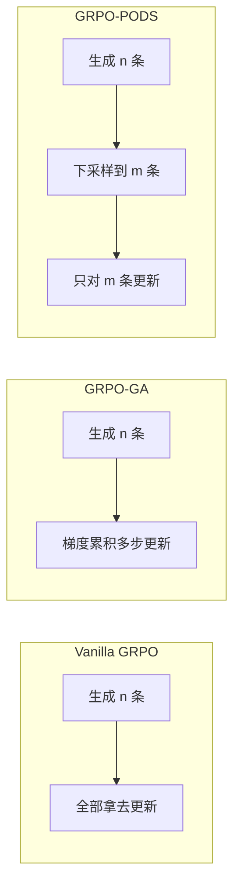

# Down-Sampling-Rollouts：不是每条 rollout 都值得拿去更新策略

<!-- release-date: 2025-04-18 -->

**本文依据**：`Not All Rollouts are Useful: Down-Sampling Rollouts in LLM Reinforcement Learning`，arXiv 2504.13818**v3**（[cs.LG] 1 Oct 2025），17 页。作者 Yixuan Even Xu\*、Yash Savani\*、Fei Fang、J. Zico Kolter，Carnegie Mellon University。封面未印会议名。代码 https://github.com/YixuanEvenXu/pods。原件首次公开日取 arXiv **v1** 提交日 **2025-04-18**；解读依据本地已核的 **v3**（17 页）。文中数字都标 PDF 页码；标「外部补充」的段落不来自本文。

## 一句话

可验证奖励强化学习（RLVR）里，**生成 rollout 很好并行、很省显存；用这些 rollout 做策略更新却又通信又吃内存**。PODS（Policy Optimization with Down-Sampling，带下采样的策略优化）在推理阶段仍生成 $n$ 条，更新阶段只拿下采样规则挑出的 $m<n$ 条。作者给出的规则是 **max-variance down-sampling**（最大方差下采样）：选奖励方差最大的子集，组合搜索可压到 $O(n\log n)$。接到 GRPO 上，在他们测过的推理基准和硬件配置里，到达 vanilla GRPO 峰值测试准确率至少 **1.7×** 更快（PDF p.1）。

## 一、矛盾：推理能堆 batch，更新堆不动

RLVR 算法（PPO、GRPO 一类）都是两段（PDF p.1）：

1. **推理 / 推断阶段**：给定 prompt，自回归采样一组完整回答，即 rollout。
2. **策略更新阶段**：用这些回答上算出的奖励，改模型参数。

两段对硬件的胃口不一样。推理几乎完全可并行、相对省显存，现代加速器可以同时吐出成千上万条 rollout；单条因为自回归可能很慢，但把多条打成 batch 就能摊掉每 token 延迟。更新则随 batch 变差：要存全精度优化器状态，还要跨设备同步梯度和参数（PDF p.1）。

系统于是被夹在中间：要么把推理节流掉（算力闲着），要么上梯度累积这类省显存手段（通信和更新延迟一起涨）。图 1 把这件事量出来（PDF p.2）：

- 设置：在 GSM8K 上微调 Qwen2.5-3B-Instruct，**8 张 A100-80GB**，横轴是每 GPU 的 rollout 数。
- 上图：每步墙钟。策略更新在 **每 GPU 32 条** 之后撞显存；再往上 OOM，只能靠梯度累积，训练明显变慢。
- 下图：推理每 token 时间。从 8 条打到 512 条，大约快 **21×**，超过 512 趋于饱和。

所以瓶颈不在「再多生成几条」，而在「生成完还要全部拿去反传」。

作者的观察是：不是每条 rollout 对改进模型的贡献一样大。过了某个规模，多出来的样本边际收益下降，甚至因为冗余把学习信号弄脏。自然做法就是：**推理阶段尽量多生成，更新阶段只训最有信息的子集**，躲开梯度累积带来的延迟（PDF p.1）。

## 二、PODS：生成 $n$ 条，更新 $m$ 条

图 2 把三种策略摆在一起（PDF p.3）：

（机制示意，根据 PDF p.3 图 2。）

- Vanilla GRPO：生成 $n$ 条并全部训练，推理硬件吃不饱。
- GRPO-GA：用梯度累积把有效 batch 做大，更新阶段变成更多串行步。
- GRPO-PODS：同样生成 $n$ 条，但只训 $m$ 条精选样本——推理打满，更新不必为「多出来的那些条」付通信和显存。

定义 3.1：下采样规则 $D(o,r;m)$ 吃 $n$ 条 rollout、对应奖励、以及更新规模 $m$，吐出大小为 $m$ 的下标集 $S$（PDF p.4）。

优势只在选中的子集上归一化：$a_{S,i}=(r_i-\mu_S)/\sigma_S$。目标 $L_{\mathrm{PODS}}(\theta,S)$ 就是把 GRPO 损失里对 $n$ 条平均，改成对 $S$ 里 $m$ 条平均，clip 形式不变（PDF p.4）。算法 1：用冻结策略 $\pi_{\theta_{\mathrm{fixed}}}$ 独立采样 $n$ 条 → 算奖励 → $S\leftarrow D$ → 用 $L_{\mathrm{PODS}}$ 更新（PDF p.4–5）。多 prompt 时对每条 prompt 各做一遍，再把下采样后的 rollout 和奖励拼起来。

两个最朴素的规则后面当对照（PDF p.5）：

- **随机下采样** $D_{\mathrm{rand}}$：无放回均匀抽 $m$ 个下标。期望上等价于直接用 $m$ 条做标准 GRPO。
- **最大奖励下采样** $D_{\mathrm{maxr}}$：只留奖励最高的 $m$ 条。看起来在学成功轨迹，但丢掉低奖励样本等于丢掉负反馈；第 4 节实验里这会明显伤表现。

## 三、Max-variance：选奖励方差最大的子集

$D_{\mathrm{maxv}}$ 解的是

$$
S=\arg\max_{|S|=m}\mathrm{Var}(\{r_i\mid i\in S\})
$$

意图是把成功和失败路径的对比信号留住。作者引用 Razin 等（2025）作为优化理论和经验上的理由（PDF p.5）。朴素枚举是 $O(\binom{n}{m})$，不可用。他们证明最优子集可以 $O(n\log n)$ 找到。

### 最优子集长什么样

引理 3.1（PDF p.5）：奖励已排序 $r_1\le\cdots\le r_n$ 时，方差最大的 $m$ 元子集一定是「$k$ 个最高 + $(m-k)$ 个最低」，某个 $k\in\{0,\ldots,m\}$。

证明思路：若最优 $S^*$ 不是这种两端拼法，则存在一个比当前均值更远、却没被选中的点。把它换进来，方差不会下降。反复换，终能走到两端形式。

算法 2（PDF p.6）：先按奖励 `argsort`；从「最低 $m$ 个」出发，再枚举 $k=1,\ldots,m$，每次比较「最低 $m-k$ 个 ∪ 最高 $k$ 个」的方差，留下更大的那个。

定理 1（PDF p.6）：算法 2 正确，且 $O(n\log n)$。排序 $O(n\log n)$；用奖励和奖励平方的前缀和，每个 $k$ 的方差 $O(1)$，一共 $O(m)$，总复杂度 $O(n\log n)+O(m)=O(n\log n)$。

### 二元奖励的特例

定理 2（PDF p.6）：$m$ 为偶数、奖励是 0/1 时，直接取 **最高 $m/2$ 条 + 最低 $m/2$ 条** 就最大化方差。证明按「1 的个数 $k$」分三种情况：1 不够 $m/2$、0 不够 $m/2$、两边都够——三种都能用「两端各一半」覆盖到最优。

主实验的奖励其实**不是二元**（正确性、格式、think/answer 标签分开打分，见附录），所以实现走的是算法 2，不是定理 2 的捷径。定理 2 只解释「为什么两端采样在 0/1 奖励上说得通」。

## 四、接到 GRPO 上怎么训

实验覆盖单卡 LoRA 和多卡全参，模型 3B–7B，基准 GSM8K 与 MATH（PDF p.7 表 1）：

| 设置 | 基准 | 模型 | 参数 | GPU | 微调 |
|---|---|---|---:|---|---|
| (a) | GSM8K | Qwen2.5 | 3B | 1 L40S | LoRA（rank 64，$\alpha=64$） |
| (b) | MATH | Qwen2.5 | 3B | 1 L40S | 同上 |
| (c) | GSM8K | Llama3.2 | 3B | 1 L40S | 同上 |
| (d) | GSM8K | Qwen2.5 | 3B | 8 H100 | 全参 |
| (e) | GSM8K | Qwen2.5 | 7B | 8 A100 | 全参 |

(a–c) 用 Unsloth + TRL 做 LoRA；(d–e) 用 DeepSpeed ZeRO-2，并改 open-r1 以支持多卡 PODS（PDF p.7）。

奖励是规则式、离散但非二元（PDF p.7、p.14 附录 A.1）：

- **正确性**：对 1.0、错 0.0；从回答和标准解抽表达式，符号验证是否等价。
- **格式**：必须是 `<think>\n...\n</think>\n<answer>\n...\n</answer>`，合规 1.0 否则 0.0。
- **标签计数**：四个位置（`<think>\n`、`\n</think>\n`、`\n<answer>\n`、`\n</answer>`）各 0.25，部分正确给部分分，总分 0.0–1.0。

对照方式（PDF p.7）：

- 单卡 (a–c)：和 **vanilla GRPO** 比，训练 batch 对齐到显存能装下的 $m$（对应图 2 里 GRPO vs GRPO-PODS）。
- 多卡 (d–e)：和 **GRPO-GA** 比，固定每 prompt 生成的总 rollout 数 $n$。

主实验超参里，GRPO-PODS 的下采样比一律是 **4**。例如 (a)：有效 $n=64$、$m=16$；(d)(e)：有效 $n=512$、$m=128$。多卡上为了让两边生成条数相同，GRPO-GA 的梯度累积步要从 4 加到 16（PDF p.14 表 2 及注）。

图 3 画测试准确率对墙钟（阴影是均值标准误的 1.96 倍）。作者的结论：PODS 更快到基线峰值，且常常超过最终准确率（PDF p.7–8）。加速比的精确定义在附录 A.4：到达 **GRPO 峰值的 $0.99\times$** 所需时间之比。表 3（PDF p.15）：

| 设置 | (a) | (b) | (c) | (d) | (e) |
|---|---:|---:|---:|---:|---:|
| 加速比 | 2.0× | 2.0× | 3.0× | 1.7× | 1.7× |

摘要和引言写「至少 1.7×」，对应的就是这张表的下界；(c) Llama3.2 单卡最高到 3.0×。图上具体百分数是曲线、正文没有再抄峰值准确率的表格数字。

附录 A.5：多数设置里平均完成长度随训练时间相对稳定（PDF p.16–17 图 6–8）。论文没有把「变长思考」当成 PODS 的卖点。

## 五、$n$ 和 $m$ 怎么选，以及别的下采样规则

设置 (a)、GSM8K、单 L40S（PDF p.9 图 4）。

固定 $m=16$，扫 $n\in\{16,32,64,128,256\}$：更大的候选池一开始有助于选样本，大约 **$n=64$** 最好；超过 **128** 开始掉——推理时间因显存饱和明显变长，多样性的边际收益却不再涨。

固定 $n=64$，扫 $m\in\{16,8,4,2\}$：很宽的一段都还稳，直到 **$m\le 4$** 才明显变差。作者据此说：max-variance 在下采样比到 **16**（$n=64,m=4$）时仍能保住有效信号。

实践建议（PDF p.9）：下采样比 **2–4**（图 4a 里 $m=16$ 配 $n=32$ 或 $64$）是性能和效率的折中；资源紧可以激进到 16；显存宽可以把 rollout 池加到硬件上限。

附录 A.3 在 $n=64,m=16$、单 L40S、GSM8K 上比三条规则（PDF p.15 图 5）：**max-variance 始终高于 max-reward 和 random**。只留高奖励、丢掉失败样本，会伤学习——和第三节的负反馈论点对上。

## 六、限制：论文自己划的边界

结论节写了三条（PDF p.10）：

1. 评测只在**有可验证奖励的数学推理**上。开放对话、代码生成的动态可能不同。
2. 若工作负载更需要 **prompt 多样性**，类似收益也可能来自「每步更多 prompt、每 prompt 更少 rollout、再跨 prompt 累积梯度」——那是解决同一不对称的另一条路，本文没拿来对打。
3. PODS 通过选择性下采样改了训练时的 rollout 分布，**行为上是 off-policy**；需要严格 on-policy 保证时可能不适用。

未来工作只点到：框架自称算法无关，可接到 PPO 等基于价值的方法；自适应下采样；prompt 多样性与每 prompt rollout 数量的折中。这些都没有实验（PDF p.10）。正文也没有声称在 SOTA 基模上刷过榜。

论文没写的（不要补）：没有会议名；没有把 PODS 接到 PPO 的实验；没有代码生成 / 对话数字；图 3 峰值准确率没有另附数值表。

## 七、可迁移的几句话

- **先认硬件不对称，再改算法。** 生成可以几乎免费地变宽，反传不行。把「多采样」和「多更新」拆开，比一味加大 GRPO 的 group size 更对症。
- **下采样目标可以很具体：最大化奖励方差。** 不是再训一个打分模型。排序 + 两端枚举 $k$ 就 $O(n\log n)$，二元奖励时退化为各取一半好坏样本。
- **负例要留。** Max-reward 看起来更「学成功」，实验里系统性更差。
- **比大约 4 是他们的默认，不是定理。** $m$ 太小（$\le 4$）和 $n$ 太大（显存饱和后）都会掉。接到自己的栈上，应对齐的是「更新 batch 装进显存的 $m$」和「推理还能继续加的 $n$」。
- **和 prompt 过滤互补，不是替代。** 相关工作明确说 DAPO、SRPO、Reinforce-Rej、Polaris、VAPO 一类是在选 / 滤 prompt；PODS 是在**同一 prompt 内部**抽 rollout（PDF p.2）。

## 关键词

**Rollout**：给定 prompt 采样出的一条完整回答（不含 prompt 本身）。**RLVR**：用可自动验证的奖励做强化学习。**GRPO**：组内用奖励均值和标准差估优势、不另训 critic。**PODS**：生成 $n$、更新 $m$。**Max-variance down-sampling**：选奖励方差最大的 $m$ 条；排序后最优必在「最低 + 最高」两端。**GRPO-GA**：靠梯度累积把有效更新 batch 做大的基线。
