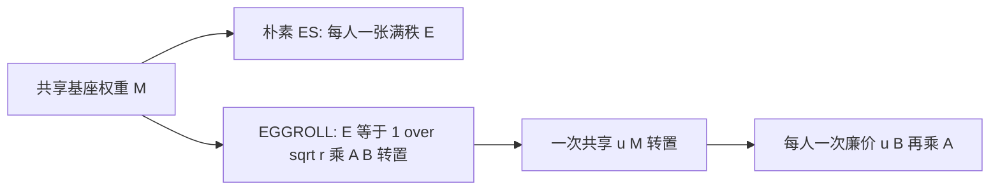

# EGGROLL：把进化策略的扰动做成低秩，让 GPU 上的黑盒优化追上批推理

<!-- release-date: 2025-11-20 -->

**本文依据**：`Evolution Strategies at the Hyperscale`，方法名 **EGGROLL**（Evolution Guided GeneRal Optimisation via Low-rank Learning），arXiv **2511.16652v2**（[cs.LG] 16 Feb 2026），**76 页**。作者 Bidipta Sarkar*、Mattie Fellows*、Juan Agustin Duque* 等；封面第一单位 **FLAIR – University of Oxford**（另有 WhiRL – University of Oxford、MILA、NVIDIA AI Technology Center 等）。封面**没有印会议名**。原件首次公开日取 arXiv **v1** 提交日 **2025-11-20**（Submitted on 20 Nov 2025）；本地 PDF 已是 v2，`pdfinfo` Pages: 76。v2 日期不回写 `release-date`。解读依据 v2。代码站点 https://eshyperscale.github.io/。文中数字都标 PDF 页码。标「外部补充」的段落不来自本文。

## 一句话

朴素进化策略（Evolution Strategies，ES）在 GPU 上要对每个种群成员做一次完整的权重矩阵乘，算术强度上限是 **1 ops/byte**，十亿参数时既搬不动张量也喂不饱算力。EGGROLL 把每次扰动写成秩 \(r\) 的 \(E=\frac{1}{\sqrt{r}}AB^\top\)，前向变成「共享基座矩阵乘 + 廉价低秩修正」，十亿参数、大种群时吞吐大约百倍于朴素 ES，最高达到纯批推理的 **91%**（PDF p.1–2, p.52）。高维理论给出 \(\sigma_d=o(d^{-1/2})\) 才线性化；整数类型循环语言模型能从零预训练；后训练上可与 GRPO 对照；tabula rasa 强化学习上相对 OpenES 不牺牲回报。

## 一、矛盾：ES 本来该很适合 GPU，却被无结构扰动卡死

ES 把适应度 \(f(x)\) 当黑盒：不要求可微、工人之间只传标量适应度、推理用什么精度训练就可以用什么精度（PDF p.1–2）。这对离散参数、只有结果奖励的 LLM 微调、带不可微模块的端到端系统都很诱人。

真正卡住规模的不是「没有梯度」，而是**矩阵怎么扰动**。深度网络里绝大多数可训参数是线性层的矩阵。朴素 ES 要为每个种群成员生成一张与权重同形状的满秩噪声 \(E\in\mathbb{R}^{m\times n}\)，等于把整套参数复制一遍。评估时，每个成员各自做一串矩阵乘。批量矩阵乘的**算术强度**（每次从显存搬一字节数据能做多少次运算）很低：噪声张量几乎用不了第二次（PDF p.2）。

附录 F 把这件事算死。H100 上 bf16 大约 **1000** TFLOPS 算力、**3.35** TB/s 带宽，屋顶线大约 **300 ops/byte** 才算算力瓶颈而不是搬数据瓶颈（PDF p.53）。对一层 \(M\in\mathbb{R}^{d_\text{out}\times d_\text{in}}\)、一批输入 \(u\in\mathbb{R}^{B\times d_\text{in}}\)：

- **普通批推理** \(uM^\top\)：\(s=2\)、方阵边长 \(m\) 时强度是 \(\frac{Bm}{2B+m}\)。\(m=8192\) 要到 300 ops/byte，最小批大小 **324**（PDF p.53）。
- **高斯矩阵 ES**：每个样本各有一张 \(B\times d_\text{out}\times d_\text{in}\) 的扰动。强度化简成 \(\frac{m}{2+m}\)，**无论批多大、维多高，严格小于 1**。要把强度拉到 300，同一张扰动至少要复用 **324** 次——这就和「每个生成用不同扰动」对着干（PDF p.53）。

所以十亿参数时，朴素 ES 只能停在小模型和小种群（PDF p.2）。作者点名的前作（Qiu 等、Korotyshova 等）也是这个量级：每轮大约一百个独特扰动，靠同一扰动上堆几百条 rollout 来喂满 GPU（PDF p.6）。

机制示意，根据第 4.2 节与图 1（PDF p.1, p.7）。不是实测时间线。

## 二、EGGROLL 做什么：扰动低秩，更新不必低秩

对每一层矩阵，不采样满秩 \(E\)，而采样 \(A\in\mathbb{R}^{m\times r}\)、\(B\in\mathbb{R}^{n\times r}\)，\(r\ll\min(m,n)\)，令

$$
E=\frac{1}{\sqrt{r}}AB^\top
$$

辅助存储从 \(mn\) 降到每层 \((m+n)r\)，搬张量同比例下降（PDF p.2）。\(\frac{1}{\sqrt{r}}\) 让 \(E\) 的方差不随 \(r\) 爆掉（PDF p.6）。

这像 LoRA，但用途相反：LoRA 把**可训参数**限制在低秩适配器上；EGGROLL 只把**搜索方向**做成低秩。种群 \(N\) 个秩 \(r\) 矩阵加权平均之后，参数更新的秩是 \(\min(Nr,m,n)\)。第 6 节全部实验里 \(Nr>\min(m,n)\)，更新是满秩的（PDF p.2–3, p.7）。先前有人直接进化低秩分解，种群再大也走不出低秩子空间（PDF p.5）。

噪声用计数器式确定性 RNG 按需重建，不必常驻显存（PDF p.2）。工人仍只广播标量适应度，再按共享种子重建全部 \(E_j\)（Algorithm 1，PDF p.6）。

低秩矩阵的密度活在秩 \(r\) 流形上，欧氏空间里的得分 \(\nabla\log p(E)\) 没有普通定义。作者用高斯近似得分 \(\hat S(E)=-E\)，因为 \(AB^\top\) 是独立外积之和，Assumption 1 下 \(r\to\infty\) 时 \(P(E)\) 依分布趋向矩阵高斯（PDF p.6–7）。实验里这套近似整体最好；附录 D.1 另推了均值场近似，正文实验没用它们当默认（PDF p.7）。

吸收 \(1/\sigma\) 进学习率后，更新是（PDF p.7 式 6）：

$$
M_{t+1}\leftarrow M_t+\frac{\alpha_t}{N}\sum_{i=1}^{N} E_{i,t}\,f(M_t+\sigma E_{i,t})
$$

秩 1 时还不显式拼 \(E_i\)：重建 \(A\in\mathbb{R}^{N\times d_\text{out}}\)、\(B\in\mathbb{R}^{N\times d_\text{in}}\)，关键项 \(\sum_i E_i f_i\) 变成 \((\mathrm{diag}(f)A)^\top B\)（PDF p.7）。

**可迁移**：GPU 上「每个样本一张独特满秩矩阵」几乎一定是搬数据。能把扰动写成「共享 GEMM + 每人一个低秩修正」，算术强度才跟得上批推理。前提是层是矩阵乘、种群能批在一起。

## 三、硬件：为什么能到纯批推理的 91%

一层前向：朴素 ES 算 \(u_i(M+\sigma E_i)^\top\)，是批量矩阵乘。EGGROLL 改写为（PDF p.7）

$$
u_i(M+\sigma E_i)^\top=u_i M^\top+\frac{\sigma}{\sqrt{r}}(u_i B_i)A_i^\top
$$

大头仍是共享的 \(uM^\top\)。\(r=1\) 时 \(u_i B_i\) 是长度为 \(d_\text{in}\) 的点积得到标量，再对 \(A_i\) 做标量–向量乘。这和 vLLM 一类批量 LoRA 推理是同一条路（PDF p.7）。附录 F.3：\(m=8192\)、\(r=1\)、要 300 ops/byte，最小批 **352**，对比普通推理的 **324**；相对批推理多出来的 flop 比例是 \(\frac{4r+1}{2m}\)，大矩阵上可忽略（PDF p.54）。

图 2a 把经验吞吐相对「纯批推理 = 100」归一化：EGGROLL **91**、PPO **34**、OpenES **0.41**（PDF p.2）。附录 E：单卡 GH200（作者写等价单卡 H100），线性层维 **8192**、bf16、最大批 **1024**；图 2a **预先生成**噪声。若用 JAX 现场重生噪声，EGGROLL 变成 **69**，OpenES 变成 **0.054**（图 7，PDF p.52）。低秩噪声内存大约只跟原矩阵边长成正比，预生成在工程上可行（PDF p.52）。

「百倍」对应正文「over a hundredfold increase in training throughput」（PDF p.3），与 91 / 0.41 同一数量级。这是该微基准上的相对吞吐，不是端到端训练墙钟对所有任务都百倍。

## 四、高维理论：\(\sigma\) 必须跟 \(d^{-1/2}\) 走

### 高斯 ES 三个区制

高斯种群 \(\pi=N(\mu,I\sigma_d^2)\) 的更新是 \(\nabla_\mu J=\frac{1}{\sigma_d}\mathbb{E}[v\,f(\mu+\sigma_d v)]\)（PDF p.4 式 2）。高维高斯质量集中在半径约 \(\sqrt{d}\) 的薄壳上，\(\sigma_d\) 若不随 \(d\) 衰减，扰动会越走越远（PDF p.8）。

Assumption 2–4：\(\mu\) 附近有一个固定半径的 \(C^1\) 球、梯度 Hölder；全局多项式增长；\(\|\mu\|\) 与 \(\|\nabla f(\mu)\|\) 不随 \(d\) 涨——可用 \(d^{-1/2}\) 缩放或 NTK 式初始化保证（PDF p.8）。允许不连续，只要局部探索碰不到（PDF p.8）。

**定理 1**：\(\sigma_d=o(d^{-1/2})\) 时 \(\|\nabla_\mu J-\nabla f(\mu)\|=\Theta((\sigma_d\sqrt{d})^\alpha)=o(1)\)（PDF p.9）。

**定理 2** 用有界系数三次多项式给出紧例子：偏差正好是 \(\Theta(\sigma_d^2 d)\)（PDF p.9）。于是三个区制（PDF p.9–10）：

| 区制 | \(\sigma_d\) | 更新变成什么 |
|---|---|---|
| I 线性化 | \(o(d^{-1/2})\) | 回到局部一阶 \(\nabla f(\mu)\)，类似 NTK，但目标类更宽 |
| II 临界 | \(\asymp d^{-1/2}\) | 二次项因对称消失，三次及更高奇阶可以留下 \(\Theta(1)\) |
| III 发散 | \(d^{-1/2}=o(\sigma_d)\) | 存在光滑三次目标使 \(\|\nabla_\mu J\|=\Theta(\sigma_d^2 d)\to\infty\) |

实践里 \(\sigma_d\) 常被学习率吃掉，靠超参搜索稳住（PDF p.10）。这不是「ES 在所有大模型上已经等于 SGD」，是「噪声尺度不跟着维数走就会线性化失败或发散」。

### 低秩仍趋向真 ES

EGGROLL 的 \(\hat g_{LR}\) 既是近似得分，尾部也可能比高斯重。Assumption 5 把局部连续性提到 \(C^2\)、Hessian Lipschitz；Assumption 6 要求 \(p_0\) 次高斯尾（高斯、有界、均匀都满足）（PDF p.10）。

**定理 3**：\(d=mn\) 固定 \(r\)，\(\sigma_d=o(d^{-1/2})\) 且 \(L_d(\sigma_d d)^2=o(1)\) 时，\(\hat g_{LR}\) 既趋向 \(\nabla_W f\)，也趋向真矩阵 ES 梯度，与 \(r\) 无关——**秩 1 在 \(d\to\infty\) 时也对**（PDF p.10–11）。标准过参数化下 \(L_d\) 随宽度多项式衰减，代入可得 \(O(\sigma_d^2 d^{3/2})\) 或 \(O(\sigma_d^2 d)\)（PDF p.11）。

**定理 4**：有界适应度下 \(\|\hat g_{LR}^r-\nabla_\mu J\|_F=O(r^{-1})\)，快过一般参数 CLT 的 \(O(r^{-1/2})\)，因为对称零均值使奇阶累积量全零，收敛由四阶项管（PDF p.11）。图 3：边际得分×密度在 \(r=10\) 已接近高斯极限，\(r=50\) 肉眼难分；\(r=1\) 也不是很差的近似（PDF p.11）。

## 五、整数类型循环 LM：没有反传，靠种群从零预训练

因为 ES 不问梯度，作者把架构按推理友好来设计：非线性 RNN，权重全 int8，**没有显式激活**，非线性只来自 int8 运算的截断。模型叫 **EGG**（Evolved Generative GRU）。细节在附录 G（PDF p.12）。

设定：6 层、隐维 256，minipile 上做字符级预测；每个种群成员每 **100** 个 token 更新一次，截断 ES，隐状态跨步保留、文档边界重置（PDF p.12）。图 2b：数据批固定 **16** 条序列，种群从 2 扩到 \(2^{20}=1{,}048{,}576\)。最好测试损失 **3.40 bits/byte**；同结构数据批的 fp32 Transformer + 反传 SGD 是 **3.58 bits/byte**（PDF p.2, p.12）。最大种群大约要多 **180** 倍 GPU-小时，作者把它标成「数据有限时用算力换」的路径（PDF p.12）。\(2^{20}\) 比 Salimans 等人最大种群 **1440** 大约三个数量级，而且只需单卡（PDF p.5, p.12）。种群 = 2（类似 MeZO 两点估计）明显更差，同样数据批不够（PDF p.12）。附录 I 再扫批大小与种群的权衡（PDF p.59）。

纯整数更新目前**没有动量**；\(\hat\sigma=4\)，\(\alpha\) 按 \(0.015t+1\) 的倒数衰减（PDF p.59）。作者把动量写成关键未来工作（PDF p.59）。

分布式上，对偶采样把信号收成 \(\{+1,0,-1\}\)，五个打进一个字节，约 **1.6 bit/值**，接近 \(\log_2 3\approx 1.585\)；载荷与模型大小无关（PDF p.60）。

**可迁移**：零阶方法预训练要的是**大种群**，不是两点估计。整数网络能训，是因为适应度只看前向；收敛仍靠种群把噪声平均掉。

## 六、tabula rasa RL：低秩扰动没有换掉 OpenES 的优化行为

16 个从零学的环境（Navix、Craftax、Brax、Kinetix、Jumanji），固定 3 层 MLP、隐单元 256；每方法每环境先做超参搜索，再 **10** 个种子。回报按 PPO 归一化。EGGROLL 相对 OpenES：**7/16** 持平、**2/16** 更差、**7/16** 更好，墙钟常因批量低秩更好（PDF p.12）。图 4a 是 16 环境平均（PDF p.12）。多智能体结果在附录 N.1，对照 IPPO 与 OpenES（PDF p.12, p.66）。

这是「更快且大体不差」，不是全面超过 PPO。PPO 仍是归一化的 1.0 基准。

## 七、后训练：和 GRPO 对照，而不是再写一篇 GRPO

基座选 RWKV-7：常状态、没有 KV cache 那一摊显存，省下来的内存用来评估种群成员（PDF p.12–13）。

**Countdown**，RWKV 7g **1.5B**，单卡，3 个种子：同样墙钟，EGGROLL 验证准确率 **35%** 对 GRPO **23%**。EGGROLL 每 GPU **1024** 条并行生成（**618** 次更新），GRPO **64** 条（**915** 次更新）（图 4b，PDF p.12–13）。

**GSM8K**，RWKV 7g **7B**，8 卡，3 个种子：EGGROLL **8192** 条并行（每 GPU 1024，**260** 次更新），GRPO **256** 条（每 GPU 32，**340** 次更新）。图 5a 上 EGGROLL 验证分更高（PDF p.13）。

打分刻意平行 GRPO 的组相对优势：对问题 \(\times\) 种群得到分数矩阵 \(S\in\mathbb{R}^{m\times n}\)，按问题减均值，但方差用**全局** \(\bar\sigma\)，再对问题平均（PDF p.13）。同一批里每个问题对各成员权重相同。

更大设定：用这套配方在 DeepScaleR 上训 RWKV 7 **14B**。思考预算训练和评测都是 **5000** token。**32** 卡 **12** 小时后：AIME24 **13%→30%**，AIME25 **7%→33%**，HMMT25 **11%→13%**（图 13b，PDF p.13）。**7B** 上用 **128** 卡 **24** 小时对照 GRPO，作者写「我们超过 GRPO」（图 5b，PDF p.13）。图 5b 柱上 AIME24 三根都是 **0.13**、AIME25 基座 **0.03**、GRPO 与 EGGROLL **0.07**——与 14B 那段百分数不是同一张图，读的时候不要混（PDF p.13）。

14B 那个量级作者写 GRPO **不可行**，因为 Adam 额外显存（PDF p.13）。

附录 L：Qwen3-4B-Base + DeepScaleR，LoRA 秩 **1**、种群 **2048**。表 1 平均分 EGGROLL 与对照 RL 都是 **41.4**（基座 **28.0**）；分项并不相同，例如 AIME24 是 EGGROLL **13.3**、RL **16.7**，MATH500 是 **75.8** 对 **67.4**（PDF p.62）。RL 数字取自 Liu 等 2025，共享超参对齐（PDF p.62）。

因为目标可以不可微，EGGROLL 能直接优化 **pass@k**。Qwen3-1.7B、种群 256、LoRA 秩 1、\(K=4\)：优化 pass@k 时 4 个样本的答案多样性上升；优化 pass@1 则塌向单一最终答案（图 10，PDF p.62）。作者把「GRPO 不好直接优 pass@k」标成已知限制并引用 Yue 等（PDF p.13）。

附录 M 还有金融世界模型微调成高频交易智能体、直接优 PnL，设定表 4：LOBS5-360M，每 GPU 2048 条并行、总共 65536，LoRA 秩 4（PDF p.13, p.66）。不是主文叙事中心。

## 八、量化 LLM：int8 权重上继续进化

按 Jacob 等 2017：按通道 absmax 映到 int8 \([-127,127]\)（PDF p.13, p.60）。非矩阵乘参数留 bf16。EGGROLL + Adam：Adam 动量在 bf16，int8 参数用 z-score 阈值收成 \(\{-1,0,+1\}\) 再 clip（PDF p.61）。适应度是教师强制 GSM8K 题解上，非量化分布 \(p_t\) 与量化分布 \(q_t\) 的逐 token KL 之和（PDF p.14）。

图 6：RWKV 7G **7B**，3 个种子。训练 perplexity 向原模型靠近；验证上，量化后未经继续训练的基线几乎解不出题，蒸馏后能解一部分（PDF p.14）。论文没有在这张图的正文里写出终点准确率百分数。

## 九、限制与论文没写的

正文没有单独的 Limitations 节。能从主张边界读出来的是：

- **91% / 0.41** 是 GH200 上维 8192 线性层、bf16、批 1024 的微基准；现场 RNG 会掉到 69（PDF p.2, p.52）。
- 整数预训练最好损失赢了同设定反传 Transformer，但最大种群大约 **180×** GPU-小时，且无动量（PDF p.12, p.59）。
- tabula rasa 是相对 OpenES 的 7/16–2/16–7/16，不是相对 PPO 全面更好（PDF p.12）。
- LLM 后训练主结果在 **RWKV** 上；Transformer 对照在附录，部分指标 RL 更高（PDF p.13, p.62）。
- 14B 的 AIME 数字与图 5b 的 7B 柱不要混读（PDF p.13）。
- 封面无会议名；神经符号、多 Agent 套件只是展望，没有实验（PDF p.14）。
- 论文没写：具体集群拓扑以外的生产调度、与 PPO 逐超参对齐的样本效率表、EGG 相对 Transformer 的参数量是否逐项匹配以外的架构公平性证明。

## 十、可带走的判断

1. 大规模 ES 的第一瓶颈是 **算术强度**，不是「进化」这个名字。满秩扰动把 GEMM 变成几乎用不了第二次的批量矩阵乘。
2. 扰动低秩、更新满秩：种群加权之后秩可以回到 \(\min(Nr,m,n)\)。不要和「权重永远低秩」搞混。
3. 高维要管 \(\sigma_d\) 与 \(d^{-1/2}\) 的关系；秩 1 在 \(d\to\infty\) 时理论仍趋向真 ES。
4. 预训练要大种群；后训练要能把推理批大小全部变成不同扰动。RWKV 这类常状态模型更吃这套；GRPO 对照的是墙钟和并行生成条数，不是把 GRPO 证伪。

## 关键词回看

- **算术强度**：运算次数 / 搬移字节。小于屋顶线就在喂数据。
- **EGGROLL**：秩 \(r\) 扰动 + 高斯近似得分 + 共享基座 GEMM。
- **线性化区制**：\(\sigma_d=o(d^{-1/2})\) 时 ES 更新趋向 \(\nabla f(\mu)\)。
- **EGG**：纯 int8、无显式激活的循环语言模型，用 EGGROLL 从零训。
- **与 GRPO 的打分**：按问题中心化，方差用全局 \(\bar\sigma\)。
