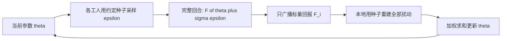

# Evolution Strategies：把策略当黑盒函数，用共享随机数把梯度通信压成标量

<!-- release-date: 2017-03-10 -->

**本文依据**：`Evolution Strategies as a Scalable Alternative to Reinforcement Learning`，arXiv **1703.03864v2**（[stat.ML] 7 Sep 2017），**13 页**。作者 Tim Salimans、Jonathan Ho、Xi Chen、Szymon Sidor、Ilya Sutskever，OpenAI。原件首次公开日取 arXiv **v1** 提交日 **2017-03-10**（Submitted on 10 Mar 2017）；解读依据本地已核的 **v2**（CreationDate 2017-09-11，`pdfinfo` Pages: 13）。v2 日期不回写 `release-date`。文中数字都标 PDF 页码。标「外部补充」的段落不来自本文。

## 一句话

把整条轨迹的回报当成参数 $\theta$ 上的黑盒函数 $F(\theta)$，在 $\theta$ 附近加各向同性高斯噪声，用得分函数估梯度。工人之间事先约定随机种子，每人只需广播一个标量回报，就能在本地重建全部扰动并更新。于是可以扩到一千多个 worker：MuJoCo 3D humanoid 用 **1,440** 个工人大约 **10 分钟**走通；Atari 用约 **720** 个 CPU、每局大约 **1 小时**、**10 亿**帧，与当时发表的 A3C 一天结果对照，**23** 局更好、**28** 局更差（PDF p.1–2, p.7–8）。

## 一、矛盾：MDP 强化学习要梯度、要价值、要通信整条梯度

当时主流把控制问题写成马尔可夫决策过程，再用价值函数或策略梯度学。这条路已经能从像素打 Atari、学直升机特技、下出专家级围棋（PDF p.1）。另一条更老的路是**直接策略搜索**：把策略参数当成黑盒优化的自变量，环境只给标量回报，不要求可微。应用到神经网络上，这一支常叫神经进化（PDF p.1）。

黑盒方法有几条看起来很诱人的性质：不关心回报是稀疏还是稠密、不需要反传、理论上能扛任意长的时间跨度（PDF p.2）。但社区当时的印象是：它们打不过 Q-learning 和策略梯度，尤其是深度强化学习当时在啃的那些硬环境（PDF p.2）。

作者要证明的不是「进化策略在理论上更优雅」，而是两件事叠在一起（PDF p.1–2）：

1. 经过网络重参数化之后，进化策略能稳定地训神经网络策略；
2. 用共享随机数把通信压成标量之后，它能线性扩到上千工人，用墙钟时间把样本效率上的劣势摊掉。

机制示意，根据 Algorithm 2（PDF p.3）。

## 二、进化策略在这篇里具体指什么

进化策略是一类受自然进化启发的黑盒优化：每一代扰动一批参数向量，按适应度筛选，再组下一代（PDF p.2）。最出名的成员是 CMA-ES，用全协方差多元高斯表示种群，在中低维优化上很成功（PDF p.2）。

本文用的是**自然进化策略**（Natural Evolution Strategies，NES）这一支，和 Sehnke 等人的参数探索策略梯度很近（PDF p.2）。种群是参数上的分布 $p_\psi(\theta)$，目标是最大化种群平均目标 $\mathbb{E}_{\theta\sim p_\psi} F(\theta)$。对 $\psi$ 的梯度用得分函数估计，形式和 REINFORCE 一类（PDF p.2）：

$$
\nabla_\psi \mathbb{E}_{\theta\sim p_\psi} F(\theta)=\mathbb{E}_{\theta\sim p_\psi}\bigl\{F(\theta)\nabla_\psi\log p_\psi(\theta)\bigr\}
$$

当 $p_\psi$ 是分解高斯时，这个估计还分别被叫做同时扰动随机逼近、参数探索策略梯度、零阶梯度估计（PDF p.2）。

强化学习设定里，$F$ 是环境给的随机回报，$\theta$ 是确定性或随机策略 $\pi_\theta$ 的参数，动作可以离散也可以连续（PDF p.2）。作者把种群取成各向同性高斯：均值就是当前 $\theta$，协方差钉死为 $\sigma^2 I$。于是目标可以写成对标准正态噪声的期望（PDF p.2–3）：

$$
\mathbb{E}_{\epsilon\sim\mathcal{N}(0,I)} F(\theta+\sigma\epsilon)
$$

直观上，这是把原来可能不光滑的 $F$ 做了一次高斯模糊：环境不可微、动作离散，都先被噪声抹平，再对 $\theta$ 做随机梯度上升（PDF p.3）：

$$
\nabla_\theta\mathbb{E}_{\epsilon\sim\mathcal{N}(0,I)} F(\theta+\sigma\epsilon)=\frac{1}{\sigma}\mathbb{E}_{\epsilon\sim\mathcal{N}(0,I)}\bigl\{F(\theta+\sigma\epsilon)\,\epsilon\bigr\}
$$

Algorithm 1 就是用样本近似这一式：采样 $n$ 个 $\epsilon_i$，跑回合得到 $F_i=F(\theta_t+\sigma\epsilon_i)$，再

$$
\theta_{t+1}\leftarrow\theta_t+\alpha\frac{1}{n\sigma}\sum_{i=1}^{n} F_i\,\epsilon_i
$$

输入是学习率 $\alpha$、噪声标准差 $\sigma$、初值 $\theta_0$（PDF p.3）。全程没有对策略网络做反传，也没有价值网络。

## 三、为什么能扩到上千工人：共享种子，只传标量

并行友好来自三件事（PDF p.3）：

1. **按完整回合工作**，工人之间通信本来就不密。
2. 每个工人真正拿到的新信息只有**标量回报**。优化开始前同步随机种子，每人就知道别人用了什么扰动；只要把标量 $F_i$ 发给所有人，就能在本地重建全部 $\epsilon_j$，并算出同一次参数更新。带宽远低于策略梯度那种传整条梯度。
3. **不需要价值函数逼近**。带价值估计的强化学习有内在串行：策略一改，价值往往要追好几步才有信号；策略再大改，价值又要再追。

Algorithm 2 把这件事写死（PDF p.3）：$n$ 个工人共享种子和 $\theta_0$；每轮各自采样 $\epsilon_i$、算 $F_i$；把所有标量 $F_i$ 发给所有人；每人用已知种子重建全部扰动，做同一条更新。

实现上，每个工人训练开始时实例化一大块高斯噪声，每轮用随机下标切一块来扰动。跨迭代的扰动因此并不严格独立，作者说实践中没构成问题（PDF p.3–4）。即便到 **1,440** 个并行工人，Algorithm 2 后半段（重建扰动并更新）在他们所有实验里仍只占很小一部分时间（PDF p.4）。工人再多、网络再大时，可以让每人只扰动 $\theta$ 的一个子集，分布变成高斯混合，更新式不变；极端情况每人只动一个坐标，就退化成纯有限差分（PDF p.4）。

方差和稳定性上还有几处固定配方（PDF p.4）：

- **对偶采样 / 镜像采样**：总是成对评估 $\epsilon$ 与 $-\epsilon$。
- **适应度整形**：更新前对回报做秩变换，削弱离群个体，减少早早掉进局部最优。
- **权重衰减**：防止参数相对扰动涨得过大。
- $\sigma$ **不自适应**：与 Wierstra 等人不同，他们没看到训练中改 $\sigma$ 的好处，把它当固定超参。
- 优化直接在参数空间做；间接编码留给未来工作。

完整回合长度不齐时，CPU 利用率会塌。做法是把回合长度封顶在常数 $m$，并随训练动态调。例如把 $m$ 设成平均步数的两倍，最坏情况利用率仍能保证在 **50%** 以上（PDF p.4）。

**可迁移**：分布式优化里，若更新只依赖「种子 + 标量」，通信就不再跟参数维数走。这条比「进化」这个名字更值得带走。它依赖的前提是：所有工人能确定性地复现同一批扰动。

## 四、网络怎么参数化：探索来自扰动参数，不来自采样动作

Q-learning 和策略梯度靠**随机策略采样动作**来探索。进化策略的学习信号来自**采样一整套策略参数**：必须有些个体的回报明显高于另一些，高斯扰动才有用（PDF p.4）。

Atari 上，直接对 DeepMind 那套卷积架构加高斯扰动，探索经常不够：有的游戏里，随机扰动后的策略会无视状态、永远输出同一个动作（PDF p.4）。作者发现，在策略里加上**虚拟批归一化**（virtual batch normalization）之后，多数游戏能对上策略梯度的表现（PDF p.4）。它就是批归一化，但算归一化统计量的 minibatch 在训练开始时选定并**钉死**。早期权重还随机时，策略会对输入图像的微小变化更敏感，动作种类才够宽，偶尔才能碰到奖励（PDF p.4）。一般应用里虚拟批归一化会让训练更贵；这里用来算统计量的 minibatch 远小于一局步数，开销可以忽略（PDF p.4）。

MuJoCo 上，标准多层感知机映到连续动作，几乎所有环境已经够用。部分环境把动作离散化能逼出更多探索：动作对观测和参数扰动不再光滑，一整条 rollout 里行为会更杂（PDF p.4）。后文跳跃和游泳把每个动作分量离散成 **10** 档（PDF p.7）。

## 五、噪声加在参数上，还是加在动作上

决策问题给一串动作 $a=\{a_1,\ldots,a_T\}$ 之后才给回报 $R(a)$，目标 $F(\theta)=R(a(\theta))$。动作可以离散、策略可以确定，$F$ 可以对 $\theta$ 不光滑；环境转移又拿不到显式式子，梯度不能靠反传算（PDF p.4–5）。两边都是「加噪声把问题抹光滑，再估梯度」，差别在噪声加在哪（PDF p.5）。

策略梯度把噪声加在**动作空间**：例如离散动作先打分再 softmax 采样，目标是 $F_{PG}(\theta)=\mathbb{E}_\epsilon R(a(\epsilon,\theta))$。进化策略把噪声加在**参数空间**：$\tilde\theta=\theta+\xi$，再 $a_t=\pi(s;\tilde\theta)$，相当于对原目标做高斯模糊（PDF p.5）。两者可以同时加噪声，会更像（PDF p.5）。

### 长回合时，谁的方差跟 $T$ 走

假设回报与单个动作相关性低（作者说任何难的强化学习问题都这样），用带较好基线的朴素蒙特卡洛（REINFORCE）时（PDF p.5）：

$$
\mathrm{Var}[\nabla_\theta F_{PG}]\approx\mathrm{Var}[R(a)]\,\mathrm{Var}[\nabla_\theta\log p(a;\theta)]
$$

$$
\mathrm{Var}[\nabla_\theta F_{ES}]\approx\mathrm{Var}[R(a)]\,\mathrm{Var}[\nabla_\theta\log p(\tilde\theta;\theta)]
$$

探索量差不多时，第一项接近。差别在第二项：$\nabla_\theta\log p(a;\theta)=\sum_{t=1}^{T}\nabla_\theta\log p(a_t;\theta)$ 是 $T$ 个近似不相关项之和，策略梯度方差几乎随 $T$ 线性涨；进化策略对应项与 $T$ 无关（PDF p.5）。

实践中策略梯度会用折扣把有效 $T$ 压下去，这对 Atari 这类短效动作很关键；但动作有长效时，折扣会偏置梯度。价值函数逼近也能压有效 $T$，同样有偏置风险（PDF p.5）。作者因此把进化策略标成在这些条件下更有吸引力：有效步数 $T$ 很长、动作有长效、又没有靠谱的价值估计（PDF p.5）。

这是**方差比较下的作者论证**，不是「进化策略在所有长视野任务上已经赢了」的实验结论。实验主体仍是 MuJoCo 与 Atari。

### 维数吓人，但不等于大网络更差

把期望里减掉常数项 $F(\theta)$，进化策略看起来就是随机方向上的有限差分（PDF p.6）。一般非光滑优化的理论说，所需步数随维数线性涨（PDF p.6）。作者强调：模型参数个数可以和优化问题的**本征维**完全脱钩。线性回归里把特征复制一份、参数也加倍，只要噪声标准差和学习率都除以二，进化策略做的事不变（PDF p.6）。实践中他们用更大网络略好：Atari 试过 A3C 的大网和小网，平均是大网更好；他们猜测和大网络梯度优化更容易、局部极小更少是同一类现象（PDF p.6）。

### 不算解析梯度还带来什么

除了好并行、长序列和延迟回报，黑盒还有几条（PDF p.6）：

- 分布式里要传的只有标量回报和生成 $\epsilon$ 的种子，不是整条梯度。
- 只用整局总回报，能处理极端稀疏、极端延迟的奖励；不依赖逐步奖励及其精确时序。
- 不做反传，每局计算大约少三分之二，显存潜在少得更多。
- 不显式算解析梯度，减轻 RNN 里常见的梯度爆炸；参数空间抹平之后，有界且足够光滑的代价函数不会爆炸。极端情况下可以塞进硬注意力这类不可微模块。
- 适合低精度硬件：低精度架构上有偏的低精度梯度会困扰基于梯度的方法；TPU 一类推理芯片内存通常不够反传，却可以直接拿来做进化策略评估。
- 对**动作频率 / 帧跳**不变。基于 MDP 的算法里，帧跳是关键超参：跳太高，决策来不及；跳太低，有效回合变长，优化变差。长期战略行为上，强化学习往往还要靠层级；黑盒对层级的需求没那么硬（PDF p.6）。

这些是机制上的优点清单。低精度与 TPU 在本文**没有实验**；硬注意力也只是举例。

## 六、实验：MuJoCo 对 TRPO，Atari 对 A3C，墙钟对核数

### MuJoCo：同样 MLP，样本最多大约 10 倍以内对齐 TRPO 终局

对照是高度调过的 TRPO，环境是 OpenAI Gym 连续控制，物理由 MuJoCo 仿真（PDF p.7）。策略结构相同：两层 **64** 单元隐层，中间 tanh（PDF p.7）。跳跃和游泳对进化策略把每个动作分量离散成 **10** 档（PDF p.7）。

进化策略用 **6** 个随机种子，均值学习曲线去对 TRPO 同样口径的曲线。作者说能在 **500 万**环境步时对齐 TRPO 的终局表现（PDF p.7）。难环境 Hopper、Walker2d 上，样本复杂度惩罚一般不到 **10 倍**；简单环境上可以好到 TRPO 的 **3 倍**样本效率（PDF p.7）。表 1 是达到 TRPO 在 500 万步进度的 25% / 50% / 75% / 100% 时，进化策略步数相对 TRPO 步数的比值（PDF p.7）：

| 环境 | 25% | 50% | 75% | 100% |
|---|---:|---:|---:|---:|
| HalfCheetah | 0.15 | 0.49 | 0.42 | 0.58 |
| Hopper | 0.53 | 3.64 | 6.05 | 6.94 |
| InvertedDoublePendulum | 0.46 | 0.48 | 0.49 | 1.23 |
| InvertedPendulum | 0.28 | 0.52 | 0.78 | 0.88 |
| Swimmer | 0.56 | 0.47 | 0.53 | 0.30 |
| Walker2d | 0.41 | 5.69 | 8.02 | 7.88 |

附录表 3 给出对应的绝对分数和步数，曲线按 **6** 次重跑平均（PDF p.13）。例如 Hopper 对齐 100% 时 TRPO 分数 **3403.46**、步数 $4.56\times 10^6$，进化策略步数 $3.16\times 10^7$，比值 **6.94**；Walker2d 对齐 100% 时比值 **7.88**；Swimmer 对齐 100% 时比值 **0.30**（PDF p.13）。

探索行为上，作者观察到 humanoid 上进化策略会学出侧走、倒走等很宽的步态，TRPO 从未见到，说明探索性质不同（PDF p.2）。这是观察，不是表 1 里的数字。

### Atari：10 亿帧、大约 1 小时、23 胜 28 负

并行实现按 Algorithm 2，在 OpenAI Gym 的 **51** 个 Atari 2600 游戏上跑（PDF p.7）。预处理和前馈 CNN 与 Mnih 等人 2016 的 A3C 相同（PDF p.7）。每局训 **10 亿**帧，神经网络计算量大约等于当时发表的 A3C **1 天**结果（A3C 用 **3.2 亿**帧）；差别来自进化策略不做反传、不用价值函数（PDF p.1, p.7）。用 Amazon EC2 上 **720** 个 CPU 并行评估扰动，每局训练墙钟大约 **1 小时**（PDF p.7）。终局对比发表的 A3C：**23** 局更好，**28** 局更差；完整分数在附录表 2（PDF p.1, p.7, p.12）。

引言还写：数据效率大约是 A3C 的 **3 倍到 10 倍**样本；不做反传、没有价值函数，计算大约少 **3 倍**，部分抵消样本劣势（PDF p.1–2）。1 小时进化策略与发表的 1 天 A3C 计算量大致相当（PDF p.1–2）。

表 2 设定：前馈 CNN、确定性策略评估、**10** 次重跑平均、最多 **30** 个随机初始空操作；对照 DQN、A3C 来自 Mnih 等 2016，HyperNEAT 来自 Hausknecht 等 2014；A2C 是作者自己的同步版 A3C，**3.2 亿**训练帧，评估设定与进化策略相同；全部从原始像素训练（PDF p.12）。摘几行，避免把 51 局抄成专表：

| 游戏 | DQN | A3C FF, 1 day | HyperNEAT | ES FF, 1 hour | A2C FF |
|---|---:|---:|---:|---:|---:|
| Atlantis | 76108.0 | 772392.0 | 61260.0 | 1267410.0 | 2872644.8 |
| Breakout | 303.9 | 551.6 | 2.8 | 9.5 | 368.5 |
| Freeway | 25.8 | 0.1 | 29.0 | 31.0 | 0.0 |
| Kangaroo | 2696.0 | 106.0 | 800.0 | 11200.0 | 1357.6 |
| Montezuma’s Revenge | 50.0 | 53.0 | 0.0 | 0.0 | 0.0 |
| Pong | 16.2 | 11.4 | 17.4 | 21.0 | 20.8 |
| Q*Bert | 4589.8 | 13752.3 | 695.0 | 147.5 | 15758.6 |
| Venture | 54.0 | 19.0 | 0.0 | 760.0 | 0.0 |

Breakout、Q*Bert 上进化策略明显弱于 A3C / A2C；Freeway、Kangaroo、Venture、Atlantis 上 1 小时进化策略可以强很多。Montezuma’s Revenge 上进化策略是 **0.0**，并不自动解决稀疏探索迷宫（PDF p.12）。

超参：Atari 全部环境共用一套固定超参；MuJoCo 另一套固定超参，例外是一个二元超参没有在不同 MuJoCo 环境之间保持不变（PDF p.2）。

### 墙钟：1,440 核，3D humanoid 约 10 分钟

3D Humanoid 被选来做扩展实验，因为作者认为它是当时最先进强化学习能解的最难连续控制之一，那些方法在当时硬件上大约要一天（PDF p.7）。进化策略在一台 **18** 核机器上大约 **11 小时**，与强化学习相当；扩到 **80** 台机器、**1,440** CPU 核，大约 **10 分钟**，实验周转大约快两个数量级（PDF p.7–8）。图 1：达到分数 **6000** 的时间对 CPU 核数；每点重复 **7** 次，报中位数。图上标注 **18** 核 **657** 分钟，**1440** 核 **10** 分钟；作者说该任务上核数近似线性加速（PDF p.8）。

### 帧跳：Pong 上 1 到 4 看起来差不多

第 4.4 节在 Pong 上把帧跳取 $\{1,2,3,4\}$。图 2：虽然表现有随机性，各设定学习差不多快，每次运行大约 **100** 次权重更新就收敛（PDF p.8）。这是「梯度估计对回合长度不变」那条论证的实验注脚，不是所有游戏、所有算法都对帧跳不敏感。

## 七、相关工作里这篇声称贡献什么

神经进化训网络、Atari 上的 HyperNEAT、Sehnke 的参数探索策略梯度、压缩权重空间上的进化策略、NES 做黑盒与 RNN 隐层、以及黑盒与策略梯度的混合，都有前人（PDF p.8）。作者把自己的贡献收成：证明这一类算法在分布式硬件上极其可扩展、实现仔细时在当时最难的问题上能和竞争强化学习算法比表现，数据效率意外地接近，墙钟更短（PDF p.8）。

结论再次强调：对动作频率和延迟回报不变，不需要时间折扣或价值函数；最重要的是高度可并行，用更多工人补数据效率（PDF p.9）。未来工作他们点了 MDP 不太擅长的长视野与复杂奖励、元学习（引用 Duan 等 2016b 的 RL$^2$ 作为强化学习设定里元学习的概念验证，希望用黑盒往前推），以及低精度网络实现（PDF p.9）。这些是计划，不是本文结果。

## 八、限制：论文写了什么，什么没写

- **样本通常更贵。** Atari 相对 A3C 大约 3–10 倍数据；MuJoCo 难环境相对 TRPO 可达约 7–8 倍步数才对齐终局（PDF p.1–2, p.7, p.13）。墙钟优势建立在「你真有几百到一千多个 CPU」上。
- **不是 51 局全胜。** 23 好 28 差；Breakout、Q*Bert、Beam Rider、Demon Attack 等明显落后（PDF p.7, p.12）。
- **探索仍可能失败。** 卷积策略不加虚拟批归一化会塌成常动作；Montezuma’s Revenge 上分数为 0（PDF p.4, p.12）。
- **$\sigma$ 不自适应、间接编码没做。** 作者明确没看到改 $\sigma$ 的好处；间接编码留待未来（PDF p.4）。
- **CMA-ES 的全协方差没有上。** 本文是固定各向同性高斯的 NES 特例，不是把 CMA-ES 扩到深度策略（PDF p.2–3）。
- **低精度、TPU、硬注意力、元学习没有实验。** 只在机制讨论和结论里出现（PDF p.6, p.9）。
- **Humanoid 的「solve」在扩展实验里是分数 6000 的墙钟，不是表 1 那套 TRPO 百分比口径**（PDF p.8）。不要把 10 分钟和表 1 的步数比混成同一指标。

## 可迁移启发

1. **通信对象可以不是梯度。** 共享随机数让工人只同步标量。任何「扰动可复现、评价是标量」的分布式搜索都能借。
2. **探索放在参数空间，网络参数化就要为它服务。** 虚拟批归一化和动作离散化说明：黑盒优化不是「随便扰动权重」。
3. **长视野、延迟回报、不贴现，是这条方法的理论舒适区。** 本文的硬实验仍是短视野游戏和机器人步态；把舒适区当成已经验证的胜场，是读过头。
4. **用工人数换样本效率，前提是近似线性加速真的在。** 图 1 只画到 Humanoid、分数 6000。换任务、换网络宽度，重建扰动那一段可能不再便宜。
5. **帧跳不再是第一超参，不等于层次结构可以不要。** 论文只在 Pong 上展示 1–4 帧跳曲线接近。

## 关键词回看

- **进化策略（Evolution Strategies，ES）**：用种群扰动参数、按回报更新分布的黑盒优化；本文是固定方差各向同性高斯上的自然进化策略。
- **自然进化策略（NES）**：对种群分布参数做随机梯度上升，梯度用得分函数估计。
- **共享随机数 / 公共随机数**：工人共享种子，只传标量回报，本地重建扰动。
- **虚拟批归一化**：统计量 minibatch 开训时钉死的批归一化，用来让早期策略对像素更敏感。
- **参数空间平滑 vs 动作空间平滑**：进化策略扰动 $\theta$，策略梯度扰动 $a$；后者的得分项随回合长度 $T$ 涨方差。
- **适应度整形、镜像采样、权重衰减**：本文用来降方差、抗离群、防止参数相对噪声过大的固定技巧。
