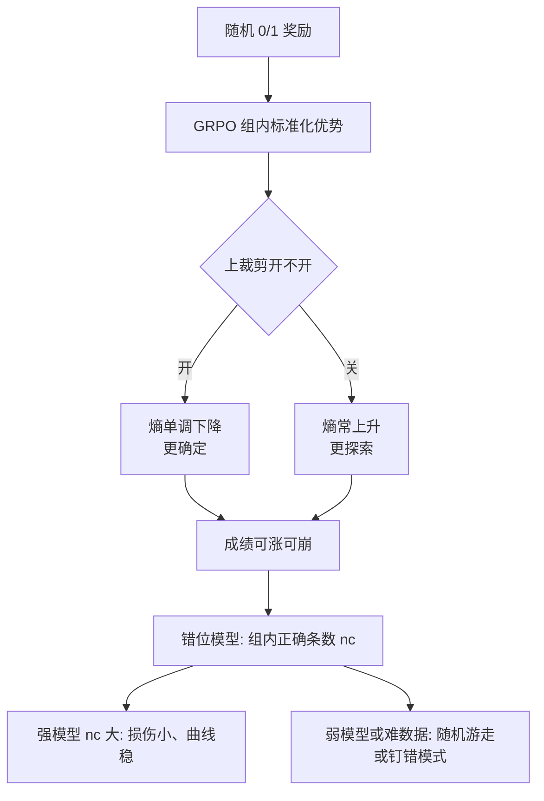

# 假奖励也能涨分：RLVR 里裁剪压的是熵，不是学习信号

<!-- release-date: 2025-12-18 -->

**本文依据**：`Exploration vs Exploitation: Rethinking RLVR through Clipping, Entropy, and Spurious Reward`，arXiv **2512.16912v3**（[cs.LG] 26 Jan 2026），35 页。封面印 **Published as a conference paper at ICLR 2026**。作者 Peter Chen、Xiaopeng Li、Ziniu Li、Wotao Yin、Xi Chen、Tianyi Lin；单位 Columbia、CUHK SZ、DAMO Alibaba US、NYU Stern。原件首次公开日取 arXiv **v1** 提交日 **2025-12-18**；解读依据本地已核的 **v3**（35 页）。文中数字都标 PDF 页码；标「外部补充」的段落不来自本文。

## 一句话

可验证奖励强化学习（Reinforcement Learning with Verifiable Rewards，RLVR）里出现过一对相反的经验：给与标准答案无关的**假奖励**（spurious reward），会压住「按真对错去剥削」；反过来做**熵最小化**，会压住探索、把输出变得更确定。两边都能让数学推理变好，听起来像悖论。本文的拆法是：在随机奖励下，**上裁剪偏差本身几乎不是学习信号**；它真正做的事是把策略熵压下去，让输出更自信、更确定。但**单靠把熵压低不够**——难数据、弱模型上，低熵会钉在错轨迹上。假奖励何时有用，要用**奖励错位模型**看组内对错条数：更强的模型（组里正确 rollout 更多）受损更小、曲线更稳，这个机制**不依赖「评测集被污染」**。Llama、QwQ 上也有同类涨幅（PDF p.1–2）。

## 读前三个词

- **RLVR**：答案能自动核对（数学对答案），整条生成只给一个 0/1，中间 token 没有逐步奖励。
- **假奖励 / 随机奖励**：奖励跟对错无关。文中的标准例子是独立掷硬币：$r\sim\mathrm{Bernoulli}(1/2)$（PDF p.3 定义 2.3）。
- **策略熵**：策略把概率摊得有多开。熵高，采样花样多；熵低，几乎总走同一小撮轨迹。

后文说的 **GRPO**（Group Relative Policy Optimization，组相对策略优化）是 RLVR 里常用的更新：同一提示采一组回答，用组内均值、标准差把奖励标准化成优势，再对重要性比率做 PPO 式裁剪（PDF p.2–3）。

## 一、矛盾：压剥削和压探索，怎么都能涨

经典强化学习里，探索—剥削的账是清楚的。假奖励（随机噪声）会把高回报动作搅乱，本该伤剥削；熵正则则鼓励随机，本该促探索。RLVR 对语言模型却不是这个账，论文列了三条结构性差别（PDF p.1）：

1. 奖励是**结果级、极稀疏**，只在长 rollout 结束时核对，中间所有 token 在奖励上等价。
2. 探索发生在**序列空间**，主要由解码温度管，而不是状态局部的探索奖金。
3. 更新靠**比率裁剪**加**组内相对排名**，对重要性比率和相对名次比对绝对奖励更敏感。

于是出现文献里的悖论（PDF p.1–2）：

- Shao 等人报告：Qwen-Math 在 MATH500 上用随机奖励微调，分数明显涨；他们把原因写成 PPO 式**上裁剪偏差**——已经高先验的 token 被允许涨得更多，像在挖被污染的记忆。Wu 等人也指出 Qwen-Math 在 MATH500 上污染很重。
- 另一边，熵最小化被大量用在 RLVR 里，Agarwal、Gao 等人甚至**不给可验证反馈、直接优化熵**，也报出增益。
- Oertell 等人则反过来：随机奖励微调并不稳定变好，有时变差，涨分可能是算法启发式和评测伪影。

本文盯两件事：（i）策略熵和成绩到底什么关系；（ii）假奖励的增益，是不是裁剪偏差 × 模型污染就能讲完（PDF p.2）。

（机制示意，根据 PDF p.1–2、§4–§5 重画，不是实测曲线。）

## 二、GRPO 在算什么，随机奖励把优势变成什么

RLVR 给回答 $y$ 一个二值结果奖励 $r(x,y)$，对了 1、错了 0。目标是 $J(\theta)=\mathbb{E}[r]$。轨迹来自旧策略 $\pi_{\mathrm{old}}$，用逐 token 重要性比率 $r_t(\theta)$ 把梯度估到当前策略上，再套裁剪代理（PDF p.2–3）。

GRPO 对每个提示采 $G$ 条 $\{y^{(i)}\}$，优势是组内标准化（PDF p.3 式 1）：

$$
A(x,y^{(i)})=\frac{r(x,y^{(i)})-\mathrm{mean}(\{r^{(j)}\})}{\mathrm{std}(\{r^{(j)}\})}
$$

备注 2.1：在这个更新里，**token 级优势等于整条回答的优势**，与位置 $t$ 无关（PDF p.3）。

随机奖励下，引理 2.4 给出几条后面理论都要用的性质（PDF p.3–4）：$A_i$ 关于 0 对称，奇次矩为 0；$|A_i|$ 有上界 $\sqrt{G-1}/\sqrt{G}$。也就是说，硬币奖励仍然会在组里制造正负优势，但**正负与对错独立**。

上裁剪（备注 2.5）强制 $r_t\le 1+\varepsilon$，于是新策略在该 token 上最多比旧策略多涨 $\varepsilon\pi_{\mathrm{old}}$。旧概率已经高的 token，绝对增量上限更大；低概率 token 更早撞墙。这就是「裁剪在放大高先验」的故事（PDF p.4）。本文后面要证明：这个故事**解释不了**随机奖励下的涨分。

策略熵写成 $H(\pi_\theta)=-\mathbb{E}_{y\sim\pi}[\log\pi(y|x)]$（PDF p.4 定义 2.6）。Cui 等人给过一阶近似（PDF p.4 式 5）：

$$
H(\pi_{\mathrm{new}})-H(\pi_{\mathrm{old}})\approx -\mathrm{Cov}\big(\log\pi_{\mathrm{old}}(y|x),\,A(x,y)\big)
$$

直观：高概率回答常拿 1、低概率拿 0，分布变尖、熵降；反过来熵升。**备注 2.7 说：随机奖励下这条式子失效。** $A$ 与 $\pi_{\mathrm{old}}$ 独立且均值为 0，代入得到熵变应为 0。实验里熵却明显在动，而且跟裁剪开没开绑在一起。原因有两层：一阶展开丢掉高阶项；更关键的是式 5 **假设没裁剪**（PDF p.5）。

## 三、裁剪偏差：量级太小，当不了学习信号

把上裁剪代理拆成未裁剪项 $N_t=r_t A$ 和裁剪修正 $N_t^{\mathrm{clip}}=\bar r_t A$。上激活指示 $I_t^+=1\{r_t>1+\varepsilon\}$，总上裁剪修正 $C_{\mathrm{tot}}^+=\sum_t(\bar r_t-r_t)I_t^+ A$（PDF p.5 定义 3.1）。

定理 3.2 给 $E[|C_{\mathrm{tot}}^+|]$ 的上界，关键变量是可监测的 token 级激活率 $p^+$：激活越多，修正越大。不同模型族 $p$ 不同，但都可以在训练里直接看（PDF p.5 备注 3.3）。

定理 3.4（Law of Clipping）再把未裁剪代理和 $|N_{\mathrm{raw}}|$ 跟这项修正比：在实用超参下 $E[|N_{\mathrm{raw}}|]\gg E[|C_{\mathrm{tot}}^+|]$（PDF p.6）。

实验跟 Shao 等人对齐超参：Qwen2.5-Math-7B、DeepScaleR、随机奖励 $\mathrm{Bernoulli}(1/2)$；batch 128、组大小 16、解码温度 1.0、裁剪比 0.2、学习率 $5\times10^{-7}$、KL 系数 0；框架 verl；验证集 MATH500；提示用 verl 默认、要求答案装进 box（PDF p.6）。

经验数字（PDF p.6 备注 3.5）：一般 GRPO 的裁剪激活率通常低于 **1%**；Qwen2.5-Math-7B 这条设定下**从未超过 0.2%**，期望激活 $E[I_t]\approx 0.001$。

图 1：不开裁剪，MATH500 验证常涨；开裁剪，验证曲线可以往下掉。作者据此说：上裁剪偏差**不是**随机奖励增益的驱动机制（PDF p.6）。

推论 3.6 把定理 3.4 代入他们的训练数：$\eta=5\times10^{-7}$，$\varepsilon=0.2$，$p^+=0.001$，$G=16$，$L=4096$，$\pi_{\min}=10^{-6}$，则 $M=3.75$，$E[|A|]\approx 0.967$，$R_\eta^{\max}\approx 1.649$，比值

$$
\frac{E[|N_{\mathrm{raw}}|]}{E[|C_{\mathrm{tot}}^+|]}\gtrsim 17.15
$$

（PDF p.6）。备注 3.7：即使模型或基准被污染，上裁剪偏差也对梯度给不出有意义的学习信号。裁剪仍会在第四节里**因果地改熵**，塑造输出结构，但不增强学习（PDF p.7）。

附录图 5 把 $\varepsilon$ 收到 0.15、0.1：成功的 run 仍收敛到大约 **70%** 验证准确率，与裁剪强弱关系不大；更严的裁剪主要是减小种子方差（PDF p.18）。组大小收到 $G=8$（图 6）多数 run 仍能涨，但方差更大、更不稳——错位视角下，小组更容易整组全 0 或全 1（PDF p.18）。

## 四、裁剪真正干的事：在随机奖励下把熵按下去

一阶协方差故事说随机奖励下熵不该动。第四节改成「一步熵变」，同时吃进裁剪和初始策略偏斜。

### 不开裁剪：熵变看 $\Phi(\pi_{\mathrm{old}})$

定理 4.1（PDF p.7）：

$$
E[H(\pi_{\mathrm{new}})-H(\pi_{\mathrm{old}})]=-c_G\Phi(\pi_{\mathrm{old}})\eta^2+E[R(\eta)]
$$

其中 $c_G=(1-2^{1-G})/G$，$|R(\eta)|=O(\eta^4)$。$\Phi$ 刻画旧策略有多偏。

两臂例子 $\pi_{\mathrm{old}}=(\beta,1-\beta)$：$\Phi\ge 0$ 当且仅当 $\beta\in[0.176,\,0.824]$。不太偏的策略，期望熵降；$\beta>0.824$ 或 $\beta<0.176$ 这种更偏的策略，期望熵升（PDF p.7 备注 4.2）。图 9 是玩具验证；图 2 左是真实训练里不开裁剪时熵上升。

他们在 DeepScaleR 前 500 题上，每题采 64 条，估 Qwen-Math-7B 的 $\Phi(\pi(\cdot|x))$：**358 / 500** 题满足 $\Phi<0$，和不开裁剪时熵上升一致（PDF p.19，图 8）。

### 开上裁剪：多一项，熵被按住

定理 4.3 在未裁剪项之外加上与「优势为正且比率撞上裁剪」事件有关的修正。实验对应很干净（PDF p.7–8，图 2）：

- 不开裁剪：策略熵随训练上升（更探索）。
- 开裁剪：策略熵单调下降。

作者把裁剪读成正则：卡住逐 token 似然比，等效缩小一步更新，不让策略离旧分布太远；顺带完成它的老本行——防梯度爆炸。它**不引入额外学习信号**，主要是维持局部信任域（PDF p.8）。

失败案例：R1-Distill-Llama-8B **关掉裁剪**，MATH500 验证准确率在 100 步内从 **65.6%** 到 **76.6%**，大约第 150 步梯度爆炸、成绩骤降（PDF p.8 图 2 右）。开裁剪的对照在图 4 中。附录还写：GRPO 要裁剪，一个动机就是稳住 DeepSeek-R1-671B 这类长思维链训练（PDF p.18）。

### 熵低不等于分高

图 2 已经显示：熵升和熵降**都可以**伴随验证变好。高熵是更扁、更容易摸到新轨迹；低熵是更自信、质量集中在一小撮轨迹上——在 RLVR 里有时也和更高分一起出现，但**不是保证**（PDF p.8）。

图 3 右给出反例：更吵、更难的训练环境里，熵最小化会走到次优策略。把 Qwen2.5-Math-7B 的课程从较温和的 DeepScaleR 换成更难的 AIME Past，同一套超参训 20 个 epoch，验证轨迹像随机游走，几乎没有有意义的涨（PDF p.8–9 图 3 中右）。更强的 QwQ-32B、R1-Distill-Llama-8B（rollout 长度 8192，其余与 7B 相同）在 AIME 上早期 epoch 仍能稳涨（图 3 左、中左）。

结论写成机制而不是口号（PDF p.9）：熵最小化（包括随机奖励下的裁剪）是**体制依赖的正则**，不是万能学习信号。强模型、简单数据上，质量已经堆在对的轨迹上，再集中可以显得有用；弱模型或难数据上，质量堆在错轨迹上，再集中就是钉死错误模式。

附录图 7 是 AIME 上**不开裁剪**的 Qwen2.5-Math-7B：有的种子涨、有的掉，整体仍像随机；熵按理论在升；有代表 trial 是**熵升且分也涨**。裁剪开、关两边一起看：策略熵和成绩**没有直接因果关系**；基线在该数据上越弱，从随机奖励获利的可能性越小（PDF p.19）。

对「显式最小化熵」的方法，正文的态度是谨慎，不要把它当成可验证奖励的替代品（PDF p.8、附录 p.16–17）。附录转述 Cui 等人拟合过 $R=-a\exp(H)+b$（$a>0$），暗示熵降则分升、但过早坍缩会碰到天花板——本文用图 3、图 7 说明这条单调故事在随机奖励设定里站不住（PDF p.16）。

## 五、奖励错位：谁能从随机奖励里获利

经验上两条稳定模式（PDF p.9）：弱模型涨得少，而且「强不强」是相对数据集的；基线准确率靠近 **70%** 时曲线更顺，从大约 **50%** 起步则振荡大得多。

把组内 $G$ 条 rollout 分成正确集 $C$（$n_c$ 条）和错误集 $I$（$n_i$ 条）。随机标签制造两类错：假阳性 FP（错的给了 1）、假阴性 FN（对的给了 0）。定义 5.1 把「本该给正确类的优势质量被错标 divert 走」写成损伤 $\Delta(f,g)$（PDF p.9 式 8）。

命题 5.2（PDF p.9 式 9）：独立 $\mathrm{Bernoulli}(1/2)$ 下

$$
E[\Delta]=n_c\frac{G-n_c}{G},\qquad \mathrm{Var}(\Delta)=n_c\frac{G-n_c}{4G}
$$

期望损伤和方差都随 $n_c$ 变大而缩小，所以更强的模型验证曲线更稳；最大波动在 $n_c\approx n_i$ 的对称区，和图 1 一致（PDF p.10）。

定理 5.3 再拆：当 $n_c>n_i$ 时，FN 主导区对 $E[\Delta]$ 的贡献大于 FP 主导区；随着 $n_c$ 在 $[G/2,G]$ 上增加，FP 那一份占总体损伤的比例严格变小。实践含义：在 $n_c>n_i$ 的数据上训更强模型，总错位更小、尤其更少把优势灌给错误 rollout，因此**更可能**从随机奖励里涨——而且这套机制**在污染设定之外仍然成立**（PDF p.10）。

图 4 是跨模型核对（PDF p.10；右图为六次独立运行的平均改进）：

| 模型 | 设定 | 文中读到的 MATH500 对照 |
|---|---|---|
| Qwen2.5-Math-1.5B | 开裁剪 | 更弱，涨不上去；右图约 **0.48** 到 **0.49±0.03** |
| Qwen2.5-Math-7B | 与图 1 同设定 | 右图约 **0.64** 到 **0.70±0.01** |
| R1-Distill-Llama-8B | 开裁剪，rollout 8192 | 中图曲线上涨；右图约 **0.66** 到 **0.74±0.03** |

Shao 等人曾报：基座 Llama 在随机奖励下跨试验稳定变差。错位视角预测更强的蒸馏 Llama 更该获利。图 4 中：蒸馏 Llama 的涨幅与图 2 同类；更弱、同时可能被污染的 Qwen-Math-1.5B 则吃不到同类增益。因此：**验证集污染解释不了这些涨幅，效果也不绑死在 Qwen-Math 上**（PDF p.10）。附录补充：Llama、QwQ 在社区里**没有**被报污染，用来说明假奖励的行为超出 Qwen-Math（PDF p.18）。

贡献 2 的表述是：实验覆盖 Qwen-Math、Llama、QwQ，规模 7B、8B、32B，含基座与蒸馏变体；假奖励下的改进是稳健的，不绑在单一模型或数据集（PDF p.2）。正文主验证仍以 MATH500 为主（PDF p.4）。

## 六、和前人实验为什么对不上

附录 A 把「随机奖励到底有没有用」的打架收成**设定不可比**，不是一句谁对谁错（PDF p.16）：

- 本文提示跟 Shao 等人不同：Shao 去掉了 Qwen 常用的「答案装进 box」指令，而 Qwen-Math 对格式极敏感；本文用 verl 默认 boxed 提示，因为 verl 的校验器就是抽 boxed 答案打分。其余超参与 Shao 对齐。
- Oertell 等人差得更远：rollout 上限 **1024**（低于 Qwen-Math 的 4096 上下文）；训练集用 MATH 而不是 DeepScaleR；学习率 $1\times10^{-7}$ 对本文 / Shao 的 $5\times10^{-7}$；batch 64 对 128。更小学习率改有效步长，更小 batch 让随机奖励的估计更吵。

污染方面：Wu 等人观察到的 Qwen-Math 污染主要在验证集（如 MATH500）。Qwen2.5-Math 技术报告也承认 MATH 训练/验证很像。本文训练用 DeepScaleR（AMC、AIME、Omni-Math、Still 选题），作者认为这些不在 Qwen2.5-Math 列出的训练来源里，因而**训练数据本身未与 Qwen2.5-Math 训练语料重叠**（PDF p.16）。这只约束训练污染，不否定 MATH500 验证污染的既有报告。

## 七、限制、没写的和可迁移的

第六节把三个引导问题收束如下（PDF p.10）——这是作者自己的判断，不是外推：

1. 随机奖励**可以**改进表现；条件是模型相对该数据够强。弱模型在更难数据上会不稳。
2. 裁剪偏差**不提供有用学习信号**（§3.1）；它的用处是在假信号下**管制策略熵**（§4.1）。
3. 熵和成绩**没有确定性因果关系**：熵降可以伴随崩溃，熵升可以伴随改进。

本文**没有**给出「真奖励 + 假奖励怎么配比」的完整算法，只把「用假奖励主动抬熵、再和真奖励一起调探索—剥削」写成方向（PDF p.7–8 备注 4.4）。也没有在 MATH500 之外把主表铺开；主分析明确跟前人一样盯 MATH500（PDF p.4）。理论里的 $\pi_{\min}>0$、一步 softmax 指数更新、随机奖励独立于对错，都是分析假设（PDF p.3、定义 2.3）。裁剪激活率、17.15 的比值、65.6%→76.6% 都绑在文中那一套超参和模型上，不能当成所有 GRPO 的常数。

可直接带走的几条：

- 看到「随机奖励也能涨」，先查裁剪开没开、组大小、基线准确率落在 50% 还是 70% 附近，再查提示是否 boxed——设定差一项，文献结论就会对不上。
- 监控 token 级裁剪激活率 $p$。激活极低时，不要把涨分归因于上裁剪在「放大高先验」。
- 把熵当正则而不是目标。难数据上若熵在掉、分在抖，先怀疑钉在了错模式，而不是「还不够确定」。
- 假奖励是否有用，先看组内 $n_c$ 相对 $n_i$，而不是先看模型姓 Qwen 还是姓 Llama。

## 关键词回看

**RLVR** 是结果级 0/1；**GRPO** 用组内相对优势加比率裁剪。**假奖励**在这里主要是独立硬币。**上裁剪偏差**在随机奖励下量级远小于未裁剪代理，当不了学习信号，却会把熵按下去。**$\Phi(\pi)$** 决定不开裁剪时熵升还是降。**奖励错位 $\Delta$** 随正确条数 $n_c$ 变大而期望和方差都缩小，用来解释强模型更稳、且增益不必靠污染。
