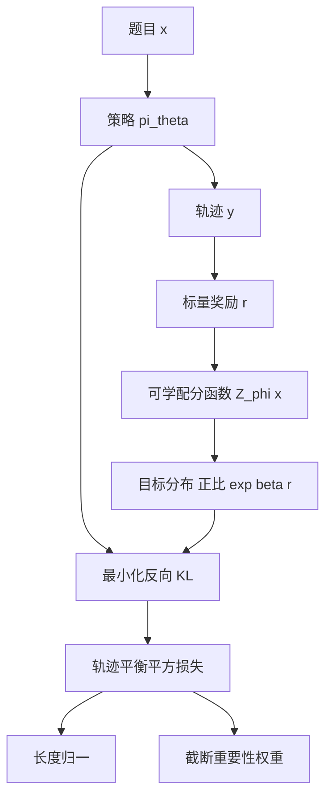

# FlowRL：别只追最高奖励，把整条奖励分布对上

<!-- release-date: 2025-09-18 -->

**本文依据**：`FlowRL: Matching Reward Distributions for LLM Reasoning`，arXiv **2509.15207v3**（[cs.LG] 4 Nov 2025），**22 页**。封面印 LUMIA Lab、**2025-09-17**，**没有会议名**。作者 Xuekai Zhu¹ 等；单位 ¹ Shanghai Jiao Tong University、² Shanghai AI Laboratory、³ Microsoft Research、⁴ Tsinghua University、⁵ Peking University、⁶ Renmin University of China、⁷ Stanford University、⁸ Toyota Technological Institute at Chicago；通讯作者 Bowen Zhou、Hongyuan Mei、Zhouhan Lin。解读机构取封面第一单位 **Shanghai Jiao Tong University**。原件首次公开日取 arXiv **v1** 提交日 **2025-09-18**（Submitted on 18 Sep 2025）；解读依据本地已核的 **v3**（`pdfinfo` Pages: 22）。v3 日期不回写 `release-date`。文中数字都标 PDF 页码。标「外部补充」的段落不来自本文。

## 一句话

大模型推理的强化学习，主流做法是 **奖励最大化（reward maximization）**：PPO、GRPO 一类方法把期望回报往上推。问题是：奖励分布往往有好几个峰，算法容易钉死在最显眼的那一个，少见但合法的推理路径被丢掉，多样性塌掉（PDF p.1–2）。FlowRL 改成 **分布匹配（distribution matching）**：用可学的 **配分函数（partition function）** $Z_\phi(x)$ 把标量奖励归一成目标分布，再最小化策略与该分布之间的 **反向 KL**；这条目标在期望梯度上等价于 GFlowNets 的 **轨迹平衡（trajectory balance）**。数学基准上，相对 GRPO **+10.0%**、相对 PPO **+5.1%**（摘要，PDF p.1）；代码推理上三项都更高（PDF p.7 表 2）。正文把 32B 数学平均写成相对 GRPO **+10.1%**、相对 PPO **+5.1%**（PDF p.7），与摘要四舍五入口径不完全同一句话，下面按表核对。

## 一、矛盾：最大化期望奖励，会把解空间挤成一条路

推理被写成条件生成：题 $x$，答 $y$，策略 $\pi_\theta(y\mid x)$，任务给标量奖励 $r$（PDF p.3）。作者把 LLM 推理 RL 的演进收成一条线（PDF p.2）：

- **REINFORCE**：实现简单，复杂设定上不够稳。
- **PPO**：加 critic、截断、重要性采样，复杂设定更稳。
- **GRPO**：去掉价值网络，用组内比较估优势，代价是每次更新要更多 rollout。

三条路共享同一条目标：**把期望奖励推到最大**。作者认为这会过拟合奖励分布的 **主峰（dominant mode）**，生成路径变少，少见但成立的逻辑走不通（PDF p.2）。长思维链（Chain-of-Thought，CoT）上更严重：有效解本来就是多峰的。

图 1 把两种目标画成对照（PDF p.1）：FlowRL 一侧 KL = **0.11**，覆盖多个峰；奖励最大化一侧（图注写 GRPO）KL = **8.68**，挤在单峰。数字来自封面图，不是表。

近期有人调 clip 比、往优势里加熵、或抬高熵 token 的训练比重，等于 Implicit 地改训练数据分布。作者把问题收成一句：训练时怎样促进多样探索，避免收敛到主导解法（PDF p.2）。

机制示意，根据第 3 节与式 2、6（PDF p.4–6）。不是实测时间线。

## 二、GRPO 在本篇里只当对照：组归一优势，仍是最大化

为了后面对照公式，论文把 GRPO 写全（PDF p.3 式 1）。对每道题从旧策略 $\pi_{\theta_{\mathrm{old}}}$ 采一组 $\{y_1,\ldots,y_G\}$，目标是带 clip 的重要性比率乘组内优势，再减 $\lambda\,\mathbb{D}_{\mathrm{KL}}(\pi_\theta\|\pi_{\mathrm{ref}})$。优势是组内奖励减均值再除标准差。REINFORCE 在本篇定义里：直接策略梯度，没有优势归一、clip、KL。PPO：critic 估优势，重要性采样稳住更新（PDF p.3）。

这些都还是 **期望回报**。FlowRL 要换的是目标本身，不是再给 GRPO 加一项熵。

## 三、从最大化改成匹配：可学 $Z_\phi$ 把标量变成分布

RL 监督往往只有一个标量 $r$，没有完整目标分布；枚举全部合法轨迹也不现实（PDF p.4）。作者借能量模型的做法，引入可学配分函数 $Z_\phi(x)$，把 $\exp(\beta r(x,y))$ 归一成合法分布，再最小化反向 KL（PDF p.4 式 2）：

$$
\min_\theta D_{\mathrm{KL}}\Bigl(\pi_\theta(y\mid x)\;\Big\|\;\frac{\exp(\beta r(x,y))}{Z_\phi(x)}\Bigr)
\quad\Rightarrow\quad
\pi_\theta(y\mid x)\propto\exp(\beta r(x,y))
$$

$\beta$ 是超参。目标分布记作 $\tilde\pi(y\mid x)=\exp(\beta r)/Z_\phi(x)$。脚注：用反向 KL，是因为只能从策略采样，不能从目标奖励分布采样（PDF p.4）。

人话：策略该按奖励高低 **按比例** 去覆盖各条高奖励路径，而不是只占最高的那一座山。

直接优化 KL 不好做。命题 1：在期望梯度意义下，式 2 等价于 GFlowNet 的轨迹平衡损失（PDF p.4 式 3）：

$$
\min_\theta D_{\mathrm{KL}}(\cdots)
\;\Longleftrightarrow\;
\min_\theta\Bigl(\log Z_\phi(x)+\log\pi_\theta(y\mid x)-\beta r(x,y)\Bigr)^2
$$

备注 2：平方损失比直接 KL 稳；$Z_\phi(x)$ 当成可学参数，不必显式算不可积的配分函数（PDF p.4）。附录 A 把 KL 梯度与轨迹平衡梯度写成相差一个常数因子 2（PDF p.18 式 8–10）。

### GFlowNets 在本篇里管什么

**生成流网络（Generative Flow Networks，GFlowNets）** 按给定奖励比例去采样离散组合对象。图 2：初态 $s_0$ 上的初始流 $Z_\phi(s_0)$ 往环境灌概率质量，策略 $\pi_\theta$ 在中间态搬运，终态输出流等于结果奖励 $r(s_n)$（PDF p.3）。$Z_\phi$ 用 3 层 MLP 参数化，跟 Lee 等（2024）一样。附录 C 补详细平衡、轨迹平衡、子轨迹平衡；本篇从轨迹平衡接到 KL 的梯度等价（PDF p.19–20）。

封面图的「Flow Matching」是 **流平衡视角下的 RL**，不是 Lipman 那种连续流匹配策略。相关工作里那些 flow-matching policy 被作者明确划到连续控制 / 图像 / 视觉动作，不解决本篇的奖励最大化塌峰问题（PDF p.10）。

## 四、接到长 CoT：长度归一 + 重要性采样 → FlowRL 目标

直接把轨迹平衡套到最长 **8K** token 的 CoT 上，会撞两件事（PDF p.5）。

**问题 I：长轨迹梯度爆炸。** 轨迹平衡是序列级目标。$\log\pi_\theta(y\mid x)$ 是 token 对数概率之和，梯度范数可能随长度涨。先前 GFlowNets 多在短轨迹、小离散空间上，没碰到这个。

**问题 II：采样错配。** PPO / GRPO 常用 micro-batch、复用旧策略 $\pi_{\theta_{\mathrm{old}}}$ 采的轨迹。KL 轨迹平衡默认完全 on-policy。接进现有 RL 流水线就要改。

奖励也先按 GFlowNets 文献习惯改写成带参考模型先验（PDF p.5 式 4）：

$$
\exp(\beta r(x,y))\cdot\pi_{\mathrm{ref}}(y\mid x)
$$

$r$ 用结果奖励（outcome-based，跟 Guo 等 2025 一样），再做组归一 $\hat r_i=(r_i-\mathrm{mean}(\mathbf r))/\mathrm{std}(\mathbf r)$。代入式 3 得到式 5（PDF p.5）。

**备注 3：长度归一当奖励塑形。** PPO / GRPO 把奖励派到 token、逐步算梯度；轨迹平衡把初始流和结果奖励都当序列级量。变长 CoT 时 $\log\pi$ 会跟 $|y|$ 一起涨。把对数概率改成 $\frac{1}{|y|}\log\pi_\theta(y\mid x)$，长短序列贡献更均衡（PDF p.5）。

**备注 4：重要性采样。** 权重 $w=\pi_\theta(y\mid x)/\pi_{\mathrm{old}}(y\mid x)$。目标是轨迹平衡而不是期望回报，所以对当前策略 **detach**，避免漂太远；再套 PPO 式 clip：$w=\mathrm{clip}(\pi_\theta/\pi_{\mathrm{old}},1-\epsilon,1+\epsilon)^{\mathrm{detach}}$（PDF p.5）。

接到式 5 就是 FlowRL 目标（PDF p.6 式 6–7）：

$$
\mathcal L_{\mathrm{FlowRL}}=w\cdot\Bigl(\log Z_\phi(x)+\frac{1}{|y|}\log\pi_\theta(y\mid x)-\beta\hat r(x,y)-\frac{1}{|y|}\log\pi_{\mathrm{ref}}(y\mid x)\Bigr)^2
$$

$$
w=\mathrm{clip}\Bigl(\frac{\pi_\theta(y\mid x)}{\pi_{\mathrm{old}}(y\mid x)},1-\epsilon,1+\epsilon\Bigr)^{\mathrm{detach}},\quad
\hat r_i=\frac{r_i-\mathrm{mean}(\mathbf r)}{\mathrm{std}(\mathbf r)}
$$

附录 B 命题 5：最小化式 5 的 KL，在梯度上等价于 **联合最大化奖励与策略熵**，再加上 $\pi_{\mathrm{ref}}$ 先验对齐（PDF p.18–19 式 11–14）。作者把它写成：奖励推任务表现，$Z_\phi$ 保证目标分布归一，$\pi_{\mathrm{ref}}$ 给结构先验，熵鼓励多样。这也对上「GFlowNets ≈ 改写 MDP 上的最大熵 RL」那条理论线（PDF p.9, p.18）。

### $Z_\phi$ 怎么接进语言模型

两个可学模块：策略 $\pi_\theta$，配分函数 $Z_\phi$（PDF p.6）。$Z_\phi$：随机初始化 3 层 MLP，隐层维度与基座一致；输入是语言模型编码 $x$ 后隐状态的均值，输出一个标量。附录 E：从流的角度看，$Z_\phi$ 估初态流出的总概率质量，也就是「所有路径奖励之和」那个分母；实现上取 **最后一层、全部 prompt token 隐状态的均值**（PDF p.21）。$\beta=15$，跟 Lee 等（2024）一样（PDF p.6）。

## 五、实验设定：7B / 32B，数学与代码

| 项 | 论文写法（PDF p.6） |
|---|---|
| 数学策略 | Qwen-2.5-7B / 32B |
| 代码策略 | DeepSeek-R1-Distill-Qwen-7B |
| $\pi_{\mathrm{ref}}$ | 对应固定预训练模型 |
| 训练框架 | veRL |
| 基线 | REINFORCE++（文中写 R++）、PPO、GRPO；官方 veRL recipe，学习率 / batch / 步数对齐，按相同步数收敛点评估 |
| 数学数据 | DAPO 训练集 |
| 代码数据 | DeepCoder 设定与训练集 |
| 7B 机器 | 单节点 8×H800 80GB |
| 32B 机器 | 4 节点 32 GPU |
| 长度 | `max_prompt_length=2048`，`max_response_length=8192`（训练与评测一致） |
| batch | 数学 512，代码 64 |
| 学习率 | $1\times 10^{-6}$，veRL 动态 batch |
| 组大小 | GRPO 与 FlowRL 的 `rollout_n=8` |
| 评测采样 | 16 次 rollout，报 Avg@16；温度 0.6，`top_p=0.95` |
| 数学集 | AIME 2024/2025、AMC 2023、MATH-500、Minerva、Olympiad |
| 代码集 | LiveCodeBench、CodeForces、HumanEval+；CodeForces 另报 rating 与百分位 |

## 六、数字：摘要 +10.0% / +5.1%，表上要拆开看

### 数学 Avg@16（表 1，PDF p.7）

相对改进下标是相对 **Backbone**，不是相对 GRPO。

**Qwen2.5-32B-Base，最大回复 8K：**

| 模型 | AIME24 | AIME25 | AMC23 | MATH500 | Minerva | Olympiad | Avg |
|---|---:|---:|---:|---:|---:|---:|---:|
| Backbone | 4.58 | 2.08 | 28.59 | 52.48 | 26.99 | 21.37 | 22.68 |
| R++ | 14.79 | 9.17 | 52.65 | 44.35 | 17.37 | 24.52 | 27.14 |
| PPO | 26.87 | 20.41 | 76.40 | 69.17 | 28.79 | 37.90 | 43.25 |
| GRPO | 23.12 | 14.58 | 76.87 | 61.60 | 18.95 | 34.94 | 38.34 |
| FlowRL | 23.95 | 21.87 | 73.75 | 80.75 | 38.21 | 51.83 | **48.39** |

**Qwen2.5-7B-Base，最大回复 8K：**

| 模型 | AIME24 | AIME25 | AMC23 | MATH500 | Minerva | Olympiad | Avg |
|---|---:|---:|---:|---:|---:|---:|---:|
| Backbone | 4.38 | 2.08 | 30.78 | 54.47 | 22.38 | 24.03 | 23.02 |
| R++ | 11.04 | 5.41 | 66.71 | 54.25 | 24.37 | 27.33 | 31.52 |
| PPO | 9.38 | 7.29 | 63.43 | 57.98 | 26.53 | 27.25 | 31.98 |
| GRPO | 13.54 | 9.79 | 64.53 | 57.05 | 23.06 | 26.88 | 32.48 |
| FlowRL | 15.41 | 10.83 | 54.53 | 66.96 | 31.41 | 34.61 | **35.63** |

第 5.1 节把 7B / 32B 平均写成 **35.6%** 与 **48.4%**，32B 上「超过 PPO **5.1%**、GRPO **10.1%**」（PDF p.7）。用表内平均核对：

- $48.39-43.25=5.14$，与 **5.1%** 对齐；
- $48.39-38.34=10.05$，摘要写 **10.0%**（PDF p.1），正文写 **10.1%**（PDF p.7）。本篇转述时两处都保留，不以口算改表。

表注写「FlowRL 在 7B 与 32B 上都超过全部基线」（PDF p.7）。这是对 **Avg 列** 说的。分项并不处处领先：

- 32B AIME24：PPO 26.87 > FlowRL 23.95；AMC23：GRPO 76.87 > FlowRL 73.75。
- 7B AMC23：R++ 66.71、GRPO 64.53、PPO 63.43，FlowRL 只有 54.53，比基座仍高，但低于三条 RL 基线。
- 32B 上 MATH-500（80.75）与 Olympiad（51.83）拉平均最明显。

### 代码（表 2，PDF p.7；DeepSeek-R1-Distill-Qwen-7B，8K）

| 模型 | LCB Avg@16 | LCB Pass@16 | CF Rating | CF 百分位 | HumanEval+ Avg@16 |
|---|---:|---:|---:|---:|---:|
| Backbone | 30.68 | 49.46 | 886.68 | 19.4% | 80.90 |
| R++ | 30.46 | 52.68 | 1208.03 | 56.8% | 76.61 |
| PPO | 35.10 | 54.48 | 1403.07 | 73.7% | 82.32 |
| GRPO | 32.75 | 52.32 | 1313.82 | 67.1% | 80.13 |
| FlowRL | **37.43** | **56.27** | **1549.47** | **83.3%** | **83.28** |

代码三项 FlowRL 都最高。相对 Backbone：LiveCodeBench Avg@16 **+6.75**，Pass@16 **+6.81**，CodeForces rating **+662.79**、百分位 **+63.9** 个百分点，HumanEval+ **+2.38**。摘要只说「代码推理上 consistently better」，没有再给一个总平均百分比（PDF p.1）。

R++ 在 HumanEval+ 掉到 76.61（相对 Backbone −4.29），GRPO 也略低于基座（80.13）。这是表内事实，论文没有另作解释。

### 消融：没有重要性采样会塌（表 3，PDF p.8；Qwen2.5-7B，Avg@16）

| 方法 | AIME24 | AIME25 | AMC23 | MATH-500 | Minerva | Olympiad | Avg |
|---|---:|---:|---:|---:|---:|---:|---:|
| FlowRL | 15.41 | 10.83 | 54.53 | 66.96 | 31.41 | 34.61 | 35.63 |
| 去掉 IS | 6.25 | 7.91 | 41.40 | 56.97 | 22.19 | 25.52 | 26.71 |
| Zhang 等 2025a 组合损失 | 10.41 | 6.66 | 53.75 | 66.50 | 30.97 | 33.72 | 33.67 |

去掉重要性采样：平均从 **35.63%** 掉到 **26.71%**。Zhang 等（2025a）是 GFlowNets+PPO 组合损失（原文面向扩散对齐，作者改接到长 CoT）。作者认为轨迹级重要性比率比组合损失更合适（PDF p.8）。

$\beta$：图 3 / 表 7（PDF p.8, p.21）平均分为 $\beta=5$ → 31.34，$\beta=10$ → 34.41，$\beta=15$ → **35.63**，$\beta=30$ → 35.09。$\beta=15$ 最好。$\beta=30$ 时 MATH-500 到 69.02、Olympiad 到 35.03，但 AMC23 掉到 50.62，平均略低于 15。

### 附录温度扫描（7B，Avg@64，PDF p.20）

表 5，温度 0.6：FlowRL 平均 **35.39**，GRPO 32.76，PPO 32.03。表 6，温度 1.0：FlowRL **34.62**，GRPO 32.44，PPO 31.77。两张表里 AMC23 仍是 FlowRL 最低（55.08 / 52.92），与主表同一方向。Backbone 在表 5 的 AIME24 写成 4.37，主表 1 是 4.38，差 0.01，原文如此。

## 七、多样性：GPT 打分近乎翻倍，案例上 GRPO 卡在 AM-GM

作者跟 Yu 等（2025a），用 **GPT-4o-mini** 给各方法在 AIME 24/25 上的全部回复打多样性分，提示词在附录 E，量表 1–5（PDF p.8, p.22）。图 4（PDF p.9）：R++ **1.11**，GRPO **1.23**，PPO **1.31**，FlowRL **2.28**。正文说相对最强基线 PPO「nearly doubling」。这是 LLM 裁判，不是人类标注，论文当假设的经验验证，不是证明。

表 4 案例（PDF p.9）：表面积 54、体积 23 的长方体，求能装下集合中每个盒子的最小球半径，答案形式 $r^2=p/q$，求 $p+q$。GRPO 反复 AM-GM 三次、恒等式循环两次，得到 $a=b=c$ 矛盾，解不出。FlowRL 设 $a=b$，得到三次方程 $a^3-27a+46=0$，有理根 $a=2$，再分支，给出 $r^2=657/64$，答案 **721**。这是一条 rollout 对照，不是全测试集统计。

## 八、相关工作里本篇自己划的边界

第 7 节 + 附录 D（PDF p.9–10, p.20–21）：

- **熵正则**：经典抗塌峰手段；作者说长 CoT（例如超过 8k token）时，正则信号很难有效打进奖励最大化学习。近期工作改训练数据里高熵 token 的比例；FlowRL 是换目标，不是改数据配比。
- **长度归一**：对照 Dr. GRPO（去优势标准差与损失里的长度项）、SRPO（两阶段 + 历史重采样）、GSPO（序列级重要性比做长度归一）。FlowRL 把 $\frac{1}{|y|}\log\pi$ 写进轨迹平衡，当奖励塑形。
- **KL 类目标**：Kimi-K1.5 用采样奖励均值近似归一化常数 $Z$，仍在奖励最大化框架；IPO 针对偏好学习。FlowRL 的 $Z_\phi(x)$ 是 3 层 MLP，反向 KL → 流平衡。

## 九、限制与原文没写的

论文 **没有独立 Limitations 节**。结论只复述方法、数学/代码一致提升、多样性与案例（PDF p.10）。下面把能从正文读出的边界写清，不补实验。

1. **分项不是全胜。** 平均赢，AMC23（7B 尤其）和 32B AIME24 上 PPO / GRPO 可以更高。表注「全部基线」指平均列。
2. **摘要 10.0% 与正文 10.1%。** 都对着 32B 数学平均相对 GRPO；以表 1 的 48.39 / 38.34 为准。
3. **多样性裁判是 GPT-4o-mini**，提示要求「只返回 1 到 5 的数字」（PDF p.22）。没有报告人类一致性、也没有报告评分方差。
4. **奖励仍是结果级 + 组归一**，没有过程奖励、没有 critic。分布匹配的是组内归一后的标量场，不是真实「所有合法证明的测度」。
5. **$Z_\phi$ 只看 prompt 隐状态均值**，不看尚未生成的 $y$。它估的是「这道题的总流」，不是逐步局部流。
6. **规模与任务。** 数学到 32B 基座，代码只到 7B 蒸馏模型；没有更大稠密 / MoE 数字。最长回复钉在 8192。
7. **算力与墙钟。** 写了 8×H800 与 32 GPU，**没有**报相对 PPO/GRPO 的步时、token 效率或总 GPU-hour。
8. **没有开源仓库链接**写在正文（训练脚本基于 veRL）。封面有邮箱与「§ FlowRL」字样，没有 GitHub URL。
9. **没有会议名。** 封面只有 LUMIA Lab 与 2025-09-17，不补。

## 十、可迁移的几条，以及不要过度推广的

可直接带到自己的 RL 训练里想的：

- 目标可以从「$\mathbb{E}[r]$ 最大」换成「按 $\exp(\beta r)$ 覆盖」。塌峰时先问是不是目标错了，再问要不要加熵项。
- 不可积的配分函数可以学一个 $Z_\phi(x)$，用平方轨迹平衡当 KL 的代理。
- 序列级损失遇上变长 CoT，先对 $\log\pi$ 做 $1/|y|$，否则长轨迹梯度会吃掉短轨迹。
- 复用旧 rollout 时，轨迹级 clip+detach 的重要性权重，在本消融里从 26.71 拉回 35.63，比「GFlowNet 损失 + PPO 损失加起来」更有效。

不要直接抄的：$\beta=15$、3 层 MLP、$Z$ 用 prompt 均值，都是本设定（Qwen2.5 / R1-Distill、DAPO / DeepCoder、8K、组大小 8）上的选择。AMC23 那种「平均涨、单项跌」说明分布匹配不保证每张卷都涨。

## 关键词回看

- **奖励最大化**：把期望标量奖励推高；PPO / GRPO / REINFORCE++ 在本篇里都归此类。
- **分布匹配 / 反向 KL**：让 $\pi_\theta$ 靠近 $\exp(\beta r)/Z_\phi$；只能从策略采样所以用反向 KL。
- **配分函数 $Z_\phi$**：可学归一化常数，3 层 MLP，输入 prompt 隐状态均值。
- **轨迹平衡**：GFlowNets 的序列级流守恒；与上述 KL 期望梯度等价。
- **长度归一与重要性采样**：让长 CoT 和 off-policy 复用接得进这条平方损失。

## 参考资料

- 原件：`readings/_src/训练方法与强化学习/FlowRL.pdf`（本地 v3，22 页）
- arXiv：https://arxiv.org/abs/2509.15207
- 训练框架（论文引用）：veRL / HybridFlow，Sheng 等，arXiv 2409.19256

同库对照（外部补充，不是本文实验）：[PPO](./PPO.md)、[VinePPO](./VinePPO.md)。GRPO 来自 DeepSeekMath，本篇只借用其公式当基线。
