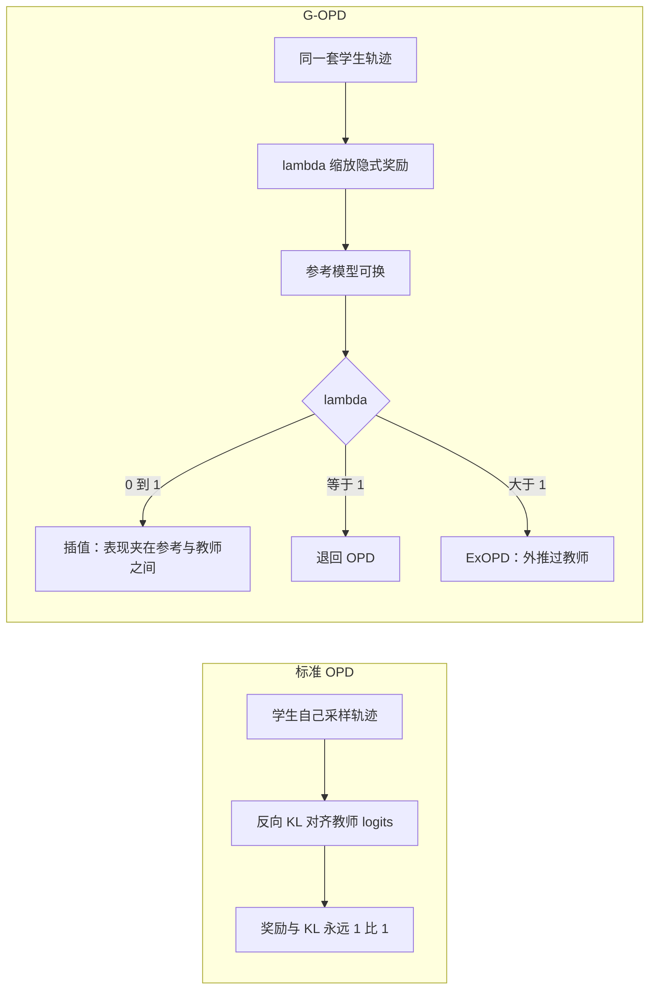

# G-OPD：把同策略蒸馏看成稠密 KL 约束 RL，再把奖励外推过教师

<!-- release-date: 2026-02-12 -->

**本文依据**：`Learning beyond Teacher: Generalized On-Policy Distillation with Reward Extrapolation`，arXiv **2602.12125v2**（[cs.LG] 26 Feb 2026），17 页。作者 Wenkai Yang1,*、Weijie Liu2、Ruobing Xie2、Kai Yang2、Saiyong Yang2、Yankai Lin1,†；1 Gaoling School of Artificial Intelligence, Renmin University of China；2 LLM Department, Tencent。代码 https://github.com/RUCBM/G-OPD。原件首次公开日取 arXiv **v1** 提交日 **2026-02-12**（Submitted on 12 Feb 2026）；解读依据本地已核的 **v2**（17 页，`pdfinfo` Pages: 17）。文中数字都标 PDF 页码；标「外部补充」的段落不来自本文。MiniLLM、Rethinking-OPD 只在本文引用处作对照，不展开成专篇。

## 一句话

同策略蒸馏（on-policy distillation，OPD）不是和强化学习（RL）并列的另一套算法：它是**稠密、KL 约束 RL 的一个特例**——奖励与 KL 正则永远 1 : 1，参考模型还可以随便选。G-OPD 把这两处钉死的地方拆开：参考模型可换，再加一个奖励缩放 $\lambda$。$\lambda>1$ 时做奖励外推（ExOPD），学生不再只逼近教师，而可以越过教师的能力边界。数学推理和代码生成上，同尺寸多教师合并时，ExOPD 是文中**唯一**能同时超过各域教师的方法（PDF p.1 图 1、p.8 表 2）。

## 一、矛盾：OPD 有效，但不知道它到底是什么

后训练里常见三条路（PDF p.2–3）。

**离策略蒸馏**：学生去模仿教师生成的轨迹。完整 logits 往往拿不到，于是退化成对教师 token 做监督微调（SFT）。问题是 off-policy：学生学的是「教师怎么走」，不是「自己走错了该怎么改」。测试时面对自己的错误分布，迁移会断。

**在策略 RL**：轨迹从当前策略 $\pi_\theta$ 自己采。目标是（PDF p.3 式 2）

$$
J_{\mathrm{RL}}(\theta)=\max_\theta\,\mathbb{E}_{x\sim\mathcal{D},\,y\sim\pi_\theta(\cdot|x)}\bigl[r(x,y)-\beta D_{\mathrm{KL}}(\pi_\theta\parallel\pi_{\mathrm{ref}})\bigr].
$$

奖励可以是偏好模型，也可以是可验证任务上的规则打分。KL 项把策略拴在参考模型附近。麻烦是奖励常常**稀疏**：整条回复只在最后一个 token 拿到 outcome reward，中间 token 全是 0（PDF p.4 式 8）。信用分配难。

**同策略蒸馏（OPD）**：学生自己生成轨迹，再在这些 token 上把学生分布拉向教师 $\pi^*$ 的反向 KL（PDF p.3 式 4）

$$
J_{\mathrm{OPD}}(\theta)=\min_\theta\,\mathbb{E}_{x\sim\mathcal{D},\,y\sim\pi_\theta(\cdot|x)}\,D_{\mathrm{KL}}\bigl(\pi_\theta(y|x)\parallel\pi^*(y|x)\bigr).
$$

轨迹是学生自己的，所以是 on-policy；每个 token 都有 logits 监督，所以信用是稠密的。前人已经用它做两件事：把不同域 RL 专家几乎无损地并回原底座；以及把大教师蒸馏进小学生（PDF p.2，分别引 Xiao et al., 2026 与 Gu et al., 2024 / Yang et al., 2025a）。

经验上 OPD 经常快过离策略蒸馏。机制上却几乎没人说清：它和 KL 约束 RL 是什么关系？奖励和 KL 为什么永远一样重？参考模型能不能换？换了之后，学生有没有可能**超过**教师，而不是永远被教师封顶？

这就是本文要拆的钉子。

## 二、OPD = 稠密 KL 约束 RL 的 1 : 1 特例

从式 4 出发，插入任意参考模型 $\pi_{\mathrm{ref}}$，OPD 可以改写成（PDF p.4 式 7）

$$
J_{\mathrm{OPD}}(\theta)=\max_\theta\,\mathbb{E}\Bigl[\log\frac{\pi^*(y|x)}{\pi_{\mathrm{ref}}(y|x)}-D_{\mathrm{KL}}\bigl(\pi_\theta(y|x)\parallel\pi_{\mathrm{ref}}(y|x)\bigr)\Bigr].
$$

对照式 2，这就是 KL 约束 RL，且（PDF p.4 Remark）：

- 奖励 $r(x,y)=\log\frac{\pi^*(y|x)}{\pi_{\mathrm{ref}}(y|x)}$；
- KL 加在 $\pi_\theta$ 与 $\pi_{\mathrm{ref}}$ 之间；
- 奖励与 KL **等权**，相当于 $\beta=1$。

实践里 OPD 的梯度还常用折扣因子 0，只看当前 token（PDF p.3 式 6；附录 A 给出从序列级期望到这个近似的推导，PDF p.14–15）。于是每个 token 的优势可以看成

$$
-\bigl(\log\pi_\theta(y_t|x,y_{<t})-\log\pi^*(y_t|x,y_{<t})\bigr),
$$

也就是稠密、token 级的信用。

和标准 RL 比，OPD 有三处不同（PDF p.4–5）：

1. **稠密奖励**。标准 RL 常常 $t<T$ 时 $r_t=0$，只有末 token 拿 outcome。OPD 每个 token 都是

$$
r_t^{\mathrm{OPD}}=\log\frac{\pi^*(y_t|x,y_{<t})}{\pi_{\mathrm{ref}}(y_t|x,y_{<t})}.
$$

形式接近 DPO 那套隐式奖励（Rafailov et al., 2023；PDF p.4 式 10），但 **不要求** $\pi^*$ 必须从 $\pi_{\mathrm{ref}}$ 上 RL 出来——师生甚至可以不同尺寸。它抓住的是「从参考分布到专家分布的 log 概率位移」。

2. **权重钉死**。奖励和 KL 永远 1 : 1，没有 $\beta$ 可调。

3. **参考模型其实任意**。RL 里 $\pi_{\mathrm{ref}}$ 通常就是策略的起点。OPD 里插入 $\pi_{\mathrm{ref}}$ 再消掉，目标仍回到式 4，所以参考可以是任意模型；默认才取学生的初始策略。

前两条是相对 RL 的优势（稠密 + 灵活参考），第三条是相对「还能不能更强」的缺口：1 : 1 太死。于是有 G-OPD。

## 三、G-OPD：灵活参考 + 奖励缩放 $\lambda$

把式 2 的结构搬回来，同时保留稠密隐式奖励，得到（PDF p.4 式 11）

$$
J_{\mathrm{G\text{-}OPD}}(\theta)=\max_\theta\,\mathbb{E}\Bigl[\lambda\log\frac{\pi^*(y|x)}{\pi_{\mathrm{ref}}(y|x)}-D_{\mathrm{KL}}\bigl(\pi_\theta\parallel\pi_{\mathrm{ref}}\bigr)\Bigr].
$$

$\lambda$ 就是奖励相对 KL 的权重，相当于式 2 里的 $1/\beta$。$\lambda=1$ 退回标准 OPD。$\lambda\neq 1$ 时要额外算 $\log\pi_{\mathrm{ref}}$，有计算代价（PDF p.5 Remark）。

最优解满足（PDF p.5 式 12）

$$
\log\pi_\theta=\lambda\log\pi^*+(1-\lambda)\log\pi_{\mathrm{ref}}=\log\pi^*+(\lambda-1)(\log\pi^*-\log\pi_{\mathrm{ref}}).
$$

分两段读：

**奖励插值（$0<\lambda<1$）**。学生的 log 概率是教师与参考的线性插值，等价于把式 7 的奖励换成 $\lambda\cdot r+(1-\lambda)\cdot 0$。作者猜想：表现（准确率、回复长度）会落在参考模型和 $\lambda=1$ 的标准 OPD 之间。

**奖励外推（$\lambda>1$，ExOPD）**。学生不只匹配教师，还要再拟合一项 $(\lambda-1)(\log\pi^*-\log\pi_{\mathrm{ref}})$。奖励权重被外推过 1。问题变成：这样会不会超过教师？特别是，当教师是同一学生在不同域上 RL 出来的专家时，外推能不能蒸出一个**同时超过所有域教师**的统一学生？

近似梯度（PDF p.6 式 14；附录式 22）

$$
\nabla_\theta J_{\mathrm{G\text{-}OPD}}=\mathbb{E}\sum_{t=1}^{T} A_t^{\mathrm{G\text{-}OPD}}\nabla_\theta\log\pi_\theta(y_t|x,y_{<t}),
$$

其中

$$
A_t^{\mathrm{G\text{-}OPD}}=\bigl(\log\pi_\theta-\log\pi^*\bigr)+(\lambda-1)\bigl(\log\pi_{\mathrm{ref}}-\log\pi^*\bigr)
$$

（各 log 都在 token $y_t$ 上）。$\lambda=1$ 时第二项消失，回到标准 OPD 的 token 优势。

上图是机制示意，根据 PDF p.4–5 的式 11–12 重画，不是实测曲线。

## 四、强到弱时，参考模型选谁：奖励校正

$\lambda\neq 1$ 时，$\pi_{\mathrm{ref}}$ 的选择会改变目标。作者分两种用法（PDF p.5）。

**同尺寸、多专家并回底座**（Xiao et al., 2026 那条线）。$\pi_{\mathrm{ref}}$ 自然就是原来的底座。此时 G-OPD 的奖励正好是式 10 那种、由 RL 闭式解给出的隐式奖励。

**强到弱**（大教师蒸小学生）。默认只有 $\pi^*$ 和学生底座 $\pi_{\mathrm{base}}^{\mathrm{student}}$，参考就取学生底座。若还能拿到教师做 RL **之前** 的底座 $\pi_{\mathrm{base}}^{\mathrm{teacher}}$，可以把参考换成它。

把式 11 改写成（PDF p.5 式 13）

$$
J_{\mathrm{G\text{-}OPD}}=\max\,\mathbb{E}\Bigl[(\lambda-1)\log\frac{\pi^*}{\pi_{\mathrm{ref}}}-D_{\mathrm{KL}}(\pi_\theta\parallel\pi^*)\Bigr].
$$

KL 强度相同时，$\log(\pi^*/\pi_{\mathrm{base}}^{\mathrm{teacher}})$ 才是教师那次 RL 真正诱导的隐式奖励；$\log(\pi^*/\pi_{\mathrm{base}}^{\mathrm{student}})$ 会掺进师生底座之间的能力鸿沟和分布偏差，更噪。所谓**奖励校正**，就是在默认奖励上补一项 $\log(\pi_{\mathrm{base}}^{\mathrm{student}}/\pi_{\mathrm{base}}^{\mathrm{teacher}})$，把分母换成教师的 pre-RL 底座。

限制写在 Remark 里，后文实验也反复强调（PDF p.5–6、p.10）：

- 必须能拿到 $\pi_{\mathrm{base}}^{\mathrm{teacher}}$；
- 算更大参考模型的 log 概率，比算学生底座更贵。

## 五、实验怎么搭

同尺寸设定：学生是 Qwen3-4B-Non-Thinking；域教师是同一底座分别在数学、代码上 RL 得到的 Qwen3-4B-Non-Thinking-RL-Math / RL-Code（PDF p.6）。

数据：DeepMath 筛难度 $\ge 6$ 的 **57K** 作数学 RL；Eurus-RL-Code **25K** 作代码 RL。蒸馏数据与 RL 数据相同（PDF p.6）。

教师用 GRPO。答对（数学最终答案对，或代码全部单测过）奖励 1.0，否则 0.0。附录超参（PDF p.15 表 4–5）：batch / micro 128，rollout $n=8$，prompt 最长 2048；数学回复最长 **16,384**、500 步；代码回复最长 **8192**、300 步；温度 1.0、top-p 1.0，学习率 $1\times 10^{-6}$，KL 系数 **0.0**。

G-OPD 扫 $\lambda\in\{0.0,0.25,0.5,0.75,1.0,1.25,1.5\}$。$\lambda=0$ 就是初始学生，$\lambda=1$ 就是标准 OPD。同尺寸实验里参考固定为学生初始策略。附录表 6（PDF p.15）：batch 1024，rollout $n=1$，prompt 2048，回复 16,384，温度 / top-p 1.0，学习率 $1\times 10^{-5}$。同尺寸师生蒸馏 **50** 步；强到弱 **100** 步。再加步数可能过拟合、泛化掉（PDF p.15）。GRPO 与 G-OPD 都做了 token 级 rollout 校正（Liu et al., 2025b），实现基于 verl。

评测：数学 AIME24、AIME25、HMMT25（2 月）、HMMT25（11 月）；代码 HumanEval+、MBPP+、LiveCodeBench（仅 v6，2025 年 2–5 月）。温度 1.0、top-p 1.0、最长生成 16,384。每道数学题采 **32** 解，每道代码题采 **4** 解，报平均准确率。数学用 Math-Verify 做规则校验（PDF p.6）。

SFT 基线：教师轨迹条数与 OPD / ExOPD 的学生轨迹对齐；步数与对应 G-OPD 实验对齐。序列最长 32,768，warmup 0.05，学习率 $1\times 10^{-5}$（PDF p.15 表 7）。

后续 ExOPD 一律 **$\lambda=1.25$**，不再按设定微调（PDF p.8）。

## 六、同尺寸单教师：$\lambda$ 从插值扫到外推

图 2–3 扫 $\lambda$，图 4 把准确率对平均 token 数画在一起（PDF p.7）。结论三条（PDF p.7–8）：

1. **标准 OPD 能把教师的后训练行为几乎完整收回**。准确率和回复长度都贴近域教师。
2. **插值（$0<\lambda<1$）**：表现和长度夹在底座与教师之间，且随 $\lambda$ 单调靠近教师。作者指出这可以拿去控制推理预算（引用 Yang et al., 2025e；Liang et al., 2026），本文自己没有另做预算实验。
3. **外推（$\lambda>1$）**：合适的 $\lambda=1.25$（ExOPD）在文中设定下稳定超过 OPD 和域教师；$\lambda=1.5$ 可能不稳、掉点。解释是 $\lambda$ 再加大，学生会去黑隐式奖励——死磕 log 比的尖峰，哪怕某些 token 的 log 比大只是偏差。外推学生的回复还会继续变长，作者归因于隐式奖励的长度偏差（Yang et al., 2025d）。

表 2 单教师数字（相对教师的绝对增减写在原文下标里；此处抄主值，PDF p.8）：

| 方法 | 数学 Avg | 代码 Avg |
|---|---:|---:|
| Teacher | 46.0 | 61.2 |
| Student | 15.4 | 52.4 |
| ExPO | 45.8 | 61.0 |
| OPD | 46.5 | 60.8 |
| ExOPD | **48.0** | **62.1** |

数学分项：教师 58.0 / 54.6 / 32.5 / 38.9；ExOPD 62.7 / 56.1 / 33.9 / 39.3。代码：教师 HumanEval+ 86.0、MBPP+ 70.2、LCB 27.3；ExOPD 86.9 / 70.7 / 28.6（PDF p.8 表 2）。

会不会只是教师没训够？表 1：数学教师再继续 RL **100** 步，平均 46.0 → 46.9（+0.9）；ExOPD 只用 **50** 步到 48.0（+2.0）（PDF p.8）。附录把教师 RL 拉到 **1200** 步：数学教师平均 51.9，单教师 ExOPD 52.2；代码教师 63.1，ExOPD 64.3（PDF p.16 表 8）。外推增益还在，幅度比「教师只训到 500/300 步」时更窄。

## 七、同尺寸多教师：外推才能同时超过所有域专家

目标：把数学专家和代码专家并回同一个 Qwen3-4B-Non-Thinking（PDF p.8）。多教师实验里，数学 RL 样本量被下调到与代码相同，两域条数对齐。

对照还有：

- SFT：教师轨迹 + 交叉熵；
- ExPO（Zheng et al., 2025）：先平均各域教师权重，再相对学生做权重外推，外推因子 $\alpha$ 在 $\{0.25,0.5\}$ 里按原文建议选。训练免费，但不可控。

表 2 多教师（PDF p.8）：

| 方法 | 数学 Avg | 代码 Avg |
|---|---:|---:|
| Teacher（分域） | 46.0 | 61.2 |
| SFT | 44.3 | 60.8 |
| ExPO | 45.0 | 62.6 |
| OPD | 46.4 | 60.6 |
| ExOPD | **47.7** | **62.0** |

读法：SFT 明显次优；OPD 的天花板通常就是教师；ExPO 在代码平均上到了 62.6（超过代码教师 61.2），数学却掉到 45.0，不能保证**两边都超**。ExOPD 数学 47.7、代码 62.0，文中称为**唯一**在全部基准上同时超过两个域教师的统一学生（PDF p.1、p.8）。图 1(a) 是同一结论的散点：横轴数学、纵轴代码，ExOPD 落在两域教师点的右上（PDF p.1）。

图 5 训练动态（多教师，EMA 系数 0.5，PDF p.9）：ExOPD 训练奖励更高、回复更长、熵也更高。作者把更高熵归因于更长回复带来的多样性。这与图 4 的评测长度趋势一致。

## 八、强到弱：默认外推已经有用，校正还能再抬一截

教师换成 Qwen3-30B-A3B-Instruct-2507；学生分别是 Qwen3-1.7B-Non-Thinking 和 Qwen3-4B-Non-Thinking。主实验在数学，数据与评测同第四节（PDF p.9）。默认 ExOPD 只假设有学生底座和大教师，参考取学生底座。

表 3（相对标准 OPD 的增减为原文下标；PDF p.9）：

| 设定 | Base | SFT | OPD | ExOPD | Teacher |
|---|---:|---:|---:|---:|---:|
| 1.7B 数学 Avg | 8.8 | 13.5 | 23.1 | **25.4**（+2.3） | 59.7 |
| 4B 数学 Avg | 15.4 | 35.1 | 42.6 | **45.3**（+2.7） | 59.7 |

1.7B：AIME24 上 OPD 33.0 → ExOPD 37.3。4B：55.0 → 58.7。图 1(b) 就是这组柱（13.5 / 23.1 / 25.4 与 35.1 / 42.6 / 45.3）（PDF p.1）。

默认奖励 $\log(\pi^*/\pi_{\mathrm{base}}^{\mathrm{student}})$ 有噪声，但外推仍能把 OPD 的上限往外推（PDF p.10）。

**奖励校正**拿不到 30B 的 pre-RL 变体，于是改用自己训的 4B RL 专家当教师、4B-Non-Thinking 当 pre-RL，学生 1.7B（PDF p.10）。图 6 平均准确率（读自 PDF p.10 图，非表）：

| | 数学四基准平均 | 代码三基准平均 |
|---|---:|---:|
| SFT | 22.7 | 47.0 |
| OPD | 27.5 | 50.5 |
| ExOPD | 28.1 | 51.3 |
| ExOPD + 奖励校正 | **28.7** | **52.3** |

校正稳定抬点，但仍然要 pre-RL 教师、仍然更贵（PDF p.10）。

## 九、限制、未做，以及不要读过头的地方

论文自己写清的边界：

- $\lambda\neq 1$ 必须算 $\log\pi_{\mathrm{ref}}$，多一次前向（PDF p.5）。
- 奖励校正要教师的 pre-RL 权重，且参考往往比学生大（PDF p.5–6、p.10）。Qwen3-30B-A3B-Instruct-2507 的 pre-RL 他们拿不到，校正实验只能降到 4B→1.7B（PDF p.10）。
- $\lambda=1.5$ 可能不稳；隐式奖励可被 hacking，并带长度偏差，ExOPD 回复更长（PDF p.7–9）。
- 同尺寸 G-OPD 只跑 50 步、强到弱 100 步；再加步会过拟合（PDF p.15）。
- 教师 GRPO 的 KL 系数是 0，域教师本身几乎没有 KL 锚（PDF p.15 表 4–5）。外推的是蒸馏目标里的 $\lambda$，不是教师 RL 的 $\beta$。
- 未来工作只点了三件事，本文没做：更大模型上的泛化；更多、更杂的域教师；跨模型家族的 OPD（PDF p.10）。

文中没有报告墙钟、GPU 小时、显存，也没有把 MiniLLM 的正向/反向 KL 讨论展开——MiniLLM 只作为「大蒸小」的前人引用出现（PDF p.2、p.11）。Rethinking-OPD 对应的 Xiao et al., 2026 只被当成「多专家并回底座」的设定来源，本文不重做那篇的训练动力学诊断。

## 十、可迁移的几条

1. **先认出 OPD 是 $\beta=1$ 的稠密 KL-RL**，再决定动哪一个旋钮。只换教师、不换 $\lambda$，学生很难越过教师。
2. **$\lambda$ 当温度计**：小于 1 换长度/强度插值；等于 1 收回教师；略大于 1（文中是 1.25）做外推；再大要防奖励 hacking。
3. **多专家合并不要只平均权重**。ExPO 便宜但不保证两域同时超；轨迹级外推（ExOPD）在本文设定里更可控。
4. **强到弱默认用学生底座当参考就够用**；真有教师 pre-RL，再花算力做校正。
5. **外推会拉长回复**。若产品有长度预算，插值那一段（$0<\lambda<1$）可能比外推更贴场景——这是论文点到、没有单独验证的用法。

## 关键词回看

- **同策略蒸馏（OPD）**：学生自己采样，用教师 logits 做反向 KL；稠密、on-policy。
- **G-OPD**：在 OPD 上放开 $\pi_{\mathrm{ref}}$ 和奖励缩放 $\lambda$。
- **奖励插值 / 外推**：$\lambda\in(0,1)$ vs $\lambda>1$；后者叫 ExOPD。
- **隐式奖励**：$\log(\pi^*/\pi_{\mathrm{ref}})$，token 级，不要求 $\pi^*$ 从该参考 RL 而来。
- **奖励校正**：强到弱时把参考换成教师的 pre-RL 底座。
- **ExPO**：权重空间外推，本文的训练免费基线，不是 G-OPD 的特例。
