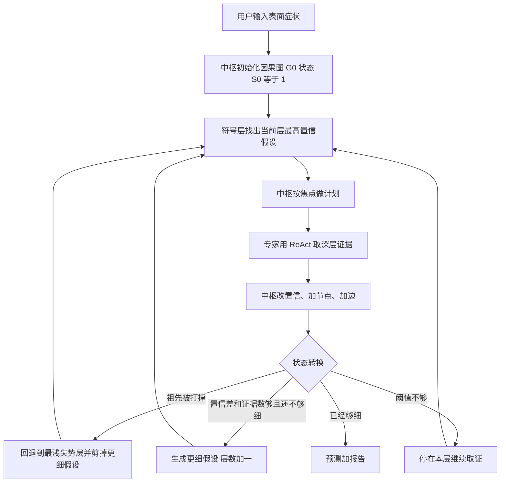

# Graph of States：溯因不是再多一棵思维树，而是给信念加状态机

<!-- release-date: 2026-03-22 -->

**本文依据**：`Graph of States: Solving Abductive Tasks with Large Language Models`，arXiv **2603.21250v2**（[cs.AI] 14 May 2026），21 页。封面印 **ICML 2026**（Proceedings of the 43rd International Conference on Machine Learning, Seoul, PMLR 306）。作者 Yu Luo、Rongchen Gao、Lu Teng、Xidao Wen、Jiamin Jiang、Qingliang Zhang、Yongqian Sun\*、Shenglin Zhang、Jiasong Feng、Tong Liu、Wenjie Zhang、Dan Pei；单位依次为南开大学、温州医科大学、阿里云、联想、清华大学。通讯 Yongqian Sun。代码与全部提示 https://github.com/gaorch85/Graph-of-States。原件首次公开日取 arXiv **v1** 提交日 **2026-03-22**；解读依据本地已核的 **v2**（封面日期 14 May 2026）。文中数字都标 PDF 页码；标「外部补充」的段落不来自本文。

## 一句话

演绎任务（24 点、数学）里，CoT / ToT 已经很强；溯因任务（看病、排障）要在信息不完整时边查证据、边改假设。把演绎框架直接搬过去，会同时撞上四件事：**证据捏造、上下文漂移、回不去、停得太早**。Graph of States（GoS）用因果图当信念记忆、用状态机管下钻与回退，把无约束探索收成有向搜索。两个真实世界数据集上它压过全部基线；它**不是**新的训练算法。

## 一、矛盾：演绎已经会了，溯因还在空转

逻辑推理被论文拆成三块：演绎从一般前提推出确定结论，归纳从观察概括规则，溯因从残缺观察推出最可能的原因（PDF p.1）。作者认为：归纳已是预训练里的能力；演绎任务被 CoT、ToT 大幅推高。文中给的对照数字是 GPT-5.1 配标准 CoT：MATH500 **99.1%**、AIME2025 **95.7%**、GPQA **87.3%**（PDF p.1）。溯因却几乎没被当成一类通用推理问题来做。

溯因的日常形态是：一开始只有表面症状，必须动态去查更深的证据，才能把假设空间收窄，再挑最说得通的根因。医学诊断、刑侦、分布式系统故障诊断都被点名为高风险场景（PDF p.1）。

作者把四套演绎框架（CoT、ToT、GoT、FoT）直接丢进溯因轨迹里看（附录 D），归纳出四种失败（PDF p.1–2，图 1）：

1. **证据捏造（Evidence Fabrication）**：为了让叙事自洽，模型编造不存在的证据去撑有偏见的假设，把事实本身弄脏。
2. **上下文漂移（Context Drift）**：长程任务里忘了已经查到哪，反复调同一工具，或把已被证据否掉的假设再捡回来。
3. **回退失败（Failed Backtracking）**：24 点里「7 和 9 用四则运算到不了 24」是硬剪枝；溯因的中间结果含糊，没有硬约束时模型就钉死在错路上。
4. **过早停止（Early Stopping）**：刚碰到表层症状就收工，钻不到能动手修的细粒度根因。图 1 的例子：`free -h` 看到内存快满就报 OOM，正确但不顶用；真正要查到 Java 进程、再查到 GlobalCache 泄漏（PDF p.2 图 1）。

论文把这四件事收成两条结构缺陷（PDF p.2）：

- 假设和事实都挤在**非结构化上下文历史**里，没有清晰的信念结构 → 捏造与漂移。
- **没有状态控制**，回退和下钻全靠模型自己决定 → 回不去、停得太早。

领域系统（看病、排障）已经在用 LLM，但作者认为它们主要是在 CoT / ToT 外包一层领域工程：外挂知识库挡捏造、规则挡早停。症状被抹平，演绎范式的结构病没治（PDF p.2）。

GoS 的自我定位：据作者所知，**第一个**面向溯因的通用多智能体推理框架；神经符号双层，用因果图加状态机构造显式信念；两个真实数据集上显著超过基线；代码与提示全部公开（PDF p.2）。

## 二、任务怎么形式化：表面症状便宜，深层证据要现查

第 3.1 节把溯因写成求后验最大的根因（PDF p.3 式 1）：

$$
H^{*}= \arg\max_{H\in\mathcal{H}} P(H \mid O_{\mathrm{surf}}, O_{\mathrm{deep}}, K)
$$

观察集 $O$ 拆成两类：容易拿到的表面症状 $O_{\mathrm{surf}}$（如胸痛），和昂贵的深层证据 $O_{\mathrm{deep}}$（如 CT、心电图）。$K$ 是领域知识（如诊疗指南）。和「一次性把材料塞满再推理」不同，$O_{\mathrm{deep}}$ **不是事先给齐的**，要用 ReAct 调工具现取（PDF p.4）。

这就是它和 24 点、MATH 的分界：演绎的输入是齐的，中间步对错有硬判据；溯因的输入会在过程中变，信念必须能改。

## 三、双层：认知层干活，符号层当锚

整体见图 2（PDF p.4）。左边是双层示意，右边是五步循环。

### 认知层：一个中枢，若干按真实岗位切的专家

认知层 $L_{\mathrm{cog}}$ 是领域适配的执行面。智能体集合 $A=\{A_{\mathrm{central}}\}\cup A_{\mathrm{experts}}$：中枢做全局规划与最终决策，专家做领域动作（PDF p.4）。作者刻意不把专家切成「CPU / 内存 / 磁盘」这种原子功能块，而映射成真实职业角色，理由是：复杂溯因需要中枢统筹；人类组织里活下来的分工更稳、对人也更透明（PDF p.4）。

### 符号层：信念状态 $B=(G,S)$

符号层 $L_{\mathrm{sym}}$ 把推理状态写成结构化信念 $B=(G,S)$，不再靠一段乱上下文（PDF p.4）。

**因果图 $G=(V,E)$**。节点三类：症状 $v_{\mathrm{sym}}$、证据 $v_{\mathrm{evi}}$、假设 $v_{\mathrm{hyp}}$。每个假设带置信 $P(v_{\mathrm{hyp}})$。边三类（PDF p.4）：

- **derive**：$v_{\mathrm{sym}}\to v_{\mathrm{hyp}}$，从症状长出初始假设；
- **refine**：粗假设 $\to$ 细假设，粒度变细；
- **support / refute**：$v_{\mathrm{evi}}\to v_{\mathrm{hyp}}$，证据撑或打。

**状态机 $S$**。每个假设有粒度层 $L(v_{\mathrm{hyp}})$。状态 $S_t\in\mathbb{N}^{+}$ 是第 $t$ 步正在查的那一层。它管整条轨迹：往下钻，或矛盾时往回退（PDF p.4，细节在 3.3）。

**推理焦点 $h^{*}$**。当前层里置信最高的那个假设（PDF p.4 式 2）：

$$
h^{*}_{t}=\arg\max_{h\in V_{\mathrm{hyp}},\,L(h)=S_t} P(h\mid G_t)
$$

这是深度优先：把调查资源压在最有希望的一条上，好尽快确认或尽早回退，省调查成本（PDF p.4）。

初始化：中枢从 $O_{\mathrm{surf}}$ 长出 $L(1)$ 假设，得到 $G_0$、$B_0$，状态机 $S_0=1$（PDF p.4）。

五步循环（PDF p.4 图 2）：用户输入并初始化 → 符号层点出焦点、指令认知层去查 → 认知层落地证据、回写图 → 调状态转换（下钻或回退）→ 细粒度假设够用就出预测和报告。伪代码是附录 A 的 Algorithm 1（PDF p.12）。

机制示意（根据 PDF p.4 图 2 重画，不是实测时间）：

## 四、双向交互：焦点指挥调查，证据改图

第 3.2 节强调两层不是各干各的，而是闭环（PDF p.5 图 3）。

**符号 → 认知。** 和 CoT / ToT / GoT / FoT 把状态写成一堆无序 thought 节点不同，这里先钉住 $h^{*}_{t}$，再把焦点和信念注入中枢：$\mathrm{Instructions}\leftarrow\mathrm{Plan}(A_{\mathrm{central}},h^{*}_{t},B_t)$，再连同全局上下文发给专家去调工具（PDF p.5）。焦点用来压住乱逛；$(h^{*}_{t},B_t)$ 共享用来避免专家各说各话。

**认知 → 符号。** 专家跑完 ReAct 后，中枢把观察和分析合成，把 $G_t$ 推到 $G_{t+1}$，三步拓扑操作（PDF p.5）：

1. **置信重标定**：新证据撑的加分、打的减分；
2. **节点实例化**：新证据、新假设进图；
3. **边形成**：把新东西接到全局结构上。

图因此是推理进度的实时镜像，而不是事后装饰。

## 五、状态转换：回退剪枝，下钻双阈值

因果图是静态拓扑，推不动「该更深还是该回头」。状态机才是执行控制器。作者说灵感来自人类溯因的认知模型：分层细化、非单调改信念（PDF p.5）。两种动作见 Algorithm 2（PDF p.12）和图 4（PDF p.5）。

### 回退

细假设的合法性绑在祖先上。置信重标定时，若某个 $l<S_t$ 的祖先在兄弟里不再是最高置信，就触发回退：找到含这个失势祖先的**最浅层** $l^{*}$，删掉所有 $L(v_{\mathrm{hyp}})>l^{*}$ 的假设，状态机重置到 $l^{*}$，认知层转到原先休眠的分支（PDF p.5–6）。原则：建在坏前提上的推论一律作废。这是在对抗「信息少时过早锁死」。

### 下钻

更新图之后，用双阈值决定要不要加深：置信差 $\delta$、最少支撑证据数 $\eta$（PDF p.6）。当前层最高置信假设必须同时满足：

$$
P(v^{(1)}_{\mathrm{hyp}})-P(v^{(2)}_{\mathrm{hyp}})>\delta,\qquad |E_{\mathrm{sup}}(v^{(1)}_{\mathrm{hyp}})|\ge\eta
$$

第一条要求领先幅度够大，第二条要求高风险场景不能只靠先验概率收窄搜索。过了阈值后，中枢再看粒度：已经够具体就停、出预测和报告；否则生成下一层子假设，$S_{t+1}\leftarrow S_t+1$。阈值没过则 $S_{t+1}\leftarrow S_t$，下一轮继续取证（PDF p.6）。

## 六、实验怎么摆：两个真实世界任务，同一套骨干

任务两类：医学诊断、分布式系统故障诊断（PDF p.6）。

**数据。** 医学用 DiagnosisArena（Zhu et al., 2025），病例来自 Lancet、NEJM、JAMA 等。正文写利用 150 例，并剔除 12 例「事实错误或逻辑漏洞导致标注根因从给定证据推不出」（PDF p.6，细节附录 C.1）。故障诊断是作者自建的 **150** 起事件，来自联想大规模生产微服务（PDF p.6）。两套数据的构造理由在附录 C。

**基线。** 没有现成的通用溯因框架，于是按「单智能体 vs 多智能体」×「CoT / ToT / GoT / FoT」合成八条。所有节点统一成 ReAct 的 thought–action–observation 三元组。骨干一律 **GPT-5.1-2025-11-13**（PDF p.6）。

**评分。** 主评是 LLM-as-a-Judge，三分：2 精确匹配、1 相关、0 其他。指标两个：**Match**（得 2）和 **Relevant**（得 1 或 2）。医学用官方基准提示，排障另写平行提示。医学另加 Human-as-a-Judge：一位有临床与学术经验的研究者（PDF p.6）。附录写这位研究者做了 **110+** 小时人工评，并展示 10 个病例、5 次 LLM 评分不完全一致（PDF p.14 图 8）。

**预算。** 各场景超参相同。GoS 与多智能体基线：每位专家最多 **3** 次检索；单智能体基线上限 **5**。GoS 神经–符号交互轮数最多 **3**（PDF p.6）。

### 医学：只给主诉和体检，检查要自己开

任务被改成动态调查：一开始只有主诉和体格检查，必须显式开辅助检查，才能从外部库取回记录（PDF p.6–7）。原 DiagnosisArena 把化验和影像一次性摊开，作者认为这把「该开哪项检查」这个核心难度抹掉了（PDF p.13 图 7）。

认知层角色：中枢是主诊医师；专家是检验科医师、病理医师、放射科医师。多智能体基线用与 MDAgents 相同的角色切分（PDF p.7）。

表 1（PDF p.7），单位 %，另给美元/例：

| 方法 | LLM Match | LLM Relevant | Human Match | Human Relevant | $/case |
|---|---:|---:|---:|---:|---:|
| GoS | 31.88 | 74.64 | 39.86 | 78.99 | 0.12 |
| Single/CoT | 21.01 | 47.83 | 24.64 | 48.55 | 0.03 |
| Single/ToT | 18.84 | 47.10 | 19.57 | 45.65 | 0.08 |
| Single/GoT | 21.01 | 50.00 | 22.46 | 52.90 | 0.07 |
| Single/FoT | 21.74 | 58.70 | 21.01 | 61.59 | 0.32 |
| Multi/CoT | 21.01 | 49.28 | 23.19 | 50.72 | 0.07 |
| Multi/ToT | 20.29 | 50.72 | 23.91 | 53.62 | 0.17 |
| Multi/GoT | 21.74 | 52.17 | 23.91 | 55.07 | 0.15 |
| Multi/FoT | 23.19 | 63.04 | 26.09 | 65.94 | 0.73 |

Human-as-a-Judge 下 GoS 的 Match **39.86%**、Relevant **78.99%**。最强基线是 Multi/FoT，但要 **$0.73/case**，GoS 是 **$0.12**（PDF p.7）。作者观察：CoT 的 Match 常高于 ToT（ToT 的节点评估容易跑偏）；拓扑从树扩到图、再扩到森林，Relevant 会涨，代价也涨。多智能体整体好于单智能体。Human 分系统高于 LLM 分：LLM 评委偏字面像不像，临床研究者能认同一诊断的不同说法（PDF p.7）。

消融表 2（PDF p.7），LLM-as-a-Judge：

| 方法 | Match | Relevant | $/case |
|---|---:|---:|---:|
| GoS | 31.88 | 74.64 | 0.12 |
| 去掉推理焦点 | 19.57 | 67.39 | 0.14 |
| 结构化文本管状态（无显式因果图） | 18.12 | 59.42 | 0.15 |
| 去掉因果图 | 12.32 | 48.55 | 0.12 |
| 去掉状态机 | 12.32 | 50.00 | 0.17 |

去掉焦点：Match 31.88% → 19.57%。用结构化文本记假设/证据/撑打，好过「完全无图」（18.12% vs 12.32%），仍远低于完整 GoS。去掉图或状态机，Match 掉到 **12.32%**。去掉状态机成本升到 **$0.17/case**：没有生命周期和终止协议，系统会把预算用尽再硬出结论（PDF p.7）。

图 5 是灵敏度（PDF p.8）：交互轮数、专家检索次数、$\eta$、$\delta$。预算加大一般更好；虚线是最强基线 Multi/FoT，GoS 在更紧预算下就能超过其峰值。$\eta$、$\delta$ 抬高会更保守：Relevant 可能涨（停在表层诊断），Match 可能掉（不敢给细根因）。论文把它们写成可调的风险旋钮（PDF p.7–8）。图中坐标是 1 / 3 / 5 / 7 轮或检索次数，$\eta$ 同样 1–7，$\delta$ 为 0.1 / 0.3 / 0.5 / 0.7；正文没有再给每个点的精确读数。

### 排障：告警好认领域，Match 才认根因

每例只给初始告警：类型、受影响组件、时间戳、失败描述。细节藏在海量可观测数据里，要主动查。GoS：中枢 ApplicationOperator；专家 LinuxOperator、NetworkOperator、DatabaseOperator，能查历史日志、指标、受限 shell。多智能体基线跟 D-Bot：按 CPU / Memory / Disk 切，各自只能看本域数据（PDF p.8）。

表 3（PDF p.8）：

| 方法 | Match | Relevant | $/case |
|---|---:|---:|---:|
| GoS | 70.67 | 88.00 | 0.10 |
| Single/CoT | 26.67 | 81.33 | 0.03 |
| Single/ToT | 25.33 | 78.00 | 0.14 |
| Single/GoT | 27.33 | 80.00 | 0.11 |
| Single/FoT | 28.67 | 84.00 | 0.45 |
| Multi/CoT | 34.00 | 82.67 | 0.05 |
| Multi/ToT | 25.33 | 81.33 | 0.13 |
| Multi/GoT | 28.00 | 80.67 | 0.18 |
| Multi/FoT | 28.00 | 86.67 | 0.94 |

GoS：Match **70.67%**、Relevant **88.00%**，相对各自最强基线高出 **36.67** 和 **1.33** 个百分点（PDF p.8）。基线 Relevant 都不差（告警元数据容易指到正确故障域），Match 差一截：停在表层。成本上 GoS **$0.10** vs Multi/FoT **$0.94**，文中写约 **8 倍** 降本（PDF p.8）。

图 6 是一例生产主机多告警（PDF p.9）：文件系统只读、内存 >90%、健康分过低。焦点先落在 Filesystem Read-Only（置信 0.75 vs 高压内存 0.60）；LinuxOperator 用 `mount` 和 `dmesg` 看到根分区 XFS（dm-0）只读且元数据损坏；图上该假设置信 0.75→0.95，竞争假设 0.60→0.40；不下退、下钻到「XFS 元数据损坏」，出报告。

附录 C.2 补充规模：约 **$2.5\times 10^{4}$** 台基础设施实例；网络日志约 **$10^{10}$** 条/天（举例约 12B/天），历史可观测数据 PB 级（PDF p.16）。**原始事件与交互轨迹因保密不能公开**，文中例子已脱敏（PDF p.16）。

## 七、附录 D：结构病被压住之后，剩下的是领域知识

附录 D 人工检查 GoS 与全部基线里得分小于 2 的失败例，五类错误不互斥、也不穷尽，百分比相对失败例，加总不必为 100（PDF p.17–18）。

表 4 方法对比（PDF p.18），基线是两场景全部基线失败例汇总：

| | 选错动作 | 证据捏造 | 上下文漂移 | 回退失败 | 过早停止 |
|---|---:|---:|---:|---:|---:|
| 基线（汇总） | 47.22 | 22.22 | 41.32 | 52.78 | 63.89 |
| GoS | 55.90 | 0 | 9.70 | 30.90 | 18.75 |

作者强调：GoS 把捏造打到 **0%**（节点边必须来自真实工具返回）；漂移 41.32%→**9.70%**；早停 63.89%→**18.75%**。选错动作占比升到 55.90%，他们写成统计假象：结构失败变少后，剩下的错误在更小失败集里显得更大。回退失败仍有 **30.90%**：证据取到了，预训练模型认不出它已经打掉当前假设（医学贡献了最多失败）（PDF p.18）。

表 5 只看 GoS、按域拆（PDF p.18）：

| | 选错动作 | 证据捏造 | 上下文漂移 | 回退失败 | 过早停止 |
|---|---:|---:|---:|---:|---:|
| 医学 | 35.76 | 0 | 7.29 | 23.26 | 5.90 |
| 分布式系统 | 20.14 | 0 | 2.41 | 7.64 | 12.85 |

医学卡在知识：不会开对检查、不会换假设。排障卡在预算：高维遥测上浪费查询，预算耗尽被迫早停（PDF p.18–19）。作者结论：GoS 是通用溯因骨架，RAG、SOP、遥测预处理应作为增强件接进去，而不是替代品（PDF p.19，Impact Statement 同调，PDF p.9）。

图 10 个案（PDF p.20）：53 岁男性高热、腰部压痛，假设脊柱感染，MRI 回报正常。Single/CoT 在思维里捏造骨髓信号异常，跳过鉴别诊断，给出错误的椎骨骨髓炎。GoS 把感染节点置信压到 0.15，焦点转到系统性自身免疫性血管炎，但后续开错化验（ANA 而不是更贴题的标志物），预算用尽，只能给出粗分类。

## 八、限制：论文自己划的边界

附录 B（PDF p.12–13）：实验只覆盖医学诊断和分布式排障。刑侦等同样需要溯因，但隐私与数据保护让高质量基准很难拿。作者仍认为所用数据质量高：顶级医学期刊病例 + 一线生产环境。

此外正文写清、但容易被读者补全的缺口：

- 没有新的预训练或强化学习目标，骨干固定为 GPT-5.1-2025-11-13，**没有**换模型消融。
- $\delta$、$\eta$ 的默认数值正文没写死，只在图 5 扫了一组。
- 联想 150 例原始轨迹不公开，无法复现那一栏数字。
- DiagnosisArena 剔除 12 例的完整名单只给了三类代表，不是 12 条清单。
- 置信 $P(v_{\mathrm{hyp}})$ 如何由 LLM 打出、是否校准，正文没有公式。

## 九、可迁移的几条，以及不该迁移的

可直接拿走的是设计原则，不是这套角色名：

1. **溯因不要复用演绎的搜索拓扑。** 树/图/森林扩大搜索，会抬 Relevant、抬成本，不一定抬 Match。缺的是信念结构和状态协议。
2. **把「假设–证据–撑/打/细化」从对话历史里抠出来。** 消融表明：光有结构化文本不够，显式因果边才撑得住回退与下钻。
3. **终止条件写成可检查的规则。** 双阈值比「模型觉得差不多了」更可调；拿掉状态机会烧预算。
4. **结构对了之后，失败会改种。** 捏造和漂移下降，选错工具和认不出矛盾会露出来——那是知识与检索问题，该接 RAG / SOP，而不是再加深思维树。

不该直接搬的：医学三角色、排障四角色、3 轮交互、每专家 3 次检索，都是这篇实验的预算，不是普遍最优。刑侦没有数据。生产排障数据出不了门。

## 关键词回看

- **溯因（abduction）**：从不完整观察推出最可能原因，证据要边查边改信念。
- **演绎框架（CoT / ToT / GoT / FoT）**：为静态、可硬判的任务设计；直接搬到溯因会四连失败。
- **证据捏造 / 上下文漂移 / 回退失败 / 过早停止**：这篇的四类轨迹病。
- **因果图 $G$**：症状、证据、假设节点，derive / refine / support / refute 边。
- **状态机 $S_t$**：当前调查粒度；回退剪枝，下钻看 $\delta$ 与 $\eta$。
- **推理焦点 $h^{*}$**：当前层最高置信假设，用来做深度优先。
- **Match vs Relevant**：精确根因 vs 方向对但可能停在表层。

## 参考资料

- 论文 PDF（本地）：`readings/_src/训练方法与强化学习/Graph-of-States.pdf`
- 代码与提示：https://github.com/gaorch85/Graph-of-States
- arXiv：https://arxiv.org/abs/2603.21250
