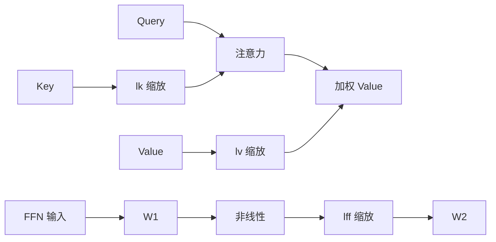

# （IA）³：少样本与其塞进上下文，不如只学三组缩放向量

<!-- release-date: 2022-05-11 -->

**本文依据**：`Few-Shot Parameter-Efficient Fine-Tuning is Better and Cheaper than In-Context Learning`，arXiv 2205.05638**v2**（[cs.LG] 26 Aug 2022），23 页。作者 Haokun Liu*、Derek Tam*、Mohammed Muqeeth*、Jay Mohta、Tenghao Huang、Mohit Bansal、Colin Raffel，University of North Carolina at Chapel Hill。方法名 $(IA)^3$（Infused Adapter by Inhibiting and Amplifying Inner Activations）；配方名 T-Few；代码 https://github.com/r-three/t-few。原件首次公开日取 arXiv **v1** 提交日 **2022-05-11**；解读依据本地已核的 v2（23 页）。文中数字都标 PDF 页码；标「外部补充」的段落不来自本文。LoRA 与 Prompt-Tuning 只作必要前提，专篇见同目录与注意力方向已发布文。

## 一句话

少样本 **in-context learning（ICL，上下文学习）** 每次预测都要把那几条示范再跑一遍，算力、显存和磁盘都贵，准确率还往往不如微调。作者的对照结论是：在少样本设定里，**parameter-efficient fine-tuning（PEFT，参数高效微调）** 更准、也更便宜（PDF p.1）。他们为此提出 $(IA)^3$：用三组可学向量去缩放注意力里的 Key / Value 以及前馈层中间激活，初值全 1；再配上 T0 骨干、两种额外损失和一次 $(IA)^3$ 预热，合成固定配方 **T-Few**。T-Few 在 T0 留出任务上超过 GPT-3 175B 的 few-shot ICL 约 6 个百分点，推理 FLOPs 低三个数量级；在 RAFT 上首次超过人类基线，并比当时第二名高出 6 个百分点绝对值（PDF p.1、p.8–9）。

## 一、矛盾：少样本适配被 ICL 绑在「每次都重读示范」上

预训练之后，下游适配长期有两条路（PDF p.1–2）。

一条是梯度微调：每个任务一份完整新权重。任务一多，存不下、切不过去。

另一条是 ICL：把少量带标签例子写成人类能读的指令和示范，再拼上待预测样本，一次性喂进模型，**不做梯度更新**。同一套权重立刻干很多任务，也能在一个 batch 里混任务（不同样本用不同上下文）（PDF p.2–3）。

ICL 的代价写得很硬（PDF p.2–3）：

1. **每次预测都要处理全部示范。** 忽略注意力二次项（相对其余层通常不大），$k$-shot 大约把计算放大到 $k+1$ 倍。
2. **准确率通常不如微调**，引用 GPT-3 原文的观察。
3. **提示格式极度敏感**：措辞和例子顺序都能把分数打乱，远超微调的 run 间波动。
4. 换错标签 ICL 有时仍能干活，让人怀疑它到底在「学」示范，还是在吃格式（PDF p.2，引 Min 等）。

作者把「一次训练、多任务推理、少样本」当成必须同时满足的产品约束，而不是论文里的消融开关（PDF p.5）：配方要对**任何新任务**用同一套超参，因为真实少样本里验证集本身就很小。

## 二、ICL 的账怎么算：计算、缓存、磁盘

第二节用 FLOPs 和字节说话，不绑具体硬件（PDF p.2–3）。

以 Brown 等的字母重排任务为例，4-shot 上下文是一串「打乱字母 = 词」示范，再留一个待解空（PDF p.3）。分类则给每个标签一个字符串，取模型赋概率最高的那串；多选同理。

粗账：

- 计算：约线性于 $k$。
- 推理显存：往往被**模型参数**主导，示范带来的激活涨幅是次要项。
- 磁盘：32 条、每条 512 token、token 按 32-bit 计，大约 **66 KB**（PDF p.3）。

两条补丁也写清了边界：

- **缓存 Key / Value**：解码器因果掩码下，示范激活不依赖查询。极端情形：32-shot、每条 512 token，GPT-3 的 KV 缓存可超过 **144 GB**（32 × 512 × 96 层 × 12288 × 32-bit × K 和 V）（PDF p.3）。省计算，换巨量存储。
- **ensemble ICL**（Min 等）：不把 $k$ 条拼成一条，而对每条做 1-shot，再把输出概率相乘。非参数显存大约除以 $k/2$，计算大约乘 2；作者引用其准确率更好（PDF p.3）。

结论不是「ICL 不能用」，而是：**少样本服务一旦要反复打预测，把示范留在输入里是在用推理预算交学费。**

## 三、PEFT 为什么能对上 ICL 的产品形态

全量微调改所有参数。PEFT 只更新或插入一小撮。论文点到当时已有的几类，只当地图，不展开专篇（PDF p.3–4）：

- Adapter：在冻住的层之间插小前馈。
- 稀疏子集、低秩更新（LoRA）、低维子空间优化、超复数低秩 adapter。
- Prompt-Tuning / Prefix-Tuning：在输入或激活上拼接可学连续向量，也可看成 PEFT。

当时 SOTA 能在只动约 **0.01%** 参数时追上全量微调（PDF p.3）。

对 ICL 有用的性质有三条（PDF p.4）：

- 存一份小适配器，而不是整模。
- 某些方法天然支持 **mixed-task batch**（混合任务批次）：Prompt-Tuning 给不同样本拼不同 prompt 即可。
- 改参数化本身的方法（低秩合并进权重一类）做混任务 batch 会很贵或很烦。

Adapter 会加深网络，推理多一点点计算和显存。PEFT 还有一笔**一次性微调成本**，摊到之后所有推理上。全文主线就是：把微调和推理加在一起算，PEFT 仍可比 ICL 更省，而且更准（PDF p.4）。

LoRA 在后文 T0-3B 对照里作为基线出现：rank 4、改注意力和前馈、约 **9.1M** 可训练参数（PDF p.16、p.18）。本文不重写 LoRA 的低秩假设与合并推理；这里只需记住：$(IA)^3$ 要的是**更少参数、改激活而不是改权重分解、混 batch 时按样本乘不同向量**。

## 四、配方目标：一个模型、一套超参、新任务不用手调

「recipe」在文中不是口号，是约束（PDF p.5）：指定骨干、PEFT、超参，使得新任务**不必**按任务改架构或网格搜索。

骨干选 **T0**（Sanh 等）：T5 编码器–解码器，先做掩码语言建模，再在多任务、经 P3 模板转成 text-to-text 的数据上微调，为的是零样本泛化（PDF p.5）。发布了 30 亿（T0-3B）和 110 亿（文中径称 T0）两档。设计阶段为省算力用 T0-3B；第四节起配方冻结后上到 110 亿（PDF p.5、p.7）。

留出任务沿用 T0 原文（PDF p.5）：句子补全（COPA、H-SWAG、Story Cloze）、自然语言推理（ANLI、CB、RTE）、共指（WSC、Winogrande）、词义（WiC）。后文再上 RAFT。

少样本条数与 Brown 等对齐，约 **20–70** 条；因 GPT-3 子集未公开，作者用不同种子抽 **5** 份，报中位数和四分位距。训练默认 **1K step、batch 8**，结束时评估。评估用 **rank classification（排序分类）**：对所有候选标签串打对数概率，最高分对了才算对。主文报九个数据集中位数准确率（PDF p.5）。

## 五、两种损失：排序评估训练时要对齐

标准语言建模损失是（PDF p.6）：

$$
L_{\mathrm{LM}}=-\frac{1}{T}\sum_{t}\log p(y_t\mid x,y_{<t})
$$

排序评估既看正确答案的概率，也看错误选项的概率。于是加 **unlikelihood（似然抑制）**（PDF p.6 式 1）：对 $N$ 条错误目标串，压低其 token 概率。作者假设这样能提高正确答案排第一的机会。

多选里选项长度差很大，按序列概率排序会偏袒短答案（每步概率 $\le 1$）。评估侧采用 GPT-3 用过的 **length normalization（长度归一化）**：分数除以 token 数。训练侧加 $L_{\mathrm{LN}}$：先算长度归一对数概率 $\beta(x,y)$，再对正确项做 softmax 交叉熵（PDF p.6 式 2）。

三项直接相加，**不引入新超参**——少样本验证集不允许再调权重（PDF p.6）。

T0-3B 全量微调：加 $L_{\mathrm{LN}}$ 把准确率从 **60.7%** 提到 **62.71%**；再加 $L_{\mathrm{UL}}$ 到 **63.3%**（PDF p.6；附录表 3 为逐数据集）。后续实验默认带这两项。

## 六、$(IA)^3$：用向量抑制或放大内部激活

### 要对上的三条

相对 ICL，PEFT 必须（PDF p.6）：

1. 新增或更新的参数尽量少。
2. 少样本后准确率要高。
3. 支持混任务 batch。

第三条几乎排除「每个样本换一张计算图」的改权重方案。更顺手的是 **改激活**：同一前向里，按样本乘上该任务的向量。Prompt / Prefix 属于这一类，但作者在这个设定里 **prompt tuning 达不到可接受准确率**，而更强的若干 PEFT 又不方便混 batch，于是另做方法（PDF p.6–7）。

### 改哪三处

对激活序列 $x\in\mathbb{R}^{T\times d}$ 和任务向量 $l\in\mathbb{R}^{d}$，做逐元素相乘 $l\odot x$（广播后第 $(i,j)$ 项是 $l_j x_{i,j}$）（PDF p.6）。

不必给 Transformer 里每一组激活都配向量。够用的三组是（PDF p.6–7，图 1）：

- 自注意力与编码器–解码器注意力里的 **Key**、**Value**：$\mathrm{softmax}\big(Q(l_k K^\top)/\sqrt{d_k}\big)\,(l_v V)$
- 位置前馈的中间激活：$(l_{\mathrm{ff}}\gamma(W_1 x))W_2$，$\gamma$ 是非线性

每层一组 $l_k\in\mathbb{R}^{d_k}$、$l_v\in\mathbb{R}^{d_v}$、$l_{\mathrm{ff}}\in\mathbb{R}^{d_{\mathrm{ff}}}$。编码器 $L$ 层共 $L(d_k+d_v+d_{\mathrm{ff}})$；解码器因同时有自注意力和交叉注意力，是 $L(2d_k+2d_v+d_{\mathrm{ff}})$（PDF p.7）。

**初值全 1**：刚插入时模型函数不变（PDF p.7）。名字 $(IA)^3$ = Infused Adapter by Inhibiting and Amplifying Inner Activations：向量小于 1 相当于抑制通道，大于 1 相当于放大。

混任务：batch 里每条序列乘自己的任务向量，便宜且可并行（PDF p.7）。若模型终身只服务一个任务，因这些逐元素乘总与矩阵乘相邻，$l\odot Wx=(l\odot W)x$，可以把缩放 **永久吸进权重**，架构与原模型相同，推理 **零额外计算**（PDF p.7）。

上图按 PDF p.2 图 1 左侧机制重画，是示意不是实测曲线。

### 和当时 PEFT 比：唯一超过全量微调的点

对照 9 种方法加两个基线（全量微调、只训 LayerNorm），预算可变的方法画了大小标记（PDF p.7 图 2，附录表 4）：BitFit、Adapter、Compacter / Compacter++、prompt 10 / 100 向量、FISH Mask 0.2% / 0.02%、Intrinsic SAID 2 万 / 50 万维、prefix-tuning、LoRA。

主文结论（PDF p.7）：**只有 $(IA)^3$ 准确率高于全量微调基线。** Intrinsic SAID 和 prompt 参数可以更少，但分数差一截。Prompt 验证集在训练中剧烈抖动，作者怀疑优化问题。这与 Compacter、prompt tuning 在别的模型/数据上「能打平或超过全量微调」的报告不一致；作者试过若干超参，把分歧归到模型与数据集不同（PDF p.7）。

T0-3B、带 $L_{\mathrm{UL}}$+$L_{\mathrm{LN}}$ 时，附录表 4 给出参数量锚点（PDF p.18）：全量 3B；LoRA **9.1M**；$(IA)^3$ **540K**（与 Compacter++ 同量级）。相对 LoRA，可训练参数大约小一个数量级；相对全量，引言口径是最多约 **10,000×** 更少（PDF p.2）。

## 七、先在 T0 的多任务混合物上预热向量

Prompt 向量可以先预训练再少样本（Gu 等、Vu 等）。作者跟 Vu 等：把 $(IA)^3$ 新参数在 **训练 T0 的同一多任务混合物** 上预训 **100,000 step、batch 16**，再拿到各下游集微调（PDF p.7–8）。附录表 8：平均准确率 **64.6 → 65.8**（PDF p.8、p.22）。纳入配方。

## 八、T-Few 清单（此后不再按任务改）

合成如下（PDF p.8）：

- 骨干：T0（正式对照用 110 亿）
- 适配：$(IA)^3$，初始来自上述预热
- 目标：$L_{\mathrm{LM}}+L_{\mathrm{UL}}+L_{\mathrm{LN}}$
- 优化：Adafactor，学习率 $3\times 10^{-3}$，1,000 step，batch 8，线性衰减，60 step warmup
- 数据：P3 模板，训练逐步随机抽模板，推理同样转成指令式 text-to-text

**每个下游数据集用完全相同的配方**（PDF p.8）。

## 九、和 ICL 对打：更准，推理便宜三个数量级

### 留出任务准确率

对照（PDF p.8 表 1、图 3）：T0 零样本（作者发现 T0 上 few-shot ICL **不如** 零样本，附录 F，可能因为多任务微调就是零样本格式）；T5+LM 的 few-shot ICL（T0 所基于的语言模型，因显存用 ensemble ICL）；GPT-3 6.7B / 13B / 175B 的 few-shot ICL（数字直接引自 Brown 等，未公开权重）。

中位准确率（PDF p.8 表 1）：

| 方法 | 推理 FLOPs | 训练 FLOPs | 磁盘 | Acc. |
|---|---:|---:|---:|---:|
| T-Few | $1.1\times 10^{12}$ | $2.7\times 10^{16}$ | 4.2 MB | 72.4% |
| T0 零样本 | $1.1\times 10^{12}$ | 0 | 0 | 66.9% |
| T5+LM ICL | $4.5\times 10^{13}$ | 0 | 16 kB | 49.6% |
| GPT-3 6.7B | $5.4\times 10^{13}$ | 0 | 16 kB | 57.2% |
| GPT-3 13B | $1.0\times 10^{14}$ | 0 | 16 kB | 60.3% |
| GPT-3 175B | $1.4\times 10^{15}$ | 0 | 16 kB | 66.6% |

T-Few 比 GPT-3 175B few-shot ICL 高约 **6** 个百分点，模型大约小 **16×**（PDF p.8）。逐数据集见表 9（PDF p.22）：例如 COPA 上 T-Few 93.0（IQR 2.0）对 GPT-3 175B 的 92.0；H-SWAG 则是 67.1 对 79.3，并非项项都赢。主文强调的是跨任务中位。

### FLOPs 怎么估

用 Kaplan 等的每 token FLOPs：解码器约 $2N$ 推理 / $6N$ 训练；T0/T5 这类对称编码器–解码器对每个 token 只走一半参数，估成 $N$ / $3N$（PDF p.8）。作者声明：FLOPs 不是延迟或功耗；硬件会随方法变，所以用硬件无关量（PDF p.8）。

中位 shot 数 **41**；rank 评估和 unlikelihood 都要跑遍选项。输入加全部目标的中位长度 **103**；ICL 示范只含正确目标，中位 **98**。缓存 KV 时，一条 ICL 查询约处理 $41\times 98+103$ 个 token（PDF p.8）。

于是：T-Few 一条 $11\times 10^9\times 103=1.1\times 10^{12}$；GPT-3 175B 为 $2\times 175\times 10^9\times(41\times 98+103)=1.4\times 10^{15}$，差三个数量级以上。就算缓存把 ICL 计算大约除以 41，仍远高过 T-Few（PDF p.8–9）。

训练：110 亿编码器–解码器、1,000 step、batch 8、长 103，约 $3\times 11\times 10^9\times 1000\times 8\times 103=2.7\times 10^{16}$。大约等于 GPT-3 175B 对 **20** 条样本做 few-shot ICL 的推理量。单数据集微调约半小时、单张 A100；文中按当时 Azure 估约 **2 美元**（PDF p.9）。

磁盘：$(IA)^3$ 单精度约 **4.2 MB**，ICL 示范约 **16 kB**。但 4.2 MB 相对 T0  checkpoint **41.5 GB** 很小：一万个任务的向量大约才抵一份 T0（PDF p.9）。

推理显存：比 T0 更小的对照模型只有 GPT-3 6.7B；其余 ICL 更大。训练还要激活和 Adafactor 累加器；配方仍能在单张 80GB A100 上跑（PDF p.9）。

## 十、RAFT：没有验证集的「真少样本」

RAFT：11 个「有经济价值」、模仿真实应用的任务；每任务 **50** 条训练、无验证集、测试标签不公开（PDF p.9）。用数据集自带标准 prompt。表 2 当时 top-5（PDF p.8–9）：

| 方法 | Acc. |
|---|---:|
| T-Few | 75.8% |
| 人类基线 | 73.5% |
| PET | 69.6% |
| SetFit | 66.9% |
| GPT-3 | 62.7% |

**首次超过人类**；比下一方法高 **6** 个百分点绝对值（PDF p.1、p.9）。附录 H：除 Banking 77 外不把标签列表塞进输入；Banking 77 有 77 类，unlikelihood 会爆显存，关掉该项，并把全部标签放进输入、把标签里的 `.` 换成 `,`（PDF p.17）。逐任务见表 11（PDF p.23），例如 Tweet Eval Hate 上 T-Few 58.6、人类 72.2，同样不是项项超人。

## 十一、110 亿上的消融

设计在 T0-3B 上做完后，在 T0 110 亿上拆件（PDF p.9，表 10）：单项不一定每个数据集都显著，但跨数据集平均：去掉预热 **−1.6%**（72.4 → 70.8）；去掉两种额外损失 **−4.1%**（→ 68.3）；两项都去 **−2.5%**（→ 69.7）。后一个比「只去损失」略高，作者只报数字，不解释交互。

## 十二、限制：论文自己划的边界

1. **实验全是分类 / 多选 + rank classification。** 结论写明下一步才想做摘要、问答等生成（PDF p.9）。不要把 T-Few 说成已验证的生成配方。
2. **T0 几乎做不了 ICL**，few-shot 反而掉点（PDF p.16）。ICL 对照主要靠 GPT-3 与 T5+LM，不是「同一骨干上 ICL vs PEFT」。
3. **GPT-3 数字引自原论文**，子集和提示与本文 5 个随机子集不是同一抽法（PDF p.5、p.16）。
4. **FLOPs 不是墙钟。** 作者引用「efficiency misnomer」一文提醒换算会偏（PDF p.8）。
5. **Prompt-Tuning / Compacter 在本文设定落后**，与前作不完全同向；归因模型与数据，不是给那些方法盖棺（PDF p.7）。
6. RAFT 上 Banking 77 改了损失和输入，是配方里**唯一写明的任务特例**（PDF p.17）。
7. 2022 年之后 Hugging Face PEFT 等库把 $(IA)^3$ 收成现成层，**不是本篇内容**；实现细节以当时仓库 https://github.com/r-three/t-few 为准。

## 十三、可迁移的几条

- **少样本服务先问推理是否反复跑。** 示范留在上下文里，等于每条查询都付 $k$ 倍前向。适配器训练可以摊销。
- **要混任务 batch，优先改激活而不是换权重。** 按样本乘向量比换计算图便宜。单任务再把缩放吸进 $W$。
- **评估协议要写进损失。** 排序评估就压错误项、做长度归一；少样本不要再为损失权重加超参。
- **PEFT 向量可以在多任务混合物上预热**，再少样本，这里值 1.2 个百分点（3B）到 1.6 个百分点（11B）。
- **「参数更少」不等于「分数更高」。** 图 2 里更省参数的 prompt / SAID 明显更弱；作者选的是超过全量微调的那个点。
- **真少样本意味着超参冻结。** T-Few 的产品意义是同一套 1,000 step / $3\times 10^{-3}$，而不是再搜一遍。

## 关键词怎么串

**ICL** 把示范放进输入、不更新权重；**PEFT** 只动很小参数集合。$(IA)^3$ 是 PEFT：三组向量缩放 K、V 和 FFN 中间激活。**T-Few** 是 T0 + 预热过的 $(IA)^3$ + $L_{\mathrm{LM}}+L_{\mathrm{UL}}+L_{\mathrm{LN}}$ + 固定超参。**T0** 是 T5 的多任务提示微调版。**RAFT** 用来证明这套东西在无验证集的真实任务上也能提交。和 LoRA 的差别：LoRA 学低秩 $\Delta W$；这里学的是激活缩放，参数更少，混 batch 更直接。

## 参考资料

- 原论文：arXiv 2205.05638v2，https://arxiv.org/abs/2205.05638
- 代码：https://github.com/r-three/t-few
- T0：Sanh 等，arXiv 2110.08207（PDF 参考文献 [1]）
- RAFT：Alex 等，arXiv 2109.14076（[2]）
- GPT-3：Brown 等，arXiv 2005.14165（[4]）
- LoRA：Hu 等，arXiv 2106.09685（[13]）；本库专篇 `readings/训练方法与强化学习/LoRA.md`
- Prompt-Tuning：Lester 等，arXiv 2104.08691（[14]）
