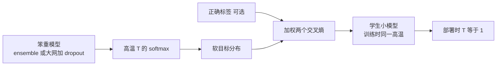

# 知识蒸馏：ensemble 很强，部署却要把知识压进一个更小的模型

<!-- release-date: 2015-03-09 -->

**本文依据**：`Distilling the Knowledge in a Neural Network`，arXiv **1503.02531v1**（[stat.ML] 9 Mar 2015），9 页。作者 Geoffrey Hinton、Oriol Vinyals、Jeff Dean；Google Inc., Mountain View。Hinton 另署 University of Toronto 与 Canadian Institute for Advanced Research；Hinton 与 Vinyals 贡献相等（PDF p.1）。原件首次公开日取 arXiv v1 提交日 **2015-03-09**；本地 PDF 封面印 v1，解读依据 v1。文中数字都标 PDF 页码。本文只讲这份 2015 年 9 页笔记当年写了什么；后续知识蒸馏生态不写进正文。

## 一句话

训练阶段可以养一只笨重的模型：很多网的 ensemble，或一只用 dropout 强正则的大网。部署阶段却要低延迟、便宜。知识蒸馏做的事是：把笨重模型在高温 softmax 下给出的**软标签**当成学生的目标，再把温度降回 1 去上线。MNIST 上，软标签能把「平移增强里学到的泛化」传给学生，即使迁移集里没有平移；语音声学模型上，10 个模型 ensemble 的帧准确率与词错误率，几乎都能压进一只同样大小的单模型（PDF p.1，p.4–5）。

## 一、矛盾：训练要榨结构，部署要便宜

昆虫有幼虫形态和成虫形态：一个负责吃，一个负责走和繁殖。大规模机器学习通常用**同一类模型**同时做这两件事。语音、物体识别这类任务，训练要从高度冗余的大数据里抽结构，不必实时，算力可以堆；部署给大量用户时，延迟和算力都更紧（PDF p.1）。

作者因此主张：训练阶段应允许很笨重的模型，只要它更容易从数据里抽出结构。笨重模型可以是分别训练的 ensemble，也可以是一只用 dropout 强正则的超大单模型。训完之后，换一种训练——他们称之为 **蒸馏（distillation）**——把知识迁到更适合部署的小模型上（PDF p.1）。

这条路不是从零开始。Caruana 等人已经证明：大 ensemble 里的知识可以压进一只更容易部署的单模型。本文换了一种压缩手法，并在 MNIST 与一套正在使用的商业语音声学模型上做出结果；另外提出一种新 ensemble：一只或多只全模型，加上许多 **专家模型（specialist）**，专门区分全模型容易搞混的细类。和混合专家不同，这些 specialist 可以快速、并行地训（PDF p.1）。

### 知识不是权重，是输入到输出的映射

一个概念障碍是：人们习惯把「已训模型里的知识」等同于学到的参数值，于是很难想象换一种模型形态还能保住同一份知识。更抽象的看法是：知识是学到的从输入向量到输出向量的映射（PDF p.1–2）。

对要区分很多类的笨重模型，常规目标是最大化正确答案的平均对数概率。副作用是：模型会给**所有错误答案**也赋概率；即使这些概率很小，彼此仍差很多。错误答案之间的相对概率，告诉你这只笨重模型**打算怎么泛化**。BMW 的图被当成垃圾车的概率可以极小，但仍远大于被当成胡萝卜的概率（PDF p.2）。

通常认为训练目标应尽量贴近用户真正关心的目标。尽管如此，模型仍多半在优化训练集表现，而真正目标是泛化到新数据。蒸馏时情况不同：小模型可以被训练成**按大模型的方式泛化**。若笨重模型泛化得好——例如因为它是很多不同模型的平均——按同样方式泛化的小模型，在测试集上通常会明显好过用常规方法、在同一训练集上训出来的小模型（PDF p.2）。

### 软目标为什么比硬标签信息多

把笨重模型的类别概率当「软目标」去训小模型，是迁移泛化能力的直接做法。迁移阶段可以用原训练集，也可以用单独的 transfer 集。ensemble 时，软目标可以是各成员预测分布的算术平均或几何平均。软目标熵高时，每个训练样本提供的信息远多于硬标签，样本之间的梯度方差也更小，所以小模型常常能用**更少数据、更高学习率**训起来（PDF p.2）。

MNIST 这类任务上，笨重模型几乎总是以很高置信度给出正确答案，学到的函数里很大一块信息藏在软目标里**极小概率的比值**中。某个 2 被当成 3 的概率可能是 $10^{-6}$、当成 7 是 $10^{-9}$；另一个 2 则反过来。这定义了数据上丰富的相似结构（哪些 2 像 3、哪些像 7），但对迁移阶段的交叉熵几乎没有影响，因为概率太接近 0（PDF p.2）。

Caruana 等人绕开这个问题的办法是：不用 softmax 概率，而用进入最后一层 softmax 的 **logits** 当目标，最小化笨重模型与小模型 logits 的平方差。本文更一般的做法叫蒸馏：把最后一层 softmax 的**温度 $T$ 升高**，直到笨重模型给出足够软的目标；训小模型匹配这些软目标时用同一高温；后面会证明，匹配 logits 其实是蒸馏的一个特例（PDF p.2）。

他们发现：用原训练集做 transfer 集效果就很好，尤其若目标里再加一小项，鼓励小模型在匹配软目标的同时也预测真实标签。小模型通常无法精确匹配软目标，往正确答案方向偏一点是有帮助的（PDF p.2）。

## 二、蒸馏：高温软标签，部署时把温度降回 1

神经网络通常用 softmax 把每个类的 logit $z_i$ 转成概率 $q_i$（PDF p.2 式 1）：

$$
q_i = \frac{\exp(z_i / T)}{\sum_j \exp(z_j / T)}
$$

$T$ 正常设为 1。$T$ 越大，类上的分布越软（PDF p.3）。

最简单的蒸馏：在 transfer 集上训蒸馏模型，每个样本的软目标由笨重模型在高温 softmax 下产生。蒸馏模型训练时用同一高温；训完之后推理用 $T=1$（PDF p.3）。

若 transfer 集上全部或部分样本有正确标签，还可以显著改进：同时让蒸馏模型产出正确标签。一种办法是用正确标签去改软目标；他们发现更好的做法是两个目标函数的加权平均（PDF p.3）：

1. 与软目标的交叉熵，蒸馏模型 softmax 用生成软目标时的同一高温；
2. 与正确标签的交叉熵，用完全相同的 logits，但温度为 1。

最好的结果通常来自给第二个目标**明显更低的权重**。软目标产生的梯度幅度按 $1/T^2$ 缩放，因此同时用硬目标和软目标时，要把软目标梯度乘 $T^2$。这样在调元参数、改蒸馏温度时，硬软两项的相对贡献大致不变（PDF p.3）。

### 匹配 logits 是高温极限

对 transfer 集里每个样本，交叉熵对蒸馏模型每个 logit $z_i$ 的梯度是（PDF p.3 式 2）：笨重模型的 logits 为 $v_i$，软目标概率为 $p_i$，温度为 $T$，

$$
\frac{\partial C}{\partial z_i} = \frac{1}{T}(q_i - p_i)
$$

也就是高温 softmax 下学生概率与教师软目标之差，再除以 $T$。

若温度相对 logits 的幅度已经很高，可近似成（PDF p.3 式 3）。再假设每个 transfer 样本上 logits 已分别零均值（$\sum_j z_j = \sum_j v_j = 0$），则（PDF p.3 式 4）：

$$
\frac{\partial C}{\partial z_i} \approx \frac{1}{N T^2}(z_i - v_i)
$$

因此在高温极限下，只要每个样本上 logits 分别零均值，蒸馏等价于最小化 $\frac{1}{2}(z_i - v_i)^2$（PDF p.3）。温度较低时，蒸馏会较少去匹配那些远低于平均值的很负的 logits。这可能有好处：这些 logits 在训笨重模型的代价函数里几乎不受约束，可能很噪；另一方面，很负的 logits 也可能携带有用知识。哪种效应占上风是经验问题。他们表明：当蒸馏模型**小到装不下**笨重模型的全部知识时，中等温度最好——这强烈暗示，忽略那些大负 logits 可以有帮助（PDF p.3）。

图为机制示意，根据 PDF p.2–3 的文字重画，不是论文里的图。

## 三、MNIST：软目标能传「没见过的平移」，也能传「没见过的数字」

先看蒸馏有多管用。一只大网：两层隐层，每层 1200 个 ReLU，在全部 60,000 个训练样本上训，用 dropout 与权重约束强正则；dropout 可以看成在训一个指数级大、共享权重的 ensemble。输入图像还会向任意方向抖动最多两个像素。这只网 **67** 个测试错误。更小的网：两层各 800 个 ReLU、无正则，**146** 个错误。若小网的正则**只**来自额外任务——在 $T=20$ 上匹配大网的软目标——则降到 **74** 个测试错误（PDF p.3–4）。

这说明软目标能传走大量知识，包括从平移训练数据里学到的泛化方式，即使 **transfer 集里没有任何平移**（PDF p.4）。

蒸馏网每层 300 个或更多单元时，所有高于 8 的温度结果都差不多。每层砍到 30 个单元时，温度在 **2.5–4** 明显好于更高或更低（PDF p.4）。这与第二节「模型太小装不下全部知识时，中等温度更好」对得上。

然后他们从 transfer 集里拿掉所有数字 3。对蒸馏模型来说，3 是从没见过的神话数字。尽管如此，蒸馏模型只有 **206** 个测试错误，其中 **133** 个落在测试集 **1010** 个 3 上。多数错误是因为 3 类学到的偏置太低。把这个偏置加 **3.5**（在测试集上优化整体表现），错误变成 **109** 个，其中只有 **14** 个是 3。偏置调对之后，蒸馏模型在从未见过 3 的情况下，仍能做对测试集 3 的 **98.6%**（PDF p.4）。

若 transfer 集只含训练集里的 7 和 8，蒸馏模型测试错误率 **47.3%**；把 7 和 8 的偏置减 **7.6** 以优化测试表现后，降到 **13.2%**（PDF p.4）。

可迁移的一点：软目标里藏着类之间的相似结构；缺一个类时，模型仍可能从其他类的软概率里「猜」出缺席类长什么样，但输出层偏置会严重偏掉，需要单独校正。论文里偏置是按测试集调的，这是实验展示，不是部署配方。

## 四、语音：10 只声学模型的好处，八成能压进一只

本节把蒸馏用到自动语音识别（ASR）里的深度神经网络（DNN）声学模型上：证明 ensemble 的增益可以蒸馏进一只同样大小、直接从同一训练数据学出来会明显更弱的单模型（PDF p.4）。

当时的先进 ASR 用 DNN 把波形导出的短时特征，映射成隐马尔可夫模型（HMM）离散状态上的概率分布。更具体：DNN 在每一时刻给出三音素状态簇上的分布，解码器再在 HMM 里找一条路径，在「用高概率状态」和「转录在语言模型下也像话」之间折中（PDF p.4）。

虽然按理应把解码器（从而语言模型）考虑进去，对所有路径边缘化，但常见做法仍是逐帧分类：局部最小化网络预测与强制对齐得到的真实状态序列之间的交叉熵（PDF p.4）：

$$
\theta = \arg\max_{\theta'} P(h_t \mid s_t; \theta')
$$

$\theta$ 是声学模型参数；$s_t$ 是时刻 $t$ 的声学观察；$h_t$ 是强制对齐得到的「正确」HMM 状态。训练用分布式随机梯度下降（PDF p.4）。

架构：8 个隐层，每层 2560 个 ReLU，最后 softmax **14,000** 个标签（HMM 目标 $h_t$）。输入是 26 帧、每帧 40 维 Mel 滤波器组系数，帧移 10 ms，预测第 21 帧的 HMM 状态。总参数约 **85M**。这是 Android 语音搜索所用声学模型的一个略旧版本，应视为很强的基线。约 **2000** 小时英语口语，约 **700M** 个训练样本。该系统开发集帧准确率 **58.9%**，词错误率（WER）**10.9%**（PDF p.4）。

### 表 1：蒸馏单模型追上 10 模型平均

他们用与基线完全相同的架构和流程训 10 只独立模型，只靠不同随机初始化制造多样性，就足以让 ensemble 的平均预测明显超过单模型。试过让各模型看不同数据子集来加多样性，结果没有明显变化，于是用更简单的做法。蒸馏试了温度 $[1,\mathbf{2},5,10]$，硬目标交叉熵相对权重 **0.5**（粗体是表 1 采用的最佳值）（PDF p.5）。

| 系统 | 测试帧准确率 | WER |
|---|---:|---:|
| Baseline | 58.9% | 10.9% |
| 10xEnsemble | 61.1% | 10.7% |
| Distilled Single model | 60.8% | 10.7% |

表 1 读自 PDF p.5。蒸馏单模型在帧准确率和 WER 上都约等于用来生成软目标的 10 个模型的平均预测。

帧分类准确率上，10 模型 ensemble 相对基线的改进，**超过 80%** 被转到蒸馏模型——与 MNIST 预备实验里看到的改进幅度类似。最终目标 WER（**23K** 词测试集）上，ensemble 的改进更小，因为目标函数不匹配；但 ensemble 在 WER 上的那点改进，同样转到了蒸馏模型（PDF p.5）。

他们刚注意到相关工作：用已经训好的更大模型的类概率去学小声学模型。那项工作在 $T=1$ 上、用大量无标注数据做蒸馏，最好的蒸馏模型只把「大模型与小模型都用硬标签训时的误差差距」缩小了 **28%**（PDF p.5）。

## 五、JFT 上的 specialist：训不起完整 ensemble 时的第三条并行

训 ensemble 很适合吃并行；测试太贵这条反对意见可以用蒸馏处理。还有一条反对：若每个成员都是大神经网络、数据集又极大，**训练**计算量也会过度，即使容易并行（PDF p.5）。

本节给这样一个数据集，并说明：让 specialist 各自盯住一类易混的细类，可以减少学一个 ensemble 所需的总计算。细粒度 specialist 极易过拟合，软目标可以用来挡住这件事（PDF p.5）。

### JFT 与三种并行

JFT 是 Google 内部数据集：**1 亿** 张带标签图像，**15,000** 个标签。做这项工作时，Google 的 JFT 基线是深度卷积网，已用异步 SGD 在大量核上训了约 **六个月**。训练用了两种并行（PDF p.5）：

1. 许多 replica 在不同核上处理不同 mini-batch，把平均梯度发给分片参数服务器，再拿回新参数；
2. 每个 replica 再把不同神经元子集放到不同核上。

Ensemble 是可以包在前两种外面的第三种并行，但前提是还有大量核。等几年去训一个完整 ensemble 不可行，所以需要更快的办法改进基线（PDF p.5–6）。

### Specialist 怎么训

类特别多时，笨重模型可以是：一只在全部数据上训的 **通才（generalist）**，加上许多 specialist，各自在「某一撮极易混淆的类」（例如不同蘑菇）上被高度加浓的数据上训。specialist 的 softmax 可以小很多：把所有它不关心的类并成一个 **垃圾箱类（dustbin）**（PDF p.6）。

为减少过拟合并共享底层特征，每个 specialist 用 generalist 的权重初始化，再稍微改：一半样本来自它的特殊子集，一半从训练集其余部分随机抽。训完后，把 dustbin 类的 logit 加上「特殊类被过采样的比例」的对数，以校正有偏训练集（PDF p.6）。

### 类怎么分给 specialist

他们关注全网络经常搞混的类别。本可以用混淆矩阵聚类，但选了更简单、不需要真标签的办法：对 generalist 预测的协方差矩阵做聚类，经常被一起预测的类集合 $S^m$ 作为 specialist $m$ 的目标。对协方差矩阵的列做在线 K-means，得到合理的簇（表 2 举例：茶会/复活节一类社交活动；桥/斜拉桥/悬索桥；丰田 Corolla 等车型）。试过几种聚类算法，结果类似（PDF p.6）。

### 推理：先问 generalist，再激活相关 specialist

在蒸馏 specialist 之前，先看含 specialist 的 ensemble 本身好不好。始终留一只 generalist：既处理没有 specialist 的类，也决定启用哪些 specialist。给定图像 $x$，top-1 分两步（PDF p.6）：

**步骤 1**：按 generalist 找出 $n$ 个最可能的类，记为集合 $k$。实验里 $n=1$。

**步骤 2**：所有特殊子集 $S^m$ 与 $k$ 非空相交的 specialist 组成活跃集 $A_k$（可以为空）。再找一个覆盖全部类的分布 $q$，最小化（PDF p.6 式 5）：

$$
\mathrm{KL}(p_g, q) + \sum_{m \in A_k} \mathrm{KL}(p_m, q)
$$

$p_m$、$p_g$ 分别是 specialist 与 generalist 的分布。$p_m$ 定义在 specialist 各类加上一个 dustbin 上；算与完整 $q$ 的 KL 时，把 $q$ 赋给该 specialist 垃圾箱里所有类的概率加起来（PDF p.6）。

式 5 一般没有闭式解；若每个模型对每个类只给出一个概率，解会是算术平均或几何平均，取决于用 $\mathrm{KL}(p,q)$ 还是 $\mathrm{KL}(q,p)$。他们参数化 $q=\mathrm{softmax}(z)$（$T=1$），对每个图像用梯度下降优化 logits $z$（PDF p.6–7）。**每个图像都要做这次优化。**

### 表 3、表 4：61 个 specialist 的相对提升

从已训好的基线全网络出发，specialist 训得极快（几天，而不是 JFT 上的许多周），并且完全独立。61 个 specialist 后，测试准确率相对改进 **4.4%**。条件测试准确率只考虑属于 specialist 类的样本，并且预测限制在该类子集上（PDF p.7）。

| 系统 | 条件测试准确率 | 测试准确率 |
|---|---:|---:|
| Baseline | 43.1% | 25.0% |
| + 61 Specialist models | 45.9% | 26.1% |

表 3 读自 PDF p.7，top-1，JFT 开发集。

每个 specialist **300** 类加 dustbin。类集合不互斥，一张图的类常被多个 specialist 覆盖。表 4 按「覆盖正确类的 specialist 个数」切开（PDF p.7）：

| 覆盖该正确类的 specialist 数 | 测试样本数 | top-1 正确数变化 | 相对准确率变化 |
|---:|---:|---:|---:|
| 0 | 350037 | 0 | 0.0% |
| 1 | 141993 | +1421 | +3.4% |
| 2 | 67161 | +1572 | +7.4% |
| 3 | 38801 | +1124 | +8.8% |
| 4 | 26298 | +835 | +10.5% |
| 5 | 16474 | +561 | +11.1% |
| 6 | 10682 | +362 | +11.3% |
| 7 | 7376 | +232 | +12.8% |
| 8 | 4703 | +182 | +13.6% |
| 9 | 4706 | +208 | +16.6% |
| 10 或更多 | 9082 | +324 | +14.1% |

趋势：覆盖越多，相对提升越大。独立 specialist 非常容易并行，作者对此感到鼓舞（PDF p.7）。

注意：这一节报告的是 **ensemble 推理** 的准确率，还不是把 specialist 再蒸馏回单网。讨论里会把这句缺口写死。

## 六、软目标当正则：3% 数据也能接近全量

用软目标而不是硬目标的一个主要主张是：软目标能携带硬标签不可能编码的信息。他们用远更少的数据去拟合前面那只 85M 参数的语音基线来证明这是大效应（PDF p.7）。

| 系统与训练集 | 训练帧准确率 | 测试帧准确率 |
|---|---:|---:|
| Baseline（100% 训练集） | 63.4% | 58.9% |
| Baseline（3% 训练集） | 67.3% | 44.5% |
| Soft Targets（3% 训练集） | 65.4% | 57.0% |

表 5 读自 PDF p.8。约 **3%** 数据（约 **20M** 样本）时，硬标签会严重过拟合（他们做了 early stopping，因为准确率到 44.5% 后急剧下降）；同一模型用软目标能收回全训练集里几乎全部信息（大约差 **2%**）。更值得注意的是不必 early stopping：软目标系统只是「收敛」到 **57%**。软目标能把在全数据上训出的模型所发现的规律，有效传给另一只模型（PDF p.7–8）。

### 还没做完的一步：用软目标挡住 specialist 过拟合

JFT 实验里的 specialist 把非特殊类并进一个 dustbin。若允许 specialist 对全部类做完整 softmax，也许有比 early stopping 更好的防过拟合办法。specialist 的训练数据在特殊类上被高度加浓，有效训练集小得多，很容易在特殊类上过拟合。把 specialist 做小解决不了：会丢掉对非特殊类建模带来的迁移（PDF p.8）。

3% 语音数据的实验强烈暗示：specialist 用 generalist 权重初始化后，可以对非特殊类用软目标（由 generalist 提供）、同时对特殊类用硬目标，从而几乎保住对非特殊类的知识。**他们当时仍在探索这一做法**（PDF p.8）。

## 七、和混合专家（mixture of experts）差在哪

specialist 在数据子集上训练，看起来有点像混合专家：门控网络计算把每个样本分给每个专家的概率；专家在学被分到的样本的同时，门控根据各专家在该样本上的相对判别表现来学怎么分配。用判别表现来决定分配，比单纯对输入向量聚类再给每个簇一个专家要好，但让训练很难并行（PDF p.8）：

1. 每个专家的加权训练集不断变，而且依赖于所有其他专家；
2. 门控网络必须比较不同专家在**同一**样本上的表现，才知道怎么改分配概率。

这些困难使得混合专家很少用在它们可能最有用的地方：含有明显不同子集的超大数据集（PDF p.8）。

训多个 specialist 容易并行得多：先训 generalist，再用混淆矩阵定义子集（正文这里写混淆矩阵；5.3 节实际用的是预测协方差聚类，不需要真标签）。子集一旦定义，specialist 完全独立训练。测试时用 generalist 的预测决定哪些 specialist 相关，只跑这些（PDF p.8）。

这是全文必须讲清的对比：**混合专家的分配是训练时和专家一起学的、互相耦合的；specialist 的分工是先由通才模型定下来的，之后各训各的。**

## 八、限制：论文自己划的边界

- 蒸馏在 MNIST 上，即使 transfer 集缺一个或多个类，仍然惊人地有效（PDF p.8）。缺类实验里偏置是按测试集调的，不是无监督得到的。
- Android 语音搜索所用声学模型的一个版本上，几乎全部 ensemble 增益可以蒸馏进同样大小、远更容易部署的单网（PDF p.8）。WER 上 ensemble 本身改进就小（10.9% → 10.7%），因为帧交叉熵与解码 WER 不匹配（PDF p.5）。
- 真正大的网络可能连完整 ensemble 都训不起；一只已经训了很长时间的超大单网，可以通过大量 specialist 显著改进，每个 specialist 学一个高度易混簇里的区分。**他们还没有证明可以把 specialist 里的知识再蒸馏回那只大单网**（PDF p.8）。
- 用完整 softmax 的 specialist 加软目标防过拟合，当时仍在探索（PDF p.8）。
- 语音蒸馏的温度与硬目标权重来自小网格 $[1,2,5,10]$ 与相对权重 0.5，不是普遍最优配方（PDF p.5）。
- 论文没有给出学生架构必须小于教师的定律，也没有给出除 softmax 温度以外的匹配中间层、注意力或特征图的做法。那些是这份笔记之后的生态，不在本文范围内。

## 九、可迁移启发

1. **把「训练形态」和「部署形态」拆开。** 训练可以贵、可以 ensemble、可以 dropout 出指数级子模型；部署只需要那份输入→输出映射。蒸馏是换形态、不换知识的手段。
2. **错误类上的小概率不是噪声，是相似结构。** 硬标签把每个样本收成一个 one-hot；软标签告诉你这个 2 更像 3 还是更像 7。温度 $T$ 是把那些 $10^{-6}$ 量级的比值抬到交叉熵能看见的旋钮。
3. **同时用硬目标和软目标时，记住 $1/T^2$。** 软目标梯度随 $T$ 变，不乘 $T^2$ 就会在扫温度时把两项相对权重搅乱。
4. **模型太小装不下教师时，不要把 $T$ 拉到极限。** 高温极限等价于匹配全部 logits（含很噪的大负值）；中等温度会忽略它们。MNIST 每层 30 单元时，2.5–4 好于更高或更低。
5. **软目标是很强的正则。** 3% 语音数据、硬标签过拟合到测试 44.5%；软目标收敛到 57%，接近全数据的 58.9%，而且不必 early stopping。
6. **类极多、训不起 ensemble 时，先通才再 specialist。** 用通才的预测协方差（或混淆）定义易混簇，从通才权重初始化，dustbin 收掉不管的类，推理时只激活与 top 预测相交的 specialist。这和混合专家的门控联合训练不是同一件事：specialist 可完全并行。
7. **蒸馏不是万能胶。** 目标函数不匹配（帧准确率 vs WER）时，ensemble 能传给学生的改进也变小。specialist 的知识能否再压回单网，这篇没有做完。

## 关键词回看

- **蒸馏（distillation）**：用笨重模型的高温 softmax 分布当软目标，训一个部署用的小模型；推理时 $T=1$。
- **软目标 / 硬目标**：完整的类概率分布 vs 正确类的 one-hot。
- **温度 $T$**：softmax 的尖锐程度；$T>1$ 把错误类上的相对概率放大到可学。
- **Logits**：进入 softmax 的未归一化分数；高温极限下蒸馏 ≈ 匹配零均值 logits。
- **通才 / 专家模型（generalist / specialist）**：全类模型 vs 只精细区分一撮易混类、其余进 dustbin 的模型。
- **垃圾箱类（dustbin）**：specialist 把非关心类合并成的一类；推理时把完整 $q$ 在这些类上的质量加总再算 KL。

## 参考资料

- 原件：Hinton, Vinyals, Dean. Distilling the Knowledge in a Neural Network. arXiv:1503.02531v1, 2015-03-09。
- 文中引用、不展开：Buciluǎ, Caruana, Niculescu-Mizil, Model compression, KDD 2006；Li 等 Interspeech 2014 的 $T=1$ 小声学模型；Jacobs 等 1991 的 adaptive mixtures of local experts。
)