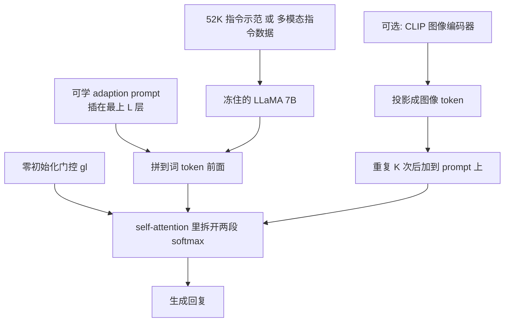

# LLaMA-Adapter：冻住 7B，用零初始化注意力把指令注进 self-attention

<!-- release-date: 2023-03-28 -->

**本文依据**：`LLaMA-Adapter: Efficient Fine-tuning of Large Language Models with Zero-initialized Attention`，arXiv **2303.16199v3**（[cs.CV] 18 Sep 2024），30 页，ICLR 2024。作者 Renrui Zhang*、Jiaming Han*、Chris Liu*、Aojun Zhou、Pan Lu、Yu Qiao†、Hongsheng Li†、Peng Gao†‡*；Shanghai Artificial Intelligence Laboratory / CUHK MMLab / UCLA / CPII of InnoHK。代码 https://github.com/OpenGVLab/LLaMA-Adapter。原件首次公开日取 arXiv **v1** 提交日 **2023-03-28**；解读依据本地已核的 **v3**（`pdfinfo` Pages: 30）。文中数字都标 PDF 页码；标「外部补充」的段落不来自本文。不要把后续的 LLaMA-Adapter V2 读成本论文内容。

## 一句话

Stanford Alpaca 用 52K self-instruct 示范把 LLaMA 7B **整网微调**，得到能跟指令走的模型，但 7B 参数全更一遍既慢又难换任务。LLaMA-Adapter 冻住整份 LLaMA，只在高层 Transformer 前缀上插可学 **adaption prompt**，并在 self-attention 里用 **从零学起的门控** 把指令信号慢慢注进去：语言指令设定下可训参数 **1.2M**，8 张 A100 上大约 **1 小时**，生成质量按作者口径可与全量 Alpaca 对照（PDF p.1–2、p.7 表 1）。再把图像 token 加到同一套 prompt 上，同一套零初始化注意力就能扩成多模态 LLM。

## 一、矛盾：指令跟随已经能复现，但全量微调把「换场景」卡死了

2023 年初，指令跟随模型（ChatGPT、GPT-4）已经证明：用自然语言下命令、再生成上下文回复，是一条能用的产品形态。它们闭源、开发成本高，社区很难跟（PDF p.1）。

Stanford Alpaca 给出一条可复制路径：从 Self-Instruct 那 **175** 条人工写的 instruction–output 出发，用 GPT-3.5 扩成 **52K** 条，再监督微调开源 LLaMA 的全部 **7B** 参数，得到接近 GPT-3.5 的指令模型（PDF p.1）。这里 Self-Instruct 只是数据来源，不是本文方法；本文吃的是 Alpaca 已经扩好的那 52K。

问题立刻变成工程问题：整网微调 **耗时、吃算力、换下游场景要再拷一份完整权重**（PDF p.1）。作者要的不是再发明一套指令数据，而是：**冻住 LLaMA，只学一小撮参数，把指令能力插进去**。

并发工作各自补一块：Alpaca-LoRA 用现成 LoRA 做高效微调，但作者认为它绑在原网络结构上、**接不进图像**；Vicuna、LLaMA-GPT4 换更强指令数据，仍是全量微调，也没有多模态这条路（PDF p.2–3）。LLaMA-Adapter 要同时做到：参数少、训得快、同一套机制能接图像。

## 二、全景：prompt 前缀 + 零门控注意力 + 可选图像相加

默认底座是预训练 LLaMA **7B**，Transformer **$N=32$** 层。可学模块只插在 **最上 $L$ 层**（默认语言设定 $L=30$，每层 prompt 长度 $K=10$）（PDF p.3、p.6–7）。

根据 PDF 图 1–3（p.2、p.4、p.5）重画，机制示意，不是测得的延迟。

四条作者自己列的产品性质（PDF p.2）：

| 点 | 论文写法 |
|---|---|
| 参数 | 冻住 7B，只学零初始化注意力，语言设定 **1.2M**，与 7B Alpaca 对照 |
| 时间 | 8×A100 上 **不到一小时**，作者写比 Alpaca **快三倍** |
| 即插即用 | 不同场景插不同 adapter；文中举例每个上下文存 **1.8M** adapter，而不是再拷一份 **13G** LLaMA |
| 多模态 | 接图像编码器，在 MME、MMBench、LVLM-eHub 上与同期工作对照 |

1.2M 与 1.8M 不是笔误：前者是语言指令设定；后者含投影网络，ScienceQA 多模态行是 **1.8M**（PDF p.7 表 2）。存储数字正文与表不完全一致，见第六节。

## 三、可学 adaption prompt：只改高层语义，不改底座

对 $N$ 层 LLaMA，在最上 $L$ 层（$L\le N$）各插一组可学 prompt $P_l\in\mathbb{R}^{K\times C}$。$K$ 是每层 prompt 长度，$C$ 是隐层宽度。作者的理由很短：**高层语义更适合被指令知识改写**（PDF p.3）。

第 $l$ 层里，长度为 $M$ 的词 token $T_l\in\mathbb{R}^{M\times C}$ 表示当前指令和已经生成的回复。prompt 沿 token 维拼在前面：

$$
[P_l;T_l]\in\mathbb{R}^{(K+M)\times C}
$$

指令知识住在 $P_l$ 里，再通过下一节的零初始化注意力去引导 $T_l$ 往下写（PDF p.3–4）。

这是 prefix / prompt tuning 那一支，不是 LoRA 那种「给权重矩阵加低秩补丁」。作者后文也拿 Alpaca-LoRA 对照：LoRA 改原网络权重、默认接不进图像；Adapter 这条路把容量放在前缀 token 上，图像只要变成同形状的 token 就能加进去（PDF p.2–3、p.5）。

## 四、零初始化注意力：先关掉指令通道，再慢慢打开

### 旧问题

prompt 若随机初始化，训练一开始就会往词 token 里灌噪声，稳定性和最终效果都差（PDF p.4）。作者不要「先乱搅一通再慢慢学好」，而要：**早期几乎等于原版 LLaMA，后期再让指令通道长大。**

### 前向怎么改

正在生成第 $M+1$ 个词，当前词 token 记作 $t_l\in\mathbb{R}^{1\times C}$。Q、K、V 仍走原线性层，但 K/V 看见的是「prompt + 已有词 + 当前词」（PDF p.4 式 2–4）：

$$
Q_l=\mathrm{Linear}_q(t_l),\quad
K_l=\mathrm{Linear}_k([P_l;T_l;t_l]),\quad
V_l=\mathrm{Linear}_v([P_l;T_l;t_l])
$$

softmax 前的分数：

$$
S_l=Q_l K_l^\top/\sqrt{C}\in\mathbb{R}^{1\times(K+M+1)}
$$

把它拆成两段：对着 $K$ 个 prompt 的 $S_l^K$，对着 $M+1$ 个词的 $S_l^{M+1}$（PDF p.4 式 6）。**会搅局的是第一段**：它表示「生成 $t_l$ 时 prompt 贡献了多少」。

### 门控怎么接

每层一个可学标量 $g_l$，**零初始化**。两段 **各自 softmax**，只把第一段乘 $g_l$，并用 $\tanh$ 把 $g_l$ 压到 $(-1,1)$（PDF p.4 式 7）：

$$
S_l^g=\bigl[\mathrm{softmax}(S_l^K)\cdot\tanh(g_l);\;\mathrm{softmax}(S_l^{M+1})\bigr]^\top
$$

作者强调三件事（PDF p.4）：

1. **分开放 softmax**：词这一段的概率分布不跟 prompt 抢归一化，预训练知识不被改写。
2. **词这一段不乘系数**：避免把原注意力分布整体缩放。
3. **$g_l$ 接近 0 时**：输出几乎只走原 LLaMA；训练中 $g_l$ 变大，才把指令语义注进去。

实践上每个注意力头一套 $g_l$，让多头各学各的（PDF p.4）。输出仍是 $t_l^o=\mathrm{Linear}_o(S_l^g V_l)$（PDF p.4 式 8）。

这和「prompt 外面再乘一个随机门」不是一回事。作者点名：已有 gated prompt 工作多用随机初始化因子做 token 混合；他们的门从零学，并且嵌在 self-attention 分数里。ControlNet、Flamingo 一类零初始化也不是 PEFT：参数量大，动机是网络级初始化或残差融合，不是注意力内部的交互控制（PDF p.3）。附录把 Flamingo 门控拆成四条差异：位置（在 LLM 层外、接在新增 cross-attention/FFN 之后）、机制（残差加权 vs 重加权 prompt 注意力分数）、参数（新增模块超过 3B vs 本文 1.2M prompt）、场景（Flamingo 专为视觉语言加很重的 cross-attention）（PDF p.18）。

### 为何比随机初始化稳

ScienceQA 验证集上，随机初始化准确率 **40.77%**，几乎等于表 2 的 Random Choice（**39.83%**）；零初始化到 **83.85%**，增益 **+43.08%**（PDF p.8 表 5）。损失曲线：零初始化开头掉得快、最后收到接近 0；随机初始化慢慢靠近 **0.15**，作者说没充分收敛（PDF p.8 图 7）。

可迁移的不是「再发明一种 adapter 层」，而是：**外来前缀默认有毒，应用一个从零长起来的开关，并且不要让外来分数和原分数抢同一个 softmax。**

## 五、接图像：同一套门控，prompt 上做加法

语言指令之外，作者把同一套模块改成「看图答题」：caption、计数、OCR 等都算在多模态推理里（PDF p.5）。

CLIP 一类视觉编码器抽出多尺度全局特征 $\{I_m\}_{m=1}^{M}$，$I_m\in\mathbb{R}^{1\times C_m}$。沿通道拼接后，可学投影网络映到词嵌入空间，得到一个图像 token $I_p\in\mathbb{R}^{1\times C}$（PDF p.5 式 9）。把 $I_p$ **重复 $K$ 次**，加到每一层插入的 $K$ 长 prompt 上：

$$
P_l^v=P_l+\mathrm{Repeat}(I_p)\in\mathbb{R}^{K\times C}
$$

之后仍走零初始化注意力，$g_l$ 负责把图像条件语义逐渐注进 LLaMA（PDF p.5 式 10）。图像编码器与 LLaMA 都可以冻住，只训投影和零初始化注意力（ScienceQA 设定，PDF p.5）。

训练分两条线，不要混（PDF p.5–6）：

1. **ScienceQA 域内**：直接用该基准的多模态训练集微调，再域内测。
2. **零样本多模态**：两阶段。第一阶段用 LAION-400M 的图文对，调投影网络和零初始化注意力，对齐视觉特征与词 token；第二阶段冻投影，只用 Alpaca 数据 **加上** LLaVA-I，调 LLaMA 里的零初始化注意力，让模型按人指令写详细回复。再在 MME、MMBench、LVLM-eHub 上测。

## 六、语言指令实验：52K、超参、和全量 Alpaca 对照

### Recipe

跟随 Alpaca，用同一套 **52K** 指令数据。8 张 A100，**5** 个 epoch。warmup **2** epoch，batch **64**，学习率 **0.009**，weight decay **0.02**。$N=32$，$K=10$，$L=30$（PDF p.6–7）。定量对照对象是同样吃 52K 的 Alpaca 与 Alpaca-LoRA；GPT-4 评估基准（Vicuna 那套）用 GPT-4 在 **80** 道题上比较两模型回复质量（PDF p.7）。

### 生成对照

图 4 给问答、翻译、写代码的并排回复，作者判断与全量 Alpaca **相当**（PDF p.6–7）。附录 F 再并上 Alpaca-LoRA 与 GPT-3；附录 G 对照 LLaMA-I（按 Chung 等设定指令微调的 **LLaMA 65B**），作者仍称 7B+1.2M 的回复可对照（PDF p.24–30）。这是展示，不是自动指标。

GPT-4 评估饼图（PDF p.7 图 5，读自页面渲染）：相对 Alpaca，**赢 61 / 平 90 / 输 9**；相对 Alpaca-LoRA，**赢 63 / 平 82 / 输 15**。作者据此写「获得更多 win」。平局占绝大多数，读图时不要把 90、82 当成失败数。

### 效率表

表 1，训练时间测自 8×A100（PDF p.7）：

| 模型 | 可训参数 | 存储 | 训练时间 |
|---|---:|---:|---:|
| Alpaca | 7B | 13G | 3 hours |
| Alpaca-LoRA | 4.2M | 16.8M | 1.5 hours |
| LLaMA-Adapter | 1.2M | 4.7M | 1 hour |

紧接着的正文把存储写成 **4.9M**（PDF p.7）。表是 4.7M，文是 4.9M，论文未解释差值；引用时跟页码走，不要自行抹平。多节点时作者强调只需传 **1.2M** 的梯度，而不是 Alpaca 的 7B（PDF p.7）。

Open LLM 附录数字：Alpaca 平均 **49.23**，Alpaca-LoRA **50.73**，LLaMA-Adapter **52.2**（ARC 54.7 / HellaSwag 78.8 / MMLU 34.9 / TruthfulQA 40.4）（PDF p.23 表 18）。换 LoRA rank 2/4/8/16（参数 1.0M–8.4M，时间约 1.48–1.5h）平均仍在 **50.7–50.9**，作者称 1.2M / 1h 的 Adapter 平均最好（PDF p.23 表 19）。MMLU 上 LoRA 若干 rank 高于 Adapter，平均分被 TruthfulQA 和 ARC 拉回来——这是表里的事实，不是「全面超过」。

## 七、多模态数字：ScienceQA 与零样本三基准

ScienceQA 设定：问题、文本上下文、选项拼成一句送进 LLaMA；视觉用 CLIP + bottleneck MLP 投影；其余超参与语言 Adapter 相同（PDF p.7）。

表 2 摘两行（PDF p.7）：

| 模型 | 可训参数 | Avg |
|---|---:|---:|
| LLaMA-Adapter$^T$（仅文本） | 1.2M | 78.31 |
| LLaMA-Adapter（含视觉） | 1.8M | 85.19 |

仅文本已超过若干传统 VQA；再加 **0.6M** 投影，平均 **+6.88**。作者写「优于 GPT 系列」：表上 GPT-4 CoT 平均 **83.99**，Adapter 多模态 **85.19**（PDF p.8）。这是该基准、该输入格式下的准确率，不是通用 GPT-4 对比。

零样本三基准（PDF p.8 表 3）：

| 模型 | MME P | MME C | MMBench All | LVLM-eHub VP / VKA / VR / VC |
|---|---:|---:|---:|---|
| LLaVA | 503 | 215 | 36.2 | 0.62 / 0.38 / 0.77 / 0.79 |
| Mini-GPT4 | 867 | 292 | 23.0 | 0.73 / 0.35 / 0.53 / 0.57 |
| LLaMA-Adapter | 973 | 249 | 39.5 | 0.81 / 0.44 / 0.83 / 0.59 |

作者强调效率：LLaVA 微调整个 7B LLM；MiniGPT-4 用的 Vicuna 本身是 **13B** 全量微调 LLaMA（PDF p.8）。MME 认知分 MiniGPT-4 更高（292 vs 249）；MMBench 与 MME 感知分 Adapter 更高。图 6 给计数、OCR、常识三例，属定性（PDF p.8）。

附录把 MME 感知拆到 Existence/Count/…/OCR，Adapter 感知合计 **973**，其中 Count **50**、Position **48**，并不均匀（PDF p.17 表 9）。认知合计 **249**（PDF p.17 表 10）。LVLM-eHub 44 个数据集平均：LLaVA 0.64、MiniGPT-4 0.55、Adapter **0.67**（PDF p.17 表 11）。

加数据会涨：默认 Alpaca 52K + LLaVA-I 158K；再加 LLaVA-1.5 采样的 83K VQAv2，或全部 204K VQAv2。MME All 从 **1222** 到 **1256** 再到 **1618**；MMBench All 从 **39.5** 到 **43.4** 再到 **60.1**（PDF p.22–23 表 17）。论文把这些与 InstructBLIP、LLaVA-1.5 放同一张表，那些模型数据与底座都更强，只作参照，不是公平消融。

## 八、消融：插多少层、门控开不开

ScienceQA 验证集，插入层数（PDF p.8 表 4）：

| 层数 | 参数 | Val Acc. |
|---:|---:|---:|
| 10 | 0.97 | 55.95 |
| 20 | 1.37 | 73.36 |
| 30 | 1.79 | 83.85 |
| 32 | 1.83 | 81.03 |

层数加参数、准确率大体上升，但 **32 层略低于 30 层**。作者解释：插太多会干扰底层对输入词的编码；资源不够选最优时，**插全部层一般也够用**（PDF p.8）。语言默认 $L=30$ 与这张表一致。

零初始化 vs 随机初始化见第四节表 5。这是全文最硬的机制证据：没有零门控，验证准确率掉到随机选择附近。

## 九、同一套注意力，接到 ViT / RoBERTa / CLIP

作者声称零初始化注意力不限于指令模型，可做传统视觉、语言、视觉语言的 PEFT（PDF p.8–9）。第 2 页把 RoBERTa 写成「ReBERTa」，后文与实验均是 RoBERTa，按后文。

主文表 6–8 的数字与附录细表对不上，且表 6 的 Full 行（75.88 / 83.36 / 47.64）与表 8 的 CLIP 行完全相同（PDF p.8）。更像排版复用，不宜当独立测量。以附录细表为准：

- **ViT-B/16**，VTAB-1k，ImageNet-21k 监督预训练。Zero-init 在 19 个任务里 16 个超过 VPT；Natural/Specialized/Structured 均值约 **81.7 / 84.4 / 56.8**（PDF p.21 表 12；主文表 6 写成 81.74 / 84.43 / 56.75）。
- **RoBERTa large**，SQuAD：Zero-init 在 1.1 上 EM/F1 **88.8 / 94.6**，2.0 上 **83.9 / 87.2**（PDF p.8 表 7）。NER/SRL 的 micro-F1 相对 P-tuning v2 复现略高（PDF p.21 表 13）。
- **CLIP ViT-B/16**，base-to-novel：附录表 14 平均 Base/Novel/HM 为 **90.27 / 80.07 / 84.67**（PDF p.21）。主文表 8 那组 81.74/84.43/56.75 不要当 CLIP 结果用。

额外：C-VQA 反事实问答上，LLaMA-Adapter-7B 在 Numerical indirect 为 **34.3**（损失 5.6↓），作者称该组最好（PDF p.22 表 15）。POPE 幻觉：7B Adapter 在 Random/Popular/Adversarial 为 **75.47 / 60.43 / 60.66**，高于表中若干 13B 多模态模型，低于 InstructBLIP-13B 的 88.73/81.37/74.37（PDF p.22 表 16）。

## 十、限制与论文没写清的地方

- **评测很「展示」**：主语言结论大量靠案例和 GPT-4 对 80 题的偏好，不是人类盲评，也不是统一自动指标。Open LLM 在附录，MMLU 并未全面领先 LoRA。
- **存储口径打架**：图 1 旁写 1.8M vs 13G；表 1 是 4.7M；正文写 4.9M。论文没有把 1.2M 参数如何变成这些文件大小讲清楚。
- **主文表 6–8 疑似错贴**：与表 8、附录表 12/14 冲突。传统任务请用附录。
- **多模态不算从零训练视觉**：ScienceQA 冻视觉编码器；零样本第一阶段还要 LAION-400M 对齐，第二阶段还要 LLaVA-I。不是「只加 1.2M 就突然会看图」。
- **幻觉与计数并不强**：POPE 远低于 InstructBLIP；MME Count 仅 50。图 6 自己也有数错积木的例子。
- **没有系统/推理 recipe**：没有吞吐、显存轨迹、合并权重后的延迟。和 LoRA「推理可合并、无额外深度」不是同一类保证。
- **LLaMA-Adapter V2 不是本文**：v3 正文不讲 V2。后续工作若出现，标外部补充，不要写进机制节。

## 十一、可迁移启发

1. **外来前缀默认有毒。** 随机 prompt 在 ScienceQA 上等于乱选。先把通道乘零，再让数据决定要不要打开。
2. **不要让新分数和旧分数抢同一个 softmax。** 分开放，旧分布保持原样，这是「冻底座」在注意力里的对应物。
3. **多模态可以是加法，不必先上 cross-attention。** 图像变成与 prompt 同形状的 token 再相加，门控复用。代价是表达力上限和计数/OCR 弱点都跟着 prompt 容量走。
4. **插高层、留底层。** $L=30$ 优于 $L=32$ 说明「能插的层」不是越多越好。
5. **和 LoRA 分工。** LoRA 改权重、易合并；本文改注意力前缀、易接新模态。需要换专家知识、存小文件时走 adapter；需要原结构里的低秩更新时走 LoRA。论文没有做合并延迟实验。

## 关键词回看

- **Adaption prompt**：插在最上 $L$ 层、长度为 $K$ 的可学前缀。
- **Zero-initialized attention**：prompt 与词的注意力分数分开 softmax，prompt 一段乘从零学的 $g_l$。
- **Zero gating $g_l$**：$\tanh$ 压到 $(-1,1)$，可按头独立。
- **Self-instruct 52K**：Alpaca 从 175 条人工对扩出的指令数据；本文当训练集，不重做 Self-Instruct。
- **多模态 prompt $P_l^v$**：图像 token 重复 $K$ 次后与 $P_l$ 相加。

## 参考资料

- 论文 PDF：`readings/_src/训练方法与强化学习/LLaMA-Adapter.pdf`（本地 v3，30 页）
- arXiv：https://arxiv.org/abs/2303.16199
- 代码：https://github.com/OpenGVLab/LLaMA-Adapter
- 同库对照（外部）：[LoRA](./LoRA.md) 讲低秩权重补丁；Self-Instruct 只在本文当 52K 数据来源简述
