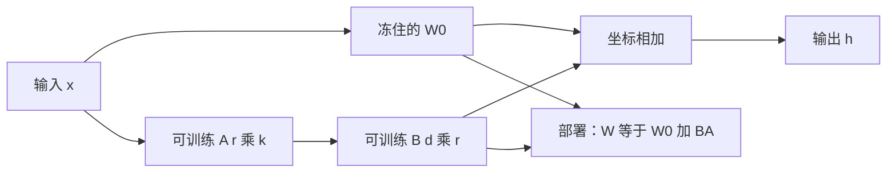

# LoRA：175B 全量微调养不起，低秩补丁就能换任务

<!-- release-date: 2021-06-17 -->

**本文依据**：`LoRA: Low-Rank Adaptation of Large Language Models`，arXiv 2106.09685**v2**（[cs.CL] 16 Oct 2021），26 页，封面标 (Version 2)。作者 Edward Hu*、Yelong Shen*、Phillip Wallis、Zeyuan Allen-Zhu、Yuanzhi Li、Shean Wang、Lu Wang、Weizhu Chen，Microsoft Corporation。代码 https://github.com/microsoft/LoRA。原件首次公开日取 arXiv **v1** 提交日 **2021-06-17**；解读依据本地已核的 v2（v1 之后补了更好的基线、GLUE 实验和 adapter 延迟分析，见 PDF 首页脚注 0）。文中数字都标 PDF 页码；标「外部补充」的段落不来自本文。

## 一句话

全量微调 GPT-3 175B，每换一个下游任务就要存一份 175B 权重，部署上养不起。LoRA 冻住预训练矩阵 $W_0$，只训练一对瘦矩阵 $B$、$A$，让权重更新 $\Delta W = BA$。推理时把 $BA$ 加回 $W_0$，形状与原来完全一样，**构造上没有额外延迟**。相对用 Adam 全量微调 GPT-3 175B，可训练参数大约少 **10,000 倍**，GPU 显存大约少 **3 倍**（PDF p.1）。

## 一、矛盾：大模型适配从「麻烦」变成「部署灾难」

NLP 的标准套路是：先在通用语料上预训练，再适配到具体任务（PDF p.1）。适配通常就是全量微调：所有参数都跟着梯度走。

对 GPT-2、RoBERTa large 来说，这只是「不方便」——checkpoint 大一点。到 GPT-3 175B，它变成部署问题：每个任务一份独立的 175B 实例，存不下、切不过去（PDF p.1–2）。

问题陈述写得很硬（PDF p.2–3）：全量微调学到的任务增量 $\Delta\Phi$ 维度等于原模型 $|\Phi_0|$。GPT-3 大约 $|\Phi_0|\approx 175$ Billion。多任务服务等于多份完整模型。

论文同时提醒：few-shot / prompt 不是替代品。附录 A 里 GPT-3 few-shot 在 MNLI-m 验证准确率 40.6%，微调到 89.5%；RTE 从 69.0% 到 85.4%（PDF p.16 表 8）。有几千条标注时，仍然需要改参数。

于是目标换成：任务增量 $\Delta\Phi=\Delta\Phi(\Theta)$ 由一小撮 $\Theta$ 编码，$|\Theta|\ll|\Phi_0|$。落到 GPT-3 175B 上，$|\Theta|$ 可以小到 $|\Phi_0|$ 的 **0.01%**（PDF p.3）。

## 二、当时两条主流路，各卡在哪

这个问题不新。论文把当时的高效适配收成两类（PDF p.3）。

### Adapter：串在残差路上，推理多一层

Houlsby 等在每个 Transformer 块里插两层 adapter；Lin 等改成每块一层再加 LayerNorm。瓶颈可以很小（有时不到原模型 1%），FLOPs 看起来不多。但大网络靠硬件并行压延迟，adapter **必须串行算完**。在线推理 batch 经常是 1，这笔串行开销就会露出来（PDF p.3）。模型切分之后更糟：多一层深度就要多一次 AllReduce / Broadcast，除非把 adapter 参数冗余存很多份。

表 1 在 GPT-2 medium、Quadro RTX8000、单次前向、100 次平均（PDF p.4）：

| Batch / 序列长 / $|\Theta|$ | Fine-Tune / LoRA（ms） | Adapter$^L$ | Adapter$^H$ |
|---|---:|---:|---:|
| 32 / 512 / 0.5M | $1449.4\pm0.8$ | $1482.0\pm1.0$（+2.2%） | $1492.2\pm1.0$（+3.0%） |
| 16 / 256 / 11M | $338.0\pm0.6$ | $354.8\pm0.5$（+5.0%） | $366.3\pm0.5$（+8.4%） |
| 1 / 128 / 11M | $19.8\pm2.7$ | $23.9\pm2.1$（+20.7%） | $25.8\pm2.2$（+30.3%） |

batch=1、短序列时 Adapter$^H$ 慢 **30.3%**。附录 B 把这条曲线画满：大 batch、长序列能把减速摊掉，在线短序列仍可超过 30%（PDF p.17 图 5）。

### Prefix / Prompt：优化输入激活，但占序列长度

Prefix-tuning 一类方法去改输入侧的特殊 token。论文观察到两件事（PDF p.3）：难优化；可训练参数变多时表现**不是单调变好**。更根本的是：给适配预留一段序列，下游真正能用的长度就被挤短。

后文 GPT-3 实验把这条坐实：prefix-embedding 超过 256 个特殊 token、prefix-layer 超过 32 个，性能明显掉（PDF p.8）。作者怀疑特殊 token 太多会把输入分布推离预训练。

LoRA 要同时躲开这两件事：**不加深网络，不占用序列位置。**

## 三、设计：冻住 $W_0$，只学 $\Delta W=BA$

### 假设从哪来

Aghajanyan 等（2020）表明：过参数化的预训练 LM 适配时，落在很低的**本征维**上，随机投到更小子空间仍能学。LoRA 把这句话往前推一步：适配时的**权重更新**也有很低的「本征秩」（PDF p.4）。

### 前向怎么改

对预训练矩阵 $W_0\in\mathbb{R}^{d\times k}$，把更新写成低秩分解：

$$
W_0+\Delta W=W_0+BA,\quad B\in\mathbb{R}^{d\times r},\; A\in\mathbb{R}^{r\times k},\; r\ll\min(d,k)
$$

训练时 $W_0$ 冻住、不收梯度；$A$、$B$ 可训练。同一输入 $x$ 分别乘 $W_0$ 和 $BA$，输出按坐标相加（PDF p.4 式 3）：

$$
h=W_0x+\Delta Wx=W_0x+BAx
$$

图 1 就是这个旁路：左边是原矩阵乘，右边多一条 $A\to B$ 的瘦通道（PDF p.1）。

初始化：$A$ 高斯随机，$B$ 全零，所以训练开始时 $\Delta W=BA$ 是零，不会把预训练行为一下子打乱（PDF p.4）。

再把 $\Delta Wx$ 乘 $\frac{\alpha}{r}$。$\alpha$ 对 $r$ 是常数。用 Adam 时，调 $\alpha$ 大致等于调学习率（初始化尺度配好的前提下）。作者因此把 $\alpha$ 钉在**第一次试的那个 $r$**，之后改 $r$ 不再重调 $\alpha$，减少超参联动（PDF p.4）。

### 和全量微调的关系

如果对**所有**权重矩阵都上 LoRA，再训偏置，把 $r$ 拉到预训练矩阵的秩，表达力大致能收回全量微调（PDF p.4）。Adapter 把容量 recast 成 MLP；prefix 把容量 recast 成「不能吃长输入」的模型。LoRA 这条极限至少在形式上还对着原模型。

### 推理为什么没有额外延迟

部署时显式算 $W=W_0+BA$ 存下来，推理路径与全量微调后的稠密乘完全一样。$W_0$ 和 $BA$ 都在 $\mathbb{R}^{d\times k}$。换任务：减掉旧 $BA$，加上新 $B'A'$，开销很小（PDF p.4–5）。**这是构造保证，不是测出来碰巧差不多。**

训练时当然还是 $W_0x+BAx$ 两条路并行；合并只发生在部署。

## 四、接到 Transformer 上：改哪几个矩阵

原则上任何稠密层都能套。Transformer 一块里：注意力四个矩阵 $W_q,W_k,W_v,W_o$，MLP 两个。论文把 $W_q$（以及 $W_k,W_v$）当成 $d_{\mathrm{model}}\times d_{\mathrm{model}}$ 的一张矩阵，即使输出会按头切开（PDF p.5）。

实验范围收得很窄：**只适配注意力权重，冻住 MLP**——为了简单和省参数。MLP、LayerNorm、偏置留给未来（PDF p.5）。大多数主实验进一步只改 $W_q$ 和 $W_v$（PDF p.6）。

可训练参数（只对选中的矩阵插 LoRA）是 $|\Theta|=2\times\hat{L}_{\mathrm{LoRA}}\times d_{\mathrm{model}}\times r$（PDF p.6）。

GPT-3 175B 上 $d$ 可以到 12,288，而 $r$ 取 1 或 2 往往就够（PDF p.2）。这是后文「本征秩」故事的伏笔。

## 五、数字从哪来：参数、显存、吞吐、存 100 个任务

对用 Adam 训的大 Transformer，若 $r\ll d_{\mathrm{model}}$，不必给冻住的参数存优化器状态，VRAM 最多能少 **2/3**（PDF p.5）。

GPT-3 175B 上的几条硬数字（PDF p.5 及脚注 4、5）：

| 量 | 全量 / 基线 | LoRA | 出处 |
|---|---|---|---|
| 训练 VRAM | 1.2TB | 350GB | p.5 |
| 摘要口径的 GPU 显存 | — | 约 3 倍减少 | p.1 |
| checkpoint（$r=4$，只改 Q 和 V） | 350GB | 35MB（约 10,000×） | p.5 |
| 100 个适配模型的存储 | $100\times 350\,\mathrm{GB}\approx 35\,\mathrm{TB}$ | $350\,\mathrm{GB}+35\,\mathrm{MB}\times 100\approx 354\,\mathrm{GB}$ | p.5 脚注 4 |
| 训练吞吐（同模型并行切分数，每 V100） | 32.5 token/s | 43.1 token/s（约 25% 加速） | p.5 脚注 5 |

脚注 4 写清楚：部署时**底座 350GB 仍要在**；省的是「每个任务再存一份完整权重」。

任务切换：机器上 VRAM 里放一份预训练权重，热插拔各任务的 $A,B$（PDF p.5）。

## 六、和 adapter / prefix / fine-tune 怎么比

实验在 Tesla V100 上跑：RoBERTa、DeBERTa、GPT-2，再上到 GPT-3 175B（PDF p.5）。

### RoBERTa / DeBERTa，GLUE（表 2，PDF p.6）

只摘总平均和参数量。越高越好。带 * 的数字来自前人；带 † 的是按 Houlsby 设定收紧后的公平对照（固定 batch、序列长 128，MRPC/RTE/STS-B 从预训练而不是从 MNLI checkpoint 出发）。

| 模型与方法 | 可训练参数 | GLUE 平均 |
|---|---:|---:|
| RoBERTa$_{\mathrm{base}}$ FT* | 125.0M | 86.4 |
| RoBERTa$_{\mathrm{base}}$ BitFit* | 0.1M | 85.2 |
| RoBERTa$_{\mathrm{base}}$ Adapter$^D$* 0.3M / 0.9M | 0.3M / 0.9M | 84.4 / 85.4 |
| RoBERTa$_{\mathrm{base}}$ LoRA | 0.3M | 87.2 |
| RoBERTa$_{\mathrm{large}}$ FT* | 355.0M | 88.9 |
| RoBERTa$_{\mathrm{large}}$ LoRA | 0.8M | 89.0 |
| RoBERTa$_{\mathrm{large}}$ Adapter$^P$† 3.0M / 0.8M | 3.0M / 0.8M | 88.4 / 87.9 |
| RoBERTa$_{\mathrm{large}}$ Adapter$^H$† 6.0M / 0.8M | 6.0M / 0.8M | 87.8 / 86.4 |
| RoBERTa$_{\mathrm{large}}$ LoRA† | 0.8M | 88.6 |
| DeBERTa$_{\mathrm{XXL}}$ FT* | 1500.0M | 91.1 |
| DeBERTa$_{\mathrm{XXL}}$ LoRA | 4.7M | 91.3 |

读法：参数少两到三个数量级，平均分追上或略过全量微调。公平设定 † 下 LoRA 0.8M 的 88.6 仍高于同预算 Adapter。

### GPT-2，E2E NLG（表 3，PDF p.7）

GPT-2 medium：LoRA 0.35M，BLEU $70.4\pm0.1$，超过 FT 的 68.2、Prefix-layer 的 69.7。GPT-2 large：LoRA 0.77M，BLEU $70.4\pm0.1$，与 Prefix-layer 70.3 持平、高于 FT 68.5。附录 F.1 的 DART / WebNLG 方向一致（PDF p.21–22）。

### GPT-3 175B（表 4，PDF p.8）

| 方法 | 可训练参数 | WikiSQL Acc. | MNLI-m Acc. | SAMSum R1/R2/RL |
|---|---:|---:|---:|---|
| FT | 175,255.8M | 73.8 | 89.5 | 52.0/28.0/44.5 |
| BitFit | 14.2M | 71.3 | 91.0 | 51.3/27.4/43.5 |
| PreEmbed | 3.2M | 63.1 | 88.6 | 48.3/24.2/40.5 |
| PreLayer | 20.2M | 70.1 | 89.5 | 50.8/27.3/43.5 |
| Adapter$^H$ | 7.1M / 40.1M | 71.9 / 73.2 | 89.8 / 91.5 | 53.0/28.9/44.8 ；53.2/29.0/45.1 |
| LoRA | 4.7M / 37.7M | 73.4 / 74.0 | 91.7 / 91.6 | 53.8/29.8/45.9 ；53.4/29.2/45.1 |

波动大约 WikiSQL $\pm0.5\%$，MNLI-m $\pm0.1\%$，SAMSum $\pm0.2/\pm0.2/\pm0.1$（PDF p.8）。LoRA 4.7M 已在三套任务上达到或超过全量微调。图 2 把准确率对可训练参数的对数画出来：LoRA 随预算更稳；prefix 加 token 会掉下去（PDF p.8）。

低数据附录（MNLI 子集，GPT-3，PDF p.22 表 16）：100 条时 PrefixEmbed 37.6%（随机约 33.3%），LoRA 63.8%，FT 60.2%。prefix 在极小样本上特别脆。

附录 E 试过 LoRA+PrefixEmbed：WikiSQL 可到 75.0–76.2，作者说两条路有一定正交；LoRA+PrefixLayer 略差，归到 prefix-layer 对学习率极敏感、拖累 $A,B$ 优化（PDF p.20–21、p.23 表 15）。

## 七、秩与改哪些矩阵：实验怎么选

第 7 节三个问题（PDF p.9–10）：预算固定该改哪类权重；$\Delta W$ 是不是真缺秩；$\Delta W$ 和 $W$ 什么关系。

### 同样 18M，改谁

GPT-3 175B、96 层、预算 18M（FP16 大约 35MB）：改一类权重则 $r=8$，改两类则 $r=4$，四类则 $r=2$（PDF p.10 表 5）。

| 权重 | $W_q$ | $W_k$ | $W_v$ | $W_o$ | $W_q,W_k$ | $W_q,W_v$ | 四个都改 |
|---|---:|---:|---:|---:|---:|---:|---:|
| $r$ | 8 | 8 | 8 | 8 | 4 | 4 | 2 |
| WikiSQL | 70.4 | 70.0 | 73.0 | 73.2 | 71.4 | **73.7** | **73.7** |
| MultiNLI | 91.0 | 90.8 | 91.0 | 91.3 | 91.3 | 91.3 | **91.7** |

全部预算砸在 $\Delta W_q$ 或 $\Delta W_k$ 明显更差。$W_q$+$W_v$ 总体最好。作者的读法：**秩 4 已经装得下 $\Delta W$ 里有用的信息，宁可多改几种矩阵，不要给单一矩阵更高的 $r$**（PDF p.10）。

### $r$ 从 1 到 64（表 6，PDF p.10）

只改 $W_q$ 时 WikiSQL 要到 $r=4$ 才到 70.5；$W_q$+$W_v$ 在 $r=1$ 已是 73.4，再加大几乎不动。四个矩阵 $r=1$ 的 WikiSQL 74.1 已是表里最高之一。脚注 6：不指望小 $r$ 通吃——若下游是另一种语言，把 $r$ 拉到 $d_{\mathrm{model}}$（接近重训）完全可能打过小 $r$（PDF p.10）。

GPT-2 medium 的 E2E 上最优 $r$ 大约在 4–16：验证损失在 $r=16$ 最低，测试 BLEU 在 $r=4$ 最高（70.38）；$r=1$ 的 BLEU 68.72 明显差一点（PDF p.26 表 18）。超参有一部分是对着 $r=4$ 调的，别的 $r$ 未必最优。

### 子空间重叠：加大 $r$ 并没有盖住「更有意义」的方向

对同一预训练模型学出的 $A_{r=8}$ 和 $A_{r=64}$ 做 SVD，用归一化 Grassmann 型相似度 $\phi\in[0,1]$ 看前 $i$、$j$ 个右奇异向量张成的子空间叠多少（PDF p.11 式 4）。第 48 层（96 层里）：**顶部奇异方向重叠很大，其余几乎不重叠**。$\Delta W_v$（以及 $\Delta W_q$）在 $r=8$ 与 $r=64$ 之间大约共享一维、归一化相似度 $>0.5$，用来解释为什么 $r=1$ 在 GPT-3 这些任务上已经能打（PDF p.11 图 3）。作者判断：顶部方向才有用，其余更像训练噪声。

两个随机种子、$r=64$：$\Delta W_q$ 的「本征秩」看起来高于 $\Delta W_v$（更多共同方向），与表 6 里「只训 $W_q$ 需要更大 $r$」一致。对照两张随机高斯矩阵则几乎没有共同方向（PDF p.11–12 图 4）。

### $\Delta W$ 相对 $W$：放大的是预训练里「有但不强调」的方向

把 $W$ 投影到 $\Delta W$ 的 $r$ 维子空间，比较 Frobenius 范数。GPT-3 第 48 层 $W_q$（PDF p.12 表 7）：

- $\|W_q\|_F=61.95$
- $r=4$：$\|U^\top W_q V^\top\|_F$ 对 $\Delta W_q$ / $W_q$ 自身 top-$r$ / 随机矩阵分别是 0.32 / 21.67 / 0.02；$\|\Delta W_q\|_F=6.91$
- $r=64$：对应 1.90 / 37.71 / 0.33；$\|\Delta W_q\|_F=3.57$

三条结论（PDF p.12）：$\Delta W$ 与 $W$ 的相关强于随机，说明在放大 $W$ 里已有的特征；但不是在重复 $W$ 的顶部奇异方向，而是放大 $W$ 里不强调的方向；放大倍数很大，$r=4$ 时约 $6.91/0.32\approx 21.5$。$r=64$ 时放大倍数掉到大约 2，再次支持「任务方向的本征秩很低」——多出来的方向并没有被猛放大（PDF p.25）。附录图 8：$\Delta W_q$ 的 top-4 与 $W_q$ 的 top-10% 相似度勉强超过 0.2。

上图按 PDF 图 1 与式 3 重画，是机制示意，不是测得的延迟。

## 八、限制、没做的事、作者自己划的边界

论文写明的限制（PDF p.5、p.12）：

- **合进 $W$ 之后，一个 batch 里很难混用不同任务的 $A,B$。** 要不合并、按样本动态选 LoRA 模块，那是延迟不敏感场景。
- 主实验**只改注意力、冻 MLP**；MLP / LayerNorm / bias 的系统实验留给未来。
- 选哪些矩阵主要靠启发式，没有更原则的选择算法。
- 小 $r$ 不是定理：跨语言这类「离预训练很远」的任务，作者明确不打包票（PDF p.10 脚注 6）。
- 微调或 LoRA **为什么**能把预训练特征拧到下游，机制远未清楚；作者只说低秩让这个问题比全量微调更好下手。
- $\Delta W$ 缺秩也许暗示 $W$ 本身也缺秩，只是观察，不是证明。

v2 相对 v1：更好的基线、GLUE、更多 adapter 延迟分析（PDF p.1 脚注 0）。本地解读用的就是这一版。

**外部补充（不是论文内容）**：这篇 2021 年的方法后来长成 Hugging Face PEFT、QLoRA 等一整条生态；那些工具、量化和默认超参**不属于本文**。若要把「合进 $W$、无额外延迟」迁到今天的推理栈，应另读后续材料，不要写成 Hu 等人已经做完量化感知训练。

## 九、可迁移的几条

1. **部署成本的单位要从「模型」改成「底座 + 补丁」。** 100 个任务 354GB 对 35TB，差的是这个记账方式（PDF p.5 脚注 4）。
2. **想零额外延迟，更新必须能代数地合进原矩阵。** 串行模块（adapter）再瘦也会在 batch=1 时露出 20–30%（PDF p.4）。旁路低秩是为了可合并，不只是为了少参数。
3. **预算有限时，多改几种矩阵、每张用更小的 $r$，往往优于一张矩阵用很大的 $r$。** 表 5 是这条的直接证据。
4. **先把 $\alpha/r$ 从学习率里拆开，改 $r$ 时少动别的旋钮。** 这是工程上少踩坑的细节（PDF p.4）。
5. **低秩适配是分析工具，不只是省显存。** 子空间重叠和「放大未强调方向」是论文真正想讲的科学观察；复现时不要只抄 $r=8$。

对自己项目：稠密层、多任务要热切换、推理延迟预算紧——LoRA 的合并故事可以直接用。若任务离预训练分布极远，先把「小 $r$ 够不够」当成要测的假设，不要当公理。

## 关键词回看

- **全量微调（full fine-tuning）**：$\Delta\Phi$ 与 $\Phi_0$ 同维，GPT-3 上每任务一份 175B。
- **本征秩 / 本征维（intrinsic rank / dimension）**：适配更新 $\Delta W$ 实际落在很低维子空间；启发来自 Aghajanyan 等对微调本征维的观察。
- **LoRA 模块 $A,B$**：$\Delta W=BA$，$r\ll\min(d,k)$；$A$ 高斯、$B$ 零初始化。
- **缩放 $\alpha/r$**：让改 $r$ 不必重调学习率。
- **合并推理**：$W\leftarrow W_0+BA$，与全量微调后的 GEMM 同构。
- **Adapter vs Prefix vs LoRA**：加深网络 vs 占用序列 vs 旁路低秩且可合并。

## 参考资料

- Edward J. Hu et al. *LoRA: Low-Rank Adaptation of Large Language Models*. arXiv:2106.09685v2, 2021. https://arxiv.org/abs/2106.09685
- 官方实现：https://github.com/microsoft/LoRA
- Aghajanyan et al. Intrinsic Dimensionality Explains the Effectiveness of Language Model Fine-Tuning. arXiv:2012.13255（论文引用的本征维前作）
- Houlsby et al. Parameter-Efficient Transfer Learning for NLP. arXiv:1902.00751（Adapter$^H$）
- Li & Liang. Prefix-Tuning. arXiv:2101.00190
