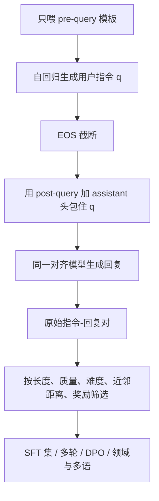

# Magpie：只喂 chat 模板的前半截，对齐模型自己吐出用户问题

<!-- release-date: 2024-06-12 -->

**本文依据**：`Magpie: Alignment Data Synthesis from Scratch by Prompting Aligned LLMs with Nothing`，arXiv 2406.08464**v2**（[cs.CL] 7 Oct 2024），32 页。作者 Zhangchen Xu♠、Fengqing Jiang♠、Luyao Niu♠、Yuntian Deng♢、Radha Poovendran♠、Yejin Choi♠♢、Bill Yuchen Lin♢；University of Washington / Allen Institute for AI。站点 https://magpie-align.github.io/ ，Hugging Face https://hf.co/magpie-align 。原件首次公开日取 arXiv **v1** 提交日 **2024-06-12**；解读依据本地已核的 v2（32 页，封面标 Preprint）。文中数字都标 PDF 页码；标「外部补充」的段落不来自本文。论文之后的 Magpie 生态、后续数据集与社区复用**不写进本文**。

## 一句话

对齐过的 LLM 是自回归的：你只把 **pre-query 模板**（user 消息槽之前那一段）喂进去、后面什么都不写，它就会接着生成一段「用户问题」。把这段问题再包进完整 chat 模板，让同一模型生成回答。作者用 Llama-3-Instruct 这样抽出约 **400 万**条指令及对应回复（PDF p.1），再筛出 **300K** 去做 SFT。Llama-3-8B-Base 只靠这份 SFT，就能超过 ShareGPT、WildChat、Evol-Instruct 等公开集，甚至超过「UltraChat SFT + UltraFeedback DPO」；在 AlpacaEval 等对齐榜上，某些设定下能追上或超过官方 Llama-3-8B-Instruct——后者声称用了 **1000 万+** 条做 SFT 再偏好优化（PDF p.1–2、p.7–8 表 1）。

## 一、矛盾：权重公开了，对齐数据还是黑箱

Llama-3-Instruct、GPT-4 这类模型能听指令，靠的是指令微调数据。权重可以开，对齐数据通常不开。没有这份数据，开源侧很难复现「官方 Instruct 到底对齐了什么」，也很难公平比较公开指令集（PDF p.1）。

当时造数据主要两条路（PDF p.1–2）：

1. **人写或人与模型聊天**：ShareGPT、WildChat、Dolly、OpenAssistant。贵、慢，规模受人工上限卡住。
2. **用 LLM 合成**：Alpaca、Self-Instruct、Evol-Instruct、UltraChat、GenQA。省人力，但通常要 **种子题 + 提示工程 / few-shot**。规模一大，新指令会往种子附近塌，多样性掉。

论文问的是：能不能 **不写种子、不调提示词**，直接从已经对齐的开源权重里把指令「抽」出来？

观察很具体。一次对齐模型的输入可以写成（PDF p.3）：

$$
x = T_{\mathrm{pre\text{-}query}} \oplus q \oplus T_{\mathrm{post\text{-}query}}
$$

$q$ 是用户问题；$T_{\mathrm{pre\text{-}query}}$ 是问题前面的角色头；$T_{\mathrm{post\text{-}query}}$ 是问题结束、切到 assistant 的那段。Llama-2-chat 的例子是 `[INST] Hi! [/INST]`。Llama-3-8B-Instruct 的模板是（PDF p.3，原文拼写为 Insturct）：

- $T_{\mathrm{pre\text{-}query}}$：`<|start_header_id|>user<|end_header_id|>`
- $T_{\mathrm{post\text{-}query}}$：`<|eot_id|><|start_header_id|>assistant<|end_header_id|>`

对齐时模型反复看见「user 头后面该出现用户话」。于是 **只喂 pre-query、停在用户槽位**，自回归就会把「用户话」补出来。作者把这条性质做成流水线，名叫 **Magpie**（PDF p.2 图 1）。

**备注（论文自己标成假设）**：即使对齐时把 instruction loss mask 掉，Magpie 仍能吐出像样的指令。作者猜想模型对指令分布有隐式记忆，留给后续研究（PDF p.3）。这不是实验证明。

Self-Instruct 在本文里只作 **同一教师模型、同规模对照**，不是专篇：附录 F.2 用 Llama-3-8B-Instruct 按官方 Self-Instruct 设定造 100K，再与 Magpie-Air 前 100K 比；Self-Instruct 的指令形态被种子模板箍住，多样性差（PDF p.24 表 11）。

## 二、两步流水线：先吐问题，再吐回答

上图按 PDF p.2 图 1 重画，是机制示意，不是测时。

### 第一步：指令生成

把开源对齐模型（如 Llama-3-70B-Instruct）的官方 chat 模板裁到 user 槽之前，多次采样。生成到 EOS 停。不写种子、不调「请你扮演用户」这类提示（多轮和领域扩展除外）。同一模板多采，得到一批指令（PDF p.3）。

适用声明：作者写可套到 Llama-3、Llama-3.1、Qwen2、Gemma-2、Phi-3 等开源权重（PDF p.3；附录 A 有对应数据集统计）。

### 第二步：回复生成

把第一步的 $q$ 按官方模板包好，再让 **同一（或指定的）对齐模型** 生成回复。角色、指令、回复合在一起就是一条指令数据（PDF p.3）。主实验里 Air / Pro 的回复用 **贪心解码**，理由是「最高概率的词更可能来自训练分布」（PDF p.22）。这是作者直觉，不是对照实验。

主实验两套单轮集（PDF p.5）：

| 名称 | 教师 | 规模 |
|---|---|---|
| Magpie-Air | Llama-3-8B-Instruct | 3M 对话 |
| Magpie-Pro | Llama-3-70B-Instruct | 1M 对话 |

摘要里的「4 million instructions」对应 Air 3M + Pro 1M（PDF p.1、p.5、附录表 4）。SFT 主表用的是各自 **前 300K 原始** 以及筛完仍为 **300K** 的 Filtered（PDF p.7）。

造数成本（四张 A100-SXM4-80GB、AMD EPYC 7763、512 GB RAM、vLLM、bfloat16）（PDF p.6）：

| | 指令（步 1） | 回复（步 2） | GPU 小时（正文另给） | 云上约价 / 1K 条 |
|---|---|---|---|---|
| Air 3M | 1.55 h | 50 h | 206 | $0.12 |
| Pro 1M | 3.5 h | 150 h | 614 | $1.1 |

无人工、不打 GPT-4 API。云价脚注指向 Lambda GPU cloud（PDF p.6 脚注 2）。

## 三、扩展：筛、多轮、偏好、领域

### 筛选

附录 C 给八个可定制指标（PDF p.19）：输入/输出字符长度、任务类别、输入质量（very poor–excellent）、输入难度（very easy–very hard）、最小近邻嵌入距离、奖励 $r^*$、奖励差 $r^*-r_{\mathrm{base}}$。现成配置见表 5：输出长度过滤器 **最后** 做，取回复最长的 $k$ 条；实验里经验阈值 $\tau_1=-12$、$\tau_2=0$（PDF p.19）。Air 的默认 Filter 要求质量 ≥ good、难度 ≥ medium、近邻距离 > 0、奖励差 > $\tau_2$，再取最长回复，得到 300K。Pro 有 Filter–Filter6 多种组合，没有一种在所有榜上同时最优（PDF p.25 表 13）。

质量/难度由 Llama-3-8B-Instruct 打分。Pro 整体质量高于 Air，作者归到 70B 更强（PDF p.5 图 3）。用 Qwen2-7B-Instruct 重打 Air，质量和难度并不更差，作者用来说明「不是自己给自己打高分」（PDF p.22 图 13）。

相似度：`all-mpnet-base-v2` 嵌入 + FAISS 最小近邻距离，用来去重复（PDF p.6）。回复质量用 FsfairX-LLaMA3-RM-v0.1；对同一指令再让 Llama-3 **基座** 用 URIAL 出一条回复，算 $r^*-r_{\mathrm{base}}$，正值表示 Instruct 回复更好、可能更利于指令微调（PDF p.6）。

覆盖：Pro 的 t-SNE（各抽 1 万条）包住 Alpaca、Evol-Instruct、UltraChat 的区域（PDF p.5、p.19 图 8）。任务标签上，Pro **一半以上是 information seeking**，其后是创意写作、求建议、规划、数学；作者说这和真实用户请求分布接近（PDF p.5）。饼图百分比正文没写成表，这里不估。

安全：Llama-Guard-2。Air 安全比例 **99.128%**，Pro **99.347%**；有害不到 1%。不安全里最多的是 specialized advice（财务/医疗/法律或把危险活动说成安全）（PDF p.6、p.21 表 6）。

### 多轮 Magpie-MT

先按单轮做出第一轮。后续轮把 pre-query **接在上一轮完整 prompt 末尾**。8B 有时会忘了自己该演用户，所以加 system prompt 钉住多轮身份（PDF p.4；模板见图 14，PDF p.27）。回复仍按第二步生成。表 4：Air-MT / Pro-MT 各 300K、2 轮（PDF p.18）。

### 偏好 Magpie-DPO

从原始集挑一小撮高质量、类别多样的指令；对每条从对齐模型采 $k$ 次回复，温度 $T<1$；奖励模型打分，最高为 chosen、最低为 rejected（PDF p.4）。主实验 $k=5$、$T=0.8$，Air-DPO 与 Pro-DPO 各 **100K**，RM 为 RLHFlow/ArmoRM-Llama3-8B-v0.1（PDF p.7）。

### 领域与多语

不改 Magpie 骨架，只在 user 头之前加 **领域 system prompt**，例如「你是逐步解数学题的助手」或中文助手设定，后面仍只留空的 user 槽（PDF p.4 图 2）。也可用领域模型本身当教师，如 DeepSeek-Coder-V2、Qwen2-Math-7B-Instruct（PDF p.4）。默认 **不加** 通用 system prompt：Llama-3 没有官方 system prompt，作者试了 Vicuna 那句 chat 设定，指令质量下降、题目变简单，故默认关掉（PDF p.22）。

解码消融（只改步 1）：温度 1 / 1.1 / 1.2，top-p 1 / 0.995 / 0.99。更高温度和 top-p 会略降质量分，但提高难度和多样性（PDF p.21 图 11）。Air / Pro 正式集把多种 $(T,\mathrm{top\text{-}p})$ 拼起来，见表 7（PDF p.23）：Air 凑满 3M（含 $T=1.25$ 的 3×100K），Pro 凑满 1M。

## 四、SFT 怎么训、跟谁比

基座：Llama-3-8B，以及 Qwen1.5 / Qwen2 若干尺寸（PDF p.6）。

公开对照（PDF p.7）：ShareGPT 112K、WildChat 652K、Evol-Instruct 143K、UltraChat 清洗版 208K（HuggingFaceH4/ultrachat_200k）、GenQA 6.47M、OpenHermes 1 243K、OpenHermes 2.5 1M、Tulu V2 Mix 326K，以及 Self-Instruct（Llama-3）100K。偏好基线：UltraChat SFT + UltraFeedback DPO 64K，设定跟 Meng 等（2024）走。

SFT：余弦、初始学习率 $2\times10^{-5}$，最大长度 8192，2 epoch，有效 batch 32，AdamW，warmup 100 步，Axolotl（PDF p.7、p.23 表 8）。DPO：学习率 $5\times10^{-7}$，1 epoch，有效 batch 128，warmup 10%，Alignment Handbook（PDF p.23 表 9）。用各模型官方指令模板。

评测：AlpacaEval 2（805 条真实交互；基线 GPT-4-Turbo 1106 与 Llama-3-8B-Instruct；指标 WR 与长度控制 LC）、Arena-Hard（500 难题，默认基线 GPT-4 0314，WR）、WildBench（1024 条真实日志任务）（PDF p.7–8）。Arena-Hard 与 WildBench 贪心解码；AlpacaEval 2 也贪心，重复惩罚 RP=1.2（PDF p.23）。

## 五、数字：公开集、官方 Instruct、Qwen、推理短板

### 表 1：Llama-3-8B 基座（PDF p.8）

加粗在原文表示 Magpie **超过官方 Llama-3-8B-Instruct**。下表摘 LC / WR（对 GPT-4-Turbo 1106）和 Arena-Hard WR。SD 略。

| 设定 | 对话数 | AE2 LC | AE2 WR | Arena-Hard WR |
|---|---:|---:|---:|---:|
| Self-Instruct（Llama-3）SFT | 100K | 7.21 | 5.18 | 4.0 |
| ShareGPT | 112K | 9.73 | 7.2 | 6.5 |
| Evol Instruct | 143K | 8.52 | 6.25 | 5.1 |
| OpenHermes 1 | 243K | 9.94 | 6.27 | 4.4 |
| Tulu V2 Mix | 326K | 9.91 | 7.94 | 5.4 |
| WildChat | 652K | 14.62 | 10.58 | 8.7 |
| OpenHermes 2.5 | 1M | 12.89 | 9.74 | 8.2 |
| GenQA | 6.47M | 9.05 | 7.11 | 3.0 |
| UltraChat | 208K | 8.29 | 5.44 | 3.6 |
| 上 + UltraFeedback DPO | 64K | 18.36 | 17.33 | 14.8 |
| Magpie-Air-300K-Raw | 300K | 21.99 | 21.65 | 15.8 |
| Magpie-Air-300K-Filtered | 300K | 22.66 | 23.99 | 14.9 |
| 上 + Magpie-Air-DPO | 100K | 45.48 | 50.43 | 35.9 |
| Magpie-Pro-300K-Raw | 300K | 21.65 | 22.19 | 15.9 |
| Magpie-Pro-300K-Filtered | 300K | 25.08 | 29.47 | 18.9 |
| 上 + Magpie-Pro-DPO | 100K | 50.10 | 53.53 | 35.7 |
| Llama-3-8B-Instruct（SFT+DPO） | >10M | 22.92 | 22.57 | 20.6 |

读法（PDF p.8–9）：

- **只做 SFT**，Magpie 的 LC/WR 超过所有列出的公开 SFT 集，也超过 UltraChat+UltraFeedback 这条 SFT+DPO。
- 以 Llama-3-8B-Instruct 为 AlpacaEval 参照时，Magpie SFT 的 LC **超过 50%**，即裁判更常偏向 Magpie SFT 而不是官方 Instruct。
- 再上 Magpie-DPO：Arena-Hard 到 35.9 / 35.7（官方 20.6）；对 GPT-4-Turbo 1106 的 AE2 LC 到 45.48 / 50.10。作者写 DPO 后的模型在 AlpacaEval 2 上甚至超过 GPT-4-Turbo(1106)（PDF p.9）。对齐数据量「不超过 400K」，对比官方 >10M。
- WildBench 分任务：作者写 Magpie-Pro 在各类上 consistently 超过所列基线（PDF p.8 图 5）。图是雷达示意，正文无逐类分数表。

同规模 Self-Instruct 对照（PDF p.24 表 11）：Magpie-Air-100K 的 AE2 LC 20.17、Arena-Hard 15.7；Self-Instruct 100K 为 7.21 与 4.0。

数量 vs 质量（PDF p.25 表 12）：Air 从 300K-Raw 到 3M-Raw，AE2 LC 21.99→22.96，增益有限；Pro 300K-Filtered（25.08）超过同系 1M-Raw（24.16）以及 Air+Pro **4M-Raw**（24.45）。过滤和教师规模比「把 4M 全倒进去」更关键。

回复教师换成 Qwen2-7B-Instruct（能力相当或略弱于 Llama-3-8B-Instruct）：AE2 LC 从 22.66 降到 15.01，仍高于表 1 里所有非 Magpie 的 SFT 基线（PDF p.25 表 14）。作者据此说成功不太绑死在某一个回复生成器上。

多轮（PDF p.24 表 10）：Air-MT 相对单轮 Filtered，Arena-Hard 14.9→15.5；Pro-MT 18.9→20.4（与官方 Instruct 的 20.6 接近）。AlpacaEval 上 Pro-MT 的 LC 略低于该表里的单轮 25.15（24.21）。

### 换骨架：Qwen（PDF p.9 表 2）

用 Magpie-Pro-300K-Filtered 只 SFT 基座，对照官方 Chat/Instruct（官方走过 SFT+偏好）：

| | 官方 AE2 LC | 基座+Magpie LC | 以官方为参照的 LC |
|---|---:|---:|---:|
| Qwen2-1.5B | 3.91 | 3.48 | 56.66 |
| Qwen1.5-4B | 5.89 | 9.1 | 68.09 |
| Qwen1.5-7B | 14.75 | 15.10 | 46.28 |

1.5B 对 GPT-4-Turbo 的 LC 略低于官方（3.48 vs 3.91），但以官方自身为参照时 LC 56.66；4B/7B 对 GPT-4-Turbo 的 LC 高于或略高于官方。

附录 B 的 **MagpieLM**：从 Magpie 家族抽 550K SFT + 200K DPO 指令，回复用 Gemma-2-9b-it；对齐 Llama-3.1-Minitron-4B-Width-Base 与 Llama-3.1-8B-Instruct。图 6 给出 MagpieLM-8B-Chat：AlpacaEval 2 LC **58.18**、Arena-Hard **48.4**、WildBench **44.72**；MagpieLM-4B-Chat 为 40.99 / 24.6 / 32.37。作者称其在 <10B 开源指令模型里排第一（PDF p.9、p.18）。这是论文附录结果，不是论文之后的社区模型。

### Open LLM Leaderboard：对齐榜强、推理弱（PDF p.10 表 3）

全是 Llama-3-8B 基座 SFT。Average 一列：

| | MMLU(5) | GSM8K(5) | MMLU-Redux(0) | Average |
|---|---:|---:|---:|---:|
| OpenHermes 2.5 | 65.70 | 67.02 | 46.07 | 66.24 |
| Llama-3-8B-Instruct | 67.82 | 71.72 | 58.60 | 66.13 |
| Magpie-Air-300K-Filtered | 64.45 | 52.24 | 52.34 | 62.25 |
| Magpie-Pro-300K-Filtered | 64.25 | 47.92 | 52.16 | 61.58 |
| Magpie-Pro-Mix-Filtered | 65.65 | 63.08 | 56.34 | 64.21 |

作者把推理掉点归因于 Air/Pro 里推理指令比例小。用第二节领域扩展另造 **150K** 数学/代码/推理「booster」，与 Pro-300K-Filtered 合成 Magpie-Pro-Mix-Filtered。GSM8K 从 Pro 的 47.92 拉到 63.08，仍低于官方 71.72 与 OpenHermes 2.5 的 67.02。作者说 Mix 在这些 checkpoint 里排前三，仅略弱于那两个（PDF p.9）。**限制写在这里，不要只记 AlpacaEval。**

TrustLLM（PDF p.26 表 15）：Pro-300K-Filtered 相对官方 Instruct，安全/公平略弱（Jailbreak RtA 0.80 vs 0.93），伦理/隐私/鲁棒性若干项更高（如 Privacy Awareness-Normal 0.71 vs 0.33、Privacy Leakage 0.87 vs 0.66）。样本仍是 300K vs >10M。

## 六、和「抽训练数据」不是一回事

相关工作把造对齐数据分成：人机对话、有种子的合成、把已有 NLP 数据改写成指令、以及混合集（PDF p.10）。Magpie 归合成类，但 **不靠种子和提示工程**，只靠官方模板。

另有一条文献是从 LM 里 **抽取预训练/微调隐私数据**（Carlini 等）。作者划界：目标是公开、可复用的对齐数据，不是把私有训练集抠出来（PDF p.10）。

## 七、限制

论文自己写的（PDF p.11）：

- 指令跟随榜强，**数学和推理榜仍弱于官方 Instruct**。booster 能补，填不满。
- 原始 Magpie 数据可能含有害指令/回复；实测 <1%，可用附录 C 过滤。不滤就拿去 SFT，会把不安全行为训进去。
- 多轮时小模型会串角色，要靠 system prompt 补，不是模板本身保证的。
- 质量/难度标签依赖另一个 LLM，存在自评偏好风险；作者用跨家族标注缓解，没有人类金标。
- 主结论高度依赖 **AlpacaEval / Arena-Hard 的 GPT 裁判** 以及长度控制；Open LLM 数字讲的是另一面。
- Magpie 吃的是 **已经对齐、且 chat 模板公开** 的模型。基座不会在空 user 头后面吐出「用户话」。教师有多强，指令天花板大致就有多高（Pro > Air）。
- 回复步用贪心、DPO 用 $T=0.8$，都是设定，不是普遍最优。
- 官方 Instruct「>10M」来自脚注链到 Meta-Llama-3-8B-Instruct 卡片（PDF p.7 脚注 4），论文没有拆开这 10M 的配比。

论文没写的：推理栈、训练墙钟、Magpie 是否泄漏教师的私有对齐题、以及 2024-10 之后别人怎么用这批数据。不补。

## 八、可迁移的几条

1. **对齐模型在模板边界上的行为是可利用的。** 空 user 槽不是 bug，是「训练时总在这后面接用户话」的条件分布。自己做合成数据时，先把官方 `apply_chat_template` 裁到用户消息之前，再采样，往往比再写一套「请生成用户问题」提示干净。
2. **种子 few-shot 会把多样性钉死。** 同教师、同 100K，Magpie 与 Self-Instruct 的分差主要来自「要不要种子」，不是来自多几个 GPT-4 调用。
3. **4M 原数据不如 300K 过滤。** 表 12 里 4M-Raw 赢不了 Pro-300K-Filtered。先标质量/难度/近邻/奖励，再截最长回复，比盲目扩规模更值。
4. **对齐榜和知识/推理榜会分家。** 信息寻求、创意写作拉得动 AlpacaEval，填不满 GSM8K。缺哪类就用领域 system prompt 或领域教师补哪类，不要假设「指令跟随涨了数学也会涨」。
5. **偏好数据可以很薄。** 100K 条 Magpie-DPO（$k=5$、低温度、RM 取头尾）就能把 Arena-Hard 从约 15–19 拉到约 36。前提是指令已经多样。
6. **代价边界。** 八卡小时量级、不打商业 API，适合「已有一张对齐权重、要给基座造 SFT」的实验室；不适合从零对齐、也替代不了官方那条 10M+ 的完整配方。

## 关键词怎么串

**Pre-query / post-query 模板** 把一次对话切成「用户槽之前 / 用户与助手之间」。Magpie 只喂前者，让自回归补 $q$，再用后者要回复。**Air / Pro** 是 8B / 70B 教师的产物。**过滤** 用长度、LLM 质量与难度、FAISS 近邻、奖励差把 3M/1M 收成 300K。**Magpie-MT / DPO / 领域 prompt** 是同一骨架的三根枝。评测上记住两张脸：AlpacaEval 与 Arena-Hard 上的「公开集与官方 Instruct」，以及表 3 上没补满的 GSM8K。

## 参考资料

- 论文：Xu 等，`Magpie: Alignment Data Synthesis from Scratch by Prompting Aligned LLMs with Nothing`，arXiv:2406.08464v2，2024。
- 项目页：https://magpie-align.github.io/
- Hugging Face 组织：https://hf.co/magpie-align
- 对照（论文引用，非本篇专写）：Wang 等，Self-Instruct，ACL 2023；ShareGPT / WildChat / Evol-Instruct / UltraChat / UltraFeedback / Llama 3。
