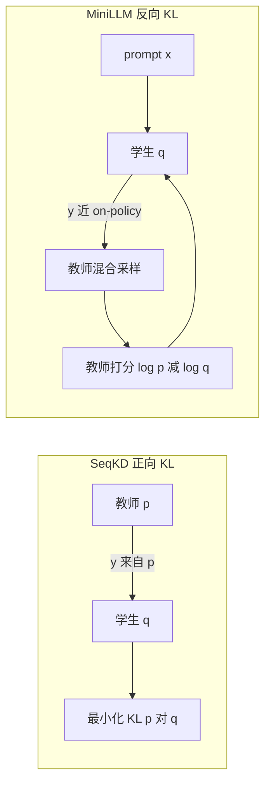

# MiniLLM：白盒蒸馏别让学生去盖教师长尾，改 reverse KL 再 on-policy 学

<!-- release-date: 2023-06-14 -->

**本文依据**：`MiniLLM: On-Policy Distillation of Large Language Models`，arXiv 2306.08543**v6**（[cs.CL] 31 Jan 2026），23 页。作者 Yuxian Gu1,2\*、Li Dong2、Furu Wei2、Minlie Huang1†；1 The CoAI Group, Tsinghua University；2 Microsoft Research。脚注写明第一作者贡献来自 MSR 实习，通讯作者为清华黄民烈。代码、数据与 checkpoint 见 https://github.com/microsoft/LMOps/tree/main/minillm。原件首次公开日取 arXiv **v1** 提交日 **2023-06-14**；解读依据本地已核的 v6（封面标题已改为 On-Policy Distillation，不回写首发日）。文中数字都标 PDF 页码；标「外部补充」的段落不来自本文。

## 一句话

开源 LLM 的输出分布可以拿来做白盒蒸馏，但标准 KD 最小化的是正向 KL（Kullback–Leibler divergence，KL 散度）$KL[p\|q_\theta]$：学生被逼着去覆盖教师分布的所有峰，容量不够时就会把概率堆到教师几乎为零的长尾上，自由生成时吐出教师眼里很差的句子。MiniLLM 改成反向 KL $KL[q_\theta\|p]$，让学生只去占教师的主峰；再用策略梯度把这条目标变成 **on-policy** 优化——用学生自己（混一点教师）采出来的回复算梯度。指令跟随实验里，学生从约 120M 到 13B 都比词级 KD 和序列级 KD 更准、曝光偏差更低、校准更好，长回复更强（PDF p.1–2）。

## 一、矛盾：白盒 LLM 蒸馏不该再套分类 KD

知识蒸馏（Knowledge Distillation，KD）是用大教师带小学生，减轻推理算力（PDF p.2）。两条路：

- **黑盒 KD**：只能看见教师生成的文本，典型做法是拿 ChatGPT 一类 API 的 prompt–response 对去微调小模型。
- **白盒 KD**：还能看见教师的输出分布或中间隐状态。开源 LLM 变多之后，白盒信号更值钱，但当时的白盒 KD 多半做在 **小于 1B、理解型** 的分类模型上；生成式 LLM 的白盒蒸馏几乎没人认真做（PDF p.2）。

条件生成里，模型按 prompt $x\sim p_x$ 写出回复 $y=\{y_t\}_{t=1}^T$。蒸馏被写成：缩小固定教师 $p(y|x)$ 与可训学生 $q_\theta(y|x)$ 的差距（PDF p.3）。

标准 KD（含若干序列级变体）近似最小化 **正向 KL**：

$$
KL[p\|q_\theta]=\mathbb{E}_{x\sim p_x,\,y\sim p'}\log\frac{p(y|x)}{q_\theta(y|x)}
$$

$p'$ 可以是真实数据（词级 KD）或教师分布 $p$（序列级 KD / SeqKD）。脚注说「近似」：词级 KD 的 $y$ 来自真实分布，不是教师；教师足够强时两者可看成差不多（PDF p.3）。

分类任务输出空间是有限类别，教师和学生都只有很少几个峰，正向 KL 好用。开放生成则不然：教师 $p$ 的峰远多于小容量学生能表达的。最小化正向 KL 会逼学生去 **盖住全部峰**，于是把不合理的高概率堆到 $p$ 的空洞区域；自由生成时就会采出在教师看来极不可能的样本（PDF p.2）。

图 2 用玩具实验把这件事画死：用单高斯去拟合高斯混合。正向 KL 会把单峰摊得很宽去盖所有分量；反向 KL 会对准最大那个峰，并把空洞区域压低（PDF p.2 图 2）。

图 3 把两种蒸馏对照起来：SeqKD 强迫学生记住教师采出的全部样本；MiniLLM 用教师反馈去改学生自己生成的文本，叫 On-Policy Distillation（PDF p.3 图 3）。

上图是机制示意，按 PDF p.3 图 3 重画，不是实测曲线。

## 二、设计：反向 KL，再派生 on-policy 梯度

### 目标

$$
\theta=\arg\min_\theta KL[q_\theta\|p]=\arg\min_\theta -\mathbb{E}_{x\sim p_x,\,y\sim q_\theta}\log\frac{p(y|x)}{q_\theta(y|x)}
\tag{1}
$$

生成建模里，最小化反向 KL 会 **寻峰**：学生把质量压在 $p$ 的大峰上，忽略小峰（PDF p.3）。落到文本上：学生不再去学教师分布里太多长尾变体，而把容量花在生成正确性上——作者认为这对要真实、可靠的场景更关键（PDF p.2）。它 **不** 强迫 $q_\theta$ 拟合所有从 $p$ 采出的 $y$，只鼓励学生在自身容量内生成教师更喜欢的样本（PDF p.3）。

附录 A.1 另给一条 IRL（Inverse Reinforcement Learning，逆强化学习）视角：把逐步生成看成 MDP，教师 logits 诱导奖励，最大熵 RL 的目标与最小化反向 KL **近似等价**（PDF p.16–17）。这是同一目标的另一种讲法，不是另一套算法。

### 策略梯度

对式 (1) 用 Policy Gradient 求导（PDF p.3 式 2）：

$$
\nabla L(\theta)=-\mathbb{E}_{x\sim p_x,\,y\sim q_\theta(\cdot|x)}\sum_{t=1}^{T}(R_t-1)\nabla\log q_\theta(y_t|y_{<t},x)
$$

其中 $T=|y|$，$r_{t'}=\log\frac{p(y_{t'}|y_{<t'},x)}{q_\theta(y_{t'}|y_{<t'},x)}$，$R_t=\sum_{t'=t}^{T}r_{t'}$。直觉：回复要在教师下概率高（抬 $p$），同时靠压低 $q_\theta$ 保持多样。期望用蒙特卡洛估计。完整推导在附录 A.2（PDF p.17）。

朴素策略梯度方差大、会 reward hacking，而且 $R_t$ 偏爱短句，学生容易学会空回复（PDF p.3）。于是三条修补。

### 修补一：单步分解，降方差

前段 token 的误差会沿整句累积，单步质量 $r_t$ 对训练方差最关键。把 $\nabla L$ 拆成（PDF p.4 式 3）：

$$
\nabla L(\theta)=(\nabla L)_{\mathrm{Single}}+(\nabla L)_{\mathrm{Long}}
$$

$(\nabla L)_{\mathrm{Single}}$ 里 $\mathbb{E}_{y_t\sim q_\theta(t)}[r_t]$ **对词表直接求和**，不必再对当前步做蒙特卡洛，且对 $\theta$ 可导。这给出更准的单步估计，降方差、加快收敛（PDF p.4）。

### 修补二：教师混合采样，抗 reward hacking

小学生按 $q_\theta$ 采样时，偶尔会吐出教师给高分的退化句（例如重复短语）。每步把教师和学生混在一起采样（PDF p.4 式 4）：

$$
\tilde{p}(y_t|y_{<t},x)=\alpha\cdot p(y_t|y_{<t},x)+(1-\alpha)\cdot q_\theta(y_t|y_{<t},x)
$$

$\alpha$ 控制教师掺入强度。再对 $(\nabla L)_{\mathrm{Single}}$、$(\nabla L)_{\mathrm{Long}}$ 做重要性采样，得到无偏估计；重要性权重 $w_t$ 若按逐步连乘，方差会爆，于是近似成 **当前步** 的 $q_\theta/\tilde{p}$（PDF p.4 式 5）。主实验全程 $\alpha=0.2$（PDF p.5）。

严格说，混合后采样已经不是纯学生 on-policy；论文仍把整条管线叫 on-policy distillation，并靠重要性权重往学生策略上纠。

### 修补三：长度归一化

长序列的 $R_{t+1}$ 往往更小，模型会被推去说短话。对 $R_{t+1}$ 除以剩余长度（PDF p.4 式 6）：

$$
R_{t+1}^{\mathrm{Norm}}=\frac{1}{T-t-1}\sum_{t'=t+1}^{T}\log\frac{p(y_{t'}|y_{<t'},x)}{q_\theta(y_{t'}|y_{<t'},x)}
$$

### 合成梯度

式 (7) 把词表上的单步项、归一化后的长程项、以及重要性权重写在一起（PDF p.4）。算法 1 再加 PPO 式裁剪：$\rho_t(\theta)=q_\theta/\tilde{p}$，对 $\min[\rho_t,\mathrm{clip}(\rho_t,1-\epsilon,1+\epsilon)]$ 求梯度（PDF p.5）。

### 训练算法（两阶段，像 RLHF）

从已在长文档语料 $D_{\mathrm{PT}}$ 上预训练的学生 $q_{\theta_0}$ 出发（PDF p.4–5 算法 1）：

1. 在带金标准回复的条件生成集 $D$ 上监督微调，取 **验证损失最低** 的 checkpoint 当初始化（注意：后面 MiniLLM 阶段改用验证 Rouge-L 选点）。
2. 循环：从 $D$ 抽 prompt，用 $\tilde{p}$ 采回复；从 $D_{\mathrm{PT}}$ 抽一批纯文本；算 $(\nabla L)_{\mathrm{Single}}$、$(\nabla L)_{\mathrm{Long}}^{\mathrm{Norm}}$，再加语言模型损失 $L_{\mathrm{PT}}=-\mathbb{E}_{d\sim D_{\mathrm{PT}}}\log q_\theta(d)$，三者一起更新。

$L_{\mathrm{PT}}$ 用来保住经典 NLP 基准，做法对齐 InstructGPT 一类 RLHF（PDF p.5）。整条 on-policy 管线也明确写成与 RLHF 相似（PDF p.5、p.18）。

## 三、实验设定：指令跟随，不是分类蒸馏

任务是 instruction-following：先把大模型在指令–回复对 $D$ 上微调当教师，再在同一 $D$ 上比较各 KD，看学生跟指令的能力（PDF p.5）。

**模型族**（PDF p.5）：

| 族 | 学生 | 教师 |
|---|---|---|
| GPT-2 | 120M、340M、760M | GPT-2-1.5B |
| OPT | 1.3B、2.7B、6.7B | OPT-13B |
| LLaMA | 7B | LLaMA-13B |

图 1 中间栏另用 GPT-J 6B 当教师、学生为 GPT-2 760M / 1.5B 与 GPT-Neo 2.7B；附录 C.1 给表。封面图左栏学生写成 125M，正文表写 120M，论文两处口径不完全统一（PDF p.1 图 1、p.6 表 1）。

**数据**（PDF p.5）：databricks-dolly-15K，约 15K 人写指令–回复。滤掉超上下文的样本，随机切 1K 验证、0.5K 测试，训练约 12.5K。$D_{\mathrm{PT}}$：GPT-2 族用 OpenWebText，其余用 RoBERTa 训练语料。超参用验证集 Rouge-L 搜，因为作者认为它比验证损失更贴人偏好。

**评测集**（PDF p.5–6）：

- DollyEval：从 Dolly 切出的 500 条测试。
- SelfInst：252 条偏用户向的指令。
- VicunaEval：Vicuna 评测用的 80 道难题。
- S-NI：SUPER-NATURALINSTRUCTIONS 测试集约 9K、119 个任务；按金标准回复长度切 $[0,5]$、$[6,10]$、$[11,+\infty]$。主表用最长子集，3.3 节看全部分桶。
- UnNI：从 Unnatural Instructions 核心集随机抽 10K；主表同样先看 $[11,+\infty]$。

**指标**：Rouge-L（R-L）；GPT-4 把模型回复与金标准（VicunaEval 的金标准改用 ChatGPT 生成）各打 1–10 分，报模型总分 / 金标准总分，只用于 Dolly / SelfInst / Vicuna；SelfInst 上对人评 Win / Tie / Loss。全部测试集温度 $=1$，每条 prompt 5 个随机种子取平均（PDF p.6）。

**基线**：SFT w/o KD（只看金标准）；词级 KD（每步用教师分布监督）；SeqKD（在教师生成文本上微调）（PDF p.6）。

附录 B.1：小于 1.3B 的基线搜学习率 $\{5\times10^{-4},10^{-4},5\times10^{-5}\}$、batch $\{32,64\}$、训 20 epoch；更大模型学习率 $\{5\times10^{-5},10^{-5},5\times10^{-6}\}$、10 epoch。KD 把蒸馏损失与金标准 LM 损失按 0.5 混合。MiniLLM 第一阶段 3 epoch，学习率与 batch 取对应 SFT 最优，但选 **最低验证损失**；第二阶段一律学习率 $5\times10^{-6}$、mini-batch 64，一次收集 256 句、策略优化内循环 4 epoch，裁剪 $\epsilon=0.2$，最大长度 512，学生采样温度 1，训 5000 step，用验证 Rouge-L 选点。LLaMA-7B 从 13B 蒸馏：16 张 V100 32G，少于 10 小时（原文写 ours）（PDF p.18）。

## 四、主结果：几乎处处赢，有时学生 Rouge 超过教师

表 1（PDF p.7）三族模型、五套评测。作者三条观察：

1. MiniLLM 在几乎所有设定上超过三条基线；在 Dolly 以外的集合上优势更大，作者据此说 OOD 更好。
2. Rouge-L 说明回复与金标准重叠更高。Vicuna、S-NI、UnNI 上，学生有时 **超过教师** 的 Rouge-L（表中 \*）。作者猜测教师在 $D$ 上 teacher-forcing 微调带来训练–推理落差（曝光偏差）；MiniLLM 训练时从学生采样，减轻这件事。
3. 从约 120M 到 13B、三族模型，增益方向一致，对应图 1（PDF p.1、p.6）。

摘若干对照（GPT4 / R-L；出处均表 1，PDF p.7）：

| 学生 | 方法 | Dolly GPT4 | Dolly R-L | SelfInst GPT4 | Vicuna GPT4 |
|---|---|---:|---:|---:|---:|
| GPT-2 120M | SeqKD | 41.2 | 22.7 | 26.2 | 31.0 |
| GPT-2 120M | MiniLLM | 44.7 | 24.6 | 29.2 | 34.1 |
| OPT 1.3B | SeqKD | 51.0 | 26.1 | 36.6 | 42.6 |
| OPT 1.3B | MiniLLM | 60.7 | 26.7 | 47.0 | 50.6 |
| LLaMA-7B | SeqKD | 73.6 | 27.5 | 71.5 | 62.6 |
| LLaMA-7B | MiniLLM | 76.4 | 29.0 | 73.1 | 64.1 |
| LLaMA-13B | 教师 | 79.0 | 29.7 | 75.5 | 65.1 |

LLaMA-7B MiniLLM 在 UnNI R-L 到 40.2，超过教师 38.5（表中 \*）。OPT-6.7B MiniLLM 的 Dolly GPT4 70.8 也标了超过教师 70.3。

人评：LLaMA-7B 学生、13B 教师，SelfInst 上 MiniLLM 优于全部基线，与教师相当（PDF p.6 图 4）。人评细节：随机 50 条 prompt，双盲比两条回复（PDF p.19）。

GPT-J-6B 当教师的附录表 6 方向相同：多数格子 MiniLLM 最好；例如 GPT-Neo-2.7B 的 Dolly GPT4 从 SeqKD 60.8 到 63.4，SelfInst GPT4 从 47.2 到 52.5（PDF p.21）。

## 五、分析：教师越大越好、曝光偏差、校准、长度、多样性

**教师缩放。** 前人有过「教师变大，学生不一定更好」。固定 GPT-2-125M 学生，教师 340M / 760M / 1.5B：MiniLLM 一直压过 SeqKD，且学生表现与教师规模正相关（PDF p.7 图 5）。OPT 族固定 1.3B 学生、教师 2.7B / 6.7B / 13B，附录图 14 同样（PDF p.21；图注把学生写成 OPT-1.3M，与正文 1.3B 不一致，按正文理解）。

**曝光偏差。** 用 ExAccErr（附录 B.5 式 30–32）量因训练–解码不一致而多出来的累积误差。设定：GPT-2-125M 学生、GPT-2-1.5B 教师、Dolly 测试，每条 prompt 采 10 条回复。基线的 ExAccErr 随生成长度持续涨；MiniLLM 低得多，且在长生成（$>150$ token）后不再累积（PDF p.8 图 6）。

**校准。** 政策优化模型常被说校准差。LLaMA-7B 上用零样本分类指令，取标签词概率算 ECE，数据集 SST2 与 BoolQ（PDF p.8 表 2）：

| 模型 | SST2 ECE / Acc. | BoolQ ECE / Acc. |
|---|---|---|
| 教师 | 0.025 / 93.0 | 0.356 / 74.5 |
| KD | 0.191 / 84.7 | 0.682 / 63.5 |
| SeqKD | 0.243 / 66.5 | 0.681 / 62.8 |
| MiniLLM | 0.099 / 89.7 | 0.502 / 67.8 |

KD / SeqKD 校准明显差于教师；MiniLLM 把与教师的 ECE 差距收窄。作者怀疑正向 KL 把高质量概率推进教师空洞，拉大分布差；反向 KL 对准主峰。

**金标准长度分桶。** 图 7：相对 SFT 的 Rouge-L，S-NI 三档。短回复（$\le5$ token）所有方法都低——训练集约是长句，存在分布偏移；短输出空间小，学生盖得住教师多数峰，正反向 KL 差不多。金标准 $\ge6$ token 时教师峰更多，MiniLLM 优势出现（PDF p.8）。UnNI 附录图 15 同趋势（PDF p.21）。

**多样性。** 反向 KL 可能丢峰。作者分三件事：给定 prompt 能否多样回复；语言复杂度；对真实数据的覆盖。第 (i) 条他们主张：很多 NLP 应用一条正确回复就够。第 (ii)(iii) 用 distinct 4-gram 比例 Dist-4 与测试集 LM loss（本质是对真实数据的正向 KL）（PDF p.9 表 3，LLaMA 族）：

| 模型 | Dolly Dist-4 / Loss | SelfInst Dist-4 / Loss |
|---|---|---|
| 教师 | 99.3 / 3.55 | 99.1 / 4.44 |
| SFT | 99.5 / 3.89 | 99.0 / 5.28 |
| MiniLLM | 99.0 / 3.95 | 98.6 / 5.33 |

结论：4-gram 比例和测试 LM loss 基本保住。附录表 5 给出 Dolly 上五种子的原始 $N/C$（PDF p.21）。

## 六、消融：三条修补各自挡住什么

GPT-2-125M 从 GPT-2-1.5B 蒸馏（PDF p.9 表 4）：

| 变体 | 验证 R-L | Dolly R-L |
|---|---:|---:|
| MiniLLM 全套 | 27.4 | 24.6 |
| 去掉长度归一化 | 17.4 | 14.7 |
| 去掉教师混合 | 22.3 | 20.4 |
| 去掉单步分解 | 27.0 | 23.7 |

教师混合与长度归一化对 **稳住训练** 最关键：没有它们，反向 KL 曲线仍可下降，但模型很快学会重复、过短、无意义、却在教师分布里概率很高的字符串（reward hacking）；附录 D 有例子。单步分解主要降训练方差，验证/测试分也略高。图 8 画训练中学生与教师的反向 KL，曲线按 32 step 平滑（PDF p.9）。

$\alpha$ 扫描（附录图 16）：GPT-2-125M / OPT-1.3B / LLaMA-7B，$\alpha=0$ 纯学生采样，$\alpha=1$ 纯教师。$\alpha=0.2$ 跨族可用；更大模型对 $\alpha$ 更不敏感（PDF p.22）。

去掉 $L_{\mathrm{PT}}$（表 7）：OPT-1.3B 上 CLS（SST2+BoolQ 平均准确率）70.2 → 65.7，指令 Rouge-L 平均 52.8 → 53.2；LLaMA-7B 上 CLS 78.8 → 74.3，指令 71.2 → 71.1。预训练损失保住分类能力，指令跟随几乎不动（PDF p.22）。

附录表 8 的 SelfInst 例子：无教师混合时，模型输出极短（「We to know」）或几乎复读输入（PDF p.23）。

## 七、论文写清的边界，以及它没写的

- **白盒假设**：学生必须能拿到教师逐步分布（或至少逐步 logprob），不是 API 黑盒蒸馏（PDF p.2）。
- **容量故事**：反向 KL 的动机就是学生盖不住教师全部峰；短回复、输出空间小时，正反向差别变小（PDF p.8）。
- **优化不稳**：纯学生采样会 reward hacking；长度项会鼓励空回复。三条修补是工程必要，不是装饰（PDF p.3–4、p.9）。
- **多样性取舍**：作者承认反向 KL 可能丢峰，但把「一条正确回复」放在「多样但不准」之上（PDF p.9）。Dist-4 接近不代表语义多样。
- **评测**：主指标含 GPT-4 打分与 50 条人评；温度 1、5 种子。没有报告吞吐、显存墙钟（除 LLaMA 蒸馏少于 10 小时）、也没有系统消融「不用 $L_{\mathrm{PT}}$ 时经典基准全集」。
- **没有 Limitations 专节**。Concurrent 只点到 GKD（arXiv 2306.13649）和另一篇 f-divergence 序列蒸馏（PDF p.10），没有讨论后来的 On-Policy Distillation / Rethinking-OPD / GOPD——那些不是这篇 v6 的内容，不要读成本文贡献。

v6 把标题改成 On-Policy Distillation，方法主体仍是 2023 年那套反向 KL + 策略梯度；不要用 2026 年别人的 on-policy 蒸馏综述来改写这篇的主张。

## 八、可迁移的几条

1. **生成蒸馏先问 KL 方向。** 分类 KD 的正向 KL 在开放生成里会逼学生盖长尾；学生明显更瘦时，寻峰的反向 KL 更合理。
2. **目标能写成 $y\sim q$ 的期望，就按 on-policy 做。** 用教师文本做 SeqKD 是 off-policy 模仿；学生自由生成时见过自己的前缀，曝光偏差才会下来。
3. **奖励是 $\log p-\log q$ 时，短句和复读是默认失败模式。** 长度归一化、教师混合采样、单步词表求和、PPO 裁剪，是同一类 RL 蒸馏都要准备的开关。
4. **教师越大不一定害学生。** 至少在这篇的 MiniLLM 设定里，固定学生、放大教师，曲线是往上的；SeqKD 没有同样干净的缩放。
5. **留一条预训练 LM 损失。** 指令分数可以不动，分类准确率会掉几个点——和 RLHF 里加 pretrain mix 是同一类经验。

## 关键词回看

**白盒 KD / 黑盒 KD**；**正向 KL**（mode-covering）对 **反向 KL**（mode-seeking）；**词级 KD** 与 **SeqKD**；**on-policy distillation**（学生轨迹 + 教师反馈）；**教师混合采样** $\tilde{p}=\alpha p+(1-\alpha)q$；**单步分解** 与 **长度归一化**；**曝光偏差 / ExAccErr**；**ECE 校准**。

## 参考资料

- 论文：arXiv [2306.08543](https://arxiv.org/abs/2306.08543)
- 代码：https://github.com/microsoft/LMOps/tree/main/minillm
- Dolly 数据：https://github.com/databrickslabs/dolly/tree/master（论文脚注 4）
