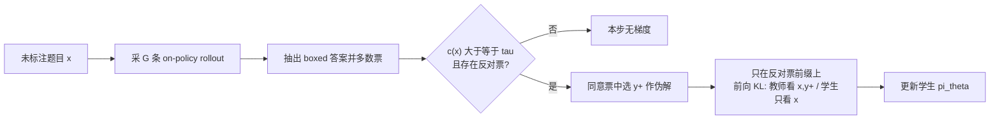

# On-Policy Self-Distillation:没有标准答案时，模型怎么给自己当老师

<!-- release-date: 2026-08-06 -->

**本文依据**:`On-Policy Self-Distillation without Any Supervision`，arXiv 2608.06296**v2**（[cs.LG] 9 Aug 2026），17 页。作者 Yijiang Li、Nuno Vasconcelos（UC San Diego）；Bingyang Wang（Georgia Tech）；Yijun Liang（UMD）；Yunjie Tian、Di Fu（ByteDance）。代码 [williamium3000/u-opsd](https://github.com/williamium3000/u-opsd)。**原件首次公开日取 arXiv v1 提交日 2026-08-06**；解读依据 v2，不换回 v1。页码均指这份 PDF。文中所有数字都标了 PDF 页码；标「外部补充」的段落不来自本文。

## 一句话

所谓「自蒸馏」，往往只是师生共用一套权重；让教师比学生强的那份信息，仍然来自标准答案、环境反馈或更大的模型。U-OPSD（unsupervised on-policy self-distillation，无监督同策略自蒸馏）把这份特权上下文换成模型自己的多数票：对同一道题采多条 rollout，票数过阈值才造伪解，再只在**投了反对票的 completion** 上做 token 级蒸馏。五个数学竞赛基准上，Qwen3 4B/8B 的 non-thinking 相对基座平均涨 8.5 与 10.7 个百分点，并超过带标准答案的 OPSD；thinking 模式则与 OPSD 持平、略超 GRPO（PDF p.1）。

## 一、矛盾：同策略蒸馏为什么还不是「自」蒸馏

后训练把 LLM 的推理往上推，常见三条路：监督微调（SFT）、更强教师的知识蒸馏、可验证奖励的强化学习（RLVR）。同策略蒸馏（on-policy distillation，OPD）夹在 SFT 与 RL 中间：训练数据是学生自己生成的轨迹，既降低教师强迫式 SFT 的训推不一致与灾难性遗忘，又保留 token 级稠密监督，而不是一条轨迹一个标量奖励（PDF p.2）。

后续工作在目标函数、监督来源和系统开销上修 OPD，但教师仍然是另一套更强的模型。OPSD（on-policy self-distillation，同策略自蒸馏）再走一步：师生是同一套网络，教师看到题目加标准答案 $y^\star$，学生只看到题目（PDF p.2）。参数共享了，特权信息却没有：教师之所以更会做，是因为外面塞进了标准答案、演示或环境反馈。

这带来两个硬限制。没有标签的题目用不上；标签贵、不可靠或根本没有的领域也用不上。论文因此问：教师是否必须看见标准答案？模型能不能自己造特权上下文，做真正的自蒸馏？（PDF p.2）

## 二、旧方案各卡在哪

论文把对照方法收成同一套记号（PDF p.3–4）。

**GRPO**（Group Relative Policy Optimization，组相对策略优化）对每道题采 $G$ 条 rollout，用「最终答案是否等于金标」给 0/1 奖励，组内标准化成优势，再对重要性比做 clip。监督是金标答案 $a^\star$，信号是序列级的；组内奖励全相同则优势为零，梯度消失（PDF p.4 式 2）。

**OPD** 仍用学生自己的 rollout 当轨迹，但把标量奖励换成教师下一 token 分布的散度。学生条件只有题目 $x$（与推理时一致），教师可以拿到更富的上下文 $c$。监督稠密，但必须有一个已经强过学生的外部教师（PDF p.4 式 3）。

**OPSD** 去掉外部教师，师生来自同一网络的不同条件：

$$
\pi_S(\cdot \mid x) \triangleq \pi_\theta(\cdot \mid x),\qquad \pi_T(\cdot \mid x, y^\star) \triangleq \bar{\pi}(\cdot \mid x, y^\star)
$$

$\bar{\pi}$ 是停梯度的当前策略副本。损失是学生轨迹每个前缀上，教师分布对学生分布的 $D_\beta$（默认 $\beta=0$，即前向 KL，教师 $\to$ 学生），并做逐 token 点式 clip（PDF p.4–5 式 4）。教师看见 $y^\star$，所以它在学生走过的每个位置上都在回答：「已经知道答案的模型会怎么走下一步」。匹配这份分布，等于把「看见答案后的行为」蒸馏进「看不见答案的策略」。师生共参，仍要 $y^\star$。

图 1 把 OPSD/SDFT（需要标注或 ICL）、SDPO（需要环境反馈）和 U-OPSD 并排放：前两者的教师侧都接外部信号，U-OPSD 的教师侧只接多数票伪标签（PDF p.4 图 1）。

## 三、U-OPSD：多数票造伪解，只在不一致处蒸馏

关键观察：单条 rollout 不可靠，多条独立 rollout 的一致程度却是模型内部的置信信号。教师参考与学生轨迹都可以从同策略样本里长出来，不必外挂标签（PDF p.2）。

对未标注题目 $x \sim \mathcal{U}$，从停梯度策略采 $G$ 条独立 rollout，抽出规范化后的最终答案 $a^{(g)}=\mathrm{Ans}(y^{(g)})$。多数票得到伪答案 $\tilde{a}(x)$。同意票集合 $\mathcal{Y}_x^+$、反对票集合 $\mathcal{Y}_x^-$。自一致分数

$$
c(x)=\frac{1}{G}\sum_{g=1}^{G}\mathbf{1}[a^{(g)}=\tilde{a}(x)]
$$

用总采样数 $G$ 做分母，截断（抽不出答案、记为 $\emptyset$）会拉低置信；无效 rollout 既不算对也不算错（PDF p.5）。$c(x)<\tau$ 则本步不算梯度。默认 $\tau=1/2$，即绝对多数（PDF p.5）。

过阈值后：选一条同意票 $y^+$ 当伪解（引言里写选最长，实验也以最长为默认），反对票子集当蒸馏目标。教师条件是 $(x,y^+)$，学生条件仍只有 $(x)$ 加反对票前缀。损失只在反对票的每个 token 上对齐下一 token 分布（PDF p.2 式 1、p.6 式 5、算法 1）。

跳过两类样本：票不够自信（伪答案不可信），以及有效 rollout 已经全同意（没有可纠正的分歧）。训练因此自动落在能力边界：模型已经能稳定投出某个答案，但仍给冲突轨迹分配了可观概率。这份课程表来自投票统计，不需要外部难度标签（PDF p.6）。

和「多数票自训练」的差别在这里：不是在教师强迫前缀上模仿那条赢的回复，而是把「看见伪解之后的下一 token 分布」沿着**自己投反对票的轨迹**灌回去。纠正发生在「正把模型带向与共识不一致的答案」的那些前缀上（PDF p.6）。

机制示意图，根据 PDF p.5 图 2 与算法 1 重画，不是实测曲线。

## 四、实验怎么设

模型：Qwen3-4B、Qwen3-8B（各跑 non-thinking 与 thinking）、Qwen3-4B-Instruct-2507、Qwen3-30B-A3B-Instruct-2507。同一 checkpoint 既当学生也当教师（PDF p.6）。

训练题：OpenThoughts 的 30k 子集，跟 OPSD 同一批；U-OPSD **只用题面，不用解答字段**。对照是同一批 prompt 上的带标方法：SFT（金标解答）、GRPO（相对金标的 0/1 结果奖励）、OPSD（教师条件是金标解答）。文中 OPSD 数字是作者用发布代码与超参自行重跑、与 U-OPSD 对齐条件后的结果（PDF p.6）。无标对照还有 TTRL、RENT、Intuitor，rollout 预算与 prompt 集与 U-OPSD 相同（PDF p.6）。

评测：AIME24、AIME25、HMMT25 用 avg@12；MATH500、AMC23 用 avg@4。解码跟 OPSD：vLLM、温度 1.0、最大生成长度 38k，评测模式与训练时的推理模式一致（PDF p.6）。U-OPSD 与 OPSD 每 25 步评一次、最多 150 步，报最佳；GRPO 报 500 步内峰值；SFT 训练样本量与 OPSD 相同（PDF p.6）。

实现大多沿用 OPSD：前向 KL（$\beta=0$）全词表、逐 token 点式 clip；教师固定在**初始策略**（公平对照，Zhao et al. 的消融支持这两项）。LoRA rank 64（$\alpha=128$）打在全部注意力与 MLP 投影，学习率 $5\times 10^{-6}$，梯度范数 clip 0.1，采样温度 1.1、top-p 0.95、top-k 20，150 步、每 25 步存盘（PDF p.6）。

U-OPSD 独有两项：每题 $G=8$ 条独立 rollout，$\tau=0.5$（除非另行声明）；监督 OPSD 则是每优化步从 32 道题各抽 **1** 条。最大 completion 从 1024 提到 4096 token，因为必须生成 boxed 最终答案；Zhao et al. 报告这两种预算在其设定下成绩相当（PDF p.6）。thinking 实验：教师保持 thinking，把行为蒸馏进 **non-thinking 学生**，评测仍用 thinking；non-thinking 实验师生与评测都是 non-thinking（PDF p.6）。

## 五、主结果：无标能否追上带 GT 的 OPSD / GRPO

### Non-thinking（表 1，PDF p.7）

| 模型 | 方法 | AIME24 | AIME25 | HMMT25 | MATH500 | AMC23 | Avg. |
|---|---|---:|---:|---:|---:|---:|---:|
| Qwen3-4B | Base | 25.83 | 17.78 | 10.83 | 84.10 | 66.25 | 40.96 |
| | + SFT（有 GT） | 26.67 | 19.72 | 13.06 | 84.85 | 69.38 | 42.73 |
| | + GRPO（有 GT） | 25.00 | 22.50 | 15.00 | 86.20 | 80.62 | 45.86 |
| | + OPSD（有 GT） | 32.22 | 20.83 | 16.39 | 85.75 | 76.25 | 46.29 |
| | + TTRL | 25.00 | 20.83 | 11.94 | 83.60 | 67.50 | 41.77 |
| | + RENT | 22.22 | 20.28 | 11.39 | 84.00 | 74.38 | 42.45 |
| | + Intuitor | 23.89 | 20.00 | 11.67 | 83.70 | 70.62 | 41.98 |
| | + U-OPSD | 37.50 | 27.78 | 14.44 | 86.50 | 81.25 | 49.49 |
| Qwen3-8B | Base | 27.50 | 23.33 | 13.61 | 84.05 | 69.38 | 43.57 |
| | + SFT（有 GT） | 26.94 | 21.67 | 11.94 | 84.10 | 72.50 | 43.43 |
| | + GRPO（有 GT） | 30.56 | 21.94 | 13.06 | 87.85 | 73.75 | 45.43 |
| | + OPSD（有 GT） | 41.67 | 28.06 | 18.33 | 87.15 | 85.00 | 52.04 |
| | + TTRL | 27.22 | 21.11 | 13.06 | 84.45 | 71.88 | 43.54 |
| | + RENT | 28.33 | 21.67 | 10.83 | 84.00 | 70.00 | 42.97 |
| | + Intuitor | 26.11 | 22.50 | 11.67 | 84.20 | 73.12 | 43.52 |
| | + U-OPSD | 45.56 | 34.72 | 18.61 | 89.55 | 83.12 | 54.31 |

U-OPSD 平均 49.49 / 54.31，相对基座 +8.5 / +10.7 个百分点；相对 OPSD +3.2 / +2.3。两个规模上都在五个基准里的四个拿最高。无标 RL 基线最多只比基座高约 1.5 个百分点（同一 rollout 预算）。共识当特权教师上下文做 token 蒸馏，比把共识压成标量奖励有效得多（PDF p.7）。引言还汇总：相对 SFT / GRPO / 带 GT 的 OPSD，最大增益分别到 10.9、8.9、3.2 个百分点（PDF p.2；10.9 与 8.9 对应 8B non-thinking 对 SFT、GRPO 的平均差）。

4B 上 HMMT25 仍是带 GT 的 OPSD 更高（16.39 vs 14.44）；8B 上 AMC23 也是 OPSD 更高（85.00 vs 83.12）。「四个基准最优」这句话要连这两处例外一起记（PDF p.7 表 1）。

### Thinking（表 2，PDF p.8）

| 模型 | 方法 | AIME24 | AIME25 | HMMT25 | MATH500 | AMC23 | Avg. |
|---|---|---:|---:|---:|---:|---:|---:|
| Qwen3-4B | Base | 74.17 | 64.72 | 45.56 | 94.80 | 95.00 | 74.85 |
| | + SFT | 73.06 | 69.17 | 41.67 | 95.40 | 94.38 | 74.73 |
| | + GRPO | 73.89 | 69.44 | 43.61 | 95.45 | 99.38 | 76.35 |
| | + OPSD | 75.28 | 68.06 | 43.06 | 95.20 | 99.38 | 76.20 |
| | + TTRL | 72.78 | 68.33 | 45.56 | 95.90 | 96.25 | 75.76 |
| | + RENT | 74.72 | 65.83 | 43.06 | 95.25 | 99.38 | 75.65 |
| | + Intuitor | 76.39 | 68.33 | 42.78 | 95.35 | 97.50 | 76.07 |
| | + U-OPSD | 76.39 | 68.06 | 46.94 | 95.75 | 98.12 | 77.05 |
| Qwen3-8B | Base | 75.56 | 66.67 | 45.00 | 96.35 | 96.88 | 76.09 |
| | + SFT | 76.39 | 69.72 | 43.89 | 95.80 | 95.00 | 76.16 |
| | + GRPO | 76.94 | 69.17 | 47.78 | 95.70 | 95.00 | 76.92 |
| | + OPSD | 80.83 | 69.72 | 46.67 | 95.75 | 96.88 | 77.97 |
| | + TTRL | 77.22 | 68.61 | 46.94 | 95.75 | 96.25 | 76.95 |
| | + RENT | 77.50 | 70.28 | 45.83 | 95.95 | 96.25 | 77.16 |
| | + Intuitor | 76.94 | 70.28 | 44.17 | 96.20 | 95.62 | 76.64 |
| | + U-OPSD | 76.94 | 71.39 | 47.50 | 96.00 | 98.12 | 77.99 |

U-OPSD 平均 77.05 / 77.99，相对基座 +2.2 / +1.9 个百分点；相对 OPSD 4B 超 0.9、8B 持平（77.99 vs 77.97）；相对 GRPO +0.7 / +1.1（PDF p.1、p.8）。涨幅明显小于 non-thinking。作者解释：共识自蒸馏最有效的区间，是基座已经够稳、能投出有信息量的票，同时又还有改进空间；thinking 基座已经很强，余地更小（PDF p.8）。限制一节补了一条机制：thinking rollout 长得多，150 步预算按 token 计能完成的有效投票更少（PDF p.11）。

8B thinking 的 AIME24，带 GT 的 OPSD 是 80.83，U-OPSD 只有 76.94，平均持平靠的是其他基准补回来（PDF p.8 表 2）。

### Instruct 模型（表 3，PDF p.8）

| 模型 | 方法 | AIME24 | AIME25 | HMMT25 | MATH500 | AMC23 | Avg. |
|---|---|---:|---:|---:|---:|---:|---:|
| Qwen3-30B-A3B-Instruct-2507 | Base | 80.00 | 63.33 | 43.33 | 96.33 | 95.83 | 75.77 |
| | OPSD | 78.89 | 61.11 | 47.78 | 97.20 | 96.67 | 76.33 |
| | U-OPSD | 75.56 | 65.56 | 50.00 | 97.00 | 99.17 | 77.46 |
| Qwen3-4B-Instruct-2507 | Base | 66.67 | 53.33 | 27.78 | 93.87 | 93.33 | 67.00 |
| | OPSD | 62.22 | 52.22 | 31.11 | 94.93 | 95.00 | 67.10 |
| | U-OPSD | 68.89 | 57.78 | 28.89 | 94.20 | 94.17 | 68.78 |

U-OPSD 把 30B-A3B-Instruct 从 75.77 拉到 77.46，4B-Instruct 从 67.00 拉到 68.78，平均都最高，相对 OPSD +1.1 / +1.7 个百分点。4B-Instruct 上 OPSD 在 HMMT25、MATH500、AMC23 仍领先。30B-A3B 这一行说明同一套 recipe 能迁到更大的 MoE，文中未做模型专用超参搜索（PDF p.8）。引言把 Instruct 相对基座的增益写成 1.7–1.8 个百分点（PDF p.2）。

训练曲线（图 3，Qwen3-4B）：thinking 侧各方法都贴着基座约 2 个百分点以内，MATH500 整块跨度不到 1%，名次随 checkpoint 跳动；non-thinking 侧 U-OPSD 在 AIME24/25 的每个 checkpoint 都压过监督与无标基线，MATH500 到第 100 步其他方法才追上同一水平（PDF p.8 图 3）。

## 六、消融：伪标签质量、只蒸馏反对票、以及散度怎么算

**伪标签质量。** 64 道训练题、完整训练配置（$G=8$，4096 token，$\tau=0.5$）：96.3% 的 rollout 能抽出 boxed 答案；94.0% 的题过阈值拿到伪标签；其中 86.7% 与数据源金标一致（金标只用于事后核对，不进 U-OPSD 训练）。不到 10% 的有效 rollout 与该题投票不一致，蒸馏集合小而集中（PDF p.9）。限制节把错误伪标签写成 13.3%（与 86.7% 正确互为补，PDF p.11）。

**阈值 $\tau$。** 图 4 左（Qwen3-8B non-thinking，五基准平均）：越松越好。$\tau=0.3$ 最佳 58.59，默认 0.5 为 57.10，$\tau=0.9$ 掉到 44.40，跨度 14.2 个百分点。默认 $\tau=0.5$ **不是**这组扫描的最优（PDF p.9 图 4）。

**每题 rollout 数 $G$。** 采样成本随 $G$ 线性涨。$G=4$ 与 $G=8$ 在最佳 checkpoint 几乎难分（56.99 vs 57.10）；$G=12$ 相对默认再涨 4.7 个百分点；$G=16$ 又吐回一半。正文仍用 $G=8$，因为它是 OPSD 自己的生成预算，表 1/2 才成本对齐；生成不是瓶颈时作者认为 $G=12$ 更好（PDF p.9）。

**教师是否跟着学生走。** 默认冻结在初始策略：LoRA 设定下等于关 adapter、用基座权重打分。图 4 右：EMA 衰减 0.995 相对冻结默认，最佳 checkpoint +2.4、第 150 步 +4.1 个百分点；另外两个更快衰减在第 150 步彼此相差 0.2 个百分点以内（PDF p.9–10）。主表为了跟 OPSD 对齐，没有改用 EMA。

**教师看哪条、蒸馏哪条。** 图 5 交叉「同意票里条件哪一条」与「反对票里蒸馏哪一条」，两轴都偏向最长。九个完整参考设定里有七个距最佳平均不超过 2.1 个百分点；随机反对票作为蒸馏目标更弱（列均值 56.03，最长 58.02）。最佳 59.00：教师条件最长同意票，蒸馏最长反对票。若把教师参考剥成只剩 boxed 伪标签，掉 10.3–15.8 个百分点，三种 label-only 全部低于基座 43.57。有效蒸馏需要教师看见完整推理轨迹，而不是只看见最终答案（PDF p.10 图 5）。

**散度计算。** 全词表 logit 蒸馏（默认）vs 只在学生采样到的那个 token 上算（再当策略梯度优势）：后者平均 43.45，全词表 57.10，学生 token 变体低于默认 13.7、低于最佳设定 15.6 个百分点，伪标签监督下没有竞争力。把散度截到教师 top-$k$：top-100 平均 59.01，高于全词表 57.10；五个基准的最佳大多落在 top-100。全词表平均一项都不超过 top-100，AIME24 打平。top-$k$ 是降低散度计算成本的实用折中（PDF p.10 表 4）。

**$D_\beta$ 选哪一种。** 前向 KL（$\beta=0$）平均 57.10；对称 JSD（$\beta=0.5$）43.34，与未训练基座持平（相对前向 KL 掉 13.8 个百分点）；反向 KL（$\beta=1$）训练发散、不打分。反向 KL 的崩溃是单向变长：生成平均 2.7k 字符（第 25 步）→ 12k（50）→ 76k（75）→ 第 125 步起顶满 99k token 上限；能抽出 boxed 答案的比例从 99% 掉到 33%。完成文本是终止能力丢失（短语、LaTeX 命令对、括号套到预算耗尽），不是连贯推理（PDF p.11 表 5）。

相对带金标的 OPSD，全分布目标的优势在伪标签下更宽：AIME25 / HMMT25 分别领先学生 token 变体 17.8 / 7.2 个百分点，金标监督下对应差距是 2.0 / 2.7（PDF p.10–11）。

## 七、限制与未公开

论文自己划了四条（PDF p.11）。

1. **范围。** 只做了 Qwen3 一族（4B/8B 两种推理模式，外加两个 Instruct），领域只有竞赛数学、答案可自动核对。投票依赖可抽取、可规范化的最终答案；开放生成要换成更软的共识，本文没做。
2. **增益随体制变。** 相对 OPSD：non-thinking 4B/8B 超 3.2 / 2.3 个百分点，thinking 超 0.9 / 0.02。相对基座从 8.5 / 10.7 缩到 2.2 / 1.9。thinking 基座平均已是 74.9 与 76.1。读者应把共识当成 non-thinking 里金标的**更强替代**、thinking 里的**持平替代**，而不是对 OPSD 的均匀改进。
3. **受基座能力上界约束。** 多数票复制的是基座已经最常给出的答案。域内错误伪标签 13.3%；没有测量「故意污染投票」时的训练动态。按票差降权等机制被写成下一步，本文没做。
4. **方差。** 每个 checkpoint 用 12 个样本、五个基准来压方差，但「每种训练设定的多种子误差条」标明 pending，等修订版。

另外，主结果用冻结教师、$G=8$、$\tau=0.5$、全词表前向 KL；消融里更好的点（更松的 $\tau$、$G=12$、EMA 0.995、top-100）**没有**回填进表 1–3。thinking 把 thinking 教师蒸馏进 non-thinking 学生再 thinking 评测，这一不对称在 OPSD 设定里沿用，本文没有单独消融「师生同为 thinking」。

## 八、可迁移的几条

**① 真正缺的往往不是金标，而是把「自己跟自己打架」的位置暴露出来的机器。** 在「会投票、还有改错空间」这个区间，约束从「有没有标准答案」挪到「有没有反对票可蒸馏」。无标题目、标签贵的域，优先想的应是如何从同策略样本里长出特权上下文，而不是先去找更大的教师。

**② 共识适合当教师条件，不适合只当标量奖励。** 同一批 rollout、同一套投票，TTRL/RENT/Intuitor 几乎贴着基座，U-OPSD 在 non-thinking 能拉开 7.0–11.3 个百分点（PDF p.2）。稠密下一 token 监督落在分歧前缀上，比给整条轨迹一个分数更对症。

**③ 只蒸馏反对票，等于把计算花在能力边界。** 全同意的题没有可纠正的分歧；票不够的题伪标签不可信。跳过这两类，比「对所有自生成数据做 SFT」更省，也更不容易在高置信错误上互相强化——前提是基座投票已经大体对（86.7% 伪标签正确，PDF p.9）。

**④ 教师必须看见推理过程。** 只条件 boxed 答案会掉到基座以下。选最长同意票当 $y^+$，是在用长度当「更完整的过程」的粗糙代理，不是神秘超参。

**⑤ 前向 KL 在伪标签下更脆也更必要。** 反向 KL 会把生成拉到 token 天花板并失去终止；JSD 退回基座。伪标签噪声比金标大，目标函数选错的代价也更大。

## 读完该留下的判断

- **被实验支持的**：无外部监督时，多数票伪解 + 只在反对票上做同策略自蒸馏，能在 Qwen3 4B/8B non-thinking 超过带 GT 的 SFT、GRPO、OPSD；thinking 与 OPSD 持平、略超 GRPO；同一 recipe 迁到 4B-Instruct 与 30B-A3B-Instruct 平均仍最高。教师需要完整轨迹、前向 KL、只蒸馏分歧，这几条有消融数字。
- **是作者观察而非均匀定律的**：共识替代金标主要成立在 non-thinking；thinking 的「持平」不能外推成「无标一定更强」。$\tau$ 越松越好、EMA 优于冻结、top-100 优于全词表，都是 8B non-thinking 上的扫描，主表没有采用。
- **没有公开的**：多种子误差条；开放域/不可抽取答案的投票；污染伪标签下的动态；Qwen3 以外的模型族；thinking 师生同模式的对照。仓库链接给了，本文没有逐文件核对实现是否与论文默认超参逐字一致。
