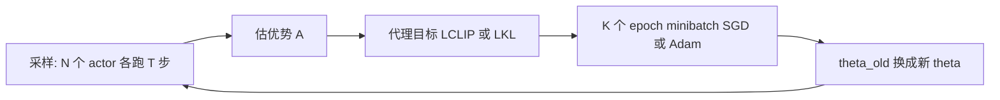

# PPO：用截断重要性比率，让策略梯度也能多 epoch 更新

<!-- release-date: 2017-07-20 -->

**本文依据**：`Proximal Policy Optimization Algorithms`，arXiv **1707.06347v2**（[cs.LG] 28 Aug 2017），**12 页**。作者 John Schulman、Filip Wolski、Prafulla Dhariwal、Alec Radford、Oleg Klimov，OpenAI。原件首次公开日取 arXiv **v1** 提交日 **2017-07-20**（Submitted on 20 Jul 2017）；解读依据本地已核的 **v2**（CreationDate 2017-08-29，`pdfinfo` Pages: 12）。v2 日期不回写 `release-date`。文中数字都标 PDF 页码。标「外部补充」的段落不来自本文；**不要把 2017 年以后的 RLHF / InstructGPT / GRPO 读成本论文内容**。

## 一句话

标准策略梯度对同一批轨迹只敢走一步，再走就会把策略改崩。PPO 换了一个**代理目标**：把新旧策略的概率比 $r_t(\theta)$ 截断在 $[1-\epsilon,1+\epsilon]$ 里，再取截断前后目标的最小值。这样同一批数据可以做 **K 个 epoch 的 minibatch 更新**，实现上只比 vanilla 策略梯度多几行代码，却能接近信赖域方法的稳定性（PDF p.1–2, p.5）。

## 一、矛盾：要稳就复杂，要简单就不敢多更新

当时用神经网络做强化学习，三条主路互相卡（PDF p.1）：

- **深度 Q 学习**：在 Arcade Learning Environment 这类离散动作游戏上能工作，但论文脚注写明：它**没有被证明**能在 OpenAI Gym 连续控制基准上表现好（PDF p.1 脚注 1）。
- **Vanilla 策略梯度**：实现简单，但样本效率和稳健性都差（PDF p.1）。
- **信赖域策略优化（Trust Region Policy Optimization，TRPO）**：数据效率和可靠性更好，但相对复杂；并且**不兼容**带噪声的结构（例如 dropout），也不兼容策略与价值函数共享参数、或带辅助任务的结构（PDF p.1）。

作者要的是：TRPO 那种数据效率与可靠表现，但**只用一阶优化**（PDF p.1）。做法是：和环境交互采样，再对采样数据做若干轮优化；核心是带**截断概率比**的目标，它对策略表现形成一个悲观估计（下界）（PDF p.1–2）。

机制示意，根据 Algorithm 1（PDF p.5）。

## 二、旧目标为什么不能多走几步

策略梯度常用估计（PDF p.2 式 1–2）：

$$
\hat{g}=\hat{\mathbb{E}}_t\bigl[\nabla_\theta\log\pi_\theta(a_t\mid s_t)\hat{A}_t\bigr],\qquad
L^{PG}(\theta)=\hat{\mathbb{E}}_t\bigl[\log\pi_\theta(a_t\mid s_t)\hat{A}_t\bigr]
$$

$\pi_\theta$ 是随机策略，$\hat{A}_t$ 是优势函数估计，$\hat{\mathbb{E}}_t$ 是有限批次上的经验平均。自动微分只要构造 $L^{PG}$，梯度就是 $\hat{g}$。

直觉上想对**同一条轨迹**对 $L^{PG}$ 做多步优化。论文说这**没有很好的理论依据**，经验上常常造成**破坏性的过大策略更新**（PDF p.2；第 6.1 节未单独画「无截断」曲线，但作者说结果与「无截断也无惩罚」相当或更差）。

TRPO 改成：最大化代理目标，同时硬约束策略更新幅度（PDF p.2 式 3–4）：

$$
\max_\theta\ \hat{\mathbb{E}}_t\left[\frac{\pi_\theta(a_t\mid s_t)}{\pi_{\theta_{\mathrm{old}}}(a_t\mid s_t)}\hat{A}_t\right]
\quad\text{s.t.}\quad
\hat{\mathbb{E}}_t\bigl[\mathrm{KL}[\pi_{\theta_{\mathrm{old}}}(\cdot\mid s_t),\pi_\theta(\cdot\mid s_t)]\bigr]\le\delta
$$

实际求解：目标线性近似、约束二次近似，再用共轭梯度（PDF p.2）。理论其实更偏向 **KL 惩罚**而不是硬约束（PDF p.2 式 5），因为某个用状态上 **max KL**（而不是 mean KL）的代理目标，才是策略表现的下界。TRPO 仍用硬约束，是因为**很难选一个**在不同问题、甚至同一问题学习过程中都好用的 $\beta$（PDF p.2）。作者明确写：只固定 $\beta$、用 SGD 优化式 5，**不足以**得到模仿 TRPO 单调改进的一阶算法，还需要别的改动（PDF p.2）。

## 三、截断代理目标：把 $r$ 钉在 1 附近

记概率比（重要性比率）

$$
r_t(\theta)=\frac{\pi_\theta(a_t\mid s_t)}{\pi_{\theta_{\mathrm{old}}}(a_t\mid s_t)},\qquad r(\theta_{\mathrm{old}})=1
$$

TRPO 最大化的就是 conservative policy iteration 那一项（PDF p.3 式 6）：

$$
L^{CPI}(\theta)=\hat{\mathbb{E}}_t\bigl[r_t(\theta)\hat{A}_t\bigr]
$$

不加约束地最大化 $L^{CPI}$，策略更新会过大。PPO 的主目标是（PDF p.3 式 7，$\epsilon$ 例如 $0.2$）：

$$
L^{CLIP}(\theta)=\hat{\mathbb{E}}_t\Bigl[\min\bigl(r_t(\theta)\hat{A}_t,\ \mathrm{clip}(r_t(\theta),1-\epsilon,1+\epsilon)\hat{A}_t\bigr)\Bigr]
$$

三项怎么读：

1. $\min$ 里第一项就是 $L^{CPI}$。
2. 第二项把 $r_t$ **截断**到 $[1-\epsilon,1+\epsilon]$，从而拿掉「把 $r$ 推到区间外」的激励。
3. 再取最小值，使最终目标是未截断目标的**下界**（悲观界）：只有当概率比变化会**改善**目标时才忽略它；会**变差**时则计入（PDF p.3）。

在 $\theta_{\mathrm{old}}$ 附近（$r=1$）$L^{CLIP}$ 与 $L^{CPI}$ 一阶相同；离远了才分叉（PDF p.3）。图 1：优势为正时 $r$ 被钉在 $1+\epsilon$，为负时钉在 $1-\epsilon$；红圈是优化起点 $r=1$（PDF p.3）。

图 2 把参数沿一次 PPO 更新方向做线性插值（Hopper-v1 第一次策略更新，超参见第 6.1 节）：更新后策略相对旧策略的 KL 大约 **0.02**，而 $L^{CLIP}$ 恰好在这一点附近最大。图上能看见 $L^{CLIP}$ 是 $L^{CPI}$ 的下界，并对过大更新给惩罚（PDF p.4）。

**可迁移**：不要让同一批 on-policy 数据上的重要性比率无限涨。截断比调一个全局 $\beta$ 更省事；$\epsilon$ 直接对应「这一步最多让概率变成原来的 $1\pm\epsilon$ 倍」。

## 四、备选：自适应 KL 惩罚，实验里更差

第四节给另一条路：对 KL 加惩罚，并让系数 $\beta$ 去追一个目标 KL $d_{\mathrm{targ}}$。可以单独用，也可以和截断一起用。作者写明：实验里 **KL 惩罚不如截断代理目标**，收录它是因为它是重要基线（PDF p.4）。

每轮策略更新：

1. 用若干 epoch 的 minibatch SGD 优化（PDF p.4 式 8）

$$
L^{KLPEN}(\theta)=\hat{\mathbb{E}}_t\Bigl[r_t(\theta)\hat{A}_t-\beta\,\mathrm{KL}[\pi_{\theta_{\mathrm{old}}}(\cdot\mid s_t),\pi_\theta(\cdot\mid s_t)]\Bigr]
$$

2. 算 $d=\hat{\mathbb{E}}_t[\mathrm{KL}[\pi_{\theta_{\mathrm{old}}},\pi_\theta]]$：若 $d<d_{\mathrm{targ}}/1.5$，则 $\beta\leftarrow\beta/2$；若 $d>d_{\mathrm{targ}}\times 1.5$，则 $\beta\leftarrow\beta\times 2$（PDF p.4）。

新 $\beta$ 用于下一轮。偶发会看到 KL 离 $d_{\mathrm{targ}}$ 很远，但少见，$\beta$ 会很快跟上。$1.5$ 与 $2$ 是启发式，算法对它们不敏感；$\beta$ 初值是超参，实践中也不重要，因为会很快被调掉（PDF p.4）。

## 五、算法：代理损失 + 价值误差 + 熵，多 epoch minibatch

自动微分实现里，只要把 $L^{PG}$ 换成 $L^{CLIP}$ 或 $L^{KLPEN}$，并对该目标做**多步**随机梯度上升（PDF p.4）。

降方差的优势估计通常要用学到的状态价值 $V(s)$，例如广义优势估计（GAE）或 A3C 那类有限视界估计（PDF p.4–5）。若策略与价值**共享**网络参数，就必须把策略代理和价值误差写进同一个损失。还可以加熵奖励以保持探索（PDF p.5）。合在一起，每轮近似最大化（PDF p.5 式 9）：

$$
L_t^{CLIP+VF+S}(\theta)=\hat{\mathbb{E}}_t\Bigl[L_t^{CLIP}(\theta)-c_1 L_t^{VF}(\theta)+c_2 S[\pi_\theta](s_t)\Bigr]
$$

$L_t^{VF}=(V_\theta(s_t)-V_t^{\mathrm{targ}})^2$，$S$ 是熵，$c_1,c_2$ 是系数。

适合 RNN 的一种写法：策略跑 $T$ 步（$T$ 远小于回合长度），只用这段样本更新，优势估计不能看到 $T$ 之后（PDF p.5）。A3C 估计是（PDF p.5 式 10）：

$$
\hat{A}_t=-V(s_t)+r_t+\gamma r_{t+1}+\cdots+\gamma^{T-t+1}r_{T-1}+\gamma^{T-t}V(s_T)
$$

截断版 GAE 在 $\lambda=1$ 时退回式 10（PDF p.5 式 11–12）：

$$
\hat{A}_t=\delta_t+(\gamma\lambda)\delta_{t+1}+\cdots+(\gamma\lambda)^{T-t+1}\delta_{T-1},\qquad
\delta_t=r_t+\gamma V(s_{t+1})-V(s_t)
$$

**Algorithm 1**（Actor-Critic 风格，PDF p.5）：每轮 $N$ 个并行 actor 各采 $T$ 步，在这 $NT$ 步上构造代理损失，用 minibatch SGD（通常用 Adam）优化 **K 个 epoch**，minibatch 大小 $M\le NT$，然后 $\theta_{\mathrm{old}}\leftarrow\theta$。

这就是标题里「proximal」的操作含义：不是共轭梯度加二次约束，而是**在旧策略附近**，用截断（或自适应 KL）把更新按住，从而安全地重复使用同一批数据。

## 六、实验：先比代理目标，再比算法，再上 Humanoid 与 Atari

### 6.1 七个 MuJoCo 任务上比代理目标

比较 $L^{CLIP}$ 与几种自然变体（PDF p.5）：无截断无惩罚 $r_t\hat{A}_t$；截断；固定或自适应 KL 惩罚。作者也试过在对数空间截断，**并不更好**（PDF p.6）。

基准：OpenAI Gym 里 7 个 MuJoCo 机器人任务（HalfCheetah、Hopper、InvertedDoublePendulum、InvertedPendulum、Reacher、Swimmer、Walker2d，全部 `-v1`），每个训 **一百万** 步（PDF p.6 及脚注 2）。策略：两层 64 单元全连接 MLP，tanh，输出高斯均值，标准差可学；**策略与价值不共享参数**（$c_1$ 无关），**不用熵奖励**（PDF p.6）。每个算法在 7 个环境、每环境 3 个随机种子；分数取最后 100 个回合的平均总回报，再按环境平移缩放到「随机策略 = 0、最好结果 = 1」，21 次运行平均成一个标量（PDF p.6）。

表 1（PDF p.6；$\beta$ 初值 1）：

| 设定 | 平均归一化分数 |
|---|---:|
| 无截断无惩罚 | $-0.39$ |
| 截断 $\epsilon=0.1$ | $0.76$ |
| 截断 $\epsilon=0.2$ | $0.82$ |
| 截断 $\epsilon=0.3$ | $0.70$ |
| 自适应 KL $d_{\mathrm{targ}}=0.003$ | $0.68$ |
| 自适应 KL $d_{\mathrm{targ}}=0.01$ | $0.74$ |
| 自适应 KL $d_{\mathrm{targ}}=0.03$ | $0.71$ |
| 固定 KL $\beta=0.3$ | $0.62$ |
| 固定 KL $\beta=1$ | $0.71$ |
| 固定 KL $\beta=3$ | $0.72$ |
| 固定 KL $\beta=10$ | $0.69$ |

负分来自：无约束时 HalfCheetah 会落到比初始随机策略更差（PDF p.6）。截断 $\epsilon=0.2$ 最高。MuJoCo 一百万步超参见表 3（PDF p.10）：$T=2048$，Adam 步长 $3\times 10^{-4}$，**10** 个 epoch，minibatch **64**，$\gamma=0.99$，GAE $\lambda=0.95$。

### 6.2 连续控制：对 TRPO、CEM、A2C 等

用第 3 节截断目标的 PPO（$\epsilon=0.2$）对比：TRPO、交叉熵方法（CEM）、带自适应步长的 vanilla 策略梯度（按 KL 调 Adam 步长，规则类似第 4 节）、A2C、带信赖域的 A2C（PDF p.6–7）。A2C 是 A3C 的同步版，作者发现它表现相当或更好（PDF p.7）。图 3：PPO 在几乎所有连续控制环境上超过对比方法（PDF p.7）。

### 6.3 展示：3D Humanoid 跑、转向、被方块砸

三个 Roboschool 任务（PDF p.7）：(1) RoboschoolHumanoid 只向前走；(2) Flagrun：目标每 200 步或到达后随机换位置；(3) FlagrunHarder：被方块砸，还要从地上爬起来。图 4 是学习曲线，图 5 是 Flagrun 学到策略的静帧（PDF p.7–8）。超参表 4（PDF p.10）：$T=512$，**15** 个 epoch，minibatch **4096**，$\gamma=0.99$，$\lambda=0.95$，actor 数 locomotion **32**、flagrun **128**；动作分布 log 标准差线性退火 $\mathrm{LinearAnneal}(-0.7,-1.6)$；Adam 步长按目标 KL 调。同期工作 Heess 等用第 4 节**自适应 KL 变体**在 3D 机器人上学运动策略（PDF p.7）。

### 6.4 Atari：比 A2C 简单，样本效率更好；相对 ACER 看指标

Arcade Learning Environment，对比调好的 A2C 与 ACER；三者策略网络结构与 A3C 论文相同（PDF p.8）。PPO 超参表 5（PDF p.10）：$T=128$，Adam 步长 $2.5\times 10^{-4}\times\alpha$，**3** 个 epoch，minibatch $32\times 8$，$\gamma=0.99$，$\lambda=0.95$，**8** 个 actor，截断 $\epsilon=0.1\times\alpha$，价值系数 $c_1=1$，熵系数 $c_2=0.01$；$\alpha$ 在训练过程中从 1 线性退火到 0。

49 个游戏的表与曲线在附录 B。两种计分（PDF p.8）：(1) **整段训练**的平均每回合回报（偏向学得快）；(2) **最后 100 个回合**的平均回报（偏向最终表现）。表 2 按三项试验平均后数「赢了多少个游戏」（PDF p.8）：

| 指标 | A2C | ACER | PPO | 平局 |
|---|---:|---:|---:|---:|
| 整段训练平均回报 | 1 | 18 | 30 | 0 |
| 最后 100 回合平均回报 | 1 | 28 | 19 | 1 |

引言的概括：Atari 上 PPO 的**样本复杂度显著好于 A2C**，与 ACER **相近**，但简单得多（PDF p.2）。表 2 把「相近」拆开了：学得快的指标 PPO 赢 30 局，最终表现 ACER 赢 28 局。

附录表 6：40M 游戏帧（10M 时间步）后最后 100 回合均值（PDF p.12）。例如 Enduro：A2C / ACER 都是 $0.0$，PPO $758.3$；Freeway：前两者 $0.0$，PPO $32.5$；Kangaroo：PPO $9928.7$ 对 A2C $45.3$；Venture 三者都是 $0.0$。图 6 是 49 个游戏三条随机种子的学习曲线，横轴到 40M frames（PDF p.11）。

## 七、限制与论文没写的

论文自己划的边界：

- 追求的是**可扩展、样本高效、少调超参仍能在多种问题上成功**；并不声称理论单调改进已经证到 TRPO 那种 max-KL 下界（PDF p.1–2）。
- 截断目标是启发式的悲观界，不是把 TRPO 的共轭梯度约束原样搬过来。
- 无截断会在 HalfCheetah 上比随机策略更差（PDF p.6）；KL 惩罚整组分数低于最好的截断（表 1）。
- MuJoCo 消融**不共享**策略/价值、**不加**熵；Atari 才用式 9 的 $c_1,c_2$（PDF p.6, p.10）。
- Atari 最终表现按「赢的游戏数」**ACER 更多**（28 对 19）（PDF p.8）。
- 连续控制曲线是一百万步；Humanoid 横轴到 50M / 100M timestep（图 4），论文没有把墙钟时间和这些步数写成一张对照表。
- 实现细节到超参表为止，没有开源代码路径写在正文里（致谢之外）。

**本文不把后续生态写进论文主张。** 2017 年这篇只处理在线策略梯度、MuJoCo / Roboschool / Atari。LLM 对齐里的 PPO、InstructGPT、GRPO 等是后话，需要时另文。

## 八、可迁移启发

1. **同一批 on-policy 数据要多看几眼，先把更新幅度卡住。** $L^{CLIP}$ 的 $\min$ 只在变差时生效，变好时不奖赏把 $r$ 推到区间外。
2. **信赖域可以是一阶的。** 不必上共轭梯度；截断概率比就能在共享参数、带噪声的结构上用（这正是 TRPO 不兼容的点）。
3. **$\epsilon$ 比固定 $\beta$ 好搜。** 表 1 里 $\epsilon=0.2$ 赢过一排 KL 设定。
4. **计分方式会改结论。** Atari 上「学得快」和「最后 100 回合」把 PPO 与 ACER 的名次对调。
5. **K、T、$M$、actor 数随域改。** MuJoCo：10 epoch、minibatch 64、$T=2048$；Atari：3 epoch、$T=128$、8 actor。不要把一组超参当成算法定义。

## 关键词回看

- **代理目标（surrogate objective）**：用当前批次、以旧策略为参照写出的可微目标，不是环境真实回报本身。
- **概率比 / 重要性比率 $r_t$**：新策略对 $(s_t,a_t)$ 的概率除以采样时旧策略的概率。
- **截断（clip）**：把 $r_t$ 限制在 $[1-\epsilon,1+\epsilon]$。
- **信赖域（trust region）**：限制每步策略走多远；TRPO 用 KL 约束，PPO 用截断（或自适应 KL）近似。
- **GAE**：用 TD 残差 $\delta_t$ 的 $\lambda$ 指数加权估优势。
- **PPO 循环**：采 $NT$ 步 → 算 $\hat{A}$ → $K$ 个 epoch minibatch 优化代理损失 → 更新 $\theta_{\mathrm{old}}$。
