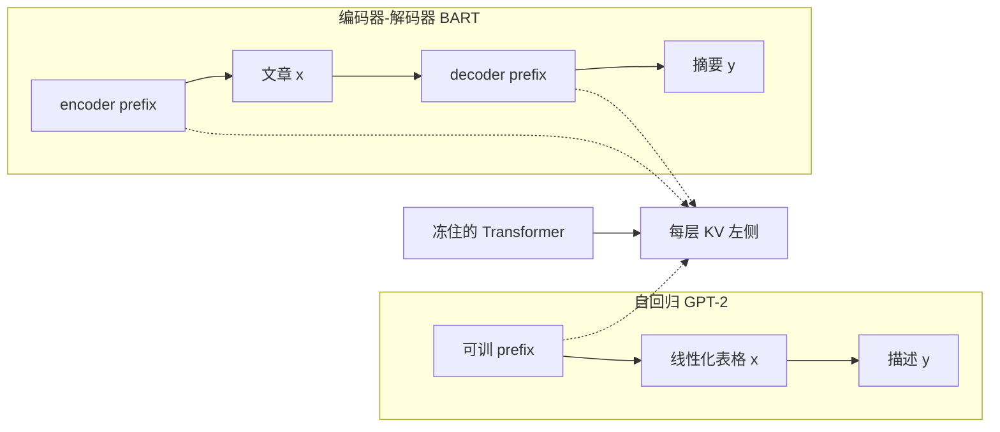

# Prefix-Tuning：冻住整网，只在每层 KV 前塞一段可训的虚拟 token

<!-- release-date: 2021-01-01 -->

**本文依据**：`Prefix-Tuning: Optimizing Continuous Prompts for Generation`，arXiv **2101.00190v1**（[cs.CL] 1 Jan 2021），15 页。作者 Xiang Lisa Li、Percy Liang，Stanford University。arXiv 目前只有 v1，本地即最新预印本。原件首次公开日取 arXiv v1 **2021-01-01**。文中数字都标 PDF 页码；标「外部补充」的段落不来自本文。

## 一句话

全量微调每换一个生成任务就要存一份完整语言模型。Prefix-tuning 把底座冻住，只在输入（以及 BART 的编码器、解码器两侧）前面接一段连续、任务专用的 **prefix**。后面的 token 把它当「虚拟 token」来做注意力。可训参数大约 **0.1%**。表格到文本上和全量微调相当；少数据和未见话题上更好。摘要任务上要略差一点（PDF p.1）。

## 一、矛盾：生成任务也要一份完整权重

预训练好的大语言模型拿来做下游生成（摘要、表格转文字），当时的默认做法是 **fine-tuning（全量微调）**：所有参数跟着梯度走，每个任务存一份改过的模型（PDF p.1）。

这在 GPT-2（774M）、GPT-3（175B）上已经是存储问题，不是「checkpoint 大一点」那么轻（PDF p.1）。

当时两条轻量路：

1. **Adapter-tuning**：在 Transformer 层之间插入任务专用小层。理解与生成上都接近全量微调，任务参数大约 **2–4%**（Houlsby 等、Lin 等；PDF p.1–2）。相关工作里作者还写过约 **3.6%**，prefix 再压大约 **30 倍**，到 **0.1%**（PDF p.2）。
2. **Prompting / in-context learning**：GPT-3 那种，前面拼自然语言指令和几个例子，不改权重。Transformer 上下文有上限（文中举例 GPT-3 为 2048），训练集比窗口长就吃不完（PDF p.2）。

Prefix-tuning 站在 prompting 这一侧：也是「前面加东西来引导模型」，但加的不是离散词，而是**连续、可训、不对应真实词表**的向量。目标任务是条件生成：输入 $x$，输出序列 $y$。本文两条线（PDF p.3）：

- **表格到文本（table-to-text）**：线性化表格 → 自然语言描述，底座是 GPT-2。
- **摘要（summarization）**：文章 → 短摘要，底座是 BART。

作者明确说方法可以接到别的生成任务和别的预训练模型上，但实验只做这两条（PDF p.2）。

## 二、设计：prefix 是每层激活上的一段自由参数

### 旧做法怎么写目标

自回归 Transformer（GPT-2）把 $z=[x;y]$ 拼起来。时刻 $i$ 的激活 $h_i\in\mathbb{R}^d$ 是各层激活的拼接；$h_i$ 由当前词 $z_i$ 和左侧历史 $h_{<i}$ 算出（PDF p.3 式 1）：

$$
h_i=\mathrm{LM}_{\phi}(z_i,h_{<i})
$$

最后一层拿去乘预训练矩阵 $W_{\phi}$，再 softmax 得到下一个词。全量微调对 $\phi$ 最大化 $y$ 上的对数似然（PDF p.4 式 2）。

脚注写清：GPT-2 里 $h_i^{(n)}$ 由一对 **key–value** 组成，每个 key、每个 value 维度是 **1024**（PDF p.3）。所以「优化 prefix」不是只改词嵌入，而是在**每一层的 KV 缓存前面**接上一段可训向量。后面真实 token 的注意力可以直接看到它们，像看到额外的上下文位置。

BART 这类编码器–解码器：编码器双向编码 $x$，解码器自回归出 $y$。记号相同。encoder 侧和 decoder 侧**各接一段 prefix**（PDF p.4 图 2）。

### 新设计：虚拟 token，底座不动

自回归：$z=[\mathrm{PREFIX};x;y]$。

编码器–解码器：$z=[\mathrm{PREFIX};x;\mathrm{PREFIX}';y]$（PDF p.4）。

$P_{\mathrm{idx}}$ 是 prefix 的位置集合，$|P_{\mathrm{idx}}|$ 是长度。另开一个可训矩阵 $P_{\theta}$，形状 $|P_{\mathrm{idx}}|\times\dim(h_i)$。激活变成（PDF p.4 式 3）：

$$
h_i=
\begin{cases}
P_{\theta}[i,:], & i\in P_{\mathrm{idx}},\\
\mathrm{LM}_{\phi}(z_i,h_{<i}), & \text{否则。}
\end{cases}
$$

目标函数仍是式 2。变的是：**$\phi$ 冻住，只训 $\theta$。**

$i$ 落在 prefix 里，$h_i$ 直接从 $P_{\theta}$ 拷。$i$ 不在 prefix 里，$h_i$ 仍然依赖 $P_{\theta}$——因为 prefix 永远在左侧上下文里，会改它右边所有激活（PDF p.4）。

这就是「虚拟 token」的机制：没有词表 ID，但注意力把它当普通过去位置。任务模块化：一份大 Transformer + 每个任务一小段 prefix。文中举例表格到文本大约 **250K** 任务参数（PDF p.1）。同 batch 里还可以混不同用户/任务的例子——adapter 插在层中间，做不到这件事（PDF p.1）。

上图按 PDF p.1 图 1、p.4 图 2 重画，是机制示意，不是测速图。

### 为什么不直接优化 $P_{\theta}$：重参数化

直觉上可以只优化连续词嵌入，让效果沿层向上、沿序列向右传。这比离散 prompt 更自由（不必撞上某个真词的嵌入），但比「直接改每一层激活」更弱——后者没有那么长的依赖链，可训参数也更多。Prefix-tuning 选的是 **优化 prefix 的所有层**（PDF p.4）。

直接更新 $P_{\theta}$ 在预实验里 **优化不稳定，性能略掉**，对学习率和初始化很敏感（PDF p.4 脚注 3）。于是重参数化：

$$
P_{\theta}[i,:]=\mathrm{MLP}_{\theta}(P'_{\theta}[i,:])
$$

$P'_{\theta}$ 行数仍是 prefix 长度，列更窄。训练结束后 **丢掉 MLP**，只存算好的 $P_{\theta}$（PDF p.4–5）。列宽 $k$：表格到文本 **512**，摘要 **800**；MLP 把 $k$ 映到 $\dim(h_i)$（PDF p.5 脚注 4）。

**可迁移**：连续 prompt 直接当自由向量训，往往又尖又脆。用一个大一点的 MLP 当训练期支架，部署再扔掉，是这篇里真正可抄的一招——不是事后生态里的惯例，是本文自己的消融结论。

## 三、实验设置：GPT-2 做表，BART 做摘要

### 数据

表格到文本三条，复杂度与规模递增（PDF p.5）：

| 数据集 | 规模（约） | 输入 | 输出均长 | 评测 |
|---|---:|---|---:|---|
| E2E | 50K，8 个字段，餐馆域 | 线性化表 | 22.9 | 官方脚本：BLEU、NIST、METEOR、ROUGE-L、CIDEr |
| WebNLG | 22K | (主语, 关系, 宾语) 三元组；训练/验证 9 个 DBpedia 类，测试一半未见 5 类 | 22.5 | BLEU、METEOR、TER |
| DART | 82K，开放域 | 同类三元组，来自 WikiSQL 等 | 21.6 | BLEU、METEOR、TER、MoverScore、BERTScore、BLEURT |

摘要用 **XSUM**：约 **225K** 条新闻，文均长 **431** 词，摘要均长 **23.3**，报 ROUGE-1/2/L（PDF p.5）。

WebNLG 测试的 U 列（UNSEEN）专门用来看话题外推（PDF p.5）。

### 对照与超参

表格到文本：全量微调、只微调顶上 2 层（FT-TOP2）、adapter（实现同 Lin 等 2020）。摘要：对照全量微调 BART（PDF p.5）。公平比参数时，prefix 与 adapter 都压到 **0.1%**（PDF p.6）。

底座：表格用 GPT-2 MEDIUM / LARGE，表线性化；摘要用 BART LARGE，文截到 **512** BPE。实现基于 Hugging Face。默认：**10** epoch、batch **5**、学习率 **$5\cdot 10^{-5}$**、prefix 长 **10**。表格机器 TITAN Xp / GTX TITAN X；摘要 Tesla V100。22K 例上 prefix 每 epoch 约 **0.2** 小时，全量微调约 **0.3** 小时；XSUM 上每 epoch 约 **1.25** 小时（PDF p.5）。解码：表格 beam **5**；摘要 beam **6**、长度归一化 **0.8**。无 batch 时表格每句约 **1.2** 秒；摘要 batch=10 时每批约 **2.6** 秒（PDF p.5–6）。

附录表 5 给出主实验超参。例如 prefix：E2E 学习率 $8\times 10^{-5}$、5 epoch、batch 10、prefix 长 **5**；XSUM 30 epoch、batch 14、prefix 长 **100**（PDF p.12）。

作者没把 GPT-2 用在摘要上：预实验里微调 GPT-2 在 XSUM 上明显弱于微调 BART（PDF p.5 脚注 8）。

## 四、全数据：0.1% 参数，表上可比，摘要略掉

存储口径：prefix 存的参数比全量微调少 **1000 倍**（PDF p.1）。0.1% 的绝对数：E2E / WebNLG **250K**，DART **500K**，对照 GPT-2 **345M**（PDF p.6 脚注 9）。

### 表格到文本（表 1，PDF p.7）

趋势：0.1% 的 prefix **好于** 同参数量的 adapter 和 FT-TOP2，与全量微调 **相当**。相对 adapter（0.1%），平均每个数据集 BLEU 高 **4.1**（PDF p.6）。即便对照全量（100%）和 adapter（3.0%），prefix 仍相当或更好（PDF p.6）。

摘 GPT-2 MEDIUM 几条（越高越好，TER 除外；PDF p.7 表 1）：

| 方法 | E2E BLEU | WebNLG ALL BLEU | DART BLEU |
|---|---:|---:|---:|
| Fine-tune | 68.2 | 46.5 | 46.2 |
| Adapter（3%） | 68.9 | 54.9 | 45.2 |
| Adapter（0.1%） | 66.3 | 50.2 | 42.4 |
| Prefix（0.1%） | **69.7** | **55.1** | **46.4** |

GPT-2 LARGE 上 E2E：Fine-tune BLEU **68.5**，Prefix **70.3**；WebNLG ALL：Fine-tune **55.5**，Prefix **56.3**（PDF p.7）。作者据此认为从 MEDIUM 到 LARGE 能跟上，形态相近的更大模型（文中点名 GPT-3）也有希望，但 **本文没有训 GPT-3**（PDF p.6）。

WebNLG 的 U 列（未见类）MEDIUM：Fine-tune BLEU **27.7**，Adapter（3%）**48.3**，Prefix **45.6**（PDF p.7）。外推优势在第六节展开。

### 摘要（表 2，PDF p.7）

| 方法 | R-1 | R-2 | R-L |
|---|---:|---:|---:|
| Fine-tune（Lewis 等 2020） | 45.14 | 22.27 | 37.25 |
| Prefix（2%） | 43.80 | 20.93 | 36.05 |
| Prefix（0.1%） | 42.92 | 20.03 | 35.05 |

2% 时 R-L 36.05 vs 37.25；0.1% 时 35.05 vs 37.25。作者给的三条可能原因（不是已证明的因果）：XSUM 例数大约是三个表数据集平均的 **4 倍**；输入文章大约比线性化表长 **17 倍**；摘要要读懂再抽重点，可能更难（PDF p.6）。

## 五、少数据：平均高 2.9 BLEU，也更忠实

从全数据结果反推：训练例越少，prefix 相对越有利。于是从 E2E 和 XSUM 子采样 $\{50,100,200,500\}$，每个规模 5 个子集 × 2 个训练种子，共平均 **10** 个模型（PDF p.6）。验证集约训练规模的 30%，用来选超参和早停（PDF p.6 脚注 11）。

图 3 右侧：少数据区 prefix 平均高 **2.9 BLEU**，参数少很多；数据变多，差距收窄（PDF p.6–7）。上两图是摘要 ROUGE-1/2，下两图是表任务 BLEU 与 ROUGE-L。

定性（图 3 左，The Eagle 那张表）：两边少数据都会少生成字段。微调在 100、200 例时把顾客评分 **average 说成 low**；同规模 prefix 仍写 average（PDF p.6–7）。

## 六、未见话题：冻住底座，外推更好

WebNLG：9 个 SEEN 类上训，5 个 UNSEEN 类上测（PDF p.7）。摘要自造两套划分（用 BBC URL 认话题，PDF p.7 脚注 13）：

- **news-to-sports**：新闻上训，体育上测。
- **within-news**：world / UK / business 上训，其余新闻类（health、technology 等）上测。

表 3（XSUM 外推，PDF p.7）：

| 划分 | 方法 | R-1 | R-2 | R-L |
|---|---|---:|---:|---:|
| news-to-sports | Fine-tune | 38.15 | 15.51 | 30.26 |
| news-to-sports | Prefix | 39.23 | 16.74 | 31.51 |
| within-news | Fine-tune | 39.20 | 16.35 | 31.15 |
| within-news | Prefix | 39.41 | 16.87 | 31.47 |

表任务看表 1 的 U 列。Adapter 外推也强，和 prefix 相当。作者的判断：**保住预训练参数对外推有正面作用**；机制仍是 **open question**（PDF p.8）。

附录表 6：未见类上两边都会少生成或不忠实。作者观察 prefix **更常少生成**，微调 **更常写错事实**；已见类两边覆盖和忠实都还行（PDF p.12、p.15）。这是定性，不是自动指标。

## 七、消融：长度、只训嵌入、infix、初始化

### Prefix 长度（图 4，PDF p.8）

更长 = 更多可训参数。性能先升，过阈值后略掉：摘要阈值 **200**，表格到文本 **10**。超过阈值时训练损失更低、测试略差，作者认为是过拟合（PDF p.8 脚注 14）。GPU 上对整段 prefix 的注意力可并行，更长对推理速度影响可忽略（PDF p.8）。

### 只训嵌入 vs 全层 prefix（表 4，PDF p.8）

Embedding-only：只把「虚拟 token」的词嵌入当自由参数，上层仍由 Transformer 算。E2E 上 Prefix BLEU **69.7**；EMB-1 **48.1**，EMB-10 **62.2**，EMB-20 **61.9**。掉得很大。表达力链条：离散 prompt < 只训嵌入 < prefix-tuning（PDF p.8）。

### Infix：插在 $x$ 和 $y$ 中间

$[x;\mathrm{INFIX};y]$ 只能改 $y$ 的激活；prefix 能改 $x$ 和 $y$。E2E：INFIX-1 BLEU **67.9**，INFIX-10 **67.2**，INFIX-20 **66.7**，都低于 69.7（PDF p.8）。

### 初始化（图 5，少数据）

随机初始化：低分、方差大。用 **真实词经 LM 算出的激活** 初始化明显更好。任务相关词（“summarization”、“table-to-text”）略好于无关词（“elephant”、“divide”）；用真词仍全面好于随机（PDF p.8–9）。附录图 7 在 100 条训练上复述同一结论；随机来自均匀 $(0,1)$（PDF p.12）。这和「尽量别把预训练 LM 推离原分布」一致。

## 八、作者自己划的边界

**模块化与个性化（讨论，不是实验）**：百万用户、数据不能混时，每人一个 prefix，增删用户等于增删一段向量，没有交叉污染（PDF p.1、p.9）。云上 GPU 还可以把不同用户的请求放进同一 batch：各人 prefix 接到输入前，后面共享计算不变。Adapter 层间插入个性化模块，**不能跨用户 batch**（PDF p.9）。

**和 adapter 的归纳偏置**：两者都冻底座。Prefix 用完好的注意力块，让 prefix 去改后续激活；adapter 在层间加残差。Prefix 参数少一个数量级仍相当，作者猜测是因为它更少改动预训练 LM、剥削得更充分——这是讨论，不是新表（PDF p.9）。

**并发工作**：Aghajanyan 等（2020）用本征维说明下游微调落在很低维重参数化上。本文把它对应到生成：很小一段 prefix 就够（PDF p.9）。不要把后来的 LoRA 叙事写进本篇。

**没做 / 没撑住的：**

- 摘要全数据不如微调，尤其 0.1%（PDF p.6–7）。
- 没有 GPT-3 实验；没有机器翻译、对话等其它 NLG 主结果（PDF p.2）。
- 离散自然语言指令：预实验里 GPT-2、BART 不行，只有 GPT-3 例外（PDF p.4 脚注 2）。
- 外推增益的机制是 open question（PDF p.8）。
- 直接优化 $P_{\theta}$ 不稳定，必须 MLP 重参数化；训完可丢 MLP（PDF p.4）。
- 线性化表对预训练 LM 是「不自然」格式（PDF p.5 脚注 7）。
- 可控生成（CTRL / GeDi / PPLM）套不到表格到文本、摘要这种细粒度内容约束上（PDF p.3）。

## 九、可迁移

1. **任务增量不要等于整网副本。** 生成任务也可以是「一段前置 KV」而不是一份 774M/175B。
2. **Steer 用连续 prefix，不要只搜离散词。** 只训嵌入明显不够（表 4）。
3. **训练期支架、部署期扔掉。** MLP 重参数化专门对付直接优化激活的不稳。
4. **少数据和分布外，冻底座往往比改全网更值。** 2.9 BLEU 和 UNSEEN / news-to-sports 是证据；机制作者自己没闭合。
5. **Prefix 放在序列最前，才能改对 $x$ 的编码。** Infix 只会改解码。
6. **少数据用真词激活初始化**，随机均匀 $(0,1)$ 会又差又散。
7. **同一套注意力，多用户 prefix 可以拼 batch**——这是结构性质，adapter 没有。

## 关键词回看

- **Prefix / 虚拟 token**：不在词表里、但占据注意力位置的连续向量，接在每层 KV 前。
- **重参数化 $P_{\theta}=\mathrm{MLP}(P'_{\theta})$**：小矩阵经大 MLP 再变成各层 prefix；训练结束后只存 $P_{\theta}$。
- **Embedding-only**：只训嵌入、上层仍由 Transformer 算，表达力不够。
- **Infix-tuning**：可训激活插在 $x$ 与 $y$ 之间，影响面比 prefix 小。
- **Adapter-tuning**：层间插小模块；本文公平对比到 0.1% 与 3%。

## 参考资料

- 原件：Xiang Lisa Li, Percy Liang. *Prefix-Tuning: Optimizing Continuous Prompts for Generation*. arXiv:2101.00190v1，2021-01-01。
- Hugging Face Transformers（实现依赖，Wolf 等 2020；PDF p.5）。
