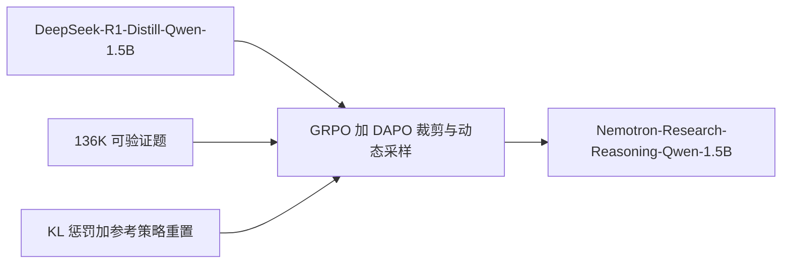

# ProRL：把强化学习拉长，才可能真正扩推理边界，而不是只把基座里已有的答案抽得更勤

<!-- release-date: 2025-05-30 -->

**本文依据**：`ProRL: Prolonged Reinforcement Learning Expands Reasoning Boundaries in Large Language Models`，封面印 **Preprint. Under review.**，arXiv **2505.24864v1**（[cs.CL] 30 May 2025），**26 页**。作者全部署名 **NVIDIA**（邮箱 `@nvidia.com`）。封面**未印会议**。原件首次公开日取任务给定的 arXiv **v1** 日 **2025-05-30**。文中数字都标 PDF 页码。标「外部补充」的段落不来自本文。

## 一句话

社区有一种看法：对可验证奖励做强化学习（Reinforcement Learning，RL），只是把基座分布里已经潜伏的高分答案抽得更勤，`pass@k` 并不抬升。ProRL 说这条结论多半来自**训练太短、任务太熟**。他们从已经会写长思维链的 **DeepSeek-R1-Distill-Qwen-1.5B** 出发，用 KL 惩罚、周期性重置参考策略、DAPO 式解耦裁剪与动态采样，在约 **136K** 条可验证题上训超过 **2k** 步，得到 **Nemotron-Research-Reasoning-Qwen-1.5B**。相对基座，Table 1–3 的平均 `pass@1` 提升是：数学 **+15.7%**、代码 **+14.4%**、STEM **+25.9%**、指令跟随 **+22.0%**、逻辑谜题 **+54.8%**（PDF p.4–5）。更关键的是：有些题基座无论采样多少次都是 0，ProRL 模型可以到满分；基座本来就会的数学题上，`pass@128` 反而可能变窄（PDF p.6–8）。

引言里相对基座的另一组百分比（数学 +14.7%、代码 +13.9%、STEM +25.1%、指令跟随 +18.1%）与 Table 1–3 **不一致**，正文以表格为准（PDF p.2 vs p.5）。

## 一、矛盾：RL 是在扩边界，还是在榨采样效率？

OpenAI-O1、DeepSeek-R1 一类模型把测试时算力花在长思维链（Chain-of-Thought，CoT）上：探索、校验、回溯，换来更难的数学和代码（PDF p.1）。核心手段是对**可验证客观奖励**做 RL，少用可学习奖励模型，减轻奖励黑客（PDF p.1）。

争议在这里：RL 是不是只优化了「已经写在基座里的解」的采样效率？若干工作用 `pass@k` 主张后者——`k` 足够大时，RL 模型并不比基座更能「至少对一次」（PDF p.2）。作者认为那是方法约束，不是 RL 的天花板（PDF p.2）：

1. **任务过熟**：数学在预训练和后训练里都已经刷过，探索空间被挤窄；
2. **训练过短**：通常只有几百步，策略还没来得及走出基座邻域。

ProRL 要做的，是把 RL **拉长到 2k 步以上**，并把数据铺到数学、代码、STEM、逻辑谜题、指令跟随，而不是再加一轮短训（PDF p.2）。权重公开在 Hugging Face：`nvidia/Nemotron-Research-Reasoning-Qwen-1.5B`（PDF p.1）。

机制示意，根据第 2–3 节与 Figure 1（PDF p.2–4）。拉长不是无限加步数：熵一塌、KL 一顶死，步数再多也只是在原地磨。

## 二、算法：GRPO 还在，真正撑过 2k 步的是正则与重置

### GRPO 在算什么

**组相对策略优化（Group Relative Policy Optimization，GRPO）** 相对近端策略优化（Proximal Policy Optimization，PPO）去掉价值网络，用同一提示下若干条回复的奖励均值和标准差当基线（PDF p.3）。目标是（式 1）：

$$
L_{\mathrm{GRPO}}(\theta)=\mathbb{E}_{\tau\sim\pi_\theta}\min\bigl(r_\theta(\tau)A(\tau),\ \mathrm{clip}(r_\theta(\tau),1-\epsilon,1+\epsilon)A(\tau)\bigr)
$$

其中 $r_\theta(\tau)=\pi_\theta(\tau)/\pi_{\mathrm{old}}(\tau)$ 是当前策略相对「本轮更新前策略」的概率比。优势（式 2）是（PDF p.3）：

$$
A(\tau)=\frac{R_\tau-\mathrm{mean}(\{R_i\}_{i\in G(\tau)})}{\mathrm{std}(\{R_i\}_{i\in G(\tau)})}
$$

没有组内差异，就没有学习信号。所以熵一旦塌成「几乎只出一种答案」，GRPO 会停摆。

### 熵塌了，升温不够

拉长训练的第一道墙是**熵崩溃**：输出过早变得很尖，探索没了（PDF p.3）。升高 rollout 温度只能推迟，挡不住熵继续掉。他们仍用高温 **1.2**，因为开局熵高一点有利于探索（PDF p.3–4）。

### 从 DAPO 借两件：解耦裁剪与动态采样

**解耦裁剪与动态采样策略优化（Decoupled Clip and Dynamic Sampling Policy Optimization，DAPO）** 把 PPO 的左右裁剪拆开（式 3）：$\mathrm{clip}(r_\theta(\tau),1-\epsilon_{\mathrm{low}},1+\epsilon_{\mathrm{high}})$。他们取 $\epsilon_{\mathrm{low}}=0.2$、$\epsilon_{\mathrm{high}}=0.4$，让「clip-higher」把原先不太可能的 token 抬起来（PDF p.3–4）。动态采样丢掉准确率为 0 或 1 的提示，只留中间难度（PDF p.3）。

### KL 惩罚：别人拆掉，他们留着，因为起点已经会 CoT

近期不少工作主张去掉 KL，理由是 CoT 任务上策略本来就会漂。作者说那多半针对**还没 SFT 的基座**。他们的起点是已经会连贯思维链的蒸馏 checkpoint，KL 仍有助于稳住熵、防止漂到假奖励上（PDF p.3–4）。带 KL 的目标（式 4）：

$$
L_{\mathrm{KL\text{-}RL}}(\theta)=L_{\mathrm{GRPO}}(\theta)-\beta D_{\mathrm{KL}}(\pi_\theta\|\pi_{\mathrm{ref}})
$$

KL 会随训练变重，更新变小。对策是**参考策略硬重置**：周期性地把 $\pi_{\mathrm{ref}}$ 换成较新的在线策略快照，并重初始化优化器状态（PDF p.4）。验证集停滞或掉分时就重置（PDF p.4）。

可迁移：从「已经会推理」的 checkpoint 做长 RL，不要照抄「零 RL、拆 KL」的配方。重置参考策略，等于把「别漂太远」的锚点往前挪，而不是取消锚。

## 三、数据与训练：136K 题、16k GPU 小时、八段跑法

### 五类可验证数据（附录 Table 4，PDF p.17）

合计约 **136K**（40+24+25+37+10）。奖励有二元也有连续。

| 类型 | 奖励 | 规模 | 来源 |
|---|---|---:|---|
| 数学 | 二元 | 40k | DeepScaleR |
| 代码 | 连续 | 24k | Eurus-2-RL / PRIME 线公开集 |
| STEM | 二元 | 25k | SCP-116K 过滤后 |
| 逻辑谜题 | 连续 | 37k | Reasoning Gym（96 项任务） |
| 指令跟随 | 连续 | 10k | Llama-Nemotron 合成（格式接近 IFEval） |

数学：竞赛题；`Let's think step by step`，答案放 `\boxed{}`；原 DeepScaleR 校验器再叠加 Hugging Face Math-Verify，任一通过即 1（PDF p.17）。

代码：跑完全部测试而不是首错即停，奖励是通过比例；编译失败、语法错、总计超时 **5 秒** 记 0；要求最终代码用三反引号包住（PDF p.18）。

STEM：SCP-116K 原有 274k 科学题解对。先丢掉没有源文本标准答案的题，再用 GPT-4o 当裁判，只留 DeepSeek-R1 回答与标准答案一致的，收到 25K（PDF p.18）。这是**过滤步骤用了闭源裁判**，训练奖励本身仍是二元对错。

逻辑：Reasoning Gym 约 100 类任务，生成 **37K** 训练、**9600** 验证、96 项任务；部分题唯一解，魔方、Countdown 等多解。默认提示要求答案夹在 `<answer></answer>` 里（PDF p.18）。

指令跟随：合成「任务 + 随机约束」（例如作文必须三段）。不另加格式指令，取 `</think>` 之后的回复打分（PDF p.18）。

### 训练配方（PDF p.4）

- 框架：**verl**
- rollout：每提示 $n=16$ 条，上下文上限 **8096**，温度 **1.2**
- batch **256**，mini-batch **64**（每步 rollout 对应 **4** 次梯度更新）
- AdamW，恒定学习率 $2\times 10^{-6}$
- **4** 台 **8×H100-80GB**，全程约 **16k GPU 小时**

多数阶段回复上限 **8k**；最后约 **200** 步升到 **16k**，模型能很快适应（PDF p.4–5）。作者刻意不像 DeepScaleR 那样过早加长，避免「想太多」（overthinking）（PDF p.6）。

验证混合：AIME2024、Codeforces、GPQA-diamond、IFEval、Reasoning Gym 的 `graph_color`。采样设置接近评测，但上下文与训练一致（PDF p.18）。

### 八段训练（附录 E，PDF p.18–19）

Figure 2 画出熵、回复长度与多次重置点（PDF p.5）。Figure 8 画各 run 的 KL（PDF p.18）。

| Run | 做什么 |
|---|---|
| 1 | 先训四类任务（当时还没有指令跟随数据）；回复上限 8k，基座序列长度是 128k，故意截短以免 rollout 过长。长度先降后升，末期验证不稳 |
| 2 | 硬重置参考策略，设置同 Run 1，**不加长** 上下文 |
| 3 | 混入指令跟随。末期长度突然暴涨：模型重复答案且不发 `<eos>` |
| 4–5 | 对未正常结束的回复做奖励整形（惩罚），长度略回落 |
| 6–7 | rollout 从 16 提到 **32**，中间两次硬重置；长度再次随验证分上升 |
| 8 | 上下文 **16k**，rollout 回到 **16**。难数学（AIME）略涨，其他域涨更多 |

可迁移：拉长 RL 是**分阶段改超参**，不是一条恒定超参跑到死。不发结束符、长度爆炸，要用奖励整形，而不是先把上下文开到最大。

## 四、评测：1.5B 通才对上更大蒸馏模型和领域专精模型

### 怎么测（PDF p.5–6）

推理后端 vLLM；温度 **0.6**，nucleus `top_p=0.95`，最长回复 **32k**。数学、代码、STEM 用严格二元奖励、每题 **16** 次采样估 `pass@1`。逻辑与指令跟随用规则校验器的连续奖励平均。开源对照都用**他们自己的评测设置**重跑。

### 主表（PDF p.5）

**Table 1 数学 `pass@1`**

| 模型 | AIME24 | AIME25 | AMC | MATH | Minerva | Olympiad | 平均 |
|---|---:|---:|---:|---:|---:|---:|---:|
| DeepSeek-R1-Distill-Qwen-1.5B | 28.54 | 22.71 | 62.58 | 82.90 | 26.38 | 43.58 | 44.45 |
| DeepScaleR-1.5B | 40.21 | 31.46 | 73.04 | 89.36 | 41.57 | 51.63 | 54.54 |
| DeepSeek-R1-Distill-Qwen-7B（灰字参照） | 53.54 | 40.83 | 82.83 | 93.68 | 50.60 | 57.66 | 63.19 |
| Nemotron-Research-Reasoning-Qwen-1.5B | 48.13 | 33.33 | 79.29 | 91.89 | 47.98 | 60.22 | **60.14** |

相对 1.5B 基座平均 **+15.7** 个百分点（60.14−44.45）。相对 DeepScaleR **+4.6**（正文，PDF p.4、p.6）。Olympiad 上 1.5B ProRL（60.22）高于 7B 蒸馏（57.66）。

**Table 2 代码 `pass@1`**

| 模型 | APPS | cc | cf | TACO | HumanEval+ | LCB | 平均 |
|---|---:|---:|---:|---:|---:|---:|---:|
| DeepSeek-R1-Distill-Qwen-1.5B | 20.95 | 16.79 | 14.13 | 8.03 | 61.77 | 16.80 | 23.08 |
| DeepCoder-1.5B | 30.37 | 23.76 | 21.70 | 13.76 | 73.40 | 22.76 | 30.96 |
| DeepSeek-R1-Distill-Qwen-7B | 42.08 | 32.76 | 33.08 | 19.08 | 83.32 | 38.04 | 41.39 |
| Nemotron-Research-Reasoning-Qwen-1.5B | 41.99 | 31.80 | 34.50 | 20.81 | 72.05 | 23.81 | **37.49** |

相对基座 **+14.4**；相对 DeepCoder **+6.5**（PDF p.4、p.6）。Codeforces、TACO 上 1.5B ProRL 高于 7B；HumanEval+ 与 LiveCodeBench 仍低于 7B 和部分专精模型。

**Table 3 STEM / 指令 / 逻辑及 OOD**

| 模型 | GPQA | IFEval | Reasoning Gym | acre | boxnet | game |
|---|---:|---:|---:|---:|---:|---:|
| DeepSeek-R1-Distill-Qwen-1.5B | 15.86 | 44.05 | 4.24 | 5.99 | 0.00 | 3.49 |
| DeepSeek-R1-Distill-Qwen-7B | 35.44 | 58.01 | 28.55 | 20.21 | 1.71 | 12.94 |
| Nemotron-Research-Reasoning-Qwen-1.5B | **41.78** | **66.02** | **59.06** | **58.57** | **7.91** | **52.29** |

GPQA Diamond **+25.9**，IFEval **+22.0**，逻辑奖励 **+54.8**。`boxnet`、`acre`、`game_of_life_halting` 标为分布外（PDF p.5–6）。基座在 `boxnet` 上是 **0.00**。

逻辑谜题上基座很差，附录 F.1 说它坚持用 `\boxed{}` 而不用要求的 `<answer>` 标签；训完后简单代数/算术可以很高，说明格式相对好学。难类（arc、code、cognition、games）仍弱，作者认为缺核心技能或背景知识，可能需要冷启动微调，留待后续（PDF p.19）。

**Table 5 逻辑子类（PDF p.19）**，平均与 Table 3 的 4.24 / 28.55 / 59.06 对齐：

| 模型 | algebra | algorithmic | arc | arithmetic | code | cognition | games | geometry | graphs | induction | logic | Avg |
|---|---:|---:|---:|---:|---:|---:|---:|---:|---:|---:|---:|---:|
| 1.5B 基座 | 0.73 | 3.56 | 1.53 | 5.36 | 1.22 | 6.47 | 2.34 | 1.05 | 6.64 | 1.32 | 10.90 | 4.24 |
| 7B | 45.80 | 21.75 | 3.42 | 55.43 | 7.84 | 30.46 | 5.15 | 17.38 | 33.29 | 29.31 | 34.96 | 28.55 |
| ProRL 1.5B | 97.21 | 53.90 | 2.52 | 82.81 | 29.84 | 40.16 | 26.38 | 89.84 | 66.49 | 73.50 | 82.94 | 59.06 |

arc 上 ProRL（2.52）仍低于 7B（3.42），作者没有把「全面超过 7B」写死在这类上。

Figure 1 右图条带数字（如 Math 60.1、Code 37.5、STEM 41.8）与表一致到一位小数（PDF p.2）。中间 Creativity Index 均值 **3.84 / 4.42 / 4.70**（PDF p.2）。

## 五、分析：什么时候在扩边界，什么时候在收窄

第 4 节把采样加到 **256**；96 项 Reasoning Gym 里随机抽 **18** 项，其余基准全测。对照三者：基座、中间 checkpoint、最终模型（PDF p.6）。

### 基座越弱，ProRL 涨得越狠

推理边界用 `pass@128`。Figure 3：基座 `pass@128` 越高，RL 后边界增益越小甚至为负——模型更自信于已经会的子集，不再探索（PDF p.6–7）。基座本来就不会的任务上，`pass@1` 和探索宽度一起涨。

他们用 **Creativity Index**（相对开源预训练语料 DOLMA 的重叠）看「熟不熟」：圈出来几乎不涨的数学/代码题，指数更低，更像预训练见过（PDF p.6–7）。Figure 3 右图若干任务均值：**2.6、3.7、3.6、7.6、4.1**（PDF p.6）。注意 Figure 1 中间是另一组均值（3.84/4.42/4.70），不要混用。

### 三种 `pass@k` 曲线（Figure 4，PDF p.7）

1. **Diminish（收窄）**：多见数学。`pass@1` 升，`pass@128` 降或不动，与 Yue 等 [13] 的观察同方向。基座 `pass@128` 已经很高，RL 在磨尖分布。
2. **Plateau（早饱和）**：`pass@1` 和 `pass@128` 都升，但中间 checkpoint 到最终几乎不再涨。
3. **Sustained（持续涨）**：多见更难的代码等。拉长训练仍在扩边界。

Figure 4 还给了极端例子：`dice` 上基座在多个 $k$ 上接近 0，最终模型可以到 1.000（PDF p.7 图）。这是对「只是放大潜伏解」最硬的反击——潜伏解在有限采样下就是不存在。

### 分布外与加难度

`boxnet` 训练未见。基座不会做；ProRL 在各 $k$ 上持续拉开，最终 `pass@k` 可到 1.000（Figure 5，PDF p.8）。`graph_color` 只训节点数 **10**，测 6–20：难度升则分数降，但最终模型的 `pass@1`（实线）和 `pass@128`（虚线）全程高于基座和中间点（Figure 6，PDF p.8）。

### `pass@1` 分布怎么挪

Dang 等给出 `pass@k` 上界（式 5）：期望 `pass@1` 升高抬上界，方差升高压上界（PDF p.8）。他们没有在训练中看到 `pass@k` 下降，Figure 1 左图 `pass@1` 与 `pass@16` 随步数（对数横轴）继续涨，并对照 OpenAI 公开的 O1 RL 缩放叙述（PDF p.8）。Codeforces 分布从堆在 0 附近变得更宽；`family_relationships` 从几乎全 0 挪到大量满分（Figure 7，PDF p.8–9）。作者的解释：期望 `pass@1` 的涨幅大到足以抵消方差的负面（PDF p.8）。

## 六、相关工作里他们站哪一边

推理模型：o1、DeepSeek、Kimi 的 RLVR；算法侧 GRPO、Mirror Descent、RLOO 等。开源复现多单域或测测试时缩放，少有人把 **RL 训练时间**当缩放轴（PDF p.9）。RL 超参敏感是老问题；DAPO、VAPO 等被引为稳训手段。

「超人类」先例：Atari 上的 DQN、围棋上的 AlphaGo/AlphaZero——迭代收集数据与改进策略，可以走出基座没有的技术（PDF p.9）。反方：[13] 用 `pass@k` 说 RLVR 不扩容量；[14] 讲多样性崩塌；[15] 说 RL 只是放大预训练行为。本文用拉长训练、多域任务和 Creativity Index 回应（PDF p.9）。

## 七、限制与没写清的东西

- 封面是预印本 **Under review**，不是已录用会议。
- 「world’s best 1.5B」是作者自称，对照集是文内那几条 1.5B/7B，不是全网排行榜（PDF p.2、p.4）。
- 引言百分比与 Table 1–3 不一致，以表为准。
- Figure 1 与正文对基座的称呼有时写成 DeepSeek-R1-1.5B，训练节写明是 **DeepSeek-R1-Distill-Qwen-1.5B**（PDF p.4）。
- $\beta$、重置周期的定量规则、每段 run 的精确步数，正文没有给一张超参总表。
- STEM 过滤用了 GPT-4o 裁判；代码奖励依赖自建执行环境。
- 分析里 Reasoning Gym 只随机 18/96；`pass@256` 也受算力限制（PDF p.6、p.20）。
- 难逻辑子类（arc 等）承认没训起来，可能要冷启动数据（PDF p.19）。
- 没有公开完整训练代码与 136K 混数的精确去重/污染报告；公开的是权重。
- 没有把「超过人类洞见」写成可证伪实验，那是讨论语气（PDF p.2）。

## 八、可迁移

1. **先问任务熟不熟**。基座 `pass@k` 已经很高的域，拉长 RL 更容易收窄多样性；不会的域、OOD、加难度，才是扩边界的地方。
2. **从会 CoT 的 checkpoint 出发，KL 别急着拆**；熵和假奖励要用参考锚。锚太死就**重置参考策略和优化器**，等于换锚点继续走。
3. **动态采样**丢掉全对/全错提示，是给 GRPO 留组内方差。
4. **解耦 clip-higher**（这里 0.2/0.4）是保熵的廉价旋钮。
5. **先 8k 再短升 16k**，用奖励惩罚不结束生成，比一上来加长更稳。
6. **多域可验证奖励**本身就是正则：通才 1.5B 可以在数学/代码平均上超过同尺寸专精模型，但不保证每个子基准（HumanEval+、arc）都赢。
7. 看 RL 有没有「新能力」，不要只看 `pass@1`：并排 `pass@k` 曲线、OOD、加难度、以及「基座 k→∞ 仍为 0」的题。

## 关键词回看

- **ProRL（Prolonged Reinforcement Learning）**：用 KL、参考重置和多域可验证数据，把 RL 拉到 2k 步以上。
- **推理边界**：文中操作化成高 $k$ 的 `pass@k`，以及 OOD/加难度上是否仍能解。
- **GRPO / DAPO**：组相对优势；解耦裁剪与动态采样。
- **参考策略重置**：KL 锚点前移并清优化器状态。
- **Nemotron-Research-Reasoning-Qwen-1.5B**：本文训出的 1.5B 通才推理权重。

## 参考资料

- 原件：`readings/_src/训练方法与强化学习/ProRL.pdf`（arXiv 2505.24864v1）
- 权重：https://huggingface.co/nvidia/Nemotron-Research-Reasoning-Qwen-1.5B
- Reasoning Gym：https://github.com/open-thought/reasoning-gym
