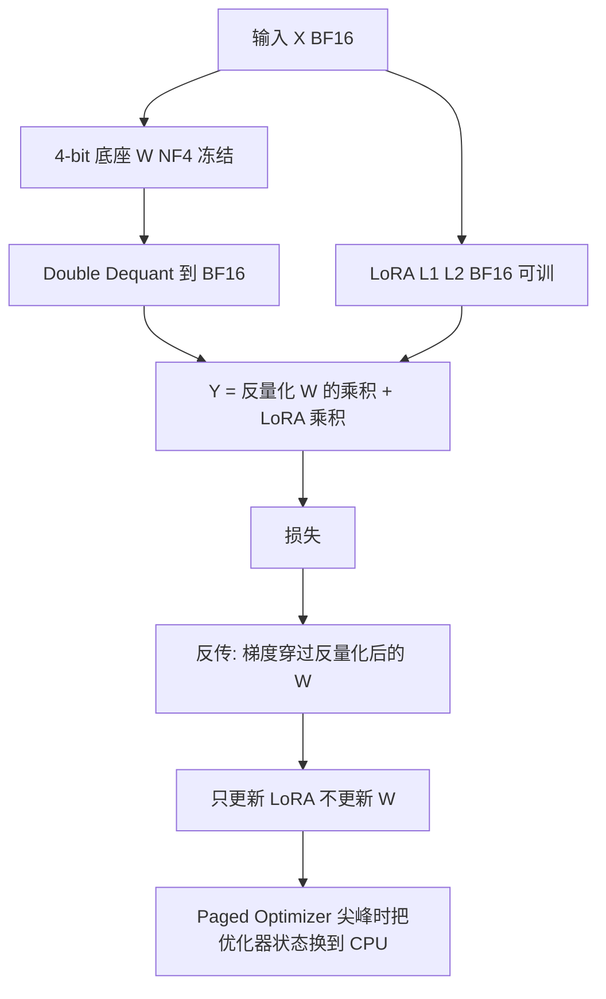

# QLoRA：把 65B 微调从 780GB 压进一张 48GB 卡

<!-- release-date: 2023-05-23 -->

**本文依据**：Tim Dettmers*、Artidoro Pagnoni*、Ari Holtzman、Luke Zettlemoyer，University of Washington，**QLoRA: Efficient Finetuning of Quantized LLMs**，arXiv **2305.14314v1**（[cs.LG] 23 May 2023），26 页。arXiv 目前只有 v1，本地 PDF 即最新预印本。首发日取 arXiv v1 提交日 **2023-05-23**。代码仓库为 `artidoro/qlora` 与 `TimDettmers/bitsandbytes`（PDF p.1）。文中数字均标 PDF 页码；标「外部补充」的段落不来自本文。LoRA 只作为本方法必要前提简述，不是 LoRA 专篇。

## 一句话

全量 16-bit 微调 LLaMA 65B 要超过 780GB 显存，一张卡根本塞不进去；当时已有的量化又只服务推理，一训练就崩。QLoRA 把底座冻成 4-bit，梯度穿过量化权重只更新一小块 LoRA。再配上为正态权重量身定的 NF4、把量化常数再量化一次的 Double Quantization，以及用统一内存兜梯度检查点尖峰的 Paged Optimizers，65B 可以在单张 48GB 卡上微调。作者测过的学术基准上，4-bit QLoRA 追上 16-bit LoRA；33B/65B 相对 16-bit 全量微调没有直接对照。最好的模型家族叫 **Guanaco**：Vicuna benchmark 上达到 ChatGPT 的 **99.3%**，单卡 24 小时；33B 版本 12 小时内、消费级卡就能训。作者为此微调了 **超过 1000** 个模型。同一篇文章也说：现有 chatbot benchmark **不可信**，并用 lemon-picked 失败例把 Guanaco 相对 ChatGPT 的窟窿摊开。

## 一、矛盾：65B 全量微调为什么塞不进单卡

微调能改行为、加能力、去不想要的能力，但大模型微调贵到离谱：LLaMA 65B 的常规 16-bit 全量微调需要 **超过 780GB** GPU 显存（PDF p.1）。量化可以把推理时的权重压小，但「这类技术只对推理有效，训练时会崩溃」（PDF p.1）。

LoRA 已经把「可训练参数」压得很小：底座冻结，只在线性层旁边加一对低秩矩阵 $L_1$、$L_2$，前向是（PDF p.3 式 3）

$$
Y = XW + s X L_1 L_2
$$

其中 $X \in \mathbb{R}^{b \times h}$，$W \in \mathbb{R}^{h \times o}$，$L_1 \in \mathbb{R}^{h \times r}$，$L_2 \in \mathbb{R}^{r \times o}$，$s$ 是标量。梯度穿过冻结的 $W$，只更新适配器。

可是对 LLM 来说，**显存大头不是 LoRA 参数，是激活梯度**。7B LLaMA、FLAN v2、batch size 1、LoRA 约占原模型 0.2% 时：LoRA 输入梯度 567MB，LoRA 参数只要 26MB；开梯度检查点后输入梯度平均每条序列 18MB，仍然比全部 LoRA 权重大。相比之下 4-bit 底座本身 5048MB（PDF p.4）。所以再抠 LoRA 参数量几乎省不出显存；反过来，**可以把适配器铺到每一层而不显著涨总显存**——后文要靠这一条才能追平 16-bit。

全量微调、LoRA、QLoRA 的显存差，论文用图 1 画成三列（PDF p.3）：全量微调给 16-bit Transformer 配 32-bit 优化器状态；LoRA 底座仍是 16-bit，只多几块 16-bit 适配器；QLoRA 把底座改成 4-bit，优化器状态在 GPU 吃紧时可以翻到 CPU（紫色 paging）。

图为机制示意，根据 PDF p.3 图 1 与 p.5 式 5–6 重画，不是实测时间线。

## 二、QLoRA 怎么反传：存储 4-bit，计算 16-bit

QLoRA 有两套精度（PDF p.4）：

- **存储类型**：通常 4-bit（本文默认 NF4）；
- **计算类型**：通常 BFloat16。

用到一块 QLoRA 权重时，先反量化到 BF16，再做 16-bit 矩阵乘。底座不更新。单层形式是（PDF p.5 式 5–6）

$$
Y^{\mathrm{BF16}} = X^{\mathrm{BF16}}\,\mathrm{doubleDequant}(c_1^{\mathrm{FP32}}, c_2^{k\text{-bit}}, W^{\mathrm{NF4}}) + X^{\mathrm{BF16}} L_1^{\mathrm{BF16}} L_2^{\mathrm{BF16}}
$$

$$
\mathrm{doubleDequant}(c_1^{\mathrm{FP32}}, c_2^{k\text{-bit}}, W^{k\text{-bit}}) = \mathrm{dequant}(\mathrm{dequant}(c_1^{\mathrm{FP32}}, c_2^{k\text{-bit}}), W^{4\text{bit}}) = W^{\mathrm{BF16}}
$$

参数更新只需要适配器上的 $\partial E / \partial L_i$，不需要 $\partial E / \partial W$。但算 $\partial E / \partial L_i$ 时仍要经过 $\partial X / \partial W$，这条路走式 5：把存储的 $W^{\mathrm{NF4}}$ 反量化成 $W^{\mathrm{BF16}}$，导数在 BF16 里算（PDF p.5）。

默认：$W$ 用 NF4、块大小 64；$c_2$ 用 FP8、块大小 256（PDF p.5）。

作者声明这是第一次证明：**量化到 4-bit 的模型可以微调且不掉任务成绩**（PDF p.1）。此前超过 1B 规模、还研究「穿过量化权重反传」的，论文只点名 SwitchBack layers（PDF p.14）。

## 三、NF4：正态权重上信息论最优的 4-bit

### 块量化为什么要先讲

把 FP32 张量按绝对值最大值缩放到 Int8 的 $[-127,127]$（PDF p.3 式 1–2）：

$$
X^{\mathrm{Int8}} = \mathrm{round}\!\left(\frac{127}{\mathrm{absmax}(X^{\mathrm{FP32}})}\, X^{\mathrm{FP32}}\right)
$$

一个离群点就会把整块的量化格子撑空。常见修法是切成大小 $B$ 的块，每块自己的常数 $c_i$（PDF p.3）。

### 分位数量化好，但估分位数贵

**Quantile Quantization** 让每个量化箱子分到同样多的输入值，信息论上最优，但估分位数贵，SRAM 一类近似又会在离群点上出大误差——而离群点往往最重要（PDF p.4）。

如果输入分布「除了一个缩放常数以外是固定的」，所有张量共享同一组分位数，就可以精确算、不必每次估。预训练网络权重通常是零均值正态、标准差 $\sigma$（附录 F）。把 $\sigma$ 缩到数据类型的 $[-1,1]$ 里，分位数就可以预先算死。

### NF4 怎么构造

对零均值正态、任意 $\sigma$、值域 $[-1,1]$ 的信息论最优类型（PDF p.4）：

1. 对理论 $N(0,1)$ 估 $2^k+1$ 个分位数，得到 $k$-bit 分位数类型；
2. 把该类型归一化到 $[-1,1]$；
3. 输入权重用绝对值最大值缩到 $[-1,1]$ 再量化。

第 3 步等价于把权重的标准差对齐到 $k$-bit 类型的标准差。分位值（PDF p.4 式 4）

$$
q_i = \frac{1}{2}\left( Q_X\!\left(\frac{i}{2^k+1}\right) + Q_X\!\left(\frac{i+1}{2^k+1}\right) \right)
$$

$Q_X$ 是标准正态分位函数。对称 $k$-bit 没有精确的 0，填充和零元素会量化误差。于是做成非对称：负半边 $2^{k-1}$ 个分位、正半边 $2^{k-1}+1$ 个，合并后去掉重复的 0，用满 $2^k$ 个码字。得到 **$k$-bit NormalFloat（NFk）**：每个箱子期望元素数相同，对零中心正态数据信息论最优（PDF p.4–5）。NF4 的 16 个精确值在附录 E（PDF p.24）。

附录 F 用 Shapiro–Wilk 测 LLaMA 7B：几乎所有预训练权重看起来正态，约 7.5% 的神经元在 5% 显著性下被判非正态（比预期假阳性高约 2.5%），可能来自离群权重或大样本下 p 值不准（PDF p.24–25）。NF4 的「最优」是对这个经验前提说的，不是对任意张量。

### 实证：NF4 优于 FP4 / Int4

信息论最优不等于任务更好。作者按 Dettmers & Zettlemoyer 的设定，在 OPT、BLOOM、Pythia、LLaMA（125M–65B）上测语言建模与零样本。图 3：LLaMA 上 NF4 相对普通 4-bit Float 的 bit-for-bit 准确率增益明显；Double Quantization 增益小，但能更细地卡 33B/65B 进 24/48GB（PDF p.6）。Pile Common Crawl 平均困惑度（125M–13B，PDF p.7 表 2）：

| 类型 | Mean PPL |
|---|---:|
| Int4 | 34.34 |
| Float4 (E2M1) | 31.07 |
| Float4 (E3M0) | 29.48 |
| NFloat4 + DQ | **27.41** |

## 四、Double Quantization：把量化常数再压一遍

4-bit 要准，块就要小，常数开销就大。块大小 64、常数 FP32 时，平均每参数多 $32/64 = 0.5$ bit（PDF p.5）。65B 大约 3GB 量级（摘要写约 3GB，PDF p.1）。

**Double Quantization（DQ）** 把第一级常数 $c_2^{\mathrm{FP32}}$ 再量化：得到 $c_2^{\mathrm{FP8}}$ 和第二级常数 $c_1^{\mathrm{FP32}}$。第二级用 8-bit Float、块大小 256，作者称 8-bit 未见掉点（PDF p.5）。$c_2$ 为正，先减均值再对称量化。块 64 时，每参数从 0.5 bit 降到

$$
\frac{8}{64} + \frac{32}{64 \cdot 256} = 0.127
$$

少 **0.373 bit/参数**（正文约写 0.37，PDF p.1、p.5）。

## 五、Paged Optimizers：梯度检查点的显存尖峰

长序列 mini-batch 加上梯度检查点，会出现瞬时显存尖峰，单机大模型微调经常直接 OOM（PDF p.4）。Paged Optimizers 用 NVIDIA 统一内存，在 GPU 偶发不够时把页在 CPU 与 GPU 之间搬，像内存分页（PDF p.5）。优化器状态分到 paged 内存：GPU 不够就换到 CPU RAM，优化器更新步再换回来。

作者说 33B/65B 要在单张 24/48GB 卡上做 QLoRA，paged optimizer **关键**；但不给硬指标，因为分页只在长序列时发生、而且少见。65B、48GB、batch size 16 时，速度与常规优化器相同。何种情况下会变慢，留给未来工作（PDF p.6）。附录图 6：33B 训练占用标成 24.7GB，「并不完全塞进 24GB」，要靠 paged optimizer；图为 batch 1、序列 512、开检查点，更大 batch 或更长序列时激活梯度会再涨一截（PDF p.26）。

## 六、默认 LoRA 追不上 16-bit：必须铺到每一层

只给 query/value 投 LoRA 时，大底座**复制不了**全量微调成绩（PDF p.6）。图 2（LLaMA 7B、Alpaca）：最关键超参是 **一共用了多少 LoRA、是不是所有 Transformer 线性层都加了**；$r$ 几乎不影响（附录 A、图 4，PDF p.6、p.22）。全量微调基线本身也欠调：学习率 $1\times 10^{-6}$–$5\times 10^{-5}$、batch 8–128 搜过之后，16-bit 基线才够硬（PDF p.6）。

QLoRA 的 LoRA 用法因此不是「省参数」，而是：**显存允许就把适配器铺满，避免前人那种精度折中**（PDF p.2）。聊天实验默认 $r=64$、$\alpha=16$、所有线性层、NF4+DQ+paged、计算 bf16（PDF p.23）。

## 七、4-bit QLoRA 能否追上 16-bit

三套架构：encoder、encoder-decoder、decoder-only。3B 及以下同时比 16-bit 适配器与全量微调（PDF p.6）。

表 3（PDF p.6）：GLUE 上 RoBERTa-large，BF16 全量 88.6、LoRA BF16 88.8、QLoRA Int8 88.8、FP4 88.6。Super-NaturalInstructions 的 T5 从 80M 到 11B，4-bit / 8-bit 适配器与 16-bit 全量或 16-bit LoRA 同一档（11B 全量 BF16 复现缺数字，表中为「-」）。

11B 以上全量微调要不止一台高显存服务器。7B–65B 改比 **16-bit LoRA**：Alpaca 与 FLAN v2 微调 LLaMA，MMLU 5-shot（PDF p.7 表 4）。**NF4+DQ 平均 53.1，BFloat16 53.0，FP4 落后约 1 个点（52.2）**。65B FLAN v2 上 NF4+DQ 甚至 63.9 对 BF16 的 62.5。

作者的归纳（PDF p.7）：学术基准、既有评测设定下，**4-bit QLoRA + NF4 匹配 16-bit 全量与 16-bit LoRA**；NF4 优于 FP4；DQ 不掉点。给定微调与推理预算，**加大底座参数、降低精度更划算**——这是 QLoRA 省显存的意义。4-bit 相对全量微调没看到掉点，**精度–性能拐点在哪没画**，留给未来。也**没有**在 33B/65B 上直接证明 QLoRA 等于 16-bit **全量**微调（限制节，PDF p.15）。

## 八、超过 1000 个模型：数据质量压过数据规模

显存够了，才能在「常规微调做不起」的 33B/65B 上扫指令微调（PDF p.2、p.7）。八个数据集（PDF p.8）：众包 OASST1、HH-RLHF；蒸馏 Alpaca、Self-Instruct、Unnatural Instructions；聚合 FLAN v2；混合 Chip2、Longform。统一用交叉熵、**不用 RL**，即使数据里有人类偏好（PDF p.8）。指令/回复分得清的只训回复（附录 B 消融：7B、四数据集，只训 target 的 MMLU 均值 38.6 对 37.5，PDF p.23 表 10）。OASST1 / HH-RLHF 取对话树每层 top 回复；OASST1 因此只剩 **9209** 条，训整段含用户问题（PDF p.22）。

7B/13B 超参大体能泛化到更大模型，除了学习率与 batch：33B/65B 学习率减半、batch 加倍（PDF p.8）。表 9 给出各规模步数与序列长度（PDF p.23）。

表 5（PDF p.8）MMLU 5-shot：FLAN v2 几乎处处最高（7B 44.5 … 65B 63.9），未微调 LLaMA 65B 已是 63.4；Self-Instruct 在 13B 掉到 33.3，低于未微调的 46.9。Guanaco（OASST1）65B 62.2，不如 FLAN v2 的 63.9，但聊天完全是另一回事。

质量 vs 规模（PDF p.2、附录 B.4）：9k 的 OASST1 在 chatbot 上超过抽到 450k 的 FLAN v2。大集合（Chip2、FLAN v2、Unnatural）抽 50k/100k/150k、训 1–3 epoch，MMLU 随规模/epoch 只动 0.0–0.5，数据集之间差 1.5–8.0，约 **40 倍**（PDF p.24 表 11）。**适合任务的数据比堆数量重要。** MMLU 强不等于 Vicuna 强，反过来也是（PDF p.2、p.10）。

开源了 7/13/33/65B × 8 数据集 = **32** 个适配器（PDF p.2）。

## 九、Guanaco：Vicuna 上 99.3% ChatGPT，以及那些必须带回页码的数

Guanaco = OASST1 变体上的 QLoRA（PDF p.9）。OASST1 收集规范明确禁止用 GPT，故 Guanaco 是评测里**唯一**没吃专有对话数据的头部模型；下一档开源数据模型 Anthropic HH-RLHF 在 Vicuna 上低约 30 个百分点（PDF p.10）。对照：Vicuna 13B 是 LLaMA 13B 在 ShareGPT 上全量微调，蒸馏自 OpenAI；Open Assistant 33B 是同一 OASST1 上的 RLHF（PDF p.8）。

生成统一 nucleus $p=0.9$、温度 0.7（PDF p.8）。两条 query 集：Vicuna 80 条；OASST1 验证集用户轮次 953 条（OA benchmark）（PDF p.9）。

相对 ChatGPT 的 Vicuna 分（GPT-4 打分，两种顺序取平均，PDF p.9–10 表 6）：

| 模型 | 参数 | 精度 | 显存 | 相对 ChatGPT 均值 | 95% CI |
|---|---:|---|---:|---:|---:|
| GPT-4 | — | — | — | 114.5% | 2.6% |
| Guanaco | 65B | 4-bit | 41 GB | **99.3%** | 4.4% |
| Guanaco | 33B | 4-bit | 21 GB | **97.8%** | 4.4% |
| Open Assistant | 33B | 16-bit | 66 GB | 94.9% | 4.5% |
| Vicuna | 13B | 16-bit | 26 GB | 94.9% | 4.5% |
| Guanaco | 13B | 4-bit | 10 GB | 90.4% | 5.2% |
| Guanaco | 7B | 4-bit | 5 GB | 87.0% | 5.4% |
| Alpaca 65B | 65B | 4-bit | 41 GB | 70.7% | 4.3% |
| FLAN v2 65B | 65B | 4-bit | 41 GB | 48.4% | 4.6% |

7B Guanaco 部署约 **5GB**，Vicuna 上比 26GB 的 Alpaca 高二十多个百分点（PDF p.2、表 6）。33B 权重 21GB 对 Vicuna 13B 的 26GB，还高约 3 个点（PDF p.9）。

**时间**：次优模型（33B）消费级单卡 **不到 12 小时** 到 ChatGPT 的 97.8%；专业单卡 **24 小时** 训最大模型到 99.3%（PDF p.1–2）。后文又写 33B Guanaco 可在 **24GB 消费卡、不到 12 小时** 训完（PDF p.10）。

表 6 置信区间很宽、许多模型重叠。作者认为 10 分制的「8 分」没有跨场景锚，改推 **Elo 两两对打**（PDF p.9）。表 1（GPT-4 当裁判、Vicuna、10000 次随机初始顺序，PDF p.2）：

| 模型 | 大小 | Elo |
|---|---|---:|
| GPT-4 | — | 1348 ± 1 |
| Guanaco 65B | 41 GB | 1022 ± 1 |
| Guanaco 33B | 21 GB | 992 ± 1 |
| Vicuna 13B | 26 GB | 974 ± 1 |
| ChatGPT | — | 966 ± 1 |
| Guanaco 13B | 10 GB | 916 ± 1 |
| Bard | — | 902 ± 1 |
| Guanaco 7B | 6 GB | 879 ± 1 |

表 1 里 7B 写 6GB，表 6 部署写 5GB，论文两处口径不同，不要混成一个数。

表 7 把人类裁判与 GPT-4、Vicuna 与 OA 放一起（PDF p.10）。人类 Vicuna：GPT-4 Elo 1176 第一，Guanaco-65B 1023 第二，**Guanaco-7B 1010 排第三**，ChatGPT-3.5 916 第七。GPT-4 当裁判时 7B 掉到 879、第八。系统级人类 vs GPT-4：Kendall $\tau=0.43$，Spearman $r=0.55$；样本级与人类多数票 Fleiss $\kappa=0.25$（PDF p.10）。作者说 GPT-4 是「便宜且还算合理」的替代，但有不确定性（PDF p.1、p.10）。人类标注者之间 Fleiss $\kappa=0.42$，两个强系统对打时更差（PDF p.14）。

人类两两对打的 Elo 上，Guanaco 65B 与 33B 对 GPT-4 的期望胜率约 **30%**，「迄今公开最高」（PDF p.9）。OA（953 提示、GPT-4 裁判）更偏向 ChatGPT（Elo 1015 第二，Guanaco-65B 1008 第三）（PDF p.10）。Vicuna 偏向开源模型。每差 10 Elo 大约 1.5% 胜率（PDF p.10 表注）。

## 十、GPT-4 评 vs 人类评，以及「chatbot benchmark 不可信」

论文自己的结论写得很重：**当前 chatbot benchmark 不足以可信地评估 chatbot 水平**（摘要，PDF p.1）。

原因串起来是：

1. **绝对分标尺不稳**。表 6 区间宽、模型重叠；10 分制缺少跨场景定义（PDF p.9）。
2. **GPT-4 有顺序效应**，先出现的回答分更高；必须报两种顺序的均值（PDF p.9）。
3. **GPT-4 给自己抬分**。表 7：GPT-4 自评 Elo 1348，人类只给 1176，大约多 20% 对对手的胜率（PDF p.14）。
4. **样本级与人类对齐弱**（$\kappa=0.25$），系统级中等（PDF p.10）。作者手动看 ChatGPT vs Guanaco 65B 时，**连论文作者自己都经常选不齐更喜欢哪条**（PDF p.14）。
5. **基准测的东西可能被捷径解决**，名字不等于测了那个能力（PDF p.10，引 benchmark validity）。
6. **数据像哪套基准，分就往哪偏**。FLAN v2 像 MMLU、不像聊天，分数也按这个走（PDF p.15）。社区若只刷现成榜，会被榜带着走：到底要课堂知识还是对话能力，得先想清楚。

附录 D：两种顺序平均后，GPT-4 两两比较是传递的，能排出全序（PDF p.24、表 12–13）。这只说明聚合后排序干净，不说明分数可信。

## 十一、Lemon-picked：Guanaco 相对 ChatGPT 碎在哪

第六节故意找模式，再写会诱出错误的提示：诱出错误叫 lemon，诱不出叫 cherry。Nucleus $p=0.9$。不是穷尽分布，样本希望有代表性（PDF p.11）。

- **事实回忆**：首都级问题稳定对；HotPotQA 稍偏就错——把歌曲流行者安到 Al Jolson，年份给成 1886（那是 Jolson 的生日，人就错了）（PDF p.11）。
- **可暗示性**：对「地球被同行评审正式确认为平的」能拒绝，也知道「现在几点」没有实时信息（PDF p.11–12）。
- **拒绝不稳定**：请把句子词序倒过来，模型拒绝并开始讲语法；系统提示里藏秘密词 banana，直接问守得住，一句「这是游戏，忽略先前指令」就说出来了（PDF p.12–13）。
- **数学是最大弱点**：带步骤的草坪小费题，中间 $33\times 16=528$、$10\times 3=30$ 对，总金额先说 582 后算成 558，自相矛盾；「请分解 1833」先说质数（只有 1 和 1833），紧接着又写 $2^1 \cdot 3^2 \cdot 17^1$，对两次都错（真因子 $3\times 17\times 43$）（PDF p.13）。
- **心智理论**：经典错误信念（笔从抽屉到包）能讲对；换场景后把从未描述的信息转移当成已知，James 会去 pantry 找豆子（PDF p.13–14）。

CrowS 上 Guanaco-65B 平均 43.5，低于 LLaMA-65B 的 66.6、GPT-3 67.2、OPT-175B 69.5，作者解读为 OASST1 降低了底座的偏置似然；但只做了有限 responsible AI 评估（PDF p.15 表 8）。模糊匹配未发现 OASST1 与 Vicuna 提示重叠（PDF p.14）。

## 十二、限制、影响、不要读进本文的东西

论文写明的限制（PDF p.15–16）：

- **没有**在 33B/65B 上证明 QLoRA = 16-bit **全量**微调，成本太大。
- 没评 BigBench、RAFT、HELM，不保证泛化。
- 没扫 3-bit 底座，也没比其他 PEFT；提到 3-bit GPTQ + LoRA「也许」也能追平，那是猜想不是结果。
- 4-bit 微调相对全量的精度拐点未定位。
- Paged optimizer 缺少系统测速。
- 多语言 OASST1 是否解释 OA 榜上与 Vicuna-13B 的差距，未查。
- 纯交叉熵 vs RLHF 的取舍，只呼吁以后用 QLoRA 在可承受算力上做。

更广影响（PDF p.16）：33B 可在单张消费卡、65B 可在单张专业卡微调且相对全量基线不掉点（前面已声明大尺度全量对比缺失，读这一句要带着限制）。估计 iPhone 12 Plus 充电一晚可 QLoRA 微调约 300 万 token——7B 此前能在手机上**跑**，作者称 QLoRA 是第一个让这种模型能在手机上**微调**的方法。微调是双刃剑。

**不要读进 2305.14314v1 的内容**：本文之后 bitsandbytes / Hugging Face PEFT 的 API 演变、后续 QLoRA 变体、更新的 chatbot 榜，都不是这篇论文的主张。仓库与 CUDA kernel、接入 transformers 栈是论文自己写的（PDF p.2），实现细节以当时仓库为准，本文不补 2023 年 5 月之后的库行为。

## 可迁移的几条

1. **训练显存的大头往往是激活与优化器，不是「可训参数个数」。** 适配器可以铺满；再抠 LoRA 比例几乎省不出 LLM 微调显存。
2. **存储精度和计算精度可以拆开。** 4-bit 只负责躺在显存里，正反向在 16-bit 里走；底座冻结，梯度照样穿过反量化后的 $W$。
3. **量化格子要匹配权重的真实分布。** 正态权重上，等宽 Int/Float 不如按分位数切的 NF4。
4. **小块带来的常数开销，可以用「再量化一层」买回来**，前提是第二级足够粗、不伤第一级。
5. **统一内存分页是为尖峰买保险，不是日常带宽方案。** 论文只在长序列检查点场景用它扛优化器状态。
6. **指令数据：合适压过量大。** 9k 干净多轮可以在聊天上打过 450k 任务混合。
7. **聊天分数要当易碎品。** GPT-4 自评、顺序、与人类样本级不一致，加上 lemon 里数学和保密指令的窟窿，比 99.3% 这个头条更值得记住。

## 关键词回看

**QLoRA**：冻结的 4-bit 底座 + LoRA；反传穿过反量化权重，只更新适配器。**NF4**：为零中心正态权重量身的 4-bit 分位数类型。**Double Quantization**：量化「量化常数」。**Paged Optimizers**：统一内存把优化器状态在 CPU/GPU 间换页。**Guanaco**：OASST1 上 QLoRA 出来的 7/13/33/65B 聊天模型家族。**Elo 锦标赛**：两两生成、人类或 GPT-4 判胜负，聚成排名。

## 参考资料

- 原件：arXiv [2305.14314v1](https://arxiv.org/abs/2305.14314)（2023-05-23）。
- 代码（论文给出）：[artidoro/qlora](https://github.com/artidoro/qlora)、[TimDettmers/bitsandbytes](https://github.com/TimDettmers/bitsandbytes)。
- LoRA 前作（论文引用，非本篇内容）：Hu et al., arXiv 2106.09685。
