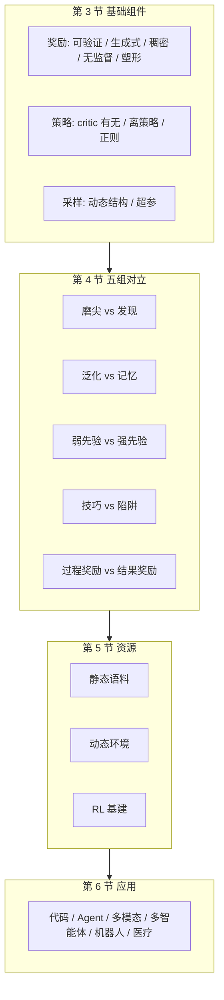

# RL-for-LRM-Survey：可验证奖励把 LLM 变成推理模型之后，下一刀切在哪

<!-- release-date: 2025-09-10 -->

**本文依据**：`A Survey of Reinforcement Learning for Large Reasoning Models`，arXiv 2509.08827**v3**（页眉 `[cs.CL] 9 Oct 2025`），**120 页**。封面日期印 2025-10-10，**没有会议名**。作者 Kaiyan Zhang、Yuxin Zuo 等（并列项目负责与核心贡献者名单见封面）；封面第一单位 **Tsinghua University**，另有 Shanghai AI Laboratory、Shanghai Jiao Tong University、Peking University、USTC、HIT、University of Washington、HUST、UCL 等（PDF p. 1）。通讯作者 Biqing Qi、Ning Ding、Bowen Zhou。清单仓 `TsinghuaC3I/Awesome-RL-for-LRMs` 印在封面（PDF p. 1）。盘上已是 v3。首发日取 arXiv v1 **2025-09-10**（Submitted on 10 Sep 2025）；v3 不回写。解读依据 v3。文中数字均标 PDF 页码；标「外部补充」的段落不来自本文。

## 一句话

把大语言模型（Large Language Model，LLM）训成大推理模型（Large Reasoning Model，LRM），主路径已经从「跟人的偏好对齐」换成「用能自动核对的奖励做强化学习」。作者把这条线叫 **RLVR**（Reinforcement Learning with Verifiable Rewards，带可验证奖励的强化学习）：数学对不对、代码测例过不过，比学一个打分模型更扛 hack。OpenAI o1 与 DeepSeek-R1 之后，训练算力与测试时「想多久」成了预训练之外的新缩放轴（PDF p. 1、p. 4）。

这张综述的主矛盾不是「再列一遍 PPO 变体」，而是：**可验证任务上 RL 已经能把推理拉长、拉出反思；再往上缩放，卡的是算法、数据、基础设施，以及一堆还在打架的基础问题**——RL 是在磨已经会的答案，还是在发现新轨迹；SFT 记死、RL 能迁；过程奖励与结果奖励谁更能撑规模（PDF p. 4–5、p. 32）。下一阶段他们点名 **open-ended RL**（开放式强化学习），还没有定论（PDF p. 4 图 2）。

贯穿全文的轴不是「谁分数最高」，而是：**奖励从哪来、策略怎么更、样本怎么抽、这三件事能不能撑住长期与环境互动。**

## 一、这张地图切了几刀

### 旧图切不动的地方

经典 RL 用窄、明确的奖励把智能体推到超人类：AlphaGo / AlphaZero 靠自对弈（PDF p. 4）。LLM 时代第一波 RL 是后训练对齐：RLHF（Reinforcement Learning from Human Feedback，人类反馈强化学习）与 DPO（Direct Preference Optimization，直接偏好优化）把模型往 3H（helpful、honest、harmless）拧（PDF p. 4）。图 2 把这条时间线画成四段：2022 RLHF、2023 DPO、2025 RLVR，再往后是仍空着的 open-ended RL（PDF p. 4）。

o1 报告说：训练期再加 RL、推理期再多「想」，成绩都平滑涨（PDF p. 4）。R1 用规则化准确率奖励（数学）与编译器 / 测例奖励（代码），并用 **GRPO**（Group Relative Policy Optimization，组相对策略优化）在基座上就能诱发出规划、反思、自我纠正，不必先过一轮监督微调（他们叫 Zero RL）（PDF p. 4、p. 7）。推理被重写成可以显式训练、显式缩放的能力：中间思维链（chain-of-thought，CoT）吃测试时算力，奖励最大化走能自动核对的地方（竞赛数学、竞赛编程、部分科学）（PDF p. 4）。RL 还可以自己造训练数据，缓解语料墙（PDF p. 4）。作者把继续缩放的目标写成通向 **ASI**（Artificial SuperIntelligence，人工超级智能）的一条候选路——这是他们的志向，不是已证明的事实（PDF p. 1、p. 4）。

先前综述要么只讲一般 RL，要么把 RL 当成推理方法里的一块；对齐向综述停在 RLHF / RLAIF / DPO。本文把 **RL 本身**放在中心，覆盖奖励、策略优化、采样，并盯长期交互与演化（PDF p. 10）。

### 建模这一刀：把语言模型嵌进 MDP

第 2.1 节把 MDP 元组 $(S,A,P,R,\gamma)$ 映到语言（PDF p. 5–6 图 3）：

- 提示 $x$ 是初态，来自数据集 $\mathcal{D}$。
- 策略 $\pi_\theta$ 就是语言模型，吐出 $y=(y_1,\ldots,y_T)$。
- 状态 $s_t=(x,a_{1:t-1})$：提示加上已生成 token。
- 动作可按粒度：整段序列、单个 token、或一段 step。
- 转移在纯文本里通常确定：$s_{t+1}=[s_t,a_t]$；碰到结束符进终态。
- 奖励可在轨迹末、逐步、或逐步段给。
- 回报 $G$ 常取 $\gamma=1$ 的有限视野；序列级奖励时 $G$ 就是那个标量 $R(x,y)$。

目标是（PDF p. 6 式 (1)）：

$$
\max_\theta J(\theta) := \mathbb{E}_{x\sim\mathcal{D},\,y\sim\pi_\theta(x)}[G].
$$

实践里常加相对参考策略 $\pi_{\mathrm{ref}}$ 的 KL 约束，稳住语言质量（PDF p. 6）。

### 四块总图，而不是「问题 → 方案 → 实验」

图 1 是整篇的目录图（PDF p. 1）。四块、顺序即叙事：

1. **基础组件**（第 3 节）：奖励设计、策略优化、采样策略。
2. **基础问题**（第 4 节）：五组还在打架的对立。
3. **训练资源**（第 5 节）：静态语料、动态环境、基础设施。
4. **应用**（第 6 节）加 **未来方向**（第 7 节）。

中间那根竖轴是作者自己的焦点：**语言智能体与环境的大规模交互，沿训练步长期演化**（PDF p. 1）。

图是机制示意，对应 PDF p. 1 图 1 与目录。**轴本身是这篇综述的主贡献**；收了多少篇是副产品。

### 第二刀：前沿模型时间线（铺地图，不当排行榜）

第 2.2 节按三条线排：语言 LRM、Agent 向 LRM、多模态 LRM（PDF p. 7）。表 1 列开源代表：日期、机构、结构、参数、算法、模态（PDF p. 8–10）。只记综述写了的、用来标定坐标的几条：

| 时间（表 1） | 模型 | 参数量 | 算法（表内） | 模态 |
|---|---|---:|---|---|
| 2025.01 | DeepSeek-R1 | 671B | GRPO | Text |
| 2025.03 | ORZ | 0.5–32B | PPO | Text |
| 2025.04 | Qwen3 | 0.6–235B | GRPO | Text |
| 2025.06 | Minimax-M1 | 456B | CISPO | Text |
| 2025.07 | Kimi K2 | 1T | OPMD | Text |
| 2025.07 | Intern-S1 | 241B | GRPO | T/I/V |
| 2025.07 | Qwen3-2507 | 4–235B | GSPO | Text |
| 2025.08 | gpt-oss | 117B / 21B | 表内为「-」 | Text |
| 2025.09 | DeepSeek-V3.2-Exp | 671B | GRPO | Text |

（PDF p. 8–10 表 1。表内「-」表示综述未填算法，不要补。）

正文还点了：Claude-3.7-Sonnet 混合推理；Gemini 2.x 更长上下文；Seed-Thinking 1.5 跨域泛化；o3 / GPT-5 更深推理与在「省」和「想」之间切换；QwQ-32B 对齐 R1 量级；Skywork-OR1 在 R1 蒸馏上做可缩放 RL；Minimax-M1 用混合注意力给 RL 省算力；Magistral 24B 不靠蒸馏、从零 RL；Kimi K2 针对 Agent、含不可验证奖励；GLM-4.5 与 DeepSeek-V3.1 强调工具（PDF p. 7）。多模态侧：多数闭源已原生多模态；开源有 Kimi 1.5、QVQ、Skywork R1V2（MPO+GRPO）、InternVL3 / 3.5（级联 RL）、Intern-S1（混合奖励）、GLM-4.5V 等（PDF p. 7–8）。图 4 是时间线（PDF p. 8）。

## 二、每一区里有什么

下面按第 3–6 节走。**Takeaway 框是作者写在各小节开头的收敛句**；框外点名的工作是地图上的钉子。哪些还在打架，放到第三节。

### 3.1 奖励：五层，不是「有没有 RM」一刀

第 3.1 节自己又切五层：可验证、生成式、稠密、无监督、塑形（PDF p. 11）。图 5 是组件分类总图（PDF p. 12）。

**可验证奖励。** 作者开篇 takeaway：规则奖励在数学 / 代码上可缩放、可靠；**Verifier’s Law**（验证者定律）说任务越好自动验证，RL 越好优化，主观任务仍难（PDF p. 11）。RLVR 这个名字来自 Tülu 3：用程序化核对器换掉学出来的奖励模型，给二元、可核对信号（PDF p. 11）。DeepSeek-V3 / R1 明确写：大规模 RL 里学出来的 RM 容易 reward hacking，能上规则就上规则（PDF p. 11）。两种常用规则奖励（PDF p. 13）：

- **准确率**：数学要求答案落在指定分隔符（常见 `\boxed{...}`），自动比对；代码用测例或编译器过 / 不过。
- **格式**：思维链放进 `<think>...</think>`，答案另栏，方便大规模解析。

规则核对器大量靠人工等价规则；数学侧常用 Math-Verify 与 SymPy；DAPO、DeepScaleR 也开源了核对器。Huang 等指出规则核对与模型核对各有独特失败模式（PDF p. 13）。适合 RL 的任务要同时满足：有明确真值、核对快、能评很多候选、奖励与正确性对齐。开放问答、自由写作仍难（PDF p. 13）。作者后来说：第 6 节能做成的应用，核心往往就是可靠可验证反馈；第 7 节的开放问题，往往就是没有这种反馈（PDF p. 13）。

**生成式奖励（GenRM）。** 规则覆盖不到主观域。GenRM 不吐一个标量，而吐结构化批评、理由、偏好（PDF p. 13）。两条用途：可验证任务里补规则的假阴性（格式对但字符串对不上）；不可验证任务上让 RL 能做（PDF p. 13–14）。趋势：先让 RM **想再判**（LLM-as-a-Judge、CLoud RM 先写自然语言批评再打分），用 rubric（评分细则）约束，或与策略在同一 RL 环里共进化（PDF p. 13 框、图 5：RM-R1、DeepSeek-GRM、K2、Critique-GRPO 等）。

**稠密奖励。** 经典游戏 / 机器人里逐步给反馈能缩短信用分配、提高样本效率，但塑形错了会 hack（PDF p. 15 附近 takeaway）。粒度：token 级（Implicit PRM、PRIME、SRPO）、step 级（PURE、VinePPO、TreeRPO / TreeRL）、turn 级（工具与多轮：ToolRL、SWEET-RL）（PDF p. 12 图 5）。开放域生成仍难定义稠密奖励（PDF p. 15 框）。

**无监督奖励。** 去掉人工标注瓶颈，让奖励跟算力与数据走，不跟人走（PDF p. 17 框）。分模型内信号（一致性、自信、自造知识：TTRL、RENT、Absolute Zero、Spurious Rewards）与模型无关外部启发（SEAL、RPT）（PDF p. 12）。这和「随机奖励也能推 Qwen」那条争论直接相连，见第 4.1、4.3 节。

**奖励塑形。** 把稀疏信号变成稳的梯度：规则塑形（Qwen2.5-Math、R1、Laser）与结构塑形（GRPO 组基线、RLOO、Pass@K 对齐目标）（PDF p. 12、p. 19 框）。作者建议：核对器与奖励模型一起用，组基线加与评测对齐的 Pass@K 目标（PDF p. 19）。

### 3.2 策略优化：有没有 critic，是不是这一代的主分岔

先给统一的 PPO 风格目标（PDF p. 21 式 (5)）：对 $N$ 条样本、逐步重要性比 $w_{i,t}$、优势 $\hat A_{i,t}$、裁剪。表 3 把代表算法按「优势怎么估、重采样、损失聚合」摊开：PPO（2017，Critic-GAE，token 级）→ ReMax、RLOO → GRPO（组相对、序列级）→ PRIME、VAPO、Dr.GRPO、DAPO、CISPO、GSPO、LitePPO、GFPO 等（PDF p. 21 表 3）。

**有 critic。** takeaway：critic 用一小撮有标数据训，给未标注 rollout 提供可缩放的 token 级价值；但它必须跟 LLM 一起跑、一起更，算力开销大，长 CoT 上衰减不友好（PDF p. 21–22）。RLHF 的标准三步：人标偏好 → 训奖励模型 → PPO + 价值网络（PDF p. 22 式 (6)–(9)，GAE）。长推理上有人做 Value-Calibrated PPO、VAPO、VRPO；另一路 Implicit PRM / PRIME 直接吐 token 级奖励（PDF p. 22–23）。ORZ 表明规则奖励下 Monte-Carlo 估计也能稳着缩放（PDF p. 23）。

**无 critic。** takeaway：只需序列级奖励，更省、更可缩放；RLVR 里规则信号能避开 critic 带来的 hacking（PDF p. 23）。REINFORCE 把整段当一个 bandit 动作，方差大；ReMax 用贪心基线、RLOO 用留一法、REINFORCE++ 掺 PPO/GRPO 的裁剪与全局归一（PDF p. 23–24）。**GRPO**（PDF p. 24 式 (11)–(12)）对同一提示采 $G$ 条，组内相对归一当优势，组内所有 token 共享同一 $\hat A_i$。DAPO、CISPO、Dr.GRPO、LitePPO 改采样、裁剪阈值、损失归一；GSPO 把裁剪改到序列级（PDF p. 24）。VinePPO 用 Monte-Carlo 换掉学出来的 critic；K1.5 用镜像下降；FlowRL 匹配完整奖励分布而不是最大化标量，针对 mode collapse（PDF p. 24）。HeteroRL 把 rollout 与参数更新拆开做异步，文称在严重延迟下（例如 1800 秒）性能下降小于 3%（PDF p. 24）。这些数字是各论文自称、综述转述，不是本综述自己测的。

**离策略与混合。** 采集策略与学习策略分开，能吃历史、异步、离线数据；现代做法把离策略、离线、在策略（含 SFT+RL）混着用（PDF p. 25 框）。代表：SPO、TOPR、ReMix；混合如 LUFFY、ReLIFT、UFT、BREAD、SRFT、Prefix-RFT（PDF p. 12 图 5）。

**正则。** KL、熵、长度惩罚都在用，**最优形式仍开放**（PDF p. 27 框）。KL 该不该加、加多少，综述直接说「极具争议」（PDF p. 27）。熵侧有 DAPO、KL-Cov / Clip-Cov、HighEntropy-RL；长度侧有 ALP、LASER、L1、O1-pruner（PDF p. 12）。

### 3.3 采样：已经是一等杠杆

高质量、多样的 rollout 稳住训练；探索多样轨迹与采样效率是根本权衡（PDF p. 29 框）。动态采样改「抽哪些提示、每条采几条」：PRIME、DAPO、K1.5、AdaRFT、DARS 等（PDF p. 12）。超参 takeaway：乱设会熵崩、浪费；可缩放 RL 靠一整套：分阶段拉长上下文、动态控探索（PDF p. 31 框）。超长回复怎么处理没有共识：有人软线性罚、有人在奖励里加可调 $\alpha$；更细的是短预算（8k–16k）时过滤超长、大预算（32k）时改惩罚，因为很长时过滤会变有害（PDF p. 32）。DAPO 的 Clip-Higher 把上裁剪抬高（例如 $\epsilon_{\mathrm{low}}=0.2$、$\epsilon_{\mathrm{high}}=0.28$），让小概率但可能有用的 token 更容易涨上去（PDF p. 37）。

### 第 5 节 资源：从「堆规模」到「可核对」

**静态语料。** takeaway：从堆原始数据转向更高质量、可验证监督（蒸馏、过滤、自动评）；覆盖从数学 / 代码 / STEM 扩到搜索、工具、带 plan–act–verify 轨迹的 Agent（PDF p. 39）。表 4 按域列（PDF p. 40）。数学：LIMO 800 条、LIMR 1.39k（精）、DAPO 17k、Big-MATH 47k、DeepScaleR 40.3k、NuminaMath 1.5 为 896k、OpenR1-Math 220k、OpenMathReasoning **5.5M**、MiroMind-M1-RL-62K 为 62k。代码：SWE-Gym 2.4k、KodCode 268k、OpenCodeReasoning 735k、rStar-Coder 592k。STEM：NaturalReasoning 2.15M、ReasonMed 1.11M、MegaScience 2.25M、SSMR-Bench 16k。Agent：Search-R1 221K、WebShaper **0.5K**、ASearcher 70K。混合：SYNTHETIC-1/2 为 2M / 156K、Llama-Nemotron-PT **30M**、AM-DS-R1-0528-Distilled 2.6M（PDF p. 40 表 4）。格式列 Q-A 或 Q-C-A（带 CoT）。

**动态环境。** 静态集不够撑更强、更可泛化的推理；要转向合成数据与可交互环境（gym、世界模型）（PDF p. 42 框）。正文按规则、代码、游戏、模型集成等展开（目录 PDF p. 2；图 1）。

**基建。** 现代 RL 基建是灵活流水线加通信层，在智能体 rollout 与策略训练之间分资源，通常包在成熟分布式训练与推理引擎外（PDF p. 45 框）。图 1 点名 OpenRLHF、veRL、AReaL、slime、TRL（PDF p. 1）。Agent / 多智能体 / 多模态变体常支持异步 rollout 与标准化环境接口（PDF p. 45）。

### 第 6 节 应用：Verifier’s Law 的实证区

六块，每块都有 takeaway。共同模式：**能自动核对的先被 RL 吃透；不能核对的改 rubric、DPO、离线 RL，规模与稳定性仍开放。**

- **代码**（PDF p. 48）：竞赛与领域代码生成已被推进；可缩放性、跨任务泛化、大规模软件里的稳健自动化仍开放。分代码生成、（综述后文的）修复与 Agent 闭环。
- **Agent**（PDF p. 51）：工具使用是基本能力；Agent RL 能做出更复杂行为，但环境内 rollout 又贵又长。异步与记忆 Agent 减延迟，进一步进展仍靠更好的训练数据。分组：Coding Agent、搜索、浏览器、DeepResearch、GUI / Computer-use 等。
- **多模态**（PDF p. 54）：RL 用来补少数据、长视频推理、对数字 / 属性敏感的跨模态生成；**理解与生成的统一 RL 框架被写成紧急任务**。
- **多智能体**（PDF p. 57）：协作、推理、信用分配；高效交互机制仍是锁。
- **机器人**（PDF p. 58）：把 LLM 式 RL 迁到 VLA（Vision-Language-Action）；用环境交互与简单奖励，GRPO / RLOO / PPO 等在少监督下做出新行为。
- **医疗**（PDF p. 60–61）：可验证题（计算、诊断分组、带真值的 QA）走 SFT+RL 与规则奖励、GRPO；生成类（报告、多轮问诊、治疗计划）走 DPO、rubric、课程 RL、离线 RL。Baichuan-M2 用病人模拟器与临床 rubric 做动态核对（PDF p. 61）。不可验证任务上的大规模 RL 仍稀。

## 三、作者的判断（和他们综述到的事实分开）

第 3、5、6 节的分类、表 1 / 表 3 / 表 4、各论文数字，是「他们综述到的事实」。第 4 节的五组对立、第 7 节路线、以及各 takeaway 里「仍开放 / 没有共识」，是「他们认为缺什么、什么在打架」。下面只写后一层。

### 4.1 磨尖还是发现

一边：RL 不创造新模式，只把基座里已经有的正确回答再加权（sharpening）。Limit-of-RLVR：Pass@1 升、大 $k$ 的 Pass@K 往往不如基座广采样，像是在收窄搜索而不是挖新轨迹（PDF p. 33）。「Aha」可能是预训练里已有的；高熵分叉 token、RENT / TTRL 无外部奖励也能涨；**虚假 / 随机奖励也能推动 Qwen**（Spurious Rewards），像是在浮现已有特征（PDF p. 33）。1-shot RLVR 也能大幅抬数学，同样像激发潜伏能力（PDF p. 33）。RL’s Razor：在线 RL 保先验比 SFT 好，优势是适应时少忘，不是发现全新行为（PDF p. 33）。

另一边：ProRL / ProRL v2 说足够长、足够稳的 RL 能把推理边界往外推，Pass@1 与 Pass@K 一起好（PDF p. 33）。有人批评 Pass@K 口径，改 CoT-Pass@k，论证 RLVR 在激励正确推理路径而不只是蒙对终点；自对弈出题保熵；直接优化 Pass@K；以及「组合已有技能变成新技能」（PDF p. 33）。

作者的调和：不要再问「或」，要问**什么条件下谁占上风**。反向 KL 的 mode-seeking 解释磨尖；隐式奖励学习与足够长的训练解释组合式发现（PDF p. 33–34）。理论侧有人把 RLHF 看成偏好数据上的隐式模仿、把 SFT 看成逆 RL（PDF p. 32–33）。这是作者的阅读框架，不是新实验。

### 4.2 RL 对 SFT：泛化还是记忆

Chu 等跨文本与视觉环境的原话被综述引成：「SFT memorizes, RL generalizes。」（PDF p. 34）数学上 RL-on-math 能保住甚至抬非数学与指令跟随，SFT-on-math 常负迁移、灾难遗忘（PDF p. 34）。长 CoT SFT + 规则 RL 扩深度与反思；短 CoT SFT 容易过拟合表面（PDF p. 34）。

反例：RL 不是万灵。泛化强依赖初始数据与核对奖励；严重过拟合或陡分布偏移时 RL 救不回来；SFT 加再加权 / 信任域可以当稀疏奖励 RL 的下界，并给后续 RL 打底（PDF p. 34–35）。统一或交替：UFT、SRFT、Interleaved、从专家锚点做 branch rollout（小模型、高难度、成功轨迹极稀时，传统「先 SFT 再 RL」可能整段失败）（PDF p. 35）。Ma 等：RL 擅长巩固已有能力，SFT 更擅长注入新知识（PDF p. 35）。

作者收束：**可验证任务、大分布偏移上 RL 更像「真泛化」，但不是万灵；最佳实践在往统一 / 交替混合收**（PDF p. 35）。缺标准化、可复现的 OOD 基准；还要防污染、分清真会做题还是背答案（PDF p. 35）。

### 4.3 弱先验与强先验

作者判断：有足够强的先验 + 可验证奖励时，瓶颈从「模型多大」转到「环境与评测怎么设计」（PDF p. 35）。R1-Zero 直接在基座上大规模规则 RL；R1 先短冷启动 SFT 再 RL。ORZ 用极简配方在 Qwen 基座上拉长回复、拉高分。**基座往往比已经对齐过的 Instruct 更适合 RL**——Instruct 上的格式 / 服从先验会干扰奖励塑形（PDF p. 35–36）。

家族不对称：One-shot RLVR 让 Qwen2.5-Math-1.5B 的 MATH500 翻倍级；Spurious Rewards 里 Qwen 在随机奖励下也涨，Llama / OLMo 常常不涨（PDF p. 36）。处方：弱先验家族先 mid-training / annealing（晚预训练降学习率、加码数学代码高质量源，Llama 3、MiniCPM、OLMo 2 都有类似阶段），再 RLVR，把 Llama 拉得更「Qwen 友好」（PDF p. 36）。强蒸馏 / Instruct 也能再涨（AceReason-Nemotron），但课程、核对、长度控制更苛刻；推理变强常伤指令跟随（MathIF）（PDF p. 36–37）。作者三条总结：基座作起点更稳；Qwen 与 Llama 不对称；强模型要多目标（格式、短、服从 + 正确）（PDF p. 37）。

### 4.4 技巧还是陷阱

GRPO 简化了 PPO 系工程，但稳与效率仍靠动态采样、重要性比、多层归一。Xiong 等拆 GRPO：最大头来自**丢掉全错样本**，不是复杂归一；更简单的 RAFT / Reinforce-Rej 也能接近（PDF p. 37）。DAPO 把动态采样 + Clip-Higher 做成可复现大规模配方，并在 AIME24 强基线上报 SOTA（综述转述，PDF p. 37）。GRESO：预过滤让 rollout 快 2.4 倍、整段训练快 2.0 倍、性能损失很小（PDF p. 37）。GSPO 序列级裁剪，MoE 上更稳；S-GRPO 把多余推理缩短 35%–61%、准确率略升（PDF p. 37）。Dr.GRPO 指出 GRPO「错得越长罚得越狠」；BNPO 又把归一抬回来——**两派证据矛盾，把归一当万能解是误导**（PDF p. 37–38）。

作者最重的一刀：Liu 等把常见技巧放进同一开源框架做隔离实验，极简组合能在多种配置上超过 GRPO 与 DAPO；领域最紧迫的是 **实验设置不一致、报告不全、结论互相打架**（PDF p. 38）。「科学训练」要统一协议、可验证奖励、以及随规模走的性能–成本曲线，而不是只在某个数据 / 某个模型上有效（PDF p. 38）。

### 4.5 过程还是结果

「Reward is Enough」假设：设计对的奖励、最大化回报，原则上能长出智能的各方面（PDF p. 38）。LLM 里则是结果奖励（对不对、测例过不过）对过程奖励（逐步密反馈，PRM）。可验证时结果奖励最简单、最好缩放，但可能鼓励不忠实 CoT（先写答案再编理由）、规则 RL 的幻觉推理（PDF p. 38）。Lightman 等：数学上过程监督的 PRM 比只看结果更稳，显著更好；逐步标注极贵，跨域质量掉，启发式 / Monte-Carlo 合成易偏（PDF p. 38）。作者判断：结果给「可缩放的目标对齐 + 自动核对」，过程给「可解释的密指导」；结合（隐式过程建模、生成式核对器）可能是奖励设计的下一站（PDF p. 38–39）。超长回复惩罚也没有共识（见 3.3）。

### 第 7 节：他们想把缩放推去哪

九条，都是开放研究方向，不是已收敛结论（PDF p. 61–65）：

1. **持续 RL**：混数据 vs 多阶段谁更好仍争；LLM 的知识与推理缠在一起，不像游戏里任务可模块化；要在稳定与塑性之间找 CRL（PDF p. 62）。
2. **基于记忆的 RL**：现有记忆多为当前任务服务；要把记忆变成跨任务可复用的经验库，让 RL 学会管记忆（PDF p. 62）。
3. **基于模型的 RL**：世界模型给出状态与奖励；生成式 / 视频预训练世界模型已可用，与 LLM Agent 的无缝结合仍开放（PDF p. 63）。
4. **教 LRM 高效推理**：过思考与欠思考并存；按实例难度分配「想多久」还没有原则性的成本–性能权衡（PDF p. 63）。
5. **潜空间推理（LSR）**：离散 token 采样可能丢掉连续语义；LSR 对 RL 更友好，但连续思维的质检、奖励 / 优势怎么给，是开放挑战（PDF p. 63–64）。
6. **预训练期就上 RL**：RPT 把 next-token 改成带语料可验证奖励的 RL；avataRL 从随机初始化纯 RL。代价是核对与奖励工程；与无监督奖励一节相连（PDF p. 64）。
7. **扩散语言模型（DLLM）**：似然走 ELBO，logprob 估计方差大，拦着 on-policy；多条可行去噪轨迹还要给中间步设计奖励（PDF p. 64–65）。
8. **科学发现**：生物 / 化学的真核对在湿实验；用能量函数、生物模型替代；lab-in-the-loop 太稀、太慢，不能直接训底座（PDF p. 65）。
9. **架构–算法共设计**：强化 MoE 路由、按提示改拓扑；要防「全体专家稀疏」这种作弊奖励，以及改拓扑时的信用分配（PDF p. 65–66）。

结论段再钉一次：相对 RLHF / DPO，本文中心是 **RLVR 用结果级奖励增强推理**；组件、争论、资源、应用、通向超级智能的候选方向（PDF p. 66）。这是作者的自我定位。

## 四、这张地图指向哪些值得单独读

下面几篇是轴上的锚点，不是排行榜。标题与 arXiv 号均出自本 PDF 参考文献。正文不写待办。

1. **DeepSeek-R1: Incentivizing Reasoning Capability in LLMs via Reinforcement Learning**（arXiv 2501.12948）——RLVR 的开源里程碑：规则奖励、GRPO、Zero RL 与「Aha」。地图的时间零点。
2. **DeepSeekMath: Pushing the Limits of Mathematical Reasoning in Open Language Models**（arXiv 2402.03300）——GRPO 的出处。无 critic、组相对优势这一刀从这里切出去。
3. **Tulu 3: Pushing Frontiers in Open Language Model Post-Training**（arXiv 2411.15124）——综述把 **RLVR 这个名字**钉在这篇：程序化核对器换奖励模型。
4. **DAPO: An Open-Source LLM Reinforcement Learning System at Scale**（arXiv 2503.14476）——动态采样 + Clip-Higher 的可复现大规模配方；第 4.4 节「技巧」一侧的标本。
5. **Does Reinforcement Learning Really Incentivize Reasoning Capacity in LLMs Beyond the Base Model?**（arXiv 2504.13837）——Limit-of-RLVR：Pass@K 口径下的磨尖反论。第 4.1 节必须对打的一篇。
6. **ProRL: Prolonged Reinforcement Learning Expands Reasoning Boundaries in Large Language Models**（arXiv 2505.24864）——发现一侧：足够长的稳定 RL 能否把边界推过基座。

读完这六篇，综述里的三把组件刀（奖励 / 策略 / 采样）和「磨尖 vs 发现」都能落到具体系统上。表 1 里的闭源线（o1 / o3 / GPT-5）没有同等开源配方，不能当可复现下一站。

## 限制与本文没写的

综述没有自己跑一张统一排行榜；表 1 算法格有空、表 4 样本量为各数据集报告值。封面未印会议，不补。Awesome 清单会继续变，本文只解释 120 页 PDF 冻结下来的那张地图。作者把 ASI / open-ended RL 写成志向，实验证据止于可验证域上的 RLVR。
