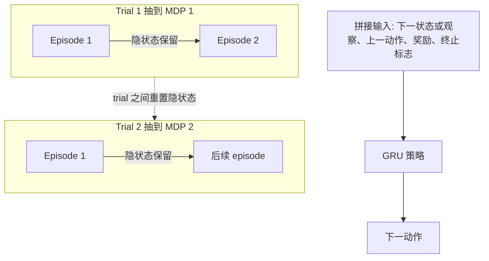

# RL²：把「快」的强化学习算法写进 RNN，用「慢」的强化学习去训它

<!-- release-date: 2016-11-09 -->

**本文依据**：`RL²: Fast Reinforcement Learning via Slow Reinforcement Learning`，Under review as a conference paper at ICLR 2017，arXiv **1611.02779v2**（[cs.AI] 10 Nov 2016），**14** 页。作者 Yan Duan†‡、John Schulman†‡、Xi Chen†‡、Peter L. Bartlett†、Ilya Sutskever‡、Pieter Abbeel†‡；† UC Berkeley EECS，‡ OpenAI。本文机构按封面第一单位记为 **UC Berkeley**（兼 OpenAI）。原件首次公开日取 arXiv **v1** 提交日 **2016-11-09**（Submitted on 9 Nov 2016）；解读依据本地已核的 **v2**（`pdfinfo` Pages: 14）。文中数字都标 PDF 页码；标「外部补充」的段落不来自本文。

## 一句话

深度强化学习能学出复杂行为，但每次都像从零重建世界模型，样本贵得离谱。RL² 不手写一套「快」算法，而是把快算法**编码进 RNN 的权重**，再用现成的通用强化学习（文中是 TRPO）当「慢」算法去训这组权重。RNN 每个时间步吃进观察、动作、奖励、终止标志；在同一个 MDP 的多个 episode 之间**不重置隐状态**，隐激活就是快算法在当前未见过 MDP 上的内部状态（PDF p.1）。

## 一、矛盾：会玩，但学得太慢

当时深度 RL 已经能从像素打 Atari、学操作和步态（PDF p.1）。代价是样本：文中写，当时最强 Atari 结果每个游戏要**数万个 episode**；按不间断玩，大约 **40 天**。同一篇对照里，人类玩家大约 **2 小时**就能掌握一款游戏（PDF p.1，引 Mnih et al. 2015）。

作者把差距主要归到**缺少好先验**：智能体每次都要从头搭世界知识。贝叶斯强化学习在原则上能塞先验，但精确贝叶斯更新几乎只在最简单情形可算。实践里常把贝叶斯想法和领域假设混在一起压样本，例如未知动力学下的 guided policy search、PILCO：真实经验从几分钟到几小时，而当时若干深度方法要按天甚至按周计。它们要么假设环境可仪器化（学习时能拿到状态），要么一到高维就算不动（PDF p.1–2）。

于是问题换成：能不能**不手写**领域专用快算法，而把「智能体自己的学习过程」当成一个可优化目标？

## 二、把学习过程本身当成一次强化学习

### 慢目标：在 MDP 分布上平均一次 trial 的回报

作者假设有一族 MDP $\mathcal{M}$，以及其上的分布 $\rho_{\mathcal{M}}$。不必写出密度，只要能采样。对抽到的某一个 MDP，允许交互 **$n$** 个 episode。这样一连串、固定 MDP 上的 episode，叫做一次 **trial**（PDF p.2）。

普通策略搜索最大化**一个 episode** 的折扣回报。这里最大化的是**一次 trial** 里累积的期望折扣回报，等价于压累积伪遗憾（PDF p.3）。因为 trial 之间 MDP 会换，只要不同 MDP 需要不同策略，智能体就必须根据「我现在在哪个 MDP」的信念改行为，从而被迫整合过去的动作、奖励、终止标志，并持续改策略。这就是端到端的「学一个快 RL 算法」（PDF p.3）。

内层问题在正文里先写成 MDP，便于讲清；方法对 POMDP **没有概念上的改动**，智能体收到的是观察 $o_t$ 而不是状态 $s_t$。第三节视觉导航就是 POMDP 实例（PDF p.3）。

### 一次交互里 RNN 看见什么

根据 Figure 1（PDF p.2）：每个 trial 抽一个 MDP；每个 episode 按该 MDP 的初始分布重新抽 $s_0$。智能体出动作 $a_t$，环境给奖励 $r_t$、下一步状态 $s_{t+1}$；若本 episode 结束，终止标志 $d_t=1$，否则默认 $0$。下一状态、上一动作、奖励、终止标志拼成策略输入。策略在隐状态 $h$ 上产生下一隐状态和下一动作。

关键两条边界（PDF p.2–3）：

- **episode 结束时隐状态保留到下一 episode**（同一 trial、同一 MDP）。
- **trial 之间不保留**（换 MDP 时清掉）。

第一步没有「上一动作 / 奖励 / 终止」时，用占位，保证输入维度一致（PDF p.3 脚注 1）。附录写死：离散动作实验里，动作用动作 $0$ 的嵌入占位，奖励和终止用 $0$（PDF p.13）。

上图按 PDF p.2 Figure 1 的机制重画，不是原图描摹。

### 策略：GRU + softmax；优化：TRPO

策略是通用 RNN。每步把 $(s,a,r,d)$ 经嵌入 $\phi$ 送进 GRU，减轻消失 / 爆炸梯度；GRU 输出再接全连接和 softmax，得到动作分布（PDF p.3）。作者试过「每个 episode 显式重置一部分隐状态」的变体，**没有**比上述简单结构更好（PDF p.3）。

外环用现成 RL。文中用 TRPO 的一阶实现：经验表现好，超参不用拧太狠（PDF p.3）。基线也是 GRU RNN，用来压随机梯度方差；可选 GAE 再压方差（PDF p.3）。

这里 TRPO 只是外环「慢」算法的实现选择，不是本文要讲的信任域方法专篇。

## 三、小规模：多臂赌博机，对上有渐近保证的算法

多臂赌博机是无状态 MDP： $k$ 个臂，每步拉一根，奖励来自未知分布。实验里每臂是参数 $p_i$ 的伯努利。挑战是探索与利用（PDF p.4）。

$\rho_{\mathcal{M}}$：每个 $p_i$ 在 $[0,1]$ 上均匀。对照：Random、Gittins 指标、UCB1、Thompson sampling（TS）及其乐观变体 OTS、$\varepsilon$-Greedy、Greedy。贝叶斯方法（Gittins、TS）**拿到真实分布** $\rho_{\mathcal{M}}$。有超参的方法每个设定单独网格搜索（PDF p.4）。

Table 1：每个格子是 **1000** 个不同赌博机实例上的平均总奖励。$k\in\{5,10,50\}$，$n\in\{10,100,500\}$。每行加粗均值最好的，以及单侧 $t$ 检验 $p=0.05$ 下与最好者无显著差异的其他方法（PDF p.4）。

| Setup | Random | Gittins | TS | OTS | UCB1 | $\varepsilon$-Greedy | Greedy | RL² |
|---|---:|---:|---:|---:|---:|---:|---:|---:|
| $n=10$, $k=5$ | 5.0 | 6.6 | 5.7 | 6.5 | 6.7 | 6.6 | 6.6 | 6.7 |
| $n=10$, $k=10$ | 5.0 | 6.6 | 5.5 | 6.2 | 6.7 | 6.6 | 6.6 | 6.7 |
| $n=10$, $k=50$ | 5.1 | 6.5 | 5.2 | 5.5 | 6.6 | 6.5 | 6.5 | 6.8 |
| $n=100$, $k=5$ | 49.9 | 78.3 | 74.7 | 77.9 | 78.0 | 75.4 | 74.8 | 78.7 |
| $n=100$, $k=10$ | 49.9 | 82.8 | 76.7 | 81.4 | 82.4 | 77.4 | 77.1 | 83.5 |
| $n=100$, $k=50$ | 49.8 | 85.2 | 64.5 | 67.7 | 84.3 | 78.3 | 78.0 | 84.9 |
| $n=500$, $k=5$ | 249.8 | 405.8 | 402.0 | 406.7 | 405.8 | 388.2 | 380.6 | 401.6 |
| $n=500$, $k=10$ | 249.0 | 437.8 | 429.5 | 438.9 | 437.1 | 408.0 | 395.0 | 432.5 |
| $n=500$, $k=50$ | 249.6 | 463.7 | 427.2 | 437.6 | 457.6 | 413.6 | 402.8 | 438.9 |

作者观察：RL² 几乎赶上专为赌博机设计、带最优性保证的算法。那些发表算法多半优化**渐近遗憾**而不是有限视野遗憾，有限视野里留了一点超过它们的空间（PDF p.4）。

最难一档 $50$ 臂、$500$ episode，Gittins 与 RL² 有可见差距。作者用 **Gittins 轨迹做监督**、同一套策略结构：测到与 Gittins 同级，说明表达力够，瓶颈更像外环「慢」RL，而不是 RNN 装不下算法（PDF p.5）。

学习曲线 Figure 2：相对 Gittins 归一到 $1$、随机到 $0$（PDF p.4–5）。附录超参：折扣 $0.99$，GAE $\lambda=0.3$，策略迭代最多 $1000$，GRU $256$，mean KL $0.01$，batch $250000$；状态用常数 $0$ 占位，动作 one-hot（PDF p.13）。

## 四、有限 MDP：短 trial 里甚至超过经典贝叶斯方法

赌博机没有序列决策。下一步用随机生成的表格 MDP：状态动作少到转移可以写成表（PDF p.5）。对照：Random、PSRL（Thompson sampling 到 MDP 的推广）及乐观变体 OPSRL、BEB、UCRL2、$\varepsilon$-Greedy、Greedy（PDF p.5–6）。

分布：$|S|=10$，$|A|=5$。奖励高斯、方差 $1$，均值独立 $\mathrm{Normal}(1,1)$。转移来自平坦 Dirichlet。与贝叶斯 RL 常用先验对齐。每 episode 视野 $T=10$，**总从第一状态出发**（PDF p.6）。

Table 2（PDF p.6）：

| Setup | Random | PSRL | OPSRL | UCRL2 | BEB | $\varepsilon$-Greedy | Greedy | RL² |
|---|---:|---:|---:|---:|---:|---:|---:|---:|
| $n=10$ | 100.1 | 138.1 | 144.1 | 146.6 | 150.2 | 132.8 | 134.8 | 156.2 |
| $n=25$ | 250.2 | 408.8 | 425.2 | 424.1 | 427.8 | 377.3 | 368.8 | 445.7 |
| $n=50$ | 499.7 | 904.4 | 930.7 | 918.9 | 917.8 | 823.3 | 769.3 | 936.1 |
| $n=75$ | 749.9 | 1417.1 | 1449.2 | 1427.6 | 1422.6 | 1293.9 | 1172.9 | 1428.8 |
| $n=100$ | 999.4 | 1939.5 | 1973.9 | 1942.1 | 1935.1 | 1778.2 | 1578.5 | 1913.7 |

$n$ 小时 RL² **大幅超过**现有方法；$n$ 变大优势反转，外环 RL 更难。作者解释：刻画该 MDP 大约要估 **140** 个自由度，到第 $10$ 个 episode 样本不够估全动力学。直接优化 RNN，可以更早转入利用（PDF p.6–7）。Figure 3 相对 OPSRL 归一（PDF p.6）。附录：折扣 $0.99$，GAE $\lambda=0.3$，迭代最多 $10000$，GRU $256$，mean KL $0.01$，batch $250000$；状态和动作各自 one-hot 再拼接（PDF p.13）。

## 五、视觉导航：高维里还能用上一局的记忆

前两任务状态都很低维。第三项在 ViZDoom 上做视觉迷宫：随机迷宫、随机目标。到达 $+1$，撞墙 $-0.001$，每步 $-0.04$ 促快到。同一 maze 结构和目标在多个 episode 内固定。最优策略：第一局有效探索定位目标，之后按已收集信息最优行动（PDF p.6–7）。

视觉导航本身就难：训练时奖励极稀，开头没有高效探索原语，还要用记忆记住走过哪。Oh et al. 2016 在 Minecraft 做过类似任务，但用高层动作；本文里等价高层动作大约要 **5** 个低层动作正确组合。RL² 要从低层动作学起（PDF p.7）。

训练：迷宫 **$5\times5$**（离散格子沿墙的格数），**2** 个 episode，每 episode 视野最多 **250**。每次 trial 从 **1000** 个随机地图 + 目标配置里抽 1 个。测试用另外 **1000** 个配置。外推两条轴：（1）测 **$9\times9$**；（2）小迷宫和大迷宫都跑到 **5** 个 episode。大迷宫每 episode 视野再乘 **4**（PDF p.7）。

Table 3 用 Figure 5 里**最好的一次 run**（PDF p.7）。3c：第二局轨迹长度不超过第一局的迷宫比例。

平均成功轨迹长度（PDF p.7）：

| Episode | Small | Large |
|---|---:|---:|
| 1 | $52.4\pm1.3$ | $180.1\pm6.0$ |
| 2 | $39.1\pm0.9$ | $151.8\pm5.9$ |
| 3 | $42.6\pm1.0$ | $169.3\pm6.3$ |
| 4 | $43.5\pm1.1$ | $162.3\pm6.4$ |
| 5 | $43.9\pm1.1$ | $169.3\pm6.5$ |

成功率：小迷宫五局约 **99.3%–99.7%**；大迷宫约 **97.1%、96.7%、95.8%、95.6%、96.1%**。%Improved：小 **91.7%**，大 **71.4%**（PDF p.7）。

前两局轨迹明显变短，说明用上了过去 episode。再往后大致能维持，大迷宫成功率略掉。大迷宫改进比例更低，作者认为还没学会在更大迷宫上最优行动（PDF p.8）。即便小迷宫，也不会完美复用：Figure 6 里常见行为是记住目标、第二局直奔；偶尔第二局忘掉、继续探索。作者认为更好的外环 RL 会改善这些结果（PDF p.8）。

Figure 5：不同 RNN 随机初始化曲线差很大（PDF p.8）。附录：图像缩到宽 **40**、高 **30**、RGB，再把 RGB 收到 $[-1,1]$；两层卷积，各 **16** 个 $5\times5$ 滤波、步长 **2**；动作学成 **256** 维嵌入，与卷积展平拼接，再进 **256** 隐单元全连接。与前两实验不同，**策略和基线共享同一网络**，作者发现基线更稳、策略最终更好，可能来自共享权重的正则和更好特征。折扣 $0.99$，GAE $\lambda=0.99$，迭代最多 $5000$，GRU $256$，mean KL $0.01$，batch $50000$（PDF p.13–14）。

实现栈：TensorFlow 与 rllab；经典算法用 TabulaRL（PDF p.13）。视频链接文中给出 `https://goo.gl/rDDBpb`（PDF p.7 脚注 2）。

## 六、作者怎么给自己定位（相关工作只取边界）

先验加速 RL 早已有：调学习率 / 温度当元学习、层次贝叶斯维持动力学后验再乐观 Thompson、层次 RL 抽可复用技能（PDF p.8）。监督侧 one-shot、把元学习写成可端到端梯度的优化（Younger、Santoro、Vinyals 等）是灵感来源；那些工作在监督设定，本文在更一般的 RL 设定——不但要利用已有信息，还要**学会探索**，监督里通常没有这一项（PDF p.9）。另一路元学习对优化过程做显式参数更新（Hochreiter、Andrychowicz、Li & Malik）；本文**不用一份直接参数化的内层策略**，RNN 智能体同时是元学习器和结果策略（PDF p.9）。

外环本质上在解一个 POMDP：底层 MDP 对智能体不可见。未知 MDP 收成 POMDP 可追溯到对偶控制（Feldbaum 1960）：原则上动态规划可解，通常不可行。这类结构也称 mixed observability MDP；那里的方法仍受高维 POMDP 之苦（PDF p.9）。

## 七、限制：论文自己划的边界

Discussion（PDF p.9）：

- 小规模上与理论上最优算法可比；高维任务只展示了**潜力**，不是已经打平专用算法。
- 外环 RL 被实验标成**当下瓶颈**（赌博机监督对照、导航遗忘、表格 MDP 长大 $n$ 后优势反转）。
- 极长视野可能还要更好的策略结构。
- 外环算法和策略都用了通用方法，**忽略了底层的 episode 结构**；作者预期吃进该结构会明显提升。

论文没写：后续 meta-RL 姓氏、MAML 内外环梯度、PPO 替换 TRPO 的结果。那些是别的材料。

## 八、可迁移的几条（读本文能带走的，不是 2017 之后的 folktale）

1. **快算法可以是隐状态上的计算，慢算法只训权重。** 部署时不必再跑一套手写贝叶斯更新，前向一遍 RNN 就是在「学习」。
2. **给 RNN 的不只是观察。** 动作、奖励、终止必须进输入，否则它没有标准 RL 算法该有的信息。
3. **跨 episode 保留状态，跨 trial 清掉。** 前者让「这一个 MDP」能被记住；后者防止串台。
4. **在有结构的任务分布上，学出来的有限视野行为可以不同于渐近最优公式。** 表格 MDP 短 $n$ 更早利用，是直接优化 trial 回报的后果，不是实现 bug。
5. **表达力够不等于外环训得动。** 监督能拟合 Gittins、RL 拟合不满时，该换慢算法或吃 episode 结构，而不是先把 GRU 加宽。

## 关键词回看

- **Trial**：固定 MDP 上连续 $n$ 个 episode 的一整段交互；优化目标定义在 trial 上，不是单 episode。
- **快 / 慢 RL**：快算法存在 RNN 激活里，在当前 MDP 上几步内适应；慢算法（本文 TRPO）缓慢更新 RNN 权重，把 $\rho_{\mathcal{M}}$ 里的先验蒸进去。
- **终止标志 $d_t$**：告诉 RNN 本 episode 是否结束，从而能在不重置隐状态的前提下对齐「新开一局」。
- **Gittins / PSRL / UCRL2**：对照用的经典有保证或贝叶斯方法；RL² 的主张是「学出来接近它们」，不是推导新的遗憾界。
